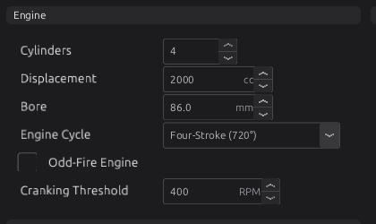

# How to use this manual

:material-circle:{ .level-basic } Basic

> **In one sentence:** this chapter tells you how the manual is laid out, what the marks and
> conventions in it mean, and how to find the one page you need.

## Overview

:material-circle:{ .level-basic } Basic

This manual covers the jayecu engine control unit (ECU) and **jayecu Studio**, the program you use on
your computer to set it up, tune it and watch it run. It takes you from wiring a new harness to
calibrating a running engine, and it is also the reference you come back to when something does not
behave the way you expect.

You can read it two ways:

- **Front to back**, if you are learning. Each part builds on the one before it, and each chapter says
  near the top what it expects you to know.
- **Dipped into**, if you have a question. Every section makes sense on its own, and search finds any
  setting by its name.

The manual is split into seven parts, in the order you meet them on a real installation:

| Part | What it covers | Start here if… |
|---|---|---|
| **I — Getting started** | This chapter, the system at a glance, installing the studio, a tour of it, the first connection and a quick-start checklist | you are new to jayecu |
| **II — Hardware and wiring** | The board and its connectors, tools, wiring practice, power and grounds, sensors, outputs, CAN and the rest of the vehicle | you are building or checking a harness |
| **III — Configuring the engine** | One chapter per job the ECU does: trigger, sensors, outputs, fuel, ignition, idle, boost, protection and the rest | you are setting up a function |
| **IV — Tuning** | Principles, then fuel, ignition, auto tune, knock and datalogging on a running engine | the engine runs and you are improving it |
| **V — Testing and troubleshooting** | Bench testing, trouble codes, and symptom-to-cause guides | something is wrong |
| **VI — Firmware and maintenance** | Updating firmware, recovering an ECU, files and backups, customising the studio | you are updating or looking after a system |
| **VII — Reference** | Every setting, every output channel, every trouble code, the trigger wheel library, the Lua API, the glossary | you need an exact fact |

!!! tip "The manual is inside the studio"
    **Help ▸ User Manual** (or <kbd>F1</kbd>) opens this manual in your web browser, from a copy installed with
    the studio, so it works with no internet connection.
    <!-- src: apps/studio-jf/main.cpp (Help ▸ User Manual, F1); apps/studio-jf/src/app/HelpPages.cpp (the copy beside the studio) -->

## Concepts

:material-circle:{ .level-basic } Basic

### Levels

Readers range from someone wiring their first ECU to a professional calibrator. So that each of you
can tell what is written for you, every section carries one level mark directly under its heading:

| Mark | Written for | What it assumes |
|---|---|---|
| :material-circle:{ .level-basic } **Basic** | Anyone | No knowledge of engine management. Every term is explained the first time it is used. |
| :material-circle:{ .level-intermediate } **Intermediate** | Someone with a running engine | You know what volumetric efficiency (VE), lambda and ignition timing are. |
| :material-circle:{ .level-advanced } **Advanced** | A calibrator, or someone wiring unusual hardware | You may be assumed to know the rest of the manual. |

A chapter usually starts Basic and ends Advanced. **You can stop at the first Advanced section and
still have a working setup.** The Advanced parts explain the finer points, the edge cases and how to
get the last few per cent; they are not steps you must finish.

A range such as :material-circle:{ .level-basic } Basic → :material-circle:{ .level-advanced } Advanced
under a heading means the section starts simple and ends deep.

### Callouts

Coloured boxes mark text that has a particular job. Each kind means one thing only:

| Box | Means |
|---|---|
| **Tip** | A better way, a shortcut, or a rule of thumb from experience. |
| **Note** | Background that helps you understand but that you do not need to follow along. |
| **Example** | A worked example with real values. |
| **Warning** | Getting this wrong can cost you time, a part, or a bad tune. |
| **Danger** | Getting this wrong can damage the engine or hurt someone: fuel, fire, a throttle that will not close, over-boost. |
| **Advanced** | A deeper aside. If you are reading at Basic level you can skip it. |

!!! danger "Read every Danger box"
    A Danger box is never decoration. If a section has one, read it before you change anything the
    section describes.

### Names in the studio

When the manual names something you will see on screen, it uses the studio's exact words in **bold**:
a menu item (**File ▸ Save Tune**), a button (**Burn**), a page (**Configuration ▸ Engine
Configuration ▸ Cylinders & Firing**) or a setting (**Cylinders**).

The arrow **▸** separates the steps of a path: a menu and its item, or the branches of the navigation
tree down to a page. Keys are shown like <kbd>Ctrl</kbd>+<kbd>S</kbd>.

!!! note "Your pages may not look exactly like the pictures"
    The pages, their order and the gauges on them come from a **layout** file, and you can change a
    layout (chapter 49). The screenshots in this manual show the layout that ships with the board. If
    you or your installer have rearranged yours, the settings are the same but they may sit in a
    different place. The chapter names the page the setting is on; type that page's name into the
    **Filter…** box above the navigation tree to find it.
    <!-- src: apps/studio-jf/main.cpp (Filter… filters the navigation tree) -->

### How settings are named

Every setting has two names, and this manual uses both.

- The **label** is what the studio shows on the page: **Cylinders**, **Activation RPM**, **Stoich
  AFR**. This is the name to look for on screen.
- The **path** is the setting's exact name inside the ECU's definition, written in `code`:
  `engine.cylinder_count`. It never changes when a page is rearranged, and it is what the settings
  reference is sorted by, so it is the name to search for when you need to be certain.

The first time a chapter mentions a setting it gives both, for example **Cylinders**
`engine.cylinder_count`. After that it uses the label alone.

<figure markdown>
  ![The label Cylinders and the path engine.cylinder_count; a list setting sensors.sensor[clt].enabled broken into group, list, element and setting; and the output channel rpm](../img/diagrams/overview-names.svg)
  <figcaption>Figure 1.1 — Reading a path. The part before the first dot is the settings group
  (one per firmware module). A list of similar things, such as sensors, names each member in square
  brackets. A live value such as <code>rpm</code> is an output channel, not a setting.</figcaption>
</figure>

A path reads from left to right, from the general to the particular:

- **The settings group** comes first. There is one group per firmware module (`engine`, `boost`,
  `fuel_calculator`, `sensors` and so on), and each group has its own page in the settings reference.
- **The setting** comes after the dot.
- **A list** of similar things, such as the sensors, is followed by the member in square brackets.
  The member is named, not numbered: `sensors.sensor[clt]` is the coolant temperature sensor wherever
  it sits in the list, so the name never points at the wrong sensor if the list grows.
  <!-- src: apps/studio-jf/src/model/TuneFile.cpp (stableTableKey: element ids, not positions); definition/boards/jaytek_v1.dashboard.gui (sensors.sensor[clt].enabled) -->

**Output channels** are named the same way but are not settings. A channel is a live value the ECU
reports, such as **Engine RPM** `rpm`, **Manifold Pressure** `map` or **Unburned Changes**
`config_dirty`. You watch channels on gauges and record them in logs; you cannot type a value into
one. Every channel is listed in [Output channels](../reference/channels.md).
<!-- src: shared/tuneit-meta.json telemetry.rpm / map / config_dirty (labels) -->

<figure markdown>
  
  <figcaption>Figure 1.2 — Settings as the studio shows them: the label on the left, the value and its
  units on the right. <b>Cylinders</b> here is <code>engine.cylinder_count</code>. Hold the pointer over
  a setting to see its help text.</figcaption>
</figure>

The help text that appears when you hold the pointer over a setting is the same text printed in the
settings reference. Both come from the ECU's definition, so they always describe the firmware you are
connected to.
<!-- src: apps/studio-jf/src/model/MetaModel.h (help = hover tooltip); manual/tools/gen_settings.py (reads shared/tuneit-meta.json) -->

### Units

The manual gives metric units first, with the other unit in brackets where readers commonly expect
it: kPa (psi), °C (°F), mm, ms, degrees, and lambda (AFR).

Three points catch people out:

- **Pressures are absolute.** A manifold pressure of 100 kPa is roughly atmospheric pressure at sea
  level, not "100 kPa of boost". 200 kPa absolute is about 100 kPa (1 bar, 14.5 psi) of boost at sea
  level. Where a setting is a *difference* between two pressures, its help text says so.
- **Angles are crank degrees.** Ignition advance is in degrees before top dead centre (BTDC), and a
  four-stroke engine cycle is 720°.
  <!-- src: definition/ecu.schema.yaml (engine.cycle_type options: 360° / 720° / 1080°) -->
- **Mixture is lambda.** Lambda 1.00 is the chemically correct (stoichiometric) mixture for whatever
  fuel you run; below 1 is rich, above 1 is lean. The manual gives AFR in brackets for petrol, where
  lambda 1.00 is about 14.7:1.

The studio can show many values in the unit you prefer. **Edit ▸ Preferences… ▸ Units** sets the unit
for each kind of quantity: pressure in kPa, bar, psi or Pa; temperature in °C, °F or K; speed, torque,
power, time and others. The **Metric** and **Imperial** buttons set a whole group at once. Until you
choose, each value appears in the unit the ECU's definition gives it. The unit you choose only changes
how a value is shown and typed; the ECU always stores the same number.
<!-- src: apps/studio-jf/src/model/UnitManager.cpp (quantities and units) (no preference = the base unit) (Metric/Imperial sets); apps/studio-jf/src/ui/PreferencesDialog.h (Units page) (Metric, Imperial); apps/studio-jf/main.cpp (Edit ▸ Preferences…) -->

**Metric** sets pressure to kPa, the unit this manual uses; **Imperial** sets it to psi. If you
prefer bar, choose it under **Pressure** and divide the manual's figures by 100.
<!-- src: apps/studio-jf/src/model/UnitManager.cpp -->

### Figures and numbers

Figures are numbered by chapter: Figure 24.3 is the third figure in chapter 24. Every figure has a
caption that tells you what to look at.

Screenshots in this manual are made by the studio itself, from a demonstration tune, with the
function being described switched on and set to the chapter's example values. The values you see are
examples, not recommendations for your engine.

**Defaults, ranges and units are never typed in by hand.** The settings tables at the end of each
chapter and in Part VII are generated from the same definition the studio loads, so they match the
firmware. If a number in the text ever disagrees with the settings table, trust the table, and please
report the difference.
<!-- src: manual/tools/gen_settings.py -->

## Procedure: finding what you need

:material-circle:{ .level-basic } Basic

1. **Know the name on screen?** Type it into the search box at the top of this page. Search matches
   words in headings, text and the settings tables, so a label such as *Activation MAP* or a path such
   as `boost.activation_kpa` both find the right place.
2. **Know the job, not the name?** Open the part that covers it (see the table under *Overview*) and
   pick the chapter from the index on the left. Part III has one chapter per function the ECU
   performs.
3. **Need the exact range, default or units of a setting?** Go to [Every setting, by
   module](../reference/settings/index.md), open the group (the part of the path before the first
   dot) and find the path.
4. **Have a symptom?** Start at the troubleshooting table at the end of the chapter for that function,
   or at the [Troubleshooting guide](../part5/45-troubleshooting.md) if you do not know which function
   is at fault. A trouble code such as P1710 is listed in [Trouble codes](../reference/dtc.md).
5. **Meet a word you do not know?** Look it up in the [Glossary](../reference/glossary.md).

### Reading a settings table

Every chapter about a function ends with its settings table, and Part VII has all of them. Each row
gives the label in bold, the path, the range, the default, the units if any, and the help text the
studio shows. This is the one for the **Engine** group:

--8<-- "reference/settings/_engine.table.md"

## Examples

:material-circle:{ .level-intermediate } Intermediate

!!! example "Example 1 — \"What does Activation MAP do?\""
    You have seen **Activation MAP** on the boost page and want to know what it does.

    1. Search for *Activation MAP*. The first result is chapter 24, *Boost*, section *Activation:
       when the module acts at all*. It explains the setting in context: boost control acts only
       when engine speed and manifold pressure are both above their activation values.
    2. For the exact default and range, open the settings table at the end of chapter 24 (or
       **Every setting, by module ▸ Boost**) and find the row for `boost.activation_kpa`.

!!! example "Example 2 — a warning on a new ECU"
    The studio shows a trouble code you have not seen before.

    1. Look the code up in [Trouble codes](../reference/dtc.md). The entry says which function raised
       it.
    2. Go to that function's chapter in Part III and read its **Diagnostics** section: what sets the
       code and what to check.
    3. If that does not settle it, use the chapter's **Troubleshooting** table, then chapter 44.

## Pitfalls

:material-circle:{ .level-basic } Basic

| Problem | Why it happens | What to do |
|---|---|---|
| A setting in the manual is not on your page | Your layout has been rearranged, or the page only appears once its function is switched on | Type the page name the chapter gives into the **Filter…** box above the navigation tree; switch the function on first |
| A pressure is far off what the manual says | The studio is showing bar or psi (see *Units*), or you are reading gauge pressure against the manual's absolute pressure | Check **Edit ▸ Preferences… ▸ Units**; remember that about 100 kPa is atmospheric |
| The manual describes a setting your studio does not have | Your ECU runs different firmware from the one this copy of the manual was built for | Use **Help ▸ User Manual** in the studio that came with your firmware, or update (chapter 46) |
| You copied the example values and the engine runs badly | Examples are starting points for a particular engine, not your engine | Read the chapter's *Tuning it* section and log before and after each change |

## Related

- Chapter 2 — [The system at a glance](02-system-overview.md): the parts of the system and how they
  connect
- Chapter 3 — [Installing jayecu Studio](03-installing-studio.md)
- Chapter 4 — [A tour of the studio](04-studio-tour.md)
- [Every setting, by module](../reference/settings/index.md) and the [Glossary](../reference/glossary.md)
