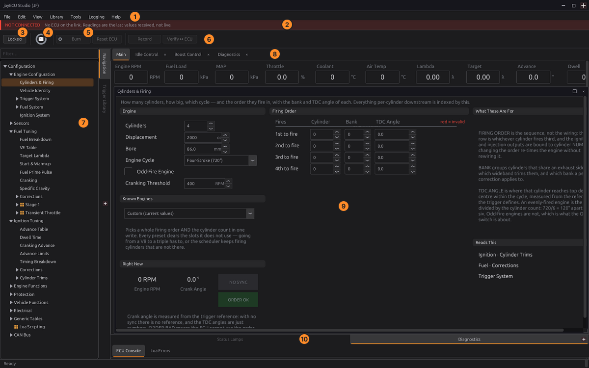
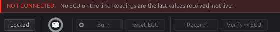

# The system at a glance

:material-circle:{ .level-basic } Basic → :material-circle:{ .level-advanced } Advanced

> **In one sentence:** a jayecu system is an ECU running firmware, jayecu Studio on your computer,
> a definition that tells the studio what the firmware contains, and your own files: the tune and the
> layout.

## Overview

:material-circle:{ .level-basic } Basic

An engine control unit (ECU) reads the engine's sensors, decides how much fuel to inject and when to
fire each spark plug, and drives the injectors, coils, valves and relays that make it happen. It does
this hundreds of times a second, on its own, whether or not a computer is plugged in.

You set it up and tune it from your computer, with **jayecu Studio**. The studio shows the ECU's
settings as pages of fields, tables and gauges. When you change a value, the studio sends it to the ECU
straight away and the engine uses it at once.

Six things work together, and most of what can go wrong between them is one of them not matching
another. This chapter explains each one and how they fit, so that the rest of the manual, and the
messages the studio shows you, make sense.

| Part | What it is | Where it lives |
|---|---|---|
| **The ECU board** | The hardware: a microcontroller, input circuits for sensors, drivers for outputs, three connectors | In the vehicle |
| **The firmware** | The program the ECU runs | In the ECU's flash memory |
| **jayecu Studio** | The program you tune with | On your computer (Linux or Windows) |
| **The definition** | A file describing every setting and live value the firmware has | In the studio's library, and on the ECU's SD card |
| **Your tune** | Every setting value: your calibration | In the ECU, and as a `.tune` file on your computer |
| **Your layout** | The pages, tables and gauges the studio shows | A `.gui` file on your computer |

<figure markdown>
  
  <figcaption>Figure 2.1 — The whole system. Blue boxes hold your tune; orange is what the ECU drives.
  One USB cable carries two things: the serial link the studio talks over, and the SD card, which
  appears on your computer as a drive only while the key is off.</figcaption>
</figure>

## Concepts

:material-circle:{ .level-basic } Basic → :material-circle:{ .level-advanced } Advanced

### The ECU board

:material-circle:{ .level-basic } Basic

The **jaytek_v1** board is built around an STM32F767 microcontroller. Everything the engine is wired
to arrives on three sealed connectors, each a different colour so they cannot be swapped:
<!-- src: definition/boards/jaytek_v1.board.yaml (board, mcu) (connectors) -->

| Connector | Colour | Pins | Carries |
|---|---|---|---|
| **CN2** | White | 35 | Ignition outputs and low-side outputs |
| **CN3** | Blue | 35 | Sensors: analog inputs, VR (variable-reluctance) inputs, digital inputs |
| **CN4** | Black | 23 | Power and grounds, high-side outputs, H-bridge outputs, knock inputs, CAN1 |

On those connectors you have:
<!-- src: definition/boards/jaytek_v1.board.yaml connectors[].terminals (counted by signal family) -->

| Kind | Count | Used for |
|---|---|---|
| Ignition outputs (IGN) | 12 | Coils |
| Low-side outputs (LS) | 22 | Injectors, solenoids, relays, anything switched to ground |
| High-side outputs (HS) | 8 | Anything switched to battery voltage |
| H-bridge outputs | 2 | Motors that must be driven both ways: an electronic throttle, a motorised wastegate |
| Analog voltage inputs (AV) | 15 | 0–5 V sensors: pressure, throttle position, pedal, wideband controllers |
| Analog temperature inputs (AT) | 4 | Thermistor sensors: coolant, air temperature |
| Digital inputs (DIG) | 8 | Switches, Hall sensors, frequency inputs |
| VR inputs | 2 | Crank and cam sensors: variable-reluctance, or Hall |
| Knock inputs | 2 | Knock sensors |
| CAN bus | 1 (CAN1) | Dashboards, scan tools, other controllers |

The microcontroller has a sixteenth analog input, AV12, wired inside the board to measure battery
voltage. It is not on a connector and cannot be assigned to a sensor. Chapter 7 gives the full pinout.
<!-- src: definition/boards/jaytek_v1.board.yaml pins[] AV12 (assignable: false, "battery voltage sense (fixed input)") -->

**Key on, key off.** The ECU decides that the ignition key is on when its battery voltage rises above
8.0 V, and that it is off when the voltage falls to 7.0 V or below. With the key off, even with the USB
cable plugged in and the studio connected, the ECU **fires no coil and no injector**, raises no
running trouble codes, and its sensor channels read zero. This is what lets you work on a tune at your
desk with the ECU powered from USB alone. The live channel **Key On** `key_on` shows which state the ECU
is in.
<!-- src: firmware/Sensors/Sensors.h (KEY_ON_V 8.0, KEY_OFF_V 7.0); firmware/Sensors/Sensors.cpp; firmware/Engine/EngineTask.cpp (firing gate = key on) (DTCs active only key on) -->

!!! note "Other boards"
    The firmware also builds for the Proteus F7 board. The appendix
    [Proteus F7 board](../reference/proteus-f7.md) covers its differences. Everything else in this
    manual applies to both, except where a chapter says otherwise.
    <!-- src: README.md §4 (boards: jaytek_v1, proteus_f7) -->

### The firmware

:material-circle:{ .level-basic } Basic → :material-circle:{ .level-intermediate } Intermediate

The firmware is the program in the ECU. It is made of **modules**, one for each job: Trigger, Fuel,
Ignition, Idle, Boost, Launch, Knock and so on. Many modules have an **Enabled** switch, and one that is
switched off does nothing at all. Each module has its own group of settings and its own chapter in
Part III.

The heart of the firmware is the **engine frame**, which runs 1000 times a second. In each frame the
sensors are read into **channels** (live values such as `rpm`, `map` and `clt`), the modules read
those channels and publish their own (a fuel pulse width, an ignition advance, a boost target), and
the outputs are driven from the result. Injection and spark events are then timed to the exact crank
angle by the trigger decoder, not by the frame.
<!-- src: firmware/Engine/EngineTask.cpp (1 kHz control frame; crank ISR applies at exact angle) (INPUT phase, cuts, output stage) -->

The firmware reports every channel to the studio as **live data**, raises **trouble codes** (DTCs)
when it finds a fault, and keeps a table of the codes it has seen. Chapter 44 covers trouble codes.

Every firmware build has a version, and every ECU reports it when the studio connects. The studio
shows it in its window title once connected.
<!-- src: firmware/version.h (JAYECU_SIGNATURE); apps/studio-jf/main.cpp (s_connTitle: board, version, layout_hash) -->

### jayecu Studio

:material-circle:{ .level-basic } Basic

The studio runs on Linux and Windows. Chapter 3 installs it and chapter 4 tours it; Figure 2.2 names
the main areas so that the rest of Part I can refer to them.

<figure markdown>
  
  <figcaption>Figure 2.2 — The studio window, here opened with no ECU attached (the red banner says
  so). The numbers are keyed to the list below.</figcaption>
</figure>

1. **Menu bar.** **File** holds ECUs, tunes and layouts; **Library** holds definitions, the trigger
   wheel library and TunerStudio import; **Help** holds this manual.
2. **Connection banner.** Shown whenever there is no live ECU. Values on screen are then the last ones
   received, not live.
3. **Locked / Editing.** Locked is for using the pages; Editing is for rearranging them (chapter 49).
   While Editing, the tune cannot be changed.
4. **Connect.** Finds the ECU on USB and connects to it (chapter 5).
5. **Burn.** Stores the tune permanently in the ECU. Its dot turns amber when there are changes the
   ECU has not stored yet (see *RAM and burn* below).
6. **Verify ↔ ECU.** Compares the studio's copy of the tune with the ECU's and sends any difference
   back.
7. **Navigation tree.** Every page, grouped as the layout arranges them. Type into **Filter…** above it
   to find a page by name.
8. **Surface tabs and gauges.** Tabs of gauges and panels you can keep open while you move between
   pages.
9. **The page** chosen in the tree: its fields, tables and help.
10. **Docks** for status lamps, diagnostics, the ECU console and Lua errors.

<!-- src: apps/studio-jf/main.cpp (File menu) (Library menu) (Help) (Locked/Editing, toolbar) (Verify re-pushes differences) (Filter…) (Editing locks the tune: Cache::setReadOnly); apps/studio-jf/src/ui/BurnButton.h (amber while unburned) -->

You can use the studio with no ECU attached. **File ▸ Open ECU…** opens the folder of an ECU the
studio has met before, with its tune and layout, and you can change values offline. Those changes live
only in the tune file until you next connect; the studio then shows you what differs and asks what to
do (see *Procedure* below).
<!-- src: apps/studio-jf/main.cpp (Open ECU…) (openTune: offline load) (reconcileTune) -->

!!! info "Advanced — other ECUs"
    The studio can also connect to ECUs that speak the TunerStudio protocol, from a TunerStudio `.ini`
    file brought in with **Library ▸ Import TunerStudio .ini…**. This manual covers jayecu ECUs; the
    parts of the studio that describe the ECU (pages, tunes, the burn) work the same way for both.
    <!-- src: apps/studio-jf/main.cpp (Import TunerStudio .ini…) (one reconcile for both protocols) -->

### The definition

:material-circle:{ .level-intermediate } Intermediate

The studio has no built-in knowledge of what the firmware contains. It learns it from the
**definition**: a file, made at the same time as the firmware, that lists:

- every setting: its label, units, range, default, help text and where it sits in the ECU's memory;
- every table and its axes;
- every live channel and where it sits in the live-data frame;
- the trouble codes, the trigger wheels the firmware can decode, the Lua functions it offers, and the
  navigation tree it suggests for its pages.
<!-- src: shared/tuneit-meta.json top-level keys (meta, protocol, hardware, config, telemetry, navigation_tree, trigger_wheels, lua_api, dtc_descriptions, …); apps/studio-jf/src/model/MetaModel.h -->

Because the definition comes with the firmware, a new firmware release can add a setting or a page
and the studio shows it without being updated itself. The reverse also holds: **the studio can only
show an ECU correctly with that firmware's own definition.**

A definition is stored under the name `<board> <layout_hash>.meta`, for example
`jaytek_v1 cb58c0dc.meta`. The studio keeps the ones it has met in its **definition library**. They
reach the library in three ways:

- **With a firmware kit.** The studio carries the firmware it can install, each build as a kit with
  its definition and layout. It copies every kit's definition into the library when it starts.
- **From the ECU's SD card.** Installing firmware also writes its definition to the ECU's SD card. A
  studio that has never seen that firmware fetches the definition from the card when it connects.
- **From the firmware's release.** A studio that meets firmware it has neither in its library nor on
  the ECU's card downloads that version's definition and layout from the release that shipped it,
  checked against the release's checksums. This is how a new laptop reads an ECU still on older
  firmware; it needs an internet connection the first time.
- **By hand.** **Library ▸ Load ECU Definition…** adds a definition file you have been given.
<!-- src: apps/studio-jf/main.cpp (installKitMetas) (fetch "<board> <hash>.meta" from the SD card) (Load ECU Definition…); apps/studio-jf/src/app/FirmwareUpgrade.h (upgrade writes .meta/.gui to the card); tools/push_meta.py -->

A definition also names the oldest studio that can read it, and the **format** it is written in. If
your studio is older than the first, or does not know the second, it says a newer studio is needed and
disconnects rather than guess. A layout shipped with the firmware names the studio it needs too; an
older studio still opens it, but says some parts may not show.
<!-- src: shared/tuneit-meta.json meta.min_studio, meta.meta_format; tools/meta_format.py; apps/studio-jf/src/model/MetaModel.cpp (kMetaFormat refusal); apps/studio-jf/main.cpp (needsStudio → tellNeedsStudio, link.close); tools/stamp_dashboard.py (builtFor.studio) -->

### The layout hash: how the studio matches an ECU to its definition

:material-circle:{ .level-intermediate } Intermediate → :material-circle:{ .level-advanced } Advanced

Every firmware build carries a **layout hash**: an eight-character code such as `cb58c0dc`, computed
from where every setting and live channel sits in memory. Two builds that store their settings the same
way have the same layout hash, even if one has better help text. Two builds that store them
differently, even by one byte, have different ones.
<!-- src: codegen/codegen.py (compute_layout_hash: config layout, signal catalogue, telemetry layout; not labels/units/defaults/help); generated/schema_meta.h -->

The layout hash is what makes a stored tune safe to use:

- **The studio** reads it from the ECU when it connects, and loads only the definition with the same
  hash. A definition for a different layout would put every value in the wrong place.
- **The ECU** stores it with every burned tune, and at power-up it loads only a tune whose hash and
  size match the firmware it is running. A tune burned by different firmware is ignored rather than
  read into the wrong places.
<!-- src: apps/studio-jf/main.cpp (match library .meta by hash); firmware/Storage/StorageManager.cpp (candidates gated on layout_hash and length); firmware/main.cpp -->

When the studio connects, the ECU identifies itself with one line of text:

```
jayecu jaytek_v1 0.4.0 84f5a20 cb58c0dc <24-character ECU ID> t992
```

In order: the product, the board, the firmware version, the build, the **layout hash**, the ECU's own
factory ID (unique to that microcontroller, and how the studio tells your ECUs apart), and the size of
the live-data frame in bytes. If the frame size does not match the definition's, the studio warns you
in the status bar: the live values would be decoded from the wrong places.
<!-- src: firmware/Comms/CommsManager.cpp (fill_identity); apps/studio-jf/main.cpp (identity parsed; telemetry size mismatch warning) -->

!!! info "Advanced — what changes the layout hash"
    Adding, removing, moving or resizing a setting, a table or a live channel changes it. So does a
    change to the list of signals a selector can point at, because a selector setting stores a
    position in that list. Changing a label, a unit, a range, a default or help text does not.
    <!-- src: codegen/codegen.py -->

### Tunes

:material-circle:{ .level-intermediate } Intermediate

Your **tune** is the value of every setting and every table cell: the calibration of your engine. It
exists in two places:

- **In the ECU**, where the engine uses it.
- **On your computer**, as a `.tune` file. The studio keeps it in step with the ECU while you work, so
  that you have a copy that does not depend on the ECU.

A `.tune` file is a readable text file (JSON) in which every value is stored under its **path**, not
by its position in memory. Settings that point at something, such as a sensor's input pin or the
signal a switch reads, are stored by name. The file also records the layout hash it was saved with.
<!-- src: apps/studio-jf/src/model/TuneFile.cpp (jayecu-tune/2: scalars, tables, axes, arrays, expressions keyed by path; references by name); apps/studio-jf/src/model/TuneFile.h -->

That is what lets a tune outlive the firmware it was made on. When a `.tune` file is loaded against a
different definition, each value finds its setting by path. The studio then tells you how many values
it **kept**, how many new settings were left at their **defaults**, and which values it **dropped**
because the new firmware no longer has that setting. A reference to a pin or signal that no longer
exists is reported by name and left at its default, rather than pointed somewhere else.
<!-- src: apps/studio-jf/src/model/TuneFile.h (MigrationReport: migrated, defaulted, unmapped, unresolved); apps/studio-jf/main.cpp (status "migrated: … kept, … defaulted, … dropped") -->

The studio saves the tune file when you use **File ▸ Save Tune** (<kbd>Ctrl</kbd>+<kbd>S</kbd>), and on
its own when you disconnect, open another tune or ECU, or quit. A new ECU's tune is called `current`
until you name it.
<!-- src: apps/studio-jf/main.cpp (Save Tune) (disconnect) (switching) (close) (default name "current") -->

**Restore points.** Every time the studio connects, it saves the tune it reads from the ECU, before
anything is changed, as a restore point named after your tune and the date and time. **Edit ▸ Restore
Tune to Connect Point** puts the as-connected tune back, and **File ▸ Open Tune…** lists the restore
points beside your tunes. A restore point is an exact copy of that firmware's memory, so it can only be
loaded into an ECU running the same layout.
<!-- src: apps/studio-jf/main.cpp (restore point written on connect: the ECU image, raw) (Open Tune lists connect points; size check) (Restore Tune to Connect Point) -->

### Layouts

:material-circle:{ .level-basic } Basic

The **layout** decides what you see: the navigation tree, each page's fields and tables, and the
gauges on the surface tabs. It is a `.gui` file, and each ECU has its own, called `dashboard.gui`.
<!-- src: apps/studio-jf/src/model/Ecu.h -->

The first time the studio meets an ECU, it takes the layout that ships for that board. Chapter 49
explains how to change it. The studio does **not** save the layout on its own. Use **File ▸ Save
Layout** (<kbd>Ctrl</kbd>+<kbd>Shift</kbd>+<kbd>S</kbd>), or answer the prompt when you close.
<!-- src: apps/studio-jf/main.cpp (Save Layout) (prompt on close: the layout is not auto-saved) -->

The tune and the layout are separate on purpose: the same tune can be shown through different
layouts, and a layout can be shared between ECUs of the same board.

### Your files on disk

:material-circle:{ .level-intermediate } Intermediate

The studio keeps everything in one folder:

- **Linux:** `~/.local/share/jayecu/jayecu Studio/`
- **Windows:** `%APPDATA%\jayecu\jayecu Studio\`
<!-- src: apps/studio-jf/src/model/StudioPaths.cpp -->

```
jayecu Studio/
├── ecus/
│   └── <ECU ID>/                one folder per ECU, named by its factory ID
│       ├── ecu.json             board, last port, last tune used
│       ├── dashboard.gui        this ECU's layout
│       ├── tunes/
│       │   └── current.tune     your tunes
│       └── restore/
│           └── current 2026-09-25 14.02.tune   restore points
├── meta/                        the definition library
│   └── jaytek_v1 cb58c0dc.meta
├── dashboards/                  layouts, one per firmware layout
│   └── jaytek_v1 cb58c0dc.gui
└── firmware/                    firmware kits the studio has downloaded
```
<!-- src: apps/studio-jf/src/model/Ecu.h; apps/studio-jf/main.cpp (meta) (firmware), g_loadProjectDoc (dashboards/<board>.gui) (restore point name format "%Y-%m-%d %H.%M"); apps/studio-jf/src/model/StudioPaths.cpp -->

Chapter 48 covers backing these files up and moving them to another computer.

### RAM and burn

:material-circle:{ .level-basic } Basic → :material-circle:{ .level-advanced } Advanced

The ECU holds its tune in two kinds of memory:

- **RAM**, which the engine runs from. It is fast, and every change you make in the studio goes
  there at once, but it is lost when the ECU loses power.
- **Flash**, which keeps the tune with the power off. Writing to it is called a **burn**.

So a change is **live** the moment you make it, and **permanent** only once you burn it. The ECU
publishes **Unburned Changes** `config_dirty` while its RAM holds anything flash does not, and the
studio shows this on the **Burn** button: an amber dot and edge while there is something to burn,
a brief green dot once a burn has landed, and a dim outline when there is nothing to burn.
<!-- src: firmware/Comms/CommsManager.cpp (config dirty = generation != saved generation); apps/studio-jf/src/ui/BurnButton.h -->

<figure markdown>
  
  <figcaption>Figure 2.3 — From an edit to a stored tune. Where a burn goes depends on whether the
  engine is running and whether an SD card is fitted. The red path is the one to avoid.</figcaption>
</figure>

**Where a burn goes.** A burn always stores the whole tune, but where it goes depends on the engine:
<!-- src: firmware/Storage/StorageManager.cpp (burn) (program inactive bank, verify, swap); firmware/main.cpp (save task) -->

- **Engine stopped:** straight to flash. The ECU keeps two flash copies (banks A and B). It writes the
  spare one, checks it, and only then makes it the active one, so a power cut during a burn leaves the
  previous tune intact.
- **Engine running, SD card fitted:** to the SD card. Writing the card does not disturb the engine.
  At the next power-up the ECU copies the tune from the card into flash.
- **Engine running, no SD card:** writing internal flash stops the processor for about 1–2 seconds,
  and no spark or injection can be timed while it is stopped. So the ECU **stops the engine first**,
  parking every coil and injector output safely, and then writes flash.
<!-- src: firmware/Storage/StorageManager.cpp (~1-2 s flash stall); firmware/main.cpp (prestall hook: firing gate off, outputs quiesced) -->

!!! danger "Burning with the engine running and no SD card stops the engine"
    Without an SD card, a burn while the engine is running cuts spark and fuel before it writes. On
    the road that is an engine that dies without warning. Fit an SD card if you tune while driving,
    or burn only with the engine stopped.

A burn takes a moment to land after you press **Burn**: the ECU acknowledges the request at once and
writes within the next couple of seconds. The **Burn** button does not turn green until the ECU reports
the tune stored. Do not remove power before then.
<!-- src: apps/studio-jf/src/ui/BurnButton.h; firmware/Cli/CliCommands.cpp (the better part of two seconds) -->

**At power-up** the ECU looks at both flash banks and the SD card and loads the most recent tune whose
layout hash and size match its firmware. If none matches (a new board, or firmware whose layout
differs from every stored tune) it starts with **no tune**. It still talks to the studio and still
reads the battery, so you can send a tune and burn it, but it will not run the engine until it is
reset with a valid tune stored. The studio shows a red **NO TUNE ON THE ECU** strip while this is so.
<!-- src: firmware/Storage/StorageManager.cpp (boot_arbitrate); firmware/main.cpp (g_no_tune: comms up, engine skipped) (battery still read) -->

**Changes that wait for the engine to stop.** Most changes, including every table and trim, take
effect in the next engine frame. A few would be dangerous to apply to a spinning engine: the trigger
setup, the cylinder count and firing layout, and which outputs fire which coils and injectors. The ECU
takes those into RAM at once but applies them only once the engine has stopped.
<!-- src: firmware/Comms/CommsManager.cpp (structural write flags module pending); firmware/main.cpp (reconfigure only when !g_engine_running) -->

### The USB link

:material-circle:{ .level-intermediate } Intermediate → :material-circle:{ .level-advanced } Advanced

The ECU connects to your computer with one USB cable, and appears as two devices at once:

- **A serial port** (on Linux `/dev/ttyACM…`, on Windows a COM port). The studio talks to the ECU over
  it.
- **A removable drive**: the ECU's SD card. It is present only while the ECU is not using the card
  (see *The SD card*).
<!-- src: firmware/Platform/stm32f7xx/usb_device.cpp (CDC + MSC composite); apps/studio-jf/src/comms/DeviceScanner.h -->

The studio talks to the ECU only over USB. The ECU never sends anything the studio has not asked for:
the studio asks, and the ECU answers. When you press **Connect**, the studio asks each USB serial port
on your computer to identify itself, and connects to the ones that answer as jayecu ECUs.
<!-- src: firmware/main.cpp (the USB transport is the only one added); firmware/Comms/CommsManager.cpp (identity polled, no unsolicited traffic); apps/studio-jf/src/comms/DeviceScanner.h -->

!!! info "Advanced — the protocol"
    Every message is a frame: two sync bytes `AA 55`, a type byte, a reserved byte, the total length
    (16-bit), a millisecond timestamp (64-bit), a sequence number that the reply echoes (16-bit), the
    payload, and a CRC-16/CCITT over everything before it. All numbers are little-endian. A frame
    carries at most one 1 KB block of settings, so a whole tune is read and written a block at a
    time.

    | Request | Byte | Does |
    |---|---|---|
    | Identity | `Q` | The identity line above |
    | Live data | `A` | One whole live-data frame |
    | Read / write settings | `r` / `w` | A range of the tune in RAM, by offset |
    | Burn | `b` | Store the tune (see *RAM and burn*) |
    | Console | `E` | Run a text command |
    | Trouble codes | `G` | The stored trouble-code table, a page at a time |
    | SD card | `0x20`–`0x25` | Take or release the card, read and write files on it |
    | Captures | `0x26`–`0x28` | Engine-cycle capture, trigger log, knock scope |
    | Clock | `0x29` | Read or set the ECU's real-time clock |

    <!-- src: firmware/Comms/OmniProtocol.h (framing) (commands); generated/schema_meta.h (JAYECU_BLOCK_SIZE 1024); firmware/Comms/CommsManager.cpp (read refuses > one block) -->

The studio also sets the ECU's clock from your computer's clock when it connects, so that files the ECU
writes to its SD card carry the right date. The jaytek_v1 has a clock battery and a 32.768 kHz clock
crystal, so its clock keeps time with the power off; the studio's setting just keeps it right. A board
without a battery restarts its clock from a fixed date every time it loses power, and until a studio
connects, its files carry that date.
<!-- src: firmware/Comms/OmniProtocol.h (RTC command); definition/boards/jaytek_v1.board.yaml (lse_hz, backup battery); apps/studio-jf/main.cpp (rtcSynced on connect) -->

### The SD card

:material-circle:{ .level-intermediate } Intermediate

The ECU has an SD card slot. Only one side can use the card at a time, and the key decides which:
<!-- src: firmware/Storage/SdArbitrator.h -->

| Key | Who has the card | What you see |
|---|---|---|
| Off | Your computer | The card appears as a USB drive |
| On | The ECU | The drive disappears from your computer |

Neither side is cut off in the middle of a write: when the key turns off the ECU finishes and closes
its files first, and when the key turns on it waits for your computer to finish writing. The studio
can also borrow the card over the serial link, with the key on or off, to read or write a file.

The ECU uses the card for:

- **The definition and layout** of its firmware, `<board> <layout_hash>.meta` and
  `<board> <layout_hash>.gui`, so that any studio can fetch them;
- **burns made with the engine running** (see *RAM and burn*);
- **onboard datalogs** (chapter 42);
- **learned values**, such as long-term fuel trims, and its **trouble-code history**.
<!-- src: tools/push_meta.py; firmware/Storage/SdArbitrator.h (writers: logger, config, fault log, comms, learned); firmware/main.cpp (learned region restored from SD) -->

The ECU runs without a card. It then cannot keep a burn made with the engine running without stopping
the engine, and it cannot hand a studio that has never seen its firmware the definition it needs.

### CAN bus

:material-circle:{ .level-intermediate } Intermediate

**CAN** is the two-wire network most modern vehicles use to connect their controllers. The ECU has two
CAN controllers; on the jaytek_v1, **CAN1** is on the black connector CN4 (**CAN H** pin 10, **CAN L**
pin 17). On it the ECU can:

- **answer an OBD-II scan tool**: live data, stored trouble codes, clearing codes, and vehicle
  information such as the VIN;
- **send and receive your own frames**, which you define in the tune: for a dashboard, another
  controller, or a sensor that reports over CAN. The studio has templates for common devices;
- **send and receive frames from a Lua script**.
<!-- src: definition/boards/jaytek_v1.board.yaml (can: CAN1, CAN2) (CN4 pin 10 CAN1 H, pin 17 CAN1 L); firmware/Can/ObdResponder.h; firmware/Can/GenericCan.h; firmware/Can/CanBroker.h -->

The studio does not connect over CAN; it always uses USB. Chapters 13 and 33 cover CAN wiring and
configuration.

!!! warning "OBD-II answers on CAN2 by default"
    **OBD-II Bus** `can.obd_bus` defaults to **CAN2**, and the jaytek_v1 brings only CAN1 out to a
    connector. If you wire a scan tool to CN4, set **OBD-II Bus** to **CAN1** or the scan tool gets no
    answer.
    <!-- src: definition/ecu.schema.yaml (obd_bus default 1 = CAN2); definition/boards/jaytek_v1.board.yaml connectors (no CAN2 terminal) -->

## Procedure

:material-circle:{ .level-basic } Basic → :material-circle:{ .level-intermediate } Intermediate

### What happens when you connect

:material-circle:{ .level-basic } Basic → :material-circle:{ .level-intermediate } Intermediate

You press **Connect**, and the studio works through these steps. Most of them happen without asking
you anything; the status bar reports each one. Chapter 5 walks through a first connection on screen.

<figure markdown>
  
  <figcaption>Figure 2.4 — Connecting. Steps 3 and 4 try each source from left to right and stop at
  the first that has what they need. Only the last step can ask you to change anything.</figcaption>
</figure>

1. **The ECU identifies itself** with its board, firmware version, layout hash and factory ID. The
   studio opens that ECU's folder, creating it the first time.
2. **Newer firmware?** If the studio holds a firmware kit newer than the ECU's firmware, it offers it.
   Nothing is changed unless you accept; chapter 46 covers the update.
3. **The definition** is found by layout hash: in the library first, then on the ECU's SD card, then
   in the release of the firmware the ECU runs (each kept in the library once found), and if none has
   it, the studio asks you to pick one or open a file.
4. **The layout** is this ECU's own `dashboard.gui` if it has one; otherwise the one drawn for its
   firmware, found the same way (library, SD card, release); failing those, the newest layout the
   studio has, which says on connect what it cannot find; and failing even that, a page tree built
   from the definition.
5. **The tune is read** from the ECU. Reading changes nothing. The studio saves what it read as a
   restore point.
6. **The tune is compared** with the one saved on your computer. If they match, you are connected.
   If they differ, the studio shows you every page that differs, with both values side by side, and
   asks:
    - **Keep the ECU's tune:** your saved tune is updated to match the ECU.
    - **Push _tune_ to the ECU:** your saved tune is written into the ECU's RAM. Burn it to keep it.
    - **Exit - no changes:** the studio disconnects and nothing is written anywhere.

    If the ECU has **no tune at all** (a new board, or a firmware update that did not put the tune
    back), there is nothing to compare. The studio asks *"This ECU has no tune"* instead and offers
    your saved tune or the firmware's default tune (chapter 47, section 2).
<!-- src: apps/studio-jf/main.cpp (identity handler: firmware offer, definition resolution), g_loadProjectDoc / g_fetchShippedDash (layout order) (read, restore point, reconcile, Push = writeConfigImage without burn, Cancel = close) (no-tune question); apps/studio-jf/src/ui/TuneDiffDialog.h (button labels) -->

!!! warning "A difference means the ECU was changed somewhere else"
    The studio keeps your tune file in step with the ECU while you work, so the two normally match.
    A difference at connect means the ECU was changed where this studio could not see it: another
    computer or another tuner. The dialog says when the ECU holds nothing but the firmware's
    defaults. Read the differences before you choose; one choice
    overwrites the ECU and the other overwrites your file.
    <!-- src: apps/studio-jf/main.cpp -->

### Making a change permanent

:material-circle:{ .level-basic } Basic

<figure markdown>
  
  <figcaption>Figure 2.5 — The toolbar. <b>Burn</b> is greyed out here because no ECU is connected;
  with one connected, its dot turns amber as soon as there is something to burn.</figcaption>
</figure>

1. **Make your change** on a page. The engine uses it at once, and the dot on **Burn** turns amber.
2. **Check the result** on the gauges or in a log. If it is wrong, change it back; nothing is stored
   yet.
3. **Press Burn.** Wait until the dot turns green. If no SD card is fitted, burn only with the engine
   stopped (see the Danger box above).
4. **Save the tune file** with **File ▸ Save Tune** if you want a copy on your computer now. The
   studio also saves it when you disconnect.

!!! tip "Reset ECU waits for a burn"
    **Reset ECU** waits up to 4 seconds for unburned changes to be stored before it restarts the ECU,
    so pressing **Burn** and then **Reset ECU** at once does not lose the burn. Anything still not
    stored after 4 seconds is lost.
    <!-- src: firmware/Cli/CliCommands.cpp -->

## Examples

:material-circle:{ .level-intermediate } Intermediate

!!! example "Example 1 — a new ECU on a new computer"
    You install the studio on a laptop that has never seen your ECU, and connect.

    1. The ECU answers `jayecu jaytek_v1 0.4.0 … cb58c0dc …`.
    2. The library has `jaytek_v1 cb58c0dc.meta`, because this studio shipped with that firmware kit.
       If it did not, the studio fetches the definition from the ECU's SD card, showing a progress
       window while it does.
    3. The ECU has no folder yet, so the studio creates one and takes the board's shipped layout.
    4. There is no saved tune on this laptop, so there is nothing to compare: the studio takes the
       ECU's tune as `current`, and saves it to a file when you save or disconnect.

    Nothing was written to the ECU.

!!! example "Example 2 — tuning at your desk, then connecting"
    Last night you opened the ECU with **File ▸ Open ECU…** and changed the warm-up table with no ECU
    attached. Today you connect in the car.

    1. The ECU's tune no longer matches your file, so the studio shows the warm-up table's page with
       the ECU's values and yours side by side.
    2. You choose **Push current to the ECU**. Your table is now in the ECU's RAM and the engine uses it.
    3. The **Burn** dot is amber. You start the engine, check the warm-up, stop it, and press
       **Burn**.

!!! example "Example 3 — firmware that moves the layout"
    A firmware update adds a setting, so the layout hash changes from `cb58c0dc` to a new value.

    - The ECU, after the update, ignores the tune burned by the old firmware, because its layout hash
      no longer matches.
    - The studio's update carries your tune across by path: it reads the tune with the old definition,
      matches every value to the new one, shows you what the new firmware adds and drops, writes the
      result, and burns it. Chapter 46 describes this step by step.
    <!-- src: apps/studio-jf/src/app/FirmwareUpgrade.h -->

## Pitfalls and troubleshooting

:material-circle:{ .level-basic } Basic → :material-circle:{ .level-advanced } Advanced

| Symptom | Likely cause | Check |
|---|---|---|
| Changes are gone after the ECU was switched off | They were never burned, or power was removed before the burn landed | Watch the **Burn** dot: burn, and wait for green |
| The engine died the moment you pressed **Burn** | Engine running with no SD card: the ECU stops the engine before writing flash | Fit an SD card, or burn with the engine stopped |
| A trigger, cylinder or output change has no effect | Those apply only once the engine has stopped | Stop the engine; the change applies then |
| "No schema for this ECU" or a request to choose a definition | The library has no definition for this layout hash and the ECU's SD card does not either | Load the definition that came with the firmware (**Library ▸ Load ECU Definition…**), or reinstall the firmware from the studio so it is written to the card |
| "Telemetry mismatch" in the status bar | The definition was built for a different firmware build with the same layout hash | Reinstall the firmware and definition together (chapter 46) |
| The ECU connects but runs nothing, with every value at zero | Key off: the ECU is powered from USB only | Turn the key on; watch **Key On** `key_on` |
| Red **NO TUNE ON THE ECU** strip; the engine will not run | No stored tune matches the firmware (after new firmware, or on a new board) | Answer the *"This ECU has no tune"* question, burn, and press **Reset ECU** (chapter 47) |
| The SD card does not show up on your computer | The key is on, so the ECU has the card | Turn the key off |
| On connect the studio says the ECU is at its **defaults** | The ECU holds exactly the firmware's default tune: someone put it there, or it was set up from new and never changed | **Push** your tune to the ECU, then **Burn** |
| A scan tool on CN4 gets no answer | OBD-II is answering on CAN2 | Set **OBD-II Bus** to **CAN1** |

## Related

- Chapter 3 — [Installing jayecu Studio](03-installing-studio.md)
- Chapter 5 — [First connection](05-first-connection.md)
- Chapter 7 — [The jaytek_v1 board](../part2/07-board.md): the full pinout
- Chapter 42 — [Datalogging and analysis](../part4/42-datalogging.md): onboard logging to the SD card
- Chapter 46 — [Updating firmware](../part6/46-updating-firmware.md)
- Chapter 48 — [Tunes, layouts and backups](../part6/48-files-backups.md)
- Chapter 49 — [Customising the studio](../part6/49-customising-studio.md)
