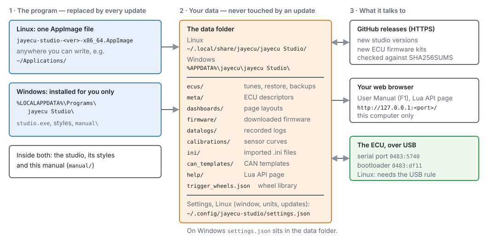
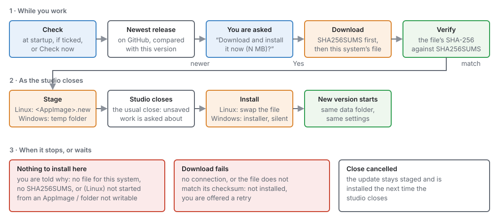
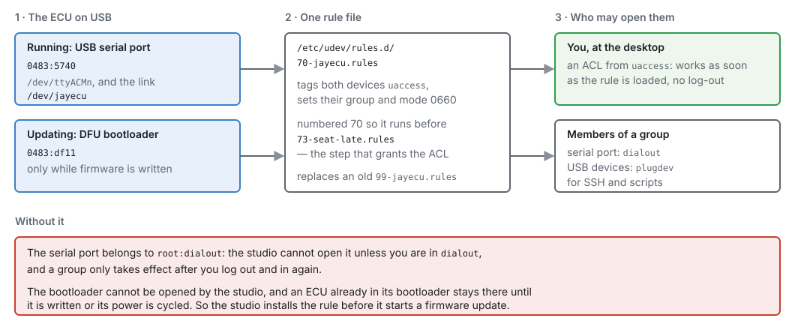
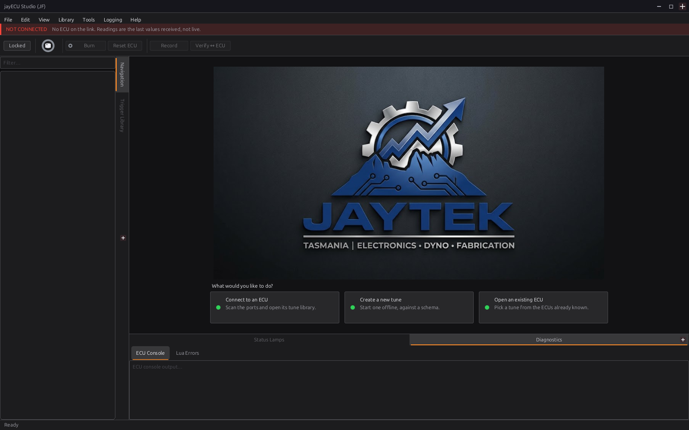
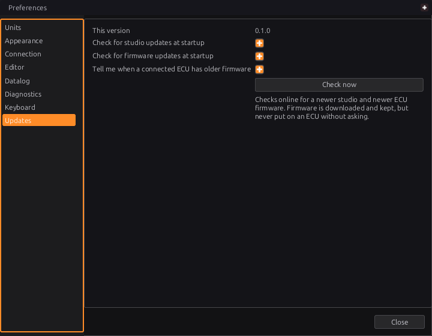

# Installing jayecu Studio

:material-circle:{ .level-basic } Basic → :material-circle:{ .level-advanced } Advanced

> **In one sentence:** jayecu Studio comes as one AppImage file on Linux and as an installer on
> Windows, keeps your tunes in a data folder that updates never touch, and can update itself.

## Overview

:material-circle:{ .level-basic } Basic

jayecu Studio is the program on your computer that talks to the ECU. You use it to configure and
tune the engine, record logs and update the ECU's firmware. This chapter covers:

- **installing it** on Linux (an AppImage) or Windows (an installer);
- **giving it permission to use the ECU's USB port** on Linux (the USB rule);
- **where it keeps your files**, so you can back them up or move them to a new computer;
- **keeping it up to date**, which it can do by itself;
- **opening this manual** from inside the studio (**F1**).

You need a 64-bit x86 computer (an ordinary Intel or AMD PC or laptop) for either system. There is
no build for ARM computers such as a Raspberry Pi or an Apple Silicon Mac.
<!-- src: apps/studio-jf/tools/make_appimage.sh (x86_64 only); apps/studio-jf/installer/studio.iss (x64compatible only) -->

!!! note "The studio and the ECU firmware are updated separately"
    This chapter is about the studio program. The ECU's own firmware has its own releases, and the
    studio downloads and offers those too (see *How updates work* below), but putting new firmware
    on an ECU is covered in chapter 46.

## Concepts

:material-circle:{ .level-basic } Basic

### The program and your data are kept apart

The studio keeps two kinds of files in two different places:

- **The program:** the studio itself, its styles, and a copy of this manual. An update replaces
  all of it.
- **Your data:** every ECU you have connected to, its tunes and restore points, datalogs, sensor
  calibrations, downloaded firmware and so on. It lives in a **data folder** in your user account.
  An update never touches it, and neither does uninstalling.
  <!-- src: apps/studio-jf/src/model/StudioPaths.cpp; apps/studio-jf/src/model/StudioPaths.h -->

<figure markdown>
  
  <figcaption>Figure 3.1 — Where things live. Blue is the program, which updates replace. Orange is
  your data, which they never touch. On the right is everything the studio connects to.</figcaption>
</figure>

The data folder is:

| System | Data folder | Settings file |
|---|---|---|
| Linux | `~/.local/share/jayecu/jayecu Studio/` | `~/.config/jayecu-studio/settings.json` |
| Windows | `%APPDATA%\jayecu\jayecu Studio\` | `settings.json` in the data folder |

<!-- src: apps/studio-jf/src/model/StudioPaths.cpp (data root: $HOME/.local/share on POSIX, %APPDATA% on Windows) (settings file) -->

The space in `jayecu Studio` is part of the name. Put quotes round the path when you type it in a
terminal. `~` means your home folder. `%APPDATA%` is usually `C:\Users\<you>\AppData\Roaming`, and
you can type it as it is into the Explorer address bar.

Inside the data folder:

| Folder or file | What it holds |
|---|---|
| `ecus/` | One folder for each ECU the studio has met, named by the ECU's unique ID. It holds that ECU's saved tunes (`tunes/`), restore points (`restore/`), its page layout (`dashboard.gui`) and the tune backups made before a firmware update (`backups/`). |
| `meta/` | ECU metas: the files that tell the studio what settings and channels a given firmware has. |
| `dashboards/` | Page layouts, one for each firmware layout (`<board> <layout hash>.gui`), from the shipped kit, an ECU's SD card or a firmware release. |
| `firmware/` | ECU firmware kits the studio has downloaded. |
| `datalogs/` | Logs you record in the studio, unless you choose another folder in **Edit ▸ Preferences ▸ Datalog**. |
| `calibrations/` | Your saved sensor calibration curves. They belong to the computer, not to one ECU. |
| `ini/` | TunerStudio `.ini` files you have imported or downloaded. |
| `can_templates/` | CAN templates. |
| `help/` | The Lua API page the studio writes when you open **Help ▸ Lua API Reference**. |
| `trigger_wheels.json` | Your trigger-wheel library. |

<!-- src: apps/studio-jf/src/model/Ecu.cpp (ecus/<uid>/tunes, restore, dashboard.gui, ecu.json); apps/studio-jf/src/app/FirmwareUpgrade.cpp (backups); apps/studio-jf/main.cpp (firmware, meta, dashboards, ini); apps/studio-jf/src/model/DatalogRecorder.cpp and apps/studio-jf/src/ui/PreferencesDialog.h (datalogs, Folder); apps/studio-jf/src/surface/Surface.cpp (calibrations); apps/studio-jf/src/ui/CanTemplates.h (can_templates); apps/studio-jf/src/app/HelpPages.cpp (help); apps/studio-jf/src/model/TriggerWheel.cpp (trigger_wheels.json) -->

!!! tip "Back up the data folder"
    Your tunes are in the data folder, not in the program. Copy the whole folder to back them up.
    To move to a new computer, install the studio there and copy the folder to the same place. The
    studio finds everything by that one path. Chapter 48 covers backups in detail.

### How updates work

The studio can check GitHub for a newer release of itself. It checks when it starts (you can
switch this off), or when you press **Check now** in **Edit ▸ Preferences ▸ Updates**. It only
looks at full releases. Drafts and pre-releases are never offered.
<!-- src: apps/studio-jf/main.cpp (releases/latest of jaytektas/jayecu) (startup check) (Check now); JFramework include/j/update/JRelease.h -->

When a newer version exists, the studio asks you first: *"jayecu Studio X is available. You have Y.
Download and install it now (N MB)?"*, with **Update** and **Not now**. Tick **Don't ask about X
again** before **Not now** and that version is not offered at startup again; the next version is, and
**Check now** still finds it, because then you asked. If you answer **Update**, it:

1. downloads the release's checksum file (`SHA256SUMS`), then the file for your system;
2. checks that the file's SHA-256 checksum matches the published one. If it does not match, nothing
   is installed;
3. puts the new version ready to install (it **stages** it) and closes the studio in the usual way.
   If you have unsaved work, you are asked about it as you would be at any close;
4. installs the new version once the studio has closed, and starts it.
<!-- src: JFramework include/j/app/JAppUpdater.h (offer: Update / Not now, updates.skipVersion) (download sums, then asset, verify, stage, requestClose); apps/studio-jf/main.cpp (installStaged after the main loop) -->

<figure markdown>
  
  <figcaption>Figure 3.2 — A studio update from start to finish. Nothing is installed until the file
  has passed its checksum and the studio has closed. Red boxes are where it stops with nothing
  changed.</figcaption>
</figure>

The install step is different on each system:

- **Linux:** the new AppImage is saved beside the running one as `<your AppImage>.new`. After the
  studio closes, it is renamed over the old file, keeping the old file's **name**, and started. So
  the update needs the folder the AppImage sits in to be one you can write to.
  <!-- src: JFramework src/update/JSelfInstaller.cpp -->
- **Windows:** the new installer is saved to your temporary folder. After the studio closes, it runs
  with a progress bar but asks no questions. It installs over the old copy and starts the new one when
  it finishes. It never restarts the computer.
  <!-- src: JFramework src/update/JSelfInstaller.cpp; apps/studio-jf/installer/studio.iss -->

If you cancel the close (for example, at the unsaved-changes question), the update stays ready and is
installed the next time you close the studio.
<!-- src: JFramework include/j/app/JAppUpdater.h -->

!!! info "Advanced — what a release must contain"
    The studio picks its file from the release by the end of its name: `-x86_64.AppImage` on Linux,
    `-setup.exe` on Windows. A release with no file for your system is reported ("There is no download
    for this system in that release"), and so is a release with no `SHA256SUMS` ("The release has no
    checksums, so it cannot be installed safely"). Neither is downloaded.
    <!-- src: JFramework include/j/update/JRelease.h; JFramework include/j/app/JAppUpdater.h -->

**ECU firmware** comes in the same releases, with its own version number. When the studio checks at
startup (or you press **Check now**), it also looks for newer firmware for every board it has
connected to before or has firmware for, and downloads any it finds into the data folder's `firmware/` folder. Each file
is checked against the release's checksums first. Downloaded firmware is **kept, never flashed**: the
studio only offers it when you connect to an ECU that runs older firmware, and asks before it changes
anything (chapter 46).
<!-- src: apps/studio-jf/main.cpp (s_checkFirmware); apps/studio-jf/src/app/FirmwareFetch.h; apps/studio-jf/src/ui/PreferencesDialog.h -->

### The USB rule (Linux only)

On Linux, a USB device that is not a keyboard, disk or similar belongs to the system administrator
(root) until a **udev rule** says who else may use it. The ECU appears on USB in two ways:

- **while it runs**, as a USB serial port (`0483:5740`), for connecting and tuning;
- **while its firmware is written**, as a DFU bootloader (`0483:df11`).
<!-- src: tools/udev/70-jayecu.rules -->

The studio carries its own rule, `70-jayecu.rules`, and can install it for you. The rule covers
both devices. It gives them to **the person logged in at the desktop** straight away, and to
members of the `dialout` group (the serial port) and the `plugdev` group (the USB devices), for use
over SSH or from scripts. It also makes a fixed name for the port, `/dev/jayecu`.
<!-- src: tools/udev/70-jayecu.rules; apps/studio-jf/src/app/FirmwareUpgrade.cpp (ecuRule) -->

<figure markdown>
  
  <figcaption>Figure 3.3 — One rule file covers both of the ECU's USB identities. The desktop user
  gets access at once. Group membership covers SSH and scripts.</figcaption>
</figure>

The studio **installs the rule when you first update an ECU's firmware**. Without it, the ECU would
switch into its bootloader and the studio could not open it. The ECU would then be stuck there until
it was written or its power was cycled. So the studio checks for the rule before it touches the ECU,
and asks: *"USB permission needed — To write firmware the studio needs permission to reach the
ECU's bootloader over USB. This is set up once, and the system will ask for your password. Set it up
now?"* Your password goes into the system's own prompt (`pkexec`), never into the studio.
<!-- src: apps/studio-jf/src/app/FirmwareUpgrade.cpp (Linux prompt); JFramework src/platform/JUdevRule.cpp; tools/udev/70-jayecu.rules -->

For **everyday connecting**, you may not need the rule at all: if your account is already in the
`dialout` group, the studio can open the serial port. If it is not, install the rule yourself before
your first connection (Procedure C below). It is the same rule, and the studio recognises it and
does not ask again.
<!-- src: JFramework src/platform/JUdevRule.cpp (installed = any .rules file numbered below 73 in /etc/udev/rules.d or /usr/lib/udev/rules.d naming both df11 and 5740); tools/udev/70-jayecu.rules -->

!!! info "Advanced — why the number 70 matters"
    The part of the rule that grants access to the desktop user (the `uaccess` tag) only works if it
    is applied **before** systemd's `73-seat-late.rules` runs. A copy named `99-jayecu.rules` looks
    installed but grants nothing when the ECU is plugged in. The studio does not count a rule file
    numbered 73 or higher as installed. When it installs its own, it deletes an old
    `99-jayecu.rules`.
    <!-- src: tools/udev/70-jayecu.rules; JFramework src/platform/JUdevRule.cpp -->

Windows has no udev rules. Its counterpart is the USB driver for the ECU's bootloader (Procedure B,
step 6), which the studio asks for when it is missing.
<!-- src: apps/studio-jf/src/app/FirmwareUpgrade.cpp (ensureUsbAccess, Windows) -->

### The manual inside the studio

This manual is shipped with the studio. **Help ▸ User Manual** (or **F1**) opens it in your web
browser. The studio serves it to the browser itself, at an address like
`http://127.0.0.1:<port>/manual/index.html`. The address only works on your own computer, and the
port is picked each time the studio starts. That way every browser can read it, including the
sandboxed browsers some Linux systems install by default, which cannot open files inside an AppImage.
<!-- src: apps/studio-jf/main.cpp; apps/studio-jf/src/app/HelpPages.cpp; JFramework include/j/io/JLocalWebServer.h; apps/studio-jf/tools/make_appimage.sh; apps/studio-jf/installer/studio.iss -->

The copy you open always matches the version of the studio you are running. You do not need an
internet connection to read it.

## Procedure

:material-circle:{ .level-basic } Basic

### A · Linux: install the AppImage

**What you need:**

- a 64-bit x86 Linux desktop, either X11 or Wayland. The studio draws through X11, so on Wayland it
  runs through the XWayland layer that desktops include;
  <!-- src: apps/studio-jf/tools/bench_deploy.sh; ldd of apps/studio-jf/build/studio (libxcb) -->
- a graphics driver with **Vulkan** support. On Debian and Ubuntu these are the packages
  `libvulkan1` and `mesa-vulkan-drivers` (or your graphics card maker's driver);
- the libraries the studio links to, which most desktops already have. On Debian and Ubuntu:
  `libxcb1`, `libxcb-keysyms1`, `libxcb-sync1`, `libssl3` (`libssl3t64` on newer releases),
  `zlib1g` and `libzstd1`;
  <!-- src: ldd apps/studio-jf/build/studio → libvulkan.so.1, libxcb.so.1, libxcb-keysyms.so.1, libxcb-sync.so.1, libssl.so.3 and libcrypto.so.3, libz.so.1, libzstd.so.1; dpkg -S on the build machine. The AppImage bundles no libraries: make_appimage.sh copies only the binary and its resources -->
- FUSE, which lets the AppImage open itself. Most desktops have it. The older `libfuse2` package is
  not needed.
  <!-- src: AppImage built with the type2 runtime (--appimage-version: AppImage/type2-runtime 75849dc); runs on the build machine with fuse3 and no libfuse2 installed -->

**Steps:**

1. **Download** `jayecu-studio-<version>-x86_64.AppImage` from the project's releases page on GitHub
   (`github.com/jaytektas/jayecu/releases`).
   <!-- src: apps/studio-jf/tools/make_appimage.sh; apps/studio-jf/main.cpp -->
2. **Give it a permanent home** in a folder you own, under a name without a version number. The
   updater replaces the file in place and keeps its name, so `jayecu-studio-0.1.0-…` would still be
   called 0.1.0 after an update to a newer version:

    ```bash
    mkdir -p ~/Applications
    mv ~/Downloads/jayecu-studio-*-x86_64.AppImage ~/Applications/jayecu-studio-x86_64.AppImage
    chmod +x ~/Applications/jayecu-studio-x86_64.AppImage
    ```
    <!-- src: JFramework src/update/JSelfInstaller.cpp (folder must be writable) (rename over $APPIMAGE); apps/studio-jf/tools/bench_deploy.sh (one fixed name) -->

3. **Start it** by double-clicking it in your file manager, or from a terminal:
   `~/Applications/jayecu-studio-x86_64.AppImage`.
4. **Add it to your applications menu.** The first time it starts, the studio asks **Add jayECU
   Studio to your applications menu?** Choose **Add to menu** and it puts the studio, with its icon,
   in your applications menu — for you only, with no password, pointing at this AppImage
   (`~/.local/share/applications/jayecu-studio.desktop` and
   `~/.local/share/icons/hicolor/256x256/apps/jayecu-studio.png`). Once it is there the studio says
   nothing more about it; if you later move or rename the AppImage, the menu entry follows it the next
   time you start it.

    Choose **Don't add** and you are not asked again. To be asked next time, untick **Skip the
    applications menu check** in **Edit ▸ Preferences… ▸ Updates**. To take the studio out of the menu,
    delete the two files above.
    <!-- src: apps/studio-jf/src/app/DesktopIntegration.cpp; apps/studio-jf/main.cpp (the startup menu question); apps/studio-jf/src/ui/PreferencesDialog.h -->

<figure markdown>
  
  <figcaption>Figure 3.4 — The first start. Nothing is open yet, and the red bar says there is no
  ECU on the link. The three buttons under the picture are where chapter 5 begins.</figcaption>
</figure>

### B · Windows: run the installer

**What you need:** 64-bit Windows. The studio draws with Vulkan when the graphics driver offers it
(current Intel, AMD and NVIDIA drivers do), and falls back to its own software renderer when it does
not — in a virtual machine, for example. It does need the Vulkan loader, `vulkan-1.dll`, to be
present; Windows graphics drivers install it.
<!-- src: apps/studio-jf/installer/studio.iss; objdump -p on the Windows build of studio.exe → vulkan-1.dll; JFramework include/j/graphics/GpuHal.h (JGpuApiType::Software) -->

**Steps:**

1. **Download** `jayecu-studio-<version>-setup.exe` from the studio's releases page.
   <!-- src: apps/studio-jf/installer/studio.iss -->
2. **Run it.** It installs for your Windows account only, so the studio itself needs no administrator
   password (the USB driver, step 6, does). The installer is not signed, so Windows may warn you about an unknown publisher before
   it runs.
   <!-- src: apps/studio-jf/installer/studio.iss (PrivilegesRequired=lowest); no SignTool directive in studio.iss -->
3. **Accept the licence.** The studio is licensed under the GNU GPL version 3.
   <!-- src: apps/studio-jf/installer/studio.iss; LICENSE -->
4. **Choose the folder**, or keep the default, `%LOCALAPPDATA%\Programs\jayecu Studio`. This page is
   only shown on the first install. An update goes into the same folder without asking.
   <!-- src: apps/studio-jf/installer/studio.iss (DefaultDirName={autopf}, DisableDirPage=auto) -->
5. **Tick "Create a desktop shortcut"** if you want one. It is off by default. A Start menu entry,
   **jayecu Studio**, is always made.
   <!-- src: apps/studio-jf/installer/studio.iss -->
6. **"Install the USB driver for updating ECU firmware"** is ticked. Windows has no driver of its own
   for the ECU's USB bootloader, which the studio uses to write firmware (chapter 46). Leave it ticked
   and Windows asks once for administrator permission near the end of the install. If you untick it,
   the studio asks for the same permission the first time it writes firmware. An update to the studio
   never asks. The Start menu also gets **Install the jayecu USB driver**, to install it again.
   <!-- src: apps/studio-jf/installer/studio.iss (usbdriver task, [Run] runas, not WizardSilent); apps/studio-jf/src/comms/DfuUsbWindows.cpp (installDriver) -->
7. **Finish.** Leave **Start jayecu Studio** ticked to open it straight away. You will see the same
   first window as in Figure 3.4.
   <!-- src: apps/studio-jf/installer/studio.iss -->

If the studio is already running, the installer offers to close it first.
<!-- src: apps/studio-jf/installer/studio.iss (CloseApplications=yes) -->

### C · Linux: install the USB rule yourself (optional)

Do this if the studio cannot open the ECU's port when you connect (chapter 5), or if you prefer to
set the rule up before anything asks for it. Save the rule, then load it:

```bash
sudo tee /etc/udev/rules.d/70-jayecu.rules > /dev/null <<'EOF'
SUBSYSTEM=="usb", ATTR{idVendor}=="0483", ATTR{idProduct}=="df11", TAG+="uaccess", GROUP="plugdev", MODE="0660"
SUBSYSTEM=="usb", ATTR{idVendor}=="0483", ATTR{idProduct}=="5740", TAG+="uaccess", GROUP="plugdev", MODE="0660"
SUBSYSTEM=="tty", ATTRS{idVendor}=="0483", ATTRS{idProduct}=="5740", TAG+="uaccess", GROUP="dialout", MODE="0660", SYMLINK+="jayecu"
EOF
sudo rm -f /etc/udev/rules.d/99-jayecu.rules
sudo udevadm control --reload-rules
sudo udevadm trigger --action=change --subsystem-match=usb --subsystem-match=tty
```
<!-- src: tools/udev/70-jayecu.rules (the three rules, verbatim); JFramework src/platform/JUdevRule.cpp (the same commands the studio runs) -->

The rule takes effect for the person at the desktop as soon as it is loaded. There is no need to log
out. If the ECU was already plugged in and still cannot be opened, unplug it and plug it back in.
<!-- src: tools/udev/70-jayecu.rules -->

When the studio installs the rule itself, it runs the same steps after the system's password prompt.
If you cancel the prompt, it says "USB permission was not set up (the password prompt was cancelled
or refused). Nothing was changed."
<!-- src: apps/studio-jf/src/app/FirmwareUpgrade.cpp; JFramework src/platform/JUdevRule.cpp -->

### D · Set up updates

1. Open **Edit ▸ Preferences…** and choose **Updates** in the list on the left (Figure 3.5).
   <!-- src: apps/studio-jf/main.cpp; apps/studio-jf/src/ui/PreferencesDialog.h -->
2. Check **This version**. It is the version you are running, and the one to quote in a bug report.
3. Choose what happens at startup:
    - **Check for studio updates at startup** (on by default): look for a newer studio each time it
      starts. It only speaks up if there is one, so a laptop with no network is not told so every
      time.
    - **Check for firmware updates at startup** (on by default): look for newer ECU firmware for
      the boards you have used and the boards the studio has firmware for, and download it. It is
      never put on an ECU from here.
    - **Tell me when a connected ECU has older firmware** (on by default): when you connect, offer
      the newer firmware the studio already has. This needs no network, so it still works when the
      two checks above are off.
    - **Include beta firmware** (off by default): the firmware check also looks at beta releases, and
      the newest firmware wins, beta or not. Betas are published between releases for testing; leave
      this off on a car you depend on.
    - **Include beta studio versions** (off by default): the studio update check also looks at beta
      studios, and offers the newest, beta or not. A beta studio is replaced by the release that
      follows it, because a release always counts as newer than its betas.
    - **Copy the meta and dashboard to the ECU's SD card**: after a
      firmware update or recovery, put the ECU's meta and pages on its SD card, so another
      studio can read the ECU with no internet. It takes about a minute. The studio asks each time
      until you tick **Remember my choice**; this box shows the answer it remembered, and changes it.
    <!-- src: apps/studio-jf/src/ui/PreferencesDialog.h; main.cpp; JFramework include/j/app/JAppUpdater.h; apps/studio-jf/src/app/FirmwareUpgrade.cpp (copyToSd, updates.firmwareCopyToSd) -->
4. Press **Check now** to check both the studio and the firmware immediately. The answer appears in
   the status bar at the bottom of the main window. It might say "jayecu Studio is up to date
   (0.1.0)", "ECU firmware is up to date", or an offer to download.
   <!-- src: apps/studio-jf/main.cpp; JFramework include/j/app/JAppUpdater.h; main.cpp -->

<figure markdown>
  
  <figcaption>Figure 3.5 — Edit ▸ Preferences ▸ Updates, as shipped: the three checks on, beta firmware off. The
  text under Check now is the promise that firmware is never flashed without asking.</figcaption>
</figure>

### E · Open this manual

Press **F1**, or choose **Help ▸ User Manual**. The status bar says "User manual opened in your
browser", and the manual opens in a browser tab. **Help ▸ Lua API Reference** opens the Lua
functions of the loaded ECU definition the same way.
<!-- src: apps/studio-jf/main.cpp -->

The manual is served by the studio, so the tab only works while the studio is running. The address
changes each time the studio starts, so bookmark pages in the published copy of the manual rather
than in the one the studio opens.
<!-- src: apps/studio-jf/src/app/HelpPages.cpp (started the first time help is opened, stopped as the studio exits); JFramework include/j/io/JLocalWebServer.h (a port the system chooses) -->

## Examples

:material-circle:{ .level-intermediate } Intermediate

!!! example "Example 1 — Ubuntu laptop, first install, then the first firmware update"
    1. Install `libvulkan1` and `mesa-vulkan-drivers` if they are not there already.
    2. Procedure A: the AppImage goes to `~/Applications/jayecu-studio-x86_64.AppImage`, made
       executable, with a menu entry.
    3. The user is not in `dialout`, so the first connection fails to open the port. Procedure C
       installs the rule, the ECU is unplugged and plugged back in, and the connection works.
    4. Weeks later the studio downloads newer firmware at startup and offers it on connect. Because
       the rule is already there, the update goes straight on to backing up the tune (chapter 46).

    | Setting | Value | Why |
    |---|---|---|
    | AppImage location | `~/Applications/` | a folder the user owns, so the studio can update itself |
    | AppImage name | `jayecu-studio-x86_64.AppImage` | the name stays true across updates |
    | Check for studio updates at startup | on | the laptop is usually online |
    | Check for firmware updates at startup | on | |
    | Tell me when a connected ECU has older firmware | on | |

!!! example "Example 2 — Windows workshop PC, updating the studio"
    The studio was installed with the defaults. At startup it asks: "jayecu Studio X is available.
    You have Y. Download and install it now?" The user answers **Yes**, saves the open tune when the
    close asks, and the new installer runs by itself with only a progress bar. The new version
    starts and opens the same data folder. The tunes, logs and settings are all still there, because
    they live in `%APPDATA%\jayecu\jayecu Studio\` and the installer only replaces
    `%LOCALAPPDATA%\Programs\jayecu Studio\`.
    <!-- src: JFramework include/j/app/JAppUpdater.h; JFramework src/update/JSelfInstaller.cpp; apps/studio-jf/src/model/StudioPaths.cpp -->

!!! example "Example 3 — track laptop with no network"
    At the track the laptop has no internet. Checking at startup would do no harm, because it stays
    quiet when it cannot connect. Even so, the owner switches off both **startup** checks so the
    studio makes no network requests at all, and leaves **Tell me when a connected ECU has older
    firmware** on. That check uses the firmware already downloaded at home and needs no network.
    Before leaving home, **Check now** fetches the latest studio and firmware.

    | Setting | Value |
    |---|---|
    | Check for studio updates at startup | off |
    | Check for firmware updates at startup | off |
    | Tell me when a connected ECU has older firmware | on |
    <!-- src: apps/studio-jf/src/ui/PreferencesDialog.h; JFramework include/j/app/JAppUpdater.h (failures are only reported to a manual check) -->

!!! info "Advanced — running from a USB stick (Linux)"
    The data folder is found from your home folder. If you start the AppImage with
    `--appimage-portable-home`, the AppImage runtime makes a folder called
    `<AppImage file name>.home` beside it and uses that as the home folder. The data folder and
    settings then travel with the stick. The stick must be writable for self-updates to work.
    <!-- src: apps/studio-jf/src/model/StudioPaths.cpp ($HOME); AppImage --appimage-help (portable home); JFramework src/update/JSelfInstaller.cpp -->

## Pitfalls and troubleshooting

:material-circle:{ .level-basic } Basic → :material-circle:{ .level-advanced } Advanced

| Symptom | Likely cause | Check / fix |
|---|---|---|
| Double-clicking the AppImage does nothing, or opens it as an archive | The file is not marked executable | `chmod +x` it, or tick *Allow executing file as program* in the file manager's Properties |
| The AppImage stops with an error about FUSE | The system cannot mount the AppImage | Install your distribution's `fuse3` package, or run it with `--appimage-extract-and-run` |
| The studio starts and closes at once, or reports a Vulkan error | No Vulkan driver | Install `libvulkan1` and `mesa-vulkan-drivers` (or your GPU maker's driver). On Windows, update the graphics driver |
| An update is offered but says "It cannot be installed automatically: this copy was not started from an AppImage…" | You are running a copy built from source, not the AppImage | Use the AppImage, or update your build by hand |
| "…the folder the AppImage is in (…) cannot be written to" | The AppImage is in a system folder such as `/opt` | Move it into a folder you own, e.g. `~/Applications` (Procedure A, step 2) |
| "There is no download for this system in that release" / "The release has no checksums…" | That release is incomplete | Nothing was changed. Wait for a fixed release, or download the file by hand |
| "Could not check for updates: …" (after **Check now**) | No network, a proxy, or GitHub unreachable | Check the connection. The studio keeps working without updates |
| "No jayecu Studio releases have been published yet" | There are no public releases | Nothing to do |
| "The downloaded file does not match its published checksum…" | The download was damaged or changed in transit | Nothing was installed. Answer **Yes** to try again |
| The update was downloaded, but the old version is still running | The close was cancelled | Close the studio. The update is installed then |
| Linux: the studio cannot open the ECU's port | No USB rule and you are not in `dialout` | Procedure C. Adding yourself to `dialout` also works, but only after you log out and back in |
| "USB permission was not set up (…)" | The password prompt was cancelled, or your account may not install system files | Try again and enter your password, or ask whoever administers the computer to do Procedure C |
| Windows: "The USB driver was not installed (the administrator prompt was declined)" | The Windows permission prompt was answered No | Write firmware again and answer Yes, or run **Install the jayecu USB driver** from the Start menu |
| **A newer studio is needed**: "This ECU's firmware needs jayecu Studio X or newer" | The ECU runs firmware newer than your studio understands | **Edit ▸ Preferences ▸ Updates ▸ Check now**, update, then connect again |
| F1: "the user manual is not installed with this studio" | A build without the manual | Use a released AppImage or installer, or read the published manual |
| F1: "no browser could be opened — the page is at …" | No default browser is set | Copy the address from the status bar into a browser |
| A bookmarked manual page no longer opens | The studio has been restarted, or is closed | Press F1 again. The address changes each time |

<!-- src: JFramework src/update/JSelfInstaller.cpp; JFramework include/j/app/JAppUpdater.h; apps/studio-jf/src/app/FirmwareUpgrade.cpp; apps/studio-jf/src/comms/DfuUsbWindows.cpp; apps/studio-jf/main.cpp; apps/studio-jf/src/app/HelpPages.cpp; tools/udev/70-jayecu.rules -->

**Uninstalling.** On Linux, delete the AppImage, and the menu entry and icon if you made them. On
Windows, remove **jayecu Studio** from the list of installed apps in Windows Settings. Neither
removes your data folder or settings. Delete those by hand if you want them gone. The Linux USB rule
is removed with `sudo rm /etc/udev/rules.d/70-jayecu.rules`.
<!-- src: apps/studio-jf/installer/studio.iss (no [UninstallDelete] section); apps/studio-jf/src/model/StudioPaths.cpp -->

## Related

- [Chapter 4 — A tour of the studio](04-studio-tour.md): the menus, the navigation tree and the pages.
- [Chapter 5 — First connection](05-first-connection.md): plugging in the ECU and connecting for the
  first time.
- [Chapter 46 — Updating firmware](../part6/46-updating-firmware.md): putting new firmware on the ECU,
  and the backup the studio makes first.
- [Chapter 48 — Tunes, layouts and backups](../part6/48-files-backups.md): what is in the data folder
  and how to keep it safe.
