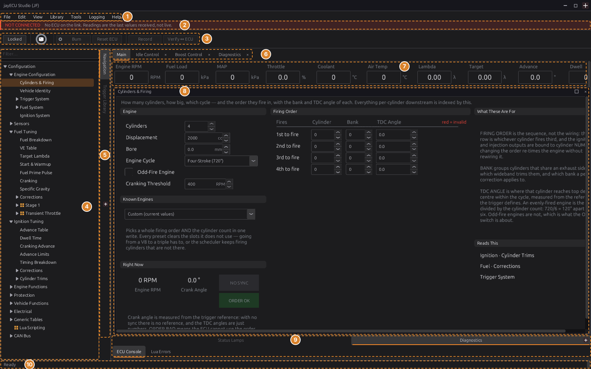
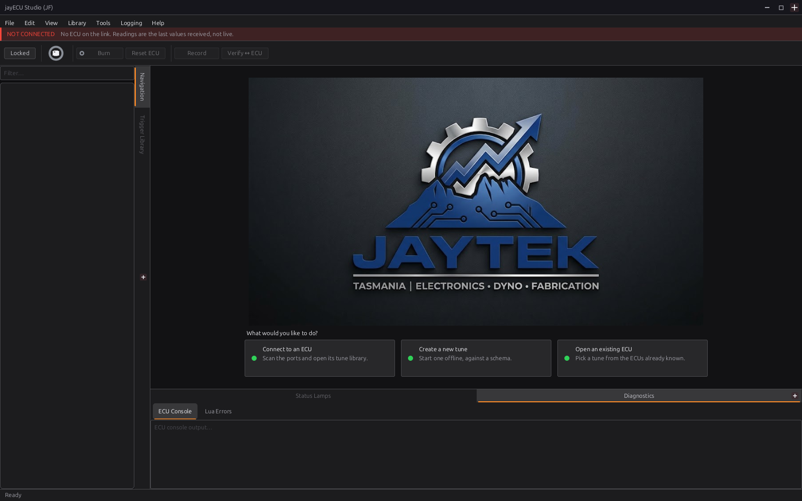
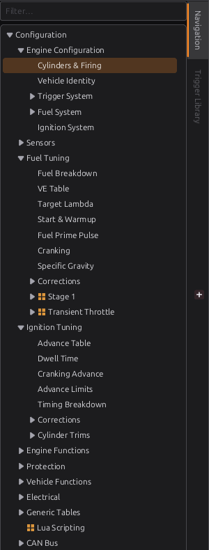
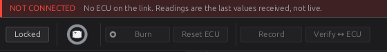
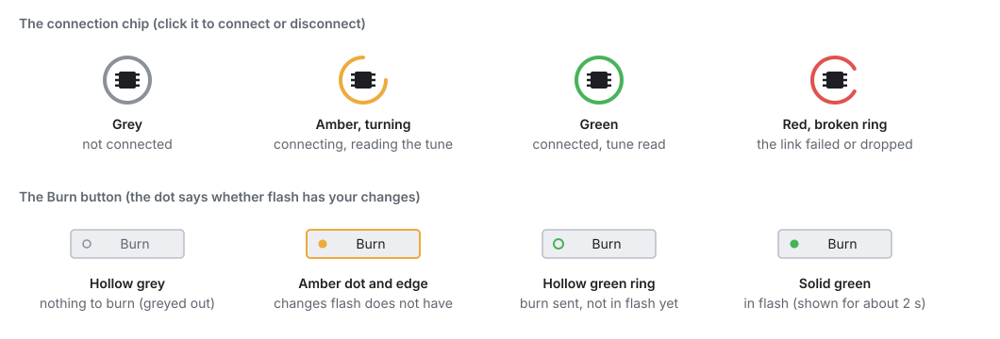
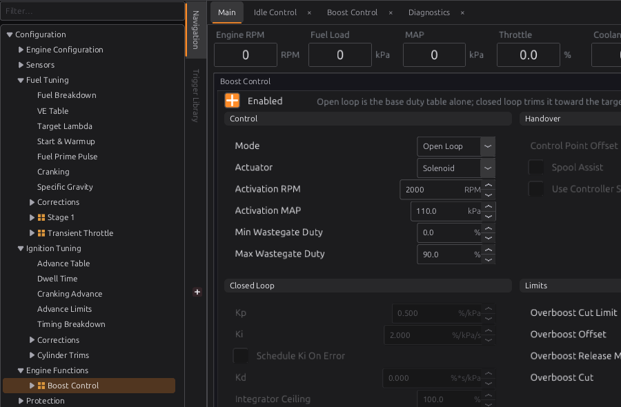

# A tour of the studio

:material-circle:{ .level-basic } Basic → :material-circle:{ .level-intermediate } Intermediate

> **In one sentence:** jayecu Studio is the program on your PC that shows what the ECU is doing and
> changes its tune. This chapter names every part of its window and says what each menu item and
> button does, and when it is available.

## Overview

:material-circle:{ .level-basic } Basic

The studio does three jobs:

- **It shows the engine.** While it is connected, gauges, tables and readouts update as the ECU sends
  new readings.
- **It changes the tune.** The **tune** is the set of settings the ECU runs on: fuel tables, ignition
  tables, sensor calibrations and so on. You change them on **pages**, and each change is sent to the
  ECU straight away.
- **It keeps your files.** Every ECU the studio has met gets a folder on your PC with its tune, its
  pages and a history of what was on the ECU each time you connected.

You do not need an ECU to use the studio. You can open a saved tune, or start a new one, and work on
it at a desk. Chapter 5 covers connecting.

<figure markdown>
  
  <figcaption>Figure 4.1 — The studio window, offline, with the <b>Cylinders &amp; Firing</b> page open.
  The numbers match the list below.</figcaption>
</figure>

1. **Menu bar:** File, Edit, View, Library, Tools, Logging, Help. Every item is listed in
   [Menu and toolbar reference](#menu-and-toolbar-reference).
2. **Notice strip:** a red or amber line that stays up for as long as something important is true,
   such as **NOT CONNECTED**, **KEY OFF** or **NO TUNE ON THE ECU**.
3. **Toolbar:** **Locked**/**Editing**, the connection chip, **Burn**, **Reset ECU**, **Record** and
   **Verify ↔ ECU**.
4. **Navigation tree:** every page of the tune, in folders. Click a name to open its page.
5. **Dock tabs:** the side strip that switches between the panels sharing that side of the window
   (here **Navigation** and **Trigger Library**).
6. **Surface tabs:** your workspaces. Each tab has its own instruments and remembers which page it had
   open.
7. **Readout strip:** live values across the top of the **Main** tab.
8. **Page window:** the page you opened from the tree. It has its own title bar, with maximise and
   close buttons.
9. **Bottom docks:** **Status Lamps** and **Diagnostics** (the ECU's own text console and Lua errors).
10. **Status bar:** messages on the left. While connected, a live summary of the link on the right.

<!-- src: apps/studio-jf/main.cpp (menu order) (toolbar order) (dock areas) (page windows over the surface tabs); definition/boards/jaytek_v1.dashboard.gui (tabs Main, Idle Control, Boost Control, Diagnostics) -->

## Concepts

:material-circle:{ .level-basic } Basic → :material-circle:{ .level-intermediate } Intermediate

### The landing page

When no ECU project is open, the centre of the window shows three choices:

- **Connect to an ECU:** look for an ECU on the USB ports and open its project (chapter 5).
- **Create a new tune:** start a tune offline, from a definition (the same as **File ▸ New Tune…**).
- **Open an existing ECU:** pick one of the ECUs the studio already knows (the same as
  **File ▸ Open ECU…**).

The landing stays up until a project has actually opened. If you cancel a picker, you are back where
you started. **File ▸ Close ECU** brings the landing back.
<!-- src: apps/studio-jf/src/ui/LandingView.h; apps/studio-jf/main.cpp (landing stays until a project opens) (Close ECU returns to it) -->

<figure markdown>
  
  <figcaption>Figure 4.2 — The landing page, shown whenever no project is open.</figcaption>
</figure>

### Projects, tunes and definitions

Three words come up throughout the studio:

- **ECU project:** everything the studio keeps for one ECU, in a folder named after the ECU's serial
  number (its **uid**): its tunes, its pages and navigation tree, and its connect points. A tune started
  offline gets a project of its own too.
- **Tune:** one named set of settings for that ECU, stored as a `.tune` file. An ECU project can hold
  several; the studio remembers which one you had open.
- **Definition** (the studio also calls it a **schema** or **meta**): the file that describes a firmware
  version: every setting's name, units, range and position, and every live channel. The studio needs
  the right definition to read a tune at all. It matches them by the **layout hash**, a short code that
  changes whenever the firmware's settings layout changes.

The folders live in your user data folder: `~/.local/share/jayecu/jayecu Studio/` on Linux,
`%APPDATA%\jayecu\jayecu Studio\` on Windows. ECU projects are under `ecus/`, definitions under
`meta/` and studio recordings under `datalogs/`. Chapter 48 covers the files in detail.
<!-- src: apps/studio-jf/src/model/StudioPaths.cpp; apps/studio-jf/src/model/Ecu.cpp (ecus/<uid>, tunes/, restore/, dashboard.gui); apps/studio-jf/main.cpp (definition found by layout_hash); apps/studio-jf/src/model/DatalogRecorder.cpp -->

### The navigation tree

The tree on the left lists every page, grouped in folders: **Configuration ▸ Fuel Tuning ▸ VE Table**,
and so on. A name that underlines when you point at it has a page behind it; click it and the page
opens. A folder with no page of its own only expands.
<!-- src: apps/studio-jf/main.cpp (selection opens the page; hyperlink when the node owns a non-empty page) -->

**The tree shows only what this tune uses.** A page that belongs to a feature is listed only while that
feature is switched on. **Boost Control** appears under **Engine Functions** once boost control is
enabled, **Launch Control** once launch is enabled, and so on. A node shown because its feature is on
carries a small orange grid icon. The tree updates the moment the setting changes.
<!-- src: apps/studio-jf/main.cpp (applyNodeConditions: a failing condition hides the node and its subtree) (re-filtered on every config load and value change); apps/studio-jf/src/ui/NavTree.cpp (a node with a condition gets icon 1); definition/boards/jaytek_v1.dashboard.gui (tree conditions, e.g. Boost Control => boost.enabled) -->

**To reach a page that is hidden, type in the Filter box** above the tree. A search also finds hidden
pages and shows them dimmed. Open the page, switch the feature on, and the page joins the tree.
<!-- src: apps/studio-jf/main.cpp (JTreeView's search reveals a hidden match, drawn dim, still selectable) (Filter… box) -->

Right-click the tree for **Expand All**, **Collapse All**, **Expand** and **Collapse**. In Editing mode
the same menu also changes the tree itself (chapter 49).
<!-- src: apps/studio-jf/main.cpp -->

<figure markdown>
  
  <figcaption>Figure 4.3 — The navigation tree. <b>Stage 1</b>, <b>Transient Throttle</b> and
  <b>Lua Scripting</b> carry the orange icon: they are listed because their feature is on in this tune.
  Pages for features that are off, such as <b>O2 Control</b>, are not listed.</figcaption>
</figure>

### Pages, surfaces and tabs

A **page** is one screen of settings and readouts, such as **Cylinders & Firing** or **VE Table**. It
opens in a **page window** in the middle of the studio, with its name in the window's title bar. The
window can be maximised, or closed with its **×**.
<!-- src: apps/studio-jf/main.cpp (openPage: one page window, titled with the node name) -->

Behind the page window is a **surface**: a workspace with its own live instruments. The shipped layout
for the jaytek_v1 board has four surfaces open as tabs: **Main**, **Idle Control**, **Boost Control**
and **Diagnostics**.
<!-- src: definition/boards/jaytek_v1.dashboard.gui (surfaces.pool, open = [0, 3, 4, 5]) -->

**Each tab remembers its own page.** Open the VE table on **Main**, switch to **Idle Control**, and the
idle tab shows its own page. Switch back and **Main** shows the VE table again. The first time you
visit a tab it opens on the page it was made for. Closing a tab's page window makes that tab forget
it, so the tab comes back empty until you open another page on it.
<!-- src: apps/studio-jf/main.cpp (g_tabPage; closing forgets) (tabChanged: the tab's own page, or its default page) -->

A tab that is all instruments, such as **Diagnostics**, does not take page windows. If you pick a page
in the tree while it is in front, the page opens on a tab that does take pages.
<!-- src: apps/studio-jf/main.cpp (showTabTakingPages) -->

The **Main** tab is always there. Other tabs can be closed with their **×**; a closed tab is kept and
can be brought back with **View ▸ Reopen Surface…**. **View ▸ New Surface Tab** adds an empty one, and
**View ▸ Delete Surface…** removes one for good. Double-click a tab's name (or press F2) to rename it.
Building your own surfaces is chapter 49.
<!-- src: apps/studio-jf/src/surface/SurfaceTabs.cpp; apps/studio-jf/main.cpp -->

The tools in the **Tools** menu (Trigger Designer, Engine Cycle, Trigger Log, Knock Scope, Auto Tune)
open as tabs of their own in the same strip.
<!-- src: apps/studio-jf/main.cpp (openToolTab) -->

### Docks

The panels round the edge of the window are **docks**:

| Dock | Where it starts | What it holds |
|---|---|---|
| **Navigation** | left | the navigation tree |
| **Trigger Library** | left | the trigger wheels you can pick from (chapter 16) |
| **Diagnostic Trouble Codes** | right | active and stored fault codes, refreshed once a second while connected (chapter 44) |
| **Status Lamps** | bottom | a grid of on/off lamps from the layout |
| **Diagnostics** | bottom | **ECU Console** (the ECU's own text output) and **Lua Errors** |
| **Dictionary**, **Controls** | left, Editing mode only | every setting and channel; the widgets you can place on a page |
| **Properties** | right, Editing mode only | the settings of the selected widget |

<!-- src: apps/studio-jf/main.cpp (areas) (DTC dock; 1 Hz poll) (status lamps, diagnostics) (edit-only panels) -->

Docks that share a side of the window sit on tabs; click the side strip to switch between them. Close
a dock with its **×**, or tick and untick it in the **View** menu. The **View** ticks always match what
is on screen, and a dock you show again returns to where you last had it. Which edge each side's tab
strip sits on, and whether a side is used at all, are set in **Edit ▸ Preferences… ▸ Appearance**.
<!-- src: apps/studio-jf/main.cpp (dock homes, View toggles) (ticks follow placement) (Appearance ▸ Docks) -->

### Locked and Editing

The first button on the toolbar switches the studio between two modes. The studio always starts in
**Locked**.

| | **Locked** (the button reads *Locked*) | **Editing** (the button is orange and reads *Editing*) |
|---|---|---|
| What you are doing | using the pages: reading values, changing the tune | changing the pages themselves: moving and adding widgets, reorganising the tree |
| The tune | you can change it; changes go to the ECU | locked: values cannot be changed |
| The tree | only the pages this tune uses | every node, plus **New node…** rows to add more |
| Docks | Navigation, Trigger Library, DTCs, Status Lamps, Diagnostics | the same, plus Dictionary, Controls and Properties |
| Notice strip | shown | hidden |

<!-- src: apps/studio-jf/main.cpp (lockBtn: Cache::setReadOnly(editing)) (onSetEditMode: tree editable, placeholders, docks, run/edit layouts) (starts in run mode); apps/studio-jf/main.cpp (notice strip is run mode only) -->

Each mode remembers its own arrangement of docks, so the extra panels you open for editing do not
clutter the screen you tune from.
<!-- src: apps/studio-jf/main.cpp (runLayout / editLayout captured and restored) -->

<figure markdown>
  
  <figcaption>Figure 4.4 — Editing mode. The toolbar button is orange and reads <b>Editing</b>; the
  <b>Controls</b> dock (left) and <b>Properties</b> dock (right) have appeared.</figcaption>
</figure>

!!! warning "Editing locks the tune"
    If a value will not change when you type in it, look at the first toolbar button. In **Editing**
    mode the tune is read-only. Click the button to go back to **Locked**.

### Where an edit goes: RAM, flash, and the file on your PC

:material-circle:{ .level-intermediate } Intermediate

This is the most important idea in the studio. When you change a value on a page while connected:

1. The studio's copy of the tune changes.
2. The change is sent to the ECU **straight away** and lands in the ECU's **RAM**. The engine runs on
   it from that moment.
3. It is **not** in the ECU's **flash** memory yet. If the ECU loses power or is reset now, it starts
   up on the tune that is in flash, and the change is gone from the ECU.
4. **Burn** copies the tune from RAM into flash. Only then does it survive a power cycle.

<!-- src: apps/studio-jf/main.cpp (edits reach RAM at once, flash only on burn; tuneburn::pending reads config_dirty); firmware/Comms/CommsManager.cpp (config_dirty = generation != saved generation) -->

Separately, the studio saves its copy to the **tune file** on your PC when you choose
**File ▸ Save Tune**, when you disconnect, when you switch to another ECU and when you quit. So the
file on your PC and the ECU's flash are two different things: a burn does not save the file, and
saving the file does not burn.
<!-- src: apps/studio-jf/main.cpp (switching ECU) (Save Tune) (disconnect) (switching project) (close) -->

<figure markdown>
  
  <figcaption>Figure 4.5 — Where an edit goes. Orange is the ECU; the red path is what a power cycle
  does to changes that were never burned; green is the check <b>Verify ↔ ECU</b> makes.</figcaption>
</figure>

Two more copies appear in Figure 4.5:

- **Verify ↔ ECU** reads the whole tune back from the ECU, compares it byte for byte with the
  studio's copy, and sends again any part that differs. The status bar reports either
  *Verify: ECU matches the project tune* or *Verify: re-pushed N byte(s) to the ECU*. On a jayecu ECU
  a re-push goes to RAM, so burn afterwards.
- A **connect point** is the ECU's tune exactly as it was read when you connected. It is kept on your
  PC, and **Edit ▸ Restore Tune to Connect Point** sends it back to the ECU. Chapter 5 explains
  connect points.

<!-- src: apps/studio-jf/main.cpp (Verify button) (native verify: read, diff, writeConfig of divergent runs, no burn) (connect point restore file) (Restore Tune to Connect Point) -->

### The toolbar

<figure markdown>
  
  <figcaption>Figure 4.6 — The notice strip and toolbar, offline. With no ECU connected, Burn, Reset ECU,
  Record and Verify are greyed out.</figcaption>
</figure>

- **Locked / Editing:** switches mode (above).
- **The connection chip:** click it to connect; click it again to disconnect. Its ring shows the state
  of the link (Figure 4.7).
- **Burn:** writes the tune in the ECU's RAM to its flash. It is only enabled when there is something
  to burn. The ECU itself reports whether RAM and flash differ, so the button also lights for changes
  the studio did not make (an autotune run on the ECU, for example). Before burning, the studio sends
  any edit it is still holding back. The button turns green only once the ECU reports that flash has
  the tune; if that has not happened within 8 seconds, the dot stays amber.
- **Reset ECU:** restarts the ECU through its own `reset` command. The ECU first waits, for up to 4
  seconds, for a burn in progress to reach flash. Changes that were never burned are lost, and the
  status bar says so.
- **Record:** starts and stops a recording of every live channel to a file on your PC (the same as
  **Logging ▸ Start/Stop Recording**). The button reads **Stop** while recording.
- **Verify ↔ ECU:** the check described above.

<!-- src: apps/studio-jf/main.cpp (Burn: flushWrites, awaiting config_dirty, 8 s give-up, 250 ms poll) (pending = config_dirty) (Reset ECU) (reset message) (Record); firmware/Cli/CliCommands.cpp (reset waits up to 4 s); apps/studio-jf/src/ui/BurnButton.h -->

<figure markdown>
  
  <figcaption>Figure 4.7 — The two indicators on the toolbar. The chip says whether the studio is talking
  to an ECU; the Burn button says whether the ECU's flash has your changes.</figcaption>
</figure>

<!-- src: apps/studio-jf/src/ui/ConnectButton.h (grey idle, amber spinner, green, red with a break); apps/studio-jf/src/ui/BurnButton.h (dot states, amber edge, green for 2.2 s) -->

### The notice strip

Between the menu bar and the toolbar, a strip stays up while one of these is true. It shows in
Locked mode only.

| Notice | What it means |
|---|---|
| **NOT CONNECTED** (red) | No ECU is on the link. Any readings on screen are the last values received, not live ones. |
| **NO TUNE ON THE ECU** (red) | The ECU started without a valid tune, so it is not running and every reading but the battery is 0. Put a tune on it, burn, and press **Reset ECU** (chapter 47). |
| **KEY OFF** (amber) | The ECU is powered from USB alone, with the ignition off. Only the battery voltage is read; other sensor readings and calibrations wait for 12 V. |
| **IGNITION DISABLED**, **INJECTORS DISABLED**, or both (amber) | The ignition or injector outputs are switched off in the engine configuration. The engine will crank but not start until they are switched back on (chapter 15). |

<!-- src: apps/studio-jf/main.cpp (refreshLinkOverlay: NOT CONNECTED, NO TUNE from no_tune, KEY OFF from key_on, outputGateNotice: engine.ign_enable / engine.inj_enable) -->

### The status bar

The left of the status bar shows the latest message: *Ready* at start-up, *Connected: jaytek_v1 · …*
once an ECU has identified itself, *Disconnected*, and short reports from whatever you just did.

While readings are arriving, the right-hand side shows a live summary of the link:

- **● N frames · R Hz:** how many readings have arrived and how many per second. If none arrives for
  more than 1.5 seconds it changes to **○ no telemetry for T s**, so a frozen link cannot pass for a
  steady engine.
- On a jayecu ECU it adds the definition's layout hash, engine speed (**rpm**), coolant temperature
  (**clt**), and the state of the Lua script: **Lua OK**, **Lua Disabled**, or **Lua Load Err** /
  **Lua Run Err** with the script line number (chapter 35).

<!-- src: apps/studio-jf/main.cpp (setLiveStatus: frames, Hz, stale > 1500 ms, layout hash, rpm, clt, lua_state 0-3) (Connected: board · uid) -->

## Procedure: a first walk round the studio

:material-circle:{ .level-basic } Basic

You can do all of this without an ECU. It uses a new tune started offline.

1. **Start the studio.** It opens on the landing page (Figure 4.2), in Locked mode, with **NOT
   CONNECTED** in the notice strip.
2. **Click Create a new tune.** The **New Tune** dialog asks for a **Tune Name** and a **Schema (ECU
   firmware layout)**: pick the definition for your ECU's firmware and click **Create**. The studio
   builds the tune from that definition's defaults and opens it. The window now looks like
   Figure 4.1.
   <!-- src: apps/studio-jf/main.cpp (New Tune: offline project keyed by layout hash, seeded with defaults); apps/studio-jf/src/ui/NewTuneDialog.h -->
3. **Open a page.** In the tree, expand **Configuration ▸ Engine Configuration** and click
   **Cylinders & Firing**. The page opens in a window over the **Main** tab.
4. **Find a page that is switched off.** Type `boost` in the **Filter** box. **Boost Control** appears,
   dimmed. Click it, tick **Enabled** on its page, and clear the filter: **Boost Control** is now in the
   tree under **Engine Functions**, with the orange icon (Figure 4.8). Untick **Enabled** again if you
   do not have a turbocharger.
5. **Change tab.** Click **Idle Control** in the tab strip. It opens on its own page. Click **Main**,
   and your last page comes back.
6. **Hide and show a dock.** Untick **View ▸ Diagnostics**; the bottom panel goes. Tick it again and
   it comes back where it was.
7. **Try Editing mode.** Click **Locked**. It turns orange and reads **Editing**, and the Controls
   and Properties docks appear (Figure 4.4). Click it again to return to **Locked**.
8. **Close the project.** **File ▸ Close ECU** takes you back to the landing page. Your tune was saved
   as you went; if you changed the layout, the studio asks whether to save it.

<figure markdown>
  
  <figcaption>Figure 4.8 — With boost control enabled, <b>Boost Control</b> is listed under
  <b>Engine Functions</b>, carrying the orange icon of a page shown because its feature is on.</figcaption>
</figure>

<!-- src: apps/studio-jf/main.cpp (Close ECU) (maybeSaveThen: layout prompt; tune auto-saves) -->

## Examples

:material-circle:{ .level-intermediate } Intermediate

!!! example "Example 1: checking a customer's tune at a desk"
    You have a customer's ECU project on your laptop and no car.

    1. **File ▸ Open ECU…** and pick the ECU from the list. If it has more than one tune, pick one.
    2. Walk the tree. Only the features this tune uses are listed, so the tree is a quick summary of
       how the car is set up.
    3. Any change you make is kept in the studio's copy and written to the tune file when you save,
       close or quit. It reaches the ECU at the next connection, when the studio shows you the
       differences and asks which tune to keep (chapter 5).

!!! example "Example 2: a tuning session at the car"
    1. Connect (chapter 5). Wait for the chip to turn green.
    2. Press **Record** before you start the engine, so the session is logged.
    3. Tune. Each change reaches the engine at once, and **Burn** turns amber.
    4. When you are happy with a set of changes, press **Burn** and wait for the green dot.
    5. Press **Verify ↔ ECU** before you leave. *Verify: ECU matches the project tune* means the ECU
       holds exactly what the studio shows.
    6. Press **Stop**, then click the chip to disconnect. The tune file is saved as the link closes.

<!-- src: apps/studio-jf/main.cpp (Open ECU list) (tune picker; offline project) (disconnect saves, ends recording) (Burn) (Verify) -->

## Pitfalls and troubleshooting

:material-circle:{ .level-basic } Basic → :material-circle:{ .level-intermediate } Intermediate

| Symptom | Likely cause | Check |
|---|---|---|
| A value will not change when you type in it | Editing mode | The first toolbar button: click **Editing** to go back to **Locked** |
| A menu item is greyed out | It needs something the studio does not have yet | See the *Available* column in the reference below: most need a project open, or a connected ECU |
| A menu item you expected is missing | It does not apply to this kind of ECU | Tools such as **Knock Scope**, **Trigger Log** and **Reset ECU** are only offered for a jayecu definition, not for an imported TunerStudio one |
| **File ▸ Close ECU**, **New Tune…** or **Open ECU…** is greyed out | An ECU is connected, or a connection is starting | Disconnect first (click the chip) |
| A page you know exists is not in the tree | Its feature is switched off | Type its name in **Filter**, open it, and switch the feature on |
| Changes are gone after the ignition was cycled | They were never burned | Watch the **Burn** button: amber means flash does not have your changes |
| A tab shows no page | You closed its page window, so the tab forgot it | Pick a page in the tree |
| A dock has disappeared | It was closed with its **×** | Tick it in the **View** menu |
| The status bar says **○ no telemetry** | The link has stopped delivering readings | The USB cable and the ECU's power; see chapter 5 |

<!-- src: apps/studio-jf/main.cpp (MenuGate rules) (Editing locks the tune) (tree conditions) (tab forgets a closed page) (stale telemetry) -->

## Menu and toolbar reference

:material-circle:{ .level-intermediate } Intermediate

The studio offers only what the ECU in front of it can do. An item that does not apply to this kind of
ECU is not shown at all. An item that applies but cannot be done yet is shown greyed out, and its
keyboard shortcut does nothing either. The menus are re-checked four times a second, so an item comes
alive the moment it can be used.
<!-- src: apps/studio-jf/src/ui/MenuGate.h; apps/studio-jf/main.cpp (shortcuts honour the gate) (rules, applied on the 250 ms housekeeping tick) -->

In the tables, **a project** means an ECU project or tune is open; **connected** means the chip is
green (the ECU has identified itself and its tune has been read); **offline** means no link is open
or opening.

### File

The open ECU's documents: its tunes and its layout.

| Item | Shortcut | What it does | Available |
|---|---|---|---|
| **New Tune…** | Ctrl+N | Starts a tune offline from a definition in the studio's library, with that definition's default values. | offline |
| **Open ECU…** | Ctrl+O | Lists every ECU project the studio knows; pick one, then one of its tunes. An ECU with no saved tune opens on its definition's defaults, named *defaults*. | offline |
| **Open Tune…** | Ctrl+Shift+O | Lists this ECU's tunes, its connect points (marked *(connect point)*) and the tunes saved before firmware updates (marked *(firmware backup)*), newest first. Saves the open tune first. If connected, asks whether to send the chosen tune to the ECU. | a project |
| **Recent ECUs** | | The last eight ECU projects opened. The list is read when the studio starts. | offline |
| **Save Tune** | Ctrl+S | Writes the studio's copy of the tune to its file. Does not burn. | a project |
| **Save Tune As…** | | Saves the open tune under a new name, which becomes the open tune. | a project |
| **Open Layout…** | | Replaces this project's pages, tree and surfaces with a layout file (`.gui` or `.json`). Asks first if the current layout has unsaved changes. | a project |
| **Save Layout** | Ctrl+Shift+S | Saves this project's pages, tree and surfaces. | a project |
| **Save Layout As…** | | Saves them to a file you choose, to use on another ECU. | a project |
| **Close ECU** | | Closes the project and returns to the landing page. The tune is saved; unsaved layout changes are asked about. | a project, offline |
| **Quit** | Ctrl+Q | Closes the studio, with the same save rules. Refused while a firmware update is writing. | always |

<!-- src: apps/studio-jf/main.cpp (File menu) (Open ECU; defaults) (Open Tune; connect points; Send it to the ECU?) (Recent ECUs, eight, built at start-up) (recent list) (layout save/open) (Close ECU) (close guard; firmware update) (gates) -->

Unsaved **layout** changes are the only thing the studio asks about when closing: the tune saves
itself. The question can be answered once and remembered (**Don't ask again**); change the answer in
**Edit ▸ Preferences… ▸ Editor ▸ Surface ▸ On exit with unsaved changes**.
<!-- src: apps/studio-jf/src/ui/SaveChangesDialog.h; apps/studio-jf/src/ui/PreferencesDialog.h -->

### Edit

| Item | Shortcut | What it does | Available |
|---|---|---|---|
| **Undo** / **Redo** | Ctrl+Z / Ctrl+Y | With a page focused in Locked mode, steps back or forward through your tune edits and sends the restored values to the ECU. In Editing mode, steps through layout changes. | a project |
| **Cut** / **Copy** / **Paste** | Ctrl+X / Ctrl+C / Ctrl+V | Act on the selected widgets while Editing. Tables have their own copy and paste on their right-click menu (**Clipboard**). | a project |
| **Restore Tune to Connect Point** | | Puts the tune back to what the ECU held when you connected, on screen and on the ECU. Burn afterwards to keep it. | jayecu ECU, connected |
| **Preferences…** | | Units, appearance, connection, editor, datalog, diagnostics, keyboard and update settings. | always |

<!-- src: apps/studio-jf/main.cpp (Edit menu) (gates); apps/studio-jf/src/surface/Surface.cpp (run mode Ctrl+Z drives the tune stack); apps/studio-jf/src/model/Cache.h (undo pushes reverted bytes to the ECU); apps/studio-jf/src/surface/Surface.cpp (table Clipboard menu); apps/studio-jf/src/ui/PreferencesDialog.h -->

### View

| Item | What it does | Available |
|---|---|---|
| **Navigation**, **Properties**, **Dictionary**, **Controls** | Show or hide these docks. | always |
| **Status Lamps**, **Diagnostics**, **Diagnostic Trouble Codes**, **Trigger Library** | Show or hide these docks. | always |
| **Show Hidden Widgets** | While Editing, also draws the widgets a page hides under its conditions, outlined, so you can reach them. | Editing mode |
| **New Surface Tab** | Adds an empty surface. | a project |
| **Delete Surface…** | Removes a surface and its contents. The last surface cannot be deleted. | a project |
| **Reopen Surface…** | Brings back a surface tab you closed. | a project |

<!-- src: apps/studio-jf/main.cpp (View menu) (gates) -->

### Library

What the studio keeps, as opposed to what it does.

| Item | What it does | Available |
|---|---|---|
| **Trigger Library** | Shows the Trigger Library dock (chapter 16). | always |
| **Import Trigger Wheels…** / **Export Trigger Wheels…** | Moves trigger wheel designs between PCs as a `.json` file. | always |
| **Load ECU Definition…** | Loads a definition file (`.meta` or `.json`) without opening a tune. | offline |
| **Import TunerStudio .ini…** | Turns a TunerStudio `.ini` into a definition and a project, so the studio can work with an ECU that speaks that protocol. | offline |

<!-- src: apps/studio-jf/main.cpp (Library menu) (openSchemaFn) (import) (gates) -->

### Tools

Instruments that measure something. Each opens as a tab.

| Item | What it does | Available |
|---|---|---|
| **Trigger Designer** | Design and test trigger wheels (chapter 16). | jayecu definitions |
| **Engine Cycle** | One engine cycle of events, captured by the ECU (chapter 43). | connected |
| **Trigger Log** | The raw trigger edges the ECU saw (chapter 43). | jayecu ECU, connected |
| **Knock Scope** | The knock system's last capture (chapter 41). | jayecu ECU, connected |
| **Auto Tune** | The VE autotuner (chapter 40). | definitions with an autotuner; connected |
| **Update Navigation from Definition…** | Adds tree nodes that a newer definition has gained since your tree was saved (chapter 49). | a project, when the definition has a navigation tree |
| **Reset ECU** | Same as the toolbar button. | jayecu ECU, connected |
| **Install Firmware Kit…** | Adds a firmware kit someone has sent you (its `kit.json`), to be offered like a downloaded one (chapter 46). | always |

<!-- src: apps/studio-jf/main.cpp (Tools menu) (gates) (tool tabs) -->

### Logging

| Item | What it does | Available |
|---|---|---|
| **Start Recording** / **Stop Recording** | Records live channels to a file on this PC, one row per reading received, named `jayecu_<date>_<time>.msl`. Same as the **Record** button. A recording also stops when you disconnect. | a definition loaded and a link open, or while recording |
| **Recording Channels…** | Chooses which channels a PC recording carries. Leave it empty to record every channel. | a definition loaded |
| **Onboard Logging…** | Sets up the ECU's own logger, which writes to its SD card (chapter 42). | jayecu definitions, a project |
| **Logs on Card…** | Lists and copies the logs on the ECU's SD card when your PC can see the card. | jayecu definitions |
| **Open Logs Folder** | Opens the folder PC recordings are written to. | always |

<!-- src: apps/studio-jf/main.cpp (Logging menu) (gates) (one row per frame) (recording ends on disconnect); apps/studio-jf/src/model/DatalogRecorder.cpp -->

A recording can also start by itself each time you connect: **Edit ▸ Preferences… ▸ Datalog ▸ Record
every session**. It is off by default.
<!-- src: apps/studio-jf/src/model/DatalogRecorder.cpp; apps/studio-jf/src/ui/PreferencesDialog.h; apps/studio-jf/main.cpp -->

### Help

| Item | Shortcut | What it does | Available |
|---|---|---|---|
| **User Manual** | F1 | Opens this manual, installed with the studio, in your web browser. | always |
| **Lua API Reference** | | Opens the Lua reference for the loaded definition in your web browser (chapter 35). | definitions that declare Lua functions |
| **About jayecu Studio…** | | The studio's version. | always |

<!-- src: apps/studio-jf/main.cpp (Help menu) (gate) -->

### Toolbar

| Button | Available |
|---|---|
| **Locked / Editing** | always |
| **Connection chip** | always (click to connect or disconnect) |
| **Burn** | when the ECU has changes its flash does not |
| **Reset ECU** | jayecu ECU, connected |
| **Record** / **Stop** | a definition loaded and a link open, or while recording |
| **Verify ↔ ECU** | connected, with the tune read |

<!-- src: apps/studio-jf/main.cpp (toolbar gates); apps/studio-jf/src/ui/BurnButton.h (enabled only when dirty) -->

## Related

- Chapter 3 — Installing jayecu Studio
- Chapter 5 — First connection
- Chapter 42 — Datalogging and analysis
- Chapter 44 — Diagnostics and trouble codes
- Chapter 48 — Tunes, layouts and backups
- Chapter 49 — Customising the studio (Editing mode, surfaces, widgets)
