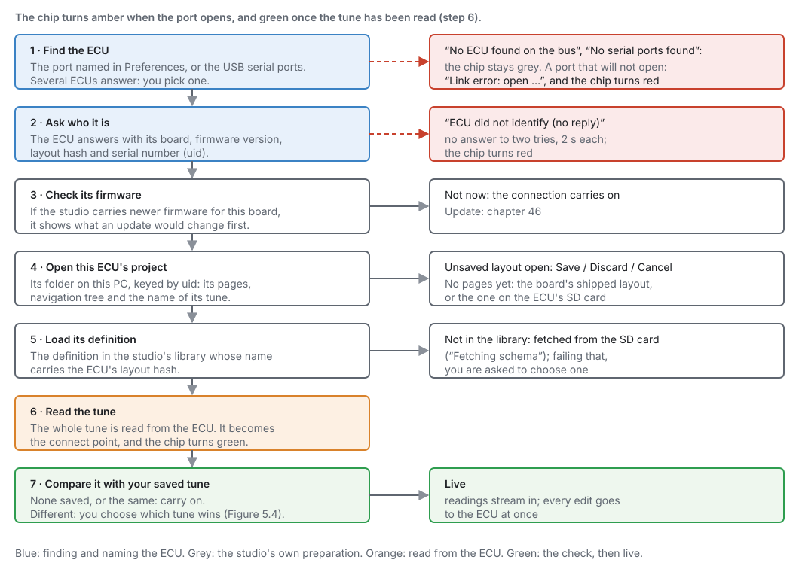
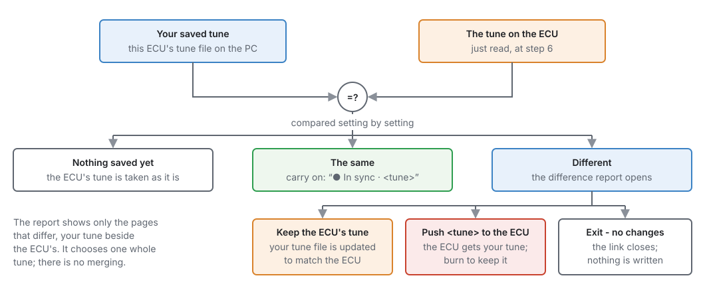
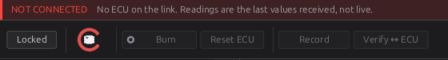

# First connection

:material-circle:{ .level-basic } Basic

> **In one sentence:** plug the ECU into the computer, press connect, and the studio finds it, opens
> its project, reads its tune and shows you it live.

## Overview

:material-circle:{ .level-basic } Basic

Connecting is one click, but a lot happens behind it: the studio finds the ECU, asks it what it is,
checks its firmware, opens the right project and definition, reads the tune, and compares it with the
tune you last saved. This chapter goes through each step, what you are asked and why, and what to do
when a step fails.

You need the studio installed (chapter 3), and on Linux the USB rule it offers to install. The tour of
the studio's window is chapter 4.

## Concepts

:material-circle:{ .level-intermediate } Intermediate

### What happens when you connect

<figure markdown>
  
  <figcaption>Figure 5.1 — Connecting, step by step. The connection chip turns amber when the port
  opens and green once the tune has been read.</figcaption>
</figure>

1. **Find the ECU.** If **Edit ▸ Preferences ▸ Connection ▸ Serial port** names a port, the studio
   opens that one. Otherwise it looks at the USB serial ports, preferring any that identify as a
   jayecu. One ECU: it opens it straight away. Several: it asks each one who it is and lets you pick.
   <!-- src: apps/studio-jf/main.cpp -->
2. **Ask who it is.** The ECU answers with its board, firmware version, definition (layout hash) and
   serial number (**uid**). The studio waits 2 seconds and asks once more before giving up.
   <!-- src: apps/studio-jf/src/comms/EcuLink.cpp (Identity, 1 retry, 2000 ms) -->
3. **Check its firmware.** If the studio carries newer firmware for this board, it offers the update
   and shows what would change. **Not now** carries on connecting (chapter 46).
4. **Open this ECU's project.** Every ECU has its own project folder on your PC, named by its uid: its
   pages, navigation tree and tunes. The first time, the project is created with the board's
   standard pages. If a different project is open with unsaved layout changes, you are asked to save or
   discard them first.
5. **Load its definition.** The **definition** is the description of every setting and channel the
   ECU's firmware has. The studio finds the one that matches the ECU's layout hash in its library. If
   it does not have it, it fetches it from the ECU's SD card ("Fetching schema"), and failing that asks
   you to choose one.
6. **Read the tune.** The whole tune is read from the ECU. This copy is kept as the **connect point**,
   so you can always go back to how the ECU was when you connected (**Edit ▸ Restore Tune to Connect
   Point**). The chip turns green.
7. **Compare it with your saved tune.** See below.

Then the studio is **live**: readings stream in, and every edit you make goes to the ECU at once (to
its RAM; **Burn** keeps it, chapter 4).

### When the ECU's tune and your saved tune differ

<figure markdown>
  
  <figcaption>Figure 5.2 — The compare at the end of connecting. One whole tune wins; there is no
  merging.</figcaption>
</figure>

- **Nothing saved yet** (a new project): the ECU's tune is taken as it is.
- **The same**: the status bar says **● In sync ·** and the tune's name.
- **Different**: a report opens, showing only the pages that differ, your tune beside the ECU's. You
  choose:
    - **Keep the ECU's tune**: your tune file is updated to match the ECU.
    - **Push *your tune* to the ECU**: the ECU gets your tune. Burn to keep it.
    - **Exit - no changes**: the link closes and nothing is written anywhere.
  <!-- src: apps/studio-jf/src/ui/TuneDiffDialog.h; apps/studio-jf/main.cpp -->

The tunes differ when someone changed the ECU with another computer, when the ECU learned something
itself (long-term trims, for example), or when you edited the tune offline.

## Procedure

:material-circle:{ .level-basic } Basic

### 1 · Before you plug in

- The ECU can be powered by **USB alone** for setting up: the processor runs, you can read and write
  the tune, and burn it. Sensors read nothing and nothing fires until the ECU has 12 V with the key on
  (chapter 10).
- Use a USB cable that carries data (some charging cables do not).
- On **Linux**, install the USB rule the studio offers (chapter 3), then log out and back in once, or
  the port cannot be opened.

### 2 · Connect

1. Plug the ECU into the computer.
2. On the landing page, click **Connect to an ECU**, or click the **connection chip** on the toolbar.

    <figure markdown>
      
      <figcaption>Figure 5.3 — The landing page. Connect to an ECU is the first card.</figcaption>
    </figure>

3. If several ECUs are connected, pick one from **Select an ECU**. Each is listed by board, the end of
   its serial number, and port.
4. Answer the firmware question if it appears (**Not now** is fine for a first connection).
5. Wait for the chip to turn green, and answer the compare report if it opens.

### 3 · Check it is really live

- The **NOT CONNECTED** notice at the top of the window is gone.
- **Battery Voltage** reads a sensible voltage with the key on (about 12–14 V), or near 0 V on USB power
  alone.
- The **COM** LED on the board is solid (chapter 7).
- Open **Configuration ▸ Engine Configuration ▸ Trigger System**: **Sync Level** reads None with the
  engine stopped. Nothing else should be happening yet.

### 4 · Disconnect

Click the chip again. The studio first sends any edit it is still holding and saves the tune to your
PC. A recording in progress is stopped and saved, because rows recorded after the link goes would be
stale values repeated. Changes that are only in the ECU's RAM are lost at the ECU's next power-off
unless you burn them first.
<!-- src: apps/studio-jf/main.cpp -->

Connecting again to the **same** ECU keeps the pages you have open.

### 5 · Make it automatic (optional)

In **Edit ▸ Preferences ▸ Connection**:

| Setting | What it does |
|---|---|
| **Serial port** | **Automatic** (default), or a named port. Naming it ends the guessing when the studio cannot tell which port is the ECU, or picks between two identical ECUs. A remembered port that is unplugged stays in the list, marked *(not connected)*. |
| **Reopen last project on launch** | Opens the project you last had open when the studio starts. |
| **Connect automatically on launch** | Connects as soon as the studio starts. |
| **Probe with rusEFI / TunerStudio protocol** | Asks in the TunerStudio protocol first, for an ECU with an imported definition. |

<!-- src: apps/studio-jf/src/ui/PreferencesDialog.h -->

## Examples

:material-circle:{ .level-intermediate } Intermediate

!!! example "A new ECU on the bench"
    Plug in, click **Connect to an ECU**. The studio finds one ECU, creates its project with the
    board's standard pages, loads the definition that matches its firmware, reads its tune, and — with
    nothing saved yet — takes that tune as it is. Name and save the tune, then continue with chapter 6.

!!! example "Back from another computer"
    A colleague tuned the car on their laptop and burned it. When you connect, the compare report shows
    their changes beside your older tune. **Keep the ECU's tune** brings your copy up to date. Check
    what changed first: the report shows only the pages that differ.

## Pitfalls and troubleshooting

:material-circle:{ .level-basic } Basic → :material-circle:{ .level-advanced } Advanced

<figure markdown>
  { width="560" }
  <figcaption>Figure 5.4 — A failed connection: the chip turns red.</figcaption>
</figure>

| Message or symptom | Likely cause | What to do |
|---|---|---|
| **No serial ports found** (chip stays grey) | The ECU is not plugged in, the cable carries no data, or the port is not visible | Another cable; check the COM LED is blinking; on Windows check Device Manager |
| **No ECU found on the bus** | Ports were found, but none answered as an ECU | Name the port in Preferences; check the ECU has power |
| **Link error: open …** (chip red) | The port could not be opened | Linux: the USB rule, then log out and in (chapter 3). Another program using the port |
| **Link error: ECU did not identify (no reply)** | The port opened but nothing answered | The wrong port (name the right one); the ECU is in its bootloader (below); a TunerStudio-protocol ECU (turn on the probe setting) |
| The studio offers to finish an update | The ECU is waiting in its bootloader after an interrupted update | Let it finish (chapter 47) |
| Asked to choose a definition | The studio has no definition for this firmware, and the SD card does not have one either | Update the studio, or load the definition (chapter 46) |
| The compare report every time | Something is changing the ECU's tune between sessions (another computer, the ECU's own learning) | Keep the ECU's tune, or burn after pushing yours |

## Related

- [Chapter 3 — Installing jayecu Studio](03-installing-studio.md) (the USB rule, the data folder)
- [Chapter 4 — A tour of the studio](04-studio-tour.md) (the chip, Burn, Verify, RAM and flash)
- [Chapter 6 — Quick start](06-quick-start.md)
- [Chapter 46 — Updating firmware](../part6/46-updating-firmware.md)
- [Chapter 47 — Recovering an ECU](../part6/47-recovery.md)
- [Chapter 48 — Tunes, layouts and backups](../part6/48-files-backups.md) (projects, connect points)
