# Quick start — box to first start

:material-circle:{ .level-basic } Basic → :material-circle:{ .level-intermediate } Intermediate

> **In one sentence:** the shortest safe path from a new ECU to an engine that starts and idles, as a
> checklist of eight stages, each pointing to the chapter that explains it in full.

## Overview

:material-circle:{ .level-basic } Basic

This chapter is a checklist, not a manual. Each stage says what to do, how you know it is done, and
which chapter to read when it is not. Work through it in order. Every stage assumes the one before it
passed. An engine that "nearly" syncs will not start however good its fuel table is, and a coil wired
to the wrong cylinder cannot be fixed with timing.

It assumes:

- the studio is installed and can talk to the ECU ([chapter 3](03-installing-studio.md),
  [chapter 5](05-first-connection.md));
- you know your way around the studio's pages, the **Burn** button and the navigation tree
  ([chapter 4](04-studio-tour.md));
- you know your engine: cylinder count, firing order, the crank (and cam) trigger wheel, and the
  injectors' flow rate and dead time.

<figure markdown>
  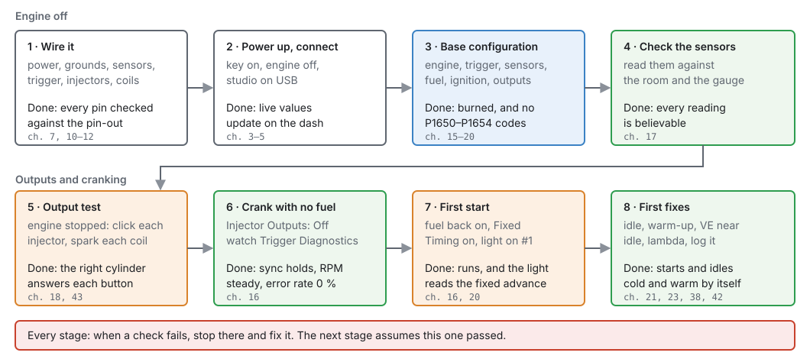
  <figcaption>Figure 6.1 — The eight stages. Blue is configuration, green is a check you read off the
  studio, orange is the ECU driving real hardware. Each box ends with the test that says the stage is
  done.</figcaption>
</figure>

!!! danger "Fuel, spark and a starter motor"
    From stage 5 on, the ECU can open injectors, fire coils and turn the engine. Have the fuel system
    leak-checked, a fire extinguisher in reach, the car in neutral with the handbrake on, and nobody
    near the fan or belts before you crank.

## Concepts

:material-circle:{ .level-basic } Basic → :material-circle:{ .level-intermediate } Intermediate

Four ideas explain most first-start trouble. Read these once. The checklist refers back to them.

### Nothing fires without sync

The ECU only knows where the engine is once it has matched the crank trigger to the pattern you told
it to expect. That match is **sync**, and it has three levels, shown live as **Sync Level**
`sync_level`:

- **None (0):** position unknown. The ECU fires nothing, and **Engine RPM** reads 0 even while the
  engine is turning.
- **Crank (1):** it knows which tooth is passing, within one crank revolution. That is enough for
  wasted spark and for grouped injection.
- **Phase (2):** a cam signal has told it which of the two revolutions of the cycle it is in. Sequential
  injection and coil-on-plug need this to fire each cylinder on its own.
  <!-- src: firmware/Scheduler/EnginePositionHal.cpp (NONE stops dispatch) (rpm 0 at no sync); firmware/Engine/EngineStateMachine.h; definition/ecu.schema.yaml enums.sync_level -->

Until a cam signal is seen, a coil-on-plug engine fires its coils in companion pairs, and a sequential
injector fires every revolution with half the fuel each time. So an engine with no cam sensor, or one
still cranking, can still start.
<!-- src: definition/ecu.schema.yaml (engine.ign_mode help) (inj_stage[].mode help) -->

<figure markdown>
  
  <figcaption>Figure 6.2 — What the ECU fires at each sync level. If <b>Engine RPM</b> stays at 0 while
  the engine cranks, the problem is the trigger, not fuel or spark.</figcaption>
</figure>

### Trigger Offset BTDC ties the wheel to the engine

The trigger wheel knows nothing about top dead centre. **Trigger Offset BTDC**
`trigger.trigger_offset_btdc` tells the ECU how many crank degrees before TDC of cylinder 1 the
wheel's reference tooth passes the sensor. On a missing-tooth wheel the reference is the first tooth
after the gap. Every spark and injection angle is measured from it, so a wrong offset moves all of
them by the same error. Raising it makes everything fire later.
<!-- src: definition/ecu.schema.yaml (the offset's comment and help) -->

A number from the Trigger Library or a forum is a starting point. The only proof is a timing light
with **Fixed Timing** switched on (stage 7). The ECU reads the offset live, so you can adjust it with
the engine running.
<!-- src: firmware/Scheduler/EnginePositionHal.cpp; definition/ecu.schema.yaml -->

### Some changes wait for the engine to stop

Settings that change the engine's shape wait until the engine is stopped before they take effect.
That covers the cylinder count and firing order, the injection stages, the trigger streams, and which
coil or injector an output drives. Change them with the engine off: while the studio is connected and
the engine is turning, the studio greys out the settings that would only wait (hover one to see why).
Trigger Offset BTDC is the exception (above).
<!-- src: definition/ecu.schema.yaml (Engine and Trigger shadow: when engine_stop); codegen/codegen.py; outputs.output[].function help -->

### Edits live in the ECU's memory until you burn them

A change you make in the studio goes to the ECU straight away, but it is only kept in the ECU's
working memory. **Burn** writes it to flash. A reset or power-off before a burn loses it, and the
ECU comes back on the tune it had before. The studio's **Reset ECU** warns you when there are
unburned changes.
<!-- src: apps/studio-jf/main.cpp (Reset ECU: "UNBURNED changes will be lost") -->

## Procedure

:material-circle:{ .level-basic } Basic → :material-circle:{ .level-intermediate } Intermediate

Tick each item off before moving on. The pins quoted are the jaytek_v1 board's; the full pin-out is in
[chapter 7](../part2/07-board.md).

### Stage 1 — Wire it

:material-circle:{ .level-basic } Basic

1. **Power and grounds.** Wire the 12 V feeds on the black connector (CN4-9, CN4-13 and CN4-16) and
   **every** ground pin: CN2-23, CN3-10, CN3-11, CN3-12, CN3-35, CN4-11 and CN4-12. How each 12 V
   feed is switched and fused is in [chapter 10](../part2/10-power-grounds.md).
   <!-- src: definition/boards/jaytek_v1.board.yaml -->
2. **Sensors.** Temperature sensors on the AT inputs, pressure and position sensors on the AV inputs,
   powered from a 5 V sensor supply (CN4-14 or CN4-15). See
   [chapter 11](../part2/11-wiring-sensors.md).
   <!-- src: definition/boards/jaytek_v1.board.yaml (AV/AT pins) -->
3. **Trigger.** A VR (magnetic) sensor goes to a VR input as a pair: VR1 is CN3-6 (+) and CN3-7 (−),
   VR2 is CN3-8 (+) and CN3-9 (−). A Hall or optical sensor goes to a digital input, DIG1 to DIG8
   (CN3-23 down to CN3-16), or to a VR input: signal on VR+, VR− left unconnected, and a pull-up to
   5 V if the sensor needs one. See [chapter 11](../part2/11-wiring-sensors.md).
   <!-- src: definition/boards/jaytek_v1.board.yaml -->
4. **Injectors and coils.** Coils go to the IGN outputs (IGN1 to IGN12, CN2-24 to CN2-35).
   Injectors go to the LS outputs, and only an LS pin can drive an injector. **The LS pins are
   interleaved on the connector:** LS1 is CN2-1 but LS2 is CN2-13, LS3 is CN2-3 and LS4 is CN2-15.
   Check each against the pin-out. See [chapter 12](../part2/12-wiring-outputs.md).
   <!-- src: definition/boards/jaytek_v1.board.yaml; outputs.output[].function help (IGN pins fire coils, LS pins drive injectors) -->
5. **Fuel pump and main relay** on spare LS or HS outputs, each through a relay
   ([chapter 14](../part2/14-vehicle-integration.md)).

**Done when:** you have checked every pin with a meter against the pin-out, before power goes on.

### Stage 2 — Power up and connect

:material-circle:{ .level-basic } Basic

1. Key on, engine off. Connect the studio over USB ([chapter 5](05-first-connection.md)).
2. The red **NOT CONNECTED** bar goes away and the values on the dash start to move.
3. Open the **Diagnostic Trouble Codes** dock (**View ▸ Diagnostic Trouble Codes**). **P0641** or
   **P0651** means a 5 V sensor supply is faulty. Look for a shorted sensor wire before you go on.
   <!-- src: definition/ecu.schema.yaml (P0641, P0651); definition/boards/jaytek_v1.board.yaml -->

**Done when:** the studio shows live values and no sensor-supply code.

### Stage 3 — Base configuration

:material-circle:{ .level-basic } Basic → :material-circle:{ .level-intermediate } Intermediate

Do these with the engine stopped, in this order. Later pages depend on earlier ones.

**3a. Cylinders & Firing** (**Configuration ▸ Engine Configuration ▸ Cylinders & Firing**,
[chapter 15](../part3/15-engine-vehicle.md)). Set **Cylinders** `engine.cylinder_count`,
**Displacement**, **Engine Cycle** and the **Firing Order**. **Known Engines** fills in a common
firing order and the cylinder count in one go. Displacement matters: the speed-density fuel model
works out each cylinder's air from it.
<!-- src: definition/ecu.schema.yaml (cylinders, cycle) (firing order) -->

<figure markdown>
  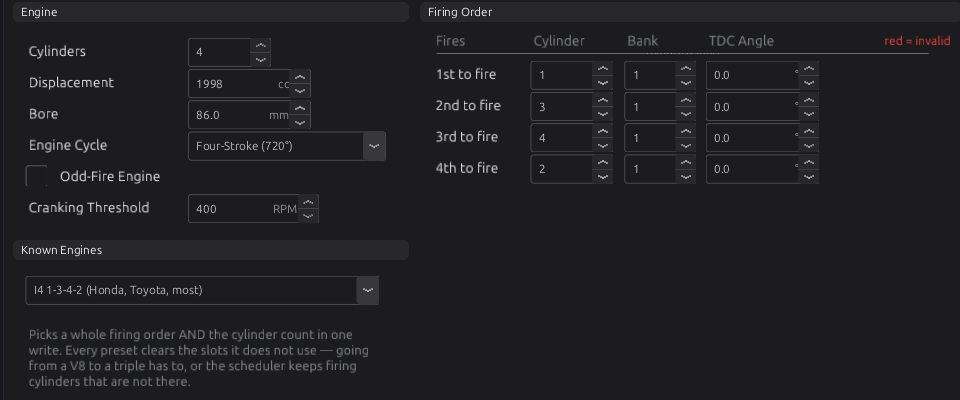
  <figcaption>Figure 6.3 — Cylinders & Firing for Example 1. The TDC angles are greyed because the ECU
  works them out from the firing order on an even-fire engine.</figcaption>
</figure>

**3b. Trigger** (**Configuration ▸ Engine Configuration ▸ Trigger System**,
[chapter 16](../part3/16-trigger.md)). Tick the stream for each sensor you wired (**Crank Primary**,
and a **Cam** stream if you have one). On each stream's page, set **Capture Input** to the pin you
wired and pick your wheel from the **Pattern** list, or from the Trigger Library
([reference](../reference/trigger-wheels.md)). A library wheel also writes its **Trigger Offset BTDC**
if it has one. Otherwise enter your engine's number on the Trigger System page.
<!-- src: definition/ecu.schema.yaml (streams[].enabled, capture_index); apps/studio-jf/src/model/TriggerWheel.cpp -->

<figure markdown>
  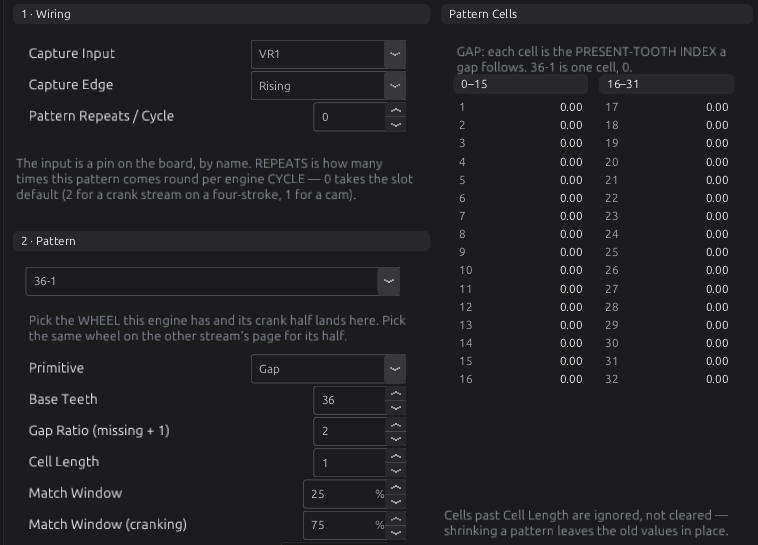
  <figcaption>Figure 6.4 — The Crank Primary stream for a 36-1 wheel on VR1. Choosing <b>36-1</b> in
  the pattern list fills in Primitive, Base Teeth, Gap Ratio and the cell. Tick <b>Enabled</b> at the
  top of the page, or the stream is not decoded at all.</figcaption>
</figure>

<figure markdown>
  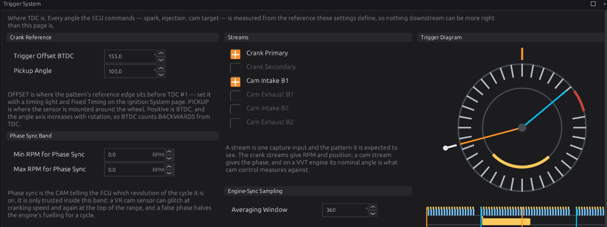
  <figcaption>Figure 6.5 — The Trigger System page, set up as in Example 2 (2JZ, 36-2 crank and a cam
  stream). <b>Pickup Angle</b> only changes how the diagram is drawn. The ECU never uses
  it.</figcaption>
</figure>

**3c. Sensors** (**Configuration ▸ Sensors**, [chapter 17](../part3/17-sensors.md)). For each sensor
you wired, at least coolant, air temperature, manifold pressure and throttle position: tick
**Enabled**, **Assign** the pin, and set the calibration for your sensor. A sensor that is not enabled
publishes nothing, which is not the same as reading zero. Modules that need it treat it as missing and
raise a code, for example **P1700** if the fuel model has no manifold pressure.
<!-- src: definition/ecu.schema.yaml sensors.sensor[].enabled help (P1700-P1702) -->

<figure markdown>
  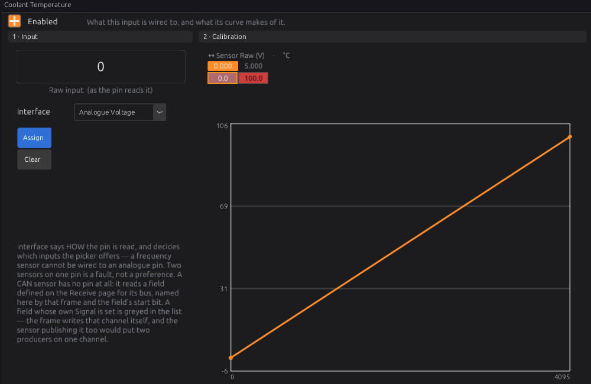
  <figcaption>Figure 6.6 — A sensor page. Tick <b>Enabled</b>, assign the pin, then replace the
  calibration with your sensor's own curve. The straight line shown is a placeholder.</figcaption>
</figure>

**3d. Fuel** ([chapter 19](../part3/19-fuel.md)). On **Engine Configuration ▸ Fuel System**, set the
**Injection Stages** (1 for a normal engine) and each stage's **Mode**. Sequential needs a cam signal
to fire each injector on its own cylinder. Semi-Sequential needs only the crank. When the stage's mode
or its number of outputs changes, the studio lays the injector outputs out for you, starting at LS1 for
cylinder 1.
<!-- src: definition/ecu.schema.yaml; apps/studio-jf/src/model/EngineOutputLayout.cpp -->

<figure markdown>
  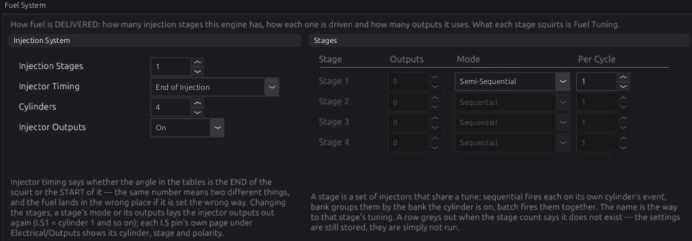
  <figcaption>Figure 6.7 — Fuel System for Example 1: one stage, semi-sequential, because the engine
  has no cam sensor. <b>Injector Outputs</b> must read On for the engine to get fuel.</figcaption>
</figure>

Then on **Fuel Tuning ▸ Stage 1 ▸ Setup**, enter your injectors' **Dead Time** and **Flow Rate** from
their data sheet, and how the rail pressure is known (**Pressure**: a sensor, a fixed regulator, or a
rising-rate regulator, and its **Base Pressure**). On **Fuel Setup**, check **Stoich AFR** (default
14.7, for petrol) and the **Air Model** (default Speed-Density).
<!-- src: definition/ecu.schema.yaml (dead time, flow rate) (stoich 14.7) (Air Model, default Speed-Density) -->

<figure markdown>
  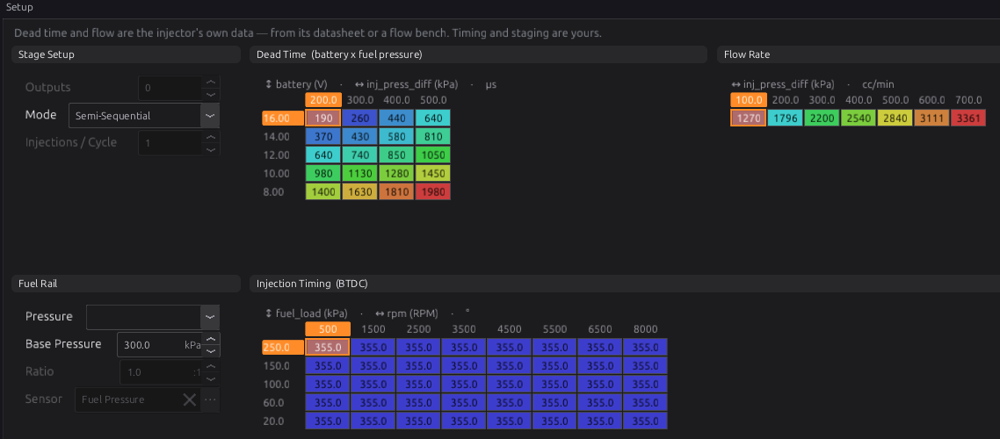
  <figcaption>Figure 6.8 — Stage 1 ▸ Setup, still at the defaults. The dead time and flow values are
  example injector data, not yours. Replace them before the first start.</figcaption>
</figure>

**3e. Ignition** (**Engine Configuration ▸ Ignition System**, [chapter 20](../part3/20-ignition.md)).
Set **Ignition Mode**: Wasted Spark (one coil per pair of cylinders, needs only crank sync),
Coil-on-Plug (one coil per cylinder, needs a cam signal to fire each one on its own), or Single Coil
(distributor). The studio lays the coil outputs out from it. Leave **Max Advance** (default 40°) and
**Min Advance** (default −10°) where they are for now. Then set the coil **Dwell Time**
(**Ignition Tuning ▸ Dwell Time**) from the coil's data. The default runs from 5.0 ms at 6 V down to
2.5 ms at 16 V.
<!-- src: definition/ecu.schema.yaml (ign_mode) (max/min advance), dwell_table default_row 5000…2500 µs; apps/studio-jf/src/model/EngineOutputLayout.cpp -->

<figure markdown>
  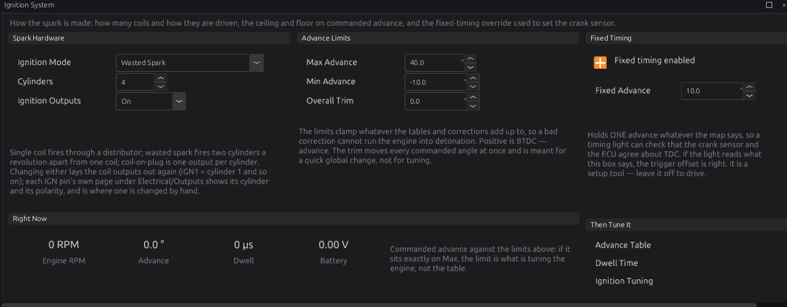
  <figcaption>Figure 6.9 — Ignition System, with Fixed Timing switched on as it will be for stage 7.
  Leave it off until then.</figcaption>
</figure>

**3f. Outputs** (**Configuration ▸ Electrical ▸ Outputs**, [chapter 18](../part3/18-outputs.md)). Open
each IGN and LS pin you wired and check that its **Function** and **Cylinder** match your wiring. For
the fuel pump, choose **Set up this output…** on its pin and pick the **Fuel Pump** template
([reference](../reference/output-templates.md)). It runs the pump for **Prime Time** (default 3 s) at
key-on, then keeps it running while trigger teeth arrive, and stops it 1500 ms after the last one.
<!-- src: definition/ecu.schema.yaml (fuel_pump template: prime_s 3, stop_ms 1500) -->

**3g. Burn, then check the codes.** Press **Burn**. Stop the engine if it is somehow turning, so the
new layout applies. Then look at the DTC dock. These codes mean the configuration is not complete:

| Code | Meaning |
|---|---|
| **P1650** | One pin is claimed by two functions |
| **P1651** | The firing order has a duplicate or missing cylinder |
| **P1652** | The trigger cannot establish position (no absolute reference) |
| **P1653** | A cylinder in the firing order has no coil output |
| **P1654** | A cylinder in the firing order has no stage 1 injector output |

<!-- src: definition/ecu.schema.yaml (P1650-P1654); firmware/Engine/EngineTask.cpp -->

**Done when:** the tune is burned and none of P1650 to P1654 is showing.

### Stage 4 — Check the sensors

:material-circle:{ .level-basic } Basic

Key on, engine off and cold. Read each value on the dash and ask whether it makes sense:

- **Coolant** and **Air Temp** close to the air temperature around the car.
- **MAP** close to the air pressure where you are (about 100 kPa at sea level) with the engine off.
- **Throttle** near 0 % closed and near 100 % with the pedal floored.
- **Battery** reading what a meter reads at the battery.

A value that is wildly wrong, or frozen, is a wiring or calibration fault. Fix it now
([chapter 17](../part3/17-sensors.md)).

**Done when:** every reading is believable.

### Stage 5 — Output test

:material-circle:{ .level-basic } Basic

The output test fires one output on its own with the engine stopped, so you can prove every wire goes
where you think.

1. Open the pin's page, for example **Configuration ▸ Electrical ▸ Outputs ▸ IGN1**.
2. In **Bench Test**, set **Count**, **On Time** and **Off Time**. The studio starts at 3 pulses,
   4 ms on and 500 ms off.
3. Press **Test**. **Stop** ends that pin's test. **Stop All** ends every test.
   <!-- src: definition/ecu.schema.yaml (pc_vars test_count 3, test_on_ms 4, test_off_ms 500); definition/boards/jaytek_v1.dashboard.gui (IGN1 Bench Test: Test / Stop / Stop All) -->

What happens depends on the pin's **Function**. An Ignition pin charges its coil for the On Time and
sparks when it releases. An Injector pin opens its injector for the On Time. Anything else is simply
switched on. The ECU refuses to run a test while the engine turns, cancels one the moment it starts,
and ends each test by itself, even if the studio is unplugged.
<!-- src: firmware/Engine/Modules/OutputTest.h, OutputTest.cpp -->

<figure markdown>
  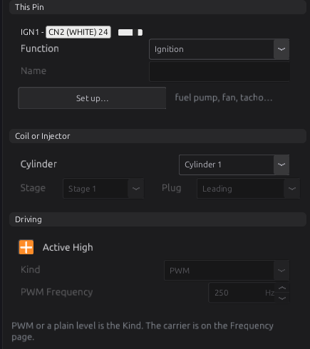
  <figcaption>Figure 6.10 — The top of an output page. It shows the connector pin (CN2 pin 24 for
  IGN1), what the pin does and which cylinder it serves. The <b>Bench Test</b> group is at the right
  of the same page.</figcaption>
</figure>

Check each coil with a spark tester or a plug laid on the head, and each injector by listening for the
click. On wasted spark, a coil output fires both of its plugs.

!!! danger "An injector test sprays fuel"
    With the rail pressurised, every injector click puts fuel in a cylinder. Test injectors with the
    fuel pump fuse or relay pulled. Keep the On Time short on coils: a coil held on for a long time
    overheats, and so can its driver.

**Done when:** every coil and every injector answers from the right cylinder.

### Stage 6 — Crank with no fuel

:material-circle:{ .level-intermediate } Intermediate

This proves the trigger before any fuel goes in.

1. Set **Injector Outputs** to **Off** (on the Fuel System page). The coils still fire, but no
   injector opens. This setting **survives a reset**, so remember to turn it back on.
   <!-- src: definition/ecu.schema.yaml (engine.inj_enable) -->
2. Open **Engine Configuration ▸ Trigger System ▸ Diagnostics**.
3. Crank for a few seconds and watch:
    - the sync lamp goes from **NO SYNC** to **CRANK SYNC** (or **PHASE SYNC** with a cam), within a
      revolution or two, and stays there;
    - **Engine RPM** shows a steady cranking speed, not 0;
    - **Engine State** reads **Cranking**;
    - **Error Rate** `trigger_error_pct` stays at **0 %**.

<figure markdown>
  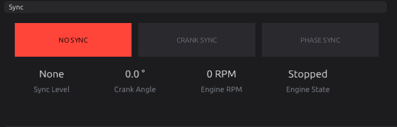
  <figcaption>Figure 6.11 — Trigger Diagnostics with the engine stopped. While cranking, the lit lamp
  should move right and stay lit, and Engine RPM should read the cranking speed.</figcaption>
</figure>

If sync never comes, or comes and goes, stop here and go to [chapter 16](../part3/16-trigger.md). The
**Tools ▸ Trigger Log** tool records the raw signal the ECU sees.

**Done when:** sync holds for the whole crank and the error rate stays at 0 %.

### Stage 7 — First start

:material-circle:{ .level-intermediate } Intermediate

1. Set **Injector Outputs** back to **On**.
2. On **Ignition System**, tick **Fixed timing enabled** and leave **Fixed Advance** at 10°. Fixed
   timing replaces every table and correction with this one number. An ignition cut still cuts.
   <!-- src: definition/ecu.schema.yaml (fixed timing, default 10.0°); firmware/Engine/Modules/Ignition.cpp -->
3. Check the **Cranking** fuel table (**Fuel Tuning ▸ Cranking**). It adds fuel by coolant
   temperature until the engine passes **Cranking Threshold** (default 400 rpm). The default runs from
   200 % when very cold to 50 % when hot.
   <!-- src: definition/ecu.schema.yaml cranking_fuel_table default_row 200 %…50 % (cranking_rpm 400) -->
4. Crank. When it catches, let it idle. Point a timing light at the cylinder 1 mark.
5. If the light shows **more** advance than 10°, raise **Trigger Offset BTDC** (Trigger System page)
   by the difference. If it shows **less**, lower it. The change applies straight away.
6. When the light reads 10°, untick **Fixed timing enabled** and press **Burn**.
   <!-- src: definition/ecu.schema.yaml (raising the offset makes events fire later); firmware/Scheduler/EnginePositionHal.cpp -->

<figure markdown>
  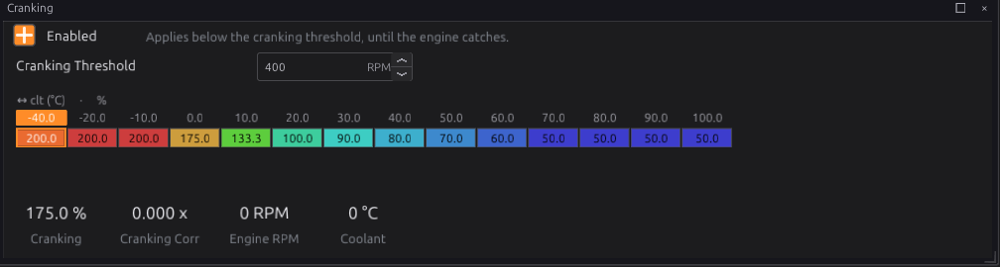
  <figcaption>Figure 6.12 — The Cranking enrichment curve as shipped. If the engine fires but will not
  catch, this curve and the injector data are the first places to look.</figcaption>
</figure>

!!! tip "Cranking advance"
    With **Cranking Advance** off (the default), the engine cranks on whatever the main advance table's
    lowest RPM column says. Switching it on uses the **Cranking Advance** curve instead: 4° cold down
    to 2° warm as shipped ([chapter 20](../part3/20-ignition.md)).
    <!-- src: definition/ecu.schema.yaml (cranking_ign_enable, default off) (cranking_ign_table: 4.0° cold to 2.0° warm) -->

**Done when:** the engine runs, and the timing light agrees with Fixed Advance.

### Stage 8 — First fixes

:material-circle:{ .level-intermediate } Intermediate

A running engine on a base tune is a starting point. Before you drive it:

1. **Record a log** of the start and warm-up (**Logging ▸ Start Recording**,
   [chapter 42](../part4/42-datalogging.md)).
2. **Fuel near idle.** With a wideband sensor, bring the VE table close around idle and light load
   ([chapter 38](../part4/38-tuning-fuel.md), [chapter 23](../part3/23-lambda.md)).
3. **Warm-up and after-start** enrichment, so it starts and idles cold as well as warm
   ([chapter 38](../part4/38-tuning-fuel.md)).
4. **Idle control**, so it holds its idle as it warms and as loads come on
   ([chapter 21](../part3/21-idle.md)).
5. **Timing.** Check the advance table is safe for your engine before any load
   ([chapter 39](../part4/39-tuning-ignition.md)).
6. **Protection.** Set the rev limiter and engine protection before the first drive
   ([chapter 27](../part3/27-speed-limiting.md), [chapter 29](../part3/29-protection.md)).

**Done when:** the engine starts and idles by itself, cold and warm, with no codes.

## Examples

:material-circle:{ .level-intermediate } Intermediate

!!! example "Example 1 — 2.0 L four-cylinder, crank sensor only"
    A four-cylinder with a 36-1 crank wheel read by a VR sensor, no cam sensor, one wasted-spark coil
    pack and four port injectors. The screenshots in stage 3 are this engine.

    | Setting | Value | Why |
    |---|---|---|
    | Cylinders / Displacement / Bore | 4 / 1998 cc / 86 mm | the engine |
    | Firing Order | 1-3-4-2 | from **Known Engines** |
    | Crank Primary | VR1 (CN3-6 +, CN3-7 −), pattern 36-1 | the only trigger sensor |
    | Trigger Offset BTDC | your engine's value, then the timing light | the generic 36-1 wheel carries no offset of its own |
    | Ignition Mode | Wasted Spark | needs only crank sync |
    | Coil outputs | IGN1 = cylinder 1 (fires 1 and 4), IGN2 = cylinder 2 (fires 2 and 3) | how the studio lays out a 1-3-4-2 wasted-spark engine |
    | Stage 1 Mode | Semi-Sequential | no cam, so not Sequential |
    | Injector outputs | LS1–LS4 = cylinders 1–4 (CN2-1, CN2-13, CN2-3, CN2-15) | note the interleaved pins |
    | Fuel pump | Fuel Pump template on a spare LS pin, through a relay | 3 s prime at key-on |

    <!-- src: definition/ecu.schema.yaml (trigger_wheels "36-1", no tdc_offset); apps/studio-jf/src/model/EngineOutputLayout.cpp (wasted-spark pairing) (injector rows); definition/boards/jaytek_v1.board.yaml -->

!!! example "Example 2 — 2JZ six-cylinder with a cam sensor"
    A six-cylinder with a 36-2 crank wheel and a cam sensor, coil-on-plug and sequential injection.

    | Setting | Value | Why |
    |---|---|---|
    | Cylinders / Firing Order | 6 / 1-5-3-6-2-4 | the engine |
    | Trigger | **2JZ 36-2 +Rear Cam** from the Trigger Library | fills in Crank Primary and Cam Intake B1 |
    | Trigger Offset BTDC | 155° | written by the library wheel; confirm with the light |
    | Pickup Angle | +105° | draws the diagram as you see the engine; the ECU ignores it |
    | Cam Intake B1 Capture Input | the pin the cam sensor is wired to (VR2 here) | the library cannot know your wiring |
    | Min RPM for Full (PHASE) Sync | about 1500 rpm | the field's help suggests this for a VR cam sensor |
    | Ignition Mode | Coil-on-Plug | six coils, IGN1–IGN6 |
    | Stage 1 Mode | Sequential | the cam gives phase |

    Below 1500 rpm the cam is not trusted to find phase, so while cranking the coils fire in companion
    pairs and the injectors fire every revolution with half the fuel. The engine still starts. It
    switches to sequential once it runs above the band and the cam is seen.
    <!-- src: definition/ecu.schema.yaml (trigger_wheels "2JZ 36-2 + Rear Cam", tdc_offset 155, cam stream); definition/ecu.schema.yaml (sensor_angle +105, min_full_sync ~1500 for a VR cam) -->

## Pitfalls and troubleshooting

:material-circle:{ .level-basic } Basic → :material-circle:{ .level-intermediate } Intermediate

| Symptom | Likely causes | Check |
|---|---|---|
| **Engine RPM** stays 0 while cranking | No sync: stream not enabled, wrong Capture Input, wrong pattern, sensor not wired | Stage 6. The Crank Primary stream's **Enabled** and **Capture Input**; the pattern; **P0338** means no signal at all ([chapter 16](../part3/16-trigger.md)) |
| Sync comes and goes, error rate above 0 % | Wrong wheel or edge; electrical noise; sensor gap | **P0336** (unexpected tooth count), **P0337** (gap not found), **P0339** (noise) ([chapter 16](../part3/16-trigger.md), [chapter 9](../part2/09-wiring-practice.md)) |
| Syncs, cranks, never fires | **Ignition Outputs** or **Injector Outputs** left Off (both survive a reset); config codes | The two switches on Ignition System and Fuel System; P1650–P1654 (stage 3g) |
| Fires but will not catch | Trigger offset far out; injector data or cranking fuel wrong | Stage 7 with the timing light; injector **Dead Time** and **Flow Rate**; the Cranking curve |
| Starts, then a code for a missing sensor | A sensor the fuel model needs is not enabled or not assigned | **P1700** (MAP), **P1701** (TPS), **P1702** (coolant) ([chapter 17](../part3/17-sensors.md)) |
| Flooded after many attempts | Too much cranking fuel | Switch on **Flood clear enabled** (**Fuel Tuning ▸ Start & Warmup**, off by default). It cuts fuel while cranking with the throttle at or above 90 % ([chapter 19](../part3/19-fuel.md)) |
| A change "did not stick" after a reset | Not burned | Press **Burn** before any reset or power-off |
| A change to cylinders, firing order, trigger or outputs seems ignored | The engine was running | These apply at the next engine stop |
| One cylinder dead | Coil or injector on the wrong pin; interleaved LS pins | Stage 5 again, pin by pin |

<!-- src: definition/ecu.schema.yaml (P0335-P0339) (P1700-P1702) (flood clear: off, 90 %) (ign_enable/inj_enable) -->

The full list of codes is in the [trouble code reference](../reference/dtc.md), and the full
symptom-by-symptom guide is [chapter 45](../part5/45-troubleshooting.md).

## Related

- [Chapter 7 — The jaytek_v1 board](../part2/07-board.md) (the pin-out)
- [Chapter 10 — Power, grounds and protection](../part2/10-power-grounds.md)
- [Chapter 15 — Engine and vehicle basics](../part3/15-engine-vehicle.md)
- [Chapter 16 — The trigger system](../part3/16-trigger.md)
- [Chapter 18 — Outputs and the pin system](../part3/18-outputs.md)
- [Chapter 19 — Fuel](../part3/19-fuel.md) and [Chapter 20 — Ignition](../part3/20-ignition.md)
- [Chapter 43 — Bench testing](../part5/43-bench-testing.md) (the output test and trigger log in depth)
- [Chapter 45 — Troubleshooting guide](../part5/45-troubleshooting.md)
- [Every Engine setting](../reference/settings/engine.md) and [every Trigger setting](../reference/settings/trigger.md)
