# The jaytek_v1 board

:material-circle:{ .level-basic } Basic → :material-circle:{ .level-advanced } Advanced

> **In one sentence:** the jaytek_v1 is the ECU hardware — three sealed harness connectors, the input
> and output circuits behind them, and a USB link to the studio — and this chapter is its map.

## Overview

:material-circle:{ .level-basic } Basic

Everything you wire to the ECU goes through three connectors: **CN2** (white), **CN3** (blue) and
**CN4** (black). This chapter says what is on every pin, what each kind of input and output can do,
how the ECU is powered, and what else is on the board. Read it before you plan a harness (chapters
8–14), and keep the pinout tables to hand while you build one.

Everything here comes from the board definition, `definition/boards/jaytek_v1.board.yaml`, which the
firmware and the studio also read. The pin diagrams and tables are generated from it.
<!-- src: definition/boards/jaytek_v1.board.yaml -->

## Concepts

:material-circle:{ .level-intermediate } Intermediate

<figure markdown>
  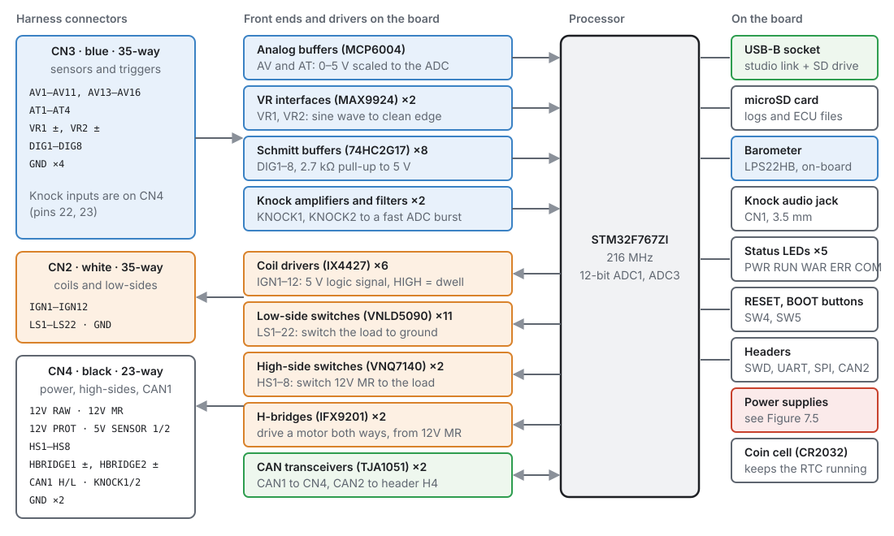
  <figcaption>Figure 7.1 — The board at a glance. Blue is inputs, orange is outputs, green is
  communication, red is power.</figcaption>
</figure>

### The processor

An **STM32F767ZIT6** (ARM Cortex-M7) running at **216 MHz** from an 8 MHz crystal, with a
32.768 kHz crystal and a **CR2032 coin cell** for the real-time clock. Analogue inputs are read by its
12-bit converters against a 3.0 V precision reference.
<!-- src: definition/boards/jaytek_v1.board.yaml; hardware/jaytek_v1_hardware.md -->

### What the connectors carry

| Connector | Colour | Ways | Carries |
|---|---|---|---|
| **CN2** | white | 35 | ignition outputs IGN1–12, low-side outputs LS1–22, one ground |
| **CN3** | blue | 35 | analogue inputs, temperature inputs, VR and digital inputs, four grounds |
| **CN4** | black | 23 | power in and out, high-side outputs HS1–8, H-bridges, knock inputs, CAN1, two grounds |

<!-- src: definition/boards/jaytek_v1.board.yaml -->

The headers on the board are TE Connectivity parts; the harness side needs the matching receptacle
housings. Both are named at the top of each connector's pinout below, and chapter 8 lists the
terminals and tools.

### Inputs

| Kind | How many | Pins | Can be used as |
|---|---|---|---|
| **Analogue voltage** | 15 | AV1–AV11, AV13–AV16 (CN3) | any 0–5 V sensor, a switch against trip points |
| **Temperature** | 4 | AT1–AT4 (CN3) | thermistors: each has a 2.7 kΩ pull-up to 5 V sensor supply 1 |
| **VR** | 2 | VR1, VR2 (CN3, two pins each) | crank or cam trigger from a two-wire magnetic sensor or a Hall sensor; frequency |
| **Digital** | 8 | DIG1–DIG8 (CN3) | trigger, switch, frequency, SENT, pulse width |
| **Knock** | 2 | KNOCK1, KNOCK2 (CN4) | knock sensors |

<!-- src: definition/boards/jaytek_v1.board.yaml (pins, caps) -->

**AV12** is not on a connector. It reads the ECU's own supply voltage through a divider, and that is
**Battery Voltage**.
<!-- src: definition/boards/jaytek_v1.board.yaml; hardware/jaytek_v1_hardware.md -->

<figure markdown>
  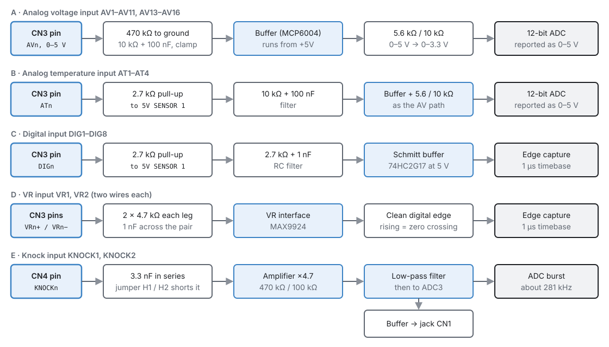
  <figcaption>Figure 7.2 — What is behind each kind of input pin.</figcaption>
</figure>

- **Analogue** inputs have a 470 kΩ resistor to ground, so a disconnected input reads near 0 V, a
  filter, and a buffer. The studio reports them as 0–5 V at the pin.
- **Temperature** inputs are the same, plus the 2.7 kΩ pull-up (chapter 17 shows how to calibrate a
  thermistor against it).
- **Digital** inputs have a 2.7 kΩ pull-up to 5 V sensor supply 1, a small filter, and a Schmitt
  trigger, so an open-collector Hall sensor needs no pull-up of its own.
- **VR** inputs go to a VR interface chip (MAX9924) that turns the sensor's sine wave into a clean
  edge. Its **rising** edge is the zero crossing of the sensor signal. A **Hall** sensor can use a VR
  input too: its signal to VR+, VR− left unconnected (the chip biases it internally), and a pull-up to
  5 V if the sensor needs one — the VR inputs have none of their own (chapter 11).
  <!-- src: hardware/PDF_JAYTEK_2026-04-29/Trigger (MAX9924, BIAS to ground = internal reference, no input pull-up); the MAX9924 datasheet (Analog Devices) -->
- **Knock** inputs have a series coupling capacitor, an amplifier and a filter, and are sampled in
  fast bursts (281.25 kHz) around the knock window. Jumpers **H1** and **H2** short the coupling
  capacitor for KNOCK1 and KNOCK2. The same signal is buffered to the **CN1** 3.5 mm jack so you can
  listen to the engine through headphones.
  <!-- src: hardware/PDF_JAYTEK_2026-04-29/{Analog,Temperature,Digital,Trigger,Knock}; hardware/jaytek_v1_hardware.md; firmware/Engine/Modules/KnockProfile.h; schematic (H1, H2, CN1) -->

### Outputs

| Kind | How many | Pins | Can be used as | Driver |
|---|---|---|---|---|
| **Ignition** | 12 | IGN1–IGN12 (CN2) | coil or igniter trigger signal; tacho | IX4427 gate driver |
| **Low-side** | 22 | LS1–LS22 (CN2) | injectors, relays, solenoids; PWM; tacho | VNLD5090 |
| **High-side** | 8 | HS1–HS8 (CN4) | loads switched to 12 V; PWM; tacho | VNQ7140 |
| **H-bridge** | 2 | HBRIDGE1 ±, HBRIDGE2 ± (CN4) | DC motors both ways: electronic throttle, idle valve; a pair drives one stepper | IFX9201 |

<!-- src: definition/boards/jaytek_v1.board.yaml; hardware/jaytek_v1_hardware.md -->

<figure markdown>
  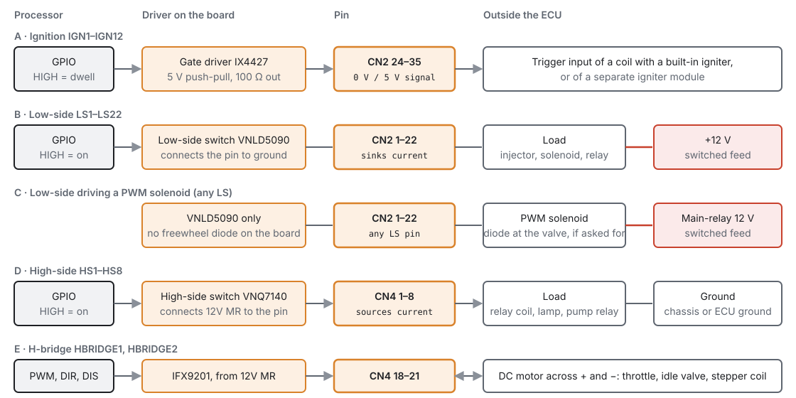
  <figcaption>Figure 7.3 — The output stages and what they connect to.</figcaption>
</figure>

- An **ignition** output is a **5 V logic signal**, not a coil driver. It triggers a coil with a
  built-in igniter, or a separate igniter module. High is dwell (charging); the fall to low is the
  spark.
- A **low-side** output connects its pin to ground when on. The load goes between the pin and a
  switched +12 V.
- **No output has a freewheel diode.** Each low-side pin has only its driver on it; the board has
  footprints for diodes on LS13–LS16 (D10–D13), but they are never fitted. Any LS pin drives
  injectors, relays and PWM valves alike; chapter 12 says when to add a diode at a valve.
  <!-- src: hardware/PDF_JAYTEK_2026-04-29/Low side/SCH_Low side_1 (VNLD5090 drain straight to the pin); D10-D13 unpopulated -->
- A **high-side** output connects its pin to 12 V (from CN4-13) when on. The load goes between the pin
  and ground.
- An **H-bridge** drives current either way through a motor across its + and − pins, powered from
  CN4-13.

The board definition does not state a continuous current rating for any output. Use the driver's own
data sheet, and use a relay for anything heavy (chapter 12).

### Communication

- **USB** (a USB-B socket on the board) is the studio's link to the ECU. The ECU also appears as a
  drive on the computer, showing the microSD card. The processor can run from USB power alone,
  without 12 V, for setting up on the bench (chapter 10).
- **CAN1** is on CN4 (pins 10 and 17). **CAN2** is on header **H4** on the board. Each has a TJA1051
  transceiver. Chapter 13 covers wiring and termination.
- **microSD card** holds on-board logs and the ECU's files (chapters 42 and 48).
  <!-- src: hardware/jaytek_v1_hardware.md; schematic (H4, CARD1, USB1, D20) -->

### Power

<figure markdown>
  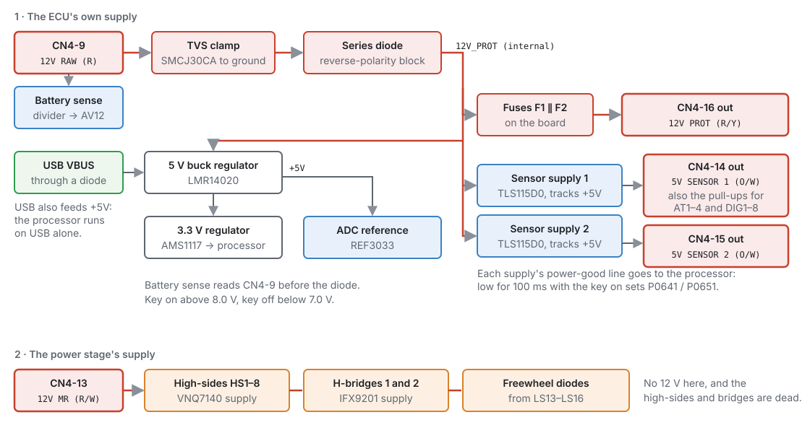
  <figcaption>Figure 7.4 — How the board is powered. Chapter 10 explains every part.</figcaption>
</figure>

There are two separate 12 V feeds:

- **CN4-9, 12 V RAW**, powers the ECU itself: through a transient clamp and a reverse-polarity diode
  to the regulators. **Battery Voltage** is read here, before the diode.
- **CN4-13, 12 V MR** (main relay), powers the **power stage**: the high-side switches and the
  H-bridges. Without it the high-sides and H-bridges cannot drive anything.

And three outputs:

- **CN4-14** and **CN4-15**: two separate **5 V sensor supplies**, each with a power-good line the
  ECU watches (chapter 17). Supply 1 also feeds the temperature and digital input pull-ups.
- **CN4-16, 12 V PROT**: a protected 12 V output, through two fuses in parallel on the board.
  <!-- src: schematic (CON_12V_RAW: CN4.9 D14 D15 R143; 12V_PROT: D14 F1 F2 L2 U37 U38; CON_12V_PROT: CN4.16 F1 F2; CON_12V_MR); hardware/jaytek_v1_hardware.md -->

Chapter 10 covers power, grounding, key-on and protection in full.

### On the board

| Part | What it is for |
|---|---|
| **LPS22HB** barometric sensor | **Barometric Pressure** read On-board (chapter 17) |
| **Status LEDs** PWR, RUN, WAR, ERR, COM | see below |
| **SW4 RESET** | restarts the processor |
| **SW5 BOOT** | held while resetting, starts the processor's USB bootloader for recovery (chapter 47) |
| **H3** | debug (SWD) header, for an ST-Link during firmware development (not needed for recovery) |
| **H5**, **H6** | spare SPI and serial (UART) headers |
| **H1**, **H2** | knock coupling-capacitor jumpers |
| **CN1** | 3.5 mm knock listening jack |
| **B1** CR2032 | keeps the real-time clock running with the power off |

<!-- src: schematic ($PACKAGES; nets ~NRST (H3.3, SW4), AUX_SPI (H5), UART (H6)); hardware/jaytek_v1_hardware.md -->

**What the status LEDs show:**
<!-- src: firmware/Led/LedTask.h; firmware/Led/LedTask.cpp -->

| LED | Shows |
|---|---|
| **PWR** | the board has power |
| **RUN** | trigger: off when no teeth are arriving, blinking twice a second while turning without sync, three quick flashes then a pause at Crank sync, solid at Phase sync (chapter 16) |
| **COM** | USB: a slow heartbeat when nothing is connected, solid when connected, flickering while data flows |
| **WAR** | flashes out the active Level 1 and 2 trouble codes, one after another |
| **ERR** | flashes out the active Level 3 trouble codes, one after another |

The WAR and ERR LEDs flash each code digit by digit: a digit from 1 to 9 is that many short flashes, a
0 is one long flash, with a gap between digits and a longer gap before the next code. So P0117 is: one
long, one short, one short, seven short. Chapter 44 lists the codes.

## Pinout

:material-circle:{ .level-basic } Basic

Each connector below is drawn looking at the pins, in pin-number order, with the default wire colour
the studio uses in its wiring hints. The tables list what each pin can be used for.

### CN2 — white, ignition and low-side outputs

<figure markdown>
  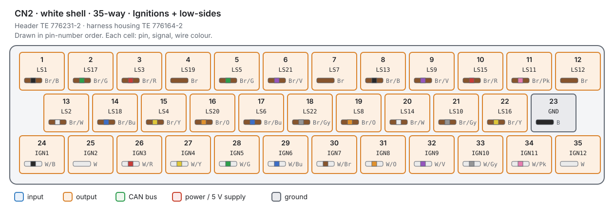
  <figcaption>Figure 7.5 — CN2. The low-side outputs are interleaved: check the number on each pin.</figcaption>
</figure>

--8<-- "part2/_pins-cn2.md"

### CN3 — blue, sensors and triggers

<figure markdown>
  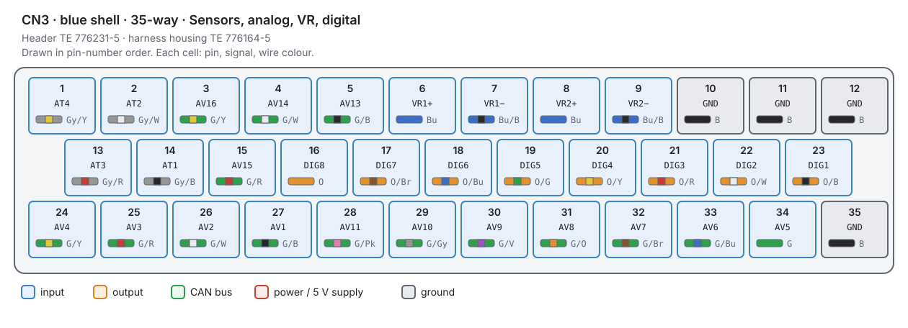
  <figcaption>Figure 7.6 — CN3.</figcaption>
</figure>

--8<-- "part2/_pins-cn3.md"

### CN4 — black, power, high-sides, H-bridges, knock, CAN1

<figure markdown>
  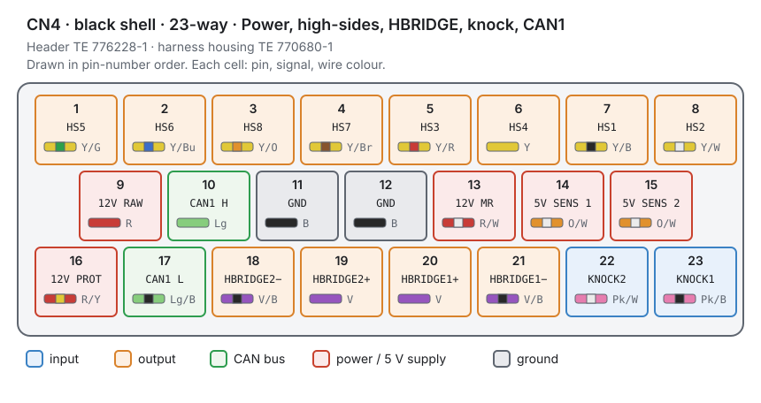
  <figcaption>Figure 7.7 — CN4.</figcaption>
</figure>

--8<-- "part2/_pins-cn4.md"

## Procedure — finding a pin in the studio

:material-circle:{ .level-basic } Basic

You never type a pin number in the studio. Every input and output is chosen from a list that only
offers the pins that can do the job, and the page then shows the connector, pin and wire colour.

1. **Outputs**: **Configuration ▸ Electrical ▸ Outputs** lists every output pin with what it does and
   which cylinder it serves (chapter 18).

    <figure markdown>
      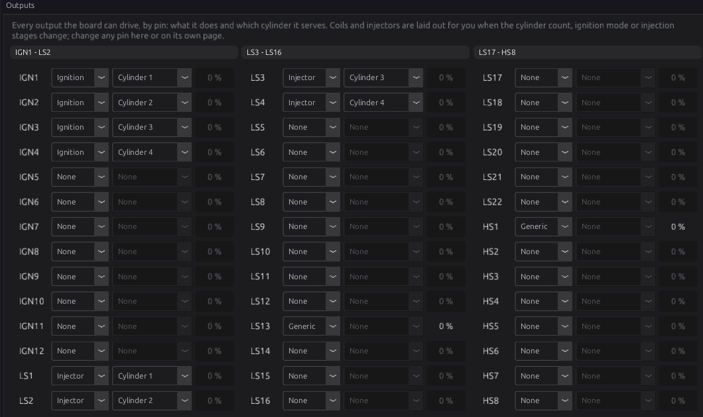
      <figcaption>Figure 7.8 — Every output pin on one page.</figcaption>
    </figure>

2. Click a pin to open its own page, which shows its connector position and wire colour:

    <figure markdown>
      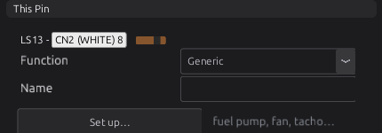{ width="430" }
      <figcaption>Figure 7.9 — LS13 is CN2 pin 8.</figcaption>
    </figure>

3. **Inputs**: on a sensor's page, **Assign** picks the pin, and the page shows where it is:

    <figure markdown>
      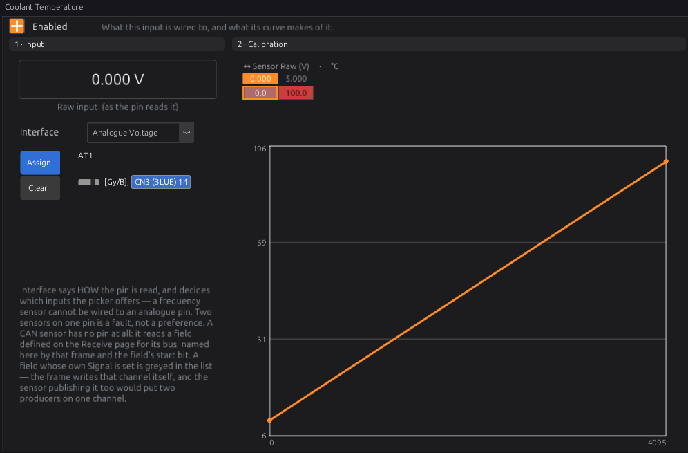{ width="500" }
      <figcaption>Figure 7.10 — Coolant temperature on AT1, CN3 pin 14.</figcaption>
    </figure>

4. **H-bridges**: **Configuration ▸ Electrical ▸ Half Bridges** switches each bridge on and sets its
   PWM frequency (chapter 22 for throttles, chapter 21 for steppers).

    <figure markdown>
      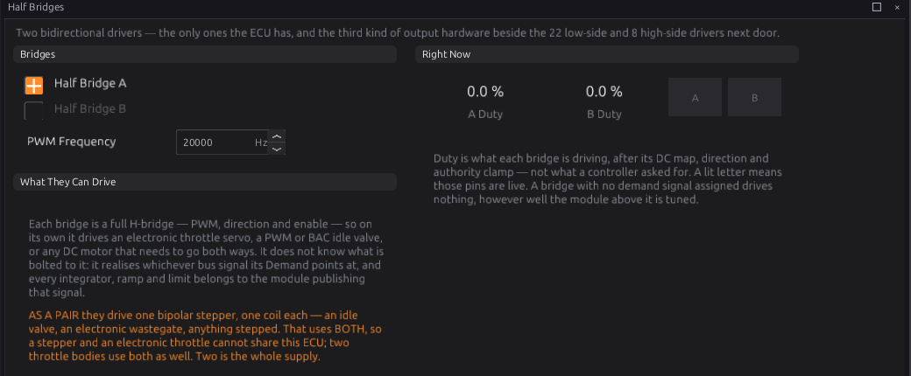
      <figcaption>Figure 7.11 — The two H-bridges.</figcaption>
    </figure>

5. **CAN**: **Configuration ▸ CAN Bus ▸ CAN1** switches the bus on and sets its bit rate (chapter 33).

    <figure markdown>
      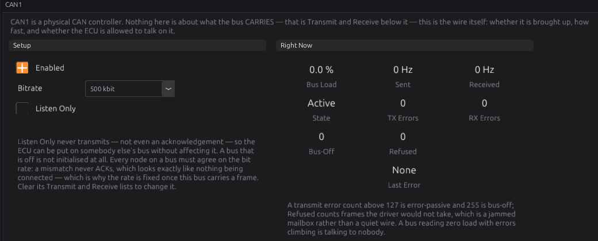
      <figcaption>Figure 7.12 — CAN1.</figcaption>
    </figure>

## Examples

:material-circle:{ .level-intermediate } Intermediate

!!! example "A four-cylinder, sequential, with coil-on-plug and an idle valve"
    | Function | Pins | Why |
    |---|---|---|
    | Coils 1–4 | IGN1–IGN4 (CN2-24 to 27) | coils with built-in igniters |
    | Injectors 1–4 | LS1–LS4 | low-side, 12 V from the injector relay |
    | Idle valve (PWM) | LS13 | any low-side pin can drive a PWM valve |
    | Fuel pump relay, fan relay | two more low-sides | relays switched to ground |
    | Crank (VR), cam (Hall) | VR1, DIG1 | the VR interface for the magnetic sensor |
    | MAP, TPS | AV1, AV2 | 0–5 V sensors on 5 V SENS 1 |
    | Coolant, air temperature | AT1, AT2 | thermistors with the on-board pull-up |
    | Knock | KNOCK1 | |

!!! example "A drive-by-wire V8"
    The electronic throttle takes **HBRIDGE1** (CN4-20 and 21), and its two position tracks and the two
    pedal tracks take four analogue inputs, split across **both** 5 V sensor supplies so one supply
    failure cannot take out both tracks of a pair (chapters 11 and 22). With **HBRIDGE2** free, the
    ECU can still drive a motorised wastegate or a DC idle valve, but not a stepper, which needs both
    bridges.

## Pitfalls

:material-circle:{ .level-basic } Basic → :material-circle:{ .level-advanced } Advanced

| Mistake | What happens | Instead |
|---|---|---|
| A coil primary wired straight to an IGN pin | The IGN output is a 5 V signal and cannot switch a coil | Use coils with igniters, or an igniter module |
| Nothing on CN4-13 | High-sides and H-bridges do nothing | Feed CN4-13 from the main relay (chapter 10) |
| A heavy load on an output pin | The driver overheats or shuts down | A relay, driven by the output |
| Sensors on the 12 V PROT output | 12 V on a 5 V sensor destroys it | 5 V sensors on CN4-14 or 15 |
| Two tracks of a safety pair on one 5 V supply | One supply fault takes out both | Split them across the two supplies |
| Reading the CN2 low-side pins in order | LS1–LS22 are interleaved | Use the table |

## Related

- [Chapter 8 — Tools and materials](08-tools.md) (the connector parts, terminals and crimpers)
- [Chapter 10 — Power, grounds and protection](10-power-grounds.md)
- [Chapter 11 — Wiring sensors](11-wiring-sensors.md)
- [Chapter 12 — Wiring outputs](12-wiring-outputs.md)
- [Chapter 13 — CAN bus](13-can-bus.md)
- [Chapter 18 — Outputs and the pin system](../part3/18-outputs.md)
- [Specifications](../reference/specifications.md)
