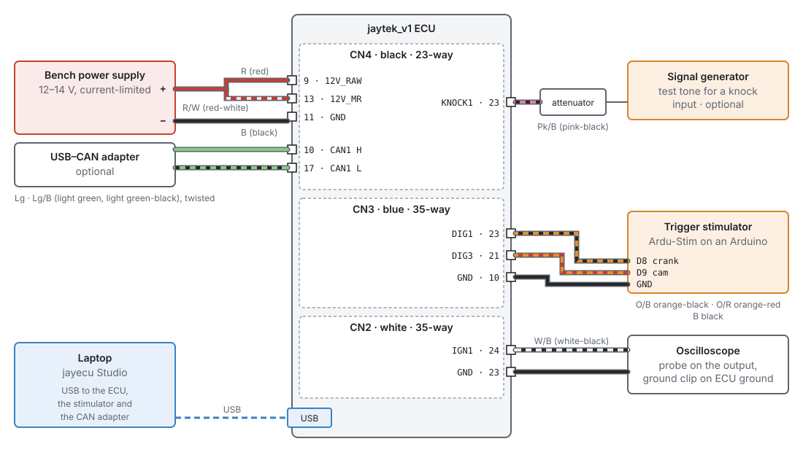
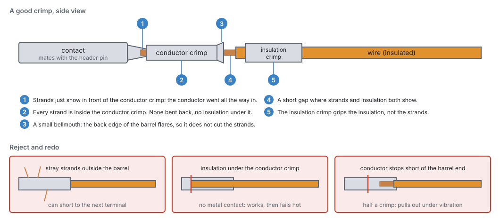

# Tools and materials

:material-circle:{ .level-basic } Basic → :material-circle:{ .level-advanced } Advanced

> **In one sentence:** the tools and materials you need to build a harness for the jaytek_v1 board,
> test it, and bench-test the ECU before it goes near an engine.

## Overview

:material-circle:{ .level-basic } Basic

Most wiring faults come from the wrong tool. Examples are a terminal squashed with pliers, a wire
twisted together and taped, or a meter that cannot show a glitch. None of this chapter's tools are
exotic. It pays to have them before you start, because a harness built with the wrong tools usually
has to be rebuilt.

The kit falls into five groups:

1. **Harness-building tools:** strippers, the connector crimper, a splice crimper, a heat gun and a
   terminal extraction tool.
2. **Materials:** the three mating connectors and their terminals, automotive wire, shielded cable,
   heat-shrink, sleeving and labels.
3. **Test tools:** a multimeter, an oscilloscope and a current clamp.
4. **Bench tools:** a current-limited bench power supply, the trigger stimulator, and optionally a USB–CAN
   adapter and a signal generator.
5. **The laptop** that runs jayecu Studio.

This chapter says what each one is for and what to look for. Chapter 9 explains how to use them to
build a good harness, and chapter 43 explains how to bench-test with them.

## Concepts

:material-circle:{ .level-basic } Basic → :material-circle:{ .level-advanced } Advanced

### The connectors you are crimping for

:material-circle:{ .level-basic } Basic

The jaytek_v1 board has three sealed TE AMPSEAL headers. Each takes a harness-side plug housing in
the same colour key, so a plug only fits its own header.
<!-- src: definition/boards/jaytek_v1.board.yaml -->

| Header | Colour | Ways | Board part | Harness plug (mate) | What it carries |
|---|---|---|---|---|---|
| **CN2** | white | 35 | 776231-2 | 776164-2 | Ignition outputs IGN1–12 and low-side outputs LS1–22, one ground |
| **CN3** | blue | 35 | 776231-5 | 776164-5 | Analog inputs AV and AT, VR1 and VR2, digital inputs DIG1–8, four grounds |
| **CN4** | black | 23 | 776228-1 | 770680-1 | Power in, the 5 V sensor supplies, high-side outputs HS1–8, H-bridges, CAN1, knock inputs, two grounds |

<!-- src: definition/boards/jaytek_v1.board.yaml -->

You need one of each plug housing, the loose terminals that fit them, and **sealing plugs** for any
cavities you leave empty. The housing seals around each wire. An empty hole lets water in, and a
sealing plug closes it.

!!! note "Terminals and the crimper are TE parts"
    The board file names the headers and the plug housings, but not the terminals. Choose the AMPSEAL
    terminal that TE's specification for these housings lists for your wire size, and the hand tool TE
    lists for that terminal. Most harness suppliers sell the housings, terminals and sealing plugs as a
    kit. Buy extra terminals: you will cut some off while you learn.

### What each tool is for

:material-circle:{ .level-basic } Basic

| Tool | What it is for | What to look for |
|---|---|---|
| **Wire strippers** | Removing insulation without nicking the strands | Self-adjusting strippers suit thin-wall automotive wire. A nicked strand is a weak point that breaks later. |
| **AMPSEAL crimper** | Crimping the terminals for CN2, CN3 and CN4 | The ratchet tool made for this terminal family, with the die for your wire size. The ratchet does not release until the crimp is complete. |
| **Splice crimper** | Crimp splices and ring terminals | A ratchet tool with dies for the splices you use. Do not use the crushing jaws of a pair of pliers. |
| **Heat gun** | Shrinking heat-shrink and sleeving | Adjustable heat. A lighter scorches the tube and does not melt the adhesive evenly. |
| **Terminal extraction tool** | Removing a terminal from a plug without damaging it | The tool made for AMPSEAL. A pin pushed in the wrong cavity is common, and forcing it out ruins the terminal and the seal. |
| **Flush cutters** | Cutting wire and cable ties | Sharp and flush, so a cut tie leaves no sharp edge to cut a hand or a wire. |
| **Soldering iron** | Splices only, where you choose to solder them | Enough power to heat the joint quickly. Never solder a crimped connector terminal (see *Pitfalls*). |
| **Multimeter** | Continuity, resistance, supply voltages, sensor voltages | Auto-ranging, with a continuity beeper and fine test leads that can reach a terminal from behind without forcing the seal. |
| **Oscilloscope** | Trigger signals, injector and coil drive, PWM, noise | Two channels are enough to start. You need one to see a crank pattern or a glitch, which a meter cannot show. |
| **Current clamp** | Load current without breaking the circuit | A DC clamp for the meter or scope. It is useful for sizing wires and fuses from what a load really draws. |

<!-- src: general practice; STANDARD.md §4 allows it where the firmware does not decide the answer -->

!!! warning "Use a meter, not a test light, on ECU circuits"
    An incandescent test light draws a lot of current. On a sensor input or a sensor supply it can
    pull the signal down or overload the supply. Use a meter on every ECU circuit. Keep the test light
    for fuses and relay feeds.

### Materials

:material-circle:{ .level-basic } Basic

- **Automotive wire.** Use thin-wall, cross-linked insulated wire (sold as TXL or GXL). It resists
  heat and fuel, it is thin enough for a sealed plug to seal around, and it is flexible. Avoid PVC
  hookup wire and solid-core wire. PVC softens near the engine, and solid core cracks under
  vibration. Chapter 9 gives sizes.
- **Wire colours.** The board file suggests a colour for every terminal, and the studio shows it
  beside every pin you assign (chapter 9, Figure 9.4). The codes are two-letter: B black, Br brown,
  Bu blue, G green, Gy grey, Lg light green, O orange, Pk pink, R red, V violet, W white, Y yellow.
  After the slash comes the stripe, so O/B is orange with a black stripe.
  <!-- src: definition/boards/jaytek_v1.board.yaml; apps/studio-jf/src/surface/widgets/WireColors.h -->
- **Shielded twisted-pair cable** for the VR crank and cam sensors, and **shielded cable** for the
  knock sensors. Use **twisted pair** for CAN (chapter 13 has the cable).
- **Heat-shrink:** adhesive-lined (dual-wall) heat-shrink for splices that must seal, and thin-wall
  heat-shrink for labels and strain relief.
- **Sleeving:** braided sleeving or convoluted tube for the finished bundles, and grommets where
  the harness goes through metal.
- **Splices:** crimp splices sized for the wires they join, sealed with adhesive heat-shrink.
- **Labels:** printable heat-shrink labels, or a label printer. You label both ends of every wire
  (chapter 9).
- **Fuses, relays and a fuse box** for the power side. Chapter 10 covers these.

### The bench kit

:material-circle:{ .level-intermediate } Intermediate

Before the ECU goes in a car, test it and your harness on the bench. You need to power it, talk to it,
and give it a pretend engine to run against. Figure 8.1 shows the full kit.

<figure markdown>
  
  <figcaption>Figure 8.1: The bench kit and where each piece connects. Terminal numbers and wire
  colours are the board file's. Only the supply, the laptop and the stimulator are needed to
  start. The CAN adapter, the scope and the signal generator are for later.</figcaption>
</figure>

**Bench power supply.** Use an adjustable supply with a current limit, set to battery voltage
(12–14 V). The ECU takes its supply on **CN4 pin 9** (`12V_RAW`, red), its main-relay feed on **CN4
pin 13** (`12V_MR`, red-white) and ground on **CN4 pins 11 and 12**. The main-relay feed supplies the
high-side output drivers. On the bench, feed it straight from the supply. Set the current limit low
while you connect things, and raise it only when you add a load that needs it. A wiring mistake then
trips the limit instead of burning a wire. Chapter 10 describes the feeds in full.
<!-- src: definition/boards/jaytek_v1.board.yaml; hardware/PDF_JAYTEK_2026-04-29/High side (VNQ7140 supply = CON_12V_MR) -->

**The trigger stimulator.** An engine's crank and cam sensors produce a pattern of pulses as the
engine turns. A stimulator makes the same pattern on the bench, so the ECU syncs, shows engine speed
and fires its outputs as if the engine were running. The project's bench uses **Ardu-Stim**, which
runs on an Arduino Nano, Uno or Mega. On a Nano or Uno, pin 8 gives the crank signal, pin 9 the cam
signal and pin 10 a second cam. An optional potentiometer on pin A0 sets engine speed by hand.
<!-- src: tools/Ardu-Stim/README.md -->

The stimulator puts out 5 V logic, so on the bench it goes into two of the ECU's **digital inputs**:
the crank signal into **DIG1** (CN3 pin 23) and the cam signal into **DIG3** (CN3 pin 21). Its ground
goes to an ECU ground on CN3. The digital inputs have a Schmitt-trigger buffer and a 2.7 kΩ pull-up to
5 V on the board, so a 5 V square wave drives them directly.
<!-- src: tools/gen_rebench.py (crank → capture index 2 = DIG1, cam → DIG3); definition/boards/jaytek_v1.board.yaml; hardware/PDF_JAYTEK_2026-04-29/Digital (2.7 kΩ pull-up, 1 nF filter, 74HC2G17) -->

The stimulator talks to the laptop over USB serial at 115200 baud. You choose the wheel pattern and
speed from its program. The project's bench scripts find it on the laptop by asking each USB serial
port which wheel it is on. A USB–CAN adapter is also a USB serial device, so do not assume the
stimulator is always on the first port.
<!-- src: tools/Ardu-Stim/ardustim/ardustim/comms.cpp; tools/gen_rebench.py -->

**Oscilloscope.** Put a probe on an output and the ground clip on an ECU ground. On an ignition
output (IGN1 is CN2 pin 24), the signal is **high while the coil charges** (dwell), and the spark
happens where it falls. A low-side output pulls its pin to ground while it is on. With a load
fitted, the scope shows supply voltage while the output is off and close to 0 V while it is on.
<!-- src: definition/boards/jaytek_v1.board.yaml (IGN: HIGH = dwell) (LS: HIGH = on); hardware/jaytek_v1_hardware.md "Signal Polarity & Driver Notes" -->

**USB–CAN adapter (optional).** Use it to see what the ECU sends on CAN1 (CN4 pins 10 and 17). The
project's bench uses a serial-line (slcan) adapter. When the adapter is the only other device on the
bus, it must acknowledge frames. In listen-only mode it leaves the ECU retransmitting. The board
already has a 120 Ω terminating resistor on its CAN lines. Chapter 13 covers CAN.
<!-- src: tools/can_capture.py; hardware/PDF_JAYTEK_2026-04-29/CAN (R63 120 Ω across CAN_H/CAN_L) -->

**Signal generator (optional, Advanced).** A generator can play a test tone into a knock input
(KNOCK1 is CN4 pin 23) through an **attenuator**, to check knock detection end to end. Leave the
generator's DC offset at 0 V. The knock input biases the signal itself.
<!-- src: tools/bench_knock_siggen.py; tools/dso2d15.py -->

### The laptop

:material-circle:{ .level-basic } Basic

jayecu Studio runs on **64-bit Linux** (an AppImage) and on **Windows** (an installer). The laptop
connects to the ECU with a USB cable. On Linux, install the USB permission rule so that the studio and
the firmware updater can reach the ECU (chapter 3). The laptop needs a free USB port for the ECU, and
one more each for the stimulator and a CAN adapter if you use them. A USB hub is fine.
<!-- src: Makefile; apps/studio-jf/tools/make_appimage.sh; apps/studio-jf/installer/studio.iss; tools/udev/70-jayecu.rules -->

!!! tip "Power the laptop from its battery in the car"
    A laptop on a mains charger in the car can bring charger noise and ground offsets into the USB
    ground. If you see comms drop-outs or noisy readings only while it is charging, unplug the charger.

### Recovery tools

:material-circle:{ .level-advanced } Advanced

The firmware is updated over the same USB cable (chapter 46), and recovery needs **no special
hardware** either. If the board ever cannot start, open the case, hold **SW5 BOOT**, press and release
**SW4 RESET**, then let go of BOOT. The processor starts its own built-in USB bootloader (DFU), and the
studio's **Connect** button then offers to install firmware over the ordinary USB cable (chapter 47).
All you need is a screwdriver for the case.

An **ST-LINK** programmer on the board's SWD debug header (**H3**) is another way in, useful for
firmware development, but you do not need one to recover an ECU.
<!-- src: hardware/jaytek_v1_hardware.md (SW4 reset, SW5 boot); tools/udev/70-jayecu.rules (USB DFU 0483:df11); apps/studio-jf/main.cpp (connectFn: dfu::devicePresent -> s_offerRecovery); hardware/jaytek_v1_hardware.md (SWD on H3) -->

## Procedure

:material-circle:{ .level-basic } Basic → :material-circle:{ .level-intermediate } Intermediate

### Crimping a connector terminal

:material-circle:{ .level-basic } Basic

A crimp is a cold weld. The terminal is squeezed so hard around the strands that metal flows into
metal, and no air or water can reach the joint. A good crimp is stronger than the wire and never
loosens. A bad crimp can pass every test on the bench and then fail hot, under vibration.

<figure markdown>
  
  <figcaption>Figure 8.2: What a good crimp looks like (checks 1–5, used in the steps below), and three
  faults that mean you cut it off and start again.</figcaption>
</figure>

1. **Cut the wire to length** and **slide on anything that goes over it** first: a label or a length of
   heat-shrink. The terminal will not let them past later.
2. **Strip the end** to the length the terminal needs. The strands should reach just past the front
   of the conductor crimp, and the insulation should sit fully inside the insulation crimp. Do not
   twist the strands tight. Just smooth them straight.
3. **Put the terminal in the crimper's die** for your wire size, the right way up, and close the tool
   until it just holds the terminal.
4. **Push the stripped wire in** until the strands show in front of the conductor crimp
   (Figure 8.2, check 1) and the insulation is under the insulation crimp (check 5).
5. **Squeeze the tool through its full stroke** until the ratchet releases.
6. **Inspect it** against checks 1–5. Look for strands outside the barrel, insulation under the
   conductor crimp, or a conductor that stops short. If you see any of these, cut it off and start
   again.
7. **Pull-test it.** Give the wire a firm tug. It must not move in the terminal.
8. **Insert it into the plug** from the wire side, into the right cavity, until it clicks. Tug the wire
   gently to prove it is locked. Check the cavity number against your plan (chapter 9) **before** you
   insert it. Taking a terminal out again is a job for the extraction tool.
9. **Fill every empty cavity with a sealing plug** when the plug is complete.

!!! tip "Practise first"
    Crimp half a dozen terminals on offcuts and cut them open with a sharp blade. What you see inside
    is what the rest of the harness will be like.

### Setting up the bench

:material-circle:{ .level-intermediate } Intermediate

Build a short **bench harness**: the three plugs with 30–50 cm tails, labelled. Then you can connect
test equipment without touching the car's harness. Then, following Figure 8.1:

1. **Wire the supply:** CN4 pin 9 and pin 13 to the supply's positive through an inline fuse, and CN4
   pins 11 and 12 to its negative. Set the current limit low. Turn it on, and check that the supply
   current settles and stays steady.
   <!-- src: definition/boards/jaytek_v1.board.yaml -->
2. **Connect the laptop** by USB and open the studio (chapter 5).
3. **Wire the stimulator:** Arduino pin 8 to DIG1 (CN3 pin 23), pin 9 to DIG3 (CN3 pin 21), Arduino
   ground to CN3 pin 10. Set the crank and cam inputs to DIG1 and DIG3 on the trigger pages
   (chapter 16).
   <!-- src: tools/gen_rebench.py; definition/boards/jaytek_v1.board.yaml -->
4. **Pick a wheel and a speed** on the stimulator, and watch the studio's engine speed and sync.
5. **Add test loads** (a spare injector, a coil with an igniter, an LED with a resistor) to the outputs
   you want to watch, and raise the supply's current limit to suit.
6. **Scope** the outputs and the trigger inputs as you go (chapter 43).

## Examples

:material-circle:{ .level-intermediate } Intermediate

!!! example "Example 1: the minimum kit for a first install"
    A four-cylinder car, one harness, no bench testing beyond a first power-up.

    | Item | Why |
    |---|---|
    | CN2, CN3, CN4 plug housings, terminals and sealing plugs | the three connectors (you will use only some cavities) |
    | AMPSEAL crimper and extraction tool | the connector terminals |
    | Self-adjusting strippers, flush cutters | clean, un-nicked strip lengths |
    | Automotive thin-wall wire in 0.5 and 1.0 mm² (about 20 and 18 AWG), several colours | signals and outputs; power and grounds (chapter 9) |
    | One length of shielded twisted pair | the crank sensor |
    | Crimp splices, adhesive heat-shrink, heat gun | sensor-ground and 5 V supply splices |
    | Heat-shrink labels | both ends of every wire |
    | Multimeter | continuity and first-power checks |

!!! example "Example 2: the full bench kit"
    As used to develop and test the firmware:

    - bench supply into CN4 pins 9 and 13, ground on 11 and 12, with a current limit;
    - Ardu-Stim on an Arduino Uno: crank into DIG1, cam into DIG3, ground to CN3;
    - a two-channel scope that also has a signal generator. Its generator plays test tones into KNOCK1
      through an attenuator;
    - a serial-line USB–CAN adapter on CAN1;
    - the laptop running the studio, with the ECU, the stimulator and the CAN adapter on USB.

    <!-- src: tools/gen_rebench.py; tools/dso2d15.py; tools/bench_knock_siggen.py; tools/can_capture.py -->

## Pitfalls and troubleshooting

:material-circle:{ .level-basic } Basic → :material-circle:{ .level-advanced } Advanced

| Symptom | Likely cause | Check |
|---|---|---|
| A terminal pulls out of its crimp | Wrong die size; crimped with pliers; insulation under the conductor crimp | Cut it off and recrimp with the right die (Figure 8.2) |
| A terminal pushes back out of the plug | Not fully inserted, or inserted into the wrong cavity and forced | Push it until it clicks; if it was forced, extract it with the tool and use a new terminal |
| Solder has wicked up behind a crimped terminal | The terminal was soldered after crimping | The wire is now stiff and will break at that point under vibration. Replace it and never solder a crimped terminal. |
| Water in a connector | An empty cavity with no sealing plug; wire too thin for the seal to grip | Plug every empty cavity; use wire whose insulation the seal is made for |
| The ECU does not see the stimulator | Stimulator ground not connected to ECU ground; inputs not set to DIG1/DIG3; wrong USB port for the stimulator | Ground wire to CN3; the trigger pages (chapter 16); which serial port the stimulator is on |
| The stimulator program cannot find the Arduino | Another USB serial device took the first port | Unplug the CAN adapter, or choose the port by hand |
| Noisy readings only while the laptop charges | Charger noise on the USB ground | Run the laptop on its battery |
| The bench supply hits its current limit at switch-on | A short in the bench harness, or a load that really needs more | Disconnect loads one by one; check the harness with the meter unpowered |

## Related

- [Chapter 7: The jaytek_v1 board](07-board.md): connectors, pinout and specifications
- [Chapter 9: Wiring practice](09-wiring-practice.md): using these tools to build the harness
- [Chapter 10: Power, grounds and protection](10-power-grounds.md): fuses, relays and feeds
- [Chapter 13: CAN bus](13-can-bus.md): cable and termination
- [Chapter 43: Bench testing](../part5/43-bench-testing.md): what to do with the bench kit
- [Chapter 47: Recovering an ECU](../part6/47-recovery.md): the BOOT button and the USB bootloader
