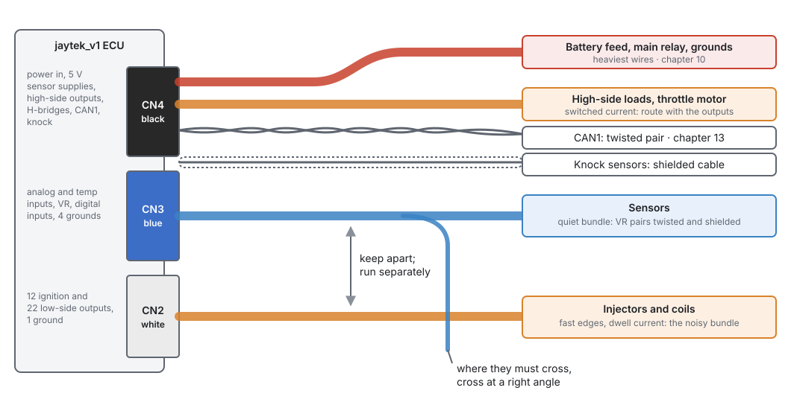
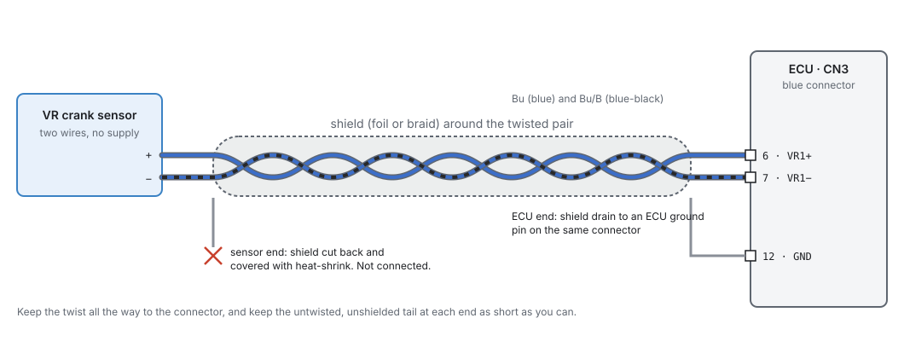
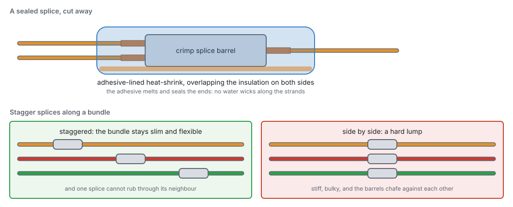
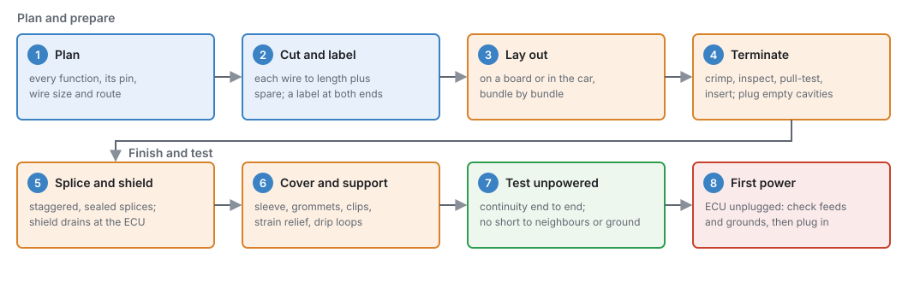

# Wiring practice

:material-circle:{ .level-basic } Basic → :material-circle:{ .level-advanced } Advanced

> **In one sentence:** how to build a harness for the jaytek_v1 board that carries clean signals,
> survives heat, water and vibration, and can be understood and repaired years later.

## Overview

:material-circle:{ .level-basic } Basic

The ECU can only be as good as the wires that feed it. A sensor wire that picks up ignition noise
gives a jumpy reading. An undersized ground shifts every sensor reading. A crank signal with a
glitch on it loses sync. Most of these faults are intermittent and look like tuning or firmware
problems, so they are expensive to find. Good wiring practice prevents them.

This chapter covers:

- how the board's three connectors split the harness into **quiet** and **noisy** bundles;
- choosing **wire sizes** for current and voltage drop;
- **twisting and shielding** the signals that need it;
- **splices**, **connectors**, **sealing** and **strain relief**;
- **labelling**, so that you or anyone else can trace a wire later;
- a step-by-step **procedure** for building and testing a harness.

Chapter 8 lists the tools. Chapters 10 to 14 cover what to connect to each pin.

## Concepts

:material-circle:{ .level-basic } Basic → :material-circle:{ .level-intermediate } Intermediate

### Quiet and noisy: how the connectors are laid out

:material-circle:{ .level-basic } Basic

The board groups its terminals by the kind of signal they carry. Your harness should keep the same
groups:
<!-- src: definition/boards/jaytek_v1.board.yaml -->

- **CN2 (white)** carries all twelve ignition outputs and all twenty-two low-side outputs:
  injectors, solenoids and relays. These switch current on and off quickly, many times per engine
  cycle, and each edge radiates noise. This is the **noisy** bundle.
- **CN3 (blue)** carries the sensor inputs: the analog voltage inputs AV, the temperature inputs AT,
  the VR crank and cam inputs, and the digital inputs DIG1–8. It also has four ground terminals. These
  signals are small and easily disturbed. This is the **quiet** bundle.
- **CN4 (black)** is mixed. It has the power feeds and two grounds, the two 5 V sensor supplies, the
  high-side outputs, the two H-bridge outputs, CAN1 and the two knock inputs. The sensor supplies
  and knock wires belong with the quiet bundle as soon as they leave the connector. The power,
  high-side and H-bridge wires belong with the switched loads.

<figure markdown>
  
  <figcaption>Figure 9.1: Route the sensor bundle (blue) apart from the switched outputs (orange) and
  the power feeds (red). Where a sensor branch has to cross the noisy bundle, cross at a right angle.
  </figcaption>
</figure>

Noise gets from one wire to another in two ways. The fast voltage edge on an injector or coil wire
couples into a neighbour through the capacitance between them. The current change creates a
magnetic field that induces voltage in any loop nearby. Both effects shrink quickly with distance, and
both are largest where wires run side by side for a long way. So:

- **Run the sensor bundle separately** from the injector and coil bundle, as far apart as the car
  allows.
- **Keep sensor wires well away from spark-plug leads and coils.** These carry the fastest and
  largest edges in the car.
- **Where a sensor wire must cross the noisy bundle, cross at a right angle**, never alongside.
- **Keep each signal and its return close together**, so the loop between them is small (see
  *Twisting and shielding*).

### Wire size

:material-circle:{ .level-basic } Basic

A wire must be big enough for two things:

1. **Heat.** It must carry its current without getting hot. Undersized wire gets warm, its
   insulation ages, and in a fault it becomes the fuse.
2. **Voltage drop.** It must carry its current without losing much voltage along the way. That lost
   voltage is missing at the load, or, on a ground, it is added to every signal that shares it.

The resistance of copper wire is about **0.0172 Ω for each metre of 1 mm² cross-section**. So
0.5 mm² wire is about 34 mΩ per metre, and 1.0 mm² about 17 mΩ per metre. Voltage drop is current
times resistance. Remember that current goes out **and** back.

!!! example "How a shared ground shifts a sensor"
    A sensor's ground wire is 2 m of 0.5 mm², and a 1 A load has been grounded onto it as well. The
    wire drops 1 A × 2 m × 0.034 Ω/m ≈ **69 mV**. The ECU reads its analog inputs over 0–5 V in 4095
    steps, about 1.2 mV per step. So the sensor now reads about **56 steps** away from the truth, and it
    moves every time the load switches.
    <!-- src: definition/boards/jaytek_v1.board.yaml (analog full scale 5000 mV over 4095 counts) -->

    The fix is not a bigger wire. **Never share a sensor ground with a load.** Return sensor grounds to
    the ECU's own ground terminals, and ground loads elsewhere (chapter 10).

Typical sizes for a car harness are below. They are good practice, not limits the ECU sets: size
any wire for the current its load really draws (measure it with a clamp), and for its length.

| Circuit | Typical size | Why |
|---|---|---|
| Sensor signals, 5 V sensor supplies, sensor grounds, VR, knock, CAN, digital inputs | 0.35–0.5 mm² (22–20 AWG) | Almost no current. 0.5 mm² is easier to crimp and tougher. |
| Ignition outputs IGN1–12 to coils with built-in igniters | 0.5 mm² | Logic-level trigger signals. The board drives them from a 5 V gate driver through 100 Ω. |
| Injectors, solenoids, relay coils on low-side outputs | 0.5–0.75 mm² (20–18 AWG) | About an amp or two each. Longer runs go up a size. |
| High-side outputs and H-bridge motor outputs | 0.75–1.0 mm² (18 AWG) | Heavier loads such as valves, pumps and the throttle motor. |
| ECU power feeds and ECU grounds | 1.0 mm² or the largest the terminal takes | They carry the sum of many loads (below). |
| Coil power, injector power, fuel pump, fans | 1.5 mm² and up, from their own fuse and relay | These do not go through the ECU (chapter 10). |

<!-- src: hardware/PDF_JAYTEK_2026-04-29/Ignition_1 (IX4427 on +5V, 100 Ω series output); general practice for the rest -->

Two paths on this board carry the current of many loads at once, so size them with care:

- **The main-relay feed, CN4 pin 13 (`12V_MR`),** supplies the high-side output drivers. The current
  of every high-side load you connect comes in through this one terminal.
  <!-- src: hardware/PDF_JAYTEK_2026-04-29/High side (VNQ7140AJTR supply pin EP = CON_12V_MR); definition/boards/jaytek_v1.board.yaml -->
- **The ECU grounds.** A low-side output switches its load to the board's ground. So every injector,
  solenoid and relay on a low-side output returns its current through the ECU's ground terminals.
  There are seven: **CN2 pin 23**, **CN3 pins 10, 11, 12 and 35**, and **CN4 pins 11 and 12**. Connect
  all of them, each on its own wire, to the engine ground point (chapter 10).
  <!-- src: hardware/PDF_JAYTEK_2026-04-29/Low side (VNLD5090 sources to GND); definition/boards/jaytek_v1.board.yaml -->

### Twisting and shielding

:material-circle:{ .level-intermediate } Intermediate

**Twisting** a signal wire with its return wire keeps the loop between them tiny. Each twist also
reverses the loop, so the voltage a passing magnetic field induces in one twist cancels the next.
**A shield** is a foil or braid around the wires. It catches the electric field from nearby edges
and drains it to ground before it reaches the signal.

Twist or shield these signals on the jaytek_v1:

| Signal | Terminals | Treatment |
|---|---|---|
| **VR1** crank / primary | CN3 pin 6 (VR1+, Bu) and pin 7 (VR1−, Bu/B) | Shielded twisted pair, both wires to the ECU |
| **VR2** secondary | CN3 pin 8 (VR2+, Bu) and pin 9 (VR2−, Bu/B) | Shielded twisted pair, both wires to the ECU |
| **KNOCK1**, **KNOCK2** | CN4 pin 23 (Pk/B), pin 22 (Pk/W) | Shielded cable |
| **CAN1** | CN4 pin 10 (H, Lg) and pin 17 (L, Lg/B) | Twisted pair (chapter 13) |
| Hall and optical trigger sensors on DIG1–8 | CN3 pins 16–23 | Twist signal, supply and ground together. Shield long runs. |

<!-- src: definition/boards/jaytek_v1.board.yaml (VR) (CAN1) (knock) (DIG) -->

The VR inputs are **differential**. The board's VR interface reads the difference between the + and −
wires. So run **both** wires back to the ECU. Do not ground the − side at the sensor or on the
engine. Noise that reaches both twisted wires equally cancels in the difference. (A Hall sensor on a VR
input is the exception: only VR+ is used, and VR− is left unconnected — chapter 11.)
<!-- src: hardware/PDF_JAYTEK_2026-04-29/Trigger (MAX9924 IN+ / IN− from VR1+_IN / VR1-_IN) -->

<figure markdown>
  
  <figcaption>Figure 9.2: A VR sensor wired properly. Both wires go back to the ECU, twisted inside the
  shield. The shield is grounded at the ECU end only; at the sensor end it is cut back and
  insulated.</figcaption>
</figure>

**Ground a shield at one end only: the ECU end.** A shield grounded at both ends becomes part of a
ground loop. Any difference between engine ground and ECU ground drives current along the shield,
right next to the signal it is meant to protect. Connect the drain wire to an ECU ground terminal on
the same connector as the signal: CN3 for the VR pairs, CN4 pin 11 or 12 for the knock sensors. At the
sensor end, cut the shield back and cover it with heat-shrink so it cannot touch anything.

!!! warning "The shield is not the signal return"
    Never use a shield as a wire. VR− and a knock sensor's return each need a wire of their own. The
    shield only carries noise to ground.

### Splices

:material-circle:{ .level-basic } Basic

You need splices where one feed serves several loads: the 5 V sensor supply to several sensors, a
sensor ground, or an injector power feed. A good splice is mechanically strong, sealed, and in the
right place.

<figure markdown>
  
  <figcaption>Figure 9.3: Top, a sealed splice. Adhesive-lined heat-shrink overlaps the insulation on
  both sides. Bottom, stagger splices along the bundle instead of stacking them in one lump.
  (Wire colours are for illustration.)</figcaption>
</figure>

- **Crimp or solder, then seal.** A crimp splice made with the proper tool is reliable and quick. A
  soldered splice also works, if the joint is made mechanically first and then soldered. Either way,
  cover it with **adhesive-lined heat-shrink** that overlaps the insulation on both sides. Otherwise
  water wicks along the strands and corrodes the wire from the inside, far from the splice.
- **Keep solder away from vibration.** Solder turns stranded wire into a solid rod. The joint flexes
  at the point where the solder stops, and breaks there. Support a soldered splice on both sides, and
  never solder in a place the harness bends.
- **Stagger splices** along a bundle (Figure 9.3), so the bundle stays slim and one splice cannot rub
  through another.
- **Put splices where you can reach them**, not inside a tight loom section or behind the engine.
- **Never "tap" a wire** by stripping a window in the middle, or with an insulation-piercing
  connector. Both let water in and weaken the wire.

### Connectors, sealing and strain relief

:material-circle:{ .level-basic } Basic

The CN2, CN3 and CN4 plugs are **sealed**: each wire passes through a seal in the housing (chapter 8).
The seal only works if:

- the wire's insulation is the size the seal is made for (thin-wall automotive wire of a suitable
  size);
- every cavity has either a wire or a **sealing plug**;
- the wires leave the back of the plug **straight**, in line with the cavities, for a short distance
  before they bend. A wire bent hard at the seal opens a gap on one side.

**Strain relief** stops the harness's weight and the engine's movement pulling on the terminals:

- Support the harness with a clip or tie close to the connector, so the plug does not hold its weight.
- Leave a little slack at the connector so it can be unplugged and plugged without stretching wires.
- Where the harness moves with the engine, leave a gentle loop of slack between the engine and the
  body, fixed at both ends. The loop takes the movement, not the terminals.
- Where the harness passes through metal, use a **grommet**, and sleeve it where it could rub.

**Drip loops.** Route the harness so it approaches each connector from **below**, or droops just
before it. Water running along the harness then drips off at the low point instead of running into
the connector.

!!! tip "Mount the ECU with the connectors facing down or sideways"
    Water that gets past a seal drains out of a downward-facing connector instead of sitting on the
    terminals.

### Labelling

:material-circle:{ .level-basic } Basic

**Label both ends of every wire** with its signal and its terminal, for example `AT1 · CN3-14 · CLT`.
Colours alone cannot identify a jayecu wire. The board file's colour scheme **repeats colours on the
same connector**. For example:
<!-- src: definition/boards/jaytek_v1.board.yaml (CN2) (CN3) (CN4) -->

- on CN2, Br (brown) is LS19, LS7 and LS12, and W (white) is both IGN2 and IGN12;
- on CN3, G/Y is both AV16 and AV4, and Bu is both VR1+ and VR2+;
- on CN4, O/W is both 5 V sensor supplies, and V is both H-bridge + terminals.

You do not need a printed pinout to find the terminal for a function. Every page where you assign an
input or output shows the terminal and the suggested wire colour for the pin you picked (Figure 9.4).
The **Assign** button lists every pin that function can use, each with its colour and terminal, and
marks the ones already taken.
<!-- src: apps/studio-jf/src/surface/widgets/WiringWidget.cpp; apps/studio-jf/src/ui/SelectConnectionDialog.h; apps/studio-jf/src/surface/widgets/WireColors.h -->

<figure markdown>
  ![The Coolant Temperature page's input panel: AT1 assigned, a grey-black wire swatch, [Gy/B], and the badge CN3 (BLUE) 14](../img/studio/tools-wiring-practice-wiring-row.png)
  <figcaption>Figure 9.4: Configuration ▸ Sensors ▸ Engine ▸ Coolant Temperature, with the sensor on
  AT1. The row under the assigned pin gives the wire colour, Gy/B (grey with a black stripe), and the
  terminal, CN3 (BLUE) 14. The connector's colour is written out as a word, so a printout or a
  colour-blind reader can still use it.</figcaption>
</figure>

Keep a written **harness sheet** as well: one line per wire, with the terminal, signal, colour, size,
what it goes to and where it is spliced. It is the first thing you will want when something stops
working.

## Procedure: building and testing a harness

:material-circle:{ .level-basic } Basic → :material-circle:{ .level-intermediate } Intermediate

<figure markdown>
  
  <figcaption>Figure 9.5: The harness build in eight steps. The numbers match the steps below.
  Steps 7 and 8 are the ones people skip, and they find most of the mistakes.</figcaption>
</figure>

1. **Plan.** List every function you need: each sensor, output, feed and ground. For each one,
   decide its pin in the studio (chapters 17 and 18), then note its terminal, colour and wire size.
   Choose where each bundle runs in the car. Keep the sensor bundle away from the ignition
   (Figure 9.1).
2. **Cut and label.** Measure each run along its real route, add spare for a service loop and for
   re-terminating once, and cut. Put a label on **both ends** before anything else.
3. **Lay out.** Lay the wires out bundle by bundle, on a board with the connector positions marked or
   in the car itself. Tie the bundles loosely as you go.
4. **Terminate.** Crimp each terminal, inspect it, pull-test it and insert it into its cavity
   (chapter 8, Figure 8.2). Check the cavity against your plan before you insert each one. Fill every
   empty cavity with a sealing plug.
5. **Splice and shield.** Make the splices, staggered and sealed (Figure 9.3). Terminate each shield's
   drain at the ECU end and cut it back at the sensor end (Figure 9.2).
6. **Cover and support.** Sleeve the bundles, fit grommets, and tie or clip the harness so that no
   connector holds its weight. Leave drip loops.
7. **Test unpowered**, with the ECU unplugged:
    - **continuity** from each terminal to the far end of its wire: one beep for the right wire;
    - **no short** from each terminal to its neighbours, or to ground (except ground wires);
    - **grounds:** close to 0 Ω from each ECU ground terminal to the engine ground point.
8. **First power**, still with the ECU unplugged. Turn the ignition on and measure at the plugs:
   battery voltage on CN4 pin 9, and on pin 13 when the main relay is on; about 0 V between each
   ground terminal and battery negative. Turn it off, plug the ECU in, and power up again. Then check
   in the studio that every sensor reads something sensible before you crank (chapter 6).
   <!-- src: definition/boards/jaytek_v1.board.yaml -->

!!! danger "Fuel and ignition stay disabled until the harness is proven"
    Do not connect fuel-pump power or coil power for a first power-up. A mis-wired output can open an
    injector or fire a coil the moment the ECU powers up. Prove the harness first, then test each output
    on its own (chapter 43).

## Examples

:material-circle:{ .level-intermediate } Intermediate

!!! example "Example 1: four injectors and four coils on CN2"
    A four-cylinder engine with sequential injection and one coil per cylinder, each coil with a
    built-in igniter. The Outputs page lays injectors and coils out for you (chapter 18). Suppose it
    gives you LS1–LS4 and IGN1–IGN4:

    | Function | Terminal | Colour | Size |
    |---|---|---|---|
    | Injector 1–4 | CN2 pins 1, 13, 3, 15 (LS1, LS2, LS3, LS4) | Br/B, Br/W, Br/R, Br/Y | 0.5 mm² |
    | Coil 1–4 trigger | CN2 pins 24, 25, 26, 27 (IGN1–4) | W/B, W, W/R, W/Y | 0.5 mm² |
    | ECU ground | CN2 pin 23 | B | largest the terminal takes |

    The eight wires run together in the noisy bundle to the injector rail and the coils. The coils'
    own power and ground, and the injectors' 12 V feed, come from their own fused relay (chapter 10), not
    from the ECU. LS1 to LS4 are not on neighbouring terminals: the board **interleaves** its low-side
    outputs across CN2. That is one more reason to check each cavity against the plan, not by position.
    <!-- src: definition/boards/jaytek_v1.board.yaml -->

!!! example "Example 2: a VR crank sensor and a Hall cam sensor on CN3"
    | Function | Terminal | Colour | Wiring |
    |---|---|---|---|
    | Crank VR + | CN3 pin 6 (VR1+) | Bu | shielded twisted pair with VR1− |
    | Crank VR − | CN3 pin 7 (VR1−) | Bu/B | the other wire of the pair |
    | Crank shield drain | CN3 pin 12 (GND) | B | ECU end only |
    | Cam Hall signal | CN3 pin 23 (DIG1) | O/B | twisted with its supply and ground |
    | Cam Hall supply | CN4 pin 14 (5 V sensor supply 1), if the sensor runs on 5 V | O/W | spliced from the sensor-supply feed |
    | Cam Hall ground | CN3 pin 11 (GND) | B | a sensor ground, not a load ground |

    The digital inputs have a 2.7 kΩ pull-up to 5 V on the board. An open-collector Hall sensor needs
    no pull-up of its own. The crank pair runs in the sensor bundle, away from the coils. If it must
    cross the coil wires, it crosses at a right angle. Chapter 11 covers VR polarity and Hall sensor
    supplies.
    <!-- src: definition/boards/jaytek_v1.board.yaml; hardware/PDF_JAYTEK_2026-04-29/Digital (2.7 kΩ pull-up) -->

!!! example "Example 3: two knock sensors on CN4"
    KNOCK1 on CN4 pin 23 (Pk/B) and KNOCK2 on CN4 pin 22 (Pk/W), each in its own shielded cable. Both
    drains go to CN4 pin 11 or 12 at the ECU end. The cables leave CN4 beside the high-side and
    H-bridge wires, so separate them from those as soon as they leave the connector, and route them with
    the sensor bundle. Chapter 11 covers the sensors' own wiring, and chapter 30 covers knock setup.
    <!-- src: definition/boards/jaytek_v1.board.yaml -->

## Pitfalls and troubleshooting

:material-circle:{ .level-basic } Basic → :material-circle:{ .level-advanced } Advanced

| Symptom | Likely causes | Check |
|---|---|---|
| Sensor readings jump when injectors or coils fire | Sensor wires bundled with the noisy bundle; sensor ground shared with a load | Re-route (Figure 9.1); every sensor ground back to a CN3 ground terminal |
| A sensor reads a steady offset that changes with load | Voltage drop on a shared or undersized ground | Measure between the sensor's ground pin and an ECU ground with the load on (see the example under *Wire size*) |
| Loss of sync or trigger errors at higher engine speed | VR wires not twisted or not shielded; shield grounded at both ends; VR− grounded at the engine | Figure 9.2; both VR wires back to the ECU |
| Noise on a shielded signal is worse, not better | Shield grounded at both ends (a ground loop) | Disconnect the sensor-end shield |
| A fault comes and goes with engine movement or bumps | A poor crimp, a terminal not locked, or a wire pulling on its terminal | Wiggle-test with the engine running; pull-test suspect terminals; add strain relief |
| Green corrosion found inside a wire, away from any joint | Water wicking from an unsealed splice or an empty connector cavity | Adhesive heat-shrink on splices; sealing plugs in every empty cavity |
| Wrong load switches in output test | Terminal in the wrong cavity (colours repeat, and CN2's low-side outputs are interleaved) | Check each terminal against the harness sheet, not by colour or position |
| High-side loads are weak or drop out together | Main-relay feed (CN4 pin 13) undersized or poorly connected | Voltage at CN4 pin 13 with the loads on |
| A wire has melted | Undersized for its load, or no fuse | Measure the load's real current; resize and fuse it (chapter 10) |

## Related

- [Chapter 8: Tools and materials](08-tools.md): the crimper, wire and heat-shrink
- [Chapter 10: Power, grounds and protection](10-power-grounds.md): feeds, grounds, fuses and relays
- [Chapter 11: Wiring sensors](11-wiring-sensors.md): each sensor type, VR polarity, Hall supplies
- [Chapter 12: Wiring outputs](12-wiring-outputs.md): injectors, coils, solenoids, H-bridges
- [Chapter 13: CAN bus](13-can-bus.md): the CAN pair and termination
- [Chapter 18: Outputs and the pin system](../part3/18-outputs.md): assigning pins in the studio
- [Chapter 43: Bench testing](../part5/43-bench-testing.md): testing each output before the first start
