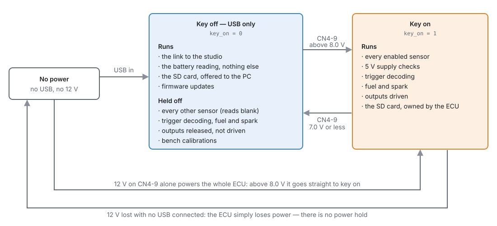
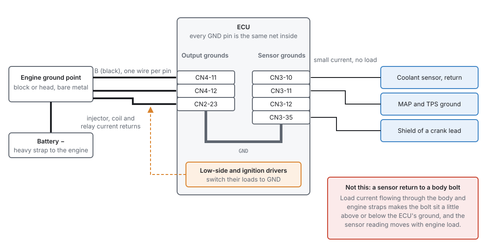
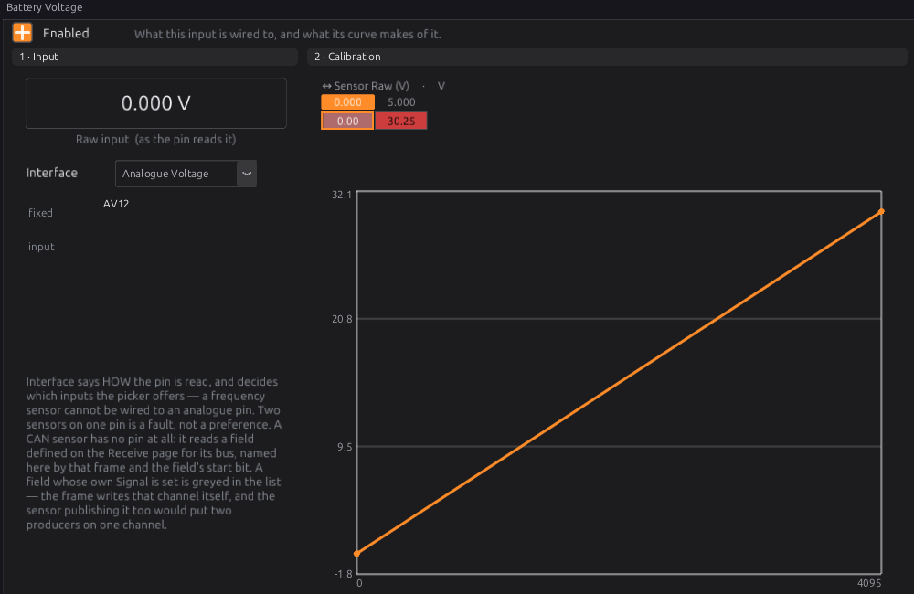
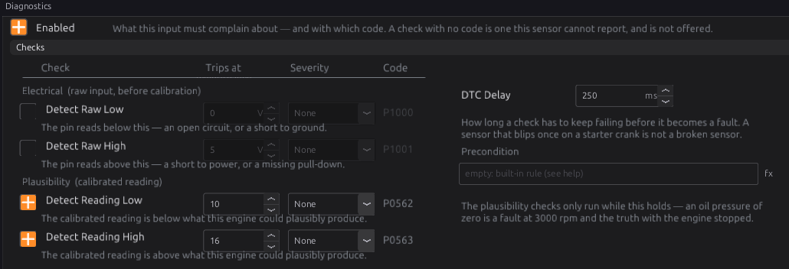
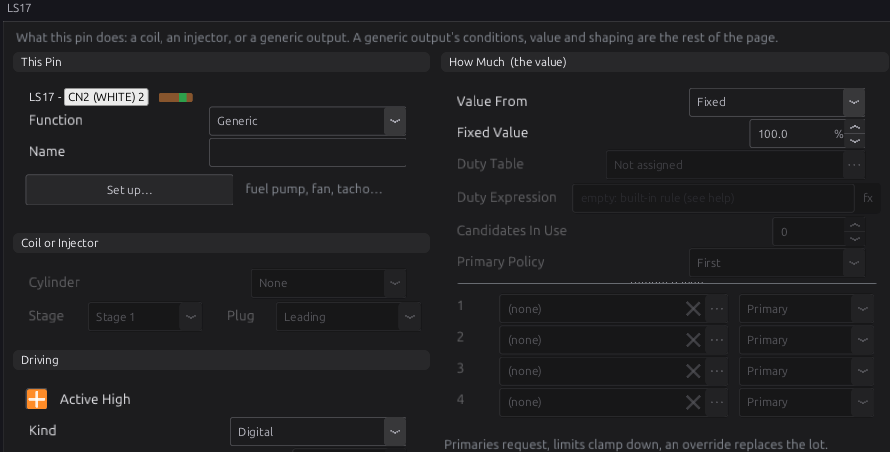

# Power, grounds and protection

:material-circle:{ .level-basic } Basic → :material-circle:{ .level-advanced } Advanced

> **In one sentence:** how the ECU is powered, how it decides the key is on, where its grounds go,
> what protects it, and how to wire all of that so every sensor reading and every injector pulse
> can be trusted.

## Overview

:material-circle:{ .level-basic } Basic

Most ECU faults that look like tuning problems are really power or ground problems. A sensor
reading that moves when the fan switches on, an idle that goes rich when the battery is low, an
engine that dies while cranking: each can come from a bad ground or a poor supply, not from a bad
table.

This chapter covers the wiring that everything else rests on:

- **The supplies.** The jaytek_v1 has two 12 V inputs. **CN4-9** powers the ECU itself, and tells
  it whether the key is on. **CN4-13** powers the high-side outputs and the H-bridges, and is meant
  to come from a main relay.
- **Key-on and USB power.** The ECU can run from USB alone, with the key off, for tuning and
  firmware updates. It behaves very differently then, on purpose.
- **Grounds.** Seven ground pins, one ground inside the ECU, and where each wire should go.
- **Protection.** What the board protects against by itself, and what your fuses and relays must
  handle.
- **The 5 V sensor supplies.** Two regulated 5 V outputs for sensors, each watched by the ECU.

You need this chapter before you wire anything. Chapter 9 covers wiring practice in general (wire
sizes, routing, crimping); this chapter covers the supply and ground wires in particular. Chapter 7
lists every pin.

!!! danger "Disconnect the battery first"
    Disconnect the battery negative before you wire any supply. A shorted supply wire can melt
    insulation or start a fire long before a fuse you forgot to fit would have blown.

## Concepts

:material-circle:{ .level-intermediate } Intermediate

### The power pins

All the power pins are on **CN4**, the black 23-way connector. Wire colours are the ones in the
board's harness definition.
<!-- src: definition/boards/jaytek_v1.board.yaml -->

| Pin | Name | Wire | What it is |
|---|---|---|---|
| CN4-9 | +12 V in | R (red) | The ECU's own supply, and the voltage it reads as **Battery Voltage**. Feed it from an ignition-switched, fused source. |
| CN4-13 | +12 V in, main relay feed | R/W (red/white) | Supply for the high-side outputs HS1–HS8 and the two H-bridges. Feed it from the main relay. |
| CN4-16 | Protected +12 V out | R/Y (red/yellow) | A fused 12 V output taken from the ECU's own supply. |
| CN4-14 | 5 V sensor supply 1 | O/W (orange/white) | Regulated 5 V for sensors. |
| CN4-15 | 5 V sensor supply 2 | O/W (orange/white) | Regulated 5 V for sensors. |
| CN4-11, CN4-12 | Ground | B (black) | Ground. |

The other ground pins are **CN2-23** (on the white connector) and **CN3-10, CN3-11, CN3-12 and
CN3-35** (on the blue connector).
<!-- src: definition/boards/jaytek_v1.board.yaml (CN2-23) (CN3 grounds) (CN4 grounds) -->

### Inside the ECU: the power tree

<figure markdown>
  
  <figcaption>Figure 10.1 — Where each supply pin goes inside the ECU. Red parts protect, blue parts
  are what the ECU measures or offers to sensors, orange is what CN4-13 drives. Labels such as D15
  and U39 are the board's part references.</figcaption>
</figure>

Follow CN4-9 from the left of Figure 10.1:

1. The **battery sense divider** is tapped straight off the pin, before any protection. It scales
   the pin voltage down for the processor's input AV12. The studio shows it as the **Battery
   Voltage** sensor, and its calibration reads 0–30.25 V across the input's full range.
   <!-- src: definition/boards/jaytek_v1.board.yaml; schematic net CON_12V_RAW (R143) and 12V_DIVIDED; definition/ecu.schema.yaml -->
2. A **TVS diode** (D15, an SMCJ30CA) sits from the pin to ground. It does nothing at normal
   voltages. When a spike on the supply rises above its 30 V stand-off voltage, it conducts and
   clamps the spike.
3. A **series diode** (D14) lets current flow only into the ECU. If the supply is connected
   backwards, it blocks, and the ECU's own electronics are not powered at all.
4. After the diode is the ECU's protected 12 V, called `12V_PROT` on the schematic. It feeds a
   **5 V switching regulator** (U39), which makes the ECU's internal +5 V rail. A 3.3 V regulator
   (U41) runs the processor from that rail.
   <!-- src: hardware/PDF_JAYTEK_2026-04-29/ECU Schematic/SCH_ECU Schematic_4-Power_2026-04-29.pdf; schematic nets CON_12V_RAW, 12V_PROT, +5V, VDD -->
5. `12V_PROT` also goes, through two small fuses on the board (F1 and F2, in parallel), to
   **CN4-16**, the protected 12 V output. This output is live only while CN4-9 is powered.
   <!-- src: schematic nets 12V_PROT (F1.1, F2.1), CON_12V_PROT (CN4.16, F1.2, F2.2) -->

**USB** is the other way into the +5 V rail: the USB supply feeds it through its own diode (D20).
That is why the ECU runs, and talks to the studio, with only a USB cable connected.
<!-- src: schematic nets $26N258 (D20.2, USB1.1) and +5V (D20.1) -->

**CN4-13** is separate. It goes to the supply pins of the four-channel high-side drivers that make
HS1–HS8 and to both H-bridges. Nothing else in the ECU uses it, and the ECU does not measure it.
(The schematic also joins it to diode footprints D10–D13 on LS13–LS16; those diodes are never fitted.)
<!-- src: schematic net CON_12V_MR (CN4.13, U17.17, U22.17, U29.4, U30.4; D10–D13 unpopulated) -->

### Two supplies, and why

CN4-9 is the ECU's brain supply. It is small, it must be clean, and it tells the ECU the key is on.
CN4-13 is the muscle supply for the outputs that switch 12 V to a load. Keeping them apart means
you can switch the heavy loads with a relay while the ECU's own supply stays on its own wire and
fuse.

Low-side outputs (injectors, coils, most solenoids) do not take their power from the ECU at all.
They switch the load's **ground**. The load's positive side comes from your own fused supply,
usually the main relay (Figure 10.4).
<!-- src: hardware/jaytek_v1_hardware.md (driver polarity table) -->

### How the ECU decides the key is on

There is no separate ignition-sense pin. The ECU decides the key is on from the voltage it
measures on CN4-9, with hysteresis:

- the key turns **on** when the measured battery voltage rises **above 8.0 V**;
- once on, it turns **off** only when the voltage falls to **7.0 V or below**.

The result is published as the channel **Key On** `key_on`, 1 for on and 0 for off.
<!-- src: firmware/Sensors/Sensors.h; firmware/Sensors/Sensors.cpp; definition/ecu.schema.yaml -->

This is why CN4-9 must be **ignition-switched**. On a permanent battery feed the ECU would always
think the key was on.

<figure markdown>
  
  <figcaption>Figure 10.2 — The ECU's power states. The key is decided only by the voltage on CN4-9:
  on above 8.0 V, off at 7.0 V or below.</figcaption>
</figure>

With the key **off** (USB power only, or CN4-9 too low), the ECU deliberately does very little:

- It reads **only the battery**. Every other sensor is skipped, and its channel reads blank rather
  than a number. The studio shows a **KEY OFF** strip above the toolbar to say so, so a row of zero
  gauges is not mistaken for a row of dead sensors.
- It ignores the trigger inputs: no sync, no RPM.
- It schedules **no fuel and no spark**, not even a prime pulse.
- Every generic output is released, not driven, so a bench tune cannot run a fuel pump or a fan.
- Engine-stopped calibrations that move a motor or read a sensor (throttle and pedal calibration,
  for example) refuse to run.
- The SD card is handed to the PC as a USB drive once the ECU has finished any write in progress.
- Active runtime trouble codes are marked no longer active. Their history stays stored.
  <!-- src: firmware/Sensors/Sensors.cpp; firmware/Scheduler/EnginePositionHal.cpp; firmware/Engine/EngineTask.cpp; firmware/Integration/OutputManager.cpp; firmware/Cli/CliCommands.cpp; firmware/Storage/SdArbitrator.h; firmware/Diagnostics/DtcManager.cpp; apps/studio-jf/main.cpp -->

!!! note "Why the sensors are not read on USB power"
    On USB power the ECU's internal 5 V rail is fed through a diode, so it sits lower than it does
    with 12 V connected. The firmware's own notes say this shifts the sensor readings: the numbers
    would look plausible but would not match the running engine. A calibration built from them
    would be wrong. So the firmware leaves those channels blank until the key is on.
    <!-- src: firmware/Sensors/Sensors.cpp; apps/studio-jf/main.cpp -->

Firmware updates work the other way round. The studio updates firmware **only** with the key off
and the engine stopped, the ECU on USB power alone. If it sees the key on or the engine turning, it
stops and changes nothing (chapter 46).
<!-- src: apps/studio-jf/src/app/FirmwareUpgrade.cpp -->

!!! warning "The key turns off at 7.0 V, even while cranking"
    If the voltage at CN4-9 drops to 7.0 V or below during cranking, the ECU treats the key as off.
    It stops scheduling fuel and spark and drops sync, and it does not turn back on until the
    voltage rises above 8.0 V. A weak battery, a long thin feed wire or a poor ground can do this.
    Measure CN4-9 while cranking if an engine cranks but will not fire.

### There is no power hold

The ECU cannot keep itself powered after the key is turned off. With no USB connected, turning the
key off removes CN4-9 and the ECU stops at once. The firmware is written for this:

- your tune is saved when you **Burn**, not at key-off. It is written to the spare one of two
  flash banks, so a save cut short leaves the previous tune intact;
- learned data (long-term fuel trim and the other learned tables) is written to the SD card about
  every 30 seconds when it has changed, and again when the engine stops while the ECU is still
  powered. Turning the key off loses at most the learning since the last save.
  <!-- src: firmware/Storage/StorageManager.h; firmware/main.cpp; firmware/Platform/stm32f7xx/LearnedStore.h -->

### The 5 V sensor supplies

The ECU gives you two regulated 5 V supplies for sensors: **CN4-14** (supply 1) and **CN4-15**
(supply 2). Each comes from its own tracking regulator (U37 and U38). A tracking regulator makes an
output that **follows** a reference, here the ECU's internal +5 V rail, while it takes its current
from the protected 12 V. So the sensors are fed from the same 5 V the ECU measures against, and a
short on a sensor's 5 V wire loads that regulator, not the ECU's own rail.
<!-- src: hardware/PDF_JAYTEK_2026-04-29/Sensor power/SCH_Sensor power_1-Sensor power_2026-04-29.pdf; schematic nets 12V_PROT (U37.10, U38.10), +5V (U37.6, U38.6), CON_5V_SENSOR1 (U37.1), CON_5V_SENSOR2 (U38.1) -->

Supply 1 also feeds, inside the ECU, the pull-up resistors on the four temperature inputs AT1–AT4
and the eight digital inputs DIG1–DIG8. A fault on CN4-14 therefore affects those inputs too, even
if nothing on them is wired to CN4-14.
<!-- src: schematic net CON_5V_SENSOR1 (R65, R66, R69, R70, R81, R82, R85, R86, R89, R92, R95, R98); CON_AT1–4, CON_DIG1–8 -->

Each regulator has a **power-good** line to the processor. It is high while that supply is in
regulation and goes low if the supply fails, for example from a short to ground. With the key on,
the firmware reads both lines:

- They are published as **5V Sensor 1 Supply** `sensor_supply_1` and **5V Sensor 2 Supply**
  `sensor_supply_2`, showing **OK** or **Fault**.
- The moment **either** line reads Fault, **every** sensor read from an ECU pin is marked invalid,
  not only the sensors on that supply. The ECU is not told which supply each sensor is wired to, so
  it does not guess. The battery, the on-board sensors and CAN sensors carry on.
- If the line stays low for **100 ms**, the ECU raises **P0641** (supply 1) or **P0651** (supply 2),
  at severity level 2. The code heals when the line comes back.
  <!-- src: firmware/Sensors/Sensors.cpp (SUPPLY_DTC_DELAY_MS); firmware/Sensors/Sensors.h; definition/ecu.schema.yaml -->

With the key off, the power-good lines are not read at all, and these channels stop updating.

!!! warning "The 5 V supplies are for sensors only"
    Use CN4-14 and CN4-15 for sensor references: pressure sensors, throttle and pedal sensors,
    Hall-effect sensors that want 5 V. Do not use them to power lamps, relays or other controllers.
    Their current rating is not yet published in the board's specifications, and a supply that
    drops out of regulation takes every sensor on the ECU with it.

### Grounds

Every ground pin on the jaytek_v1 is the **same ground net** inside the ECU. There is no separate
"sensor ground" circuit on the board. But the pins are grouped by connector, and the grouping tells
you how to use them.
<!-- src: schematic net GND; definition/boards/jaytek_v1.board.yaml -->

<figure markdown>
  
  <figcaption>Figure 10.3 — Output grounds carry the current of everything the ECU switches back to
  the engine. Sensor grounds carry almost nothing, and must stay at the ECU's own ground.</figcaption>
</figure>

- **Output grounds: CN4-11, CN4-12 and CN2-23.** The low-side and ignition drivers switch their
  loads to the ECU's ground, so the current of every injector, coil and relay on those outputs
  comes back through the ECU and out on these pins. Run a separate black wire from each pin to one
  clean ground point on the engine, the same point the battery negative strap goes to.
- **Sensor grounds: CN3-10, CN3-11, CN3-12 and CN3-35.** These sit on the blue sensor connector.
  Return every sensor's ground here, and nowhere else. Terminate cable shields here too, at the ECU
  end only (chapter 11).

The rule behind this is simple. A sensor reports a voltage **measured against the ECU's ground**.
If the sensor's own ground is somewhere else, any voltage between that point and the ECU's ground
is added to the reading. Current flowing in the engine and body straps makes such a voltage, and it
changes with load. A sensor returned to the ECU's own ground pins has no such error.
<!-- src: hardware/jaytek_v1_hardware.md (drivers switch to ground) -->

!!! tip "One ground point, short and thick"
    Put the ECU's output grounds and the battery negative strap on the same bare-metal point on the
    engine. Every ground between the battery and the ECU is a place for a voltage drop to hide.

### What the board protects, and what it does not

| Threat | Protected on the board? | What you must do |
|---|---|---|
| Spikes on CN4-9 | Yes, clamped by the TVS diode D15 | Nothing extra, but keep the feed short and fused. |
| Battery connected backwards, at CN4-9 | Yes, the series diode D14 blocks it | Check polarity anyway: see the next row. |
| Battery connected backwards, everything else | **No.** CN4-13 and the outputs are not behind D14 | Check polarity before you connect the battery. |
| A short on CN4-16 | Yes, two fuses on the board | Keep loads on CN4-16 small; the board fuses protect the board, not your wiring. |
| A short on CN4-9 or CN4-13 wiring | **No** fuse on the board | Fit your own fuse in each feed, close to the source. |
| A short on a 5 V sensor supply | Detected (power-good line, P0641/P0651) | Find and fix the short; every pin sensor reads invalid until you do. |
<!-- src: schematic nets CON_12V_RAW (D15, D14), 12V_PROT, CON_12V_PROT (F1, F2), CON_12V_MR; firmware/Sensors/Sensors.cpp -->

!!! warning "The fuses on the board are not your fuses"
    F1 and F2 are small surface-mount fuses soldered to the board. They protect the board's tracks
    behind CN4-16. They are not easy to replace, and they do nothing for CN4-9, CN4-13 or any
    wire in your harness. Every supply wire needs its own fuse at the source end.

## Procedure

:material-circle:{ .level-basic } Basic → :material-circle:{ .level-intermediate } Intermediate

This is the order to wire and check the supplies and grounds. Do it before you wire sensors and
outputs, and before the first power-up.

### 1 · Plan the supplies

Decide how the main relay will be switched (see *Examples*): by the ignition switch, or by the ECU.
Draw your own version of Figure 10.4, with a fuse in every feed.

<figure markdown>
  
  <figcaption>Figure 10.4 — A typical supply layout. CN4-9 comes from the ignition switch, CN4-13 and
  the injector and coil supplies from the main relay. The relay coil goes to ground (Example 1) or
  to the ECU's LS17 output (Example 2). Size each fuse for the wire it protects.</figcaption>
</figure>

### 2 · Wire the grounds first

1. Choose one clean, bare-metal ground point on the engine, and make sure the battery negative
   strap goes to it (or next to it).
2. Run a black wire from **CN4-11**, one from **CN4-12** and one from **CN2-23** to that point.
3. Plan every sensor ground to go to **CN3-10, CN3-11, CN3-12 or CN3-35**, never to the body or the
   engine.

### 3 · Wire CN4-9, the ECU supply

1. Take an **ignition-switched** feed that is live in the run and crank positions.
2. Fit a fuse at the source end (Fuse 1 in Figure 10.4).
3. Run the red wire to **CN4-9**.

Do not feed CN4-9 from a permanent supply: the ECU would never see the key turn off (see *How the
ECU decides the key is on*).

### 4 · Wire CN4-13, the load supply

1. Take the main relay's switched output (terminal 87 on a standard relay).
2. Fit a fuse (Fuse 2), and run the red/white wire to **CN4-13**.
3. Feed your injector, coil and valve supplies from the same relay output through their own fuses
   (Fuse 3).

If you use no high-side outputs and no H-bridge, CN4-13 can stay unconnected.
<!-- src: schematic net CON_12V_MR -->

### 5 · Check before the ECU goes on

With the ECU **unplugged** and the battery connected:

1. Key off: CN4-9 and CN4-13 (at the harness plug) read 0 V to ground.
2. Key on: both read battery voltage, within a few tenths of a volt.
3. Measure from each ground wire's ECU end to the battery negative post: it should read no more
   than a few tenths of a volt with the engine's loads running. More than that is a bad connection.

### 6 · Power up and check in the studio

1. Plug in the ECU, turn the key on, and connect the studio.
2. The **KEY OFF** strip should not appear. If it does, the ECU sees 7.0 V or less on CN4-9.
3. Open **Configuration ▸ Sensors ▸ Other ▸ Battery Voltage** (Figure 10.5). With the key on, the
   raw input and the reading are live. The reading should match your meter on the battery within a
   few tenths of a volt; the difference is the drop in the feed wire and grounds.
4. Watch **5V Sensor 1 Supply** and **5V Sensor 2 Supply** on a gauge or in a log: both should read
   **OK**.

<figure markdown>
  
  <figcaption>Figure 10.5 — Battery Voltage. The input is fixed to AV12 by the board, and the
  calibration is set by the board's divider: leave it as it is.</figcaption>
</figure>

The **Battery Voltage** sensor cannot be moved to another pin, and its type is fixed. Its
calibration comes from the board's divider, so there is nothing to calibrate.
<!-- src: definition/ecu.schema.yaml; codegen/codegen.py; definition/boards/jaytek_v1.board.yaml -->

### 7 · Switch on the battery checks

The battery reading has two plausibility checks, off by default. Switch them on so a charging fault
is logged.

1. Open **Battery Voltage ▸ Diagnostics** (Figure 10.6).
2. Tick **Detect Reading Low** and set its threshold, for example **10** V. It raises **P0562**.
3. Tick **Detect Reading High** and set its threshold, for example **16** V. It raises **P0563**.
4. Type `engine_state >= 2` into **Precondition**, so the checks run only while the engine is
   running. With the box empty they run all the time, and the long dip of a starter crank below
   10 V would raise P0562 on every start.
5. Leave **DTC Delay** at 250 ms: a reading must stay out of range that long before it becomes a
   fault.
6. **Burn**.

<figure markdown>
  
  <figcaption>Figure 10.6 — The battery checks, set as in step 7 (shown before the precondition is
  typed in). Severity picks the engine-protection level that reacts to the code (chapter 29).</figcaption>
</figure>

<!-- src: definition/ecu.schema.yaml (dtc operating_min P0562, operating_max P0563) (precondition: empty = always armed); firmware/Sensors/Sensors.cpp (delay, op checks only when armed); firmware/Pipeline/Stages.h; shared/tuneit-meta.json config.sensors.sensor fields diag_enable (default 0), diag_delay_ms (default 250); definition/ecu.schema.yaml (engine_state 2 = running) -->

### 8 · If the ECU switches the main relay

Only for Example 2 below.

1. Open **Configuration ▸ Electrical ▸ Outputs ▸ LS17**.
2. Click **Set up this output…** and choose **Main Relay**, then **OK**.
3. Check the result (Figure 10.7): **Function** Generic, **Kind** Digital, **Value From** Fixed,
   **Fixed Value** 100 %. The template also sets **Turn On When** to `1` (always) and **If
   Unanswerable** to On, and names the output.
4. **Burn**.

<figure markdown>
  
  <figcaption>Figure 10.7 — LS17 as the main relay driver. It is on whenever the ECU's outputs are
  running, which is whenever the key is on.</figcaption>
</figure>

<!-- src: definition/ecu.schema.yaml (main_relay template); apps/studio-jf/src/model/OutputTemplate.cpp (what Apply writes) -->

## Examples

:material-circle:{ .level-intermediate } Intermediate

!!! example "Example 1 — relay switched by the ignition (the simplest)"
    A street car with port injection, coil-on-plug and no electronic throttle.

    | Wire | From | To | Why |
    |---|---|---|---|
    | ECU supply | ignition switch, run and crank, Fuse 1 | CN4-9 (R) | the ECU and its key-on signal |
    | Relay coil 86 | the same switched feed | relay | the relay closes with the key |
    | Relay coil 85 | ground | relay | |
    | Relay contact 30 | battery, Fuse B | relay | |
    | Relay output 87 | Fuse 2 | CN4-13 (R/W) | high-side outputs (fuel pump relay, fan relay) |
    | Relay output 87 | Fuse 3 | injector and coil supplies | the loads the low-sides switch |
    | Grounds | CN4-11, CN4-12, CN2-23 (B) | engine ground point | output current |
    | Sensor returns | MAP, TPS, coolant, air temp | CN3-10, -11, -12, -35 | a clean reference |
    | 5 V supply 1 | CN4-14 | MAP and TPS | |
    | 5 V supply 2 | CN4-15 | oil and fuel pressure | |

    Battery checks: low 10 V, high 16 V, precondition `engine_state >= 2` (step 7, Figure 10.6).

    Splitting the 5 V sensors across both supplies makes the wiring easier to fault-find: a short
    on one sensor's 5 V wire drops one power-good line, and **5V Sensor 1 Supply** or **5V Sensor 2
    Supply** tells you which half of the harness to look in. It does not keep the other sensors
    running: either fault makes every pin sensor invalid.

!!! example "Example 2 — relay switched by the ECU"
    As Example 1, but the relay coil's 85 terminal goes to **LS17** (CN2-2, wire Br/G) instead of to
    ground, and LS17 is set up as **Main Relay** (step 8, Figure 10.7).

    - With the key on, the ECU switches LS17 on, the relay closes, and the loads are powered.
    - On USB power alone, or with CN4-9 at 7.0 V or less, the ECU releases its outputs and the relay
      stays open. Injectors, coils and everything on CN4-13 have no power, which makes bench work on
      USB safe.

    <!-- src: firmware/Integration/OutputManager.cpp; definition/ecu.schema.yaml; definition/boards/jaytek_v1.board.yaml -->

!!! example "Example 3 — on the bench"
    A bench power supply at 12–14 V feeds **CN4-9** and **CN4-13** together, its negative to
    **CN4-11** and **CN4-12**, and a USB cable goes to the PC.

    - With the supply on, the ECU is key-on and everything runs. Watch the supply's current limit:
      set it low while you check the wiring.
    - To update firmware, switch the supply off and leave USB connected. The studio shows **KEY
      OFF** and the update can go ahead (chapter 46).
    - To look at logs on the SD card from the PC, switch the supply off. The card appears as a USB
      drive once the ECU has finished writing.

!!! info "Advanced — forcing the key and the supplies on the bench"
    The **ECU Console** accepts two bench commands. `key on`, `key off` and `key auto` force the key
    state the whole firmware uses, not only the SD card: `key on` on USB power makes the ECU behave
    as key-on. `pg 1 fault` (or `pg 2 fault`) makes that supply's power-good line read Fault, so
    you can see every pin sensor go invalid and P0641 or P0651 appear, without shorting anything.
    `pg 1 auto` returns to the real line. The `pg` override only matters while the key is on.
    <!-- src: firmware/main.cpp (cmd_key, cmd_pg); firmware/Sensors/Sensors.cpp -->

## Diagnostics

:material-circle:{ .level-intermediate } Intermediate

| Code | Meaning | What sets it | What to check |
|---|---|---|---|
| **P0641** | Sensor supply: 5V Sensor 1 reference fault | Supply 1's power-good line low for 100 ms with the key on | A short to ground on anything wired to CN4-14, or on an AT or DIG input's wiring (their pull-ups hang off supply 1) |
| **P0651** | Sensor supply: 5V Sensor 2 reference fault | Supply 2's power-good line low for 100 ms with the key on | A short to ground on anything wired to CN4-15 |
| **P0562** | Battery Voltage: reading below operating range | **Detect Reading Low** on, reading below its threshold for the DTC delay | Charging system, battery, CN4-9 feed and grounds |
| **P0563** | Battery Voltage: reading above operating range | **Detect Reading High** on, reading above its threshold for the DTC delay | Charging system (regulator), a jump-start pack |
| **P0560** | Protection: battery-voltage signal timed out | The battery channel stopped updating (raised by engine protection) | Chapter 29 |
<!-- src: definition/ecu.schema.yaml; firmware/Sensors/Sensors.cpp; firmware/Engine/Modules/EngineProtection.cpp -->

**Channels worth logging:** **Battery Voltage** `battery`, **Key On** `key_on`, **5V Sensor 1
Supply** `sensor_supply_1` and **5V Sensor 2 Supply** `sensor_supply_2`. Log `battery` with `rpm`
on every start: it shows how far the supply dips while cranking.
<!-- src: definition/ecu.schema.yaml -->

**Why the battery voltage matters to the tune.** The injector dead-time table and the ignition
dwell table are both read against **Battery Voltage** (chapters 19 and 20). The ECU reads that
voltage at CN4-9. If the injector and coil supplies sag more than CN4-9 does, for example because
they share a thin wire or a poor ground, the ECU corrects for a voltage the injectors and coils are
not getting. Keep their feeds and grounds as good as the ECU's own.
<!-- src: definition/ecu.schema.yaml (dead time vs battery) (dwell vs battery) -->

## Pitfalls and troubleshooting

:material-circle:{ .level-basic } Basic → :material-circle:{ .level-advanced } Advanced

| Symptom | Likely causes | Check |
|---|---|---|
| Studio shows **KEY OFF** with the key on | CN4-9 not powered, or at 7.0 V or less; blown feed fuse | Measure CN4-9 to CN4-11 at the plug with the key on; Fuse 1 |
| Studio shows key on with the key off | CN4-9 on a permanent feed, or back-fed through another circuit | Where the CN4-9 wire really comes from; measure it with the key off |
| All gauges zero, but the link is fine | Key off: only the battery is read | The **KEY OFF** strip; `key_on` |
| All gauges zero except the battery, red **NO TUNE ON THE ECU** strip | The ECU has no usable tune, so nothing but the battery runs | Chapter 47, section 2 |
| Cranks, will not fire; `key_on` drops while cranking | CN4-9 falls to 7.0 V or below during cranking | Log `battery` while cranking; battery, starter cables, CN4-9 feed and grounds |
| High-side outputs or the electronic throttle do nothing | CN4-13 not powered: the ECU cannot detect this | Measure CN4-13 with the key on; the main relay and Fuse 2 |
| Every pin sensor invalid at once, **P0641** or **P0651** | A 5 V supply shorted or overloaded | Unplug sensors on that supply one by one until **5V Sensor N Supply** reads OK; for supply 1 also check AT and DIG wiring |
| Temperature or digital inputs read wrong although nothing is on CN4-14 | Supply 1 down: their pull-ups hang off it | `sensor_supply_1`; P0641 |
| Sensor readings move when the fan or lights switch on | A sensor ground returned to the body or engine; a poor ECU ground | Move sensor returns to CN3 ground pins; voltage-drop test the output grounds |
| Idle goes rich or lean with battery voltage | Injector supply sagging more than CN4-9; dead-time table wrong | Voltage at the injector feed against `battery`; chapter 38 |
| No ECU at all on 12 V, fine on USB | Supply connected backwards: D14 blocks it | Polarity at CN4-9 |
| The board fuse behind CN4-16 has blown | A short or too much load on CN4-16 | The CN4-16 wiring; move heavier loads to their own relay |

## Related

- [Chapter 7 — The jaytek_v1 board](07-board.md): every pin and connector
- [Chapter 9 — Wiring practice](09-wiring-practice.md): wire sizes, routing, splices
- [Chapter 11 — Wiring sensors](11-wiring-sensors.md): sensor grounds, shields and 5 V references
- [Chapter 12 — Wiring outputs](12-wiring-outputs.md): injectors, coils, relays, H-bridges
- [Chapter 17 — Sensors and calibration](../part3/17-sensors.md): the sensor pages and their checks
- [Chapter 18 — Outputs and the pin system](../part3/18-outputs.md): output templates, including Main Relay
- [Chapter 29 — Engine protection](../part3/29-protection.md): what severity levels do
- [Chapter 44 — Diagnostics and trouble codes](../part5/44-diagnostics.md)
- [Chapter 46 — Updating firmware](../part6/46-updating-firmware.md): why the key must be off
