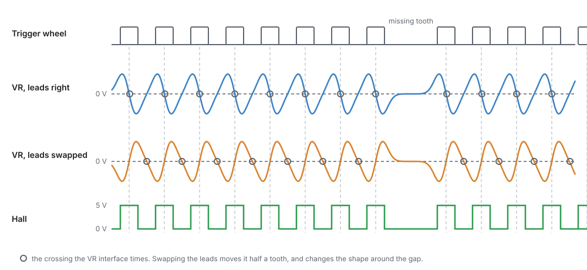
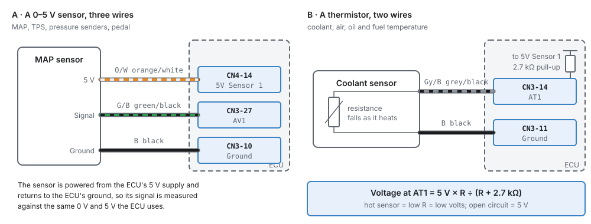
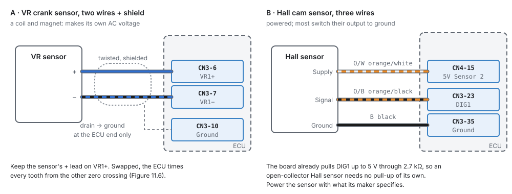
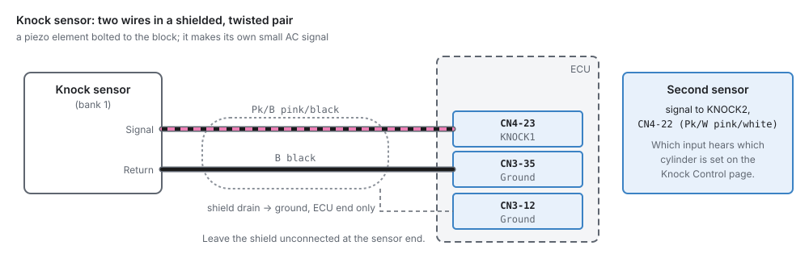
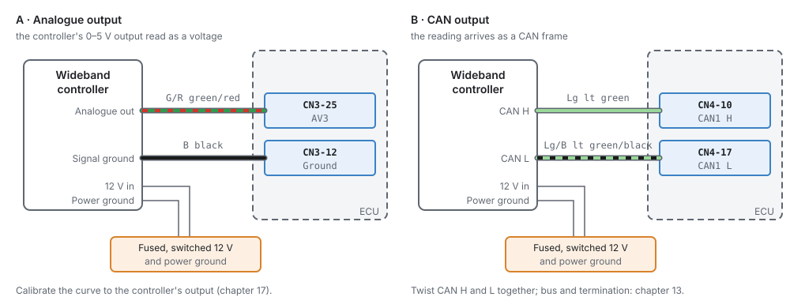
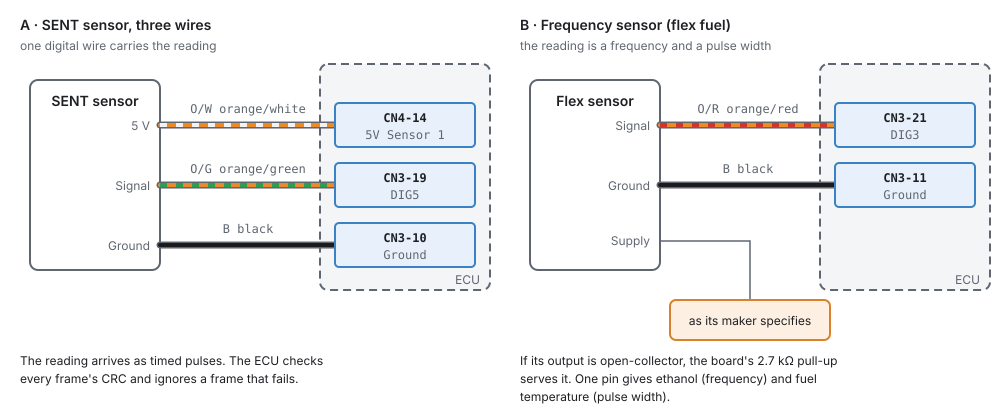
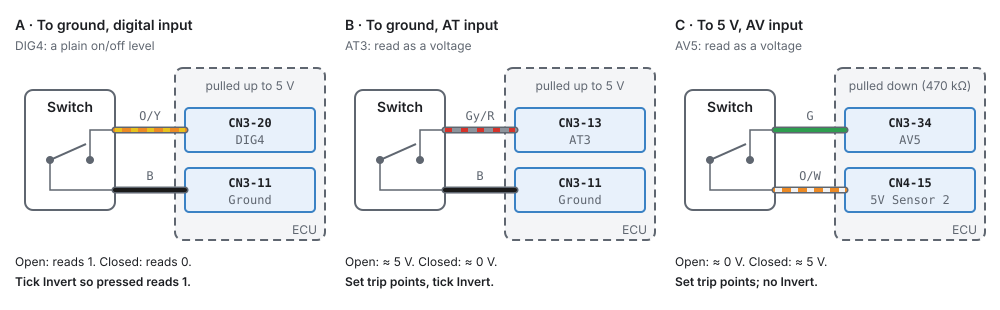

# Wiring sensors

:material-circle:{ .level-basic } Basic → :material-circle:{ .level-intermediate } Intermediate

> **In one sentence:** how to connect every kind of sensor to the ECU — which pin type it wants,
> where its power and ground come from, and how to keep its signal clean.

## Overview

:material-circle:{ .level-basic } Basic

A sensor's reading is only as good as its wiring. A MAP sensor grounded to the chassis instead of the
ECU reads wrong by the voltage between the two; a crank sensor with a poor shield picks up ignition
noise and loses sync at high speed. This chapter shows how to wire each kind of sensor so the ECU
sees exactly what the sensor says.

It covers the wires. Setting up the sensor in the studio (interface, pin, calibration, fault checks)
is chapter 17. The pins are listed in chapter 7, and the tools and good-practice methods (crimping,
routing, shielding) in chapters 8 and 9.

## Concepts

:material-circle:{ .level-intermediate } Intermediate

### What is behind each input pin

<figure markdown>
  
  <figcaption>Figure 11.1 — Inside the ECU, simplified. What an open (unconnected) pin reads follows
  from this.</figcaption>
</figure>

| Input | Pins | Wants | An open pin reads |
|---|---|---|---|
| **AV** analogue | AV1–AV11, AV13–AV16 (CN3) | a 0–5 V signal | about 0 V (470 kΩ to ground) |
| **AT** temperature | AT1–AT4 (CN3) | a resistance to ground (thermistor) | about 5 V (2.7 kΩ pull-up) |
| **DIG** digital | DIG1–DIG8 (CN3) | a switch or open-collector signal to ground, or a 0–5 V logic signal | high (2.7 kΩ pull-up) |
| **VR** | VR1 ±, VR2 ± (CN3) | a two-wire variable-reluctance (magnetic) sensor, or a Hall sensor on VR+ | none |
| **KNOCK** | KNOCK1, KNOCK2 (CN4-23, 22) | a piezo knock sensor | — |

<!-- src: definition/boards/jaytek_v1.board.yaml; hardware/PDF_JAYTEK_2026-04-29/{Analog,Temperature,Digital,Trigger,Knock} -->

That last column matters for diagnostics: a broken wire on an AV pin reads 0 V, and on an AT pin 5 V,
which is what the raw fault checks in chapter 17 look for.

### Power and ground for sensors

- **5 V sensors** take their supply from **CN4-14** (5 V sensor supply 1) or **CN4-15** (5 V sensor
  supply 2). Never power a 5 V sensor from anything else: the ECU measures the signal against the
  same 5 V, so a different supply shows up as a reading error. Supply 1 also feeds the pull-ups on the
  AT and DIG inputs.
- **Sensor grounds** go to the ECU's ground pins, **CN3 pins 10, 11, 12 and 35**, not to the chassis
  or the engine block. The ECU reads the signal against its own ground; a sensor grounded somewhere
  else adds the voltage difference between the two grounds to its reading.
- **Split pairs across the supplies.** Where two sensors check each other (the two tracks of an
  electronic throttle or pedal), put one on each 5 V supply, so a single supply fault cannot take
  both out.
  <!-- src: definition/boards/jaytek_v1.board.yaml (CN4 terminals) (CN3 grounds); schematic (CON_5V_SENSOR1 pull-ups) -->

Each supply has a power-good line. If one fails (a sensor wire shorted to ground, for example), the
ECU marks every sensor on the pins invalid and raises P0641 or P0651. Chapter 10 covers the supplies
in detail.

### Signals and noise

<figure markdown>
  
  <figcaption>Figure 11.2 — What crank and cam sensors send. A VR sensor makes its own AC voltage; a
  Hall sensor switches.</figcaption>
</figure>

- **VR sensors** make an AC voltage that grows with speed: a few hundred millivolts while cranking,
  many volts at high speed. The VR interface on the board times each tooth at the signal's zero
  crossing. The two wires are not interchangeable: swapped, the ECU times the other zero crossing,
  half a tooth away.
- **Hall and optical sensors** switch between two levels. They need power, and most pull their output
  to ground (open collector), which the DIG input's pull-up serves.
- **Knock sensors** make a small AC signal from engine vibration. They are the most noise-sensitive
  input on the ECU.

Crank, cam and knock wiring uses **twisted pairs** with a **shield**. The shield's drain wire goes to
an ECU ground at the ECU end **only**, and is left unconnected at the sensor. A shield grounded at both
ends carries current and becomes an antenna. Route these wires away from coil leads, injector wires
and the alternator. Chapter 9 shows how.

## Procedure

:material-circle:{ .level-basic } Basic

The examples below use the default wire colours the studio shows in its wiring hints. Use whatever
colours your harness uses, and write them down.

### 1 · A 0–5 V sensor: MAP, TPS, pressure senders, pedal

<figure markdown>
  
  <figcaption>Figure 11.3 — A three-wire 0–5 V sensor (left) and a two-wire thermistor (right).</figcaption>
</figure>

1. Sensor **5 V** to **CN4-14** (or CN4-15).
2. Sensor **signal** to an **AV** pin.
3. Sensor **ground** to an ECU ground on CN3.
4. In the studio, enable the sensor, choose **Analogue Voltage** (or **Engine Sync Voltage** for MAP),
   and assign the AV pin (chapter 17).

### 2 · A thermistor: coolant, air, oil, fuel temperature

1. One wire to an **AT** pin.
2. The other wire to an ECU ground on CN3. (A one-wire sensor that grounds through its body needs a
   clean engine ground; a two-wire sensor is better.)
3. No supply is needed: the AT input's 2.7 kΩ pull-up supplies it. The pin reads
   **5 V × R ÷ (R + 2.7 kΩ)**, which is what the calibration in chapter 17 is built from.

A thermistor on an **AV** pin would need its own pull-up resistor, and the AV pin's 470 kΩ to ground
would change the reading. Use the AT pins for thermistors.

### 3 · A VR crank or cam sensor

<figure markdown>
  
  <figcaption>Figure 11.4 — A VR crank sensor (left) and a Hall cam sensor (right).</figcaption>
</figure>

1. Sensor **+** to **VR1+** (CN3-6) and sensor **−** to **VR1−** (CN3-7). The second VR input is
   VR2+ (CN3-8) and VR2− (CN3-9).
2. Use a **twisted, shielded pair**. Drain to an ECU ground (CN3-10) at the ECU end only.
3. If you do not know which wire is +, check with an oscilloscope while cranking: the signal should
   swing as in Figure 11.2, "leads right", around the missing tooth. Or wire it either way and
   compare the Trigger Log (chapter 16) with the wheel: swapped leads change the shape around the gap.
4. In the studio, set the stream's Capture Input to VR1 and Capture Edge to **Rising** (chapter 16).
   <!-- src: definition/boards/jaytek_v1.board.yaml (CN3 6-9); hardware/jaytek_v1_hardware.md -->

### 4 · A Hall or optical crank or cam sensor

1. Sensor **supply** to what its maker specifies: many take 5 V (CN4-14 or 15), some 12 V (a fused,
   switched 12 V).
2. Sensor **signal** to a **DIG** pin.
3. Sensor **ground** to an ECU ground.
4. An open-collector sensor needs no pull-up: the DIG input has one (2.7 kΩ to 5 V).

**On a VR input instead.** A Hall sensor can also use VR1 or VR2, which keeps the DIG pins free:

1. Sensor **signal** to **VR1+** (CN3-6) or **VR2+** (CN3-8).
2. Leave **VR1−** / **VR2−** **unconnected**. The VR chip biases that side itself; grounding it stops
   the input working.
3. The VR inputs have **no pull-up**. If the sensor is open-collector (it only pulls to ground), fit a
   pull-up resistor from the signal wire to 5 V (CN4-14 or 15), of the value the sensor's maker
   gives. A sensor that drives its own 0–5 V output needs none.
4. Sensor supply and ground as above. In the studio, pick the VR input as the stream's Capture Input
   (chapter 16).
   <!-- src: hardware/PDF_JAYTEK_2026-04-29/Trigger (MAX9924, BIAS to ground = internal reference, no input pull-up) -->

!!! warning "12 V signals"
    The DIG inputs are 5 V logic inputs. A sensor whose output swings to 12 V needs to be an
    open-collector type (it only pulls to ground), or its maker's documentation must say it can drive a
    5 V input. Check before you connect it.

### 5 · A knock sensor

<figure markdown>
  
  <figcaption>Figure 11.5 — Knock sensor wiring.</figcaption>
</figure>

1. Signal to **KNOCK1** (CN4-23) or **KNOCK2** (CN4-22).
2. Return to an ECU ground.
3. Shielded, twisted pair, drain at the ECU end only.
4. Torque the sensor to its maker's figure: a knock sensor's output depends on how tightly it is
   bolted to the block.

Which input hears which cylinder is set on the Knock Control page (chapter 30).

### 6 · A wideband controller

<figure markdown>
  
  <figcaption>Figure 11.6 — A wideband controller read as a voltage (left) or over CAN (right).</figcaption>
</figure>

A wideband sensor needs a controller; the ECU reads the controller, not the sensor.

- **Analogue**: the controller's analogue output to an **AV** pin, and its **signal ground** to an ECU
  ground (not to its own power ground). Power the controller from a fused, switched 12 V as its maker
  says. Then set the calibration to the controller's output mapping (chapter 17).
- **CAN**: the controller's CAN H and L to **CAN1** (CN4-10 and CN4-17), twisted together. There is
  no calibration to get wrong. See chapter 13 for the bus and termination.

### 7 · SENT and frequency sensors

<figure markdown>
  
  <figcaption>Figure 11.7 — A SENT sensor and a flex-fuel sensor, both on DIG pins.</figcaption>
</figure>

- A **SENT** sensor sends its reading as timed digital pulses on one wire. Wire it to a **DIG** pin
  with its 5 V and ground as usual. The ECU checks every message's checksum and ignores a message that
  fails it.
  <!-- src: firmware/Sensors/SentDecoder.h; firmware/Platform/AcquireHal.h -->
- A **flex-fuel** sensor puts out a frequency (the ethanol content) whose pulse width is the fuel
  temperature. Wire its output to a **DIG** pin; one pin gives both readings (chapter 17). Power it
  as its maker specifies.
- **Wheel speed**, **turbo speed** and other frequency sensors go to DIG pins, or to a VR input — a
  two-wire magnetic sensor on VR+ and VR−, a Hall sensor on VR+ as in section 4.

### 8 · Switches

<figure markdown>
  
  <figcaption>Figure 11.8 — A switch on each kind of input, and what the studio needs for each.</figcaption>
</figure>

- **To ground, on a DIG pin** (the usual way). The pin is pulled high, so an open switch reads 1 and a
  closed one 0. Tick **Invert** so pressed reads 1.
- **To ground, on an AT pin.** Also pulled high. Set the **Switch On** and **Switch Off** trip points
  and tick **Invert**.
- **To 5 V, on an AV pin.** The pin is pulled low, so the switch reads high when closed. Set the trip
  points; no Invert.
- A **multi-position switch** (a cruise stalk, steering-wheel buttons) goes on an **AV** pin; each
  position gives its own voltage, and the studio captures them as bands (chapter 17).
  <!-- src: firmware/Integration/PipelineBuilder.h; firmware/Platform/AcquireHal.h -->

### 9 · Check before the first start

With the key on and the ECU connected, open each sensor's page in the studio and check its **raw
input**:

- An AV sensor reads its expected voltage, for example a MAP sensor at atmospheric pressure (see its
  data sheet), not 0 V (open) or 5 V (shorted to the supply).
- An AT thermistor reads between about 0.5 V and 4.5 V at room temperature, not 5 V (open) or 0 V
  (shorted).
- A switch changes when you work it.
- Crank and cam: crank the engine with the Trigger Log running (chapter 16).

## Examples

:material-circle:{ .level-intermediate } Intermediate

!!! example "A four-cylinder with a VR crank sensor and a Hall cam sensor"
    | Sensor | Pins | Notes |
    |---|---|---|
    | Crank (VR) | VR1+ CN3-6, VR1− CN3-7 | shielded twisted pair, drain to CN3-10 |
    | Cam (Hall, 5 V) | 5 V CN4-15, signal DIG1 CN3-23, ground CN3-35 | open collector, no pull-up needed |
    | MAP | 5 V CN4-14, AV1 CN3-27, ground CN3-10 | Engine Sync Voltage |
    | TPS | 5 V CN4-14, AV2 CN3-26, ground CN3-11 | |
    | Coolant, air temperature | AT1 CN3-14, AT2 CN3-2, grounds CN3-11, 12 | two-wire thermistors |
    | Knock | KNOCK1 CN4-23, ground CN3-35 | shielded, drain at the ECU |
    | Clutch switch | DIG3 CN3-21 to ground | Invert ticked |

!!! example "Drive-by-wire: two tracks each, split across the supplies"
    | Signal | Supply | Pin |
    |---|---|---|
    | Throttle track A | 5 V SENS 1 (CN4-14) | AV4 |
    | Throttle track B | 5 V SENS 2 (CN4-15) | AV5 |
    | Pedal track 1 | 5 V SENS 1 | AV6 |
    | Pedal track 2 | 5 V SENS 2 | AV7 |

    If one supply fails, one track of each pair keeps working and the ECU can tell the tracks disagree
    (chapter 22).

## Pitfalls and troubleshooting

:material-circle:{ .level-basic } Basic → :material-circle:{ .level-advanced } Advanced

| Symptom | Likely cause | Check |
|---|---|---|
| A sensor reads 0 V | Open circuit on an AV pin; no 5 V | Continuity; 5 V at the sensor connector |
| A thermistor reads 5 V | Open circuit on an AT pin | The sensor and its ground |
| Every 5 V sensor invalid at once, P0641 or P0651 | A 5 V supply shorted to ground | Unplug sensors one at a time until the code clears |
| A pressure reading wrong by a small fixed amount | Sensor grounded to the chassis, not the ECU | Move its ground to CN3 |
| Sync lost at high RPM, noise counts rising | Crank wiring near coil leads; shield grounded at both ends or not at all | Routing; the drain at the ECU end only |
| Timing wrong by half a tooth, sync odd near the gap | VR leads swapped | Swap VR+ and VR− |
| A Hall sensor never switches | No supply; wrong supply voltage | The sensor's power at its connector |
| A switch reads backwards | Invert set the wrong way | Figure 11.8 |
| Knock readings noisy on every cylinder | Poor shield or ground; sensor loose | Wiring; torque |

## Related

- [Chapter 7 — The jaytek_v1 board](07-board.md) (every pin)
- [Chapter 9 — Wiring practice](09-wiring-practice.md) (shielding, routing, splices)
- [Chapter 10 — Power, grounds and protection](10-power-grounds.md) (the 5 V supplies, grounding)
- [Chapter 13 — CAN bus](13-can-bus.md)
- [Chapter 16 — The trigger system](../part3/16-trigger.md)
- [Chapter 17 — Sensors and calibration](../part3/17-sensors.md)
