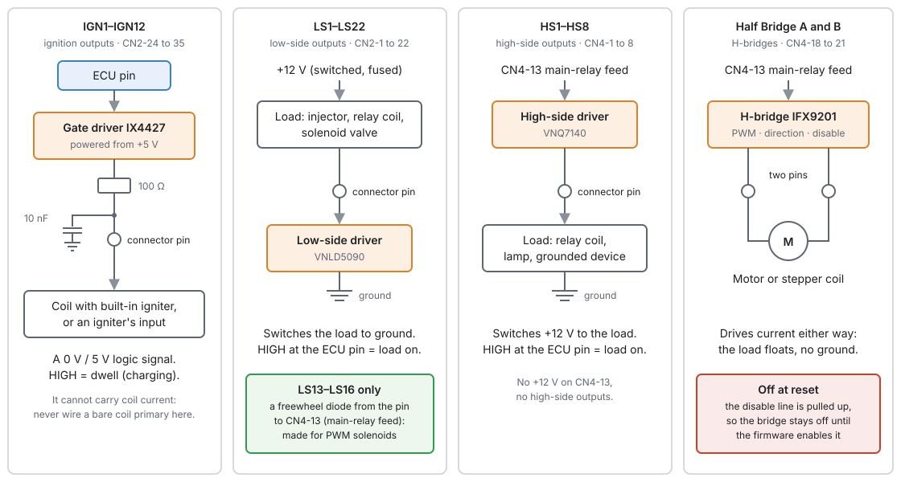
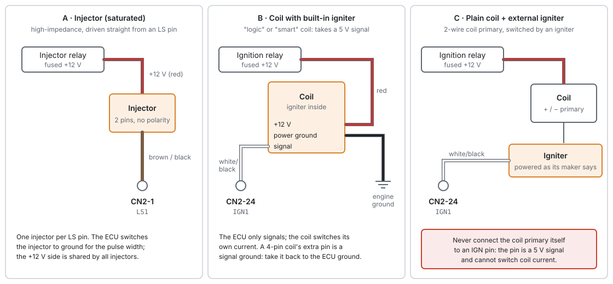
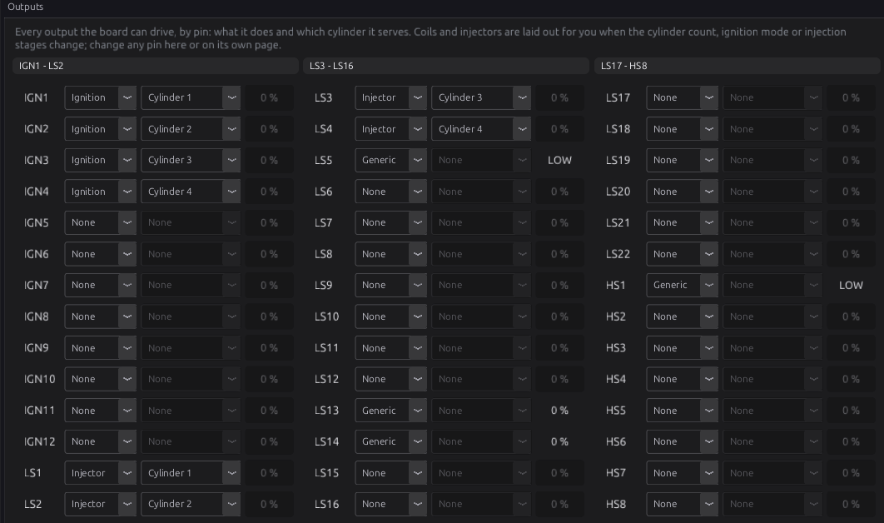
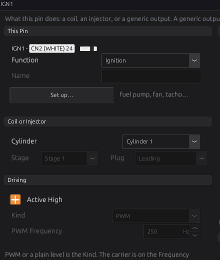
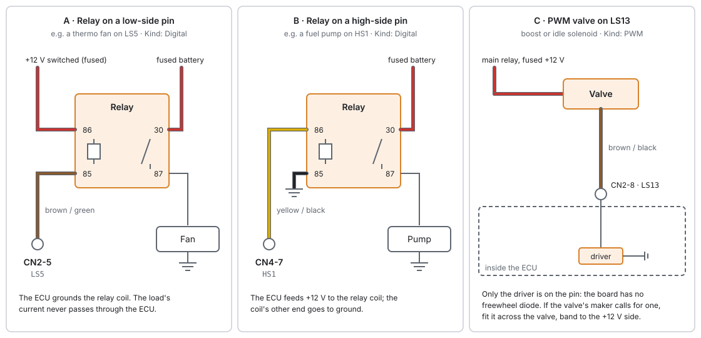
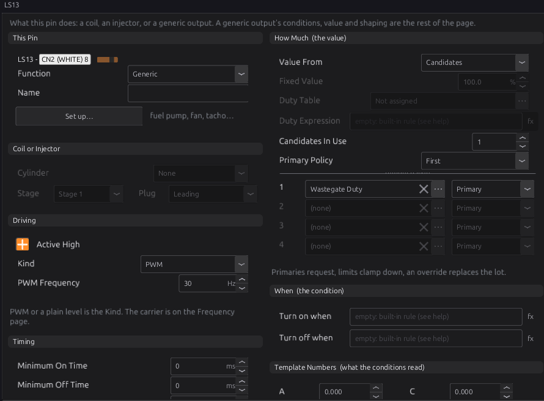
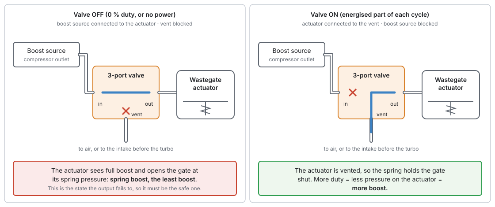
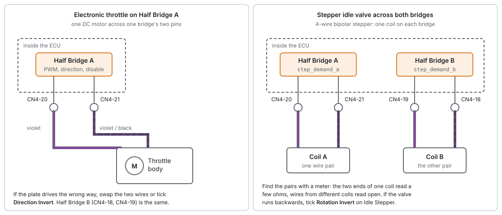
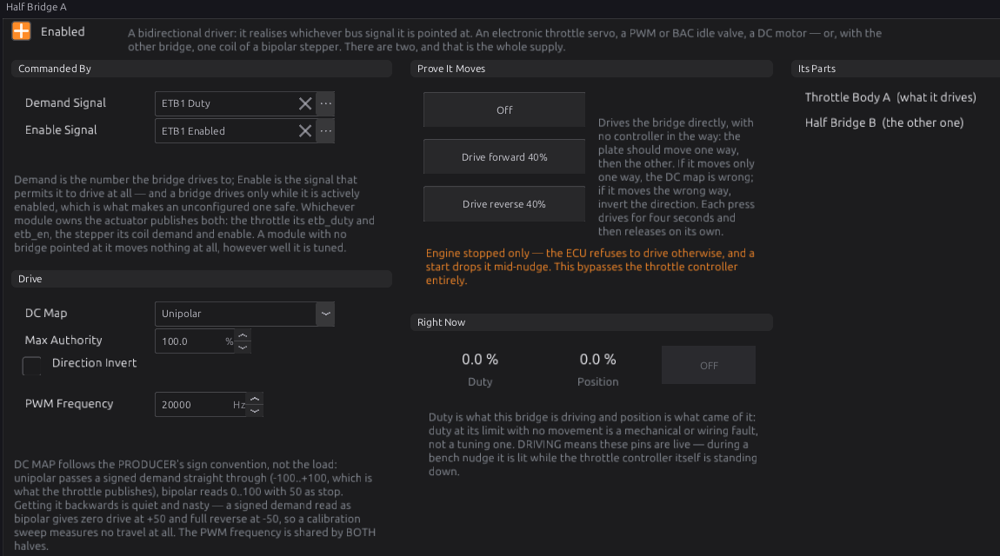
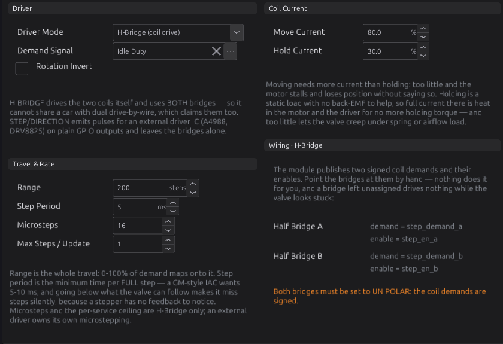

# Wiring outputs

:material-circle:{ .level-basic } Basic → :material-circle:{ .level-advanced } Advanced

> **In one sentence:** how to connect injectors, coils, relays, PWM valves, motors and stepper valves
> to the ECU's outputs, what each kind of output can and cannot drive, and how to prove each one works
> before the engine runs.

## Overview

:material-circle:{ .level-basic } Basic

An **output** is a pin the ECU switches to make something happen: an injector opens, a coil sparks, a
relay clicks, a valve moves. The jaytek_v1 board has four kinds of output stage, and each kind suits
different loads:

| Kind | How many | Connector pins | What it does | Suits |
|---|---|---|---|---|
| **IGN** (ignition) | 12 | CN2-24 to CN2-35 | Sends a 0 V / 5 V logic signal | Coils with a built-in igniter, external igniters, logic inputs |
| **LS** (low-side) | 22 | CN2-1 to CN2-22 (not in order) | Switches a load to ground | Injectors, relay coils, solenoid valves |
| **HS** (high-side) | 8 | CN4-1 to CN4-8 (not in order) | Switches +12 V to a load | Relay coils and loads whose other end is grounded |
| **Half Bridge** (H-bridge) | 2 | CN4-18 to CN4-21 | Drives current either way through a load | Electronic throttle, motorised wastegate, stepper valve |

<!-- src: definition/boards/jaytek_v1.board.yaml (drivers, polarity) (CN2) (CN4) -->

This chapter is about the **wiring**: which pin, which wire, where the +12 V and the ground come from,
and what must never be connected. Choosing what an output *does* is in chapter 18, and each engine
function has its own chapter (fuel 19, ignition 20, idle 21, electronic throttle 22, boost 24).

Chapter 7 has the full pinout; chapter 10 covers the power feeds and grounds these outputs rely on.

!!! danger "Outputs move fuel, spark and air"
    An injector held open floods a cylinder with fuel. A coil held on overheats. An electronic throttle
    driven the wrong way opens the throttle. Wire with the ECU unplugged, check every pin against the
    tables here, and test each output on the bench (the end of this chapter) before you crank the
    engine.

## Concepts

### The four output stages

:material-circle:{ .level-basic } Basic

<figure markdown>
  
  <figcaption>Figure 12.1 — What sits behind each kind of pin. Only the LS and HS stages switch a
  load's working current; the IGN stage only signals, and the H-bridge drives a load that is
  connected to nothing but its two pins.</figcaption>
</figure>

- **IGN pins** come from a gate driver chip (IX4427) powered from the board's +5 V, through a 100 Ω
  resistor, with a 10 nF capacitor to ground at the pin. The pin swings between 0 V and 5 V. That is a
  signal, not a power output: it tells a coil's built-in igniter, or a separate igniter module, when to
  charge and when to fire. It cannot carry the several amps a coil primary draws.
  <!-- src: schematic (CON_IGN1: R2 100 Ω, C2 10 nF); hardware/PDF_JAYTEK_2026-04-29/Ignition_1 (IX4427 VCC = +5V); definition/boards/jaytek_v1.board.yaml -->
- **LS pins** come from low-side switches (VNLD5090). The load's other end goes to +12 V; when the
  output is on, the switch connects the pin to ground and current flows.
  <!-- src: definition/boards/jaytek_v1.board.yaml; schematic (CON_LS1 = U2 drain) -->
- **HS pins** come from high-side switches (VNQ7140). They take their +12 V from **CN4-13**, the
  main-relay feed, and switch it out to the pin. The load's other end goes to ground.
  <!-- src: definition/boards/jaytek_v1.board.yaml; schematic (CON_12V_MR feeds U17.17, U22.17) -->
- **Half bridges** (IFX9201) also take their supply from **CN4-13**. Each has two output pins and can
  drive either one high and the other low, so current flows through the load in either direction. The
  ECU drives each bridge with three internal lines (PWM, direction, disable); you wire only the two
  output pins.
  <!-- src: definition/boards/jaytek_v1.board.yaml; schematic (CON_12V_MR feeds U29.4, U30.4) -->

### Low side and high side

:material-circle:{ .level-basic } Basic

A load needs a supply and a return. Which one the ECU switches decides how you wire it:

- On an **LS pin**, wire the load's **+12 V side to a fused, switched +12 V** (usually from a relay),
  and its other side to the LS pin. The ECU completes the circuit to ground.
- On an **HS pin**, wire the load's **ground side to ground**, and its other side to the HS pin. The
  ECU supplies the +12 V.

Most engine loads (injectors, idle valves, boost solenoids) are traditionally switched on the ground
side, so the LS pins are where most of your wiring goes. The HS pins suit loads that are already
grounded, such as a relay whose coil has one end on the chassis.

### What each pin can be

:material-circle:{ .level-intermediate } Intermediate

In the studio, every IGN, LS and HS pin is one row on **Configuration ▸ Electrical ▸ Outputs**, in board
order: IGN1–IGN12, then LS1–LS22, then HS1–HS8. Each row has a **Function**:

| Function | What it does | Pins that can take it |
|---|---|---|
| **None** | Not driven. The pin is left open (high impedance). | All |
| **Ignition** | Fires a coil for the cylinder you name | IGN pins only |
| **Injector** | Opens an injector for the cylinder you name, in its stage | LS pins only |
| **Generic** | Driven by its own conditions and value: a relay, a fan, a pump, a valve, a tachometer | All |

<!-- src: definition/ecu.schema.yaml (outputs.output[].function); codegen/codegen.py (_output_row_functions) -->

The half bridges are not rows on that page. Each is a three-line device with its own page under
**Configuration ▸ Electrical ▸ Half Bridges**.
<!-- src: ecu.schema.yaml (count_from_board comment); definition/boards/jaytek_v1.board.yaml -->

A pin whose row is **None** is never driven. A pin that two functions try to claim is not driven either:
the ECU raises **P1650** and leaves it open.
<!-- src: firmware/Integration/OutputManager.cpp -->

### Polarity: Active High

:material-circle:{ .level-intermediate } Intermediate

Every row has an **Active High** tick box `outputs.output[].active_high`, and it applies to coils and
injectors as well as generic outputs. Ticked (the default), "on" drives the ECU's pin high; unticked,
"on" drives it low.
<!-- src: ecu.schema.yaml (active_high, default 1); firmware/Scheduler/EventScheduler.h; firmware/Scheduler/SoftPwm.h -->

On this board every output stage turns its load **on** when the ECU drives it high: an IGN pin goes to
5 V (dwell), an LS switch conducts, an HS switch conducts. So **leave Active High ticked** for
everything wired as this chapter shows. Untick it only when the device on the other end wants the
opposite, for example an igniter that charges the coil while its input is low.
<!-- src: definition/boards/jaytek_v1.board.yaml ("HIGH = dwell") ("HIGH = ON") ("HIGH = ON"); hardware/jaytek_v1_hardware.md -->

!!! warning "Unticking Active High on an LS or HS pin turns the load on at rest"
    With Active High unticked, the pin is driven high whenever the output is *off*. On this board that
    means the injector, valve or relay is energised whenever the ECU is not asking for it.

### PWM on the output pins

:material-circle:{ .level-intermediate } Intermediate

A **PWM** (pulse-width modulated) output switches on and off at a fixed **frequency**, and the
**duty** is the share of each cycle it is on. A solenoid valve cannot follow each pulse; it settles at a
position set by the average, so the duty controls how far it opens.

Generic outputs have a **Kind**: **PWM** or **Digital** (plain on/off). Choose PWM for a valve being
modulated and Digital for a relay or a lamp: a relay driven with PWM buzzes.
<!-- src: ecu.schema.yaml (kind) -->

How PWM is made on the IGN, LS and HS pins:

- The waveform is built in **10 µs steps** (a 100 kHz tick), so the duty resolution depends on the
  frequency: about 3300 steps at 30 Hz, 400 at the default 250 Hz, 100 at 1 kHz.
  <!-- src: firmware/main.cpp (SOFTPWM_TPS = 100000); firmware/Integration/OutputManager.cpp (period = tps / pwm_freq_hz); firmware/Integration/EmitSinks.h -->
- **Up to 16 PWM outputs** can run at once. They share one pool; a PWM row beyond the sixteenth is left
  undriven.
  <!-- src: firmware/Scheduler/SoftPwm.h; OutputManager.cpp -->
- The frequency is the row's **PWM Frequency** (default 250 Hz), or comes from a table or an expression
  (clamped to 1–50 000 Hz). Use the frequency the valve's maker gives.
  <!-- src: ecu.schema.yaml (pwm_freq_hz default 250) (freq_source); OutputManager.cpp -->

The half bridges are different. Their PWM is generated by a hardware timer, from 1 Hz to 50 kHz, and
the **one frequency is shared by both bridges**. The default is 20 kHz, above hearing, so a throttle
motor does not whine.
<!-- src: firmware/Platform/boards/jaytek_v1/jaytek_v1_profile.cpp; ecu.schema.yaml (pwm_freq_hz default 20000); docs/pwm-hal-design.md §3.1 -->

### Flyback and freewheel diodes

:material-circle:{ .level-intermediate } Intermediate

A coil of wire (an injector, a relay, a solenoid) stores energy while current flows. When the switch
opens, that energy has to go somewhere, and the voltage at the pin jumps high: the **flyback** spike.
Something must absorb it.

- **No output has a freewheel diode.** Every low-side pin, LS1–LS22, has nothing but its driver on it.
  The driver absorbs the spike itself, which lets the current, and the magnetic field, collapse fast.
  That is what an injector wants: it closes quickly and predictably. (The board has footprints D10–D13
  for diodes on LS13–LS16, but they are never fitted.)
  <!-- src: hardware/PDF_JAYTEK_2026-04-29/Low side/SCH_Low side_1 (VNLD5090 drain straight to the pin); D10-D13 are unpopulated footprints -->
- **HS pins** have a 10 nF capacitor at the pin and no diode.
  <!-- src: schematic (CON_HS1: C41, U17.16) -->

The rules that follow:

1. **Any low-side pin drives injectors, relays and PWM solenoids.** There is no special group.
2. **If a PWM valve's maker calls for a freewheel diode**, fit it across the valve's coil, at the
   valve: the band (cathode) to the valve's +12 V terminal, the other end to the terminal wired to the
   LS pin. With the diode, the current keeps circulating when the driver switches off and dies away
   slowly, which gives a steadier valve position. Many valves have one inside already.
3. **Never put a diode across an injector.** It slows the injector's closing and changes its dead
   time.

!!! tip "Relays with a built-in diode"
    A relay with a suppression diode across its coil is fine on any LS or HS pin, but it has a polarity:
    pin 86 must go to the +12 V side. Fitted backwards, the diode shorts the output every time it
    switches on.

### Current, heat and supply

:material-circle:{ .level-intermediate } Intermediate

The board file does not state a continuous current rating for any output, and this manual does not
guess one. Size every load well inside what the driver's maker allows, and follow two rules that do not
depend on the number:

- **Use a relay for anything big.** Fuel pumps, cooling fans, the starter, headlights and anything else
  that draws several amps go through a relay, with the ECU driving only the relay's coil
  (Figure 12.5). The load's current then never passes through the ECU.
- **Remember what CN4-13 carries.** Every HS output and both half bridges take their current from
  CN4-13. Its wire and fuse must carry all of those loads at once (chapter 10).

The drivers used here protect themselves against overload and overheating. The half-bridge chip's own
fault output is not connected to the processor, so if a bridge shuts itself down, the firmware cannot
tell you why; it only sees that the motor did not move.
<!-- src: docs/throttle-control-design.md §2 ("IFX9201 ERR/SPI diagnostics are not wired") -->

### What happens at power-up

:material-circle:{ .level-intermediate } Intermediate

While the processor starts, its pins float. The board holds every output in a safe state until the
firmware takes over:

- The IGN and LS driver inputs have **1 kΩ pull-down resistors**, so those outputs stay off.
  <!-- src: schematic R3/R4 (IGN1/IGN2 to GND), RN1 pins 1-8 / 4-5 (LS1/LS2 to GND) -->
- Each half bridge's disable line has a **10 kΩ pull-up**, so the bridge stays off.
  <!-- src: schematic (ETB1_DIS: R101 10 kΩ to VDD); docs/throttle-control-design.md §2 -->
- The firmware leaves every pin open until a function claims it.
  <!-- src: docs/pin-registry-design.md (PinArbiter: Hi-Z until claim); OutputManager.cpp -->

Generic outputs also wait for the **key**. The ECU counts the key as on when battery voltage rises
above 8.0 V, and off when it falls to 7.0 V or below. With the key off (for example, the ECU on USB power alone
at your desk), every generic output is parked open, so a bench tune cannot run a fuel pump or pulse a
boost solenoid.
<!-- src: firmware/Sensors/Sensors.h (KEY_ON_V 8.0, KEY_OFF_V 7.0); firmware/Sensors/Sensors.cpp; firmware/Integration/OutputManager.cpp -->

## Procedure

### Injectors

:material-circle:{ .level-basic } Basic

The LS outputs switch an injector fully on for the whole pulse. That suits **high-impedance
("saturated") injectors**, typically about 12 Ω or more, the kind almost every modern engine uses. The
board has no peak-and-hold injector driver, and the firmware has no peak-and-hold setting.
<!-- src: definition/boards/jaytek_v1.board.yaml (LS = VNLD5090 switch); no peak/hold setting in ecu.schema.yaml or firmware/ -->

!!! warning "Low-impedance injectors"
    A low-impedance injector (about 2–4 Ω) draws several times the current of a saturated one. Do not
    wire one straight to an LS pin. Use high-impedance injectors, or fit the series resistor pack or
    external peak-and-hold driver the injector's maker specifies.

<figure markdown>
  
  <figcaption>Figure 12.2 — (A) an injector on LS1, (B) a coil with a built-in igniter on IGN1, (C) a
  plain coil through an external igniter. Wire colours are the ones the board file suggests.</figcaption>
</figure>

1. **Feed the injectors' +12 V** from a fused, switched supply, usually an injector or main relay
   (chapter 10). All the injectors can share it.
2. **Wire each injector's other pin to its own LS pin.** The LS pins are not in order on CN2; use this
   table:

    | LS | CN2 pin | LS | CN2 pin | LS | CN2 pin |
    |---|---|---|---|---|---|
    | LS1 | 1 | LS9 | 9 | LS17 | 2 |
    | LS2 | 13 | LS10 | 21 | LS18 | 14 |
    | LS3 | 3 | LS11 | 11 | LS19 | 4 |
    | LS4 | 15 | LS12 | 12 | LS20 | 16 |
    | LS5 | 5 | LS13 | 8 | LS21 | 6 |
    | LS6 | 17 | LS14 | 20 | LS22 | 18 |
    | LS7 | 7 | LS15 | 10 | | |
    | LS8 | 19 | LS16 | 22 | | |

    <!-- src: definition/boards/jaytek_v1.board.yaml -->
3. **Set up the engine first**, then check the layout. When you set the cylinder count, the injection
   stages and each stage's mode, the studio lays out the injector rows for you: stage 1 on a block of
   LS pins from LS1, stage 2 on the next block, and so on. A per-cylinder stage puts cylinder *n* on the
   *n*th pin of its block. A pin you have already set to **Generic** is skipped, and the injector moves
   to the next free LS pin.
   <!-- src: apps/studio-jf/src/model/EngineOutputLayout.cpp (injectorWants) (place: Generic pins skipped); docs/output-unification-design.md "Who assigns" -->
4. **Open Configuration ▸ Electrical ▸ Outputs** and check that each injector row names the cylinder
   you wired it to (Figure 12.3). Change any row by hand if your harness differs. The firing order never
   moves an output: row LS1 fires cylinder 1's injector whatever order the cylinders fire in.
5. **Check the stage 1 injector dead time** on **Fuel Tuning ▸ Stage 1 ▸ Dead Time** (chapter 19).

<figure markdown>
  
  <figcaption>Figure 12.3 — Configuration ▸ Electrical ▸ Outputs for Example 1 below: every output
  pin, what it does and which cylinder it serves. The right-hand box on each row is what the pin is
  doing now.</figcaption>
</figure>

A coil or injector row changed while the engine runs takes effect at the next engine stop.
<!-- src: ecu.schema.yaml (function help); docs/output-unification-design.md (output_map_pending) -->

!!! tip "Keeping a pin for something else"
    The layout fills LS pins from LS1 upwards, so a large engine's second stage can take pins you had
    in mind for a valve or relay. Before the layout runs, set any pin you want to keep to **Generic**;
    the injectors then skip it. Otherwise move the injectors off those pins by hand.

### Ignition coils

:material-circle:{ .level-basic } Basic

The IGN pins send a 5 V signal (Figure 12.1). What you connect depends on the coil:

- **A coil with a built-in igniter** (often called a "smart" or "logic-level" coil, usually 3 or 4
  pins) switches its own current. Wire its **+12 V** to a fused, switched ignition supply, its **power
  ground** to a good engine ground, and its **signal** pin to the IGN pin. A 4-pin coil's extra pin is
  usually a signal ground: take it back to a ground at the ECU (Figure 12.2 B).
- **A plain coil** (2 primary terminals) needs an **external igniter** module to switch it. The IGN pin
  drives the igniter's input; the igniter switches the coil's negative terminal (Figure 12.2 C).

!!! danger "Never connect a coil primary to an IGN pin"
    The IGN pin is a 5 V signal behind a 100 Ω resistor. A coil primary connected to it will not
    spark, and the driver can be damaged.

1. **Wire each coil or igniter input to its IGN pin.** IGN1–IGN12 are CN2-24 to CN2-35, in order.
   <!-- src: definition/boards/jaytek_v1.board.yaml -->
2. **Set the ignition mode and cylinder count**, then check the coil rows on the Outputs page. The
   studio lays them out by cylinder number:

    | Ignition mode | Coil rows |
    |---|---|
    | Coil-on-plug | IGN*n* fires cylinder *n* |
    | Wasted spark | One coil per pair, named by the pair's lower-numbered cylinder, on IGN1, IGN2, … in cylinder order (for firing order 1-3-4-2: IGN1 = cylinders 1 and 4, IGN2 = cylinders 2 and 3) |
    | Single Coil (distributor) | IGN1 fires all cylinders |

    <!-- src: EngineOutputLayout.cpp (coilWants); docs/output-unification-design.md table -->
    Under wasted spark each coil also fires its companion, the cylinder half a cycle away, worked out
    from the firing order while the engine runs.
    <!-- src: docs/output-unification-design.md "The firmware"; ecu.schema.yaml (cylinder comment) -->
3. **Open the coil's own page** (for example **Outputs ▸ IGN1**, Figure 12.4). The **This Pin** line
   shows which connector pin it is (IGN1 is CN2 pin 24). Leave **Active High** ticked for a coil or
   igniter that charges while its input is high.
4. **Set dwell** on **Ignition Tuning ▸ Dwell Time** (chapter 20). Dwell is how long the coil charges;
   too long overheats it.

<figure markdown>
  
  <figcaption>Figure 12.4 — Outputs ▸ IGN1. The label beside the pin name is the connector and pin to
  wire to. Kind and PWM Frequency are greyed: they only apply to generic outputs.</figcaption>
</figure>

### Relays

:material-circle:{ .level-basic } Basic

A relay lets a small output switch a big load. Any LS or HS pin can drive a relay coil.

<figure markdown>
  
  <figcaption>Figure 12.5 — (A) a fan relay on a low-side pin, (B) a fuel-pump relay on a high-side
  pin, (C) a PWM valve on a low-side pin (LS13 here). In A and B the fan and pump current
  goes through the relay contacts, never through the ECU.</figcaption>
</figure>

1. **On an LS pin:** relay pin **86** to fused, switched +12 V, pin **85** to the LS pin.
   **On an HS pin:** relay pin **86** to the HS pin, pin **85** to ground.
2. **Wire the contacts:** pin **30** to a fused battery feed, pin **87** to the load.
3. **On the pin's page**, set **Function** to **Generic** and **Kind** to **Digital**.
4. **Press Set up this output…** and choose a template (fuel pump, thermo fan, main relay, A/C clutch, starter and
   others). The template writes the conditions that switch the output; chapter 18 explains them.
   <!-- src: ecu.schema.yaml (output_templates) -->

### PWM valves: idle valves and boost solenoids

:material-circle:{ .level-intermediate } Intermediate

A PWM solenoid valve has two terminals. Wire it like Figure 12.5 C: one terminal to the switched +12 V
from the main relay, the other to any LS pin. Add a freewheel diode at the valve only if its maker
calls for one (see *Flyback and freewheel diodes*).

1. **Set Function to Generic and Kind to PWM** on the pin's page (Figure 12.6).
2. **Set PWM Frequency** to what the valve's maker specifies. The **Boost Solenoid** template uses
   **30 Hz**, which suits most 3-port boost valves.
   <!-- src: ecu.schema.yaml (boost_solenoid template, pwm_freq_hz 30) -->
3. **Point the value at the module that commands it.** Leave **Value From** on **Candidates** and set
   candidate 1 to the module's output: **Wastegate Duty** `wastegate_duty` for a boost solenoid, **Idle
   Duty** `idle_duty` for an idle valve. The **Set up this output…** templates do this for you where one exists.
4. **Leave Failsafe at 0.** When the module is not asking for anything, the output falls back to its
   failsafe value, and 0 % means the valve is off.
   <!-- src: ecu.schema.yaml (failsafe_x10 default 0); OutputManager.cpp -->

<figure markdown>
  
  <figcaption>Figure 12.6 — Outputs ▸ LS13 set up for a boost solenoid: PWM at 30 Hz, its value from
  Wastegate Duty. LS13 is CN2 pin 8.</figcaption>
</figure>

#### Plumbing a 3-port boost solenoid

A 3-port solenoid sits in the hose between the boost source and the wastegate actuator, with a third
port to vent. Plumb it so that **with the valve off, the actuator sees full boost**. Then a failed
output, a broken wire or an ECU with no power leaves you at spring boost, the least boost the turbo
makes. The Boost Solenoid template assumes this: its failsafe is off.
<!-- src: ecu.schema.yaml (boost_solenoid detail: "OFF ... passes full pressure to the actuator ... the LEAST boost") -->

<figure markdown>
  
  <figcaption>Figure 12.7 — Plumbing a 3-port boost solenoid. Off, full boost reaches the actuator
  (spring boost). On, the actuator vents and the spring holds the gate shut. The duty sets the average
  between the two, so more duty means more boost.</figcaption>
</figure>

1. **Boost source** (compressor outlet, after the turbo) to the port the valve's maker marks as
   normally open, or the one connected to the actuator port when the valve is unpowered.
2. **Common port** to the wastegate actuator.
3. **Vent port** to air, or back into the intake before the turbo. Keep it clear of dirt and water.
4. **Check with a hand pump before you drive:** with the valve unpowered, pressure at the source port
   must reach the actuator.

This matches how the Boost module thinks: its duty is "per cent held shut", so more duty means more
boost (chapter 24).

!!! danger "Plumbed backwards, a failed output gives full boost"
    If the unpowered valve vents the actuator, every fault (a blown fuse, a broken wire, a crashed
    module) holds the wastegate shut. Check the unpowered path before the first drive.

!!! note "2-port bleed valves"
    A 2-port valve bleeds pressure out of the actuator line through a restrictor. Unpowered it bleeds
    nothing, so it also fails to spring boost. Wire and set it up the same way; only the plumbing
    differs.

#### Idle valves

- A **2-wire PWM idle valve** is wired and set up exactly as above, with Idle Duty as its candidate.
- A **4-wire stepper idle valve** needs both half bridges; see *Stepper idle valves* below.
- A **3-wire rotary idle valve** has two coils pulling against each other and needs two outputs.
  <!-- open question: no template or documented setup for a 3-wire rotary valve -->

!!! info "Advanced — a 3-wire rotary idle valve"
    Wire the common terminal to switched +12 V and each coil to its own LS pin. Drive the first pin from
    Idle Duty. For the second, set **Value From** to **Expression** and the duty expression to
    `100 - idle_duty`. The two outputs run separate carriers and are not phase-locked; the valve
    responds to the average of each. Try this on the bench first.
    <!-- src: ecu.schema.yaml (duty_expr) (value_source Expression); OutputManager.cpp; SoftPwm.h (per-channel waveform) -->

### H-bridge loads: electronic throttle and motorised wastegate

:material-circle:{ .level-intermediate } Intermediate

A DC motor that must be driven both ways, such as an electronic throttle body or a motorised
wastegate, goes across the two pins of one half bridge:

| Bridge | Pins | Wire colours the board file suggests |
|---|---|---|
| Half Bridge A | CN4-20 and CN4-21 | violet, violet/black |
| Half Bridge B | CN4-18 and CN4-19 | violet/black, violet |

<!-- src: definition/boards/jaytek_v1.board.yaml -->

<figure markdown>
  
  <figcaption>Figure 12.8 — Left: an electronic throttle on Half Bridge A. Right: a stepper idle valve
  using both bridges, one coil on each. Nothing else connects to the motor: no +12 V, no ground.</figcaption>
</figure>

1. **Wire the motor's two terminals to the bridge's two pins.** Which way round only decides the
   direction, which you can reverse in the studio. Do not connect either motor terminal to +12 V or
   ground.
2. **Wire the position sensors** (throttle position A and B, or the wastegate position sensor) as
   analog inputs (chapter 11).
3. **Open Configuration ▸ Electrical ▸ Half Bridges ▸ Half Bridge A** (Figure 12.9) and tick
   **Enabled** `h_bridge.half[0].enabled`.
4. **Check the two signals under Commanded By.** The bridge drives only while **Demand Signal** is
   valid and **Enable Signal** is valid and at or above 0.5. For the electronic throttle the defaults are
   already right: **ETB1 Duty** `etb_duty_1` and **ETB1 Enabled** `etb_en_1` on bridge A, ETB2 on bridge
   B. For a motorised wastegate, the demand is **Wastegate Motor Duty** `wastegate_pos_duty`.
   <!-- src: firmware/Engine/Modules/HBridge.cpp; ecu.schema.yaml (demand_sig/enable_sig defaults); Boost.cpp (wastegate_pos_duty, -100..+100) -->
5. **Leave DC Map on Unipolar** for both of these. They publish a signed demand from −100 to +100, and
   Unipolar passes the sign through as the direction. Bipolar is for a producer that sends 0–100 with
   50 meaning stop; used with a signed demand it only ever drives one way.
   <!-- src: HBridge.cpp (map_demand); ecu.schema.yaml (dc_map help) -->
6. **Set Max Authority** `h_bridge.half[].dc_max_pct` if the motor must never see full voltage. It
   scales the whole range down rather than cutting the top off.
   <!-- src: HBridge.cpp; ecu.schema.yaml -->
7. **Leave PWM Frequency at 20 000 Hz** unless the motor's maker says otherwise. Remember it is shared
   by both bridges.
8. **Prove it moves.** With the engine stopped, press **Drive forward 40%**, then **Drive reverse 40%**.
   Each press drives the bridge for four seconds, through the same DC Map, Max Authority and Direction
   Invert a real demand uses. The throttle plate (or gate) should move one way, then the other. If it
   moves the wrong way, tick **Direction Invert** `h_bridge.half[].dir_invert`. If it moves only one
   way, the DC Map is wrong.
   <!-- src: HBridge.h (bench nudge); HBridge.cpp; firmware/Cli/CliCommands.cpp ("drive that half for 4s (engine-stopped)") -->

<figure markdown>
  
  <figcaption>Figure 12.9 — Configuration ▸ Electrical ▸ Half Bridges ▸ Half Bridge A, set up for an
  electronic throttle. Right Now shows the duty the bridge is actually driving, after its DC map.</figcaption>
</figure>

!!! danger "A motorised wastegate must be spring-open"
    When nothing is driving the bridge, the motor is not powered and the gate rests wherever its spring
    puts it. That must be **open**, or a fault gives uncontrolled boost (chapter 24).

!!! warning "The motorised wastegate needs an enable signal"
    The Boost module publishes the gate's demand, but no enable signal of its own. The bridge stays off,
    and raises P1761 (bridge A) or P1763 (bridge B), until you choose one. It must read at least 0.5
    whenever the gate may be driven.
    <!-- src: HBridge.cpp; Boost.cpp (no enable published); ecu.schema.yaml -->

### Stepper idle valves

:material-circle:{ .level-advanced } Advanced

A 4-wire bipolar stepper valve has two coils. There are two ways to drive one.

**Across both half bridges** (Driver Mode **H-Bridge (coil drive)**, the default). Coil A goes on Half
Bridge A, coil B on Half Bridge B (Figure 12.8, right). This uses **both** bridges, so it cannot be
combined with an electronic throttle or a motorised wastegate.
<!-- src: firmware/Engine/Modules/Stepper.h; ecu.schema.yaml (driver_mode) -->

1. **Find the coil pairs** with a meter: the two ends of one coil read a few ohms; wires from different
   coils read open.
2. **Wire coil A across CN4-20 and CN4-21, coil B across CN4-18 and CN4-19.**
3. **Enable both half bridges** and point them at the stepper: Half Bridge A demand **step_demand_a**,
   enable **step_en_a**; Half Bridge B demand **step_demand_b**, enable **step_en_b**. Nothing sets
   these for you. Leave both on **Unipolar**: the coil demands are signed.
   <!-- src: Stepper.cpp (publishes signed step_demand_a/b, step_en_a/b) -->
4. **Open Configuration ▸ Engine Functions ▸ Idle Stepper** (Figure 12.10), tick **Enabled** and set
   the valve's travel and step rate (chapter 21).
5. **If the valve runs the wrong way**, tick **Rotation Invert**.

<figure markdown>
  
  <figcaption>Figure 12.10 — Configuration ▸ Engine Functions ▸ Idle Stepper. The Wiring panel lists
  the four signals the two bridges must be pointed at.</figcaption>
</figure>

A stepper has no position sensor. Each time the stepper is switched on (at power-up, or when you
enable it), the ECU drives the valve closed by its whole travel plus a tenth, into its end stop, and
counts that as zero. Stopping the engine does not move the valve.
<!-- src: Stepper.cpp (start_homing: range + range/10 + 1) -->

**Through an external step/direction driver** (Driver Mode **Step/Direction (external driver)**). The
ECU sends STEP, DIR and ENABLE signals to a driver board (the schema names A4988 and DRV8825 as
examples), and the driver board powers the motor. This leaves both half bridges free.
<!-- src: Stepper.h; ecu.schema.yaml -->

- Use three **Generic**, **Digital** outputs with candidates **step_pulse**, **step_dir** and
  **step_enable**.
- A driver board's inputs want a logic level. The **IGN pins give a 0 V / 5 V signal** and can be
  Generic, so a spare IGN pin suits these three. An LS pin only pulls to ground; it needs a pull-up
  resistor to the driver's logic supply.
- These signals are 0 or 1, and a Digital output switches at the middle of its clamp range, which is
  50 by default. Set **Clamp High (x10)** to **10** on each of these rows, so the output switches at 0.5.
  <!-- src: OutputManager.cpp (thr = 0.5 * (lo + hi)); EmitSinks.h; ecu.schema.yaml (clamp defaults 0 and 1000) -->

### Checking your work

:material-circle:{ .level-intermediate } Intermediate

Every output's page has a **Bench Test** panel: a **Count**, an **On Time** and an **Off Time**, and
**Test**, **Stop** and **Stop All** buttons. It pulses the output the way its function does (a spark,
an injection, or a plain on/off), with the engine stopped only. Use it on every output before the first
start: listen for each injector click, see each coil spark on a spark tester, hear each relay. Chapter
43 walks through a full bench test.
<!-- src: firmware/Engine/Modules/OutputTest.cpp (Spark / Inject / Level by function) (drives the row's own active sense) -->

The key must be on (battery above 8 V) for generic outputs to drive at all.

## Examples

:material-circle:{ .level-intermediate } Intermediate

!!! example "Example 1 — four-cylinder turbo, coil-on-plug, sequential injection"
    The example shown in Figures 12.3, 12.4 and 12.6.

    | Load | Output | Pin | Set up as |
    |---|---|---|---|
    | Coils, cylinders 1–4 (built-in igniters) | IGN1–IGN4 | CN2-24 to 27 | Ignition, cylinder 1–4 |
    | Injectors, cylinders 1–4 (saturated) | LS1–LS4 | CN2-1, 13, 3, 15 | Injector, cylinder 1–4 |
    | Cooling fan relay | LS5 | CN2-5 | Generic, Digital, Thermo Fan template |
    | Boost solenoid (3-port) | LS13 | CN2-8 | Generic, PWM 30 Hz, Wastegate Duty |
    | 2-wire PWM idle valve | LS14 | CN2-20 | Generic, PWM, Idle Duty |
    | Fuel pump relay | HS1 | CN4-7 | Generic, Digital, Fuel Pump template |

    The two solenoids take their +12 V from the main relay. The pump relay's coil is grounded at pin
    85, so it sits on a high-side pin.

!!! example "Example 2 — V8 with an electronic throttle"
    Eight coils with built-in igniters on IGN1–IGN8 (CN2-24 to 31), eight saturated injectors on LS1–LS8
    (CN2-1, 13, 3, 15, 5, 17, 7, 19), and the throttle body motor on Half Bridge A (CN4-20 and CN4-21).
    Half Bridge A keeps its defaults: ETB1 Duty, ETB1 Enabled, Unipolar, 20 000 Hz. The throttle's two
    position sensors go to analog inputs (chapter 11). Idle air comes from the throttle, so there is no
    idle valve. Half Bridge B is free for a second throttle body.

!!! example "Example 3 — four-cylinder with a 4-wire stepper idle valve"
    Coil A of the stepper across CN4-20 and CN4-21, coil B across CN4-18 and CN4-19. Both half bridges
    enabled, pointed at step_demand_a/step_en_a and step_demand_b/step_en_b, both Unipolar. Idle
    Stepper enabled in H-Bridge mode with Idle Duty as its demand. This car cannot also have an
    electronic throttle, because the stepper uses both bridges.

## Pitfalls and troubleshooting

:material-circle:{ .level-basic } Basic → :material-circle:{ .level-advanced } Advanced

| Symptom | Likely causes | Check |
|---|---|---|
| An output does nothing at all | Row set to None; key off; the pin claimed twice (P1650) | The row's Function; battery above 8 V; the DTC list |
| A load is on whenever it should be off | Active High unticked | Tick Active High (every stage on this board is on-when-high) |
| Coil does not spark, IGN pin tests fine | Plain coil wired straight to the IGN pin; no +12 V or ground at a smart coil | Figure 12.2; the coil's supply and ground with a meter |
| Injector clicks weakly or the LS pin runs hot | Low-impedance injector on a saturated driver | Measure the injector's resistance; see *Injectors* |
| PWM valve buzzes or does not respond to duty | Wrong PWM frequency; Kind set to Digital | The maker's frequency; Kind = PWM |
| Relay buzzes | Relay output set to PWM | Kind = Digital |
| A PWM output never starts, others do | More than 16 PWM outputs | Count the PWM rows; make relays Digital |
| Boost is full with the solenoid unplugged | 3-port valve plumbed backwards | Figure 12.7; the unpowered path with a hand pump |
| Throttle or gate does not move | Half bridge not enabled; enable signal unset (P1761/P1763) or not asserted; demand missing (P1760/P1762) | **Enabled**; **Commanded By**; Prove It Moves |
| Motor moves only one way | DC Map set to Bipolar for a signed demand | DC Map = Unipolar |
| Motor moves the wrong way | Wires reversed | Direction Invert |
| Stepper hums but does not turn, or turns erratically | Coil pairs mixed up; one bridge not enabled or not pointed at the stepper | Coil pairs with a meter; both bridges' signals |
| External stepper driver never steps | Digital rows switching at 50 on a 0/1 signal; LS pin with no pull-up | Clamp High (x10) = 10; use IGN pins or add a pull-up |
| No HS outputs and no half bridges | No +12 V at CN4-13 | The main relay and its fuse (chapter 10) |

**Trouble codes** raised by outputs and their wiring:

| Code | Meaning | What to check |
|---|---|---|
| **P1650** | Pin / output conflict: one pin claimed by two functions | Two rows or modules on the same pin |
| **P1653** | A cylinder in the firing order has no coil output | The coil rows on the Outputs page |
| **P1654** | A cylinder in the firing order has no stage 1 injector output | The injector rows on the Outputs page |
| **P1730** | Stepper: input-demand signal missing | Idle Stepper's Demand Signal, and that Idle Control is running |
| **P1760 / P1762** | Half Bridge A / B: demand signal missing | The bridge's Demand Signal, and that the module behind it is enabled |
| **P1761 / P1763** | Half Bridge A / B: enable signal unconfigured or missing | The bridge's Enable Signal |

<!-- src: ecu.schema.yaml (firmware_dtc) (module_dtc); OutputManager.cpp; firmware/Engine/EngineTask.cpp; HBridge.cpp; Stepper.cpp -->

Chapter 44 covers the DTC list and how codes are cleared.

## Settings reference

The half-bridge carrier, generated from the definition the studio loads. The per-bridge settings
(Enabled, Demand Signal, Enable Signal, Direction Invert, DC Map, Max Authority) and the per-output
settings are explained in the procedure above, and each has its help text in the studio.

--8<-- "reference/settings/_h_bridge.table.md"

## Related

- Chapter 7 — The jaytek_v1 board (full pinout)
- Chapter 10 — Power, grounds and protection (CN4-13, relays and fuses)
- Chapter 11 — Wiring sensors (throttle and wastegate position sensors)
- Chapter 18 — Outputs and the pin system (functions, templates, conditions)
- Chapter 19 — Fuel (injector dead time and stages)
- Chapter 20 — Ignition (dwell)
- Chapter 21 — Idle (idle valve and stepper settings)
- Chapter 22 — Electronic throttle
- Chapter 24 — Boost (solenoid and motorised wastegate control)
- Chapter 43 — Bench testing
