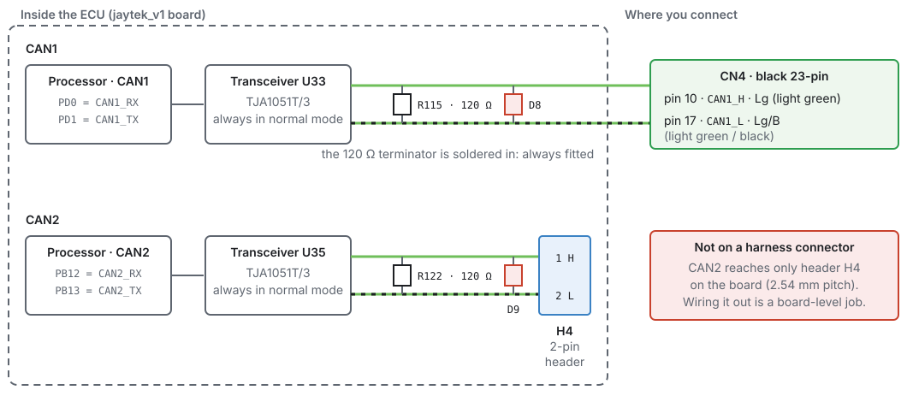
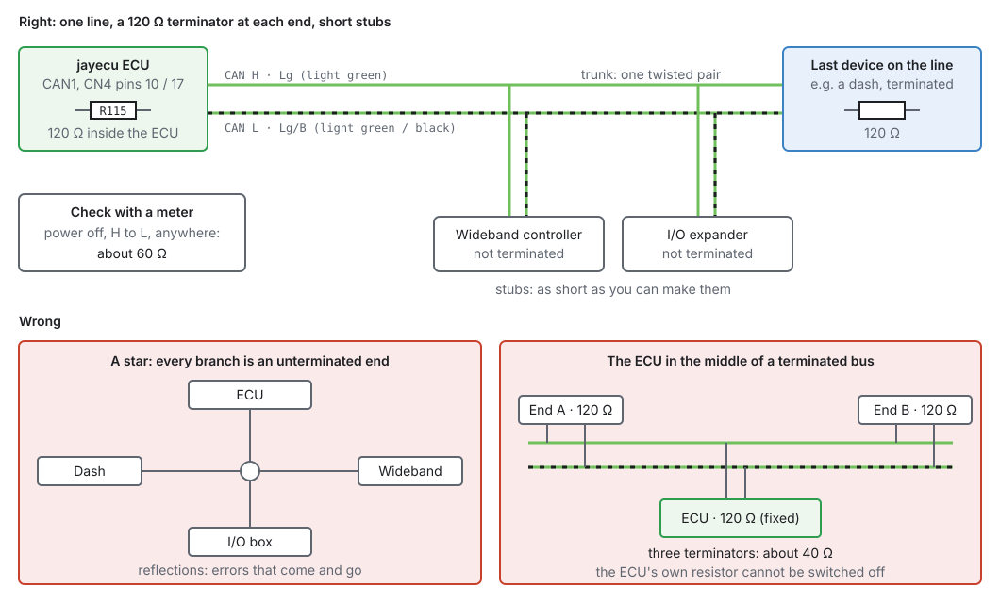
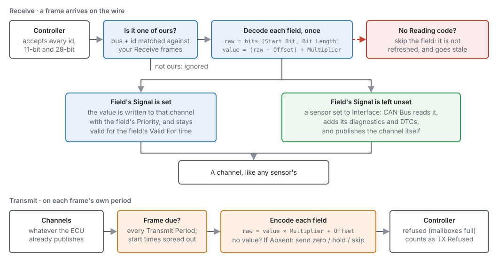
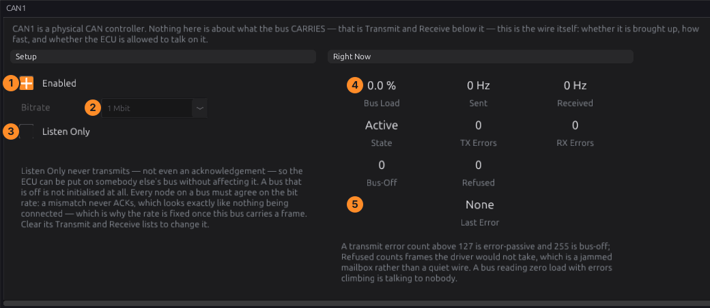
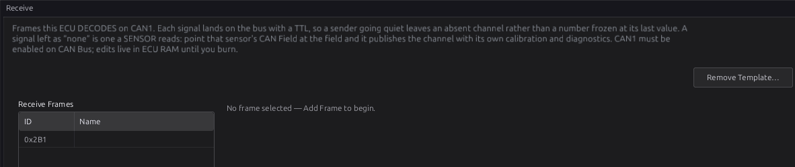
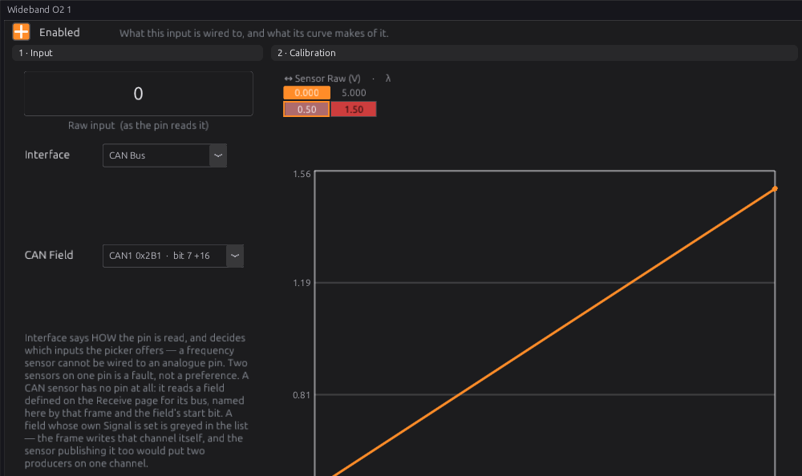
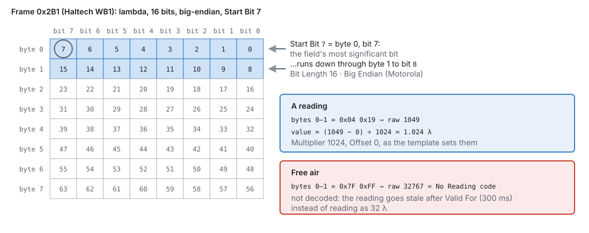

# CAN bus

:material-circle:{ .level-basic } Basic → :material-circle:{ .level-intermediate } Intermediate

> **In one sentence:** CAN is a two-wire network that lets the ECU talk to dashes, wideband
> controllers, I/O boxes and scan tools; this chapter is about wiring it so it works.

## Overview

:material-circle:{ .level-basic } Basic

A CAN bus is one twisted pair of wires, **CAN H** and **CAN L**, shared by every device on it. Each
device sends messages (**frames**) with an identifier, and every other device hears them. The ECU uses
CAN to:

- **read** devices: a wideband controller, an I/O expander, another module's sensors;
- **send** data: to a dash or a logger;
- **answer a scan tool** over **OBD-II**.

The jaytek_v1 has two CAN buses. This chapter covers the wiring, the physical rules every CAN bus has
to follow, and connecting a device with a template. What goes in each frame, field by field, is
chapter 33.

## Concepts

:material-circle:{ .level-intermediate } Intermediate

### The two buses on the board

<figure markdown>
  
  <figcaption>Figure 13.1 — CAN1 reaches the harness on CN4; CAN2 only reaches a header on the board.</figcaption>
</figure>

| Bus | Where | Terminator |
|---|---|---|
| **CAN1** | **CN4 pin 10** (CAN H, light green) and **pin 17** (CAN L, light green/black) | 120 Ω, always fitted |
| **CAN2** | header **H4** on the board (pin 1 H, pin 2 L) — not on a harness connector | 120 Ω, always fitted |

<!-- src: definition/boards/jaytek_v1.board.yaml (CN4 10, 17); schematic (CON_CAN1_H/L: CN4.10/17, R115; CON_CAN2_H/L: H4.1/2, R122; R115 R122 = 120 Ω; U33, U35) -->

So on a jaytek_v1, **CAN1 is the bus you wire**. Using CAN2 means bringing a lead out from the board
header, which is a board-level job.

### Termination and topology

<figure markdown>
  
  <figcaption>Figure 13.2 — A CAN bus is a line, terminated at both ends.</figcaption>
</figure>

- A CAN bus is **one line** with a **120 Ω terminator at each end**. Every other device hangs off it on
  a short **stub**.
- The ECU's terminator is soldered on and cannot be switched off, so **the ECU must be at one end of
  the bus**. The device at the other end must be terminated (most dashes and loggers have a switch or
  a jumper for it). Every device in between must **not** be terminated.
- With the power off, a meter between CAN H and CAN L anywhere on the bus reads **about 60 Ω** (two
  120 Ω in parallel). About 120 Ω means one end is missing its terminator; about 40 Ω means there is
  one terminator too many.
- Twist CAN H and CAN L together for the whole run. Keep stubs as short as you can. Do not build a
  star with long branches: every branch end reflects the signal.

### Speed

Every device on one bus must use the **same bit rate**. The ECU offers 125 kbit, 250 kbit, 500 kbit and
1 Mbit per bus (default 500 kbit). A device at the wrong rate never acknowledges a frame, which looks
exactly like a device that is not connected. Many CAN sensors and I/O boxes use 1 Mbit; OBD-II is
500 kbit.
<!-- src: definition/ecu.schema.yaml (bus.bitrate options, default 2) -->

### What the ECU does with a frame

<figure markdown>
  
  <figcaption>Figure 13.3 — How frames become channels, and channels become frames. Chapter 33 has
  the detail.</figcaption>
</figure>

A **Receive** frame the ECU knows is decoded into channels, like any sensor's. A **Transmit** frame is
built from channels and sent at its own rate. Everything else on the bus is ignored. A received value
stays valid only for its **Valid For** time; if the frame stops arriving, the channel goes missing
instead of freezing at its last value.
<!-- src: definition/ecu.schema.yaml (gc_frame, gc_field) -->

## Procedure

:material-circle:{ .level-basic } Basic

### 1 · Plan the bus

1. Decide which devices go on CAN1 and which end each device is at. The ECU is one end.
2. Check every device's bit rate. They must all match.
3. Check which device is the far end, and that it can be terminated.

### 2 · Wire it

1. **CN4-10** is CAN H, **CN4-17** is CAN L.
2. Run one twisted pair from the ECU to the far end. Tee the other devices in with short stubs.
3. Terminate the far end. Leave every device in between unterminated.
4. Power off, measure H to L: about 60 Ω.

### 3 · Switch the bus on

Open **Configuration ▸ CAN Bus ▸ CAN1**.

<figure markdown>
  
  <figcaption>Figure 13.4 — CAN1. The numbers match the list below.</figcaption>
</figure>

1. **Enabled**: on. A bus wired to nothing should be switched off.
2. **Bitrate**: the rate every device on the bus uses. It is greyed once the bus carries a frame:
   clear the bus's Transmit and Receive lists to change it.
3. **Listen Only**: receive without ever transmitting, not even an acknowledgement. Use it to listen
   to a bus you do not own. Nothing the ECU sends on this bus goes out, OBD replies included.
4. **Right Now**: bus load, frames sent and received per second.
5. **State**, error counts and the last error. A transmit error count above 127 is error-passive and
   255 is bus-off. Zero load with climbing errors is the ECU talking to nobody.
   <!-- src: definition/ecu.schema.yaml (bus.enabled, listen_only) -->

### 4 · Connect a device with a template

The studio has templates for common CAN devices. **Load Template** (on the bus's Receive or Transmit
page) fills in the device's frames and fields:

| Template | Rate | What it does |
|---|---|---|
| Haltech WB1 (single channel), Haltech WB2 (dual channel) | 1 Mbit | wideband lambda in |
| AEM X-Series Wideband (AEMnet) | 500 kbit | wideband lambda in |
| ECUMaster Lambda to CAN | 1 Mbit | wideband lambda in |
| Ecotrons ALM-CAN (J1939) | 250 kbit | wideband lambda in |
| Generic Wideband (lambda × 1000) | — | the common shape, to try first on an unknown controller |
| Haltech IO Expander 12, Box A / Box B — inputs, outputs | 1 Mbit | four analogue and four pulsed inputs in; four pulsed outputs |
| Haltech CAN Broadcast V2 | 1 Mbit | the ECU's data in that published layout |

<!-- src: definition/can_templates/*.json (name, bitrate, description) -->

A template for a **sensor** leaves its fields unassigned on purpose. You point a sensor at the field,
so the reading goes through the sensor's own diagnostics:

1. **CAN Bus ▸ CAN1 ▸ Receive ▸ Load Template…** and pick the device.

    <figure markdown>
      
      <figcaption>Figure 13.5 — A Haltech WB1 template loaded: frame 0x2B1.</figcaption>
    </figure>

2. Open the sensor, for example **Sensors ▸ O2 & Lambda ▸ Wideband O2 1**, set **Interface** to **CAN
   Bus**, and pick the field in **CAN Field**.

    <figure markdown>
      
      <figcaption>Figure 13.6 — A wideband read from CAN. The field's own scaling makes the lambda value;
      the sensor's calibration curve is not used for a CAN input.</figcaption>
    </figure>

3. Check the live reading, then burn.
   <!-- src: firmware/Integration/PipelineBuilder.h (build_can_input: identity decode) -->

<figure markdown>
  
  <figcaption>Figure 13.7 — What the template set up: one 16-bit field. In free air the controller
  sends a "no reading" code, and the ECU lets the value go stale rather than report 32 λ.</figcaption>
</figure>

## Examples

:material-circle:{ .level-intermediate } Intermediate

!!! example "A wideband controller and a dash on CAN1"
    | Device | Where on the bus | Terminated |
    |---|---|---|
    | ECU (CAN1, CN4-10/17) | one end | yes (always) |
    | Wideband controller | stub, 20 cm | no |
    | Dash | the other end | yes |

    All at 1 Mbit. Meter reading H to L with the power off: about 60 Ω.

!!! example "Joining a car's existing bus"
    A factory bus is usually terminated inside two of its own modules already. Putting the ECU (which
    is always terminated) on it adds a third terminator: about 40 Ω, and errors. Either tap the bus
    with **Listen Only** through a short stub and accept the third terminator only for testing, or
    remove the ECU's terminator at board level. Never leave a factory bus with three terminators.

## Pitfalls and troubleshooting

:material-circle:{ .level-basic } Basic → :material-circle:{ .level-advanced } Advanced

| Symptom | Likely cause | Check |
|---|---|---|
| Nothing received, TX errors climbing | Wrong bit rate; the other device off; H and L swapped | Every device's rate; power; swap H and L |
| Errors that come and go | Termination wrong; a star wiring; long stubs | 60 Ω between H and L; the topology |
| Meter reads 120 Ω | Far end not terminated | The far device's terminator switch |
| Meter reads 40 Ω | Three terminators | A terminated device in the middle |
| Value arrives then goes blank | Frame stops arriving longer than Valid For; the device sends its No Reading code | The device; the field's Valid For |
| A scan tool finds nothing | OBD-II on the wrong bus | Chapter 14 — OBD-II defaults to CAN2 |

## Related

- [Chapter 7 — The jaytek_v1 board](07-board.md)
- [Chapter 14 — Vehicle integration](14-vehicle-integration.md) (dashes, OBD-II)
- [Chapter 17 — Sensors and calibration](../part3/17-sensors.md) (sensors read from CAN)
- [Chapter 33 — CAN configuration](../part3/33-can-config.md) (frames, fields, templates in full)
