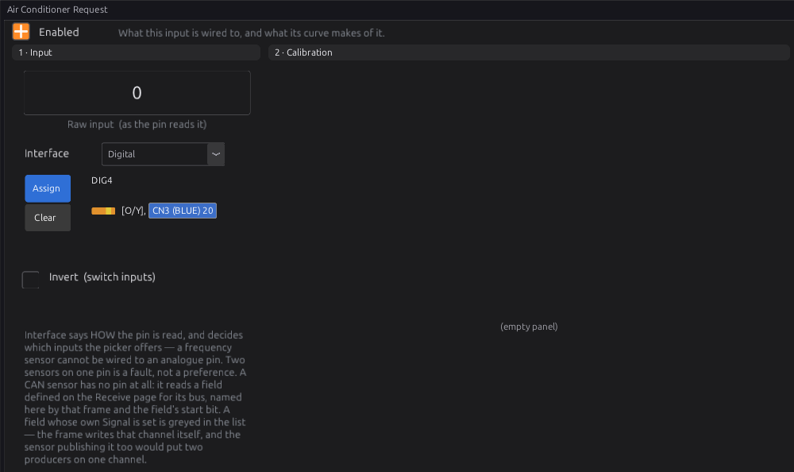
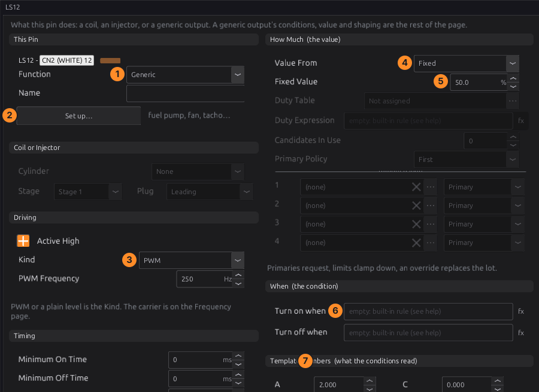
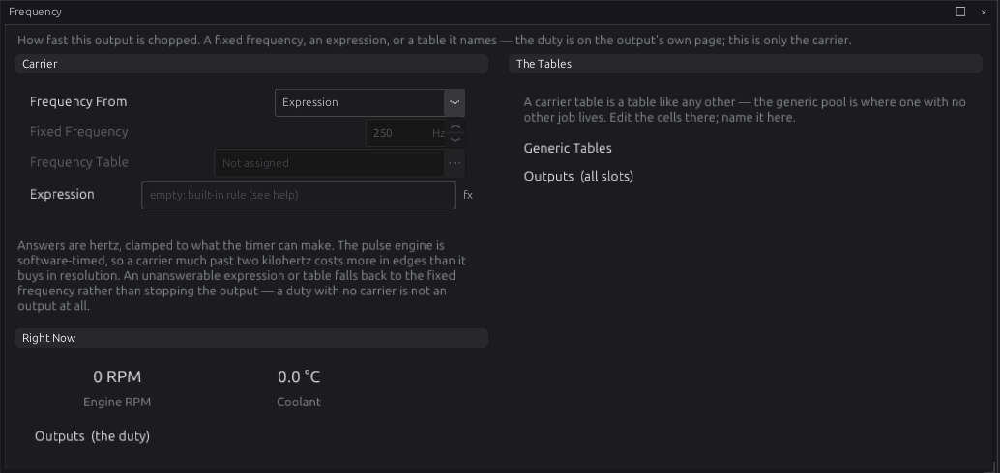
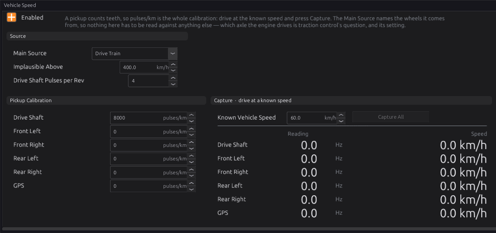
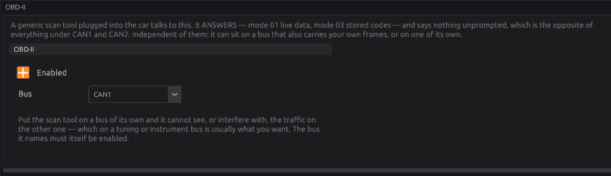
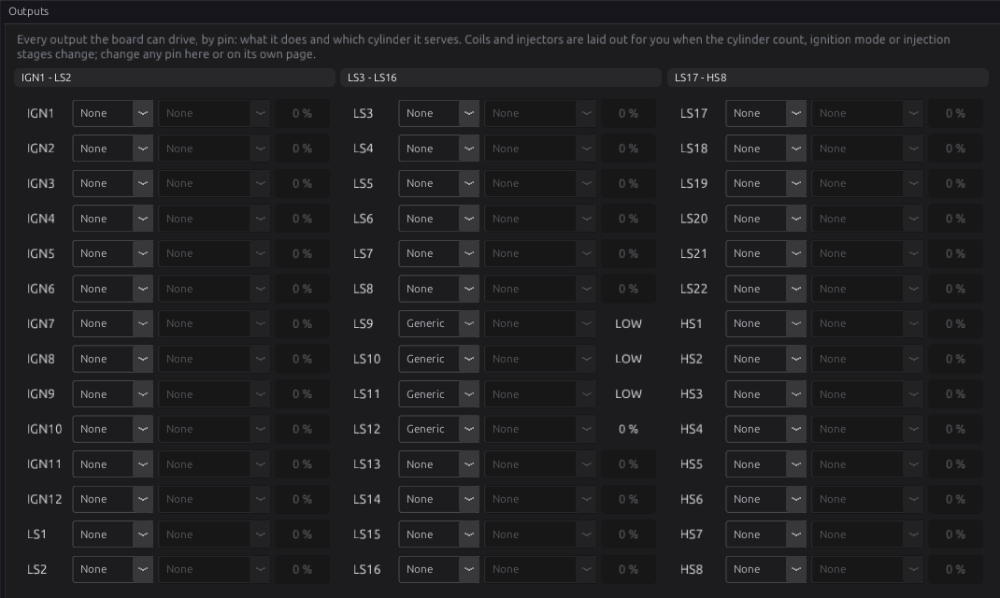

# Vehicle integration

:material-circle:{ .level-basic } Basic → :material-circle:{ .level-intermediate } Intermediate

> **In one sentence:** how to connect the ECU to the rest of the car — fuel pump, cooling fans, air
> conditioning, tachometer, dash, road speed and the diagnostic port.

## Overview

:material-circle:{ .level-basic } Basic

Beyond fuel and spark, an engine ECU runs the things around the engine: it switches the fuel pump
and fans, drives the tachometer, reads road speed, and answers a scan tool. Each of these is an
ordinary ECU output or input set up for the job, usually from a **template** that fills in the
settings for you. This chapter says how to wire each one and which template to use. Chapter 18 covers
outputs and templates in full.

!!! warning "Relays for heavy loads"
    A fuel pump, a cooling fan or an A/C clutch draws far more current than an ECU output should
    carry. The ECU switches a **relay**, and the relay switches the load (chapter 12).

## Concepts

:material-circle:{ .level-intermediate } Intermediate

### Output templates

Every ECU output pin can be a **Generic** output: on or off (or a PWM duty) by conditions you write.
The **Set up this output…** button on the pin's page applies a template, which writes the conditions, value and
timing for a common job. The ones used in this chapter:
<!-- src: definition/ecu.schema.yaml (output_templates) -->

| Template | Turns on | Settings it asks for |
|---|---|---|
| **Fuel Pump** | for **Prime Time** after power-up (default 3 s), and while trigger teeth are arriving; off **Stop After** the last tooth (default 1500 ms) | Prime Time, Stop After |
| **Thermo Fan** | coolant above **Switch On Above** (default 95 °C); off below **Switch Off Below** (default 90 °C); minimum 5 s on and off | the two temperatures |
| **Thermo Fan with A/C** | as Thermo Fan, or while the A/C is requested | the two temperatures |
| **Variable-Speed Fan** | a PWM fan: on above a temperature, duty from a table | |
| **A/C Compressor Clutch** | while A/C is requested, the engine is running (above the Cranking Threshold) and the throttle is below **Cut Above Throttle** (default 90 %); minimum 5 s on, 10 s off | Cut Above Throttle |
| **Tachometer** | a square wave at rpm ÷ 60 × **Pulses per Rev** (default 2), 50 % duty; off below **Squelch Below** (default 60 rpm) | Pulses per Rev, Squelch Below |
| **Main Relay** | whenever the ECU is awake | |
| **Shift Light** | above an rpm, off a little below it (defaults 6500 / 6300) | the two speeds |

The **Fuel Pump** watches **trigger teeth**, not sync, so the rail is up before the decoder has locked.
The **Thermo Fan** turns **on** if the coolant reading fails, because a fan running for no reason is a
nuisance and a fan that will not run is a head gasket.

## Procedure

:material-circle:{ .level-basic } Basic

### 1 · Fuel pump

1. Wire the pump through a relay. The relay coil goes between a switched +12 V and a **low-side**
   output (LS), or between a **high-side** output (HS) and ground.
2. On that pin's page (**Configuration ▸ Electrical ▸ Outputs**, then the pin), set **Function** to
   **Generic**, press **Set up this output…** and pick **Fuel Pump**.
3. Check at key-on: the pump should run for the Prime Time, then stop until you crank.

### 2 · Cooling fans

1. Each fan through its own relay, on an LS or HS output.
2. **Set up this output…** ▸ **Thermo Fan** (or **Thermo Fan with A/C** if the fan must run with the A/C).
3. Set the on and off temperatures. Keep a gap of a few degrees between them, so the fan does not
   chatter.
4. A second fan: another output with higher temperatures.

### 3 · Air conditioning

1. Wire the A/C **request** (the switch or the climate control's request signal) to a DIG pin, and
   enable **Sensors ▸ Air Conditioning ▸ Air Conditioner Request** on that pin (chapter 17). Tick
   **Invert** if the request pulls to ground.

    <figure markdown>
      { width="700" }
      <figcaption>Figure 14.1 — The A/C request read as a switch on DIG4.</figcaption>
    </figure>

2. Wire the **compressor clutch** through a relay on an output, and apply the **A/C Compressor
   Clutch** template.
3. Idle control can raise the idle when the A/C is on (chapter 21).

### 4 · Tachometer

1. Most tachometers take a **square wave** on their signal wire. Wire it to an **LS** output (a
   tachometer that needs a pulled-up signal usually works from a low-side output pulling its input
   to ground; check the tacho's own documentation) or to an IGN output (every output pin can be a tacho
   output).
   <!-- src: definition/boards/jaytek_v1.board.yaml (TACH_OUTPUT caps on IGN, LS, HS) -->
2. **Set up this output…** ▸ **Tachometer**. **Pulses per Rev** is usually half the cylinder count on a
   four-stroke: 2 for a four, 3 for a six, 4 for an eight.

<figure markdown>
  
  <figcaption>Figure 14.2 — An output set up as a tachometer: PWM with a fixed 50 % duty. The template
  fills the conditions and Template Numbers; the numbers match the list below.</figcaption>
</figure>

1. **Function**: Generic. 2. **Set up this output…** applies the template. 3. **Kind**: PWM. 4–5. **Value From**
Fixed, 50 %. 6. The conditions (the template writes them). 7. **Template Numbers**: A is Pulses per
Rev, B is Squelch Below.

The carrier frequency is on the pin's **Frequency** page, where the template sets it from an expression:

<figure markdown>
  
  <figcaption>Figure 14.3 — The tacho's frequency comes from an expression that follows engine speed.</figcaption>
</figure>

### 5 · Dash and instrument cluster

- An **analogue** cluster needs the tachometer signal above, a coolant gauge signal (usually its own
  sender, not the ECU's sensor), and warning lamps on outputs if you want the ECU to light them.
- A **CAN** dash or logger reads the ECU's data over CAN1: wire it as in chapter 13, and set up the
  frames it expects on the bus's **Transmit** page (chapter 33). The **Haltech CAN Broadcast V2**
  template sends the ECU's data in that published layout, which many dashes can read.

### 6 · Road speed

1. Wire the speed pickup: a Hall sensor to a **DIG** pin, or a two-wire magnetic sensor to a **VR**
   input (chapter 11).
2. Enable the matching sensor under **Sensors ▸ Vehicle Speed** (Drive Shaft Speed, a wheel speed, or
   GPS Speed) with the **Frequency** interface on that pin.
3. Open **Configuration ▸ Vehicle Functions ▸ Vehicle Speed** and enable it.

<figure markdown>
  
  <figcaption>Figure 14.4 — Vehicle Speed with a drive-shaft pickup calibrated at 8000 pulses/km.</figcaption>
</figure>

4. **Main Source**: where the road speed comes from (Drive Train, one wheel, an axle, all wheels, or
   GPS).
5. **Calibration** (pulses/km) for each pickup. Either work it out, or drive at a known speed, measured
   by a GPS rather than the car's own speedometer, and press **Capture**.
6. **Implausible Above** (default 400 km/h): a reading above it is dropped as noise.
   <!-- src: definition/ecu.schema.yaml -->

Working it out: a drive-shaft pickup with 4 pulses per shaft turn, a 3.9:1 final drive, and a tyre
that travels 1.95 m per turn gives 1000 ÷ 1.95 × 3.9 × 4 = **8000 pulses/km**.

Chapter 32 covers vehicle speed, gear detection and the rest of the vehicle functions.

### 7 · The OBD-II port

The ECU answers a generic scan tool over OBD-II on CAN (11-bit, requests on 0x7DF, replies from
0x7E8):
<!-- src: firmware/Can/ObdResponder.cpp -->

- **Mode 01** live data: engine load (the VE value), coolant temperature, MAP, engine speed, road
  speed, intake air temperature, throttle position, commanded lambda and ambient temperature (the
  intake air temperature again).
- **Mode 03** reads the stored trouble codes; **Mode 04** clears them.
- **Mode 09**: calibration ID, CVN and the ECU's name. The VIN is a placeholder.

Open **Configuration ▸ CAN Bus ▸ OBD-II**:

<figure markdown>
  
  <figcaption>Figure 14.5 — OBD-II answering on CAN1.</figcaption>
</figure>

!!! warning "OBD-II defaults to CAN2"
    **OBD-II Bus** defaults to **CAN2**, so a scan tool can be on a bus of its own. On the jaytek_v1,
    CAN2 is only on a header on the board. If the OBD port is wired to **CAN1** (CN4), set OBD-II Bus
    to **CAN1**. The OBD port's pins 6 (CAN H) and 14 (CAN L) are the standard CAN pins.
    <!-- src: definition/ecu.schema.yaml (obd_enabled default 1, obd_bus default CAN2) -->

## Examples

:material-circle:{ .level-intermediate } Intermediate

!!! example "A street car"
    | Job | Pin | Template |
    |---|---|---|
    | Fuel pump relay | LS9 | Fuel Pump (Prime Time 3 s) |
    | Radiator fan relay | LS10 | Thermo Fan with A/C (on 95 °C, off 90 °C) |
    | A/C clutch relay | LS11 | A/C Compressor Clutch |
    | Tachometer | LS12 | Tachometer (Pulses per Rev 2) |
    | A/C request switch | DIG4 | Air Conditioner Request sensor |
    | Drive shaft speed | DIG3 | Drive Shaft Speed sensor, 8000 pulses/km |
    | OBD-II | CAN1 | OBD-II Bus: CAN1 |

    <figure markdown>
      
      <figcaption>Figure 14.6 — The four outputs on the Outputs page.</figcaption>
    </figure>

## Pitfalls and troubleshooting

:material-circle:{ .level-basic } Basic → :material-circle:{ .level-advanced } Advanced

| Symptom | Likely cause | Check |
|---|---|---|
| Pump does not prime | Output not set up; relay wiring; no 12 V to the relay | The pin page; the relay; the output test (chapter 43) |
| Pump runs all the time | Output inverted; condition wrong | Active High on the pin; the template's conditions |
| Fan chatters on and off | On and off temperatures too close | Widen the gap |
| Tacho reads double or half | Pulses per Rev wrong | Half the cylinder count on a four-stroke |
| Tacho dead | Tacho needs a different signal (pulled-up, or high-voltage) | The tacho's documentation |
| Road speed wrong by a fixed ratio | Calibration wrong | Capture at a GPS-measured speed |
| Scan tool finds nothing | OBD-II on CAN2 while the port is wired to CAN1; bit rate not 500 kbit | OBD-II Bus; CAN1 Bitrate |

## Related

- [Chapter 12 — Wiring outputs](12-wiring-outputs.md) (relays, low-side and high-side)
- [Chapter 13 — CAN bus](13-can-bus.md)
- [Chapter 18 — Outputs and the pin system](../part3/18-outputs.md) (templates in full)
- [Chapter 21 — Idle](../part3/21-idle.md) (idle-up for A/C and fans)
- [Chapter 32 — Vehicle functions](../part3/32-vehicle-functions.md) (road speed, gear)
- [Output templates reference](../reference/output-templates.md)
