# Engine and vehicle basics

:material-circle:{ .level-basic } Basic → :material-circle:{ .level-advanced } Advanced

> **In one sentence:** the Engine settings tell the ECU what kind of engine it is running: how many
> cylinders, how big, which cycle, the order they fire in and how the coils and injectors are
> arranged. The Vehicle settings record which car the tune belongs to.

## What it does

:material-circle:{ .level-basic } Basic

Before the ECU can fire a single spark it has to know some plain facts about the engine. The
**Engine** settings hold them:

- **How many cylinders** there are, and **how big** the engine is.
- **Which cycle** it runs: four-stroke, two-stroke or rotary. This sets how many crank degrees one
  full engine cycle takes.
- **The firing order**: which cylinder fires first, second, third and so on.
- **Where each cylinder's top dead centre (TDC) falls** in the cycle. On most engines the ECU works
  this out for you.
- **How the coils are wired** (distributor, wasted spark or coil-on-plug) and **how the injectors
  are grouped** into injection stages.
- **When the engine counts as running** rather than cranking.
- Two switches that **stop all spark or all fuel**, for fault-finding.
  <!-- src: definition/ecu.schema.yaml -->

Nothing here is optional, and there is no **Enabled** box: every engine has a cylinder count and a
firing order. These are the first settings you fill in on a new installation. A wrong value here does
not give you a slightly wrong tune. It gives you an engine that will not start, or one that fires the
wrong cylinder.
<!-- src: apps/studio-jf/tools/layout/engine_pages.py -->

The **Vehicle** settings are different. They are labels: the car's name, make, model, engine, VIN
and notes. Nothing in the firmware reads them. They travel with the tune so that a saved tune file
says which car it belongs to.
<!-- src: definition/ecu.schema.yaml (Vehicle help: "Documentation only — nothing in the firmware reads any of these fields") -->

!!! warning "A new tune has no firing order"
    In a new tune every firing-order slot is empty (0). The ECU will not fire any coil or injector
    until you enter a valid firing order. It raises **P1651** instead. Setting the firing order is
    part of every installation, not an optional extra.
    <!-- src: generated/default_config.cpp (firing_order all 0); firmware/Scheduler/EventScheduler.cpp (firing_order_valid); firmware/Scheduler/EnginePositionHal.cpp (firing gate) -->

## How it works

:material-circle:{ .level-intermediate } Intermediate

<figure markdown>
  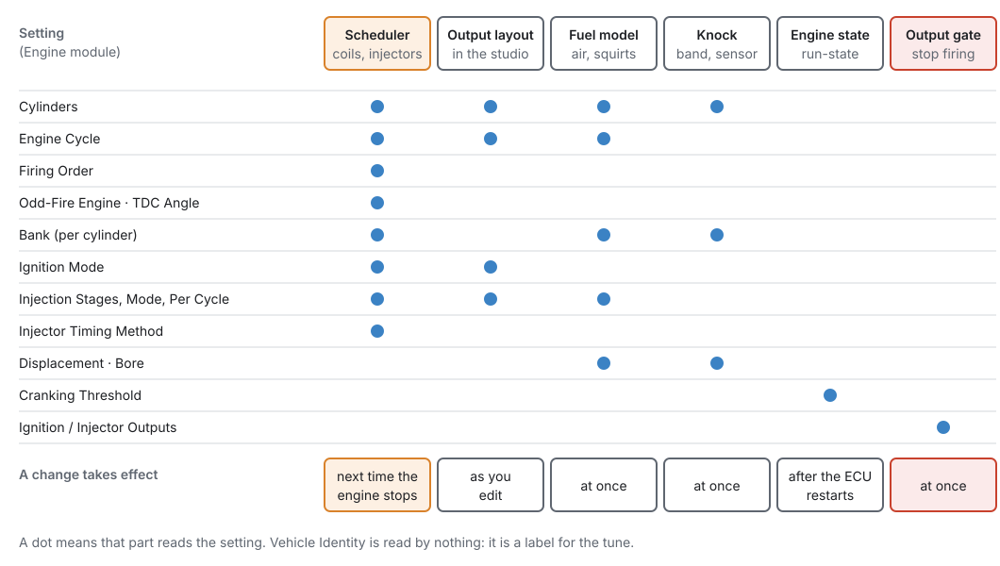
  <figcaption>Figure 15.1 — Who reads each Engine setting, and when a change reaches it. The
  scheduler (orange) only takes a change when the engine stops. The fuel model, knock and the output
  gate take it at once. The Cranking Threshold waits for the ECU to restart.</figcaption>
</figure>

### 1 · The engine cycle

Every angle in the tune, from spark advance to injection timing, is measured inside one **engine
cycle**. **Engine Cycle** `engine.cycle_type` sets how long that cycle is:

| Engine Cycle | Cycle length | Crank revolutions per cycle |
|---|---|---|
| Two-Stroke (360°) | 360° | 1 |
| Four-Stroke (720°) | 720° | 2 |
| Rotary (1080°) | 1080° | 3 |

<!-- src: firmware/Scheduler/SchedulerTypes.h (engine_cycle_angle) -->

The cycle length is also used by the trigger decoder. It sets the default repeat rate of a
crank-mounted trigger pattern, so changing the cycle changes how the trigger is decoded as well as
when things fire (chapter 16).
<!-- src: definition/ecu.schema.yaml (cycle_type help) -->

### 2 · Firing order and TDC angles

The **Firing Order** is a list of cylinder numbers, one per **firing position**. The first entry is
the cylinder that fires first, the second entry fires second, and so on. A six-cylinder with firing
order 1-5-3-6-2-4 stores 1, 5, 3, 6, 2, 4. Only the first **Cylinders** entries are read. The
slots after them should be 0.
<!-- src: definition/ecu.schema.yaml -->

The ECU checks the order every time it applies it. It must name every cylinder from 1 to the
cylinder count **exactly once**. A cylinder listed twice, a cylinder missing, or a number larger than
the cylinder count all make the order invalid. With an invalid order the ECU **will not fire at
all**: a duplicate would fire one cylinder twice and leave another dead, so it refuses both.
<!-- src: firmware/Scheduler/EventScheduler.cpp (firing_order_valid); firmware/Scheduler/EnginePositionHal.cpp -->

From the order, each cylinder gets a **TDC Angle**: where in the cycle that cylinder reaches top dead
centre on its compression stroke, measured from the reference the trigger defines.

- **Even-fire engines** (**Odd-Fire Engine** off, the default): the ECU **computes** every TDC angle
  for you. Cylinders fire evenly, so the cylinder in firing position *i* (counting from 0) gets
  *i* × cycle ÷ cylinders. On a four-stroke four-cylinder that is 0°, 180°, 360° and 540°. The ECU
  writes the results back into the tune, and the studio reads them back after the engine stops.
- **Odd-fire engines** (**Odd-Fire Engine** on): the gaps between firings are not equal, so the ECU
  does not compute anything. You type each cylinder's TDC angle yourself, and the ECU uses exactly
  what you typed.
  <!-- src: firmware/Scheduler/EventScheduler.cpp (update_cylinder_angles); firmware/Scheduler/EnginePositionHal.cpp; definition/ecu.schema.yaml -->

<figure markdown>
  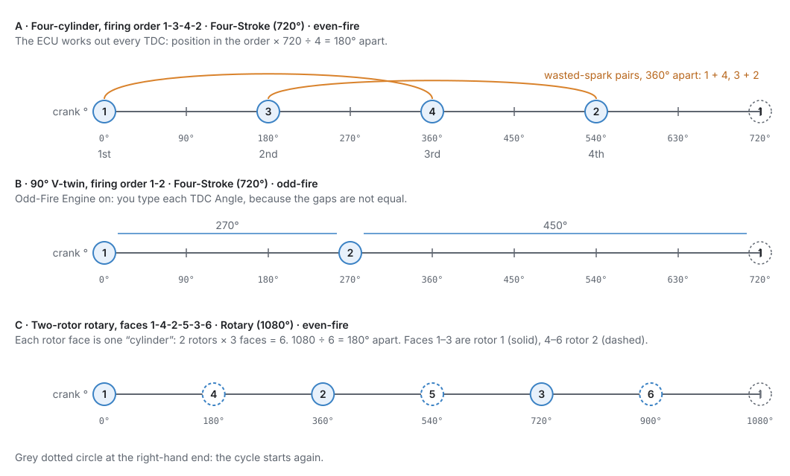
  <figcaption>Figure 15.2 — Where each cylinder's TDC falls in the cycle. A: even-fire, computed by
  the ECU. The orange arcs are the wasted-spark pairs. B: odd-fire, typed by you. C: a rotary, where
  each rotor face counts as a cylinder.</figcaption>
</figure>

!!! info "Advanced — rounding on odd cylinder counts"
    The ECU stores angles in tenths of a degree and divides the cycle by the cylinder count in whole
    tenths. On counts that do not divide 7200 evenly (7 or 11 cylinders on a four-stroke) the
    computed angles are rounded down to the nearest 0.1°.
    <!-- src: firmware/Scheduler/EventScheduler.cpp (interval = cyc / n, integer decidegrees) -->

### 3 · Banks

Each cylinder has a **Bank**, 1 or 2. On an inline engine every cylinder stays on bank 1. On a V
engine or a flat engine, put the cylinders of each exhaust side on their own bank. The bank is read by:

- the **Bank** injection mode, which fires each bank's injectors as one group;
- closed-loop lambda, whose per-bank corrections reach each cylinder through its bank (chapter 23);
- knock, whose **Auto** sensor choice picks the sensor by bank (chapter 30);
- output rows set to **Bank 1** or **Bank 2** (chapter 18).
  <!-- src: definition/ecu.schema.yaml; firmware/Scheduler/EventScheduler.cpp; firmware/Engine/Modules/FuelCalculator.cpp; firmware/Engine/Modules/Knock.cpp; firmware/Scheduler/OutputMap.h -->

### 4 · Coils: Ignition Mode

**Ignition Mode** `engine.ign_mode` says how the coils are wired:

- **Single Coil (distributor):** one coil serves every cylinder.
- **Wasted Spark:** each coil output is assigned to one cylinder and also fires that cylinder's
  **companion**, the cylinder whose TDC is exactly half a cycle away. The ECU finds the companion from
  the firing order each time it applies the settings, so changing the firing order re-pairs the coils
  without moving any output. Wasted spark needs only crank sync.
- **Coil-on-Plug:** one coil per cylinder. It needs cam **phase** sync to fire sequentially. Until
  the cam has been seen it fires companion pairs together.
  <!-- src: definition/ecu.schema.yaml; firmware/Scheduler/EventScheduler.cpp; firmware/Scheduler/SchedulerTypes.h -->

When you change Ignition Mode, Cylinders or Engine Cycle, **the studio lays the coil outputs out
again** in the standard pattern: coil-on-plug IGN*n* = cylinder *n*; wasted spark one coil per pair,
named by the lower cylinder of the pair; distributor IGN1 = all cylinders. You can then change any
single output by hand on its own page (chapter 18). The firmware does not assign outputs. It fires
exactly what the output rows say, and a cylinder with no coil gets no spark (P1653).
<!-- src: apps/studio-jf/src/model/EngineOutputLayout.h, EngineOutputLayout.cpp; firmware/Engine/EngineTask.cpp -->

### 5 · Injectors: injection stages

The injectors are organised in **injection stages**, up to four. A stage is a set of injectors that
share one tune. Stage 1 is the primary. A second stage is a staged secondary set, and stages 3 and 4
are further sets. **Number of Injection Stages** `engine.num_inj_stages` says how many are active.
The settings of higher stages are kept but not used.
<!-- src: definition/ecu.schema.yaml -->

Each stage has its own row on the **Fuel System** page:

- **Injection Mode**: how this stage fires its injectors.
    - **Sequential:** each injector once per cycle, timed to its own cylinder. It needs cam phase
      sync, and it is the only mode that can apply per-cylinder fuel trims. Until the cam has been
      seen, it fires every revolution with half the fuel each time.
    - **Semi-Sequential:** each injector twice per four-stroke cycle, once per crank revolution. It
      needs crank sync only.
    - **Multi-Point:** every injector of the stage at once, **Injections Per Cycle** times per cycle.
      Only overall corrections apply.
    - **Bank:** the injectors grouped by cylinder bank, each bank fired together, **Injections Per
      Cycle** times per cycle. Per-bank corrections apply.
    - **Sequential-Any-Sync:** once per cycle at *a* cylinder's TDC, not necessarily its own. Works
      in any sync state.
- **Injections Per Cycle**: how many times each injector fires per cycle. Only Multi-Point and Bank
  read it. The fuel for the cycle is split across the squirts, so raising it gives more, smaller
  squirts, not more fuel.
- **# of Injector Outputs**: how many injectors a Bank or Multi-Point stage has. Only the studio reads
  this, to lay out that many injector outputs. Per-cylinder modes always get one injector per
  cylinder.
  <!-- src: definition/ecu.schema.yaml; firmware/Scheduler/SchedulerTypes.h (injection_events_per_cycle, injection_deliveries_per_cycle) -->

**Injector Timing Method** `engine.injector_timing_method` says what the injection angle in the fuel
tables means. With **End of Injection** (the default) the angle is where the squirt **ends**: the ECU
opens the injector one pulse-width earlier, so the fuel always finishes at the same point however long
the pulse is. With **Start of Injection** the angle is where it **opens**.
<!-- src: definition/ecu.schema.yaml; firmware/Scheduler/EventScheduler.h -->

Injector flow, dead time and the fuel tables themselves are not Engine settings. They belong to
the fuel chapter (chapter 19).

### 6 · Size: displacement and bore

**Displacement** `engine.displacement` is the total swept volume in cc. The fuel model uses it to work
out the air each cylinder takes in: displacement ÷ cylinders on a piston engine. On a rotary it divides
by the number of **rotors**, because a rotary's quoted capacity counts one chamber per rotor. A
1308 cc two-rotor is 654 cc per chamber.
<!-- src: firmware/Engine/Modules/FuelCalculator.cpp -->

**Bore** `engine.bore_mm` is used for one thing: the knock filter. When **Knock Frequency** is 0, the
knock band centre is worked out from the bore: 900 ÷ (π × bore ÷ 2) kHz, about 6.7 kHz for an 86 mm
bore. A bore of 10 mm or less counts as "not entered", and the band then sits at 7 kHz (chapter 30).
<!-- src: firmware/main.cpp -->

### 7 · The run state

The ECU keeps a **run state**: STOPPED, CRANKING or RUNNING. It is published as **Engine State**
`engine_state`, and many other modules act on it. Cranking fuel, flood clear and cranking advance only
apply while CRANKING. Entering RUNNING starts the after-start timers.
<!-- src: firmware/Engine/EngineStateMachine.h; firmware/Engine/EngineTask.cpp; firmware/Engine/Modules/FuelCalculator.cpp; firmware/Engine/Modules/Ignition.cpp -->

<figure markdown>
  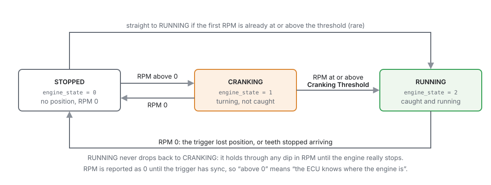
  <figcaption>Figure 15.3 — The run state. The only setting in it is Cranking Threshold. Once
  RUNNING, the engine stays RUNNING through any dip in RPM until it really stops.</figcaption>
</figure>

- **STOPPED:** the ECU has no engine position and RPM is 0. RPM stays 0 until the trigger has sync.
- **CRANKING:** RPM is above 0 but below **Cranking Threshold** `engine.cranking_rpm` (default 400).
- **RUNNING:** RPM has reached the Cranking Threshold. The state then holds RUNNING however low RPM
  dips, until RPM reaches 0 because the trigger has lost position or the teeth have stopped.

There is no "stall RPM" setting. The trigger's own watchdog decides when teeth have stopped arriving.
<!-- src: firmware/Engine/EngineStateMachine.h; definition/ecu.schema.yaml -->

### 8 · When a change takes effect

Different parts of the ECU read these settings at different times (Figure 15.1):

- **The scheduler** (firing order, TDC angles, cylinder count, cycle, ignition mode, injection
  stages and modes, injector timing) keeps its own copy. A change reaches it **the next time the engine
  is STOPPED**. Changing how many cylinders a spinning engine has cannot be done safely, so the ECU
  waits. At that moment it also recomputes even-fire TDC angles and checks the firing order again.
- **The fuel model and knock** read Cylinders, Engine Cycle, Displacement, Bore, the stage count and
  modes **straight away**.
- **Ignition Outputs and Injector Outputs** act **straight away**.
- **Cranking Threshold** is read once, when the ECU starts. **Burn** it, then use **Reset ECU** (or
  switch the ignition off and on) for a change to take effect. A reset throws away changes you have not
  burned.
  <!-- src: firmware/main.cpp; firmware/Comms/CommsManager.cpp; generated/shadow_meta.h; firmware/Engine/Modules/FuelCalculator.h; firmware/Engine/EngineTask.cpp; firmware/Engine/SystemComposer.cpp; apps/studio-jf/main.cpp -->

!!! warning "Change the engine's shape with the engine stopped"
    If you change **Cylinders** or **Engine Cycle** while the engine runs, the fuel model uses the new
    value at once but the scheduler keeps the old one until the engine stops. For that time the fuel
    is worked out for one engine and delivered to another. The studio only lets you edit the firing
    order table with the engine stopped (or offline). Treat every setting on these pages the same way.
    <!-- src: apps/studio-jf/tools/layout/engine_pages.py (ORDER_EDITABLE); firmware/Engine/Modules/FuelCalculator.cpp; firmware/main.cpp -->

### 9 · The output gateways

**Ignition Outputs** `engine.ign_enable` and **Injector Outputs** `engine.inj_enable` are two switches
that stop the engine firing, on purpose. Set **Ignition Outputs** to *Off* and no coil fires. Set
**Injector Outputs** to *Off* and no injector opens. They use the same cut path as the rev limiter and
the other cuts, so nothing can fire while they are off.
<!-- src: definition/ecu.schema.yaml; firmware/Engine/EngineTask.cpp -->

Use them to split a no-start problem in half: crank with no fuel to check for spark, or with no
spark to check fuel delivery and to clear a flooded engine. Injector Outputs off also lets you build
oil pressure on a fresh engine.

!!! danger "These switches survive a reset"
    Burn either switch *Off* and it stays off after the ignition is switched off and on. That is
    deliberate, so you can leave a job half done. It also means an engine that cranks and will not
    start may simply have one of these switched off. The Ignition System and Fuel System pages print
    a warning line while a switch is off. Check them first.
    <!-- src: definition/ecu.schema.yaml; apps/studio-jf/tools/layout/engine_pages.py -->

## Before you start

:material-circle:{ .level-basic } Basic

You need:

- **The engine's data**: cylinder count, displacement, bore, and the firing order with the
  manufacturer's cylinder numbering. Get the numbering from the workshop manual. Firing orders are
  quoted against a numbering scheme, and the same engine family can number its cylinders differently
  from one maker to the next.
- **For a V or flat engine**, which cylinders are on which exhaust side, for the Bank column.
- **For an odd-fire engine**, the crank angle of each cylinder's TDC from the engine's data.
- **The studio connected to the ECU** (chapter 5), or a tune open offline. You can fill in every
  setting offline. The computed TDC angles then only appear after you connect.

Do this chapter **before** the trigger (chapter 16): the trigger decoder uses the engine cycle, and
every TDC angle is measured from the reference the trigger defines. Outputs (chapter 18) come after
this chapter, because the studio lays the coil and injector outputs out from these settings.

## Setting it up

:material-circle:{ .level-basic } Basic → :material-circle:{ .level-intermediate } Intermediate

The pages are under **Configuration ▸ Engine Configuration**. The branch page itself summarises the
engine and links to everything below it, in the order a new installation works through them.

<figure markdown>
  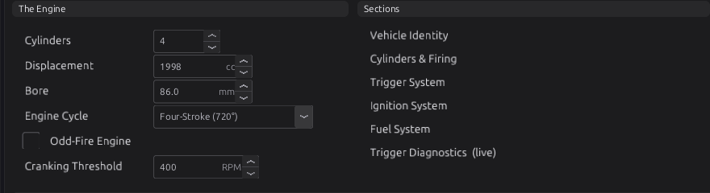
  <figcaption>Figure 15.4 — Configuration ▸ Engine Configuration, set up as Example 1. The Engine
  panel is the same set of fields as on Cylinders & Firing. Sections links to each page below.</figcaption>
</figure>

Below these panels the page shows **Right Now**: RPM, crank angle, run time, trigger errors and lamps
for STOPPED, CRANKING, RUNNING, CRANK SYNC, PHASE SYNC and TRIG ERROR. Then comes **A New
Installation, In Order**, the five steps of this and the next chapters as links.
<!-- src: apps/studio-jf/tools/layout/engine_pages.py -->

### Step 1 — Vehicle Identity

Open **Engine Configuration ▸ Vehicle Identity** and fill in **Name**, **Make**, **Model**,
**Engine**, **VIN** and **Notes**. Each is a short text field of up to 32 bytes. Name, Make, Model and
Engine also appear in the **This Car** panel of the branch page.
<!-- src: definition/ecu.schema.yaml (length: 32); apps/studio-jf/tools/layout/engine_pages.py -->

<figure markdown>
  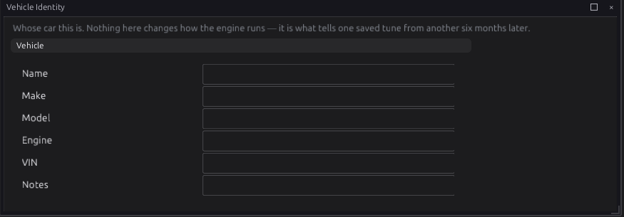
  <figcaption>Figure 15.5 — Vehicle Identity, empty as in a new tune. Nothing here changes how the
  engine runs.</figcaption>
</figure>

!!! tip "Use Notes"
    **Notes** is the place for what a future reader would otherwise have to guess: what was changed
    last, what is known to be marginal, what was never tested.

### Step 2 — Cylinders & Firing

Open **Engine Configuration ▸ Cylinders & Firing**.

<figure markdown>
  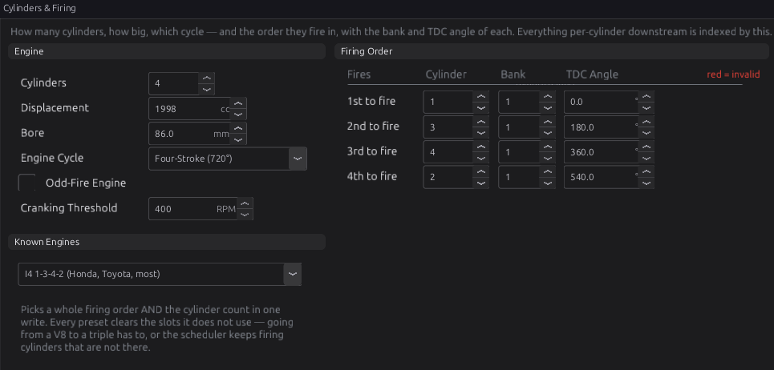
  <figcaption>Figure 15.6 — Cylinders & Firing, set up as Example 1. The Firing Order table has one
  row per firing position: which cylinder fires there, its bank and its TDC angle.</figcaption>
</figure>

1. **Cylinders** `engine.cylinder_count`: the number of cylinders, 1 to 12 (default 4). On a rotary,
   enter **three per rotor** (see Example 4). The Firing Order table shows one row per cylinder.
2. **Displacement** `engine.displacement`: total swept volume in cc (default 2000).
3. **Bore** `engine.bore_mm`: in mm (default 0, not entered). Only the knock filter uses it.
4. **Engine Cycle** `engine.cycle_type`: *Four-Stroke (720°)* (default), *Two-Stroke (360°)* or
   *Rotary (1080°)*.
5. **Odd-Fire Engine** `engine.odd_fire`: leave it off unless your engine fires at uneven intervals.
6. **Cranking Threshold** `engine.cranking_rpm`: the RPM at which the engine counts as running,
   100 to 2000 RPM (default 400). See *Tuning it*.
7. **Firing order.** The quick way is **Known Engines**: pick your engine's firing order from the
   list. It writes the whole order *and* the cylinder count in one go, and clears every slot the
   engine does not use. It holds 17 common orders from twins to V12s. To enter an order by hand,
   type the cylinder number into the **Cylinder** column of each row, first to fire at the top.
8. **Bank**: for each row, 1 or 2. Leave every row on 1 for an inline engine.
9. **TDC Angle**: on an even-fire engine, leave it alone. The ECU computes it. On an odd-fire
   engine, type each cylinder's TDC angle in crank degrees from 0.
10. **Burn** the changes.
    <!-- src: apps/studio-jf/tools/layout/engine_pages.py; definition/ecu.schema.yaml -->

The **Bank** and **TDC Angle** in each row belong to the **cylinder** in that row, not to the
position. If you change the order, each cylinder keeps its bank and TDC angle and moves with it.
<!-- src: apps/studio-jf/tools/layout/engine_pages.py -->

The **Right Now** panel shows **SYNC** / **NO SYNC** and **ORDER OK** / **ORDER BAD**. While the
order is invalid, ORDER BAD lights and the Cylinder cells of the order turn red. Both come from the
ECU (the `firing_order_fault` channel), so they only work while you are connected. ORDER BAD responds
as you type, even with the engine running. The ECU applies the new order, and raises or clears P1651,
only at the next stop.
<!-- src: apps/studio-jf/tools/layout/engine_pages.py; firmware/Engine/EngineTask.cpp -->

!!! note "The TDC column updates after the engine stops"
    On an even-fire engine the TDC angles you see are the ones the ECU last computed. After you
    change the order or the cylinder count, the ECU recomputes them the next time the engine is
    stopped. The studio then reads them back. Offline, the column keeps whatever the tune holds.
    <!-- src: firmware/Comms/CommsManager.cpp; firmware/Scheduler/EnginePositionHal.cpp; apps/studio-jf/src/model/Cache.cpp -->

!!! warning "Changing Cylinders by hand does not change the order"
    Only the Known Engines list writes the order and the count together. If you type a new
    **Cylinders** value, the order keeps its old entries. Going from 4 to 6 leaves positions 5 and 6
    at 0, which is an invalid order. Going from 6 to 4 leaves cylinders 5 and 6 out of the first four
    positions, which is also invalid. Check ORDER OK after every change.

### Step 3 — Ignition System (the coil settings)

Open **Engine Configuration ▸ Ignition System**. The **Spark Hardware** panel holds the two Engine
settings for coils. The rest of the page (advance limits, fixed timing) is covered in chapter 20.

<figure markdown>
  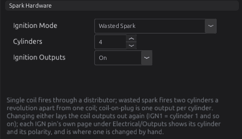
  <figcaption>Figure 15.7 — Spark Hardware on Ignition System. Cylinders is the same setting as on
  Cylinders & Firing, shown here again for convenience.</figcaption>
</figure>

1. **Ignition Mode** `engine.ign_mode`: *Single Coil (distributor)*, *Wasted Spark* (default) or
   *Coil-on-Plug*, to match how your coils are wired.
2. **Ignition Outputs** `engine.ign_enable`: leave it *On* (default).
   <!-- src: apps/studio-jf/tools/layout/engine_pages.py -->

Changing Ignition Mode lays the coil outputs out again. Check the result on the IGN output pages
(chapter 18).

### Step 4 — Fuel System (the injector arrangement)

Open **Engine Configuration ▸ Fuel System**.

<figure markdown>
  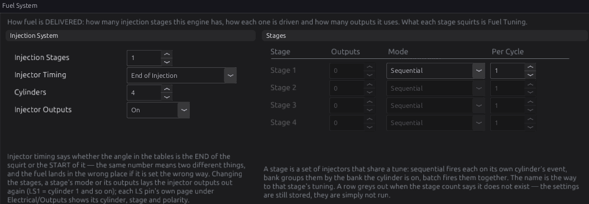
  <figcaption>Figure 15.8 — Fuel System with one sequential stage. Rows for stages the Injection
  Stages count does not include are greyed: their settings are kept but not used.</figcaption>
</figure>

1. **Injection Stages** `engine.num_inj_stages`: 1 to 4 (default 1).
2. **Injector Timing** `engine.injector_timing_method`: *End of Injection* (default) or *Start of
   Injection*. Set this **before** you tune the injection angle table, because the same angle means two
   different things.
3. **Injector Outputs** `engine.inj_enable`: leave it *On* (default).
4. In **Stages**, for each active stage, choose the **Mode**, and for Bank or Multi-Point also
   **Outputs** (the injector count) and **Per Cycle** (injections per cycle). Each stage name links to
   that stage's tuning pages.
   <!-- src: apps/studio-jf/tools/layout/engine_pages.py; definition/ecu.schema.yaml -->

Changing the stage count, a stage's mode or its outputs lays the injector outputs out again: a
block of LS outputs per stage from LS1. A pin already used as a generic output (a fan, say) is never
taken. The injector moves to the next free pin instead.
<!-- src: apps/studio-jf/src/model/EngineOutputLayout.h -->

## Worked examples

:material-circle:{ .level-intermediate } Intermediate

!!! example "Example 1 — 2.0 L inline four, wasted spark, sequential injection"
    A common four-cylinder with a crank wheel and a cam sensor.

    | Setting | Value | Why |
    |---|---|---|
    | Cylinders | 4 | |
    | Displacement | 1998 cc | from the engine's data |
    | Bore | 86.0 mm | gives a knock band near 6.7 kHz |
    | Engine Cycle | Four-Stroke (720°) | |
    | Odd-Fire Engine | off | a four fires every 180° |
    | Firing order | 1-3-4-2 (Known Engines: *I4 1-3-4-2*) | |
    | Bank | 1 on every row | inline engine |
    | Ignition Mode | Wasted Spark | two coil packs, one per pair |
    | Injection Stages / Mode | 1 / Sequential | one injector per cylinder, cam sensor fitted |
    | Injector Timing | End of Injection | the default |

    The ECU computes TDC angles 0°, 180°, 360° and 540° for cylinders 1, 3, 4 and 2 (Figure 15.6).
    Wasted spark pairs cylinders 1 with 4 and 3 with 2, the cylinders 360° apart (Figure 15.2 A).

!!! example "Example 2 — 5.7 L GM LS V8, coil-on-plug, two banks"
    | Setting | Value | Why |
    |---|---|---|
    | Cylinders | 8 | |
    | Displacement | 5665 cc | |
    | Bore | 99.0 mm | |
    | Engine Cycle | Four-Stroke (720°) | |
    | Firing order | 1-8-7-2-6-5-4-3 (Known Engines: *V8 1-8-7-2-6-5-4-3 (GM LS)*) | |
    | Bank | 1 for cylinders 1, 3, 5, 7; 2 for 2, 4, 6, 8 | the engine's odd cylinders share one exhaust side |
    | Ignition Mode | Coil-on-Plug | one coil per cylinder |
    | Injection Stages / Mode | 1 / Sequential | |

    TDC angles come out 90° apart, in firing order. With the banks set, closed-loop lambda can
    correct each bank separately once a second wideband is fitted (chapter 23).

<figure markdown>
  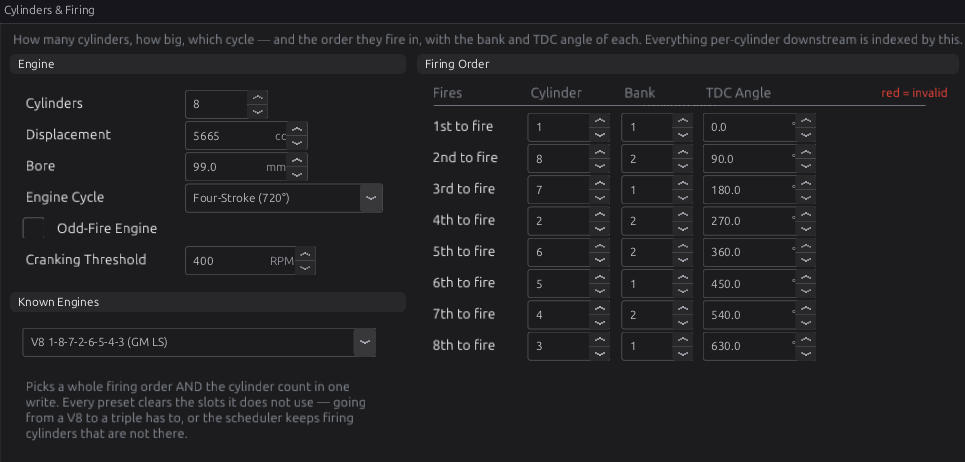
  <figcaption>Figure 15.9 — Example 2. The Bank column follows the cylinder, not the position, so the
  banks alternate down the firing order.</figcaption>
</figure>

!!! example "Example 3 — 90° V-twin, odd-fire"
    A twin that fires 270° and then 450° apart.

    | Setting | Value | Why |
    |---|---|---|
    | Cylinders | 2 | |
    | Engine Cycle | Four-Stroke (720°) | |
    | Odd-Fire Engine | on | the gaps are not equal |
    | Firing order | 1-2 | |
    | TDC Angle | cylinder 1: 0°, cylinder 2: 270° | typed by hand |
    | Ignition Mode | Coil-on-Plug | one coil per cylinder |

    Check the angle for your engine: which cylinder follows by 270° and which by 450° depends on
    how the engine numbers its cylinders.

<figure markdown>
  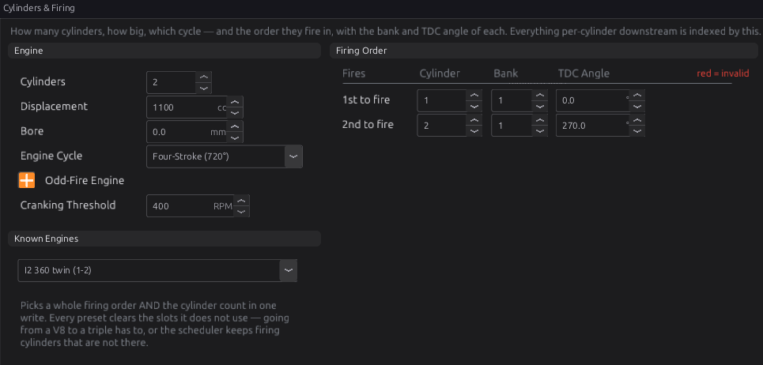
  <figcaption>Figure 15.10 — Example 3. With Odd-Fire Engine ticked, the TDC Angle column holds what
  you type.</figcaption>
</figure>

!!! example "Example 4 — two-rotor rotary"
    On a rotary each **rotor face** counts as one cylinder: three per rotor. A two-rotor engine has
    six. Faces 1 to 3 belong to rotor 1, faces 4 to 6 to rotor 2.

    | Setting | Value | Why |
    |---|---|---|
    | Engine Cycle | Rotary (1080°) | three shaft revolutions per cycle |
    | Cylinders | 6 | 2 rotors × 3 faces |
    | Displacement | 1308 cc | the quoted capacity; the fuel model divides it by the 2 rotors |
    | Bore | 0 | no bore on a rotary; set Knock Frequency directly if you use knock (chapter 30) |
    | Firing order | 1-4-2-5-3-6 | the rotors fire alternately, 180° apart |

    The TDC angles come out 180° apart (Figure 15.2 C). Output rows name the **rotor**, not the
    face. The studio lays out leading coils on IGN1 and IGN2 and trailing coils on IGN5 and IGN6.
    With the 12-cylinder limit, the most rotors you can have is four.
    <!-- src: firmware/Scheduler/SchedulerTypes.h; firmware/Scheduler/OutputMap.h; firmware/Engine/Modules/FuelCalculator.cpp; tests/test_injection_modes.cpp; apps/studio-jf/src/model/EngineOutputLayout.h -->

<figure markdown>
  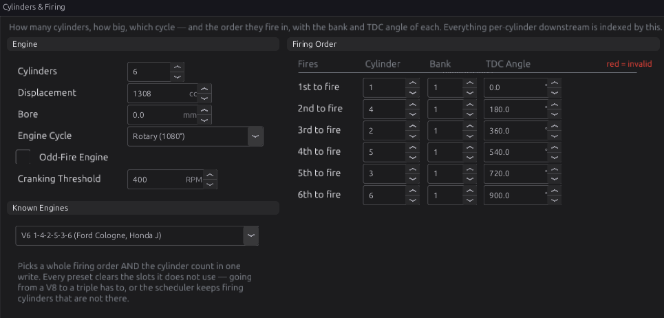
  <figcaption>Figure 15.11 — Example 4. The Known Engines box names a V6 order here because the
  numbers happen to match. It has no rotary entry. Leave it as it is.</figcaption>
</figure>

## Tuning it

:material-circle:{ .level-intermediate } Intermediate → :material-circle:{ .level-advanced } Advanced

There is little to tune here, but three things are worth checking on a running engine.

**Log these channels:** `engine_state`, `rpm`, `sync_level`, `firing_order_fault`, and while
fault-finding `ign_exec_mask` and `inj_exec_mask` (chapter 42).

### Check the firing order

A wrong firing order still passes the ECU's check if it names every cylinder once. The engine then
runs badly or not at all, because sparks and squirts go to cylinders that are not ready for them.
To check what the ECU is actually doing, open **Tools ▸ Engine Cycle** while connected. It draws one
captured cycle against crank angle, one lane per coil and injector. A coil's span is its dwell and its
right-hand edge is the spark (chapter 20).
<!-- src: apps/studio-jf/src/ui/EngineCycleView.h; apps/studio-jf/main.cpp -->

Confirm that TDC for cylinder 1 is where the ECU thinks it is with a timing light and **Fixed Timing**
(chapter 16). Every other cylinder's TDC is measured from that reference.

### Choose the Cranking Threshold

Cranking fuel, flood clear and cranking advance apply only while the state is CRANKING. The switch to
RUNNING starts the after-start enrichment. So the threshold must sit:

- **above** the fastest your starter ever spins the engine, cold battery or warm. If it sits below
  that, the engine counts as running on the starter and loses its cranking fuel;
- **below** the lowest speed at which the engine runs on its own just after it catches.

The default 400 RPM suits most engines. Log `rpm` and `engine_state` through a few starts, hot and
cold. The state should change once, when the engine catches, and never while it is only on the
starter. Remember that a new value only takes effect after you burn it and restart the ECU.
<!-- src: firmware/Engine/Modules/FuelCalculator.cpp; firmware/Engine/Modules/Ignition.cpp; firmware/Engine/EngineStateMachine.h; firmware/Engine/SystemComposer.cpp -->

### Choose the injector timing method first

Decide **End of Injection** or **Start of Injection** before you tune the injection angle table
(chapter 38), and do not change it afterwards. The same table would then place every squirt
somewhere else.

## Diagnostics

:material-circle:{ .level-intermediate } Intermediate

| Code | Meaning | What sets it | What to check |
|---|---|---|---|
| **P1651** | Config: invalid firing order (duplicate or missing cylinder) | The firing order the ECU has applied does not name each cylinder from 1 to Cylinders exactly once. The ECU will not fire while it is set. | The Firing Order table; ORDER OK on Cylinders & Firing; a Cylinders value changed by hand. Clears when a valid order is applied at the next stop. |
| **P1653** | Config: a cylinder in the firing order has no coil output | A cylinder in the order has no IGN output row serving it | The IGN output pages (chapter 18). Change Ignition Mode or Cylinders to have the studio lay the coils out again. |
| **P1654** | Config: a cylinder in the firing order has no stage 1 injector output | A cylinder in the order has no stage 1 injector row | The LS output pages (chapter 18); the Fuel System stages |

All three are raised at severity **level 3** and are judged against the settings the ECU has applied,
not the ones you are typing. What level 3 does is set in Engine Protection (chapter 29). P1653 and
P1654 are not checked while the order itself is invalid.
<!-- src: definition/ecu.schema.yaml; firmware/Engine/EngineTask.cpp -->

**Output channels** worth watching:

| Channel | Label | What it tells you |
|---|---|---|
| `engine_state` | Engine State | 0 STOPPED, 1 CRANKING, 2 RUNNING |
| `firing_order_fault` | Firing Order Invalid | 1 while the order as typed is invalid, even before it is applied |
| `sync_level` | Sync Level | 0 none, 1 crank, 2 phase (chapter 16) |
| `ign_exec_mask` | Ign Execution Mask | 0 while spark is cut, including by Ignition Outputs *Off* |
| `inj_exec_mask` | Inj Execution Mask | 0 while fuel is cut, including by Injector Outputs *Off* |

<!-- src: definition/ecu.schema.yaml; firmware/Engine/EngineTask.cpp -->

<figure markdown>
  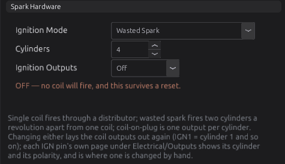
  <figcaption>Figure 15.12 — With Ignition Outputs off, the page says so in orange. Fuel System shows
  the same line for Injector Outputs.</figcaption>
</figure>

## Troubleshooting

:material-circle:{ .level-basic } Basic → :material-circle:{ .level-advanced } Advanced

| Symptom | Likely causes | Check |
|---|---|---|
| Cranks, syncs, no spark and no fuel at all | Firing order empty or invalid (P1651) | ORDER OK on Cylinders & Firing; the DTC list |
| Cranks, no spark, fuel is fine | **Ignition Outputs** off; a cylinder with no coil (P1653) | The orange warning on Ignition System; `ign_exec_mask`; the IGN output pages |
| Cranks, no fuel, spark is fine | **Injector Outputs** off; no stage 1 injector (P1654) | The orange warning on Fuel System; `inj_exec_mask`; the LS output pages |
| Runs, but rough and pops, one or more cylinders dead | Firing order wrong but valid; the engine numbers its cylinders differently from the source you used | The engine's own numbering; **Tools ▸ Engine Cycle** |
| ORDER BAD after changing Cylinders | The order still holds the old count's entries | Pick the order from Known Engines, or fill in every row |
| New firing order or cylinder count seems ignored | The engine has not stopped since the change | Stop the engine; the scheduler applies the change at the next stop |
| TDC Angle column shows old or zero values | Offline, or the engine has not stopped since the change | Connect and stop the engine; the ECU recomputes and the studio reads them back |
| TDC angles typed by hand keep changing back | **Odd-Fire Engine** is off, so the ECU overwrites them | Tick Odd-Fire Engine if the engine really is odd-fire |
| `engine_state` shows RUNNING while the engine is still only on the starter | Cranking Threshold below cranking speed | Log `rpm` while cranking; raise the threshold, burn, reset |
| Changed Cranking Threshold has no effect | It is only read when the ECU starts | Burn, then **Reset ECU** |
| Knock band wrong for the engine | Bore not entered (0 or 10 mm or less) | **Bore**, or set Knock Frequency directly (chapter 30) |
| Rotary fuelling far off, or faces firing in the wrong place | Cylinders set to the rotor count instead of the face count, or Engine Cycle not Rotary | Cylinders = 3 × rotors; Engine Cycle = Rotary; firing order as in Example 4 |

## Settings reference

Every Engine and Vehicle setting, generated from the definition the studio loads. The per-cylinder
tables (**Firing Order**, **Bank**, **TDC Angle**) and the **Injection Stages** rows are explained
in *How it works* and *Setting it up* above.

### Engine

--8<-- "reference/settings/_engine.table.md"

### Vehicle

--8<-- "reference/settings/_vehicle.table.md"

## Related

- [Chapter 5 — First connection](../part1/05-first-connection.md)
- [Chapter 16 — The trigger system](16-trigger.md): the reference every TDC angle is measured from
- [Chapter 18 — Outputs and the pin system](18-outputs.md): the coil and injector outputs these settings lay out
- [Chapter 19 — Fuel](19-fuel.md): injector data and the fuel tables for each stage
- [Chapter 20 — Ignition](20-ignition.md): advance, dwell and fixed timing
- [Chapter 23 — Closed-loop lambda](23-lambda.md): per-bank correction
- [Chapter 29 — Engine protection](29-protection.md): what a level 3 fault does
- [Chapter 30 — Knock](30-knock.md): the knock band and the bore
