# The trigger system

:material-circle:{ .level-basic } Basic → :material-circle:{ .level-advanced } Advanced

> **In one sentence:** the trigger system reads the crank and cam sensors, works out exactly where
> the engine is in its cycle, and refuses to fire anything until it can prove it.

## What it does

:material-circle:{ .level-basic } Basic

Every spark, every injection and every cam target is an **angle**: "fire cylinder 3 at 12° before
its top dead centre". The ECU can only hit that angle if it knows where the crankshaft is, all the
time, to a fraction of a degree. The trigger system is how it knows.

It reads the teeth on a **trigger wheel** (on the crank, the cam, or both) as they pass a sensor. From
the pattern of those teeth it works out:

1. **Where the crank is** within a revolution, and how fast it is turning (engine speed, `rpm`).
2. **Which revolution** of the engine cycle it is in. A four-stroke engine turns twice per cycle, and
   the crank alone cannot tell compression from exhaust. A cam sensor can.
3. **Whether it can trust its answer.** Every tooth has to arrive where the pattern says it should.
   If one does not, the ECU stops firing at once and starts again from scratch.
   <!-- src: firmware/Scheduler/GenericTrigger.h; firmware/Scheduler/GapMatcher.h -->

Every engine needs this chapter. Nothing else in the manual works until the trigger does, and a
wrong trigger setting makes every other setting wrong by the same amount.

!!! danger "A wrong trigger setting fires sparks at the wrong time"
    The ECU checks that the teeth match the pattern you describe. It cannot check that the pattern
    is on the right engine at the right angle. Only a **timing light** proves that (Step 7 below).
    Do not drive the engine, or load it on a dyno, until you have checked base timing with a light.

## How it works

:material-circle:{ .level-intermediate } Intermediate

<figure markdown>
  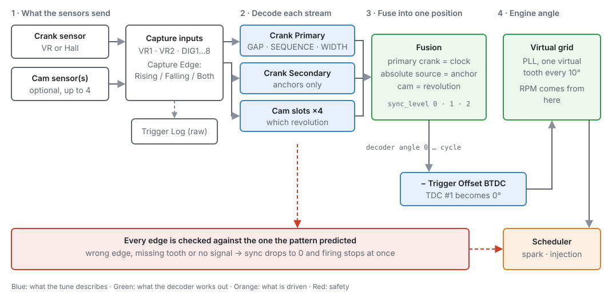
  <figcaption>Figure 16.1 — From sensor to spark. Blue is what your tune describes, green is what the
  decoder works out, orange is what gets driven, red is the safety check on every edge.</figcaption>
</figure>

### 1 · Streams: one sensor, one pattern

A **stream** is one sensor signal and the pattern it is expected to carry. The ECU has six stream
slots, and **the slot is the role**:

| Slot | Role | Default repeats per cycle |
|---|---|---|
| 0 | **Crank Primary** | 2 on a four-stroke (once per revolution) |
| 1 | **Crank Secondary** | 2 on a four-stroke |
| 2 | **Cam Intake B1** | 1 (once per cycle) |
| 3 | **Cam Exhaust B1** | 1 |
| 4 | **Cam Intake B2** | 1 |
| 5 | **Cam Exhaust B2** | 1 |

<!-- src: definition/ecu.schema.yaml (streams, element_labels); firmware/Scheduler/GenericTriggerBuilder.h -->

A stream you do not switch on is not read, not decoded, and holds no input pin. Most engines use
Crank Primary alone, or Crank Primary plus one cam. A V engine with a phaser on each intake uses Cam
Intake B1 and Cam Intake B2 and leaves the exhaust slots off.

**Crank-rate** streams (slots 0 and 1) repeat every crank revolution. **Cam-rate** streams (slots 2
to 5) repeat once per engine cycle, which is 720° on a four-stroke. You can override that with
**Pattern Repeats / Cycle** for a wheel that is neither: a symmetrical crank pattern that appears
twice per revolution is 4, and a distributor on a five-cylinder engine is 5.
<!-- src: definition/ecu.schema.yaml; firmware/Scheduler/GenericTrigger.h -->

### 2 · The decoder for each stream: Gap, Sequence or Width

Each stream uses one of three **primitives**: ways of recognising a place on the wheel.

**Gap** is a wheel of evenly spaced teeth with one or more teeth missing: 60-2, 36-1, 36-2-2-2. You
describe it by the tooth count it would have with nothing missing (**Base Teeth**: 60 for a 60-2),
how many tooth pitches one gap spans (**Gap Ratio**: missing teeth plus one, so 3 for a 60-2), and
where each gap is (the **Pattern Cells**).

<figure markdown>
  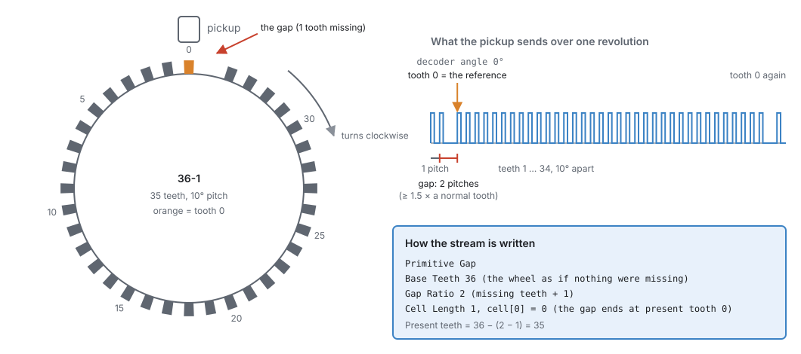
  <figcaption>Figure 16.2 — A 36-1 wheel. Tooth 0, the reference, is the tooth that ends the gap. It is
  the only tooth on the wheel the ECU can identify.</figcaption>
</figure>

A gap is any interval at least **1.5 times** a normal tooth. The ECU does not lock on the first gap
it sees, because the teeth before it may be only part of a turn. It locks when the number of teeth
between gaps matches the wheel you described. On a single-gap wheel that is the second gap, so sync
comes within two revolutions of cranking.
<!-- src: firmware/Scheduler/GapMatcher.h -->

<figure markdown>
  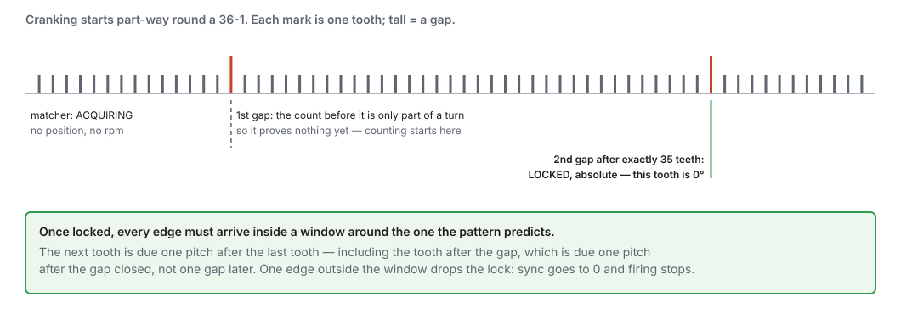
  <figcaption>Figure 16.3 — How a Gap stream locks.</figcaption>
</figure>

A Gap stream with **no gaps** (Cell Length 0) is an even wheel: a distributor, or a crank wheel with
all its teeth. It can count teeth, but it cannot say which tooth is which. It works in one of two ways:

- **With a cam**, the cam anchors it and the engine gets full sync (section 5).
- **On its own, it syncs always**: this is **distributor** mode. With one coil and a rotor, the rotor
  picks the plug, so the ECU never needs to know which tooth is which. Every tooth is a sync tooth, and
  the wheel goes straight to full sync on its first steady tooth, with no Crank step. It needs
  **Ignition Mode** set to **Distributor** (chapter 20), an even-fire engine, every tooth the same
  distance from a TDC (the teeth per engine cycle must divide the cylinder count), and injection that
  does not time each injector to its own cylinder: every stage **Multi-Point** or **Sequential (any
  sync)**. Sequential, Semi-Sequential and Bank are refused, because the ECU cannot know which cylinder
  is which. A 4-cylinder
  distributor (4 teeth per cycle, 2 per crank revolution) qualifies; a 36-tooth even crank wheel does
  not, because its teeth are not all the same distance from a TDC.
  <!-- src: firmware/Scheduler/TriggerConfigCheck.h (even_wheel_sync_always); firmware/Scheduler/GenericTrigger.h (set_sync_always); firmware/Scheduler/GapMatcher.h (set_even_confirms) -->

**Sequence** is an explicit list of the angles between one event and the next, for a pattern no
evenly spaced wheel describes: an odd-fire crank, or a cam with a group of unevenly spaced pulses.
Each **cell** is one step in 0.1° units, and the steps must add up to the stream's period (360° for a
crank-rate stream, 720° for a cam-rate stream). Because the ECU compares the **ratios** of
consecutive intervals, engine speed does not matter. It locks after three ratios in a row match
consecutive places in the pattern. Event 0, the start of cell 0, is the stream's 0°.
<!-- src: firmware/Scheduler/SequenceMatcher.h -->

<figure markdown>
  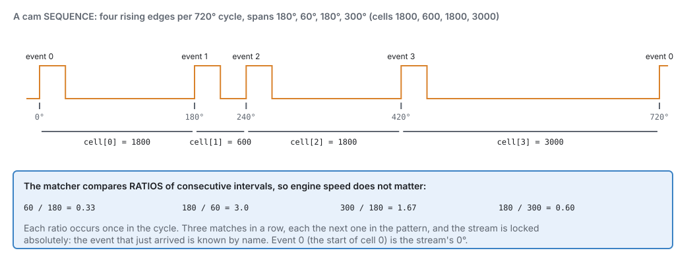
  <figcaption>Figure 16.4 — A Sequence stream. Each ratio occurs once in the cycle, so three matches in
  a row name the event that has just arrived.</figcaption>
</figure>

A sequence whose steps are all equal has no unique point. Like an even Gap wheel, it only locks
relatively.

**Width** picks out one pulse by how long it is, measured in **degrees** (its time multiplied by the
crank's current speed), so one band works at every engine speed. A pulse whose width falls between
**WIDTH min** and **WIDTH max** is the reference, and every other pulse is ignored. **WIDTH target
angle** says where the reference pulse's leading edge sits in the stream's cycle. A cam with a single
pulse uses Width with a band wide enough to accept anything (0 to 720°).
<!-- src: firmware/Scheduler/WidthMatcher.h; firmware/Scheduler/GenericTrigger.h -->

<figure markdown>
  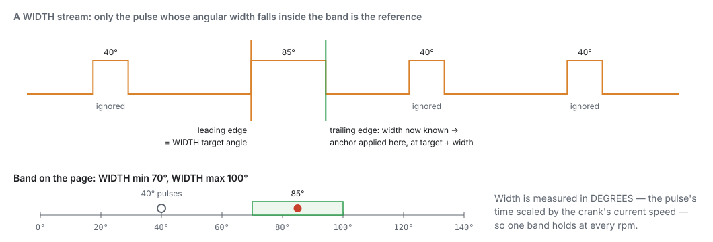
  <figcaption>Figure 16.5 — A Width stream. The width is only known when the pulse ends, so the ECU
  anchors on the trailing edge, at the target angle plus the width.</figcaption>
</figure>

A Width stream always captures **both** edges of the signal, whatever **Capture Edge** says, because
it needs both to measure a width. For Width, Capture Edge only says which edge **starts** the pulse:
**Falling** means the pulse is low-going.
<!-- src: firmware/Platform/AssignmentResolver.cpp; firmware/Scheduler/GenericTriggerBuilder.h -->

### 3 · Proving every tooth: the match window

Once a stream is locked, the ECU predicts when the next edge is due from the interval it just
measured and the pattern. At a gap it expects a gap. The next edge has to land inside a window around
that prediction. **Match Window** sets the window width:

- On a **Gap** stream, it is ± a percentage of **one tooth pitch**. At 50 %, a tooth is accepted
  anywhere from half a pitch to one and a half pitches after the one before. That is the same 1.5×
  that defines a gap.
- On a **Sequence** stream, it is ± a percentage of the predicted interval.
  <!-- src: firmware/Scheduler/GapMatcher.h; firmware/Scheduler/SequenceMatcher.h -->

A starter motor turns an engine unevenly: it slows on every compression stroke and surges over the
top. So there is a second, wider window for cranking. The ECU uses **Match Window (cranking)** at or
below 400 rpm and **Match Window** at or above 1500 rpm, and blends between them in that range. Set
the cranking value to 0 to use the running value everywhere.
<!-- src: firmware/Scheduler/GenericTrigger.h; definition/ecu.schema.yaml -->

<figure markdown>
  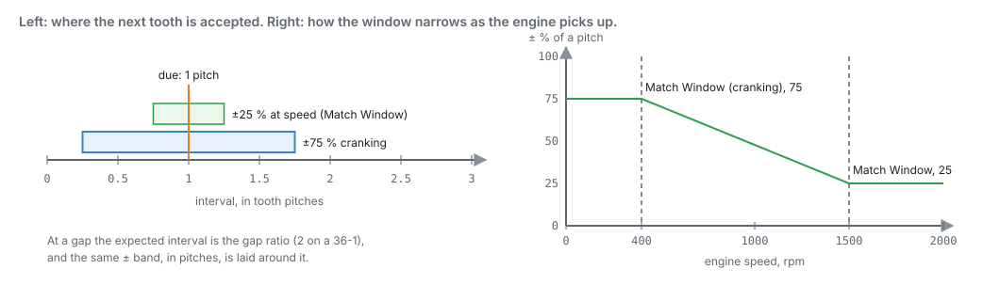
  <figcaption>Figure 16.6 — The match window with the default values (25 % running, 75 % cranking).</figcaption>
</figure>

**An edge outside the window drops sync on the spot.** There is no allowance for a few bad teeth.
An edge too early is **noise** (an extra edge that is not a tooth). An edge too late, or a tooth that
never arrives, is a **missed tooth**. A normal tooth where the gap should be means the wheel is not
the wheel you described. In every case the ECU cannot prove where the engine is, so it stops firing
and looks for the reference again.
<!-- src: firmware/Scheduler/GapMatcher.h; firmware/Scheduler/EnginePositionHal.cpp -->

### 4 · Sync levels

<figure markdown>
  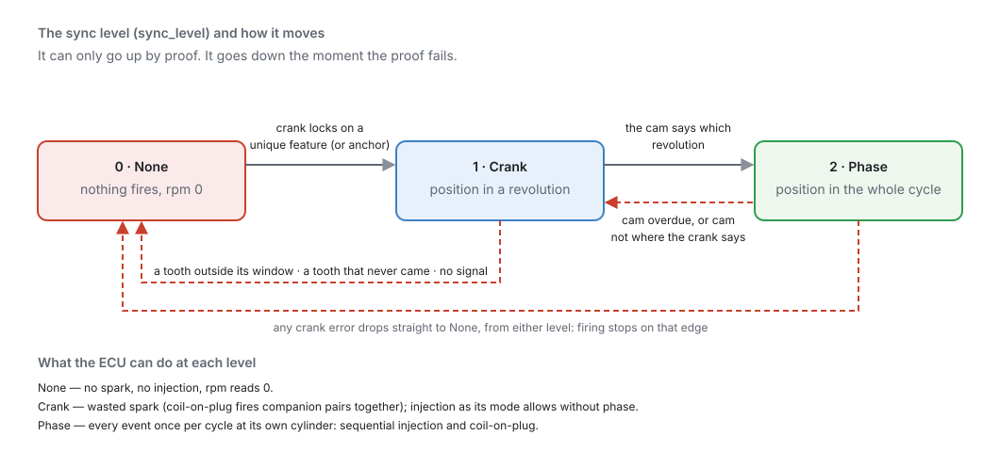
  <figcaption>Figure 16.7 — The sync level (`sync_level`). It goes up only by proof and comes down the
  moment the proof fails.</figcaption>
</figure>

| Sync level | Means | The ECU can |
|---|---|---|
| **0 · None** | Position not known | Nothing. No spark, no injection, `rpm` reads 0. |
| **1 · Crank** | Position within one revolution | Fire each coil once per revolution (wasted spark), and inject in the modes that do not need phase. |
| **2 · Phase** | Position within the whole cycle | Everything: sequential injection and coil-on-plug, each cylinder once per cycle. |

<!-- src: firmware/Scheduler/GenericTrigger.h; firmware/Scheduler/TriggerConfigCheck.h; firmware/Scheduler/EnginePositionHal.cpp:get_rpm_x10 -->

A crank stream reaches **Crank** when it locks on its unique feature. A cam stream then lifts it to
**Phase** by saying which revolution this is. A cam-only sensor (a crank-angle sensor in a
distributor housing) goes straight to Phase, because its pattern already spans the whole cycle.

### 5 · Putting the streams together

The ECU combines the streams like this:
<!-- src: firmware/Scheduler/GenericTrigger.h -->

- **The clock** is the first locked crank-rate stream, normally Crank Primary. Engine speed and fine
  position come from it.
- **An anchor** is any stream that can state its own position: a Gap wheel with a gap, an uneven
  Sequence, or a Width pulse. A crank wheel with a gap anchors itself. An even crank wheel needs a
  cam to anchor it.
- **The revolution** comes from the cam. Each time the cam's reference arrives, it says which
  revolution this is. If the crank has its own anchor, the crank decides the exact angle and the cam
  only picks the revolution.

A cam on a **phaser** (variable cam timing) can pick the revolution, but it **cannot anchor** an even
crank wheel. The phaser moves the cam on purpose, so its position is not a fixed reference. Tick
**Cam Is Phased** on any cam that a phaser moves.
<!-- src: definition/ecu.schema.yaml; firmware/Scheduler/TriggerConfigCheck.h -->

**The ECU checks your setup before it will fire.** Every time the trigger settings change, it works
out the best sync level the setup can ever reach. If the answer is None (an even wheel with nothing
to anchor it that cannot sync always, or only a phased cam to anchor it), it refuses to fire and
raises **P1652**. You can see
the answer live as **Trigger Sync Ceiling** `trigger_sync_ceiling`.
<!-- src: firmware/Scheduler/TriggerConfigCheck.h; firmware/Scheduler/EnginePositionHal.cpp; firmware/Engine/EngineTask.cpp -->

**Checking the cam against the crank.** When the cam's reference arrives, the ECU compares where the
crank actually is with where the cam should be (**Nominal Angle**). A cam outside its band raises a
**phase lost** fault. On a fixed cam the band is the larger of one crank tooth pitch and **Cam
Mechanical Allowance**. On a phased cam it is **± Phaser Authority**. If the failing cam is the one
that gives the engine its phase, phase drops back to Crank. If it is another bank's cam, the fault is
recorded but phase is kept, because the position is still right. A Nominal Angle of 0 turns this
check off.
<!-- src: firmware/Scheduler/GenericTrigger.h -->

Phase is also dropped if the cam's reference does not arrive within one full cycle's worth of crank
teeth (plus one).
<!-- src: firmware/Scheduler/GenericTrigger.h -->

### 6 · From the decoder's angle to the engine's angle

The decoder's 0° is the stream's reference: tooth 0 on a Gap wheel, event 0 on a Sequence, the
target angle on a Width pulse. The engine's 0° is **TDC of cylinder 1**. The one setting that joins
them is **Trigger Offset BTDC**:

**engine angle = decoder angle − Trigger Offset BTDC**

A positive offset means the reference passes the sensor **before** TDC #1. Raising the offset tells
the ECU TDC is further away, so every event fires **later**.
<!-- src: firmware/Scheduler/EnginePositionHal.cpp; definition/ecu.schema.yaml -->

<figure markdown>
  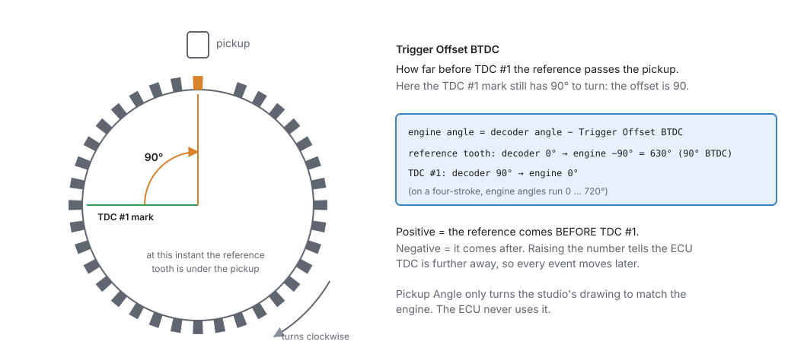
  <figcaption>Figure 16.8 — Trigger Offset BTDC. Here the reference passes the pickup with TDC #1 still
  90° away, so the offset is 90.</figcaption>
</figure>

**Pickup Angle** is where the sensor is mounted around the wheel, in degrees from vertical,
positive to the left (anticlockwise), seen from the front of the engine. The ECU **never uses it**. It
is stored so the studio can draw the wheel the way you see it on the engine.
<!-- src: definition/ecu.schema.yaml -->

### 7 · The virtual grid

The part of the ECU that schedules sparks and injections never sees the real wheel. It sees a steady
grid of **virtual teeth**, one every 10°, phase-locked to the real teeth. A 60-2 has more teeth than
the grid, and a 4-1 has far fewer, but the scheduler works the same way for both. Engine speed
(`rpm`) is worked out from the grid, and it reads **0 whenever sync is None**.
<!-- src: firmware/Scheduler/EnginePositionHal.cpp; get_rpm_x10 -->

<figure markdown>
  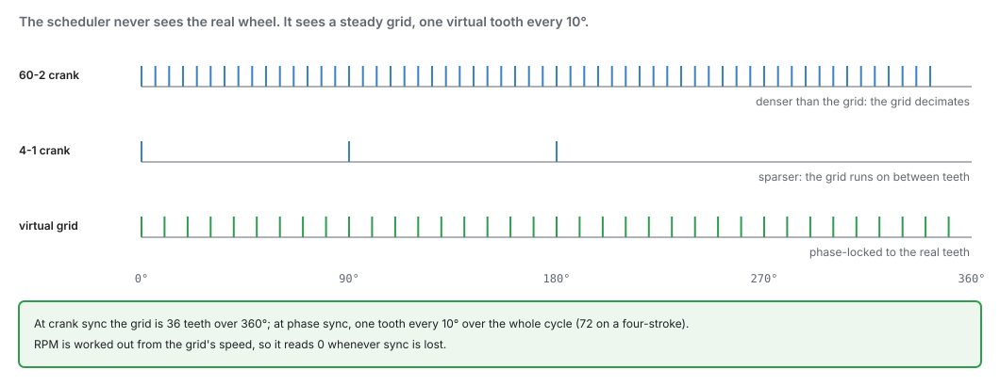
  <figcaption>Figure 16.9 — The virtual grid: 36 virtual teeth per revolution at Crank sync, 72 over
  the whole cycle at Phase sync on a four-stroke.</figcaption>
</figure>

### 8 · When the teeth stop

Each time a tooth arrives, the ECU sets a deadline for the next one, from the prediction and the
match window. If the deadline passes with no tooth, sync drops and firing stops at once. What it
means depends on how fast the engine was turning:

- **Below the Cranking Threshold** (`engine.cranking_rpm`, default 400 rpm) the engine was winding
  down or cranking: this is just the engine **stopping**, and nothing is recorded.
- **At or above it** the engine was running, so it is a fault: a **missed tooth**, and sync lost while
  running (**P0335**). If there is still nothing after 2 seconds (one revolution at 30 rpm), the
  trigger is reported as **absent** (**P0338**): the signal wire, sensor or its power is gone.
  <!-- src: firmware/Scheduler/EnginePositionHal.cpp (on_tooth_deadline, lost_at_speed_); firmware/Engine/Modules/EngineProtection.cpp (lost_running_) -->

When teeth come back, the ECU finds the reference again from scratch. No setting has to be changed
or re-sent.

!!! note "On the bench: 12 V, not just USB"
    The ECU only decodes the trigger while it sees battery voltage. Powered by USB alone on the bench,
    it will not sync, even with a stimulator connected. Give it 12 V.
    <!-- src: firmware/Scheduler/EnginePositionHal.cpp; firmware/Sensors/Sensors.cpp -->

## Before you start

:material-circle:{ .level-basic } Basic

- **The sensors wired** to trigger inputs: **VR1** and **VR2** for variable-reluctance (two-wire,
  magnetic) sensors, and **DIG1** to **DIG8** for Hall-effect or optical sensors. See chapter 11 for
  wiring and shielding.
  <!-- src: definition/boards/jaytek_v1.board.yaml -->
- **Know your wheel:** how many teeth, how many missing and where, and what the cam sensor sees. The
  Trigger Library (below) has most factory patterns. The Trigger Log can measure an unknown one.
- **The engine basics set** in chapter 15: cylinder count, firing order and cycle type. The trigger
  uses the cycle type to know whether a cycle is 360°, 720° or 1080°.
  <!-- src: firmware/Scheduler/GenericTriggerBuilder.h -->
- **A timing light**, to set the offset on the running engine.
- **12 V to the ECU** for any test that needs sync, including on the bench (USB alone is not enough).

## Setting it up

:material-circle:{ .level-basic } Basic → :material-circle:{ .level-intermediate } Intermediate

The trigger lives under **Configuration ▸ Engine Configuration ▸ Trigger System**. The trigger
settings apply when the engine is stopped, except **Trigger Offset BTDC**, which the ECU picks up
straight away so you can adjust it with a timing light on a running engine.
<!-- src: definition/ecu.schema.yaml (shadow when engine_stop); firmware/Scheduler/EnginePositionHal.cpp -->

This walk-through uses **Example 1** below: a four-cylinder with a 60-2 crank wheel on VR1 and a
one-pulse cam sensor on DIG1.

### Step 1 — The Trigger System page

<figure markdown>
  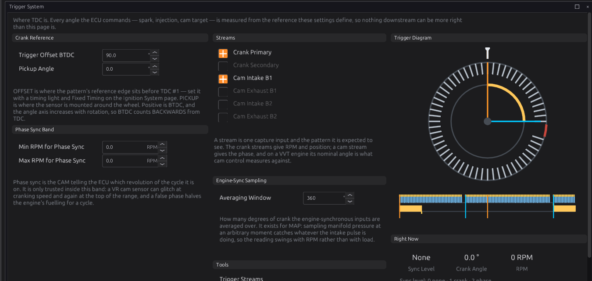
  <figcaption>Figure 16.10 — Configuration ▸ Engine Configuration ▸ Trigger System. The diagram on the
  right draws the trigger that is set up now.</figcaption>
</figure>

The page, in the order it appears:

- **Trigger Offset BTDC** `trigger.trigger_offset_btdc`: degrees from the reference to TDC #1
  (−720 to 720°, default 0). Leave it at the library's value for now. Step 7 sets it properly.
- **Pickup Angle** `trigger.sensor_angle`: where the sensor sits around the wheel, for the drawing
  only (−360 to 360°, default 0).
- **Min RPM for Phase Sync** and **Max RPM for Phase Sync**
  `trigger.min_full_sync_rpm_x10` / `max_full_sync_rpm_x10`: the speed band in which the cam is
  trusted to establish phase. Outside the band the cam is ignored for gaining phase, but phase the
  ECU already has is kept. With both at 0 (the default), the band is off and the cam is always
  trusted. For a **VR** cam sensor, a Min of about **1500 rpm** stops a glitch at cranking speed from
  giving a false phase.
  <!-- src: definition/ecu.schema.yaml; firmware/Scheduler/EnginePositionHal.cpp -->
- **Streams**: a switch for each of the six roles, each linking to its own page.
- **Engine-Sync Sampling ▸ Averaging Window**: how many crank degrees the engine-synchronous
  inputs (mainly MAP) are averaged over. It belongs to the sensors (chapter 17), not to the trigger.
- **Trigger Diagram** and **Right Now**: the trigger as configured, and the live **Sync Level**,
  **Crank Angle** and **RPM**.

### Step 2 — Choose the streams

<figure markdown>
  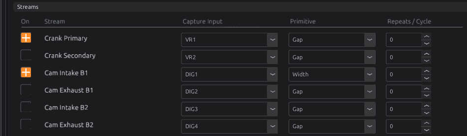
  <figcaption>Figure 16.11 — Trigger Streams: every stream on one screen.</figcaption>
</figure>

1. Open **Trigger System ▸ Trigger Streams**.
2. Tick **On** for each role your engine has. For Example 1, that is **Crank Primary** and **Cam
   Intake B1**.
3. Set **Capture Input** for each: the board input the sensor is wired to. The list shows the
   board's trigger inputs by name. **None** unassigns the stream.
   <!-- src: definition/ecu.schema.yaml -->
4. Leave **Repeats / Cycle** at **0** (the slot's default) unless your wheel is one of the special
   cases in section 1.

### Step 3 — The crank stream

Click **Crank Primary** to open its page.

<figure markdown>
  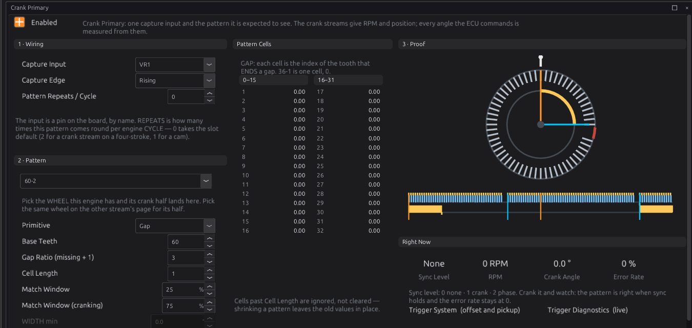
  <figcaption>Figure 16.12 — Crank Primary with a 60-2 wheel. The Proof panel draws this stream as it
  is set now.</figcaption>
</figure>

**1 · Wiring**

- **Capture Input**: as on the switchboard.
- **Capture Edge** `edge`: **Rising**, **Falling** or **Both**. A Gap or Sequence stream counts
  every edge it is given, so **Both** doubles the events per tooth and the pattern must then be
  described in edges, not teeth. It does not make the decoder more tolerant. On **VR1** and **VR2**,
  use **Rising**: the VR interface's rising edge is the sensor's zero crossing, the precise point of
  the tooth. If you change the edge later, check timing again: the event moves by the width of a
  tooth.
  <!-- src: definition/ecu.schema.yaml; hardware/jaytek_v1_hardware.md -->
- **Pattern Repeats / Cycle** `repeats`: 0 for the slot default.

**2 · Pattern**

1. Pick your wheel in the drop-down at the top of the panel. It lists every wheel in the library
   that has a crank half. Picking one writes that half's pattern settings into this stream: the
   primitive, teeth, gap ratio and cells, or the width band. It does not touch the input, the edge
   or the offset.
   <!-- src: apps/studio-jf/tools/layout/engine_pages.py -->
2. Check the fields it filled in:
    - **Primitive** `primitive`: Gap, Sequence or Width.
    - **Base Teeth** `slots` (Gap): the count with nothing missing. A 60-2 is **60**, not 58.
    - **Gap Ratio (missing + 1)** `gap_ratio` (Gap): **3** for a 60-2, **2** for a 36-1. It applies
      to every gap on the stream, so a wheel whose gaps are different sizes must be a Sequence.
    - **Cell Length** `cell_len`: for Gap, the number of gaps (up to 8). For Sequence, the number of
      steps (up to 96). Width uses no cells.
      <!-- src: firmware/Scheduler/SchedulerTypes.h (MAX_ANOMALIES 8); definition/ecu.schema.yaml -->
    - **Match Window** and **Match Window (cranking)**: the tolerances from section 3. The defaults
      are **25 %** and **75 %**.
    - **WIDTH min**, **WIDTH max**, **WIDTH target angle**: used by Width only, greyed otherwise.
3. **Pattern Cells**: for **Gap**, each cell is the index of the tooth that **ends** a gap, counting
   only the teeth that exist, from 0. The first gap is always 0, because the tooth after it is the
   reference. A 60-2 has one cell, 0. For **Sequence**, each cell is one step in 0.1°. Cells past
   Cell Length are ignored, not cleared.
   <!-- src: firmware/Scheduler/GapMatcher.h; definition/ecu.schema.yaml -->

**3 · Proof** draws this stream as the ECU will decode it. **Right Now** shows the live **Sync
Level**, **RPM**, **Crank Angle** and **Error Rate** while you crank.

### Step 4 — The cam stream

Click **Cam Intake B1** (or open it from the Trigger System page).

<figure markdown>
  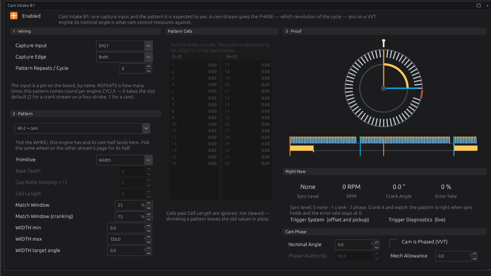
  <figcaption>Figure 16.13 — A one-pulse cam as a Width stream with a band that accepts any pulse.</figcaption>
</figure>

1. Set **Capture Input** (DIG1 in the example) and pick the **same wheel** in the Pattern drop-down,
   so the cam half of it lands here.
2. For a one-pulse cam, the Width band is **0 to 720°**. It accepts any pulse, which is right when
   there is only one.
3. **WIDTH target angle**: where the pulse's leading edge sits, in decoder degrees over the cycle
   (the crank's tooth 0 is 0°). It only has to be right to within about half a revolution, because
   the crank decides the exact angle and the cam only picks the revolution. The Engine Cycle view
   (below) shows where the pulse lands once the crank has synced. If it is a revolution out, see
   the troubleshooting table.
   <!-- src: firmware/Scheduler/GenericTrigger.h (crank_decides: nearest repeat) -->
4. **Cam Phase** panel:
    - **Nominal Angle** `nominal_angle`: where this cam's reference sits with the phaser parked on
      its stop (fully retarded for a typical intake, fully advanced for a typical exhaust). Cam
      control (chapter 25) measures cam advance from it, and the cam-to-crank
      check uses it. **0 turns the check off.**
    - **Cam Is Phased (VVT)** `phased`: tick it if a phaser moves this cam.
    - **Phaser Authority** `phase_authority` (phased cams only, default 60°): how far, in crank
      degrees, the phaser can move the cam from Nominal Angle. Set it to the phaser's real travel.
    - **Mech Allowance** `phase_allowance` (fixed cams only, default 0): how far chain stretch or
      gear lash may move the cam before it counts as a fault.
      <!-- src: definition/ecu.schema.yaml; firmware/Scheduler/GenericTrigger.h -->

!!! tip "The designer does steps 3 and 4 in one go"
    Loading a wheel in the Trigger Designer and pressing **Apply to ECU** writes every stream, the
    offset and the pickup angle at once. See the next section.

### Step 5 — The Trigger Library and the Trigger Designer

:material-circle:{ .level-intermediate } Intermediate

The studio ships a library of trigger wheels, and a designer for drawing your own. Both are for
native jayecu ECUs. For an imported ECU the studio hides them.
<!-- src: apps/studio-jf/main.cpp -->

<figure markdown>
  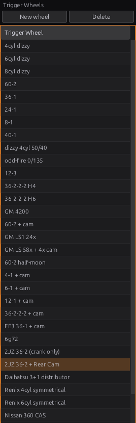{ width="268" }
  <figcaption>Figure 16.14 — The Trigger Library dock, on the left beside Navigation.</figcaption>
</figure>

Open the library with its tab on the left edge, or **Library ▸ Trigger Library**. The shipped
wheels come from the ECU's definition, so the list matches what the firmware can decode. Your own
wheels are saved beside them.
<!-- src: definition/ecu.schema.yaml; apps/studio-jf/main.cpp -->

- **Click** a wheel to load it into the designer. Nothing is written to the ECU.
- **Double-click** a wheel to load it and open the **Trigger Designer** tab. You can also open the
  designer from **Tools ▸ Trigger Designer**.
- **New wheel** and **Delete** manage your own wheels.
- **Library ▸ Import Trigger Wheels…** and **Export Trigger Wheels…** move wheels between computers
  as a `.json` file.

<figure markdown>
  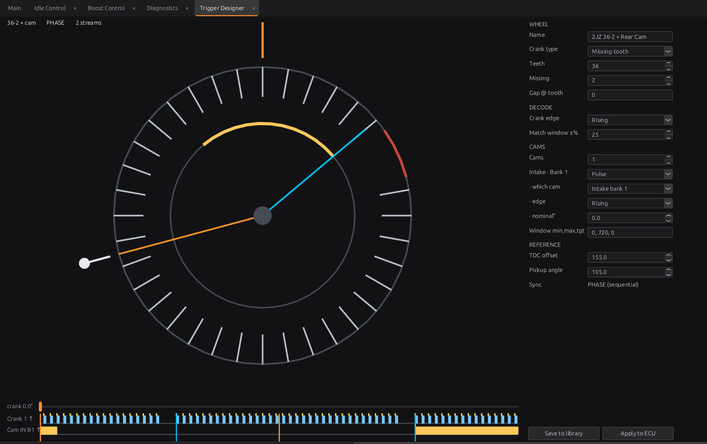
  <figcaption>Figure 16.15 — The Trigger Designer with the library's 2JZ wheel. On the dial, the
  orange mark at the top is TDC #1, the white knob is the pickup, the red arc is the gap, the cyan
  line is the reference tooth, and the orange line is the point on the wheel that is under the
  pickup at TDC #1. The inner yellow arc is the cam window. The trace below runs in engine degrees
  from TDC #1.</figcaption>
</figure>

<!-- src: apps/studio-jf/src/ui/TriggerDiagram.h -->

The settings form, top to bottom:

- **WHEEL**: **Name**, **Crank type** (Missing tooth, Even, Sequence or Width), and the fields for
  that type. For a missing-tooth wheel: **Teeth**, **Missing**, and **Gap @ tooth**. Gap positions
  and sequence angles are typed as a list separated by commas or spaces, such as `0, 1, 14` for a
  36-2-2-2.
- **DECODE**: **Crank edge** and **Match window ±%**.
- **CAMS**: how many cams, and for each one its type (**Pulse** or **Pattern**), **which cam** slot
  it is, its **edge**, its **nominal°**, and its window (`min, max, target`) or its pattern angles.
- **REFERENCE**: **TDC offset** and **Pickup angle**.
- **Sync**: the best sync the wheel can give, CRANK (wasted spark) or PHASE (sequential).
  <!-- src: apps/studio-jf/src/ui/TriggerDesigner.h -->

On the dial:

- **Drag the pickup** (outside the rim) to where the sensor bolts on, or **drag the wheel** (inside
  the rim) to turn it. Both change the **offset**, because the offset is the angle between the
  reference tooth and the pickup. This lets you match the picture to the engine when you do not know
  the number. Finish with a timing light.
- **Click a tooth** to remove it, or click an empty slot to put a tooth back.
- **Drag along the crank track** under the dial to turn the engine over on screen and watch the
  reference tooth reach the pickup. This is a view control only and changes nothing.
  <!-- src: apps/studio-jf/src/ui/TriggerDesigner.h -->

If the wheel cannot decode, the designer says why above the trace, before you apply it.

The two buttons do different things on purpose:

- **Save to library** stores the wheel in your own library. It needs a name.
- **Apply to ECU** writes the wheel into the ECU's live settings (RAM only; **Burn** to keep it). It
  writes every trigger stream, the offset and the pickup angle, and switches off every stream the
  wheel does not use. It does **not** change the Capture Input of any stream.
  <!-- src: apps/studio-jf/main.cpp; apps/studio-jf/src/model/TriggerWheel.cpp:wheelPairs -->

!!! warning "Apply to ECU replaces the offset"
    Applying a wheel writes its **TDC offset** as well. If you have already set the offset with a
    timing light, write the value down first and put it back afterwards, or set it in the designer
    before you apply.

The designer also has a **Use measured** button, which appears when a Trigger Log capture has been
fitted. See Step 8.

### Step 6 — Crank it and watch

1. Stop the engine if it is running: trigger settings take effect with the engine stopped. Burn
   them so they survive a power cycle.
2. Open **Trigger System ▸ Diagnostics**.
3. Crank the engine with the injectors and coils disabled, or unplugged.

<figure markdown>
  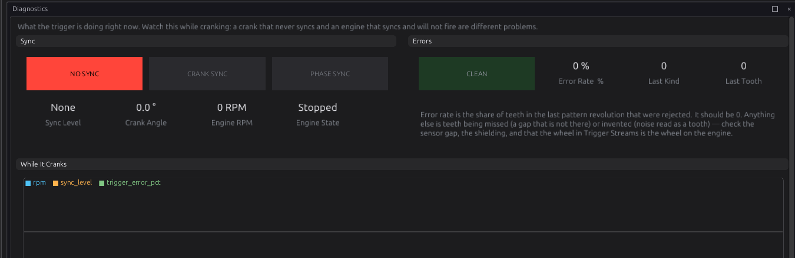
  <figcaption>Figure 16.16 — Trigger Diagnostics. Watch it while cranking.</figcaption>
</figure>

A healthy trigger: **RPM** comes up smoothly on the starter, the lamp goes to **CRANK SYNC** within a
revolution or two, then to **PHASE SYNC** when the cam arrives, and the **Error Rate** stays at
**0 %**. The **While It Cranks** chart plots `rpm`, `sync_level` and `trigger_error_pct` so you can
see a short drop you might miss on the lamps.

### Step 7 — Set the offset with a timing light

The offset is the one number no bench test can check. Set it on the running engine with **Fixed
Timing**, following **chapter 20, Step 6**. In short: fix the advance at a known value (such as 10°),
read the timing marks with a light on cylinder 1, and change **Trigger Offset BTDC** until the light
agrees. The ECU picks up the new offset without stopping the engine. Then burn.

If the reading moves as engine speed rises, the problem is the trigger (a missed or extra tooth, or
noise), not the offset.

### Step 8 — The Trigger Log and the Engine Cycle view

:material-circle:{ .level-intermediate } Intermediate

Two tools under **Tools** show what the trigger is doing. They complement each other.

**Trigger Log** (jayecu ECUs only) records the **raw edges** on every trigger input: which stream,
the level of every line, and the time. It draws one bar per edge, with the height showing the time
since the previous edge. It knows nothing about the wheel and needs no sync, so it works for a wheel
the ECU cannot decode yet.
<!-- src: firmware/Scheduler/TriggerLogger.h; apps/studio-jf/main.cpp -->

The log only watches. It does not stop the engine starting: if the trigger streams are right, the
engine syncs, fires and starts as it always does, and you get a log of it — useful for capturing a
start-up. Most of the time you use the log because the streams are wrong and the engine will not
start anyway. If you want the log **without** the engine starting, turn off **Ignition Outputs**
(**Configuration ▸ Engine Configuration ▸ Ignition System**) and **Injector Outputs** (**Fuel
System**) first, and turn them back on afterwards — both survive a reset.
<!-- src: firmware/Scheduler/EnginePositionHal.cpp; definition/ecu.schema.yaml (ign_enable, inj_enable) -->

<figure markdown>
  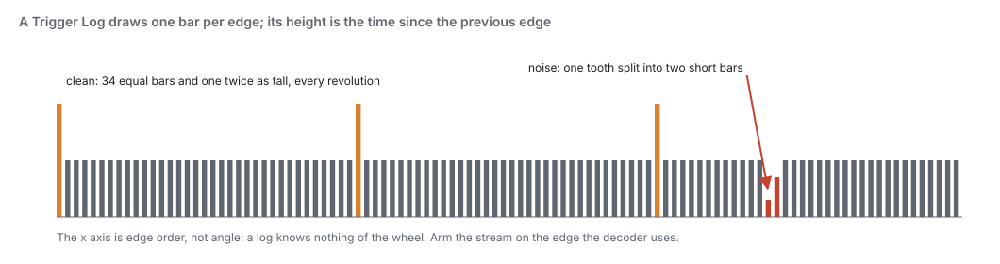
  <figcaption>Figure 16.17 — Reading a Trigger Log. The x axis is edge order, not angle.</figcaption>
</figure>

- Press **Start** and crank. The ECU records up to **4096 edges** and then stops by itself. Press
  **Stop** to end sooner.
- It does not disturb the decoder, so you can log a running engine.
- It only sees the edges each input is set to capture. A Rising stream logs one edge per tooth.
  Set the stream to **Both** if you need to see tooth widths.
  <!-- src: firmware/Scheduler/TriggerLogger.h; firmware/Comms/CommsManager.cpp -->
- The same capture goes to the Trigger Designer. It fits a wheel to the capture and draws the
  measured teeth as faint ticks inside the drawn wheel. Where a tick has no tooth above it, the
  drawing is wrong. **Use measured** adopts the fitted wheel. Nothing changes until you press it.
  <!-- src: apps/studio-jf/main.cpp; apps/studio-jf/src/ui/TriggerDesigner.h -->

**Engine Cycle** shows one engine cycle **in degrees**, with a lane for each trigger input, coil and
injector. It needs sync, because the angles come from the decoder. It keeps a rolling record of
cycles that you can pause and step through, and it flags any lane whose count of edges changed from
one cycle to the next. This is how you see where the cam pulse falls against the crank, or a tooth
that arrives late once in a while. Chapter 43 covers it in full.
<!-- src: apps/studio-jf/src/ui/EngineCyclePanel.h; apps/studio-jf/src/model/CycleDiagnostics.h -->

## Worked examples

:material-circle:{ .level-intermediate } Intermediate

!!! example "Example 1 — four-cylinder, 60-2 crank and a one-pulse cam, sequential"
    A four-cylinder with a 60-2 wheel on the crank (VR sensor) and a Hall sensor seeing one pulse per
    cycle on the cam, coil-on-plug and sequential injection. This is the library's **60-2 + cam**.

    | Setting | Value | Why |
    |---|---|---|
    | Crank Primary | On, **VR1**, Rising | VR sensor on the VR input |
    | Primitive / Base Teeth / Gap Ratio | Gap / **60** / **3** | 60 positions, 2 missing |
    | Cell Length / cell 0 | **1** / **0** | one gap; the tooth after it is the reference |
    | Match Window / cranking | 25 % / 75 % | the defaults |
    | Cam Intake B1 | On, **DIG1**, Both | Hall sensor on a digital input |
    | Primitive / WIDTH min / max / target | Width / 0 / 720 / 0 | one pulse, so any pulse is the reference |
    | Trigger Offset BTDC | **90** in the figures, **set yours with a light** | the offset depends on where the sensor sits |

    <figure markdown>
      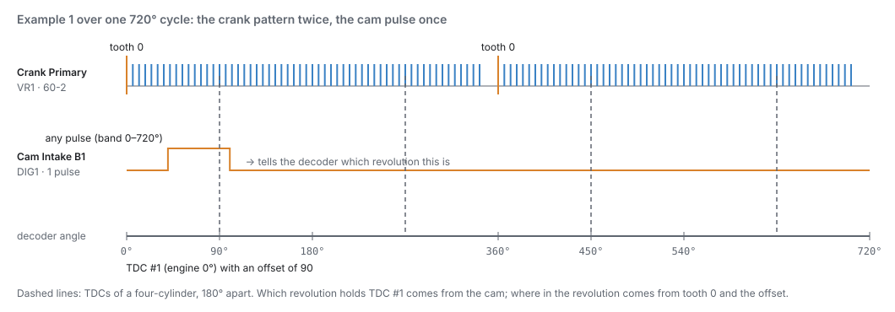
      <figcaption>Figure 16.18 — Example 1 over one cycle. The crank gives the angle within each
      revolution; the cam says which revolution holds TDC #1.</figcaption>
    </figure>

    Cranking, the ECU reaches **Crank** on the second gap and fires in pairs. At the next cam pulse it
    reaches **Phase** and goes sequential.

!!! example "Example 2 — Toyota 2JZ, 36-2 crank and rear cam"
    The library's **2JZ 36-2 + Rear Cam** (Figure 16.15). The crank wheel has 36 positions with two
    missing, so **Base Teeth 36**, **Gap Ratio 3**, one cell of 0. The cam pulse is a Width stream
    with the 0 to 720° band.

    | Setting | Value |
    |---|---|
    | Trigger Offset BTDC | **155°** (the library's value; confirm with a light) |
    | Pickup Angle | **105°** (to the left of vertical; drawing only) |
    | Crank edge / cam edge | Rising / Rising |

    <!-- src: definition/ecu.schema.yaml trigger_wheels "2JZ 36-2 + Rear Cam"; definition/ecu.schema.yaml -->

    The crank-only version, **2JZ 36-2 (crank only)**, has no cam stream. It reaches Crank sync only,
    so it suits wasted spark and non-sequential injection.

!!! example "Example 3 — even crank wheel anchored by the cam"
    Some engines have evenly spaced crank teeth and rely on the cam for position, such as the
    library's **6g72** (3 even crank teeth, and a 4-pulse cam Sequence of 190°, 170°, 195°, 165°) or
    **GM 8 even + cam**.

    - The crank stream is a **Gap** stream with **Cell Length 0**. It locks relatively and gives
      speed.
    - The cam stream is an uneven **Sequence** (or a Width pulse). It is the only anchor, and it gives
      the phase in the same moment.
    - **Cam Is Phased must be off** on that cam. If a phaser moves it, it cannot anchor the crank, the
      setup's ceiling is None, and the ECU refuses to fire with **P1652**.
      <!-- src: firmware/Scheduler/TriggerConfigCheck.h; tests/test_trigger_config_check.cpp -->

    Until the cam's reference arrives, the sync level stays at None, so this kind of engine takes
    up to one full cycle longer to fire.

!!! example "Example 4 — a distributor, sync always"
    A four-cylinder with a distributor whose pickup gives 4 even pulses per engine cycle, one coil,
    and Multi-Point injection. This is the library's **4cyl dizzy**.

    | Setting | Value | Why |
    |---|---|---|
    | Crank Primary | On, Gap, **Base Teeth 2**, Cell Length 0 | 2 even teeth per crank revolution = 4 per cycle |
    | Ignition Mode (chapter 20) | **Distributor** | the rotor picks the plug |
    | Injection Mode (chapter 15) | **Multi-Point**, or Sequential (any sync) | the ECU cannot tell which cylinder is which |
    | Trigger Offset BTDC | the pulse's position before TDC, **set with a timing light** | every pulse is the same distance before a TDC |

    4 teeth per cycle divides 4 cylinders, so every pulse is a sync tooth: the ECU syncs on the first
    steady pulse, straight to full sync. With Ignition Mode on anything else, the same wheel is refused
    with P1652, because coil-on-plug and wasted spark need to know which cylinder is which.
    <!-- src: firmware/Scheduler/TriggerConfigCheck.h (even_wheel_sync_always); tests/test_trigger_config_check.cpp (4cyl dizzy) -->

## Tuning it

:material-circle:{ .level-intermediate } Intermediate → :material-circle:{ .level-advanced } Advanced

There is nothing to "tune" in the usual sense: a trigger is right or it is wrong. What you can
adjust is how tolerant it is, and that should be done from evidence.

1. **Start with the default windows** (25 % running, 75 % cranking). The designer warns above
   45 %.
2. **Log** `sync_level`, `rpm`, `trigger_error_pct`, `trigger_noise_edges`, `trigger_missed_teeth`
   and `trigger_phase_lost` while cranking, idling and on a full pull (chapter 42).
3. **If sync drops while cranking** but never when running, the starter's speed swings are outside
   the cranking window. Widen **Match Window (cranking)** a little. Do not widen the running window
   for a cranking problem.
4. **If sync drops at speed**, look at the counters before touching a window. Rising
   `trigger_noise_edges` is interference (shielding, grounds, a VR threshold). Rising
   `trigger_missed_teeth` is a weak or damaged signal. A wider window hides both for a while and does
   not fix either.
5. **If phase drops on a VVT engine** under load or at full phaser travel, check **Phaser
   Authority** against the phaser's real travel first. On a fixed cam, raise **Cam Mechanical
   Allowance** only if the drop comes with load or heat. A phase fault that appears suddenly on a
   healthy engine is what a jumped timing chain looks like. Do not widen the band to hide it.
   <!-- src: definition/ecu.schema.yaml -->
6. **For a VR cam sensor**, set **Min RPM for Phase Sync** to about 1500 rpm if a false phase is seen
   at cranking speed.

## Diagnostics

:material-circle:{ .level-intermediate } Intermediate

| Code | Meaning | What sets it | What to check |
|---|---|---|---|
| **P0335** | Trigger: crank synchronisation lost | Sync lost while the engine was running (at or above the Cranking Threshold). Severity 3: the engine is cut. Clears when sync returns. A normal stop never raises it. | The counters below, to see why: noise, a missed tooth, or no signal |
| **P0336** | Trigger: unexpected tooth count | A tooth at the wrong time, or one that never came. Severity 1. | Sensor gap and signal strength; a damaged tooth; the wheel settings |
| **P0337** | Trigger: missing-tooth gap not found | A normal tooth where the gap was expected. Severity 2. | That the wheel in the tune is the wheel on the engine (Base Teeth, Gap Ratio, cells) |
| **P0338** | Trigger: no signal | The teeth stopped while the engine was running, and nothing came for 2 seconds. Severity 3. A normal stop never raises it. | Sensor power, the signal wire, the connector |
| **P0339** | Trigger: noise | Edges arriving too soon to be teeth. Severity 1. | Shielding, sensor ground, routing away from ignition leads (chapter 11) |
| **P0341** | Trigger: phase lost | A cam not where the crank says it should be, or overdue. Level 1; the ECU drops to Crank sync (or, for another bank's cam, only records it). | Nominal Angle, Phaser Authority, Mech Allowance; the timing chain; the cam sensor |
| **P1652** | Config: trigger cannot establish position | The setup can never reach Crank sync. Firing is refused. | An even wheel with nothing to anchor it (on its own it needs Ignition Mode Distributor, section 2), or a phased cam as the only anchor (section 5) |

<!-- src: firmware/Engine/Modules/EngineProtection.cpp (P0341 phase lost); firmware/Engine/EngineTask.cpp; definition/ecu.schema.yaml firmware_dtc -->

By default the ECU records a P0336 or P0337 for **any single** bad tooth. **Trigger Error % Limit**,
in engine protection (chapter 29), raises that threshold for a genuinely noisy installation.
<!-- src: definition/ecu.schema.yaml -->

A cam that fails the cam-to-crank check, or stops arriving, raises **P0341**. **Trigger Fault
Stream** says which cam it was.

**Output channels** worth watching:

| Channel | What it tells you |
|---|---|
| **Sync Level** `sync_level` | 0 None, 1 Crank, 2 Phase |
| **Crank Synchronized** `synchronized` | 1 at Crank sync or better |
| **Engine RPM** `rpm` | 0 whenever sync is None |
| **Crank Angle** `crank_angle` | engine degrees from TDC #1, 0 to 720 |
| **Trigger Error Rate** `trigger_error_pct` | the share of teeth in the last pattern revolution that were rejected; should be 0 |
| **Trigger Signal Absent** `trigger_absent` | 1 when the trigger has gone quiet (P0338) |
| **Trigger Noise Edges** `trigger_noise_edges` | running count of edges too early to be teeth |
| **Trigger Missed Teeth** `trigger_missed_teeth` | running count of teeth that never arrived |
| **Trigger Phase Lost** `trigger_phase_lost` | running count of phase drops |
| **Trigger Fault Stream** `trigger_fault_stream` | which stream raised the last fault (0–5 = slot; 255 = none) |
| **Trigger Sync Ceiling** `trigger_sync_ceiling` | the best sync this setup can ever reach |
| **VVT Cam 1 Advance** … `vvt_angle_1` to `_4` | how far the cam has moved from Nominal Angle, in degrees of advance (negative = retarded); not valid while that cam is not locked (chapter 25) |

<!-- src: definition/ecu.schema.yaml -->

The running counts keep counting when the teeth stop, so they still explain a fault after the engine
has died.

## Troubleshooting

:material-circle:{ .level-basic } Basic → :material-circle:{ .level-advanced } Advanced

| Symptom | Likely causes | Check |
|---|---|---|
| No RPM at all while cranking | ECU not seeing 12 V (`key_on` 0); stream off or on the wrong input; sensor not powered; P1652 | 12 V on the ECU; Trigger Streams (On, Capture Input); Trigger Log shows edges?; `trigger_sync_ceiling` |
| Trigger Log shows edges but sync never comes | Wrong wheel description; wrong edge; noise | Compare the log with the wheel (Figure 16.17); try the other Capture Edge; use the designer's **Use measured** |
| Sync comes and goes while cranking | Cranking speed swings too much for the window; weak VR signal at low speed | `trigger_missed_teeth`; widen **Match Window (cranking)** a little; the VR sensor's air gap |
| Sync drops at high RPM | Noise from ignition; a damaged tooth | `trigger_noise_edges` against `trigger_missed_teeth`; shielding and routing (chapter 11); inspect the wheel |
| P1652, engine will not fire | A single even wheel with Ignition Mode not Distributor, or teeth that do not divide the cylinder count; an even crank whose only cam is phased | Section 2 (sync always); tick off **Cam Is Phased** on a fixed cam; add a cam stream |
| Sits at Crank, never reaches Phase | Cam stream off or on the wrong input; RPM outside the Phase Sync Band; Width band excludes the pulse | Cam stream On and Capture Input; Min/Max RPM for Phase Sync; WIDTH min/max; Trigger Log on the cam input |
| Phase drops every few seconds on a VVT engine | Phaser Authority too small; Nominal Angle wrong | `trigger_phase_lost`, `trigger_fault_stream`; Nominal Angle with the phaser parked; Phaser Authority |
| Runs on wasted spark, but stalls or backfires as soon as Phase is reached | TDC #1 is placed a revolution out | Add **360°** to Trigger Offset BTDC (or subtract 360° if it is above 360°). This swaps the revolution without moving the timing within it. Recheck with the timing light. |
| Timing light reads correctly at idle but drifts with RPM | A trigger fault, not the offset | Error counters; the edge setting; the sensor signal |
| Timing light reads a steady error at all RPM | Offset wrong | Step 7 |
| A distributor wheel (**4cyl dizzy** and similar) gives P1652 | Ignition Mode is not Distributor; an injection stage is Sequential, Semi-Sequential or Bank; or the teeth per cycle do not divide the cylinder count | Ignition Mode Distributor (chapter 20); injection Multi-Point or Sequential (any sync) (chapter 15); Base Teeth and Pattern Repeats |

<!-- src: firmware/Scheduler/EnginePositionHal.cpp (offset mod cycle); firmware/Scheduler/TriggerConfigCheck.h -->

## Settings reference

Every Trigger setting, generated from the definition the studio loads:

--8<-- "reference/settings/_trigger.table.md"

## Related

- [Chapter 11 — Wiring sensors](../part2/11-wiring-sensors.md) (crank and cam sensors, VR and Hall, shielding)
- [Chapter 15 — Engine and vehicle basics](15-engine-vehicle.md) (cylinders, firing order, cycle type)
- [Chapter 20 — Ignition](20-ignition.md) (Fixed Timing and the timing-light check)
- [Chapter 25 — Cam and valve control](25-vvt-vvl.md) (Nominal Angle and cam advance)
- [Chapter 29 — Engine protection](29-protection.md) (Trigger Error % Limit and the sync-loss cut)
- [Chapter 43 — Bench testing](../part5/43-bench-testing.md) (stimulators, Trigger Log, Engine Cycle)
- [Trigger wheel library](../reference/trigger-wheels.md) (every shipped wheel)
