# Sensors and calibration

:material-circle:{ .level-basic } Basic → :material-circle:{ .level-advanced } Advanced

> **In one sentence:** every input the ECU reads — pressure, temperature, throttle, lambda, switch or
> speed — is one entry in a catalogue, set up the same way: switch it on, say how it is wired, give
> it a calibration, and choose which faults it should report.

## What it does

:material-circle:{ .level-basic } Basic

The ECU can read **135 inputs**, listed by name under **Configuration ▸ Sensors**: Coolant
Temperature, Manifold Pressure, Throttle Position, Clutch Pedal Switch, Wideband O2 and so on. Each
is a **sensor** in the catalogue. You switch on the ones your car has, and for each one you say:

1. **How it is read** (the **interface**): an analogue voltage, a frequency, a switch level, a CAN
   message, and so on.
2. **Where it is wired**: which ECU input pin.
3. **What the reading means** (the **calibration**): a curve from the raw reading (volts, hertz) to
   the real value (°C, kPa, %).
4. **What counts as a fault** (the **diagnostics**): which checks to run, their limits, and how
   serious each fault is.

The result is published as a **channel**, such as `clt` or `map`, which every other module reads. A
sensor you have not switched on publishes nothing at all, which is different from publishing zero:
the modules that need it see it as missing and use their own fallback.
<!-- src: definition/ecu.schema.yaml (Sensors) (catalogue); firmware/Sensors/Sensors.h -->

Every engine needs this chapter. At minimum you need manifold pressure (for Speed-Density), coolant
and air temperature, throttle position, and battery voltage.

!!! warning "The default calibrations are placeholders"
    A new tune's calibration for most sensors is a straight line across the whole input range, such
    as 0–5 V = 0–100 °C. That is not your sensor. Enter the real curve for every sensor you use
    before you trust any reading from it.
    <!-- src: definition/ecu.schema.yaml (cal default [[0,0],[5000,1000]]) -->

## How it works

:material-circle:{ .level-intermediate } Intermediate

<figure markdown>
  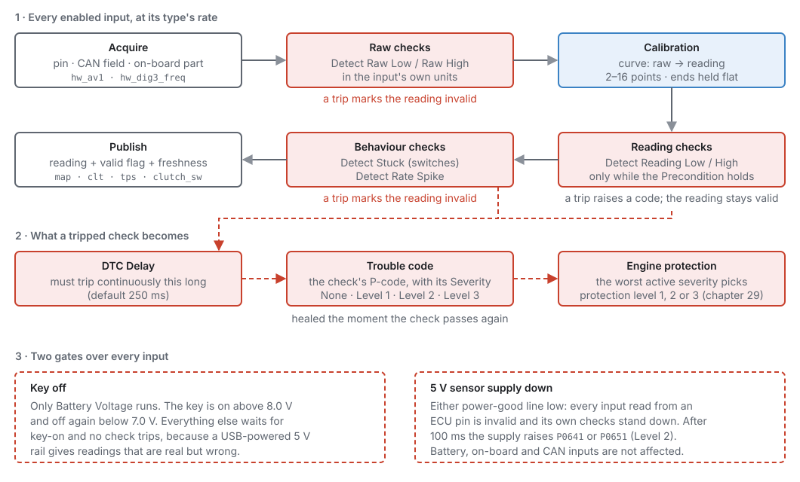
  <figcaption>Figure 17.1 — What happens to every enabled input. Red is diagnostics, blue is the
  calibration.</figcaption>
</figure>

### 1 · Sensor types and the pipeline

Every sensor has a **type**, which sets its units, precision, value range and update rate:
<!-- src: definition/ecu.schema.yaml (sensor_types); generated/sensors_catalog.h -->

| Type | Units | Updates | Examples |
|---|---|---|---|
| temperature | °C | 5 Hz | coolant, air, oil |
| exhaust temperature | °C (to 1500) | 5 Hz | EGT |
| pressure | kPa | 100 Hz | MAP, oil, fuel |
| percent | % | 200 Hz | throttle, pedal |
| position | ° | 100 Hz | steering angle |
| level | % | 2 Hz | fuel level |
| lambda | λ | 20 Hz | wideband O2 |
| flow | g/s | 50 Hz | MAF |
| composition | % | 5 Hz | flex fuel |
| frequency | Hz | 50 Hz | wheel speed, turbo speed |
| switch | on/off | 50 Hz | clutch, brake, start button |
| narrowband | V | 50 Hz | narrowband O2 |
| voltage | V | 20 Hz | battery |
| multi-position switch | position number | 50 Hz | cruise stalk, steering-wheel buttons |
| high pressure | kPa (whole kPa, to 32767) | 20 Hz | nitrous and CO2 bottle pressure |

A catalogued sensor already has its type. Only the **Auxiliary Input** and **Generic** entries let you
choose one (**Sensor Type**).

Each enabled sensor runs the same steps, in order:

1. **Acquire** the raw reading from its input.
2. **Raw checks**: is the raw reading electrically plausible? A trip makes the reading **invalid**.
3. **Calibration**: turn the raw reading into the real value.
4. **Reading checks**: is the value plausible for this engine? A trip raises a code, but the reading
   stays valid.
5. **Behaviour checks**: a switch stuck in one state, or a value changing impossibly fast. A trip
   makes the reading invalid.
6. **Publish** the value, with a valid flag and a time stamp.
   <!-- src: firmware/Integration/PipelineBuilder.h (locked interface); firmware/Pipeline/Stages.h -->

There is **no smoothing** in the sensor. It publishes what it measured, and each module that reads it
decides how much to filter, because only the module knows whether it is fuelling from the value or
running a fast control loop on it.
<!-- src: firmware/Pipeline/Stages.h -->

### 2 · Interfaces

**Interface** says how the sensor is physically read, and so which settings apply and which pins the
picker offers:
<!-- src: definition/ecu.schema.yaml enums.sensor_interface; firmware/Integration/PipelineBuilder.h -->

| Interface | Reads | Pins | Raw units |
|---|---|---|---|
| **Analogue Voltage** | a 0–5 V signal | AV1–AV16, AT1–AT4 | volts |
| **Engine Sync Voltage** | a 0–5 V signal averaged over a crank-angle window (below) | AV/AT | volts |
| **On-board** | a sensor on the ECU board itself (barometric pressure, board temperature) | none | — |
| **Frequency** | pulses per second | DIG1–DIG8 | Hz |
| **Digital** | a switch level, on or off | DIG1–DIG8 | on/off |
| **CAN Bus** | a field of a CAN message (chapter 33) | none | the field's value |
| **SENT** | a SENT digital sensor | DIG1–DIG8 | the sensor's counts |
| **Pulse Width** | the length of a pulse | DIG1–DIG8 | µs |

Each sensor offers only the interfaces that make sense for it. **Manifold Pressure** is always read
as Engine Sync Voltage; **Coolant Temperature** only reads as Analogue Voltage.

**Engine Sync Voltage** exists for manifold pressure. Sampled at a random moment, MAP catches whatever
the intake pulses are doing, so the reading swings with engine speed. Averaged over a crank-angle
window it follows load instead. The window is one setting for all engine-sync inputs,
**Engine-Sync Sampling ▸ Averaging Window** `sensors.engine_sync_window_deg` (default 360°), on the
Trigger System page. An **instant** MAP channel, `imap`, is also published every millisecond,
unaveraged, for transient fuel (chapter 19).
<!-- src: definition/ecu.schema.yaml; firmware/Sensors/Sensors.cpp -->

### 3 · Calibration

The calibration is a curve of up to **16 points**: raw reading on one axis, real value on the other.
Between points the ECU draws a straight line. Beyond the first and last points the reading holds the
end value. The raw axis must go upwards from point to point.
<!-- src: definition/ecu.schema.yaml -->

<figure markdown>
  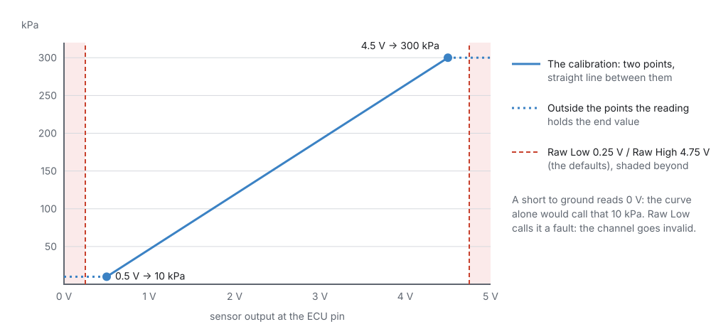
  <figcaption>Figure 17.2 — A linear sensor needs just two points from its data sheet. The raw checks
  catch the readings the curve cannot tell from real ones.</figcaption>
</figure>

A **switch on an analogue pin** does not use a curve. The first two calibration points become two
trip points: the reading turns **on** when the voltage rises past the higher one and **off** when it
falls below the lower one. Between them it keeps its last state, so a noisy pin cannot chatter.
**Invert Signal** flips the result.
<!-- src: firmware/Integration/PipelineBuilder.h -->

A **multi-position switch** (several buttons on one wire through resistors) uses a voltage **band**
per position instead: up to 8 bands, each a low and high voltage with a position number. A reading in
no band makes the channel invalid and raises the sensor's own "no calibrated band" code.
<!-- src: definition/ecu.schema.yaml; firmware/Integration/PipelineBuilder.h -->

<figure markdown>
  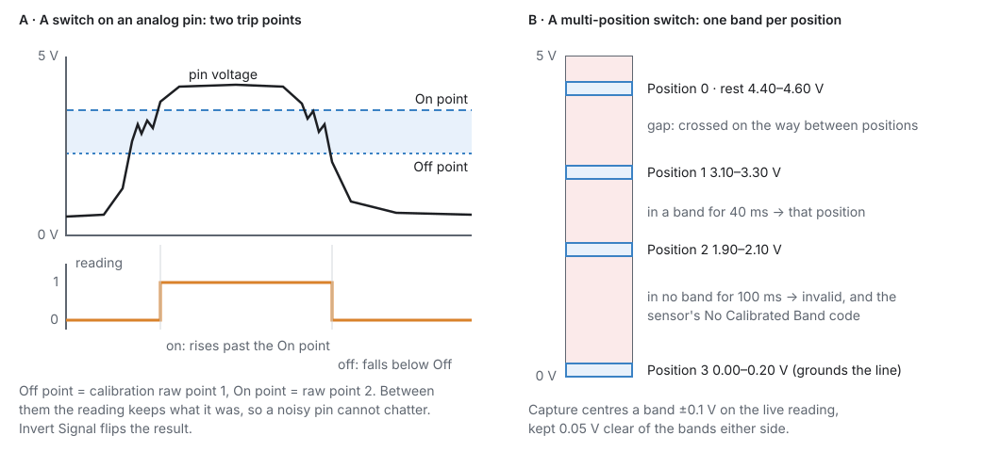
  <figcaption>Figure 17.3 — The two ways a switch can be read from a voltage.</figcaption>
</figure>

### 4 · Diagnostics and trouble codes

Each sensor can run up to six checks. You tick the ones your wiring can actually tell apart:
<!-- src: definition/ecu.schema.yaml -->

| Check | Tests | In | Makes the reading |
|---|---|---|---|
| **Detect Raw Low** | raw reading below **Raw Low Threshold** (default 250 mV) | the input's own units | invalid |
| **Detect Raw High** | raw reading above **Raw High Threshold** (default 4750 mV) | the input's own units | invalid |
| **Detect Reading Low** | value below **Reading Low Threshold** | the sensor's units | still valid |
| **Detect Reading High** | value above **Reading High Threshold** | the sensor's units | still valid |
| **Detect Stuck** | a switch that holds one state longer than **Stuck Timeout** | ms | invalid |
| **Detect Rate Spike** | a value changing faster than **Max Rate of Change** per second | units/s | invalid |

- The raw pair is an **electrical** test before calibration: a short to ground or an open circuit
  usually reads near 0 V, a short to 5 V near 5 V. On a frequency input the threshold is in Hz, on a
  pulse-width input in µs.
- The reading pair is a **plausibility** test after calibration. It only runs while the
  **Precondition** expression is true. For example, oil pressure of zero is a fault at 3000 rpm and
  the truth with the engine stopped, so give Reading Low a precondition such as `rpm > 1500`. The
  expression reads channels and settings (chapter 34). A missing or stale channel counts as false,
  so a dead sensor cannot arm a fault.
- **Detect Rate Spike** only exists for types that change fast (pressure, percent, frequency).
- A check must fail continuously for **DTC Delay** (default 250 ms) before it becomes a fault. The
  timer restarts the moment the check passes. The fault clears as soon as the check passes again.
  <!-- src: definition/ecu.schema.yaml -->

Each check has a **Severity**: None, Level 1, 2 or 3. It is stored with the trouble code, and the
worst active severity selects the engine protection level that reacts (chapter 29).

Each check raises its own **trouble code**, shown on the sensor's Diagnostics page. Where a standard
OBD-II code exists, it is used: coolant Raw Low is **P0117**, Raw High **P0118**. Where two checks
would share one standard code, the second gets a code of its own from the manufacturer range that
starts at **P1000**, so every code names exactly one fault.
<!-- src: codegen/codegen.py (sensor_diag_dtcs) -->

Two more codes per sensor:

- **Input not assigned** (**P1800** + the sensor's number): the sensor is enabled with an interface
  that needs a pin, and no pin is assigned. Level 1, shown even with the key off, so the bench shows
  what still needs wiring.
- **Precondition invalid**: the Precondition expression does not compile.
  <!-- src: firmware/Sensors/Sensors.cpp; codegen/codegen.py -->

Two sensors on one pin is a configuration fault: the second one is not read, and the pin conflict code
**P1650** is raised (chapter 18).
<!-- src: firmware/Sensors/Sensors.cpp -->

### 5 · Key off and the 5 V supplies

- **Key off:** only **Battery Voltage** runs. The key counts as on above 8.0 V and off again below
  7.0 V. Every other sensor waits for key-on, because on USB power alone the 5 V rail is fed from USB
  and the readings would be real but wrong.
- **5 V sensor supply down:** each 5 V sensor supply has a power-good line. If either goes low, every
  input read from an ECU pin is marked invalid at once, and its own checks stand down, so one fault is
  reported instead of dozens. After 100 ms the supply raises **P0641** (supply 1) or **P0651**
  (supply 2) at Level 2. Battery voltage, on-board and CAN sensors are not affected.
  <!-- src: firmware/Sensors/Sensors.h; firmware/Sensors/Sensors.cpp -->

## Before you start

:material-circle:{ .level-basic } Basic

- **The sensors wired** (chapter 11): which pin each one is on, and the 5 V supply and ground for
  each.
- **Each sensor's data sheet**: its output against the thing it measures. For a thermistor
  (two-wire temperature sensor), its resistance against temperature.
- The ECU connected, if you want to see live raw readings while you calibrate. Everything else can be
  set up offline.

## Setting it up

:material-circle:{ .level-basic } Basic → :material-circle:{ .level-intermediate } Intermediate

The walk-through wires the car used for the screenshots: MAP on AV1, coolant on AT1, air temperature
on AT2, throttle on AV2, oil pressure on AV3, and the clutch switch on DIG3.

<figure markdown>
  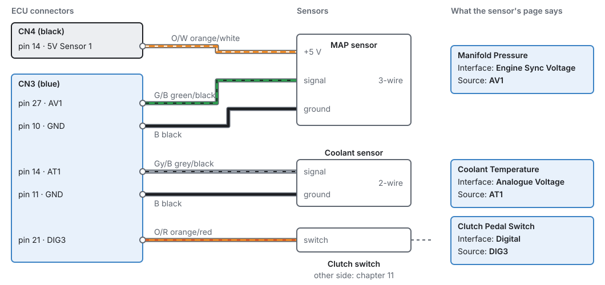
  <figcaption>Figure 17.4 — The example car's wiring, and how each wire appears on the sensor's page.</figcaption>
</figure>

### Step 1 — Switch the sensors on

Open **Configuration ▸ Sensors**. The page lists all 135 inputs by group. Tick the ones the car has.
A name in grey is switched off. Clicking a name opens that sensor's page.

<figure markdown>
  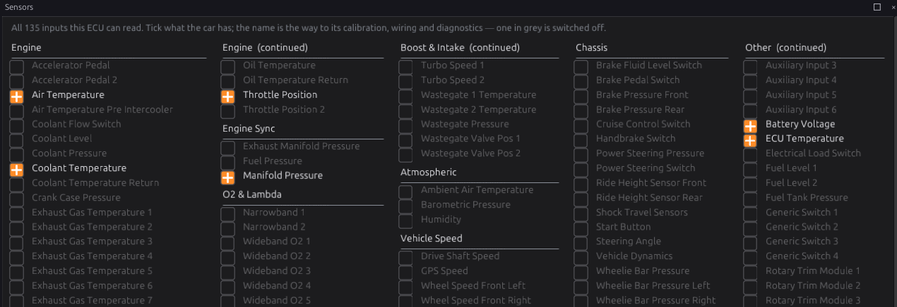
  <figcaption>Figure 17.5 — Configuration ▸ Sensors.</figcaption>
</figure>

Each group also has its own page, showing the live reading beside each enabled sensor:

<figure markdown>
  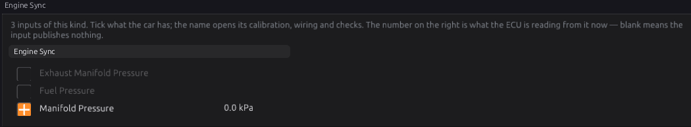
  <figcaption>Figure 17.6 — A group page. A blank reading means the input publishes nothing.</figcaption>
</figure>

### Step 2 — Set up one sensor

Open **Sensors ▸ Engine ▸ Coolant Temperature**. Every sensor page has the same layout.

<figure markdown>
  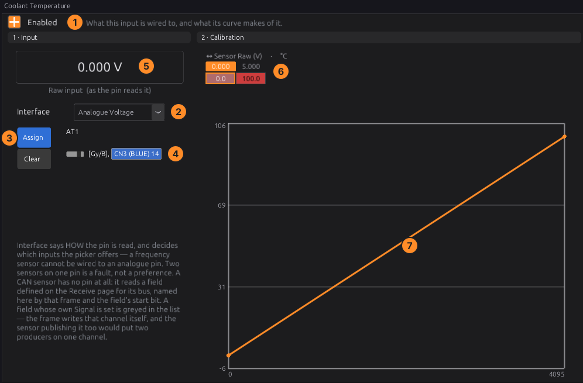
  <figcaption>Figure 17.7 — A sensor page. The numbers match the steps below.</figcaption>
</figure>

1. **Enabled**: on.
2. **Interface**: how it is read (Analogue Voltage for coolant).
3. **Assign** picks the input pin; **Clear** removes it. The list only shows pins that suit the
   interface.
4. The page then shows the pin, the wire colour and the connector pin number: here **AT1**, grey/black,
   **CN3 pin 14**.
5. **Raw input** shows what the pin reads now, in volts (or Hz, µs…), when the ECU is connected.
6. **Calibration**: the table of points. Raw values are shown in volts for a voltage input.
7. The curve of the same points. Right-click it for **Insert Point**, **Delete Point**,
   **Linearise**, **Save to File…**, **Load from File…**, **Apply Preset** and **Axis Setup…**.
   <!-- src: apps/studio-jf/src/surface/Surface.cpp -->

**Apply Preset** lists the calibration files whose units match this sensor: the presets that ship
with the studio (four common wideband controller mappings, for example) and your own, in the
`calibrations` folder of the studio's data folder (chapter 3). **Save to File…** puts a calibration
there, so a sensor you calibrate once can be applied to the next car in one click. Your own file wins
if it has the same name as a shipped one.
<!-- src: apps/studio-jf/src/surface/Surface.cpp (calibrationDir, shippedCalibrationDir, rebuildPresetMenu); apps/studio-jf/calibrations/ -->

**Calibrating a thermistor.** The temperature inputs AT1–AT4 each have a **2.7 kΩ pull-up** to 5 V
sensor supply 1. So a thermistor of resistance *R* reads:

**volts = 5 × R ÷ (R + 2700)**

Take the resistance at several temperatures from the sensor's data sheet, work out the volts for each,
and enter them as points: for example, 2500 Ω at 20 °C reads 5 × 2500 ÷ 5200 = **2.40 V**. A
thermistor's curve is far from straight, so use as many points as you can, closer together where the
engine spends its time (60–110 °C).
<!-- src: hardware/PDF_JAYTEK_2026-04-29/Temperature (R13-R16 2.7 kΩ to CON_5V_SENSOR1) -->

### Step 3 — Diagnostics

Open the sensor's **Diagnostics** page (under the sensor in the navigation).

<figure markdown>
  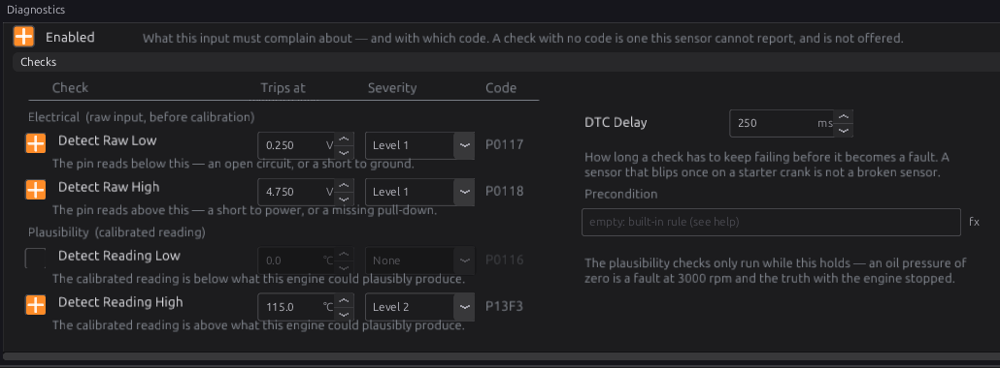
  <figcaption>Figure 17.8 — Coolant Temperature ▸ Diagnostics, set up as in Example 2.</figcaption>
</figure>

For each check: tick it, set where it trips, choose its severity. The code it raises is shown on the
right. Then set the **DTC Delay** and, for the reading checks, a **Precondition** if the check only
makes sense in some conditions.

Each threshold is shown and entered in the sensor's own units and precision: °C to 0.1 for a
temperature, kPa to 0.1 for a pressure, λ to 0.01 for lambda. The raw thresholds are shown in volts for
a voltage input (Hz for a frequency input, µs for a pulse width).
<!-- src: apps/studio-jf/src/model/Cache.cpp (typeScaledField); firmware/Integration/PipelineBuilder.h -->

### Step 4 — Manifold pressure

<figure markdown>
  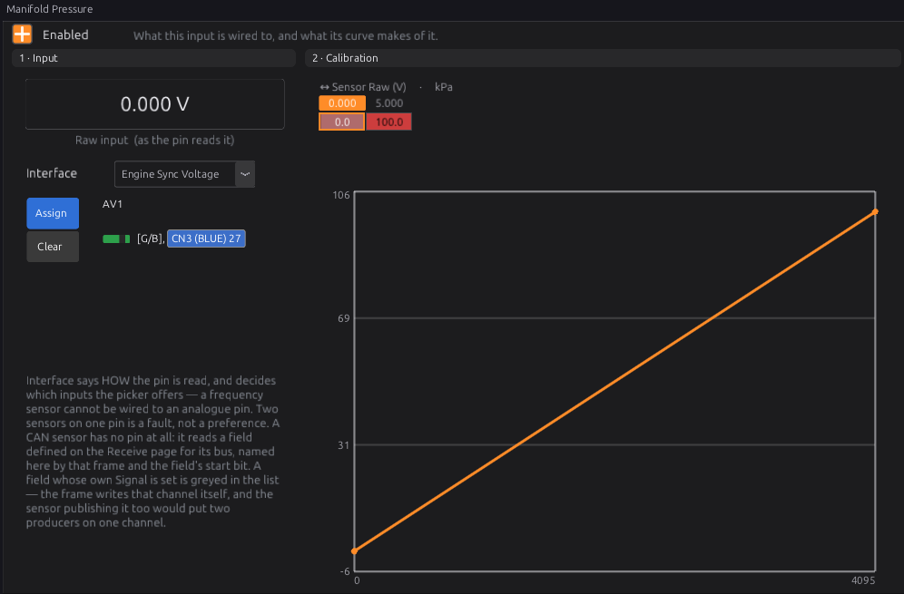
  <figcaption>Figure 17.9 — Manifold Pressure, read engine-synchronously.</figcaption>
</figure>

MAP is set up like any other sensor, but its Interface is **Engine Sync Voltage**. Enter the two points
from the sensor's data sheet (Example 1). Then check **Averaging Window** on **Engine Configuration ▸
Trigger System**:

<figure markdown>
  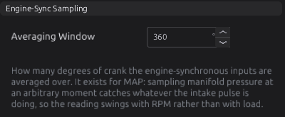{ width="400" }
  <figcaption>Figure 17.10 — The window every engine-sync input is averaged over.</figcaption>
</figure>

A window of one cylinder's firing interval (720 ÷ cylinders on a four-stroke) or a whole number of
them averages out the intake pulses. The default is 360°.

### Step 5 — Switches

A switch on a **digital** pin needs only its pin, and **Invert** if it pulls the line low when active.
A switch on an **analogue** pin shows **Switch On (V)** and **Switch Off (V)**: set On a little below
the voltage when the switch is active, and Off a little above the voltage when it is not.

<figure markdown>
  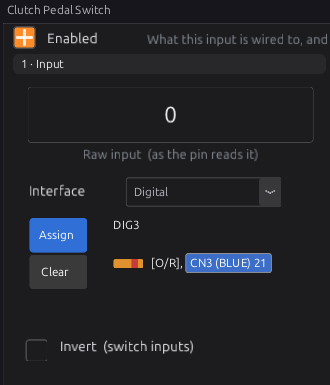
  <figcaption>Figure 17.11 — A switch on a digital pin.</figcaption>
</figure>

<figure markdown>
  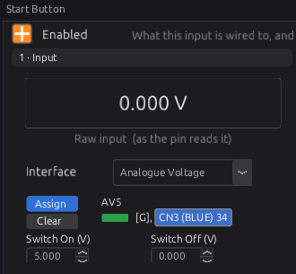
  <figcaption>Figure 17.12 — A switch on an analogue pin. The defaults (5 V and 0 V) must be set to
  your switch.</figcaption>
</figure>

A **multi-position switch**, such as the **Cruise Control Switch**, gets a band per position. With the
ECU connected, hold a button and press **Capture** on its row: the band is centred on what the ECU
reads. **+ Band** adds a position. Position 0 is rest, the one position that may be held indefinitely.

<figure markdown>
  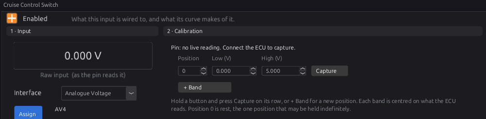
  <figcaption>Figure 17.13 — Capturing the bands of a multi-position switch.</figcaption>
</figure>

### Step 6 — Frequency, flex fuel, wideband

- A **Frequency** sensor's default calibration is 1:1 (Hz in, Hz out). Turning wheel pulses into road
  speed is the vehicle speed module's job (chapter 32).
  <!-- src: definition/ecu.schema.yaml -->
- **Flex Fuel Composition & Temperature** reads a flex-fuel sensor on a digital pin as a frequency.
  The frequency gives the ethanol content: enter your sensor's figures in the calibration (most read
  50 Hz for 0 % and 150 Hz for 100 %; check yours). The **pulse width** of the same signal gives the
  fuel temperature, fixed at 1.000 ms = −40 °C to 5.000 ms = 125 °C, published as `fuel_temp_flex`.
  A temperature outside −40…125 °C raises **P0182** or **P0183**.
  <!-- src: definition/ecu.schema.yaml (composition outputs) -->

<figure markdown>
  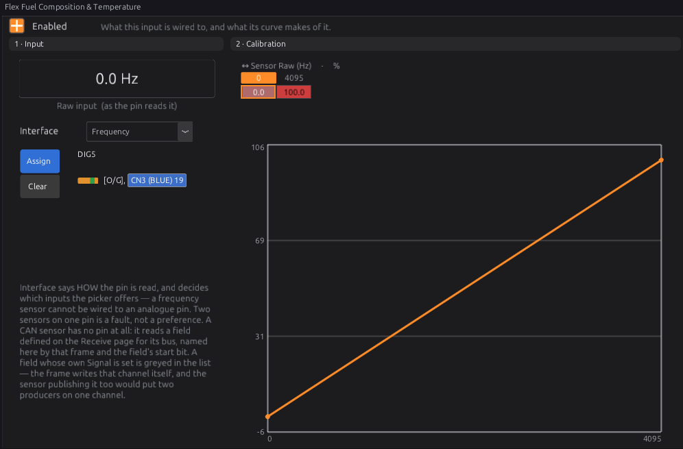
  <figcaption>Figure 17.14 — Flex fuel. The default calibration shown is a placeholder.</figcaption>
</figure>

- A **Wideband O2** read as an analogue voltage needs the controller's mapping: its manual gives the
  lambda at 0 V and at 5 V. The default is 0.50–1.50. Different controllers disagree by a lot at the
  same voltage (Figure 17.15), so never guess it. A controller on CAN avoids the question entirely.
  There are 15 wideband inputs: one per cylinder, two per bank and one overall. Which one closed loop
  uses is chosen on O2 Control (chapter 23).
  <!-- src: definition/ecu.schema.yaml (lambda default_cal, per_cylinder, extra: 3) -->

<figure markdown>
  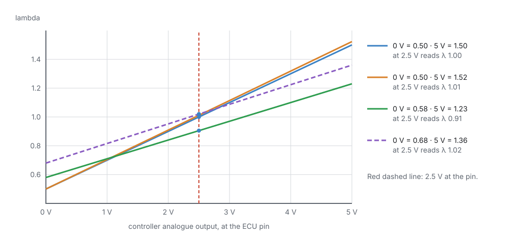
  <figcaption>Figure 17.15 — The same voltage, four different lambdas. The calibration must match the
  controller.</figcaption>
</figure>

## Worked examples

:material-circle:{ .level-intermediate } Intermediate

!!! example "Example 1 — a 3-bar MAP sensor on AV1"
    The sensor's data sheet says 0.5 V at 10 kPa and 4.5 V at 300 kPa, linear.

    | Setting | Value |
    |---|---|
    | Manifold Pressure ▸ Interface | Engine Sync Voltage |
    | Source | AV1 (CN3 pin 27) |
    | Calibration | two points: 0.500 V → 10.0 kPa, 4.500 V → 300.0 kPa |
    | Detect Raw Low / High | on, 0.25 V / 4.75 V (the defaults), Level 2 |

    Below 0.5 V the curve would hold 10 kPa, so a shorted signal would look like a real (if odd)
    reading. Raw Low catches it and marks MAP invalid, so fuelling falls back (chapter 19) instead of
    trusting it (Figure 17.2).

!!! example "Example 2 — coolant temperature on AT1"
    A two-wire thermistor to ground, calibrated from its resistance table (Step 2).

    | Check | Setting | Why |
    |---|---|---|
    | Detect Raw Low | on, Level 1 | a short to ground reads near 0 V |
    | Detect Raw High | on, Level 1 | an open circuit reads near 5 V through the pull-up |
    | Detect Reading High | on, Level 2, 115 °C | an overheating engine |

    Engine protection (chapter 29) decides what a Level 2 fault does, such as limiting engine speed.

!!! example "Example 3 — oil pressure only checked while running"
    | Setting | Value |
    |---|---|
    | Oil Pressure ▸ Detect Reading Low | on, Level 3, 100 kPa |
    | Precondition | `rpm > 1500` |
    | DTC Delay | 1000 ms |

    With the engine stopped, zero oil pressure is normal, so the precondition keeps the check quiet.
    Above 1500 rpm, less than 100 kPa for a full second is a fault at Level 3.

## Tuning it

:material-circle:{ .level-intermediate } Intermediate → :material-circle:{ .level-advanced } Advanced

Sensors are calibrated, not tuned. Check each one against a known reference:

- **MAP** with the engine off should read your barometric pressure (about 100 kPa at sea level).
- **Temperatures** should agree with each other on a cold engine that has stood overnight, and with a
  thermometer in hot water for a loose sensor.
- **Throttle** should read 0 % closed and 100 % wide open (the electronic throttle has its own
  calibration, chapter 22).
- **Wideband** should read about λ 1.00 at a steady cruise in closed loop, and the controller's own
  display (if it has one) should agree with the ECU.

Set diagnostics from what the sensor and wiring can really do. A check that trips on a healthy engine
teaches everyone to ignore it.

## Diagnostics

:material-circle:{ .level-intermediate } Intermediate

| Code | Meaning | What to check |
|---|---|---|
| The sensor's Raw Low / Raw High code (e.g. **P0107/P0108** MAP, **P0117/P0118** coolant, **P0122/P0123** throttle) | Electrical fault on the input | Wiring, connector, the 5 V supply, a short or open circuit |
| The sensor's Reading Low / High code (e.g. **P0105/P0106** MAP, **P0116** coolant) | Reading implausible | The calibration; the sensor; the thresholds |
| **P1800**–**P18xx** | Sensor enabled but no pin assigned | Assign the pin, or switch the sensor off |
| **P1650** | One pin claimed by two functions | Chapter 18 |
| **P0641** / **P0651** | 5 V sensor supply 1 / 2 down | A sensor or harness shorting its 5 V to ground (chapter 10) |
| **P0562** / **P0563** | Battery voltage low / high | Charging system, battery |
| **P0182** / **P0183** | Flex fuel temperature out of range | Flex sensor wiring |

<!-- src: definition/ecu.schema.yaml (dtc per sensor); firmware/Sensors/Sensors.cpp -->

Every sensor publishes its channel with a **valid** flag. A channel that is invalid or missing shows
blank on the group pages and on gauges, which is the first sign something is wrong.

## Troubleshooting

:material-circle:{ .level-basic } Basic → :material-circle:{ .level-advanced } Advanced

| Symptom | Likely causes | Check |
|---|---|---|
| Reading is blank | Sensor off; no pin assigned (P18xx); key off; 5 V supply down; pin conflict | Enabled; Assign; battery voltage above 8 V; P0641/P0651; P1650 |
| Reading is wrong by a constant ratio | Calibration wrong | The data sheet points; the raw input against the curve |
| Temperature wrong only when hot or only when cold | Too few calibration points for a thermistor | Add points across the range |
| All sensors on one connector read wrong together | Shared ground or 5 V supply fault | Grounds and supply (chapter 10) |
| MAP swings with engine speed at steady load | Averaging window too short | Averaging Window on the Trigger System page |
| A reading-high fault on a healthy sensor | Threshold set too close to normal readings | The threshold against logged readings |
| A switch never changes | Wrong pin; needs Invert; analogue trip points not set | Raw input while you press it; Switch On/Off voltages |
| Wideband reads a steady wrong lambda | Controller mapping wrong | The controller's manual; Figure 17.15 |

## Settings reference

Every Sensors setting, generated from the definition the studio loads:

--8<-- "reference/settings/_sensors.table.md"

## Related

- [Chapter 10 — Power, grounds and protection](../part2/10-power-grounds.md) (5 V supplies, key states)
- [Chapter 11 — Wiring sensors](../part2/11-wiring-sensors.md)
- [Chapter 18 — Outputs and the pin system](18-outputs.md) (pin conflicts)
- [Chapter 19 — Fuel](19-fuel.md) (what happens when MAP, TPS or a temperature is missing)
- [Chapter 29 — Engine protection](29-protection.md) (what each severity level does)
- [Chapter 33 — CAN configuration](33-can-config.md) (sensors read from CAN)
- [Chapter 34 — Generic tables and expressions](34-tables-expressions.md) (precondition expressions)
- [Sensor types reference](../reference/sensor-types.md)
