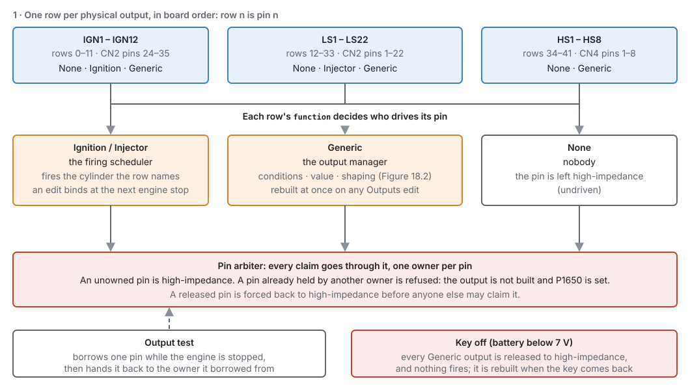
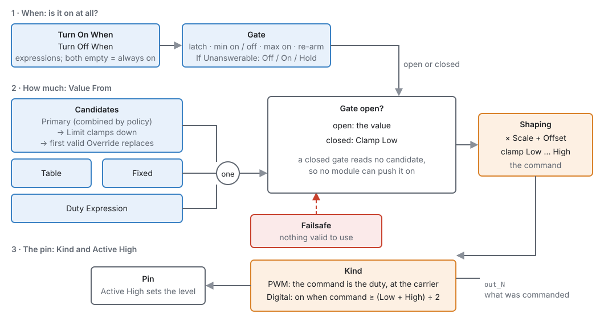
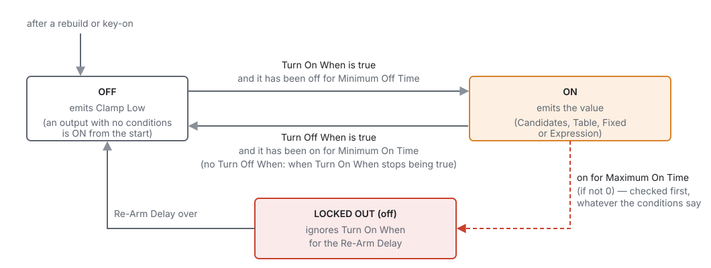
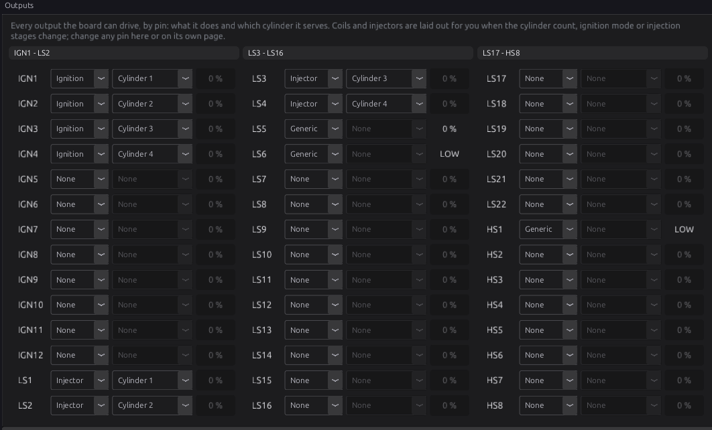
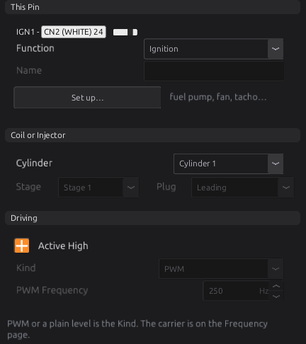
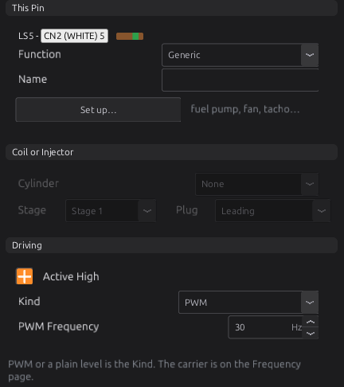
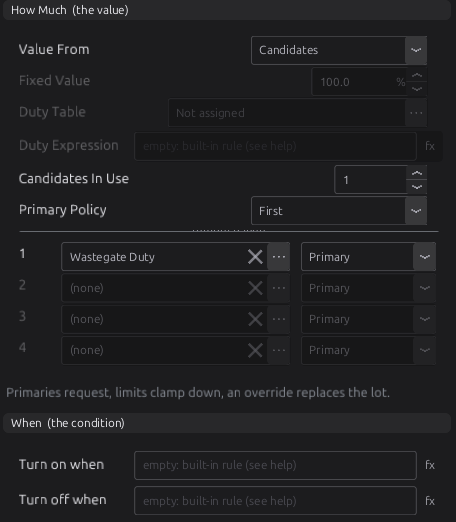
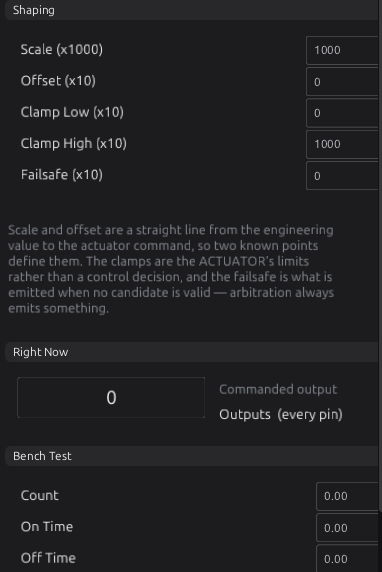
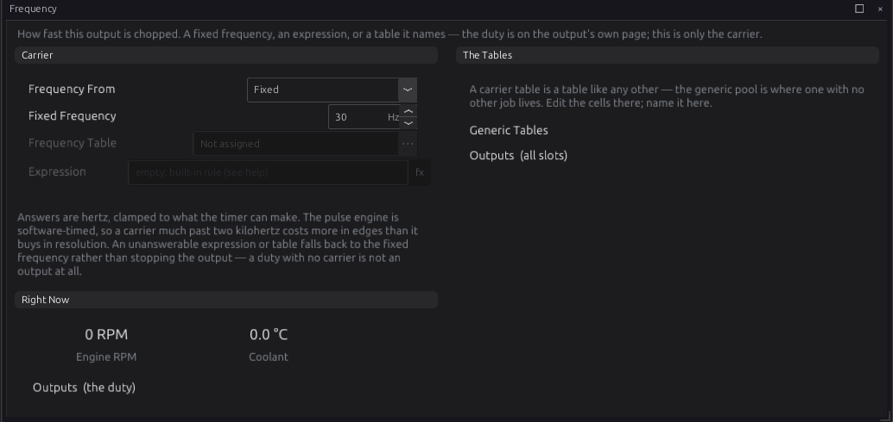

# Outputs and the pin system

:material-circle:{ .level-basic } Basic → :material-circle:{ .level-advanced } Advanced

> **In one sentence:** every output pin on the ECU has one row in the tune that says what the pin
> does: fire a coil, open an injector, or drive a load such as a pump, fan or solenoid from
> conditions and a value you choose.

## What it does

:material-circle:{ .level-basic } Basic

The ECU has 42 output pins you can wire to: twelve ignition outputs (**IGN1–IGN12**), twenty-two
low-side outputs (**LS1–LS22**) and eight high-side outputs (**HS1–HS8**). A low-side output switches
the load's ground; a high-side output switches its supply. Chapter 12 covers how to wire each kind.
<!-- src: definition/boards/jaytek_v1.board.yaml (IGN, LS, HS pins); definition/ecu.schema.yaml -->

In the tune, each of those pins has **one row**, in board order: the twelve IGN pins first, then the
twenty-two LS pins, then the eight HS pins. A row's **Function** says what its pin does:

| Function | What the pin does | Which pins can do it |
|---|---|---|
| **None** | Nothing. The pin is not driven. | all |
| **Ignition** | Fires a coil for the cylinder the row names. | IGN pins only |
| **Injector** | Opens an injector for the cylinder the row names. | LS pins only |
| **Generic** | Drives a load from its own conditions and value: a fuel pump, a fan, a boost solenoid, a tachometer. | all |

<!-- src: definition/ecu.schema.yaml (function); codegen/codegen.py (per-pin function options: IGN [0,1,3], LS [0,2,3], HS [0,3]) -->

Because a row *is* its pin, one pin can never be given two jobs. This is the **pin system**: the tune
says what each pin does, and the ECU makes sure only one part of the firmware drives each pin.

You do not normally set the coil and injector rows yourself. When you set the cylinder count, engine
cycle, ignition mode or injection stages (chapter 15), the studio lays them out for you. What you do set up here is
everything else: every pump, fan, relay, valve and gauge the ECU drives.
<!-- src: apps/studio-jf/src/model/EngineOutputLayout.h; apps/studio-jf/src/model/EngineOutputLayout.cpp -->

Boost control, idle control, cam control and other modules work out *how much* they want (a
wastegate duty, an idle valve duty). They do not own a pin. A Generic output delivers that demand to
the pin you wired the valve to. This chapter shows how.

The two H-bridges (**Half Bridge A** and **B**) are not rows. They are owned by the H-bridge module and
set up with the electronic throttle and idle stepper (chapters 21 and 22).
<!-- src: definition/ecu.schema.yaml -->

## How it works

:material-circle:{ .level-intermediate } Intermediate

### 1 · Who drives each pin

<figure markdown>
  
  <figcaption>Figure 18.1 — Each row's Function decides which part of the firmware drives its pin.
  Every claim goes through the pin arbiter, which allows one owner per pin and leaves every unowned
  pin undriven.</figcaption>
</figure>

- **Ignition and Injector rows** belong to the firing scheduler. It fires exactly what the rows say.
  It does not invent outputs or move them. A cylinder no row names gets no spark or no fuel, and the
  ECU raises a trouble code for it (see *Diagnostics*).
- **Generic rows** belong to the output manager, which runs each one every millisecond (Figure 18.2).
- **None rows** are left alone. The pin stays high-impedance: not driven high, not driven low.
  <!-- src: firmware/Scheduler/OutputMap.h; firmware/Integration/OutputManager.h; firmware/Scheduler/PinArbiter.h; firmware/Engine/EngineTask.cpp (OUTPUT phase at 1 kHz) -->

Every owner claims its pin from the **pin arbiter** first. The arbiter keeps one owner per pin. A pin
nobody owns, or that an owner lets go of, is forced back to high-impedance. A claim for a pin that
someone else still holds is refused: the output is not built at all, and the ECU sets **P1650**. A pin
can only have one Function, so this happens only when you change a coil or injector row to Generic while
the engine runs: the firing scheduler keeps the pin until the engine stops (see *When changes take
effect* below).
<!-- src: firmware/Scheduler/PinArbiter.h; firmware/Integration/OutputManager.cpp -->

!!! info "Advanced — the output test is an owner too"
    The bench output test borrows a pin from whoever holds it, drives it, and hands it back to the same
    owner when it finishes. It does this only while the engine is stopped. Handing a coil back to
    "nobody" would leave that cylinder without spark on the next start.
    <!-- src: firmware/Scheduler/PinArbiter.h; firmware/Engine/Modules/OutputTest.cpp -->

### 2 · What a Generic output does

A Generic output answers three questions every millisecond: **is it on**, **how much**, and **at what
frequency**.

<figure markdown>
  
  <figcaption>Figure 18.2 — One Generic output, every millisecond. Blue is what you ask for, orange is
  what is driven, red is the failsafe. The gate decides whether it is on; Value From decides how much.
  </figcaption>
</figure>

**Is it on?** Two conditions, **Turn On When** and **Turn Off When**, are expressions such as
`clt > 95`. They feed a **gate** that remembers its state and applies the timing rules (Figure 18.3).
If both conditions are empty, the output has no gate: it is always on, and its value alone decides what
the pin does.
<!-- src: firmware/Integration/OutputManager.cpp -->

**How much?** **Value From** picks one source:

- **Candidates**: bus channels that modules publish, such as **Wastegate Duty** `wastegate_duty`
  (section 3).
- **Table**: a table you name, read at its own axes. The eight Generic Tables exist for this
  (chapter 34).
- **Fixed**: a constant, such as 100 % for a relay.
- **Expression**: a formula whose number is the duty, such as `clt * 2 - 100`.
  <!-- src: firmware/Integration/OutputManager.cpp; definition/ecu.schema.yaml -->

While the gate is **closed**, the output ignores its source and sends **Clamp Low** instead. A closed
gate does not even read its candidates, so no module can push an output on that its conditions say is
off.
<!-- src: firmware/Pipeline/OutputStages.h; firmware/Integration/OutputManager.cpp -->

The value then goes through **Shaping**: it is multiplied by **Scale**, **Offset** is added, and the
result is held between **Clamp Low** and **Clamp High**. What comes out is the **command**.
<!-- src: firmware/Pipeline/OutputStages.h; firmware/Integration/OutputManager.cpp -->

**At what frequency, and what level?** **Kind** decides how the command reaches the pin:

- **PWM**: the command is a duty cycle in per cent, switched at the output's carrier frequency. The
  carrier can be fixed, looked up in a table, or computed (the **Frequency** page).
- **Digital**: the pin is on or off. It is **on when the command is at least halfway between Clamp
  Low and Clamp High**. With the default clamps (0 and 100 %) that is 50 %.
  <!-- src: firmware/Integration/OutputManager.cpp; firmware/Integration/EmitSinks.h -->

**Active High** sets which electrical level means "on". The live command is published as a channel for
each pin (**IGN1** `out_1` … **HS8** `out_42`), so you can watch and log every output.
<!-- src: firmware/Integration/OutputManager.cpp; definition/ecu.schema.yaml -->

### 3 · Candidates: how a module's demand reaches a pin

A module that wants an actuator moved publishes a **demand** on the bus. For example, Boost publishes
**Wastegate Duty** `wastegate_duty`, and Idle publishes **Idle Duty** `idle_duty`. A Generic output with
**Value From** set to *Candidates* lists up to four channels, each with a **Role**:

| Role | What it does |
|---|---|
| **Primary** | Makes the request. If more than one primary is valid, **Primary Policy** combines them: *First* (the first valid one, in list order), *Average*, *Minimum* or *Maximum*. |
| **Limit** | Clamps the result **down**. The lowest valid limit wins, so a limit can hold the output back but never push it up. |
| **Override** | Replaces everything. The first valid override wins. |

The order is fixed: primaries first, then limits, then overrides. The role alone decides who has
authority; where a candidate sits in the list only matters between primaries under *First*, and
between overrides.
<!-- src: firmware/Pipeline/OutputStages.h; definition/ecu.schema.yaml -->

**Valid** is the key word. A channel is valid while its module keeps publishing it. A module with
nothing to say stops publishing, and its candidate is then skipped. It is not read as zero. For
example, Boost publishes nothing below its activation RPM and pressure. **If no candidate is valid,
the output sends its Failsafe value.**
<!-- src: firmware/Engine/Modules/Boost.cpp; firmware/Pipeline/OutputStages.h -->

!!! example "How the roles combine"
    Four candidates: primary A = 40 %, primary B = 55 %, limit L = 50 %, override O.

    | Case | Result |
    |---|---|
    | Policy *First*, O not valid | 40 % (A; L does not reduce it) |
    | Policy *Maximum*, O not valid | 50 % (B would be 55, L clamps it to 50) |
    | O valid and reading 0 % | 0 % (the override replaces the lot) |
    | No candidate valid | the Failsafe value |

!!! info "Advanced — a limit with no valid primary"
    The starting value is the Failsafe. If no primary is valid but a limit is, the result is the
    Failsafe or the limit, whichever is lower. An override that is always published (a 0/1 flag that
    every frame reads 0 or 1) is always valid, so it always replaces everything. An override is useful
    only for a channel that goes quiet when it has nothing to say.
    <!-- src: firmware/Pipeline/OutputStages.h -->

### 4 · The gate: on, off and the timers

<figure markdown>
  
  <figcaption>Figure 18.3 — The gate. Two conditions give hysteresis; the minimum times stop chatter;
  the maximum on time and re-arm delay bound anything that must not run for ever.</figcaption>
</figure>

- **Two conditions give hysteresis.** A fan that turns on above 95 °C and off below 90 °C keeps its
  state between the two. With only **Turn On When**, the output turns off as soon as the condition
  stops being true.
- **Minimum On Time / Minimum Off Time**: once the output changes state, it holds that state at least
  this long.
- **Maximum On Time** (0 = no limit): after this long on, the output turns off **whatever the
  conditions say** and is locked out for the **Re-Arm Delay**. It is checked before anything else.
  <!-- src: firmware/Integration/OutputGate.h; firmware/Integration/OutputManager.cpp -->

**If Unanswerable** decides what happens when a condition cannot be worked out, for example because it
reads a sensor that has failed or was never wired. *Off* turns the output off, *On* turns it on, *Hold*
keeps its last state. A cooling fan should fail *On*; a starter or fuel pump should fail *Off*.
<!-- src: firmware/Integration/OutputGate.h; firmware/Integration/OutputManager.cpp; definition/ecu.schema.yaml -->

### 5 · When changes take effect

- **Coil and injector rows** (Function, Cylinder, Stage, Plug, Active High) take effect at the **next
  engine stop**. A row edited while the engine runs changes nothing until then.
  <!-- src: firmware/main.cpp; firmware/Scheduler/EnginePositionHal.h; firmware/Scheduler/OutputMap.h -->
- **Generic rows** take effect **at once**. Any edit to any Outputs setting rebuilds every Generic
  output: each pin is released, forced undriven, and claimed again. Edits elsewhere in the tune (a
  fuel cell, a boost table) do not touch the outputs.
  <!-- src: firmware/Integration/OutputManager.h; firmware/Integration/OutputManager.cpp -->
- **Key off:** while battery voltage is below the key-on threshold (on above 8.0 V, off at 7.0 V or below),
  every Generic output is released and left undriven. On USB power alone, nothing is driven. The
  outputs are rebuilt when the key comes back.
  <!-- src: firmware/Integration/OutputManager.cpp; firmware/Sensors/Sensors.h; firmware/Sensors/Sensors.cpp -->

!!! info "Advanced — a rebuild starts every gated output from OFF"
    After a rebuild or key-on, an output that has conditions starts **off**, and its **Minimum Off
    Time** starts counting then. A fan with a 5 s minimum off time therefore stays off for 5 s after
    any Outputs edit. An output with no conditions is on at once.
    <!-- src: firmware/Integration/OutputManager.cpp; firmware/Integration/OutputGate.h -->

## Before you start

:material-circle:{ .level-basic } Basic

You need:

- **The loads wired**, each to a pin that can drive it (chapter 12). The pin page shows which connector
  and connector pin each output is on: LS5 is **CN2 pin 5**, for example.
  <!-- src: definition/boards/jaytek_v1.board.yaml (CN2) (CN4); apps/studio-jf/src/surface/widgets/PinWireWidget.cpp -->
- **The engine basics set** (chapter 15): cylinder count, engine cycle, **Ignition Mode** and the
  injection stages. These lay out your coil and injector rows.
- **The sensors your conditions read**, configured (chapter 17). A fan needs coolant temperature; a
  starter button needs its switch input.
- **The modules whose demands you deliver**, configured: Boost (chapter 24), Idle (chapter 21), cam
  control (chapter 25), and so on.

## Setting it up

:material-circle:{ .level-basic } Basic → :material-circle:{ .level-intermediate } Intermediate

The Outputs pages are under **Configuration ▸ Electrical ▸ Outputs**. The **Outputs** page shows every
pin at once. Each pin also has its own page (**Outputs ▸ LS5**) with a **Frequency** page under it.

### Step 1 — Check the coil and injector layout

1. Set the cylinder count, **Ignition Mode** and injection stages (chapter 15).
2. Open **Configuration ▸ Electrical ▸ Outputs** (Figure 18.4). The studio has laid out the coils and
   injectors by cylinder number.
3. Check each coil and injector row against your wiring. To change one, pick its **Function** and
   **Cylinder** here, or on the pin's own page.

<figure markdown>
  
  <figcaption>Figure 18.4 — The Outputs page for a 4-cylinder engine on coil-on-plug: IGN1–4 are the
  coils, LS1–4 the injectors. LS5 (boost solenoid), LS6 (fan) and HS1 (fuel pump) are Generic. The
  right-hand column is each pin's live command; a Digital output shows its level.</figcaption>
</figure>

The standard layout is by cylinder number. The firing order never moves an output:

| Setting | Rows it lays out |
|---|---|
| Coil-on-Plug | IGN*n* fires cylinder *n* |
| Wasted Spark | one coil per pair of cylinders, named by the lower cylinder of the pair, in cylinder order. On a 1-3-4-2 four, IGN1 = cylinder 1 (with 4), IGN2 = cylinder 2 (with 3). |
| Single Coil (distributor) | IGN1 = All Cylinders |
| Rotary | IGN*r* leading and IGN(4 + *r*) trailing for rotor *r*; with Single Coil, IGN1 (leading) and IGN5 (trailing) = All |
| Injectors | one block of LS pins per stage, starting at LS1. Sequential, Semi-Sequential and Sequential-Any-Sync stages get one injector per cylinder; a Bank stage splits its injectors between the banks; a Multi-Point stage's injectors are all *All Cylinders*. |

<!-- src: apps/studio-jf/src/model/EngineOutputLayout.h; apps/studio-jf/src/model/EngineOutputLayout.cpp -->

The studio re-lays the rows only when you change one of those settings. After that you can edit any
row by hand, and it stays as you left it. A pin that is already Generic is never taken: if the layout
wants it, that coil or injector moves to the next free pin of its class.
<!-- src: apps/studio-jf/src/model/EngineOutputLayout.cpp (place) (triggers) (apply, install) -->

!!! note "Wasted spark pairs are found at run time"
    Under wasted spark, a coil row names one cylinder, and the ECU also fires the cylinder half a
    cycle away from it. It works that companion out from the firing order each time it applies the
    tune, so changing the firing order re-pairs the coils without moving any output.
    <!-- src: definition/ecu.schema.yaml (ign_mode help) (cylinder) -->

<figure markdown>
  
  <figcaption>Figure 18.5 — A coil row on its own page. Cylinder is the only choice a coil needs;
  Plug is live only on a rotary, and Stage only for an injector.</figcaption>
</figure>

On a coil or injector row, the page offers:

- **Cylinder** `outputs.output[].cylinder`: the cylinder this coil or injector serves (on a rotary,
  the rotor). **All Cylinders** is a distributor coil or a multi-point injector. **Bank 1 / Bank 2**
  is an injector shared by every cylinder on that bank.
- **Stage** `inj_stage` (injectors): which injection stage it belongs to. A row in a stage beyond
  **Number of Injection Stages** is ignored.
- **Plug** `ign_plug` (rotary coils): the leading or trailing plug.
- **Active High**: see Step 3. Leave it ticked for coils and injectors on this board.
  <!-- src: definition/ecu.schema.yaml; firmware/Scheduler/OutputMap.h; definition/boards/jaytek_v1.dashboard.gui (Outputs/<pin> ▸ Coil or Injector panel) -->

### Step 2 — Give a pin a job

Open the pin's page, for example **Outputs ▸ LS5**. The page is in three columns. The left column is
the pin itself (Figure 18.6).

<figure markdown>
  
  <figcaption>Figure 18.6 — LS5 as a boost solenoid (Example 1). The label beside the pin name gives
  its connector and pin, CN2 pin 5, and its wire colour.</figcaption>
</figure>

1. **Function** `outputs.output[].function`: choose **Generic**. The rest of the page comes alive.
2. **Name** `name`: a short name for what is on the end of the wire ("Boost Sol", "Fan"). The pin
   name says where it is wired; this says what it is.
3. **Set up this output…**: opens the output wizard, which fills in the whole page from a template (Step 4).
   Use it for anything the wizard offers; set the page by hand for anything else.

### Step 3 — Driving: Kind, polarity, frequency

- **Active High** `active_high` (default ticked): which level means *on*, for every function. On
  this board every IGN, LS and HS output is switched on by a high level from the processor, so leave
  it ticked for a normal load. Untick it only to invert an output. Getting it wrong energises the load
  whenever it should be idle.
  <!-- src: definition/boards/jaytek_v1.board.yaml (polarity HIGH=dwell / HIGH=on); definition/ecu.schema.yaml -->
- **Kind** `kind`: *PWM* for something you modulate (a solenoid valve, a PWM pump, a gauge), *Digital*
  for something that is on or off (a relay, a lamp). A relay driven with PWM buzzes.
- **PWM Frequency** `pwm_freq_hz` (default 250 Hz, PWM only): the carrier. Set it for the load: the
  boost solenoid template uses 30 Hz. The **Frequency** page can make it a table or an expression
  instead (Step 9).
  <!-- src: definition/ecu.schema.yaml -->

!!! warning "At most 16 PWM outputs"
    PWM outputs are timed in software by one pulse engine with 16 channels, at 10 µs resolution. A
    17th Generic PWM output is not driven at all: its pin stays undriven. Make on/off loads *Digital*;
    a Digital output does not use a channel.
    <!-- src: firmware/Scheduler/SoftPwm.h; firmware/main.cpp; firmware/Integration/OutputManager.cpp -->

### Step 4 — The wizard (templates)

**Set up this output…** opens **Set Up LS5**. Pick what the output is on the left, answer its questions on the
right, and press **OK**. The wizard sets Function to Generic and writes the Kind, value, timings,
failure direction and both conditions. It shows the conditions it will write under **It will run**, so
you can read and edit them afterwards.
<!-- src: apps/studio-jf/src/ui/OutputWizardDialog.h; apps/studio-jf/src/model/OutputTemplate.cpp -->

The templates come from the firmware's own definition, so the list always matches what your ECU can
run. With this firmware they are:

| Template | Kind | Value | Fails | What it asks for |
|---|---|---|---|---|
| **Fuel Pump** | Digital | Fixed 100 % | Off | **Prime Time** (3 s), **Stop After** (1500 ms without a trigger tooth) |
| **Thermo Fan** | Digital | Fixed 100 % | On | **Switch On Above** (95 °C), **Switch Off Below** (90 °C); 5 s minimum on and off |
| **Thermo Fan with A/C** | Digital | Fixed 100 % | On | the same, plus the A/C request as a reason to run |
| **Variable-Speed Fan** | PWM 200 Hz | Generic Table 1 | On | switch-on and switch-off temperatures (92 / 86 °C); duty from the table |
| **Starter Motor** | Digital | Fixed 100 % | Off | **Maximum Crank** (10 s), **Rest Before Retry** (3 s); interlocks to tick: in neutral, clutch down, brake pressed |
| **Main Relay** | Digital | Fixed 100 % | On | nothing: on whenever the ECU is awake |
| **Shift Light** | Digital | Fixed 100 % | Off | **Light On Above** (6500 rpm), **Light Off Below** (6300 rpm) |
| **Tachometer** | PWM | Fixed 50 % | Off | **Pulses per Rev** (2), **Squelch Below** (60 rpm); frequency = rpm × pulses ÷ 60 |
| **Boost Solenoid (Wastegate)** | PWM 30 Hz | Candidate `wastegate_duty` | Off | **Stop Below RPM** (200) |
| **VVT Solenoid (Intake Bank 1)** … **(Exhaust Bank 2)** | PWM 250 Hz | Candidate `vvt_duty_1` … `vvt_duty_4` | Off | **Stop Below RPM** (200); four templates, one per cam (chapter 25) |
| **Power Steering Pump** | PWM 200 Hz | Fixed 100 % | Off | **Stop Below RPM** (200); 2 s min on, 1 s min off |
| **A/C Compressor Clutch** | Digital | Fixed 100 % | Off | **Cut Above Throttle** (90 %); 5 s min on, 10 s min off |

<!-- src: definition/ecu.schema.yaml (output_templates) -->

The full text of each template, with its conditions, is in the reference (*Output templates*).

- The numbers you enter land in the output's **Template Numbers** (A–D), and the conditions read them
  from there. Change a number later on the page, and the template still recognises the output as its
  own.
- **Switches it reads** lists the switch inputs the conditions use, and says **NOT WIRED** for any
  that is not set up. A condition that reads an unwired switch reads it as false, so an interlock you
  ticked but did not wire gives a starter that never cranks. The **inverted** box beside a wired
  switch is that sensor's own invert setting: changing it here changes it everywhere the switch is
  read.
  <!-- src: apps/studio-jf/src/ui/OutputWizardDialog.h; definition/ecu.schema.yaml -->

!!! danger "Check the starter's interlocks"
    The Starter Motor template latches: one press cranks until the engine runs or **Maximum Crank**
    runs out. On a manual gearbox, keep at least one interlock (neutral or clutch) ticked and wired,
    or the car can be started in gear.
    <!-- src: definition/ecu.schema.yaml -->

### Step 5 — How Much: the value

The middle column decides the value (Figure 18.7). Only the controls for the chosen source are live.

<figure markdown>
  
  <figcaption>Figure 18.7 — LS5 takes its value from one candidate, Wastegate Duty, as Primary. With
  both conditions empty the output has no gate; Boost alone decides when there is a duty to deliver.
  </figcaption>
</figure>

- **Value From** `value_source`: *Candidates* (default), *Table*, *Fixed* or *Expression*.
- **Fixed Value** `fixed_x10` (Fixed; default 100 %): the constant sent while the output is on.
- **Duty Table** `duty_table_sel` (Table): pick the table. It is read at its own axes. With no table
  chosen, the output sends its Failsafe.
- **Duty Expression** `duty_expr` (Expression): the number it returns is the duty. If it cannot be
  worked out, the output sends its Failsafe.
- **Candidates In Use** `n_cand` (Candidates, 0–4) and **Primary Policy** `primary_policy`: how many
  of the four candidate rows are used, and how several valid primaries combine.
- **Candidate rows 1–4** `cand[].sig`, `cand[].role`: the channel (pick it with **…**, clear it with
  **×**) and its **Role**.
  <!-- src: definition/ecu.schema.yaml; firmware/Integration/OutputManager.cpp -->

### Step 6 — When: the conditions

- **Turn on when** `on_expr` and **Turn off when** `off_expr`: expressions that read any channel or
  setting. Leave both empty for an output driven by its value
  alone. Leave **Turn off when** empty for a plain switch. Chapter 34 covers the expression language.
  <!-- src: definition/ecu.schema.yaml -->

### Step 7 — Template Numbers and Timing

- **Template Numbers A–D** `param_a` … `param_d`: the numbers a template's conditions read. What each
  means is shown on the wizard that set it.
- **Timing** (left column, under Driving): **Minimum On Time** `min_on_ms`, **Minimum Off Time**
  `min_off_ms`, **Maximum On Time** `max_on_ms` (0 = no limit), **Re-Arm Delay** `rearm_ms`, all in
  ms up to 65535, and **If Unanswerable** `on_invalid` (*Off*, *On* or *Hold*). How they work is in
  Figure 18.3.
  <!-- src: definition/ecu.schema.yaml -->

### Step 8 — Shaping, and what the output is doing now

The right column shapes the command, shows it live, and holds the bench test (Figure 18.8).

<figure markdown>
  
  <figcaption>Figure 18.8 — Shaping at its defaults: ×1, no offset, clamped 0–100 %, failsafe 0 %.
  Right Now is the live command. The Test, Stop and Stop All buttons sit below the Bench Test fields.
  </figcaption>
</figure>

These five fields are stored as whole numbers, and the page shows them as stored:

| Field | Stored as | Default | Means |
|---|---|---|---|
| **Scale (x1000)** `scale_x1000` | thousandths | 1000 | × 1.000 |
| **Offset (x10)** `offset_x10` | tenths of a per cent | 0 | + 0.0 % |
| **Clamp Low (x10)** `clamp_lo_x10` | tenths of a per cent | 0 | 0.0 % |
| **Clamp High (x10)** `clamp_hi_x10` | tenths of a per cent | 1000 | 100.0 % |
| **Failsafe (x10)** `failsafe_x10` | tenths of a per cent | 0 | 0.0 % |

<!-- src: definition/ecu.schema.yaml; firmware/Integration/OutputManager.cpp -->

- **Scale** and **Offset** convert the value into what the hardware wants: command = value × scale +
  offset. The defaults pass the value through unchanged.
- **Clamp Low / Clamp High** are the actuator's own limits. Nothing upstream can command past them.
  Clamp Low is also what a closed gate sends, and for a Digital output the switching point is halfway
  between the two.
- **Failsafe** is what the output sends when it has nothing valid to use: no candidate valid, no table,
  or an expression that cannot be worked out. Choose it as the **safe state of the load**, not "off"
  by habit.
  <!-- src: firmware/Pipeline/OutputStages.h; firmware/Integration/OutputManager.cpp -->

**Right Now** shows the live command for this pin, the same value as its `out_N` channel. For a PWM
output that is its duty. For a Digital output the channel reads 100 when the pin is on and 0 when it
is off, and the Outputs page shows it as a level.
<!-- src: firmware/Integration/OutputManager.cpp -->

### Step 9 — The Frequency page

Each pin has a **Frequency** page (**Outputs ▸ LS5 ▸ Frequency**) for its PWM carrier (Figure 18.9). A
Digital output ignores it.

<figure markdown>
  
  <figcaption>Figure 18.9 — The Frequency page. Fixed is right for almost every load; Table and
  Expression are for loads whose frequency is the signal, such as a tachometer.</figcaption>
</figure>

- **Frequency From** `freq_source`: *Fixed* (the **Fixed Frequency**, the same setting as PWM
  Frequency), *Table* or *Expression*.
- **Frequency Table** `freq_table_sel` and **Expression** `freq_expr`: the answer is in Hz. It is
  limited to 1–50000 Hz. If it cannot be worked out, or is below 1 Hz, the output falls back to the
  fixed frequency rather than stopping.
  <!-- src: firmware/Integration/OutputManager.cpp; definition/ecu.schema.yaml -->

!!! tip "Keep the carrier low"
    The pulse engine counts in 10 µs steps. At 250 Hz a period is 400 steps, so the duty resolves to
    0.25 %. At 2 kHz it is 50 steps, or 2 % per step. The studio's own advice is to stay under about
    2 kHz.
    <!-- src: firmware/main.cpp (100 kHz tick); firmware/Scheduler/SoftPwm.h; definition/boards/jaytek_v1.dashboard.gui (Outputs/<pin>/Frequency note) -->

### Step 10 — Test it

With the engine stopped, the **Bench Test** panel on each pin page fires that output:

1. Set **Count** (how many times), **On Time** and **Off Time** in ms.
2. Press **Test**. What happens depends on the row's Function:
    - an **Ignition** row charges the coil for On Time and releases it: the release is the spark;
    - an **Injector** row opens the injector for On Time;
    - anything else is switched on for On Time.
3. **Stop** ends this pin's test; **Stop All** ends every test.
   <!-- src: firmware/Engine/Modules/OutputTest.h; firmware/Engine/Modules/OutputTest.cpp; definition/boards/jaytek_v1.dashboard.gui (Bench Test panel: test <row> / test <row> 0 0 0 / test 255 0 0 0) -->

The ECU enforces the safety rules, not the studio:

- **Engine stopped only.** If the engine starts turning, every test is cancelled at once.
- **It ends on its own.** A test stops after Count pulses, or after (On + Off) × Count + 1 s, and never
  later than 10 minutes, even if the studio disconnects.
- **Count 0 means stop.** If Count is 0, **Test** stops the output instead of firing it.
- **On Time 0 lets the ECU choose:** 3 ms for a coil, 4 ms for an injector, 2 s for anything else.
  **Off Time 0** becomes 500 ms when Count is more than 1.
- **Active High is respected**, so "off" leaves the load off.
  <!-- src: firmware/Engine/Modules/OutputTest.h; firmware/Engine/Modules/OutputTest.cpp -->

!!! danger "The ECU does not limit the dwell"
    On Time is used exactly as you set it, on a coil too. A coil held on for a long On Time saturates,
    and can overheat the coil or its driver. Keep coil tests to a few milliseconds.
    <!-- src: firmware/Engine/Modules/OutputTest.h -->

!!! info "Advanced — what the buttons send"
    The buttons send the ECU the command `test <row> <count> <on_ms> <off_ms>`, and the ECU's reply
    appears in the **ECU Console**: what was applied, or **REFUSED** if the row is out of range or the
    pin could not be taken. The row is counted from 0: IGN1 is 0, LS1 is 12, LS5 is 16, HS1 is 34.
    <!-- src: firmware/Cli/CliCommands.cpp -->

Finally, burn the tune.

## Worked examples

:material-circle:{ .level-intermediate } Intermediate

These are the settings as the page shows them. Check each against your own wiring and hardware.

!!! example "Example 1 — boost solenoid on LS5, driven by Boost Control"
    A 3-port wastegate solenoid on LS5. Boost Control (chapter 24) publishes **Wastegate Duty**; this
    output delivers it.

    | Setting | Value | Why |
    |---|---|---|
    | Function | Generic | |
    | Kind | PWM | a modulated valve |
    | PWM Frequency | 30 Hz | the boost solenoid template's value |
    | Value From | Candidates | the duty comes from Boost |
    | Candidates In Use / 1 | 1 / Wastegate Duty, Primary | |
    | Turn on when / Turn off when | empty | Boost already decides when to ask |
    | Failsafe (x10) | 0 | solenoid off: see below |

    This is the setup in Figures 18.6–18.9. When Boost is off or below activation, it publishes
    nothing, the candidate is not valid, and the output sends its failsafe of 0 %. The
    **Boost Solenoid (Wastegate)** template does the same, and adds two conditions: on above the
    cranking threshold, off below 200 rpm.

    The template's reasoning for the failsafe: on a conventionally plumbed 3-port valve, 0 % leaves the
    wastegate on its spring, which is the least boost. Check that against your own plumbing.
    <!-- src: definition/ecu.schema.yaml -->

!!! example "Example 2 — fuel pump on HS1 and thermo fan on LS6, from templates"
    Both come from the wizard (Step 4).

    | Output | Template | Numbers | What you get |
    |---|---|---|---|
    | HS1 "Fuel Pump" | Fuel Pump | Prime Time 3 s, Stop After 1500 ms | Digital, on for 3 s at key-on, then on while trigger teeth are arriving; off 1.5 s after the last tooth. Fails **off**. |
    | LS6 "Fan" | Thermo Fan | On Above 95 °C, Off Below 90 °C | Digital, on above 95 °C, off below 90 °C, at least 5 s on and 5 s off. Fails **on** if coolant temperature is lost. |

    The pump watches trigger teeth, not sync, so the rail is up before the decoder locks, and the pump
    stops when the engine stops however it stopped.
    <!-- src: definition/ecu.schema.yaml -->

!!! example "Example 3 — nitrous solenoid from a 0/1 flag"
    Nitrous publishes **Nitrous Active** `nitrous_active` as 0 or 1 (chapter 28). Wire the solenoid's
    relay to LS8.

    | Setting | Value | Why |
    |---|---|---|
    | Function / Kind | Generic / Digital | a relay is on or off |
    | Value From | Candidates: Nitrous Active, Primary | |
    | Clamp High (x10) | **10** (1.0) | moves the switching point to 0.5 |
    | Failsafe (x10) | 0 | no signal, no nitrous |
    | If Unanswerable | Off | |

    The Clamp High change is the important one. A Digital output switches on halfway between its
    clamps. With the default clamps (0 and 100) that is 50, and a flag that reads 1 never reaches it.
    With Clamp High at 1.0 the switching point is 0.5, and the flag works.
    <!-- src: firmware/Engine/Modules/Nitrous.cpp; firmware/Integration/OutputManager.cpp -->

!!! example "Example 4 — tachometer on LS7"
    From the **Tachometer** template: Pulses per Rev **2** (a 4-cylinder tacho), Squelch Below
    **60 rpm**.

    It writes: Kind *PWM*, Value From *Fixed* **50 %**, **Frequency From** *Expression*
    `rpm * pulses / 60`, on above 60 rpm and off at or below it. At 3000 rpm the output runs at
    100 Hz. Below the squelch the output is off, because the carrier cannot go below 1 Hz. How to wire
    the tacho input is in chapter 14.
    <!-- src: definition/ecu.schema.yaml; apps/studio-jf/src/model/OutputTemplate.cpp -->

## Tuning it

:material-circle:{ .level-intermediate } Intermediate → :material-circle:{ .level-advanced } Advanced

An output has little to tune. What matters is that it does what you meant, including when something
fails.

**Log these channels** (chapter 42): the pin's own channel (`out_1` … `out_42`), the channel it reads
(for example `wastegate_duty`), and every channel its conditions read. The Standard datalog template
leaves the output channels out, so add the ones you need.
<!-- src: definition/ecu.schema.yaml -->

1. **Test every output with the bench test** before the engine first runs. Listen for each injector,
   check each coil sparks on the cylinder you expect, and watch each relay.
2. **Check polarity.** With the key on and the output commanded off, the load must be off. If a load
   runs when it should be idle, **Active High** is wrong.
3. **Set the PWM frequency** from the valve's data or the template. A valve driven too fast only sees
   the average and stops responding. A valve driven too slowly can buzz or move with each pulse.
   <!-- src: definition/ecu.schema.yaml -->
4. **Set the clamps** to the range the actuator may be commanded. Clamp Low is also what a closed gate
   sends, and the failsafe is held above it too, so raise it only for a load that must never be fully
   off.
5. **Decide each failure direction.** Unplug the sensor a condition reads and check that the output
   does what **If Unanswerable** says. Stop the module that feeds a candidate and check the Failsafe.

!!! warning "Failsafe and a closed gate go through Shaping"
    The Failsafe value and a closed gate's Clamp Low both pass through Scale and Offset before they
    reach the pin. With the defaults this changes nothing. If you set an Offset or a Scale other than
    ×1, check the pin's `out_N` channel with the gate closed and with the source removed, and adjust.
    <!-- src: firmware/Pipeline/OutputStages.h; firmware/Integration/OutputManager.cpp -->

## Diagnostics

:material-circle:{ .level-intermediate } Intermediate

| Code | Meaning | What sets it | What to check |
|---|---|---|---|
| **P1650** | Config: pin / output conflict | A Generic output could not take its pin because the firing scheduler still holds it. It also covers input pin clashes (chapter 17). | You changed a coil or injector row to Generic with the engine running. Stop the engine: the scheduler lets go, the output is built, and the code clears. |
| **P1653** | A cylinder in the firing order has no coil output | No Ignition row serves a cylinder in the firing order | The coil rows on the Outputs page. A cleared row means no spark on that cylinder. |
| **P1654** | A cylinder in the firing order has no stage 1 injector output | No stage 1 Injector row serves a cylinder in the firing order | The injector rows and their Stage. |

<!-- src: firmware/Integration/OutputManager.cpp; firmware/Engine/EngineTask.cpp; definition/ecu.schema.yaml -->

P1650 is severity level 1. P1653 and P1654 are level 3, and are checked against the rows the ECU has
applied, so they change only at an engine stop. What each level does is set in the tune (chapters 29
and 44).
<!-- src: firmware/Engine/EngineTask.cpp; firmware/Diagnostics/Dtc.h -->

**Output channels:** one per pin, labelled with the pin name, in the **Outputs** category: `out_1`
to `out_12` are IGN1–IGN12, `out_13` to `out_34` are LS1–LS22, and `out_35` to `out_42` are HS1–HS8.
Each is the command after the gate, arbitration and shaping, in 0.5 % steps. Only Generic outputs
publish one; a coil, an injector or an unused pin reads as not valid.
<!-- src: shared/tuneit-meta.json telemetry out_1..out_42; definition/ecu.schema.yaml; firmware/Integration/OutputManager.cpp -->

## Troubleshooting

:material-circle:{ .level-basic } Basic → :material-circle:{ .level-advanced } Advanced

| Symptom | Likely causes | Check |
|---|---|---|
| No Generic output does anything on the bench | Key off: on USB power alone, or with the battery below the key-on threshold, every Generic output is left undriven | Power the ECU from 12 V; key-on is decided from battery voltage |
| Output never comes on | Function not Generic; a condition reads an unwired switch; the Value source is empty | Function; the wizard's **Switches it reads** list; `out_N`; Value From and its source |
| Digital output never comes on from a 0/1 channel | The switching point is halfway between the clamps: 50 by default | Set Clamp High (x10) to 10 (Example 3) |
| Output always at its failsafe | No valid candidate (the module is off or not asking); no table chosen; the expression cannot be answered | The candidate channel in the Dashboard or log; **Duty Table**; the expression |
| Load runs when it should be off | **Active High** backwards; Failsafe set to on | Active High; Failsafe (x10) |
| Fan stays off for a few seconds after you change an output setting | Every Outputs edit rebuilds the outputs; a gated output restarts off and waits its Minimum Off Time | Expected (see *When changes take effect*) |
| A PWM output does nothing, others work | More than 16 Generic PWM outputs; PWM Frequency set to 0 | Make on/off loads Digital; set the frequency |
| Coil or injector edit has no effect | Firing rows apply at the next engine stop | Stop the engine |
| P1650 after changing a row | A coil or injector row changed to Generic while running | Stop the engine |
| P1653 / P1654 | A cylinder has no coil or no stage 1 injector | The rows on the Outputs page; re-set Ignition Mode or the stages to re-lay them |
| Engine cranks, no spark or no fuel, no codes | **Ignition Outputs** or **Injector Outputs** switched off (they survive a reset) | Chapter 15 |
| Bench test does nothing | Count is 0 (that means stop); the engine is turning | Count; `rpm` |
| Tacho reads wrong | Pulses per Rev wrong for the gauge | Most 4-stroke tachos want half the cylinder count |

<!-- src: firmware/Integration/OutputManager.cpp; firmware/Scheduler/SoftPwm.h; firmware/Integration/EmitSinks.h; definition/ecu.schema.yaml; firmware/Engine/Modules/OutputTest.cpp -->

## Settings reference

The output settings are one row per pin, so they are listed here by field rather than by pin. Every
field is explained, in page order, in *Setting it up*: the path of each is
`outputs.output[<row>].<field>`, with the row counted from 0 (IGN1 is 0, LS1 is 12, HS1 is 34). The
studio's tooltip on each control carries the same help text as the definition.

The generic tables that outputs read are in chapter 34, and the full output template definitions are
in the reference ([Output templates](../reference/output-templates.md)).

## Related

- [Chapter 7 — The jaytek_v1 board](../part2/07-board.md) (the connectors and pins)
- [Chapter 12 — Wiring outputs](../part2/12-wiring-outputs.md) (injectors, coils, relays, PWM valves)
- [Chapter 15 — Engine and vehicle basics](15-engine-vehicle.md) (the settings that lay out coils and injectors)
- [Chapter 17 — Sensors and calibration](17-sensors.md) (the inputs conditions read)
- [Chapter 24 — Boost](24-boost.md) (the wastegate demand)
- [Chapter 34 — Generic tables and expressions](34-tables-expressions.md)
- [Chapter 43 — Bench testing](../part5/43-bench-testing.md)
- [Chapter 44 — Diagnostics and trouble codes](../part5/44-diagnostics.md)
