# Fuel

:material-circle:{ .level-basic } Basic → :material-circle:{ .level-advanced } Advanced

> **In one sentence:** the fuel system works out how much air each cylinder takes in, how much fuel
> that air needs for the mixture you asked for, and how long to hold each injector open to deliver it.

## What it does

:material-circle:{ .level-basic } Basic

Every engine cycle, for every cylinder, the ECU answers three questions:

1. **How much air?** From manifold pressure, throttle position or a mass-airflow sensor, the
   engine's volumetric efficiency (**VE**) and the air temperature.
2. **How much fuel?** Enough to give the **target lambda** you set for this speed and load, then
   adjusted by corrections: cold engine, cranking, air temperature, throttle movement, closed-loop
   lambda and more.
3. **How long to open the injector?** From the injector's flow rate at the pressure across it,
   plus the time it takes to open.

This chapter covers two firmware modules: **FuelCalculator**, which does all three, and
**TransientThrottle**, which adds fuel when the throttle opens quickly and can take some away when it
closes. Every engine needs this chapter.
<!-- src: firmware/Engine/Modules/FuelCalculator.cpp; firmware/Engine/Modules/TransientThrottle.cpp -->

How to **tune** the numbers on a running engine is chapter 38. This chapter explains what each setting
does and how to set the system up.

!!! danger "Lean is how engines are damaged"
    A mixture that is too lean under load melts pistons. Until the VE table is tuned, keep load and
    engine speed low, watch a wideband lambda reading (chapter 23) all the time, and set the target
    lambda richer than you expect to need.

## How it works

:material-circle:{ .level-intermediate } Intermediate

<figure markdown>
  
  <figcaption>Figure 19.1 — The whole calculation, once per engine cycle. Blue is what you describe,
  orange is the corrections, green is closed loop and trims, red is protection.</figcaption>
</figure>

The calculation runs **once per engine cycle**, or every 50 ms while the engine is stopped.
<!-- src: firmware/Engine/Modules/FuelCalculator.cpp -->

### 1 · The air model

**Air Model** `fuel_calculator.fuel_model` chooses how the air entering each cylinder is estimated.
The model also decides **Fuel Load**, the channel that the VE and Target Lambda tables use as their
vertical axis:

| Air Model | Fuel Load is | Air density from | Needs |
|---|---|---|---|
| **Speed-Density** (default) | manifold pressure (kPa) | manifold pressure | MAP, CLT, IAT |
| **Alpha-N** | throttle position (%) | barometric pressure | TPS, CLT, IAT |
| **MAF** | manifold pressure (kPa) | (the MAF measures the air directly) | MAF, MAP, CLT, IAT |
| **Blend** | "effective MAP" (see below) | effective MAP | MAP, TPS, CLT, IAT |

<!-- src: firmware/Engine/Modules/FuelCalculator.cpp -->

- **Speed-Density** suits most engines with a plenum and one throttle.
- **Alpha-N** suits engines where manifold pressure says little about load, such as individual
  throttle bodies with an aggressive cam. It assumes the air in the port is at atmospheric pressure.
- **MAF** divides the measured airflow (g/s) by the number of intake strokes per second. The VE table
  is not used for air mass in this mode. If the MAF signal fails, the ECU falls back to
  Speed-Density, sets **P1704**, and shows **MAF Failed - Speed-Density Fallback** `maf_failover`.
  <!-- src: firmware/Engine/Modules/FuelCalculator.cpp -->
- **Blend** is for individual throttle bodies that also have a usable MAP signal. Below **Blend
  Crossover Start RPM** (default 2000) it uses the **Predicted MAP** table, a table of what the
  manifold would read at each speed and throttle opening, so it behaves like Alpha-N. Above **Blend
  Crossover End RPM** (default 4000) it uses measured MAP, like Speed-Density. In between it fades
  from one to the other. One VE table serves the whole range.
  <!-- src: firmware/Engine/Modules/FuelCalculator.cpp -->

For every model except MAF, the air mass trapped in one cylinder is:

**air mass = cylinder volume × VE × air density**

where cylinder volume is **displacement ÷ cylinders** (per rotor on a rotary), and air density comes
from the pressure in the table above and the **charge temperature**. Charge temperature is a blend of
intake air temperature and coolant temperature, set by **Charge Temp IAT Weight** (default 100 %,
meaning intake air temperature only). A lower weight lets the coolant temperature pull it up, for a
hot cylinder head that warms the air on its way in. The result is **Charge Air Mass** `air_mass`
in milligrams.
<!-- src: firmware/Engine/Modules/FuelCalculator.cpp -->

**VE** comes from the **VE Table**, speed × Fuel Load. A cell of 100 % means the cylinder fills its
whole swept volume. The table can have a third axis for ethanol content on a flex-fuel engine.
<!-- src: firmware/Engine/Modules/FuelCalculator.cpp -->

### 2 · From air to fuel

- **Target Lambda** comes from its own table, on the same speed × Fuel Load axes as the VE table. The
  ECU limits it to 0.5–1.5. The result is `lambda_target`.
- **Stoich AFR** (default 14.7) is the air–fuel ratio at which this fuel burns completely. On a
  flex-fuel engine the ECU blends it towards **Stoich AFR (Ethanol)** (default 9.0) by the ethanol
  content.
- **fuel mass = air mass ÷ (stoich × target lambda)**.
- **Fuel Specific Gravity** (default 0.740, one cell) turns fuel mass into fuel volume. The table can
  be expanded to fuel temperature × ethanol content.
- **Injector flow** turns volume into time. The **Flow Rate** table (cc/min) is read against the
  pressure across the injector and battery voltage.
  <!-- src: firmware/Engine/Modules/FuelCalculator.cpp -->

The result is the base fuel pulse: the time the injector must flow, before any correction and before
the time it takes to open.

**Ethanol content** comes from **Ethanol Source** while that sensor reads. If it drops out, the ECU
keeps the last good reading. If it has never read since power-up, it uses **Flex Fallback Ethanol**
(default 0 %). The value used is **Ethanol Content (used for fuelling)** `flex_ethanol`.
<!-- src: firmware/Engine/Modules/FuelCalculator.cpp -->

**Barometric pressure** comes from **Barometric Source** while it reads, or **Assumed Barometric
Pressure** (default 101.3 kPa) when there is no sensor. A missing MAP reading is treated as
atmospheric pressure, never as zero.
<!-- src: firmware/Engine/Modules/FuelCalculator.cpp -->

### 3 · The pressure across the injector

An injector's flow depends on the difference between rail pressure and manifold pressure. The ECU
works this out per injection stage and publishes it as **Injector Pressure Diff** `inj_press_diff`
(`inj_press_diff_2` to `_4` for further stages). It is used only as an axis for the Flow Rate and
Dead Time tables. **Stage 1 Fuel Pressure** has three modes:
<!-- src: firmware/Engine/Modules/FuelCalculator.cpp -->

<figure markdown>
  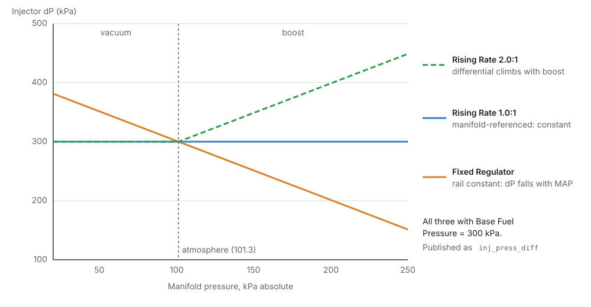
  <figcaption>Figure 19.2 — What the injector sees with each regulator type.</figcaption>
</figure>

- **Sensor**: a rail pressure sensor (**Stage 1 Fuel Pressure Source**) is read, and manifold
  pressure is subtracted.
- **Fixed Regulator** (default): the rail is held at **Base Fuel Pressure** above atmosphere, so the
  difference falls as manifold pressure rises. Typical of a returnless system with the regulator in
  the tank.
- **Rising Rate**: the regulator is referenced to the manifold. At a **Rising Rate Ratio** of 1.0:1
  the rail follows the manifold exactly and the difference never changes. That is a normal
  vacuum-referenced regulator on a return-style rail, and it needs no pressure sensor. Above 1.0:1 the
  difference rises with boost, as an aftermarket rising-rate regulator does. Under vacuum the ratio
  is ignored and it behaves as 1.0:1.

**Base Fuel Pressure** (default 300 kPa) is the number on the regulator: gauge pressure at
atmosphere.

### 4 · Corrections

Every correction is a **multiplier**. 1.000 changes nothing, 1.100 is 10 % more fuel. Each one has its
own **Enabled** switch. A switched-off correction is not calculated at all and reads exactly 1.000.
<!-- src: firmware/Engine/Modules/FuelCalculator.cpp; firmware/Engine/Modules/FuelTrim.cpp -->

| Correction | Channel | What it does | Limits |
|---|---|---|---|
| **Coolant Temp** (warm-up) | `fuel_corr_warmup` | adds the **CLT Enrichment** table's % (coolant, optionally × MAP) | 0.2–5 |
| **Cranking** | `fuel_corr_cranking` | only while cranking: the **Cranking Enrichment** table as an **absolute** % (100 % = no change) | 0–6 |
| **Post Start** | `fuel_corr_poststart` | only after the engine catches: adds the **Post-Start** table's % (coolant × run time) | 0.2–5 |
| **Air Temp** | `fuel_corr_iat` | adds the **Air Temp Correction** % (air temperature, optionally × MAP) | 0.2–5 |
| **Barometric** | `fuel_corr_baro` | adds the **Barometric Correction** % | 0.2–5 |
| **Fuel Composition** | `fuel_corr_fuelcomp` | adds the **Fuel Comp Correction** % (ethanol × load) | 0.2–5 |
| **Gear** | `fuel_corr_gear` | adds the **Fuel Gear Correction** % | 0.2–5 |
| **RPM Limiter** | `fuel_corr_revlimit` | adds the % from the table of speed below the cut × MAP | 0.2–5 |
| **Generic 1–4** | `fuel_corr_generic1` … `4` | four tables whose axes you choose | 0.2–5 |
| **Overall** | `fuel_corr_overall` | one fixed % for the whole engine (**Overall Fuel Correction**) | 0.2–5 |

<!-- src: firmware/Engine/Modules/FuelCalculator.cpp; firmware/Engine/Modules/FuelTrim.cpp -->

Other modules add their own corrections to the same product: transient fuel (`fuel_corr_accel`,
below), closed-loop lambda (`fuel_corr_stft`, `fuel_corr_ltft`, chapter 23), engine protection
(`fuel_corr_protection`, chapter 29), exhaust-temperature protection (`fuel_corr_egt`, enrich only)
and launch control (`fuel_corr_launch`, chapter 26). The whole product is limited to 0.1–10.

The warm-up, air temperature, barometric, fuel composition, gear and generic corrections change
slowly, so the ECU refreshes them in turn, one table per millisecond, rather than every cycle.
<!-- src: firmware/Engine/Modules/FuelTrim.cpp -->

### 5 · Starting the engine

<figure markdown>
  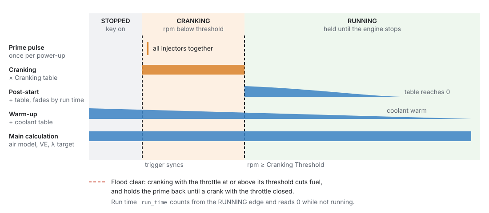
  <figcaption>Figure 19.3 — What adds fuel when, from key-on to a warm idle.</figcaption>
</figure>

The engine is **cranking** while it turns below **Cranking Threshold** `engine.cranking_rpm` (default
400 rpm), and **running** once it passes it. It stays running through any dip in speed until it
actually stops.
<!-- src: firmware/Engine/EngineStateMachine.h; definition/ecu.schema.yaml -->

- **Prime pulse**: one squirt from every injector at once, the first time the trigger syncs while
  cranking after power-up. It is not fired at key-on. With **Prime Mode** = **Injection Time (ms)**
  the table cell is the pulse length in ms. With **VE (%)** the cell is a percentage of the fuel a
  cylinder would need at 100 % VE and atmospheric pressure, and the injector dead time is added.
  <!-- src: firmware/Engine/Modules/FuelCalculator.cpp -->
- **Cranking enrichment**: while cranking, the Cranking Enrichment table (coolant, optionally ×
  ethanol) multiplies the fuel. It is an **absolute** percentage: 100 % is no change, 200 % is
  double. The ECU limits it to 600 %.
- **Post-start enrichment**: once the engine catches, the Post-Start table (coolant × **Engine Run
  Time** `run_time`) adds fuel. Run time counts from the moment the engine caught and reads 0 while
  it is not running. The enrichment ends when the table reaches 0.
  <!-- src: firmware/Engine/Modules/FuelCalculator.cpp -->
- **Warm-up**: the CLT Enrichment table adds fuel until the coolant is warm. It applies while
  cranking too.

**Flood clear.** If a cylinder is flooded, crank with the throttle held wide open: with **Flood Clear
Enabled**, the fuel stops while the engine is cranking and the throttle is at or above **Flood Clear
Above TPS** (default 90 %). It needs a valid throttle reading, so a failed throttle sensor can never
stop an engine starting. The prime pulse is held back too, and fires on a later crank with the
throttle closed. **Flood Clear Active** `flood_clear` shows it.
<!-- src: firmware/Engine/Modules/FuelCalculator.cpp -->

### 6 · Throttle movement: transient fuel

The steady-state tables assume the load is not changing. When the throttle snaps open, the manifold
fills, fuel wets the port walls, and the engine goes lean for a moment. Transient fuel covers that.
There are two ways to do it. Use **one**, not both.

**Transient Throttle** (on by default) is the rate-based method:
<!-- src: firmware/Engine/Modules/TransientThrottle.cpp; definition/ecu.schema.yaml TransientThrottle -->

<figure markdown>
  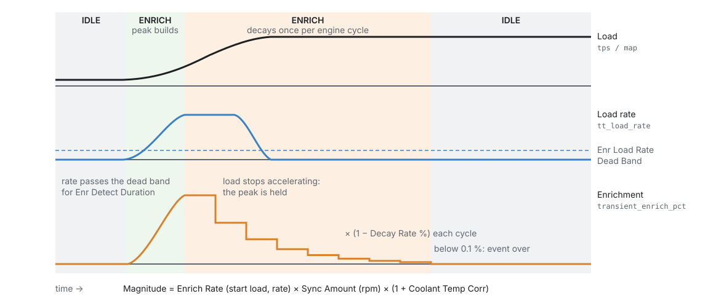
  <figcaption>Figure 19.4 — One Transient Throttle enrichment event.</figcaption>
</figure>

1. The **load** is throttle position or instantaneous MAP (**Load Type**). The ECU measures how fast
   it is changing, **Transient Load Rate** `tt_load_rate`, over a short window.
2. When the rate stays above **Enr Load Rate Dead Band** (default 25 /s) for **Enr Detect Duration**
   (default 1 ms), an enrichment event starts. The load at that moment is latched as the **start
   load**.
3. The size of the enrichment is:
   **Enrich Rate** (start load × load rate) × **Enrich Amount** (engine speed; 100 % is full) ×
   (1 + **Coolant Temp Corr**) × the optional **Overall Correction**. The result is **Transient
   Enrich %** `transient_enrich_pct`.
4. While the load is still accelerating faster than **Enr Load Accel Dead Band** (default 120 /s²),
   the peak is held.
5. After that, with **Enable Decay** on, the enrichment shrinks by the **Enrich Decay** % once per
   engine cycle. Below 0.1 % the event ends. With decay off, the enrichment simply follows the Enrich
   Rate table.
6. **Disenrichment** (off by default) is the same in reverse when the load falls, using the
   Disenrich tables and dead bands. A strong movement in the opposite direction switches an event
   from one to the other.
7. **Async** (off by default): at the start of an enrichment event, the ECU can also fire up to **Max
   Async Injector Pulses** extra squirts from every injector, sized by the **Async Amount** table,
   each with its own dead time. **Async Holdoff Time** is the minimum time between bursts.
8. **Ignition Correction** adds timing (degrees, by load × speed) while enriching, and after the
   event it fades away over **Ign Corr Decay Time** (default 500 ms).

The enrichment is limited to −100 % … +300 %.
<!-- src: firmware/Engine/Modules/TransientThrottle.cpp -->

**MAP Prediction with wall film** is the model-based method, on the **MAP Prediction** page:

- **MAP Prediction** `map_predict_enabled`: MAP is measured as an average, so it is always a little
  late. While the throttle is moving fast, the ECU uses the **Predicted MAP** table instead of
  measured MAP, or rather the **higher** of the two, so it can only add fuel. How much it uses depends
  on the throttle rate against the **Transient TPS Scaling** table: at or above the table's rate it
  uses the full predicted value; below it, the rate as a fraction of the table's decides how far it
  moves from measured towards predicted (half the rate, half way). Under a tenth of the table's
  rate counts as noise and is ignored. After a movement,
  prediction holds for **Predicted MAP Time** (default 200 ms). **Manifold Pressure (est)**
  `map_est` is the value used, and **MAP Source** `map_source` says where it came from (0 measured,
  1 predicted, 2 failover).
  <!-- src: firmware/Engine/Modules/FuelCalculator.cpp -->
- **Wall film** `wallfilm_enabled`: a fraction of each squirt (**Film Pooling**, default 20 %) lands
  on the port wall, and the film evaporates into the cylinder with a time constant (**Evaporation
  Time**, default 250 ms). The ECU injects extra fuel to build the film when the load rises, and less
  when it falls. At steady load it changes nothing. It runs only once the engine is running, and
  during a fuel cut the film only evaporates. **Fuel Corr: Wall Film** `fuel_corr_film` shows its
  effect.
  <!-- src: firmware/Engine/Modules/FuelCalculator.cpp -->

**MAP failover.** If the MAP sensor fails on a model that needs it, the ECU uses the Predicted MAP
table instead, whether or not prediction is switched on. That table cannot know how much boost there
is, so this is a limp-home mode, not something to tune on. It sets **P1700**.
<!-- src: firmware/Engine/Modules/FuelCalculator.cpp -->

### 7 · From fuel to injector pulses

1. **Split per squirt.** The fuel above is for one cylinder for one cycle. It is divided by the number
   of times the injector fires per cycle, which depends on the stage's **Injection Mode** (chapter 15).
   A sequential engine that only has crank sync fires twice per cycle, so each squirt gets half.
   <!-- src: firmware/Engine/Modules/FuelCalculator.cpp -->
2. **Staging** (engines with more than one injection stage). Stage 1 carries the fuel up to its
   **Staging Duty Cycle** (default 50 %). The next stage then takes what is left, up to its own
   staging duty, and so on. Once every stage is at its staging duty, they all rise together towards
   100 %. Past 100 % on every stage the injectors are too small, and the rest is put on the last
   stage so no fuel is silently lost.
   <!-- src: firmware/Engine/Modules/FuelCalculator.cpp -->

    <figure markdown>
      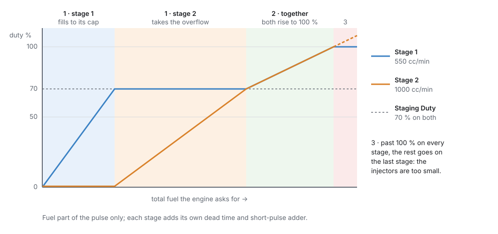
      <figcaption>Figure 19.5 — Two stages, both with a Staging Duty of 70 %.</figcaption>
    </figure>

3. **Dead time and the short-pulse adder.** Each opening of an injector costs its **Dead Time**, the
   time it takes to open, from a table of pressure difference × battery voltage. At very short pulses
   an injector is no longer linear, and the **Short Pulse Width Adder** corrects for that, read
   against the fuel pulse in ms. Both are added **per squirt**, after the split.
   <!-- src: firmware/Engine/Modules/FuelCalculator.cpp -->
4. **Bank and cylinder trims.** Closed-loop lambda's per-bank offsets and your **Cylinder N
   Correction** tables scale the **fuel part** of the pulse only, never the dead time. A per-bank
   offset needs a mode that can address banks (anything except Multi-Point). A per-cylinder table
   needs **Sequential**.
   <!-- src: firmware/Engine/Modules/FuelCalculator.cpp -->
5. **Timing.** The **Firing Angle BTDC** table (speed × load) says where the squirt happens. Whether
   that angle is the start or the end of the squirt is set by **Injector Timing Method** (chapter 15).
   Each further stage has its own angle table.

**Fuel cuts** (rev limiter, overrun, flood clear, protection) stop the injectors at the output. The
calculation keeps running, and **Base Fuel PW** `base_pw` keeps showing the pulse the engine would
have had. So a cut never looks like a fuel model that has collapsed to zero.
<!-- src: firmware/Engine/Modules/FuelCalculator.cpp -->

## Before you start

:material-circle:{ .level-basic } Basic

- **Engine basics** (chapter 15): cylinders, displacement, firing order, and the **injection stages**
  with their mode and outputs.
- **A working trigger** (chapter 16). Without sync nothing is injected.
- **Sensors** (chapter 17): MAP (for every model except Alpha-N), coolant and intake air temperature
  (always), TPS (Alpha-N, Blend, and transient fuel), and a wideband lambda sensor for tuning
  (chapter 23).
- **Injector data**: flow rate at a known pressure, and ideally dead time against voltage and
  pressure, from the injector's data sheet or a flow bench.
- **The fuel system**: which kind of pressure regulator the rail has, and its pressure.

## Setting it up

:material-circle:{ .level-basic } Basic → :material-circle:{ .level-intermediate } Intermediate

This walk-through uses **Example 1** below: a naturally aspirated 2.0 L four-cylinder, Speed-Density,
sequential, with a vacuum-referenced 300 kPa regulator on a return-style rail.

### Step 1 — Fuel Setup

Open **Configuration ▸ Engine Configuration ▸ Fuel System ▸ Fuel Setup**.

<figure markdown>
  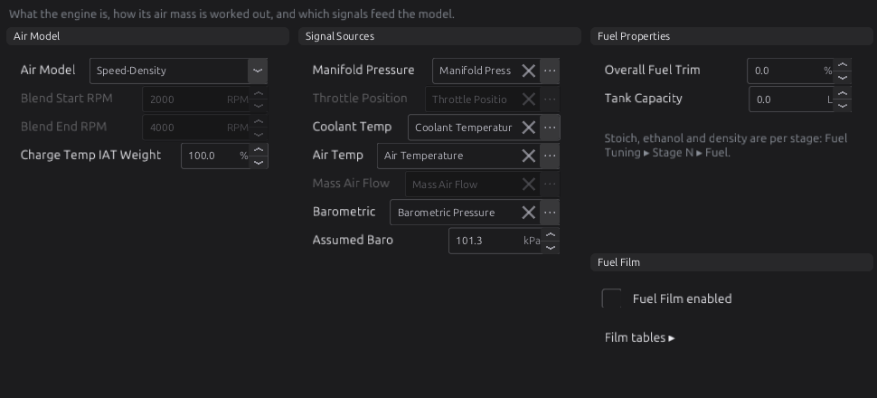
  <figcaption>Figure 19.6 — Fuel Setup.</figcaption>
</figure>

1. **Air Model**: Speed-Density for the example. The two **Blend** speeds are used only by Blend.
2. **Charge Temp IAT Weight**: leave at 100 % to start.
3. **Signal Sources**: the channel each input comes from. The defaults are the usual sensors. Change
   one only if yours reads on a different channel. **Ethanol If No Reading** is Flex Fallback
   Ethanol. **Assumed Baro** is used when there is no barometric sensor: set it to your local
   pressure if you live high up.
4. **Fuel Properties**: **Stoich AFR** 14.7 for petrol. For E85 without a flex sensor, set the petrol
   figure to the blend's stoichiometric ratio. **Overall Fuel Trim** is the Overall correction.
   **Tank Capacity** (litres) only turns the fuel-level sender's percentage into litres. 0 means
   unknown.
   <!-- src: definition/ecu.schema.yaml -->
5. **Wall Film**: leave off unless you use MAP Prediction (section 6).

### Step 2 — Injector stage 1

Open **Fuel Tuning ▸ Stage 1 ▸ Setup**.

<figure markdown>
  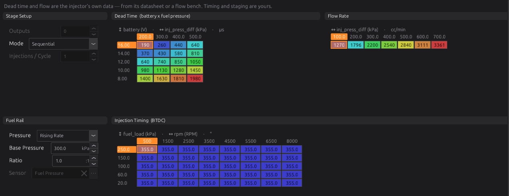
  <figcaption>Figure 19.7 — Stage 1 Setup: the injector's own data and its rail.</figcaption>
</figure>

1. **Stage Setup ▸ Mode**: the stage's injection mode (set in chapter 15; shown here for reference).
2. **Flow Rate** (cc/min), against pressure difference and battery voltage. Enter the injector's flow
   at the pressures it was measured at. If you only have one figure, put it in every cell.
3. **Dead Time** (µs), against battery voltage and pressure difference. Copy it from the data sheet.
   Dead time rises steeply as voltage falls, so the low-voltage rows matter for cranking.
4. **Fuel Rail ▸ Pressure**: **Rising Rate** for the example, with **Base Pressure** 300 kPa and
   **Ratio** 1.0. For a returnless rail with the regulator in the tank, use **Fixed Regulator**. With a rail pressure
   sensor, use **Sensor** and pick it in **Sensor**.
5. **Injection Timing (BTDC)**: where each squirt is placed. The default is 355° for every cell.
6. **Fuel Tuning ▸ Stage 1 ▸ Short Pulse Width Adder**: the small-pulse correction from the injector
   data. Leave the defaults if you have no data.

<figure markdown>
  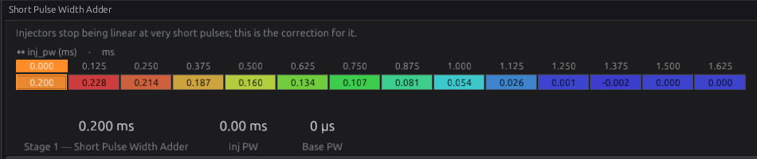
  <figcaption>Figure 19.8 — Short Pulse Width Adder.</figcaption>
</figure>

### Step 3 — Fuel density

**Fuel Tuning ▸ Specific Gravity** holds one number by default, 0.740. Change it for your fuel, or
expand the table to fuel temperature × ethanol for a flex-fuel engine.

<figure markdown>
  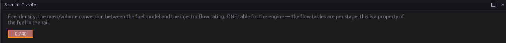
  <figcaption>Figure 19.9 — Specific Gravity.</figcaption>
</figure>

### Step 4 — VE and Target Lambda

<figure markdown>
  
  <figcaption>Figure 19.10 — The VE Table. The live cursor shows the cell in use.</figcaption>
</figure>

The **VE Table** is where most tuning happens (chapter 38). A new tune's table is a reasonable
starting shape for a naturally aspirated engine. Before the first start, check that the cells around
idle (low speed, 30–50 kPa) are neither very high nor very low.

<figure markdown>
  
  <figcaption>Figure 19.11 — Target Lambda.</figcaption>
</figure>

**Target Lambda** is what you want the mixture to be at each speed and load: about 1.00 at idle and
cruise, richer at full load, and richer again under boost. The default table follows that shape.

### Step 5 — Starting and warm-up

Open **Fuel Tuning ▸ Start & Warmup**. The page lays out everything between key-on and a warm idle.

<figure markdown>
  
  <figcaption>Figure 19.12 — Start & Warmup, with the prime pulse and flood clear switched on.</figcaption>
</figure>

1. **Prime**: tick **Prime pulse enabled** if the engine starts better with a squirt of fuel first,
   choose **Prime Mode**, and fill the **Fuel Prime Pulse** table (coolant).
2. **Cranking**: **Cranking enrichment enabled**, the **Cranking Threshold**, and the **Cranking
   Fuel Table**.
3. **Post-Start**: **Post-start enrichment enabled** and its table.
4. **Flood Clear**: **Flood clear enabled** and **Cut Above Throttle**.
5. **Warmup Enrichment**: the CLT table. The default adds 25 % at −40 °C, falling to 0 by 60 °C.

<figure markdown>
  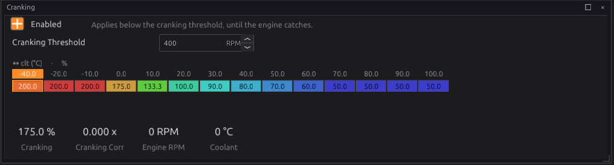
  <figcaption>Figure 19.13 — Cranking. 100 % is no change: the default doubles the fuel when cold
  and halves it when hot.</figcaption>
</figure>

<figure markdown>
  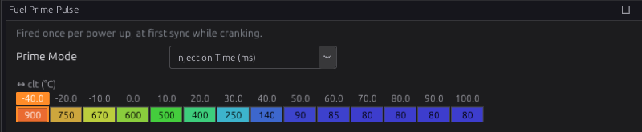
  <figcaption>Figure 19.14 — Fuel Prime Pulse, in Injection Time mode (ms).</figcaption>
</figure>

!!! note "The prime fires at sync, not at key-on"
    The prime fires the first time the trigger syncs while cranking after power-up, so turning the
    key on and off while you work does not fill the ports with fuel.

### Step 6 — Corrections

**Fuel Tuning ▸ Corrections** lists every correction with its switch, its live value and its channel.

<figure markdown>
  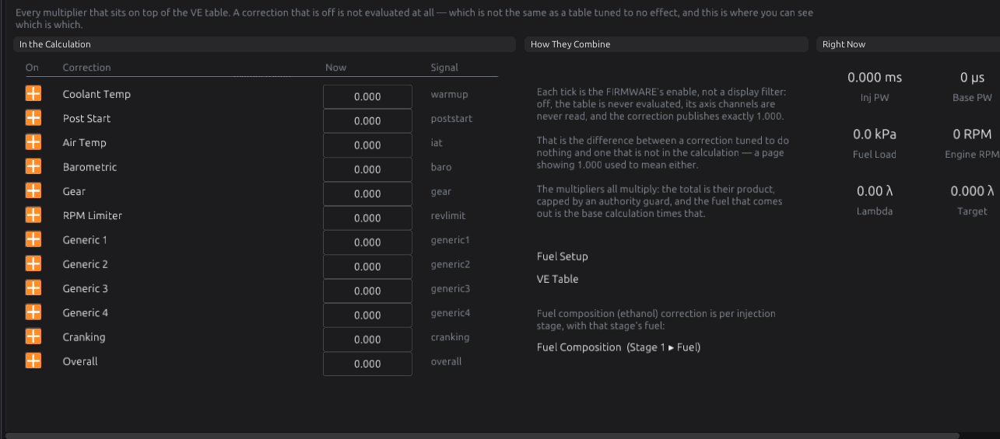
  <figcaption>Figure 19.15 — Corrections. Switching one off here means the firmware skips it.</figcaption>
</figure>

Each correction's own page appears in the navigation under **Corrections** only while it is switched
on. Leave them all on with their default tables to start. The warm-up, cranking and post-start tables
matter from the first start, and the rest can wait until the engine runs.

### Step 7 — Transient fuel

Open **Fuel Tuning ▸ Transient Throttle**.

<figure markdown>
  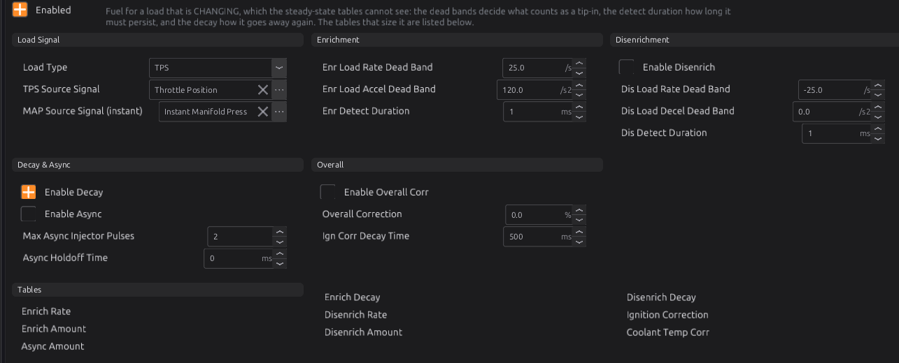
  <figcaption>Figure 19.16 — Transient Throttle.</figcaption>
</figure>

1. **Load Type**: **TPS** for most engines. **MAP** uses the instantaneous (not averaged) MAP
   channel set in **MAP Source Signal (instant)**.
2. Leave the dead bands at their defaults to start.
3. **Enrich Rate** is the main table: start load × load rate.

<figure markdown>
  { width="555" }
  <figcaption>Figure 19.17 — Enrich Rate. More fuel for faster movements from lighter loads.</figcaption>
</figure>

If you prefer the model-based method, switch Transient Throttle **off** and use MAP Prediction with
wall film instead:

<figure markdown>
  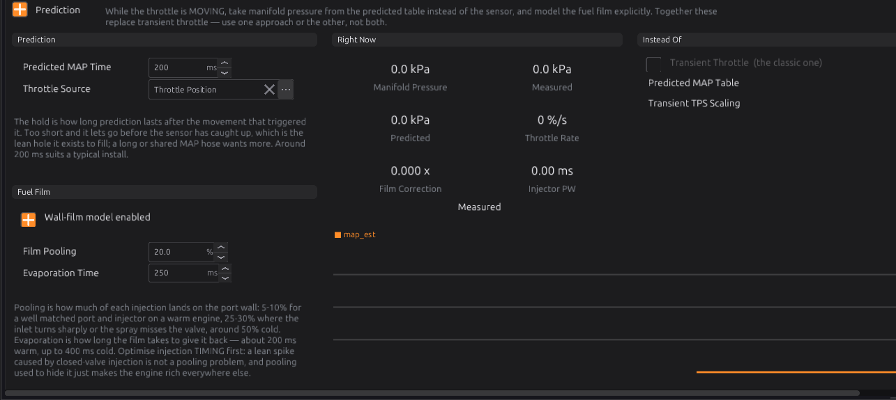
  <figcaption>Figure 19.18 — MAP Prediction with wall film. The page itself says to use this or
  Transient Throttle, not both.</figcaption>
</figure>

<figure markdown>
  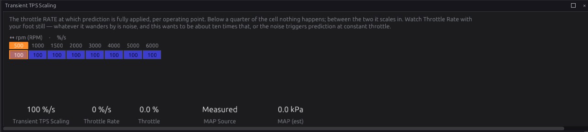
  <figcaption>Figure 19.19 — Transient TPS Scaling. It should be about ten times the throttle rate
  you see with your foot held still, or noise will trigger prediction.</figcaption>
</figure>

### Step 8 — Check with Fuel Breakdown

**Fuel Tuning ▸ Fuel Breakdown** shows the whole calculation live: the charge, every correction, closed
loop, dead time, and the commanded pulse. It is the first page to open when the fuelling does
something you do not expect.

<figure markdown>
  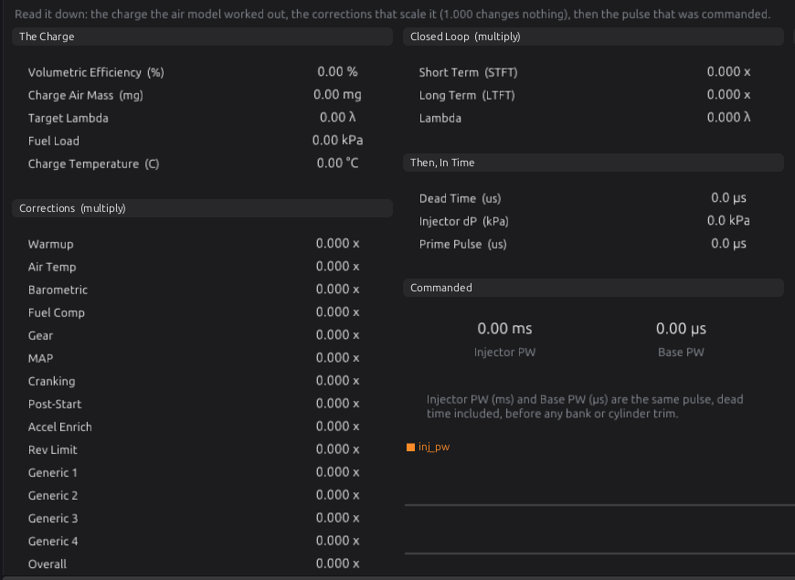{ width="870" }
  <figcaption>Figure 19.20 — Fuel Breakdown. Read it top to bottom.</figcaption>
</figure>

The **Fuel Tuning** page itself (Figure 19.21) is a summary: which fuel functions are switched on,
and the whole correction chain live.

<figure markdown>
  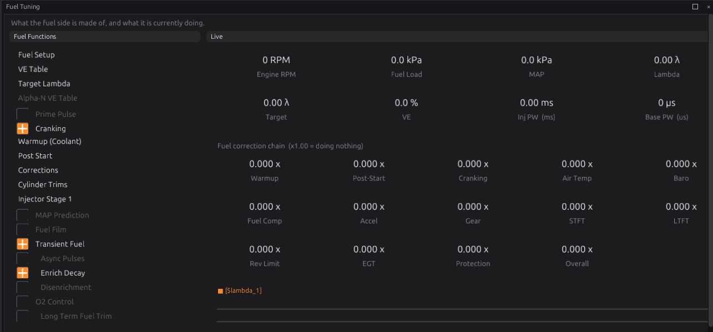
  <figcaption>Figure 19.21 — The Fuel Tuning page.</figcaption>
</figure>

## Worked examples

:material-circle:{ .level-intermediate } Intermediate

!!! example "Example 1 — naturally aspirated 2.0 L four, Speed-Density, sequential"
    | Setting | Value | Why |
    |---|---|---|
    | Cylinders / Displacement (chapter 15) | 4 / 2000 cc | 500 cc per cylinder |
    | Air Model | Speed-Density | one throttle and a plenum |
    | Stage 1 Mode | Sequential | cam sensor fitted (chapter 16) |
    | Stage 1 Fuel Pressure | Rising Rate, 300 kPa, 1.0:1 | vacuum-referenced regulator on a return rail: the difference is always 300 kPa |
    | Flow Rate | the injector's rating at 300 kPa, in every cell | one figure from the data sheet |
    | Transient Throttle | on, Load Type TPS | the usual method |

    With a manifold-referenced regulator no fuel pressure sensor is needed: the pressure difference is
    known to be 300 kPa at every load.

!!! example "Example 2 — turbocharged six, returnless rail"
    A turbocharged engine with the regulator in the tank, holding the rail at 400 kPa.

    | Setting | Value | Why |
    |---|---|---|
    | Air Model | Speed-Density | MAP measures boost directly |
    | Stage 1 Fuel Pressure | **Fixed Regulator**, 400 kPa | the rail does not follow boost |
    | Flow Rate table | flow at several pressure differences | at 200 kPa manifold pressure (about 1 bar of boost) the difference falls to about 300 kPa, and the flow with it |
    | Target Lambda | richer above 100 kPa | boost wants a richer mixture (chapter 37) |

    With a Fixed Regulator, the difference is Base Pressure + barometric pressure − MAP, so the Flow
    Rate and Dead Time tables need cells at the lower differences seen under boost.
    <!-- src: firmware/Engine/Modules/FuelCalculator.cpp -->

!!! example "Example 3 — individual throttle bodies, Blend"
    Four throttle bodies with a balance tube that gives a usable but weak MAP signal.

    | Setting | Value | Why |
    |---|---|---|
    | Air Model | **Blend** | throttle-based at low speed, MAP-based at high speed |
    | Blend Crossover Start / End RPM | 2500 / 4500 | the range where MAP becomes trustworthy on this engine |
    | Predicted MAP table | what MAP reads at each speed and throttle | only appears in the navigation with Blend selected |

    <figure markdown>
      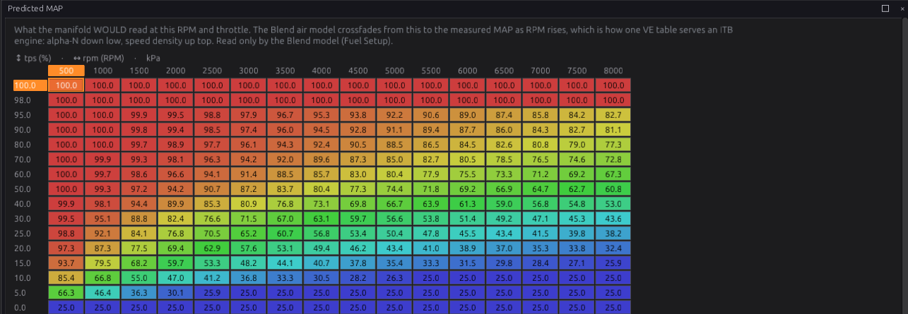
      <figcaption>Figure 19.22 — Predicted MAP. Fill it from logged MAP at steady speed and throttle.</figcaption>
    </figure>

!!! example "Example 4 — two injector stages"
    A second set of larger injectors that only work at high load: **Number of Injection Stages** 2
    (chapter 15), each stage with its own Flow Rate, Dead Time, Short Pulse Width Adder, Firing Angle
    and Fuel Pressure.

    <figure markdown>
      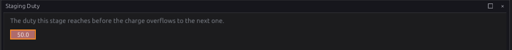
      <figcaption>Figure 19.23 — Staging Duty. Stage 1 carries the fuel alone up to this duty.</figcaption>
    </figure>

    With Stage 1 Staging Duty at 70 %, stage 1 carries everything up to 70 % duty. Stage 2 then takes
    the rest up to its own staging duty, and after that both rise together (Figure 19.5). The Staging
    Duty table can be expanded to speed × MAP.

## Tuning it

:material-circle:{ .level-intermediate } Intermediate → :material-circle:{ .level-advanced } Advanced

Chapter 38 is the full procedure. The short version:

1. **Get the injector data right first.** Flow rate, dead time and the pressure mode. A wrong dead
   time shows as a mixture that is right at load but wrong at idle, and it changes with battery
   voltage.
2. **Tune VE with a warm engine** and the corrections at their defaults, from idle outwards. Log
   `lambda`, `lambda_target`, `ve`, `fuel_load` and `rpm`. The Auto Tune tool (chapter 40) does this
   from logged data.
3. **Tune starting** next: cranking and prime on a cold engine, post-start, then warm-up as it warms.
4. **Transient fuel** last, with the steady state right. Watch `lambda` on quick throttle movements:
   a lean spike on tip-in wants more **Enrich Rate**; a rich one wants less.
5. **Do not correct a VE error with a correction table.** The corrections are for real effects
   (temperature, pressure, gear). A table used to hide a VE error will be wrong somewhere else.

**Channels worth logging:** `base_pw`, `inj_pw`, `inj_duty`, `ve`, `air_mass`, `fuel_load`,
`lambda_target`, `charge_temp`, `inj_press_diff`, `pw_add_deadtime`, the `fuel_corr_*` family,
`transient_enrich_pct`, `tt_load_rate`, `map_est`, `map_source`.

!!! warning "Injector duty"
    **Injector Duty Cycle** `inj_duty` is the commanded pulse, dead time included, over the time one
    squirt has available. Near 100 % the injector cannot open any longer and the engine will go lean.
    Keep it below about 85 % at full load, or add a stage.
    <!-- src: firmware/Engine/Modules/FuelCalculator.cpp -->

## Diagnostics

:material-circle:{ .level-intermediate } Intermediate

| Code | Meaning | What sets it | What to check |
|---|---|---|---|
| **P1700** | Fuel: MAP signal missing | Speed-Density, MAF or Blend with no valid MAP. Severity 2. Fuelling falls back to the Predicted MAP table. | MAP sensor and its source (chapter 17) |
| **P1701** | Fuel: TPS signal missing | Alpha-N or Blend with no valid TPS. Severity 2. | TPS (chapter 17) |
| **P1702** | Fuel: coolant-temp signal missing | Severity 2. | Coolant sensor |
| **P1703** | Fuel: intake-air-temp signal missing | Severity 1. | Air temperature sensor |
| **P1704** | Fuel: MAF signal missing | MAF model with no valid MAF. Severity 2. Fuelling falls back to Speed-Density. | MAF sensor |
| **P1720** | Transient Throttle: load-source signal missing | The TPS or MAP it uses is not valid. Severity 1. | The Load Type's sensor |

<!-- src: definition/ecu.schema.yaml; generated/module_dtc.h; firmware/Engine/Modules/FuelCalculator.cpp -->

A source that is not assigned at all raises its code at severity 1 even with the key off, so the
bench shows which inputs still need a signal. A source that is assigned but not reading raises it at
the severity above, and only with the key on.
<!-- src: firmware/Engine/Modules/FuelCalculator.cpp -->

## Troubleshooting

:material-circle:{ .level-basic } Basic → :material-circle:{ .level-advanced } Advanced

| Symptom | Likely causes | Check |
|---|---|---|
| No injection at all | No sync; injector outputs not assigned; a fuel cut active; stages not set up | Sync level (chapter 16); injection stage outputs (chapter 15); `base_pw` is not 0 but the injector is silent means a cut is active |
| Rich or lean everywhere by the same proportion | Stoich AFR, specific gravity, displacement or injector flow wrong | Fuel Setup, Specific Gravity, chapter 15, Flow Rate |
| Right at load, wrong at idle | Dead time wrong | Dead Time table; the effect changes with battery voltage |
| Lean under boost only | Fixed Regulator selected on a referenced rail, or the reverse; flow table missing low pressure-difference cells | Stage 1 Fuel Pressure mode; `inj_press_diff` under boost |
| Floods on a cold start | Too much cranking enrichment or prime | Cranking table; Prime table; clear with flood clear |
| Starts, then dies after a few seconds | Post-start enrichment too little or too much | Post-Start table; log `lambda` and `run_time` |
| Lean stumble on tip-in | Transient enrichment too small, or the detect dead band too high | Enrich Rate; Enr Load Rate Dead Band; `transient_enrich_pct` |
| Rich bog on tip-in | Transient enrichment too big | Enrich Rate; Enrich Decay |
| Fuelling jumps with no throttle movement | Transient Throttle and MAP Prediction both on; noise on TPS | Use one method; Transient TPS Scaling; `tps_rate` at a steady pedal |
| A flex-fuel engine runs lean as petrol | Ethanol sensor never read, fallback 0 % | `flex_ethanol`; Flex Fallback Ethanol |
| `inj_duty` near 100 % | Injectors too small | Bigger injectors, higher pressure, or a second stage |

## Settings reference

Every Fuel setting, generated from the definition the studio loads:

--8<-- "reference/settings/_fuel_calculator.table.md"

Transient Throttle:

--8<-- "reference/settings/_transient_throttle.table.md"

## Related

- [Chapter 15 — Engine and vehicle basics](15-engine-vehicle.md) (injection stages, modes, timing method, Cranking Threshold)
- [Chapter 16 — The trigger system](16-trigger.md)
- [Chapter 17 — Sensors and calibration](17-sensors.md) (MAP, TPS, temperatures, flex fuel)
- [Chapter 23 — Closed-loop lambda](23-lambda.md) (short- and long-term trims)
- [Chapter 29 — Engine protection](29-protection.md) (protection fuel corrections and cuts)
- [Chapter 37 — Tuning principles](../part4/37-principles.md)
- [Chapter 38 — Tuning fuel](../part4/38-tuning-fuel.md)
- [Chapter 40 — Auto tune](../part4/40-auto-tune.md)
