# Ignition

:material-circle:{ .level-basic } Basic → :material-circle:{ .level-advanced } Advanced

> **In one sentence:** the Ignition module decides when each spark plug fires and how long each coil
> charges first, from the advance map, its corrections and every safety retard, inside limits you set.

## What it does

:material-circle:{ .level-basic } Basic

A petrol engine burns its charge with a spark. The spark has to come **before** the piston reaches
the top of its stroke (top dead centre, **TDC**), because the flame takes time to spread. How far
before TDC it fires is the **ignition advance** (or **timing**), in crank degrees **BTDC** (before
TDC). Too little advance wastes power and heats the exhaust. Too much makes the charge explode
instead of burning (**knock**, or detonation), and knock breaks pistons.

Before each spark the ECU switches the coil on so current can build in it. That charging time is the
**dwell**. When the ECU switches the coil off, the coil fires the plug.

The Ignition module does these jobs for every engine cycle:

1. **Chooses a base advance** from the **Advance Table** (engine speed against load). While the
   engine is cranking it can use a separate **Cranking Advance** table instead.
2. **Adds corrections**: coolant, air temperature, fuel composition, gear, post-start, four generic
   tables, the rev-limiter approach, transient throttle, the idle stabiliser, and one overall trim.
3. **Subtracts retards** that other modules ask for: knock, engine protection, nitrous, anti-lag and
   traction control.
4. **Clamps** the result between **Min Advance** and **Max Advance**.
5. **Gives each cylinder its own angle**, with an optional per-cylinder trim.
6. **Chooses the dwell** from a table against battery voltage (and, if you want, engine speed).
   <!-- src: firmware/Engine/Modules/Ignition.cpp, firmware/Engine/Modules/IgnitionTrim.cpp -->

The module always runs. It has no **Enabled** switch: an engine with coils needs it. How the coils
are wired (distributor, wasted spark or coil-on-plug) is set on the same studio page, and this
chapter covers it too. There is also a **Fixed Timing** mode that holds one advance so you can check
the crank sensor setting with a timing light. Do that check before you tune anything else.
<!-- src: definition/ecu.schema.yaml (Ignition has no enabled field; fixed timing 5113-5117) -->

!!! danger "Timing is the other fastest way to break an engine"
    Too much advance under load breaks pistons and ring lands, often with no warning you can hear.
    Set **Max Advance** before the engine first runs, check base timing with a light (below), and
    add advance in small steps while you log knock. Chapter 30 sets up knock detection; chapter 39
    covers tuning timing.

## How it works

:material-circle:{ .level-intermediate } Intermediate

<figure markdown>
  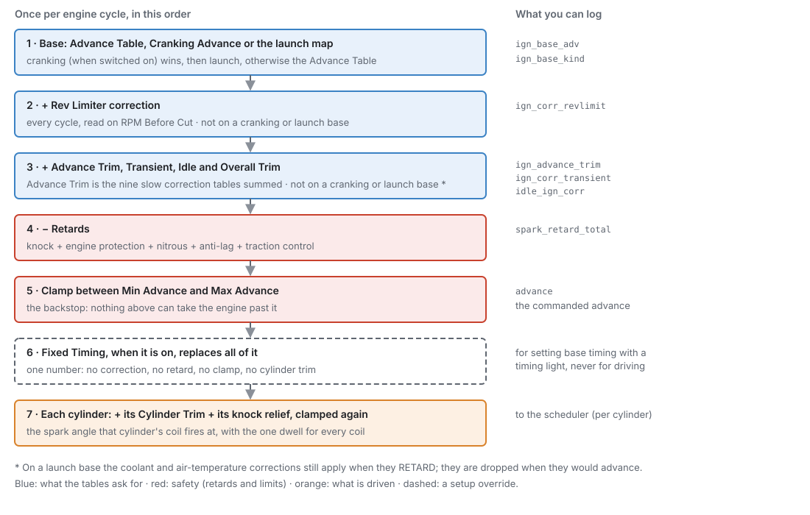
  <figcaption>Figure 20.1 — How the advance is built, once per engine cycle. Blue steps come from
  your tables, red ones are safety, and the orange step is what reaches the coils. The right-hand
  column names the channel you can log for each step.</figcaption>
</figure>

### 1 · The base advance

The base is one of three tables. Only one is used at a time:

- **Cranking Advance**, when **Cranking Advance** is switched on and the engine is cranking. The
  engine counts as cranking while it turns below **Cranking Threshold** (default 400 rpm) and has not
  yet caught.
- The **launch ignition map**, while launch control is active (chapter 26). Cranking wins if both
  are somehow true.
- The **Advance Table** at all other times.
  <!-- src: firmware/Engine/Modules/Ignition.cpp; firmware/Engine/EngineStateMachine.h; definition/ecu.schema.yaml -->

The Advance Table is read against **Engine RPM** across and **Fuel Load** (the load the fuel side
calculates, in kPa absolute) down. You can switch on a third axis for ethanol content, so one map
covers petrol, E85 and every blend in between. Positive numbers are degrees before TDC.
<!-- src: definition/ecu.schema.yaml (x_channel rpm, y_channel fuel_load, z_channel flex_ethanol, z_optional) -->

The base is published as **Ign Base Advance** `ign_base_adv`, and which table it came from as **Ign
Base Table** `ign_base_kind` (*Advance Map*, *Cranking Table* or *Launch Table*).
<!-- src: firmware/Engine/Modules/Ignition.cpp; definition/ecu.schema.yaml -->

### 2 · Corrections, added

On an Advance Table base, these are added to it:

- **Rev Limiter** correction, read against **RPM Before Cut** (how far the engine is below the hard
  rev limit). It is worked out every engine cycle, because RPM moves quickly.
- **Advance Trim** `ign_advance_trim`: the sum of the nine **slow** corrections: **Coolant**, **Air
  Temp**, **Fuel Comp**, **Gear**, **Post-Start** and **Generic 1** to **Generic 4**. Their inputs
  change slowly, so they are worked out away from the engine cycle. One table is refreshed every
  millisecond, in turn, so the whole set is fresh every 9 ms.
- **Transient** correction `ign_corr_transient` from Transient Throttle (chapter 19).
- **Idle** correction `idle_ign_corr` from the idle stabiliser (chapter 21). It is 0 away from idle.
- **Overall Trim**: one fixed number, the same at every speed and load.
  <!-- src: firmware/Engine/Modules/Ignition.cpp; firmware/Engine/Modules/IgnitionTrim.h, IgnitionTrim.cpp; firmware/Engine/SystemComposer.cpp; firmware/Engine/Modules/Idle.cpp -->

Every correction table can be switched off. A correction that is **off** is not read at all, which is
not the same as a table full of zeros. All of them ship **on**. Their tables ship neutral (all
zeros), except **Coolant**, which ships with a small cold retard (see *Corrections* below).
<!-- src: firmware/Engine/Modules/IgnitionTrim.cpp; definition/ecu.schema.yaml -->

On a **cranking** base, none of these are added. The cranking table already follows coolant, and
adding the coolant correction as well would count it twice. On a **launch** base, none are added
either, with one exception: the **Coolant** and **Air Temp** corrections still apply when they
**retard**. A launch map is absolute, but it must not remove heat protection from a car sitting hot
on the line.
<!-- src: firmware/Engine/Modules/Ignition.cpp -->

### 3 · Retards, subtracted

Then everything that pulls timing out is subtracted, whatever the base:

| Retard | Channel | Set up in |
|---|---|---|
| Knock | **Knock Retard** `knock_retard` | Chapter 30 |
| Engine protection | **Protection Ign Retard** `prot_ign_retard` | Chapter 29 |
| Nitrous | **Nitrous Timing Retard** `nitrous_retard` | Chapter 28 |
| Anti-lag | **Anti-Lag Retard** `antilag_retard` | Chapter 28 |
| Traction control | **Traction Timing Retard** `traction_retard` | Chapter 26 |

Their sum is published as **Total Timing Retard** `spark_retard_total`.
<!-- src: firmware/Engine/Modules/Ignition.cpp -->

### 4 · The clamp

The result is held between **Min Advance** (default −10°) and **Max Advance** (default 40°). This is
the backstop: a wrong table cell, a stacked set of corrections or a sensor reading nonsense cannot
take the engine past it. The clamped value is the commanded advance, **Ignition Advance** `advance`.
<!-- src: firmware/Engine/Modules/Ignition.cpp; definition/ecu.schema.yaml -->

**Overall Trim** is added *before* the retards and the clamp. Winding it up cannot outrun a knock or
protection retard, and cannot pass Max Advance.
<!-- src: definition/ecu.schema.yaml (comment); firmware/Engine/Modules/Ignition.cpp -->

### 5 · Fixed timing

With **Fixed Timing** on, the advance is replaced by **Fixed Timing Advance**, after every step
above. No correction, no retard, no clamp and no cylinder trim can move it. An ignition **cut** (rev
limiter, protection) still cuts, because a cut stops the coil rather than changing the angle.
<!-- src: firmware/Engine/Modules/Ignition.cpp; definition/ecu.schema.yaml -->

### 6 · Each cylinder's angle

Each cylinder the engine has gets its own angle: the advance, plus that cylinder's **Cylinder
Trim** table, plus its **knock relief**, clamped to Min/Max Advance again. Knock relief works like
this: the global advance carries the retard of the worst-knocking cylinder, and a cylinder that has
knocked less gets the difference back. So one noisy cylinder does not retard all the others.
<!-- src: firmware/Engine/Modules/Ignition.cpp -->

On a rotary engine the trailing plug fires at the leading angle minus the **Trailing Split** (see
*Rotary engines* below).
<!-- src: firmware/Engine/Modules/Ignition.cpp -->

### 7 · Dwell

The dwell comes from the **Ignition Dwell Time** table, read against battery voltage. You can switch
on a second axis for engine speed. One dwell is used for every coil in a cycle.
<!-- src: firmware/Engine/Modules/Ignition.cpp; firmware/Engine/EngineTask.cpp; definition/ecu.schema.yaml -->

Dwell is a **time**, but the ECU schedules by crank **angle**. So it converts the dwell to an angle at
the current engine speed and starts charging that many degrees before the spark:

<figure markdown>
  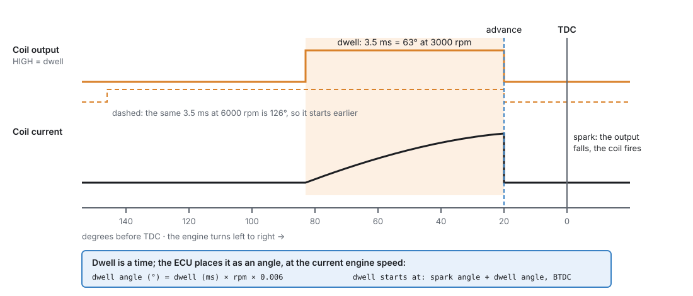
  <figcaption>Figure 20.2 — Dwell on the crank-angle scale. The coil charges while its output is
  HIGH and fires when the output falls. The same 3.5 ms is 63° at 3000 rpm and 126° at 6000 rpm, so
  the ECU starts the dwell earlier as the engine speeds up.</figcaption>
</figure>

dwell angle (°) = dwell (ms) × rpm × 0.006
<!-- src: firmware/Scheduler/EnginePositionHal.cpp (rpm_x10 · µs / 166660 decidegrees) -->

The dwell for the next spark is armed as soon as the previous spark fires, and it is placed again
about 90° before that cylinder's TDC with the latest engine speed and advance. If the advance has
jumped so far that there is no room left for a full dwell, the coil starts charging at once: one
short dwell rather than a missed cylinder.
<!-- src: firmware/Scheduler/EnginePositionHal.cpp; firmware/Scheduler/EventScheduler.cpp; firmware/Scheduler/SchedulerTypes.h -->

Two limits protect the coil:

- **The dwell must fit between two sparks of the same coil.** The ECU shortens it if needed, so
  that at least 20° of crank angle is left free after each spark, for the spark to burn before the
  coil charges again. On a distributor the free gap is a quarter of the spacing between sparks, if
  that is larger. The spacing depends on the mode
  (Figure 20.3): a whole engine cycle for a coil-on-plug coil with cam phase known, one revolution for
  a wasted-spark coil or any coil without phase, and the cycle divided by the cylinder count for a
  distributor.
- **A coil can never stay charged for long.** If a coil has been on for more than twice the
  longest dwell asked for (never less than 3 ms, never more than 20 ms), the ECU switches it off,
  and it sparks at whatever angle that is. This catches a lost spark event, so the coil and its
  driver do not cook.
  <!-- src: firmware/Scheduler/EnginePositionHal.cpp; firmware/Scheduler/EventScheduler.cpp -->

!!! example "What the dwell limit means on a V8 distributor"
    A V8 fires eight times per 720° cycle, so the one coil has 90° between sparks. The gap kept free
    is a quarter of that, 22.5°, so the longest dwell is 67.5°. At 6000 rpm (36° per ms) that is
    1.9 ms. A coil set to 3.0 ms reaches this limit from 3750 rpm up. A four-cylinder on wasted
    spark has 340° to use, which is 8 ms even at 7000 rpm: the limit never matters there.
    <!-- src: firmware/Scheduler/EnginePositionHal.cpp -->

### 8 · Ignition modes

How the coils are wired is the **Ignition Mode** (on **Engine Configuration ▸ Ignition System**):

<figure markdown>
  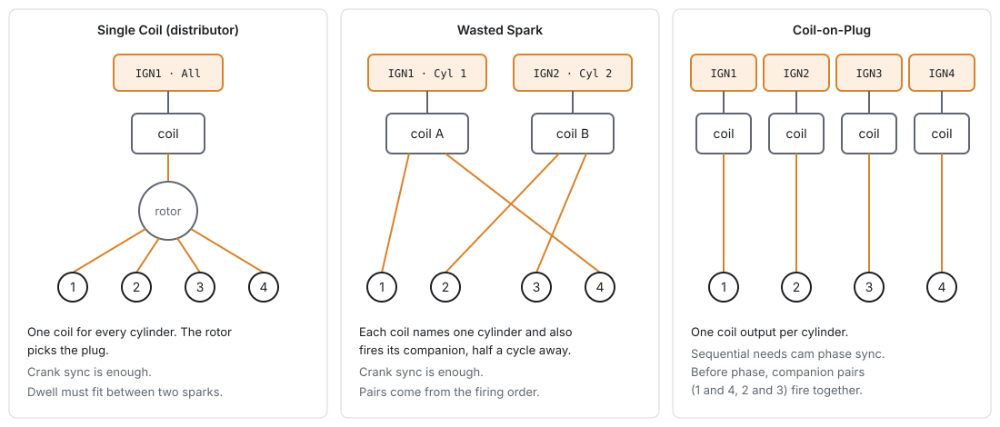
  <figcaption>Figure 20.3 — The three ignition modes on a four-cylinder engine firing 1-3-4-2. The
  orange boxes are the ECU's coil outputs and the cylinder their output row names.</figcaption>
</figure>

- **Single Coil (distributor)**: one coil output, its row set to **All Cylinders**, fires for every
  cylinder. The distributor's rotor picks the plug. Crank sync is enough.
- **Wasted Spark**: each coil fires two cylinders together: the one on its compression stroke and its
  **companion**, the cylinder half an engine cycle away, which is on its exhaust stroke and wastes
  its spark. Each coil output names **one** cylinder. The ECU finds the companion from the firing
  order while it runs, so changing the firing order never needs an output moved. Crank sync is
  enough.
- **Coil-on-Plug**: one coil output per cylinder. To fire each coil once per cycle (sequentially),
  the ECU needs **cam phase sync** (chapter 16). Until it has phase, it fires each companion pair
  together, as wasted spark, so the engine still starts and runs.
  <!-- src: definition/ecu.schema.yaml; firmware/Scheduler/EventScheduler.cpp; firmware/Scheduler/SchedulerTypes.h -->

Changing **Ignition Mode**, **Cylinders** or **Engine Cycle** makes the studio lay the coil outputs
out again. On
coil-on-plug, IGN1 serves cylinder 1, IGN2 cylinder 2, and so on. On wasted spark there is one coil
per companion pair, named by the lower cylinder number, in cylinder order: a four-cylinder firing
1-3-4-2 gets IGN1 on cylinder 1 (pair 1 and 4) and IGN2 on cylinder 2 (pair 2 and 3). A distributor
gets one output, IGN1, on **All Cylinders**. Each IGN output's own page (chapter 18) shows its
cylinder and polarity, and is where you change one by hand.
<!-- src: apps/studio-jf/src/model/EngineOutputLayout.cpp; definition/ecu.schema.yaml -->

!!! info "Advanced — companions on other engines"
    The companion is always the cylinder whose TDC is half an engine cycle away: 360° on a
    four-stroke, 180° on a two-stroke. A rotary has no companion; its two plugs per rotor are
    handled by the engine cycle, not by this setting. On an odd-fire engine the companion is found
    from each cylinder's TDC angle, so it only exists where one TDC is exactly half a cycle from
    another. A cylinder with no companion gets a coil of its own.
    <!-- src: firmware/Scheduler/SchedulerTypes.h; firmware/Scheduler/EventScheduler.cpp; apps/studio-jf/src/model/EngineOutputLayout.cpp -->

## Before you start

:material-circle:{ .level-basic } Basic

You need:

- **A working trigger** (chapter 16). With no position there is no spark. For sequential coil-on-plug
  you also need a cam signal for phase sync.
- **The engine basics** (chapter 15): **Cylinders**, **Engine Cycle** and the **firing order** on
  **Engine Configuration ▸ Cylinders & Firing**. Ignition fires cylinders by number from that order.
- **Coils wired to the IGN outputs** (chapter 12). The jaytek_v1 board has twelve ignition outputs,
  IGN1 to IGN12. Each is a driver output that goes HIGH to charge the coil.
  <!-- src: definition/boards/jaytek_v1.board.yaml -->
- **The coil outputs' polarity checked** (chapter 18). **Active High** is the default and suits the
  jaytek_v1 IGN outputs.
- **A battery voltage reading**, which the board provides. The dwell table reads it.
- **Coolant and intake air temperature sensors** for the coolant and air temperature corrections
  (chapter 17). A flex-fuel sensor if you use the ethanol axis or the Fuel Comp correction, and gear
  detection (chapter 32) if you use the Gear correction.
- **A timing light**, to check base timing.

!!! danger "Get the coil polarity right before you connect coils"
    An output with the wrong **Active High** setting is ON whenever it should be off, including at
    reset. For a coil that means charging continuously: it overheats and can fail within seconds.
    The ECU's maximum-dwell cutoff only knows about the dwells it asked for, so it cannot catch an
    inverted output. Check each IGN output's polarity with the coils unplugged (chapter 43).
    <!-- src: definition/ecu.schema.yaml; firmware/Scheduler/EventScheduler.cpp -->

## Setting it up

:material-circle:{ .level-basic } Basic → :material-circle:{ .level-intermediate } Intermediate

The settings live on two groups of pages: **Configuration ▸ Engine Configuration ▸ Ignition
System** (the hardware), and **Configuration ▸ Ignition Tuning** (the tables). Some pages only appear
in the navigation tree when they apply: each **Corrections** page only while that correction is on,
**Cylinder Trims** only for the cylinders the engine has, and **Trailing Split** only when **Engine
Cycle** is *Rotary*.
<!-- src: definition/boards/jaytek_v1.dashboard.gui (tree: Ignition Tuning, conditions on enable_*, cylinder_count, cycle_type) -->

### Step 1 — The Ignition System page

<figure markdown>
  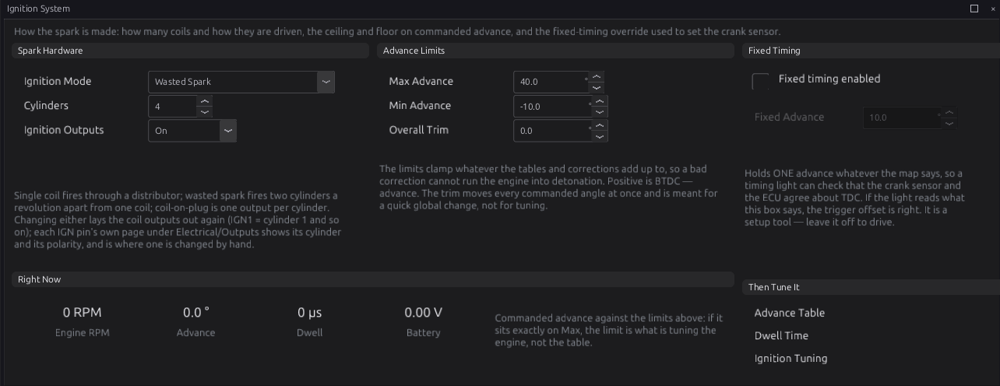
  <figcaption>Figure 20.4 — Engine Configuration ▸ Ignition System, set up as Example 1 below: a
  four-cylinder engine on wasted spark.</figcaption>
</figure>

1. **Choose Ignition Mode** `engine.ign_mode`: *Single Coil (distributor)*, *Wasted Spark* (the
   default) or *Coil-on-Plug*, as in Figure 20.3.
2. **Check Cylinders** `engine.cylinder_count`. It is the same setting as on **Cylinders & Firing**.
3. **Check the coil outputs.** Changing either of the two settings above (or **Engine Cycle**) lays
   the coil outputs out again. Open each IGN output's page (chapter 18) and check it names the cylinder you wired to it.
   A coil or injector change takes effect at the next engine stop.
4. **Leave Ignition Outputs** `engine.ign_enable` **On.** *Off* stops every coil firing, the way a
   rev-limiter spark cut does. Use it to crank with no spark (to check fuel delivery, or to clear a
   flooded engine). It is stored in the tune, so it stays off after a reset.
5. **Set the advance limits** in **Advance Limits** (Step 5 below explains them).
6. Leave **Fixed Timing** off for now. You will use it in Step 6.
   <!-- src: definition/ecu.schema.yaml; apps/studio-jf/src/model/EngineOutputLayout.cpp -->

The **Right Now** panel shows engine speed, commanded advance, dwell (in µs) and battery voltage
live. If the advance sits exactly on **Max Advance**, the limit is tuning the engine, not the table.

### Step 2 — The Ignition Tuning page

<figure markdown>
  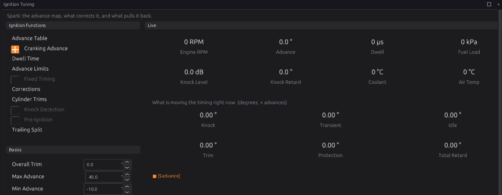
  <figcaption>Figure 20.5 — Configuration ▸ Ignition Tuning. The left column links to every
  ignition page, with switches for the optional ones. The Live panel shows what is moving the timing
  right now.</figcaption>
</figure>

This page is the hub. From it you can switch **Cranking Advance** and **Fixed Timing** on and off,
reach every table, and switch knock and pre-ignition detection on (chapter 30). **Basics** repeats
the Overall Trim and the two limits.

### Step 3 — Dwell

<figure markdown>
  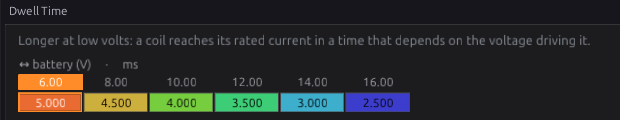
  <figcaption>Figure 20.6 — Ignition Tuning ▸ Dwell Time, as shipped: 5.0 ms at 6 V down to 2.5 ms
  at 16 V.</figcaption>
</figure>

A coil needs a certain time to reach its rated current, and that time depends on the voltage
driving it: lower voltage needs longer. Too short gives a weak or missing spark, worst while
cranking when the battery is lowest. Too long heats the coil and its driver for no extra spark.
<!-- src: definition/ecu.schema.yaml -->

1. Find the coil maker's dwell at 14 V (or at the voltage they quote).
2. Put it in the 14 V cell of **Ignition Dwell Time** `ignition.dwell_table`, and keep the table's
   shape: roughly double the dwell at half the voltage. The shipped table is 5.0, 4.5, 4.0, 3.5, 3.0
   and 2.5 ms at 6, 8, 10, 12, 14 and 16 V. Cells run from 0 to 20 ms.
3. Leave the RPM axis off unless you need it (see *Tuning it*).
   <!-- src: definition/ecu.schema.yaml (default_row 5000…2500, volt axis 6…16, rpm axis size 1, y_optional) -->

The table's axes are settings of their own: which channel each reads, and whether the optional axis
is on. Change them from the table's right-click menu, **Setup ▸ Table Axis Setup…**. The same
applies to every table in this chapter.
<!-- src: apps/studio-jf/src/surface/Surface.cpp; apps/studio-jf/src/ui/AxisSetupDialog.h -->

### Step 4 — Cranking advance

<figure markdown>
  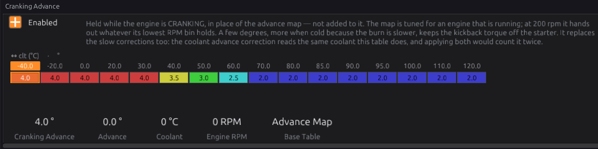
  <figcaption>Figure 20.7 — Ignition Tuning ▸ Cranking Advance, switched on, with the shipped
  values: 4° when cold, easing to 2° from 70 °C. <b>Base Table</b> shows which table the
  advance is coming from.</figcaption>
</figure>

With **Cranking Advance** `ignition.cranking_ign_enable` off (the default), a cranking engine fires on
the Advance Table at whatever its lowest RPM column says. That number was tuned for a running engine.
Switch it on to give the engine a small, fixed advance while it cranks. A little more when cold,
because the burn is slower. Less when warm, because advance while cranking pushes back against the
starter.
<!-- src: definition/ecu.schema.yaml -->

1. Tick **Enabled**.
2. Fill in **Cranking Advance** `ignition.cranking_ign_table`, against coolant temperature. Use small
   positive numbers. The shipped curve is 4.0° up to 30 °C, 3.5° at 40 °C, 3.0° at 50 °C, 2.5° at
   60 °C and 2.0° from 70 °C. The cells run from −30° to 60°.
3. If a tired battery makes the engine crank slowly, you can switch on the table's second axis,
   battery voltage. It has exactly two breakpoints (8 V and 12 V by default).
   <!-- src: definition/ecu.schema.yaml -->

The cranking advance **replaces** the Advance Table and all the corrections while the engine cranks.
The retards still apply.

### Step 5 — Advance limits

<figure markdown>
  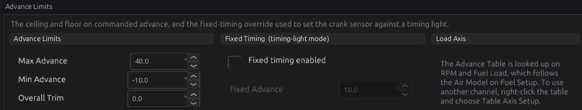
  <figcaption>Figure 20.8 — Ignition Tuning ▸ Advance Limits, with the shipped limits.</figcaption>
</figure>

1. **Max Advance** `ignition.max_adv_deg` (0 to 60°, default 40°): the most advance ever
   commanded. Set it to the most this engine could survive, not the most it wants. A sensible
   value is a couple of degrees above the highest cell you mean to run.
2. **Min Advance** `ignition.min_adv_deg` (−60 to 0°, default −10°): the most retard ever commanded.
   It stops a stack of retards pushing the spark so late that the engine only makes heat. If you use
   anti-lag, which retards timing heavily on purpose, check its retard fits above this floor
   (chapter 28).
3. **Overall Trim** `ignition.overall_adv_trim` (−60 to 60°, default 0): one offset added at every
   speed and load (on the Advance Table base; not while the cranking or launch table is in use).
   Use it for a quick global change, such as pulling 2° on doubtful fuel. It is also the easiest
   setting to leave in by accident, and the Timing Breakdown page does not show it as a row, so write
   down when you use it.
   <!-- src: definition/ecu.schema.yaml; firmware/Engine/Modules/Ignition.cpp; Timing Breakdown page in definition/boards/jaytek_v1.dashboard.gui -->

The **Load Axis** panel says what the timing is looked up on. The Advance Table reads Engine RPM and
**Fuel Load** `fuel_load`, and Fuel Load follows the **Air Model** on Fuel Setup: manifold pressure for
Speed-Density, throttle position for Alpha-N (chapter 19). To look a table up on something else,
right-click it and choose **Table Axis Setup…**: each axis has its own channel (Step 3).
<!-- src: definition/ecu.schema.yaml ign_table (y_channel: fuel_load); firmware/Engine/Modules/FuelCalculator.cpp (fuel_load per air model); apps/studio-jf/src/surface/Surface.cpp (Table Axis Setup…); apps/studio-jf/src/ui/AxisSetupDialog.h (channel button) -->

### Step 6 — Setting base timing with a timing light

Every angle the ECU commands is measured from **TDC of cylinder 1**. The ECU only knows where that is
through **Trigger Offset BTDC** `trigger.trigger_offset_btdc` on **Engine Configuration ▸ Trigger
System** (chapter 16). A wrong offset shifts every spark by the same error, and no table can fix
that. A bench stimulator cannot check it either, because it agrees with whatever offset you set. Only
a timing light on the real engine can.
<!-- src: definition/ecu.schema.yaml (comment) -->

**Fixed Timing** holds one advance so you can compare it against the light:

<figure markdown>
  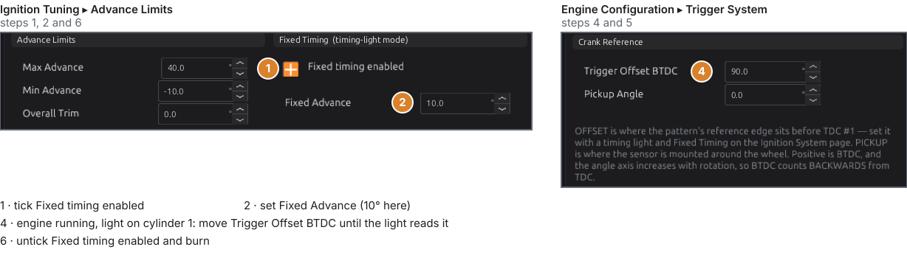
  <figcaption>Figure 20.9 — The two settings the timing-light check uses. The numbers match the
  steps below. The offset of 90° is only an example.</figcaption>
</figure>

1. On **Ignition Tuning ▸ Advance Limits** (or the Ignition System page), tick **Fixed timing
   enabled** `ignition.fixed_timing_enable`.
2. Set **Fixed Advance** `ignition.fixed_timing_deg` (−30 to 60°, default 10°). 10° is the usual
   choice: far enough from TDC to read on a light, and retarded enough to be safe at idle.
3. Start the engine and let it idle. Clip the timing light to cylinder 1's lead and read the timing
   marks.
4. On **Engine Configuration ▸ Trigger System**, change **Trigger Offset BTDC** until the light reads
   the Fixed Advance. The ECU picks up a new offset straight away, without stopping the engine.
   Raising the offset makes every spark fire **later**: if the light shows more advance than you set,
   raise the offset by the difference; if it shows less, lower it.
5. Check the reading again at a slightly higher speed, say 2000 rpm. It should not move. If it
   drifts with speed, suspect the trigger (chapter 16), not the offset.
6. Untick **Fixed timing enabled** and burn the tune.
   <!-- src: firmware/Engine/Modules/Ignition.cpp; firmware/Scheduler/EnginePositionHal.cpp; firmware/Scheduler/EnginePositionHal.h; definition/ecu.schema.yaml -->

Fixed Timing holds the number exactly. No idle correction, knock retard or cylinder trim can move it
while you read the light. It also ignores Min and Max Advance, so what you type is what fires.

!!! warning "Fixed Timing is a setup tool"
    Nothing protects the engine while it is on: no knock retard, no protection retard, no clamp. Do
    not drive on it. The studio greys **Fixed Advance** until the switch is on.

### Step 7 — The Advance Table

<figure markdown>
  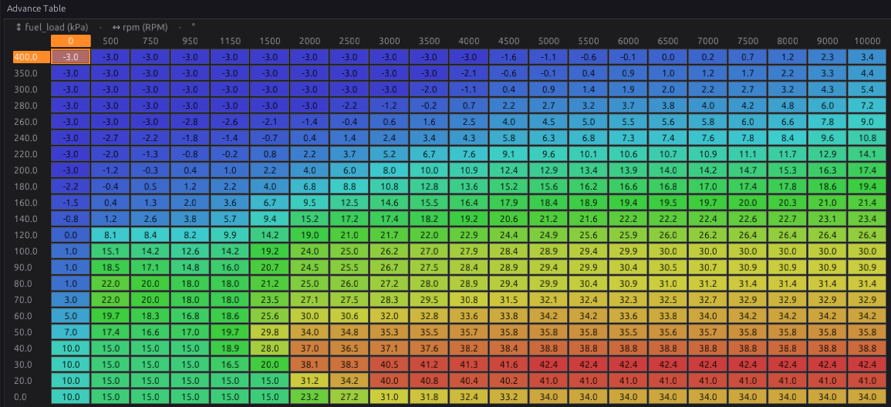
  <figcaption>Figure 20.10 — Ignition Tuning ▸ Advance Table, as shipped: engine speed across,
  Fuel Load in kPa absolute down. The top rows are boost; the bottom rows are light load.</figcaption>
</figure>

**Ignition Advance Table** `ignition.ign_table` is the engine's main timing calibration. Every other
table in this chapter corrects it, so make this map right for a warm engine on good fuel and let the
corrections handle the rest.
<!-- src: definition/ecu.schema.yaml (help) -->

- **Size:** 21 RPM columns by 22 load rows as shipped. Either axis can have from 2 to 32 breakpoints
  (**Ign RPM Axis** `ignition.ign_rpm_axis`, **Ign Load Axis** `ignition.ign_load_axis`). Put
  breakpoints where timing changes fastest, such as the step into boost, not evenly.
- **Cells:** −60 to 60°, in tenths of a degree.
- **Ethanol axis:** switch on the table's third axis (**Ign Ethanol Axis (%)**, 0 % and 100 % by
  default, up to 4 planes) for a flex-fuel engine. Both planes start identical, so switching it on
  changes nothing until you edit the E100 plane.
  <!-- src: definition/ecu.schema.yaml (ign_rpm_axis_n 2..32, ign_load_axis_n 2..32, ign_ethanol_axis_n 2..4) -->

!!! warning "The shipped map is a starting surface, not your engine's calibration"
    The default table is a generic shape so the studio has something to show. It knows nothing about
    your compression, fuel, cams or boost. Before the first start, go through it and make sure no
    cell you can reach is more advanced than you are sure is safe (chapter 39).

### Step 8 — Corrections

<figure markdown>
  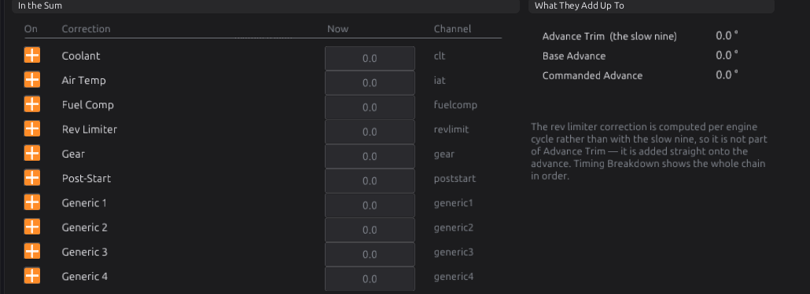
  <figcaption>Figure 20.11 — Ignition Tuning ▸ Corrections. Each correction has its own switch; the
  navigation tree only lists the ones that are on.</figcaption>
</figure>

Each correction is a table of degrees **added** to the advance: positive advances, negative
retards. Each has an on/off switch, and each has its own page under **Corrections**. The tables and
their inputs:

| Correction | Table | Reads (X) | Optional axis (off as shipped) | Switch |
|---|---|---|---|---|
| **Coolant** | **CLT Advance Correction** | coolant temperature | MAP | `ignition.enable_clt` |
| **Air Temp** | **Ign Air Temp Correction** | intake air temperature | MAP | `ignition.enable_iat` |
| **Fuel Comp** | **Ign Fuel Comp Correction** | ethanol content (%) | MAP | `ignition.enable_fuelcomp` |
| **Rev Limiter** | **Ign RPM Limiter Correction** | RPM Before Cut | MAP | `ignition.enable_revlimit` |
| **Gear** | **Ign Gear Correction** | Fuel Load (X), RPM (Y) | gear | `ignition.enable_gear` |
| **Post-Start** | **Ign Post-Start Correction** | coolant temperature | time since start (s) | `ignition.enable_poststart` |
| **Generic 1–4** | **Ign Generic *n* Correction** | RPM by default, any channel | MAP by default, any channel | `ignition.enable_generic1`…`4` |

<!-- src: definition/ecu.schema.yaml (x_channel / y_channel / z_channel, y_optional / z_optional) -->

All correction cells run from −60 to 60°. Things worth knowing about each:

- **Coolant** ships with a small **retard** when cold: −5.0° at −40 °C, −3.5° at −30 °C, −2.5° at
  −20 °C, −1.5° at −10 °C, −0.8° at 0 °C, −0.3° at 10 °C and 0 from 20 °C up. Use the hot end to
  pull timing from an engine that runs hot, where it is already close to knock.
  <!-- src: definition/ecu.schema.yaml (default_row, clt_axis) -->
- **Air Temp** is normally where timing comes out as the intake heats. On a turbo engine, switch on
  its MAP axis so you can pull more under boost than at cruise.
- **Fuel Comp** is the other way to handle ethanol: one correction table instead of a whole extra
  plane on the Advance Table. Use one or the other, not both.
- **Rev Limiter** reads **RPM Before Cut**: 0 is the hard limit, and the breakpoints (0, 50, 100, 150,
  200 and 300 rpm as shipped) count back from it. Pulling a little timing just before the cut softens
  the limiter. When the rev limiter is switched off, RPM Before Cut reads 99999, so the table reads
  its last column: keep that column at 0.
  <!-- src: definition/ecu.schema.yaml; firmware/Engine/Modules/RevLimiter.cpp -->
- **Gear** only varies by gear once you switch its **gear axis** on (**Ign Gear Axis**, gears 1 to 8).
  As shipped the axis is off, and every gear reads the same plane.
- **Post-Start** only fades out with time once you switch its **time axis** on (**Ign Post-Start
  Time Axis (s)**, 0 to 30 s as shipped). With that axis off it is simply another coolant curve that
  applies all the time.
- **Generic 1–4** can read any channel on either axis. Use them for anything the fixed tables do not
  cover, such as oil temperature or a dash switch. They add to everything else; they never override.
  <!-- src: definition/ecu.schema.yaml; firmware/Engine/TableEval.h (an optional axis that is off collapses to index 0) -->

<figure markdown>
  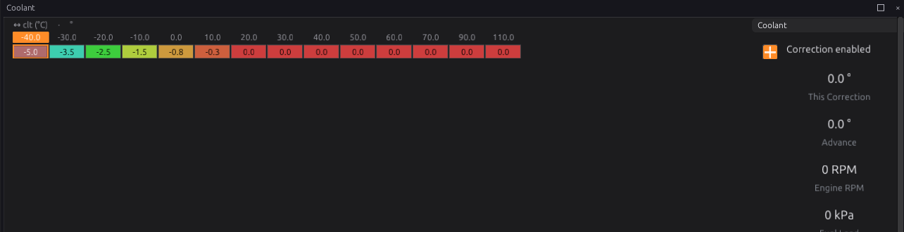
  <figcaption>Figure 20.12 — Corrections ▸ Coolant, as shipped: a retard below 20 °C and nothing
  above. The panel on the right shows this correction's value right now.</figcaption>
</figure>

### Step 9 — Cylinder trims (optional)

<figure markdown>
  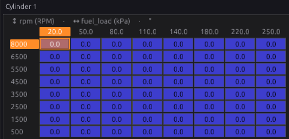
  <figcaption>Figure 20.13 — Cylinder Trims ▸ Cylinder 1. Every cylinder has one of these, on the
  same shared axes.</figcaption>
</figure>

Each cylinder has an **Ign Cylinder *n* Correction** table `ignition.cyl1_ign_corr_table` … `cyl12`,
8 × 8 against Fuel Load and RPM, in degrees added to that cylinder only. The axes (**Ign Cyl Load
Axis (kPa)**, **Ign Cyl RPM Axis**) are shared by all twelve. There is no switch: they are always
read, and they ship at zero.
<!-- src: definition/ecu.schema.yaml; firmware/Engine/Modules/Ignition.cpp -->

Use them only with evidence that one cylinder differs, such as per-cylinder EGT, individual knock
readings, or a wideband on that cylinder. They are meant for an engine that fires sequentially:
coil-on-plug with cam phase sync, as the page says. On a shared coil (wasted spark or distributor),
or before phase sync, one coil fires for more than one cylinder, so a trim on one cylinder is not
isolated to it.

### Rotary engines

:material-circle:{ .level-advanced } Advanced

With **Engine Cycle** set to *Rotary* (chapter 15), each rotor has a leading and a trailing plug. Each
coil output's **Plug** setting says which one it fires. The trailing plug has no advance of its own:
it fires at the leading angle minus the **Trailing Split** `ignition.trail_split_table`, a 16 × 16
table against RPM and Fuel Load (with an optional ethanol axis). A positive split fires the trailing
plug later. It ships at 6.0° everywhere. The split is ignored on a piston engine.
<!-- src: definition/ecu.schema.yaml; firmware/Engine/Modules/Ignition.cpp -->

<figure markdown>
  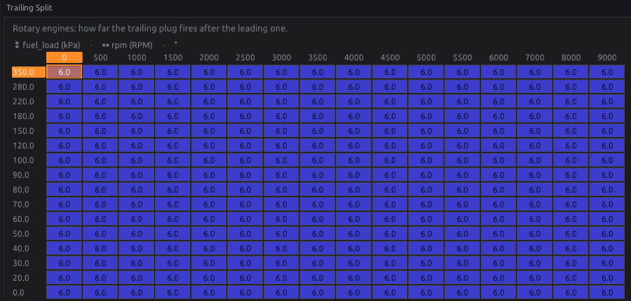
  <figcaption>Figure 20.14 — Ignition Tuning ▸ Trailing Split, shown only when Engine Cycle is
  Rotary. As shipped the trailing plug fires 6° after the leading plug everywhere.</figcaption>
</figure>

## Worked examples

:material-circle:{ .level-intermediate } Intermediate

These are **starting points**, not finished tunes. The timing values are examples; your engine's safe
advance comes from tuning it (chapter 39).

!!! example "Example 1 — naturally aspirated four-cylinder, wasted spark"
    A four-cylinder firing 1-3-4-2, a crank wheel only (no cam sensor), two twin-tower coil packs.
    This is the setup shown in Figures 20.4 to 20.8.

    | Setting | Value | Why |
    |---|---|---|
    | Ignition Mode | Wasted Spark | no cam sensor, so no phase sync; wasted spark only needs crank sync |
    | Cylinders | 4 | |
    | Coil outputs | IGN1 → Cylinder 1, IGN2 → Cylinder 2 | laid out by the studio: IGN1 fires 1 and 4, IGN2 fires 2 and 3 |
    | Dwell Time | coil maker's figure at 14 V, table shape kept | the shipped table already has 3.0 ms at 14 V |
    | Cranking Advance | on, shipped curve | a few degrees while cranking, whatever the map's lowest column says |
    | Max / Min Advance | 40° / −10° | the shipped limits; lower Max if the map never needs 40° |
    | Fixed Timing | 10° for the timing-light check, then off | Step 6 |
    | Air Temp correction | e.g. 0 up to 40 °C, −1° at 60 °C, −3° at 80 °C | pull timing as the intake heats |

!!! example "Example 2 — turbocharged six-cylinder, coil-on-plug"
    A straight six firing 1-5-3-6-2-4, with a cam sensor for phase sync and a coil on every plug.

    | Setting | Value | Why |
    |---|---|---|
    | Ignition Mode | Coil-on-Plug | sequential once the cam gives phase; paired (1/6, 2/5, 3/4) until then |
    | Coil outputs | IGN1 → Cylinder 1 … IGN6 → Cylinder 6 | laid out by the studio |
    | Max Advance | a couple of degrees above the highest cell you run | so a wrong cell or trim is caught |
    | Air Temp correction | MAP axis on; e.g. −2° at 60 °C rising to −4° at 80 °C in the boost rows | hot air under boost brings knock forward |
    | Gear correction | gear axis on; e.g. −3° in 1st and −1.5° in 2nd in the boost rows | the drivetrain, not the engine, is the limit in low gears |
    | Cylinder trims | only with evidence, e.g. −1° on the cylinder that knocks first | Step 9 |

    Pairs from the firing order: the companion of cylinder 1 is the cylinder three firing positions
    later, 6; then 2 and 5, and 3 and 4.
    <!-- src: apps/studio-jf/src/model/EngineOutputLayout.cpp -->

!!! example "Example 3 — V8 with a distributor"
    One coil, one output, a distributor to send the spark round.

    | Setting | Value | Why |
    |---|---|---|
    | Ignition Mode | Single Coil (distributor) | |
    | Cylinders | 8 | the firing order still matters: it sets when each spark event happens |
    | Coil output | IGN1 → All Cylinders | laid out by the studio |
    | Dwell Time | coil figure at 14 V | above about 3750 rpm a 3.0 ms dwell is cut back by the ECU to fit between sparks (Section 7) |

    If the spark weakens at high RPM, the coil may not recharge in the short gap. A coil that
    charges faster helps; a longer dwell setting cannot.

## Tuning it

:material-circle:{ .level-intermediate } Intermediate → :material-circle:{ .level-advanced } Advanced

Chapter 39 covers timing tuning in depth: finding best-torque timing, knock margins and fuel
effects. This section covers what is specific to this module.

**Log these channels** (chapter 42): `rpm`, `fuel_load`, `advance`, `ign_base_adv`, `ign_base_kind`,
`ign_advance_trim`, `ign_corr_revlimit`, `spark_retard_total`, `knock_retard`, `knock_level`,
`dwell`, `battery`, and each `ign_corr_*` you have switched on.

### Read the chain before you change the map

When the timing is not what you expected, open **Ignition Tuning ▸ Timing Breakdown** (Figure 20.15
under *Diagnostics*). Read it down: which base table is in use and its figure, every correction, every
retard, and what was finally commanded. Change the table that is actually responsible. A common
mistake is adding advance to the map to fix a correction or retard that is pulling timing out.
<!-- src: definition/boards/jaytek_v1.dashboard.gui ("Configuration/Ignition Tuning/Timing Breakdown") -->

- If **Advance** sits exactly on Max or Min Advance, the clamp is deciding the timing, not your tables.
- If the base table reads **Cranking Table** after the engine has caught, the engine has not passed
  **Cranking Threshold**.
- A correction reading 0 is a table of zeros at this point, not a broken input.

### Dwell

1. Start from the coil maker's figure at 14 V and keep the voltage shape.
2. If the spark is weak while cranking (the engine is reluctant to start, especially cold), check the
   6 V and 8 V cells first.
3. Feel the coils after a long idle. A hot coil is taking more dwell than it needs; bring the whole
   table down a little.
4. Switch the RPM axis on (**Dwell RPM Axis**, up to 8 breakpoints) only if you need to shorten dwell
   at high RPM, where the time between sparks is itself the limit.
   <!-- src: definition/ecu.schema.yaml -->

### Advance

1. Check base timing with the light first (Step 6). Nothing else is meaningful until that is right.
2. Set **Max Advance** just above the highest cell you intend to run.
3. Tune the Advance Table with a warm engine and the corrections neutral, then shape the
   corrections. A correction exists to handle one condition, so tune it in that condition (coolant
   when cold, air temperature on a hot day, gear in low gears).
4. Log `knock_retard`. A cell that keeps collecting knock retard is too advanced for the fuel.

!!! tip "Overall Trim for a quick test"
    To see whether an engine is timing-sensitive somewhere, pull 2° with **Overall Trim** and compare
    two logs. Set it back to 0 when you are done: it does not show as a row on Timing Breakdown.

## Diagnostics

:material-circle:{ .level-intermediate } Intermediate

<figure markdown>
  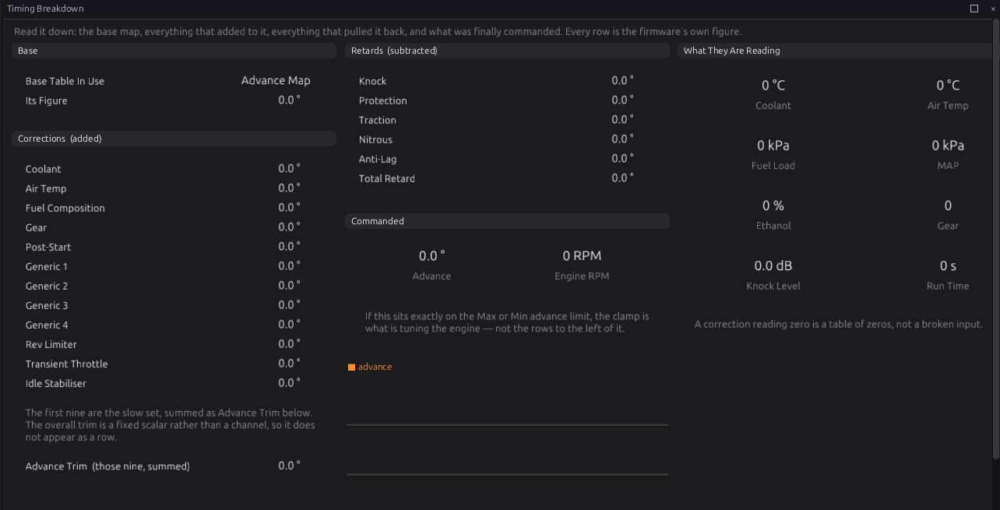
  <figcaption>Figure 20.15 — Ignition Tuning ▸ Timing Breakdown. Read it down: the base, what was
  added, what was pulled back, and what was commanded. Every row is the firmware's own figure.</figcaption>
</figure>

The ignition module sets no trouble code of its own. These codes, raised by the ECU's setup checks
and the trigger decoder, explain an engine that gets no spark on some or all cylinders:

| Code | Meaning | What sets it | What to check |
|---|---|---|---|
| **P1651** | Config: invalid firing order | A cylinder is listed twice or missing in the firing order. Nothing fires (no spark, no fuel) until it is fixed. | **Cylinders & Firing** (chapter 15). The **Firing Order Invalid** `firing_order_fault` light shows it live. |
| **P1653** | Config: a cylinder in the firing order has no coil output | No coil output row serves that cylinder (on wasted spark, a coil serving its companion counts). That cylinder gets no spark. | Each IGN output's cylinder (chapter 18); the Ignition Mode |
| **P0335–P0339** | Trigger faults | The trigger decoder | Chapter 16. No position means no spark. |

Both configuration codes are raised at severity level 3. What level 3 does is set in your engine
protection levels (chapter 29). They are checked against the configuration the ECU is actually
running, which only changes at an engine-stopped reconfigure.
<!-- src: firmware/Engine/EngineTask.cpp; firmware/Scheduler/EnginePositionHal.cpp; firmware/Scheduler/EventScheduler.h; firmware/Diagnostics/Dtc.h; definition/ecu.schema.yaml -->

**Output channels** worth watching:

| Channel | Meaning |
|---|---|
| **Ignition Advance** `advance` | The commanded advance, after the clamp (degrees BTDC) |
| **Ign Base Advance** `ign_base_adv` / **Ign Base Table** `ign_base_kind` | The base and which table it came from |
| **Ign Advance Trim** `ign_advance_trim` | The nine slow corrections, summed |
| **Ign Corr: Coolant** `ign_corr_clt` … **Ign Corr: Post-Start** `ign_corr_poststart` | Each slow correction on its own |
| **Ign Corr: Rev Limit** `ign_corr_revlimit` | The rev-limiter correction |
| **Total Timing Retard** `spark_retard_total` | Every retard, summed |
| **Timing Below Main Map** `spark_below_map` | How far the commanded advance is below the Advance Table, whatever the base. The torque model reads it. |
| **Coil Dwell** `dwell` | The dwell for this cycle, in µs |

<!-- src: definition/ecu.schema.yaml; firmware/Engine/Modules/Ignition.cpp -->

## Troubleshooting

:material-circle:{ .level-basic } Basic → :material-circle:{ .level-advanced } Advanced

| Symptom | Likely causes | Check |
|---|---|---|
| No spark at all | **Ignition Outputs** off; no trigger sync; no coil output rows; a cut active | **Ignition System ▸ Ignition Outputs**; sync level (chapter 16); P1651/P1653; the rev limiter and protection (chapters 27 and 29) |
| Spark on some cylinders only | An IGN output names the wrong cylinder or none; wiring | Each IGN output's cylinder (chapter 18); P1653; output test (chapter 43) |
| Timing light reading does not match Fixed Advance | Trigger Offset BTDC wrong | Step 6: change the offset, not the table |
| Timing light reading drifts with RPM | Trigger problem (a missed or extra tooth, noise) | Chapter 16 trigger diagnostics |
| Engine kicks back or is hard to start | Too much advance while cranking; weak spark | Switch **Cranking Advance** on with small values; the dwell at 6–8 V |
| Coils get hot | Dwell too long; wrong output polarity | The dwell table; the output's **Active High** (chapter 18) |
| Misfire at high RPM on a distributor | The dwell is limited to fit between sparks | Example 3; a faster-charging coil |
| Advance stuck at one number | **Fixed Timing** left on; **Advance** at Max or Min | The Fixed Timing switch; Timing Breakdown |
| Advance lower than the map everywhere | **Overall Trim** left in; a correction or retard pulling timing | **Overall Trim**; Timing Breakdown; `spark_retard_total` |
| Gear correction does the same in every gear | Its gear axis is off | Right-click the table ▸ Setup ▸ Table Axis Setup… |
| Post-start correction never fades | Its time axis is off | Switch on the time axis (Table Axis Setup) |
| Timing pulled only near the rev limit, or all the time with the limiter off | The Rev Limiter correction's last column is not 0 | Its table: the last column is what is read with the limiter off |
| Timing does not follow MAP on an Alpha-N engine | The Advance Table reads Fuel Load, which is throttle position under Alpha-N | Right-click the table ▸ **Table Axis Setup…** and set the load axis channel (Step 3) |

## Settings reference

Every Ignition setting, generated from the definition the studio loads:

--8<-- "reference/settings/_ignition.table.md"

## Related

- [Chapter 15 — Engine and vehicle basics](15-engine-vehicle.md) (cylinders, cycle, firing order)
- [Chapter 16 — The trigger system](16-trigger.md) (sync, and Trigger Offset BTDC)
- [Chapter 18 — Outputs and the pin system](18-outputs.md) (the IGN output rows and polarity)
- [Chapter 12 — Wiring outputs](../part2/12-wiring-outputs.md) (wiring coils)
- [Chapter 26 — Launch, shift and traction](26-launch-shift-traction.md) (the launch ignition map, traction retard)
- [Chapter 29 — Engine protection](29-protection.md) (protection retard, DTC levels)
- [Chapter 30 — Knock](30-knock.md) (knock retard and per-cylinder knock)
- [Chapter 39 — Tuning ignition](../part4/39-tuning-ignition.md)
- [Chapter 42 — Datalogging and analysis](../part4/42-datalogging.md)
