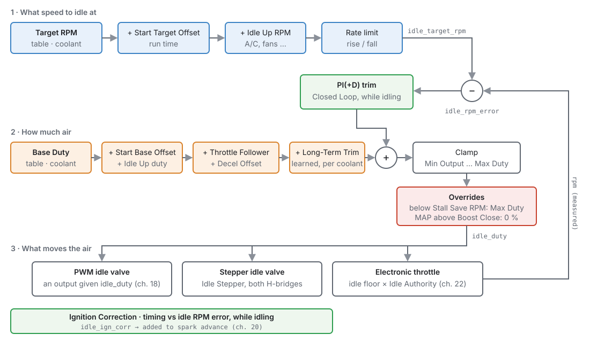
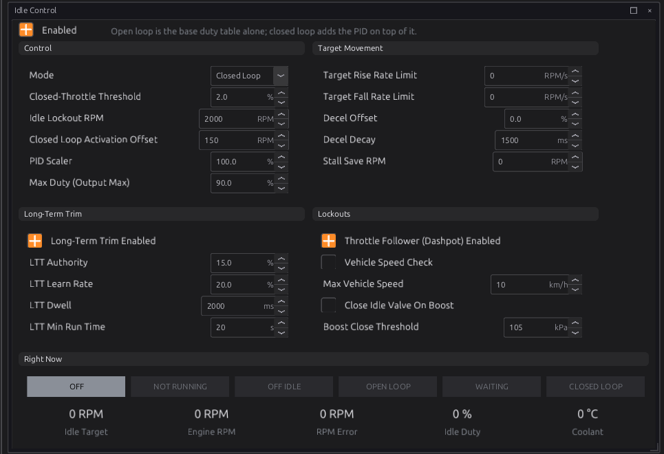
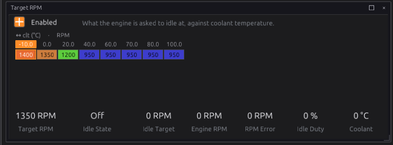
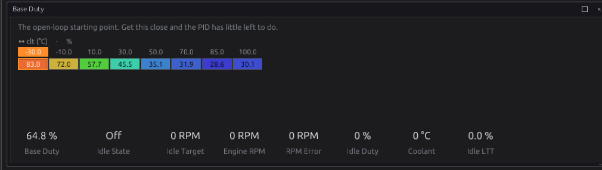
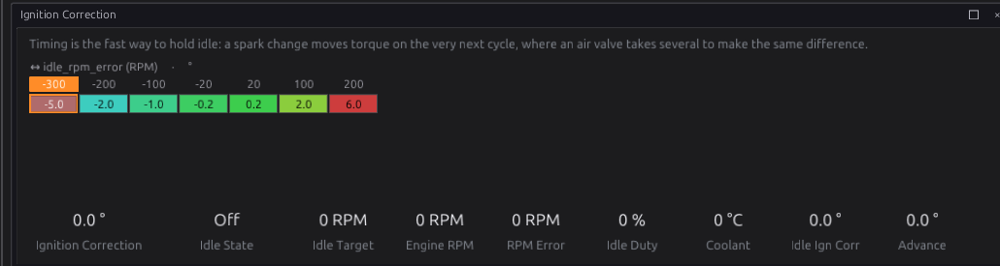
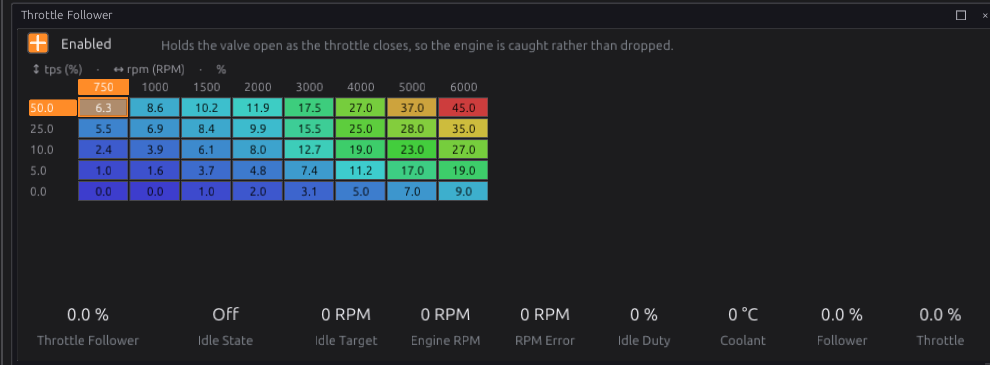
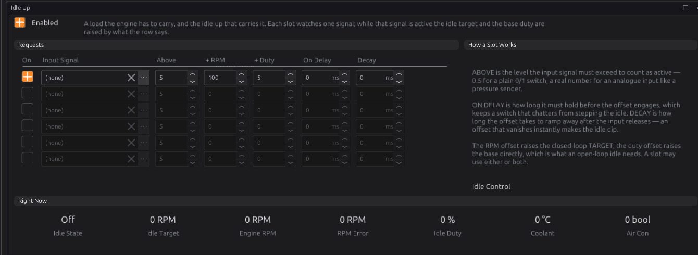
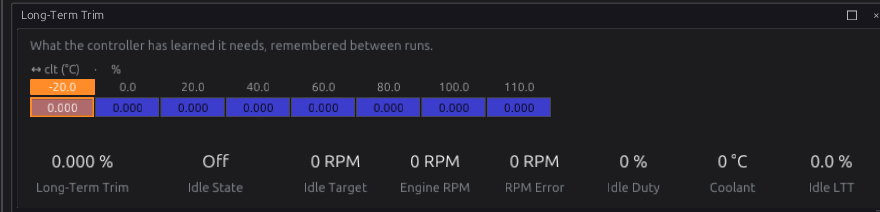
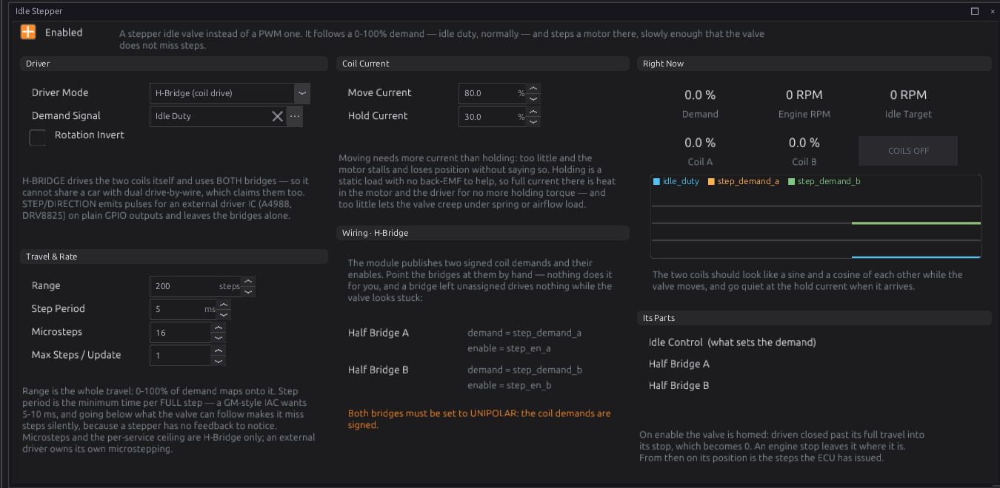

# Idle

:material-circle:{ .level-basic } Basic → :material-circle:{ .level-advanced } Advanced

> **In one sentence:** idle control gives the engine the air it needs to idle — more when cold, more
> when the air conditioning comes on — and, in closed loop, trims it until the engine sits on the
> idle speed you asked for.

## What it does

:material-circle:{ .level-basic } Basic

With the throttle closed, the engine only gets the air that leaks past the plate and through the
idle valve. Too little and it stalls; too much and it idles high. What it needs changes all the time:
a cold engine needs more air than a warm one, and an air-conditioning compressor or a cooling fan adds
load the engine has to carry.

The **Idle** module:

1. Sets an **idle target** speed, from coolant temperature, raised for a while after starting and
   while an accessory is on.
2. Works out the **air** the engine needs: a base amount from coolant temperature, plus additions for
   starting, accessories, and closing the throttle.
3. In **Closed Loop**, trims that air with a PI(+D) controller until the engine speed matches the
   target, and can nudge the **ignition timing** for a faster response.
4. Publishes the result as **Idle Duty** `idle_duty`, which drives an idle valve, a stepper valve or
   an electronic throttle.
   <!-- src: firmware/Engine/Modules/Idle.cpp -->

The **Stepper** module, in the same chapter, drives a stepper-motor idle valve to the position the
idle module asks for.

You need idle control if the engine has an idle valve (PWM or stepper) or an electronic throttle. An
engine that idles on a throttle stop screw does not need it.

## How it works

:material-circle:{ .level-intermediate } Intermediate

<figure markdown>
  
  <figcaption>Figure 21.1 — The idle calculation. Blue sets the target, orange the air, green the
  closed loop, red the overrides.</figcaption>
</figure>

The module runs 100 times a second.
<!-- src: definition/ecu.schema.yaml (cadence_hz: 100) -->

### 1 · When is the engine idling?

The engine counts as **idling** (**Idle Active** `idle_active`) when all of these are true:
<!-- src: firmware/Engine/Modules/Idle.cpp -->

- it is **running** (above the Cranking Threshold, chapter 15);
- the driver is **off the throttle**: throttle below **Closed-Throttle Threshold** (default 2.0 %). On
  drive-by-wire it is the **pedal** that is compared, because the throttle plate is held open at idle;
- engine speed is below **Idle Lockout RPM** (default 2000);
- if **Vehicle Speed Check** is on, road speed is at or below **Max Vehicle Speed** (default 10 km/h).

The base air and its additions apply whenever idle control is enabled. Only the closed loop, the
long-term trim and the ignition correction wait for the engine to be idling.

**Idle State** `idle_state` says what the module is doing:

| State | Means |
|---|---|
| Off | Idle control switched off |
| Not Running | Enabled, but the engine is stopped or cranking |
| Off Idle | Running, but one of the conditions above says it is not idling |
| Open Loop | Idling on the base air (Mode is Open Loop) |
| Waiting | Closed Loop, idling, but the speed is still above the target by more than the activation offset |
| Closed Loop | The PI controller is working. Only here do the gain tables matter. |

<!-- src: definition/ecu.schema.yaml; firmware/Engine/Modules/Idle.cpp -->

### 2 · The target

**Idle Target** `idle_target_rpm` is:

- the **Idle Target RPM** table (coolant, optionally × road speed),
- plus the **Idle Start Target Offset** (engine run time, optionally × coolant), for a higher idle just
  after starting,
- plus any active **Idle Up** slot's RPM offset,
- rate-limited by **Target Rise Rate Limit** and **Target Fall Rate Limit** (RPM per second, 0 = no
  limit), so a step in the target does not make the controller lurch.
  <!-- src: firmware/Engine/Modules/Idle.cpp -->

### 3 · The air

The **base air** is:

- the **Base Duty** table (coolant),
- plus the **Idle Start Base Offset** (run time), extra air just after starting,
- plus any active **Idle Up** slot's duty offset,
- plus the **Throttle Follower** (a dashpot: extra air by speed × throttle that follows the throttle up
  at once, and on a tip-out bleeds back down at the **Follower Decay** rate),
- plus the **Decel Offset**, a kick of air when the throttle closes that fades over **Decel Decay**
  (default 1500 ms),
- plus the **Long-Term Trim** for the current coolant temperature.
  <!-- src: firmware/Engine/Modules/Idle.cpp -->

The throttle follower and the decel offset both catch the engine as the throttle closes, so it does
not fall into a closing valve and stall.

### 4 · The closed loop

In **Closed Loop** mode, once the engine is idling **and** its speed has fallen to within **Closed
Loop Activation Offset** (default 150 rpm) above target, a PI controller trims the air. A throttle
blip is left to fall freely before the loop takes over.
<!-- src: firmware/Engine/Modules/Idle.cpp -->

- **RPM error** `idle_rpm_error` = target − actual speed. Positive means the engine is too slow.
- The **Proportional**, **Integral** and **Derivative** gains are tables scheduled **on the error
  itself** (optionally × coolant). A small error can be corrected gently and a large one, such as a
  stall in progress, firmly. The gains are in % per 100 rpm (per second for I). **PID Scaler** scales
  all three at once (100 % = as the tables say).
- The trim is limited to the room between **Idle Min Output** and **Max Duty**, and the integrator
  stops there too, so it cannot wind up.
- When the loop is not engaged, the integrator is frozen, not reset, so it does not wind up off idle.
  When the engine stops, it is reset.

**Idle Duty** is then limited to **Idle Min Output** (a table by speed) and **Max Duty** (default
90 %). If the floor is set above the ceiling, the ceiling wins.
<!-- src: firmware/Engine/Modules/Idle.cpp -->

Two overrides have the last word:

- **Stall Save RPM** (0 = off): if the running engine drops below it, the valve opens to Max Duty to
  catch it.
- **Close Idle Valve On Boost**: above **Boost Close Threshold** (default 105 kPa), the valve is shut
  (0 %), since an idle bypass leaking under boost does nothing useful.
  <!-- src: firmware/Engine/Modules/Idle.cpp -->

### 5 · Ignition correction

Spark changes torque on the next combustion; air takes several. While idling, the **Idle Ignition
Correction** table adds timing by RPM error (optionally × coolant): retard when the engine is above
target, advance when below. It is published as **Idle Ign Corr** `idle_ign_corr` and added to the spark
advance (chapter 20). Off idle it is exactly 0.
<!-- src: firmware/Engine/Modules/Idle.cpp; firmware/Engine/Modules/Ignition.cpp -->

### 6 · Long-term trim

With **Long-Term Trim Enabled**, the module learns a correction to the base air for each coolant
temperature cell (the breakpoints of **Long-Term Trim CLT Axis**, default −20 to 110 °C). While it is
in closed loop, has run for at least **LTT Min Run Time** (default 20 s) and has stayed in one coolant
cell for **LTT Dwell** (default 2 s), it moves **LTT Learn Rate** (default 20 %) of the controller's
integrator into that cell, up to **LTT Authority** (default ±15 %), and takes the same amount out of
the integrator. The learned values are kept between runs.
<!-- src: firmware/Engine/Modules/Idle.cpp; firmware/Engine/Modules/Idle.cpp (learned region) -->

So the base air slowly comes to include what the engine really needs, and the controller starts each
idle near zero.

### 7 · Idle up

Six **Idle Up** slots each watch one signal: an A/C request, a power-steering switch, a fan output,
anything on the bus. While the signal is above the slot's **Above** level for **On Delay**, the slot
adds its **+ RPM** to the target and its **+ Duty** to the base air. When the signal drops, the
addition fades over **Decay**.
<!-- src: firmware/Engine/Modules/Idle.cpp; definition/ecu.schema.yaml (idle_up) -->

### 8 · What drives the air

**Idle Duty** is an abstract demand, 0–100 %. Something has to turn it into air:

- a **PWM idle valve**: an output given `idle_duty` (chapter 18), on any low-side pin (chapter 12);
- a **stepper idle valve**: the **Idle Stepper** module (section 9);
- an **electronic throttle**: the idle demand opens the plate by up to **Idle Authority** (chapter 22).

With idle control off, nothing is published, and whatever drives the valve falls back to its own
failsafe.
<!-- src: firmware/Engine/Modules/Idle.cpp; firmware/Engine/Modules/ElectronicThrottle.cpp -->

### 9 · The stepper valve

A stepper motor has no position sensor, so the **Stepper** module keeps count:

- **Homing.** When the module is enabled (and at power-up), it assumes the valve is fully open plus
  10 %, and drives it closed that far, into its mechanical stop, where the extra steps slip. That point
  is 0. After that, the position is the steps it has issued.
- An engine stop does **not** move the valve.
- **Range** (default 200 steps) is the whole travel: 0–100 % of the demand maps onto it.
- **Step Period** (default 5 ms) is the minimum time per full step. Below the valve's rating it misses
  steps and loses its position without knowing.
- **Driver Mode**:
    - **H-Bridge (coil drive)**: the ECU drives the two coils itself on **both** H-bridges, so it
      cannot be used with an electronic throttle. **Microsteps** (default 16) and **Max Steps / Update**
      apply here. **Move Current** (default 80 %) while stepping and **Hold Current** (default 30 %)
      once there.
    - **Step/Direction (external driver)**: STEP, DIR and ENABLE signals on ordinary outputs, for an
      external driver chip, which leaves the H-bridges free.
- **Rotation Invert** reverses the direction.
- **Position Demand Signal** defaults to **Idle Duty**.
  <!-- src: firmware/Engine/Modules/Stepper.cpp; definition/ecu.schema.yaml Stepper -->

## Before you start

:material-circle:{ .level-basic } Basic

- **The engine runs** on fuel and spark (chapters 16, 19, 20), even if it needs a hand on the throttle.
- **Coolant temperature and throttle position** read correctly (chapter 17). On drive-by-wire, the
  pedal too.
- **The idle valve** is wired (chapter 12) and assigned: a PWM valve to an output given `idle_duty`
  (chapter 18), a stepper to both H-bridges or to Step/Direction outputs, or the electronic throttle
  set up (chapter 22).
- For idle-up, the accessory's signal on an input (chapter 17), such as the **Air Conditioner
  Request**.

## Setting it up

:material-circle:{ .level-basic } Basic → :material-circle:{ .level-intermediate } Intermediate

This walk-through uses **Example 1** below: closed-loop idle on a PWM idle valve.

### Step 1 — The Idle Control page

Open **Configuration ▸ Engine Functions ▸ Idle Control** and tick **Enabled**.

<figure markdown>
  
  <figcaption>Figure 21.2 — Idle Control. The lamps along the bottom show the Idle State.</figcaption>
</figure>

1. **Mode**: start in **Open Loop** until the base air is right, then change to **Closed Loop**.
2. **Closed-Throttle Threshold**, **Idle Lockout RPM**: the defaults suit most engines.
3. **Closed Loop Activation Offset**, **PID Scaler**, **Max Duty**: leave at the defaults to start.
4. **Target Movement**: the rate limits (0 = none), **Decel Offset** and **Decel Decay**, and **Stall
   Save RPM** (a little below the lowest normal idle, for example 500, or 0 for off).
5. **Long-Term Trim**: leave off until closed loop is tuned.
6. **Lockouts**: **Throttle Follower (Dashpot) Enabled**, **Vehicle Speed Check** with **Max Vehicle
   Speed**, and **Close Idle Valve On Boost** with **Boost Close Threshold** for a turbocharged engine.

The sub-pages appear in the navigation under Idle Control as they apply: the target and gain pages
only in Closed Loop, the follower pages only with the follower on.

### Step 2 — Target and base air

<figure markdown>
  { width="770" }
  <figcaption>Figure 21.3 — Idle Target RPM (the default curve).</figcaption>
</figure>

<figure markdown>
  
  <figcaption>Figure 21.4 — Base Duty, the air at each coolant temperature.</figcaption>
</figure>

1. **Target RPM**: the idle speed you want at each coolant temperature.
2. **Base Duty**: the air that gives about that speed. This is the most important table: with it
   right, the closed loop hardly has to work.
3. **Start Target Offset** and **Start Base Offset**: extra speed and air for the first seconds after
   starting. The defaults add a little and fade out by 10 s.
4. **Min Output**: the least air the valve is ever given, by engine speed.

### Step 3 — Closed loop

Change **Mode** to **Closed Loop**. The **Proportional**, **Integral** and **Derivative Gain** pages
appear. Each is a table on RPM error. Start with the defaults and tune as in *Tuning it* below.

### Step 4 — Ignition correction

<figure markdown>
  
  <figcaption>Figure 21.5 — Idle Ignition Correction. Negative error (engine too fast) retards;
  positive (too slow) advances.</figcaption>
</figure>

The default curve takes up to 5° out when the engine is 300 rpm fast and adds up to 6° when it is
200 rpm slow. For this to work, the base timing at idle must have room to advance: an engine idling
at maximum useful advance cannot be helped by more.

### Step 5 — Throttle follower

<figure markdown>
  
  <figcaption>Figure 21.6 — The throttle follower (dashpot) target.</figcaption>
</figure>

It holds air in on a tip-out so the engine comes down smoothly. **Follower Decay** sets how fast it
bleeds away (% per second, by speed). Too slow and the engine hangs at high speed after you lift; too
fast and it dips.

### Step 6 — Idle up

<figure markdown>
  
  <figcaption>Figure 21.7 — Idle Up. Slot 1 set for the air conditioning; pick its Input Signal.</figcaption>
</figure>

1. Tick a slot, pick its **Input Signal** (for example **Air Conditioner Request**).
2. **Above**: 0.5 suits an on/off switch.
3. **+ RPM** raises the target (closed loop), **+ Duty** adds air straight away (works in open loop
   too). Use both: the duty catches the load at once and the target holds the speed.
4. **On Delay** ignores a switch that chatters; **Decay** fades the addition out.

### Step 7 — Long-term trim

Once closed loop is tuned, tick **Long-Term Trim Enabled** on the Idle Control page. Its page shows
what has been learned per coolant cell:

<figure markdown>
  
  <figcaption>Figure 21.8 — Idle Long-Term Trim. Kept between runs.</figcaption>
</figure>

If a cell sits at the authority limit, the base air there is wrong: move the learned amount into
**Base Duty** by hand.

## Worked examples

:material-circle:{ .level-intermediate } Intermediate

!!! example "Example 1 — PWM idle valve, closed loop, A/C"
    | Setting | Value | Why |
    |---|---|---|
    | Idle valve | an output given `idle_duty`, PWM, e.g. LS13 | any low-side pin; a diode at the valve only if its maker asks (chapter 12) |
    | Mode | Closed Loop (after the base air is right) | holds the target through load changes |
    | Stall Save RPM | 500 | catches a stall below the lowest idle |
    | Throttle Follower | on, default table | smooth return to idle |
    | Idle Up slot 1 | Air Conditioner Request, Above 0.5, +100 RPM, +5 % | the compressor's load |
    | Long-Term Trim | on, after tuning | absorbs slow changes in the valve and engine |

!!! example "Example 2 — stepper idle valve on the H-bridges"
    A four-wire (bipolar) stepper idle valve, 200 steps full travel, rated 5 ms per step.

    <figure markdown>
      
      <figcaption>Figure 21.9 — Idle Stepper. Both half bridges must be set to Unipolar, as the page says.</figcaption>
    </figure>

    | Setting | Value |
    |---|---|
    | Idle Stepper ▸ Enabled | on |
    | Driver Mode | H-Bridge (coil drive) |
    | Range / Step Period | 200 steps / 5 ms |
    | Half Bridges A and B | demand `step_demand_a` / `step_demand_b`, enable `step_en_a` / `step_en_b`, Unipolar |

    The valve homes (drives fully closed) each time the module is enabled, so give it a second at key-on
    before cranking. With both bridges used, the engine cannot also have an electronic throttle; use
    **Step/Direction** with an external driver if it needs one.

!!! example "Example 3 — drive-by-wire"
    No idle valve at all: **Idle Duty** opens the throttle plate by up to **Idle Authority** (default
    15 %, chapter 22). The idle condition uses the **pedal**, not the plate. Set Base Duty in terms of
    that authority: 50 % base duty with 15 % authority is 7.5 % throttle.

## Tuning it

:material-circle:{ .level-intermediate } Intermediate → :material-circle:{ .level-advanced } Advanced

1. **Warm engine, open loop, no loads.** Adjust **Base Duty** at the running temperature until the
   engine idles at about the target. Log `rpm`, `idle_duty`, `clt`.
2. **As it cools**, on later cold starts, fill in the colder Base Duty cells the same way.
3. **Closed loop.** Switch it on. If the speed hunts slowly around the target, the integral gain is too
   high; lower it. If it is sluggish to recover from a load, raise the proportional gain near zero
   error. If it overshoots after a disturbance, add a little derivative.
4. **Ignition correction** makes the loop far quicker. Check that the timing change does not make the
   idle rough.
5. **Loads**: switch on each accessory and set its Idle Up slot so the speed barely dips.
6. **Tip-outs**: blip the throttle and let go. If the engine dips or stalls, raise the Throttle
   Follower or the Decel Offset; if it hangs, speed up the Follower Decay.
7. Finally, **Long-Term Trim** on.

Channels: `idle_state`, `idle_target_rpm`, `idle_rpm_error`, `idle_duty`, `idle_follower`,
`idle_ltt_pct`, `idle_ign_corr`, `rpm`, `clt`.

## Diagnostics

:material-circle:{ .level-intermediate } Intermediate

| Code | Meaning | What sets it | What to check |
|---|---|---|---|
| **P1730** | Stepper: input-demand signal missing | Idle Stepper enabled and its Position Demand Signal is not being published (for example, Idle Control is off) | Idle Control enabled; the Demand Signal |

<!-- src: definition/ecu.schema.yaml (STEP_IN P1730); firmware/Engine/Modules/Stepper.cpp (STEP_IN) -->

Idle control raises no codes of its own. Watch **Idle State** first: it says whether the numbers you
are tuning are being used.

## Troubleshooting

:material-circle:{ .level-basic } Basic → :material-circle:{ .level-advanced } Advanced

| Symptom | Likely causes | Check |
|---|---|---|
| Idle Duty never changes | Idle Control off; valve output not given `idle_duty` | Enabled; the output (chapter 18) |
| State stays **Off Idle** at idle | Throttle (or pedal) above the Closed-Throttle Threshold; speed above Idle Lockout; Vehicle Speed Check with a bad speed signal | `tps` (or the pedal) at rest; `vehicle_spd` |
| State stays **Waiting** | The engine idles above target + activation offset | Base Duty too high; a vacuum leak; the throttle stop |
| Idle hunts slowly up and down | Integral gain too high | I gain near zero error |
| Idle too high even at 0 % | Air leaking past the valve or throttle, or a vacuum leak | Mechanical: the throttle stop, hoses |
| Stalls when lifting off the throttle | Follower or decel offset too small | Throttle Follower, Decel Offset |
| Hangs at high RPM after lifting | Follower decays too slowly | Follower Decay |
| Stepper idle drifts over time | Steps being missed | Step Period at or above the valve's rating; Move Current |
| Stepper moves the wrong way | Direction reversed | Rotation Invert |
| P1730 | Stepper enabled, idle control off | Enable Idle Control, or change the Demand Signal |

## Settings reference

Idle Control:

--8<-- "reference/settings/_idle.table.md"

Idle Stepper:

--8<-- "reference/settings/_stepper.table.md"

## Related

- [Chapter 12 — Wiring outputs](../part2/12-wiring-outputs.md) (idle valves, H-bridges)
- [Chapter 15 — Engine and vehicle basics](15-engine-vehicle.md) (Cranking Threshold)
- [Chapter 18 — Outputs and the pin system](18-outputs.md) (giving an output `idle_duty`)
- [Chapter 20 — Ignition](20-ignition.md) (where the idle ignition correction is added)
- [Chapter 22 — Electronic throttle](22-electronic-throttle.md) (Idle Authority)
