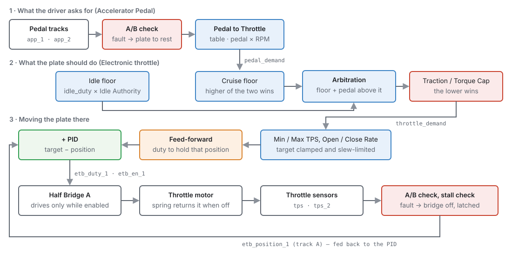
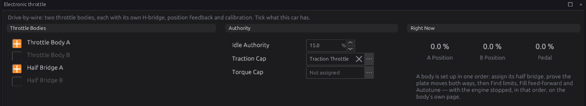
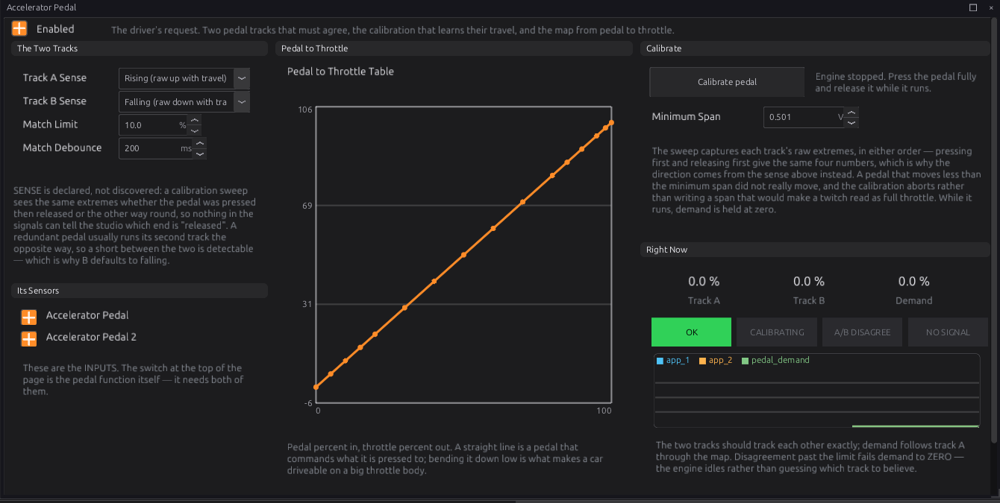
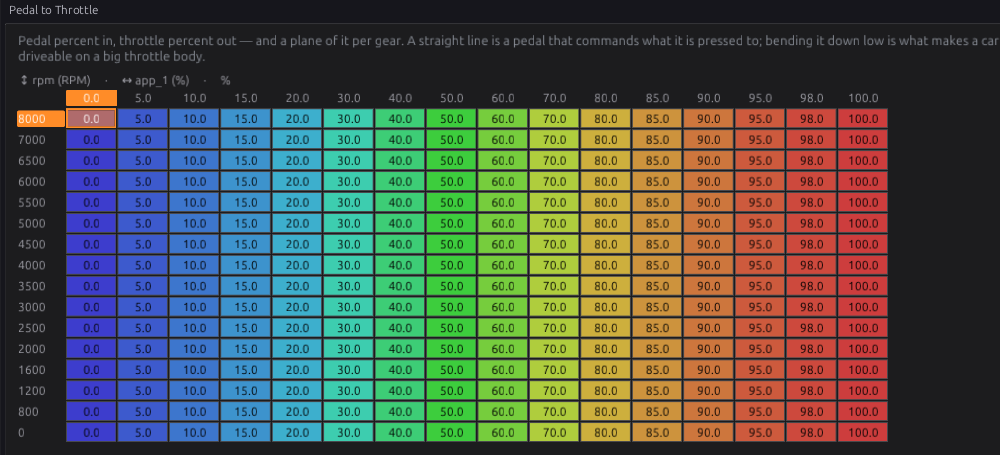
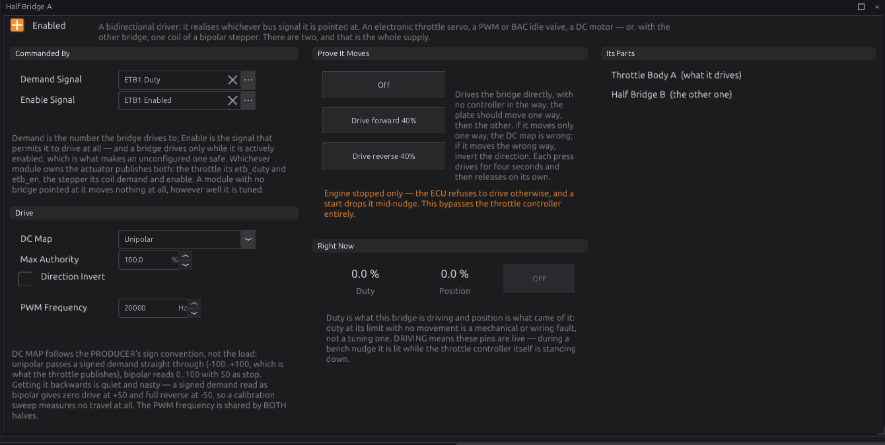
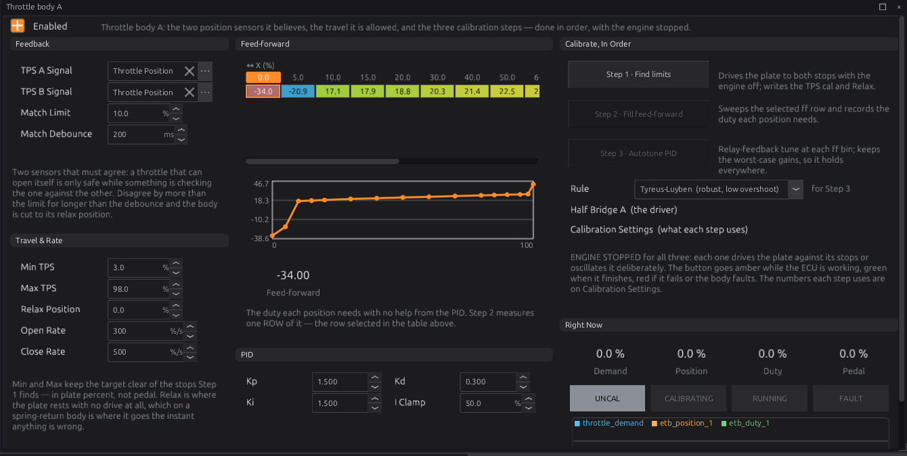
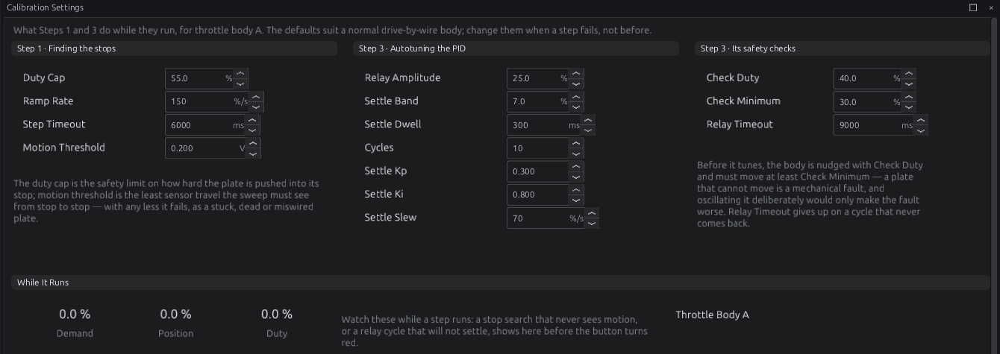

# Electronic throttle

:material-circle:{ .level-intermediate } Intermediate → :material-circle:{ .level-advanced } Advanced

> **In one sentence:** drive-by-wire reads the accelerator pedal, decides where the throttle plate
> should be, and moves the plate there with a motor — checking both the pedal and the plate with two
> sensors each, and letting the plate's spring take over the moment anything disagrees.

!!! danger "A throttle that can open itself"
    With drive-by-wire, the ECU — not a cable — opens the throttle. A wiring mistake, a wrong sensor
    direction or a skipped calibration step can open the plate when nobody asked for it. Set it up
    **with the engine stopped**, follow the steps in order, and prove every safety check works (section
    [Before you drive](#before-you-drive)) before the engine runs. Never fit a throttle body with only one
    position sensor, and never use a pedal with only one track.

## What it does

:material-circle:{ .level-basic } Basic

A drive-by-wire throttle body has a small DC motor that turns the plate against a return spring, and
two position sensors on the plate. A drive-by-wire pedal has no cable: it is a sensor with two tracks.
Three modules work together:

1. **Accelerator Pedal** (`app`) reads the two pedal tracks, checks they agree, and turns pedal travel
   into a throttle request through the **Pedal to Throttle** table. It publishes **Pedal Demand**
   `pedal_demand`.
   <!-- src: firmware/Engine/Modules/App.cpp -->
2. **Electronic throttle** (`electronic_throttle`) adds the idle controller's share, lets cruise control
   raise the request and traction control lower it, and publishes the result as **Throttle Demand**
   `throttle_demand`. Then, for each throttle body, it runs a position loop that drives the plate to
   that demand, and it watches both plate sensors and the plate's movement.
   <!-- src: firmware/Engine/Modules/ElectronicThrottle.cpp -->
3. **Half Bridge** (`h_bridge`) is the motor driver. It applies the duty the throttle asks for, in
   either direction, and only while the throttle says it may.
   <!-- src: firmware/Engine/Modules/HBridge.cpp -->

There can be **two** throttle bodies (A and B), for an engine with one throttle per bank. Each has its
own sensors, its own calibration and its own half bridge.

## How it works

:material-circle:{ .level-intermediate } Intermediate

### 1 · The pedal

Track A of the pedal (`app_1`) is the one that is used; track B (`app_2`) is the check. The two must
read within **APP Match Error Limit** (default 10 %) of each other. If they disagree, or track A
disappears, for longer than **APP Match Debounce** (default 200 ms), the pedal is not trusted. A missing
track A asks for no throttle from the moment it goes; the debounce only delays the fault, so the instant
at key-on before the sensors read cannot set it. Once the pedal is not trusted:

- Pedal Demand goes to 0 and a code is set (**P2138** for a disagreement, **P1780** for a missing
  track A).
- The throttle switches its motor **off**, so the spring takes the plate to its rest position (the
  "limp-home" position, a little open). The engine keeps running at a fast idle.
- The fault **holds until the key is turned off**, even if the tracks agree again. A pedal that failed
  once is not trusted again on the same drive. With the key off the pedal is not judged at all (the
  sensors are not read), so each key-on starts with the pedal trusted.
  <!-- src: firmware/Engine/Modules/App.cpp; firmware/Engine/Modules/ElectronicThrottle.cpp -->

When the pedal is trusted, track A goes through the **Pedal to Throttle** table (pedal % across,
engine speed down, optionally a plane per gear). The default table is a straight line: 10 % pedal asks
for 10 % throttle.
<!-- src: definition/ecu.schema.yaml -->

### 2 · The throttle demand

The throttle works out one number, **Throttle Demand**, in this order:

1. **Cruise.** While cruise control is holding a speed, its request is a floor under the pedal: the
   higher of the two is used, so pressing the pedal always overrides cruise.
2. **Idle floor.** The idle controller's **Idle Duty** is scaled by **Idle Authority** (default 15 %):
   100 % idle duty opens the plate 15 %. The pedal then works *above* that floor, so the full pedal range
   is still 0–100 %:
   `demand = floor + pedal × (100 − floor) / 100`.
3. **Caps.** **Traction Cap Signal** (wired to traction control by default) and **Torque Cap Signal**
   can each limit the demand. The lower one wins. A cap that is not assigned, or not being published,
   has no effect.
   <!-- src: firmware/Engine/Modules/ElectronicThrottle.cpp -->

Throttle Demand is a bus signal, so a Lua script can change it before the plate follows it
(chapter 35).

### 3 · The position loop

For each throttle body, 1000 times a second:

1. The target is Throttle Demand, clamped between **Min TPS** (default 3 %) and **Max TPS** (default
   98 %), so the plate never hits its end stops in normal use.
2. The target is slew-limited: it moves at most **Open Rate Limit** (default 300 %/s) opening and
   **Close Rate Limit** (default 500 %/s) closing. A sudden stab of the pedal becomes a fast ramp.
3. The **Spring Feed-Forward** table gives the duty that *holds* the plate at the target — against the
   return spring — with no help from the controller.
4. A **PID** controller adds a correction from the difference between the target and where the plate
   is (sensor A, `etb_position_1`). The integral part is limited to **Integral Clamp** (default 50 %).
5. The total duty, −100 to +100 %, goes to the half bridge. Positive opens, negative closes.
   <!-- src: firmware/Engine/Modules/ElectronicThrottle.cpp -->

The feed-forward does most of the work; the PID only trims. That is why the calibration has three
steps: find the stops, measure the feed-forward, then tune the PID.

Plate position is measured in **plate percent**: 0 % is the closed stop and 100 % the open stop, as
found by calibration. This is not the same as pedal percent.

### 4 · Safety checks

The throttle stops driving the motor — and the spring closes the plate to its rest position — when:

| Check | What trips it | Code | Clears |
|---|---|---|---|
| **Plate sensors disagree** | Sensors A and B differ by more than **TPS Match Error Limit** (default 10 %) for longer than **TPS Match Debounce** (default 200 ms), or a sensor stops reading | **P2135** | latched |
| **Plate stuck closed** | The loop is pushing the plate open (error over 8 %, duty over 25 %) and it moves less than 1.5 % in 600 ms | **P2112** | latched |
| **Plate stuck open** | The same, while pushing the plate closed | **P2111** | latched |
| **Pedal not trusted** | Pedal fault (section 1) | P2138 / P1780 | at key-off |
| **Key off** | Ignition switched off | — | at key-on |
| **Not calibrated** | The body has never been through Find limits | — | after Find limits |

<!-- src: firmware/Engine/Modules/ElectronicThrottle.cpp -->

A **latched** fault stays until a successful **Find limits**, or until the ECU restarts. Turning the
key off and on does **not** clear it, and neither does clearing the codes. The motor stays off and the
engine runs on the plate's rest position.
<!-- src: firmware/Engine/Modules/ElectronicThrottle.cpp -->

### 5 · The key-on check

A calibration saved in the tune is not trusted blindly. Each time the key is turned on:

1. The throttle reads both plate sensors and checks they agree and are inside the calibrated range.
   If not, **P2135** latches.
2. If the engine is stopped, it then **sweeps the plate** to the closed stop and to the open stop and
   checks both are where the calibration says (within 10 %). If a stop has moved, or the plate cannot
   reach it, **P2111** (the closed stop) or **P2112** (the open stop) latches. If sensor B does not
   move with the plate, **P2135** latches.
3. Only then does the loop close and the pedal work.
   <!-- src: firmware/Engine/Modules/ElectronicThrottle.cpp -->

!!! warning "The plate opens fully at key-on"
    The key-on sweep drives the plate wide open for a moment. Fuel and spark are cut while it runs and
    for half a second afterwards, so the engine cannot start into an open throttle — but it does mean
    the engine will not fire if you crank straight away. With the default settings the check takes two
    to three seconds. Turn the key, wait until the throttle has gone quiet, then start.
    <!-- src: firmware/Engine/Modules/ElectronicThrottle.cpp -->

If the key is turned on with the engine already turning, the sweep is skipped and the sensor check
alone is used.

### 6 · The half bridges

The ECU has two H-bridge drivers, **Half Bridge A** and **Half Bridge B** (chapter 12 has the pins).
Each drives a motor both ways. A half bridge does nothing clever: it applies its **Demand Signal**
while its **Enable Signal** is on, and switches off if either signal is missing. By default Half Bridge
A takes `etb_duty_1`/`etb_en_1` (throttle body A) and B takes `etb_duty_2`/`etb_en_2`.
<!-- src: firmware/Engine/Modules/HBridge.cpp; definition/ecu.schema.yaml -->

The same two bridges also drive a stepper idle valve (chapter 21), which needs **both**. So an engine
can have an electronic throttle *or* a bridge-driven stepper valve, not both. Two throttle bodies also
use both bridges.

## Before you start

:material-circle:{ .level-basic } Basic

You need:

- A drive-by-wire **throttle body** with **two** position sensors. Most have one track rising and one
  falling with plate opening; that is fine.
- A drive-by-wire **pedal** with **two** tracks.
- The throttle motor wired to a **half bridge** output, and the four sensor signals wired to analog
  inputs, each with its 5 V supply and ground (chapters 11 and 12).
- A good battery or a bench supply. The motor draws several amps while it moves.
- The sensors set up in chapter 17: **Throttle Position** and **Throttle Position 2** for body A,
  **Accelerator Pedal** and **Accelerator Pedal 2** for the pedal, each on the right analog input.
  Their calibration is written for you by the steps below.

Work with the engine **stopped** and the key **on** throughout. Every calibration step refuses to run
while the engine turns, and stops if it starts.
<!-- src: firmware/Engine/Modules/ElectronicThrottle.cpp -->

## Setting it up

:material-circle:{ .level-intermediate } Intermediate

The **Electronic throttle** page lists the throttle bodies and the half bridges, with Idle Authority
and the two caps. The note on it gives the order: assign the half bridge, prove the plate moves both
ways, then Find limits, Fill feed-forward and Autotune.

### Step 1 — The pedal

Open **Configuration ▸ Engine Functions ▸ Accelerator Pedal** and tick **Enabled**. Under **Its
Sensors**, both pedal sensors must be on.

1. Set **Track A Sense** and **Track B Sense**: which way each track's voltage moves as the pedal is
   pressed. Check it with a meter or by watching the sensor's raw voltage in the studio. The ECU
   cannot work this out itself, because pressing then releasing gives the same readings as releasing
   then pressing. Most pedals have one track rising and one falling (the default: A rising, B
   falling).
   <!-- src: firmware/Engine/Modules/App.cpp -->
2. Press **Calibrate pedal**, then within **5 seconds** press the pedal **all the way down** and
   **let it go**. The button turns amber while it runs, then green if it worked or red if it did not.
   The ECU Console says what it measured.
3. It fails if either track moved less than **Minimum Span** (default 0.5 V). Press further, or check
   the wiring.
4. Check the result under **Right Now**: foot off, both tracks read about 0 %; pedal down, both about
   100 %; in between, they move together. The **OK** lamp is lit. If one track reads 100 % with your
   foot off, its Sense setting is the wrong way round — change it and calibrate again.

### Step 2 — The pedal map

**Pedal to Throttle** turns pedal travel into a throttle request, by engine speed. Start with the
straight-line default. Change it later, when the engine runs (see [Tuning it](#tuning-it)).

### Step 3 — The half bridge

Open **Configuration ▸ Electrical ▸ Half Bridges ▸ Half Bridge A** and tick **Enabled**. The defaults
are right for throttle body A: **Demand Signal** ETB1 Duty, **Enable Signal** ETB1 Enabled, **DC Map**
Unipolar, **Max Authority** 100 %, **PWM Frequency** 20000 Hz.

Now prove the motor moves, before any controller is involved:

1. Press **Drive forward 40%**. The bridge drives for four seconds, then lets go. The plate should
   **open**, and **Position** should rise.
2. Press **Drive reverse 40%**. The plate should push **closed**.
3. If it moves the wrong way — forward closes — tick **Direction Invert** (or swap the two motor
   wires). If it moves only one way, **DC Map** is wrong: the throttle needs **Unipolar**.
   <!-- src: firmware/Engine/Modules/HBridge.cpp -->

Position may not read correctly yet (it is calibrated in the next step), but it must *move*.

### Step 4 — Throttle body A, Find limits

Open **Configuration ▸ Engine Functions ▸ Electronic throttle ▸ Throttle body A** and tick
**Enabled**. The state lamps under **Right Now** show **UNCAL** (not calibrated yet).

1. Under **Feedback**, check **TPS A Signal** is Throttle Position and **TPS B Signal** is Throttle
   Position 2.
2. Press **Step 1 · Find limits**. The ECU:
    - switches the motor off and lets the plate settle on its spring, and records that rest position;
    - drives the plate gently closed until it stops moving, and records the closed stop;
    - drives it open until it stops moving, and records the open stop;
    - writes the calibration of **both** plate sensors (closed = 0 %, open = 100 %) and the **Relax
      Position**.
      <!-- src: firmware/Engine/Modules/ElectronicThrottle.cpp -->
3. The button turns green and the lamp shows **RUNNING**. The ECU Console shows the raw readings, the
   travel and the rest position. The plate now holds the demand: with foot off, it sits at Min TPS plus
   any idle floor.

It fails, with a message in the ECU Console, if the plate does not reach a stop within **Step
Timeout** (default 6 s), or if either sensor moves less than **Motion Threshold** (default 0.2 V) — a
stuck plate, a dead sensor or a wiring fault. Settings for this step are on **Calibration Settings**.

### Step 5 — Fill feed-forward

Press **Step 2 · Fill feed-forward**. The ECU drives the plate to the open stop, then sweeps it slowly
closed and open again, and records the duty needed at each position in the **Spring Feed-Forward**
table. It uses the row selected in the table (there is one row unless you have added a coolant axis).
<!-- src: firmware/Engine/Modules/ElectronicThrottle.cpp -->

The shipped table holds values measured on one particular throttle body. Run this step for yours.

### Step 6 — Autotune

Choose a **Rule** (the default, **Tyreus-Luyben**, is the most cautious) and press **Step 3 · Autotune
PID**. The ECU first nudges the plate open to check it moves (**Check Duty**, **Check Minimum**). Then
at each feed-forward point it holds the plate still and makes it oscillate on purpose, measures how it
responds, and keeps the worst case. From that it sets **Kp**, **Ki** and **Kd**.
<!-- src: firmware/Engine/Modules/ElectronicThrottle.cpp -->

The ECU Console lists the gains every rule would give and marks the one applied. A point that "could
not settle" or gave "no clean oscillation" is skipped; see [Troubleshooting](#troubleshooting).

### Step 7 — Save

The three steps write their results into the tune in the ECU. Press **Burn** to keep them. Turn the
key off and on: the key-on check (section 5) should run and the lamp should come back to **RUNNING**.

### Before you drive

Prove the safety checks with the engine stopped and the key on, watching the lamps:

1. **Pedal:** unplug the pedal connector. The pedal page shows **NO SIGNAL** or **A/B DISAGREE**, the
   throttle motor switches off and the plate goes to rest. Plug it back in; it stays faulted until
   you turn the key off and on.
2. **Plate:** unplug the throttle body's sensor connector. **FAULT** lights and **P2135** is set. Plug
   it back in and run **Find limits** to clear it.
3. **Stuck plate:** with the pedal pressed a little, hold the plate so it cannot move (keep fingers
   out of the bore — use a piece of wood). Within a second **P2112** is set and the motor stops.

Do not drive until all three work.

## Worked examples

:material-circle:{ .level-intermediate } Intermediate

!!! example "Example 1 — one throttle body"
    A four-cylinder with one drive-by-wire throttle body and a two-track pedal.

    - Sensors (chapter 17): Throttle Position, Throttle Position 2, Accelerator Pedal, Accelerator
      Pedal 2, all enabled on their analog inputs.
    - Accelerator Pedal: Enabled; Track A Rising, Track B Falling; calibrated.
    - Half Bridge A: Enabled, defaults.
    - Throttle body A: Enabled; Find limits, Fill feed-forward, Autotune; Burn.
    - Idle Control (chapter 21): no idle valve. **Idle Duty** opens the plate through Idle Authority.

!!! example "Example 2 — two throttle bodies"
    A V8 with one throttle body per bank. Body B uses **Half Bridge B** and, by default, the auxiliary
    inputs `aux_2` and `aux_3` as its two sensors (set them up in chapter 17). Calibrate each body on its
    own page; only one calibration can run at a time. Both bodies follow the same Throttle Demand. With
    both bridges in use there is none left for a stepper idle valve.
    <!-- src: definition/ecu.schema.yaml; firmware/Engine/Modules/ElectronicThrottle.cpp -->

!!! example "Example 3 — idle with drive-by-wire"
    Idle Authority 15 %, idle Base Duty 40 %: the idle floor is 40 % × 15 % = 6 % plate. With the pedal
    half pressed, demand is 6 + 50 × 0.94 = 53 %. Raise Idle Authority if the idle controller runs out of
    range (Idle Duty sitting at its maximum); lower it for finer idle control.

## Tuning it

:material-circle:{ .level-advanced } Advanced

**The pedal map.** The throttle body's airflow is not linear: the first 20 % of plate opening gives
most of the engine's airflow at low speed. A straight pedal map makes the car jumpy off idle. Make the
low end shallower — for example 25 % pedal asking for 10 % throttle — while keeping 100 % pedal at
100 %. Use the engine speed rows to make it gentler at low speed only.

**Response.** If the plate lags the pedal, raise **Open Rate Limit**. If the car lurches on a sharp
stab of the pedal, lower it.

**The loop.** Log `throttle_demand`, `etb_position_1` and `etb_duty_1` together, and step the pedal.

- The plate overshoots and rings: lower **Kp** and **Kd**, or re-run Autotune with a more cautious
  rule.
- The plate stops short and creeps to the target: the feed-forward is off. Re-run Fill feed-forward
  (warm, if the body is sensitive to temperature), or raise **Ki**.
- The duty buzzes with the plate still: lower **Kd**.
- `etb_iterm_1` grows over weeks: the body is getting stiff (dirt or a weak spring). Clean it and
  re-run the three steps.

## Diagnostics

:material-circle:{ .level-intermediate } Intermediate

| Code | Meaning | What sets it | What to check |
|---|---|---|---|
| **P2135** | Throttle position sensors A/B disagree, or feedback lost | Tracks differ past TPS Match Error Limit for TPS Match Debounce; a sensor not reading; key-on check outside the calibrated range | Sensor wiring and 5 V supply; run Find limits |
| **P2112** | Throttle stuck closed | Pushing open with no movement for 600 ms; key-on sweep could not reach the open stop, or found it moved | Motor wiring; the bridge; ice or dirt; a seized plate |
| **P2111** | Throttle stuck open | Pushing closed with no movement; key-on sweep could not reach the closed stop, or found it moved | Something holding the plate open; the stop screw |
| **P2138** | Pedal tracks A/B disagree | Tracks differ past APP Match Error Limit for APP Match Debounce | Pedal wiring; Track Sense settings; calibrate the pedal |
| **P1780** | Pedal track A missing | Accelerator Pedal sensor not reading | Pedal connector; sensor enabled |
| **P1760** / **P1762** | Half Bridge A / B: demand signal missing | Bridge enabled, its Demand Signal unset or not published | Throttle body enabled? Demand Signal |
| **P1761** / **P1763** | Half Bridge A / B: enable signal missing | Bridge enabled, its Enable Signal unset or not published | Throttle body enabled? Enable Signal |

<!-- src: firmware/Engine/Modules/ElectronicThrottle.cpp; generated/module_dtc.h -->

The throttle codes are severity 3, the pedal and bridge codes severity 2: that decides which
**Protection Level** reacts, if you have enabled one (chapter 29). Whether or not a level is enabled,
the throttle itself always switches its motor off for P2135, P2111, P2112, P2138 and P1780.

Live channels: `pedal_demand`, `app_state`, `throttle_demand`, `etb_position_1`, `etb_duty_1`,
`etb_en_1`, `etb_target_1`, `etb_iterm_1`, `etb_state_1` (and `_2` for body B), `hbridge_duty_1`,
`hbridge_en_1`.

**ETB State** `etb_state_1`: 0 **UNCAL** (not calibrated, or waiting for the key-on check),
1 **CALIBRATING** (a step or the key-on sweep is running), 2 **RUNNING** (the loop is closed),
3 **FAULT**. **App State** `app_state`: 0 OK, 1 calibrating, 2 tracks disagree, 3 no signal.

!!! note "Engine protection does not limit the throttle"
    A protection level can enrich, retard, trim boost and lower the rev limit (chapter 29), but it
    cannot cap the electronic throttle's opening.

## Troubleshooting

:material-circle:{ .level-basic } Basic → :material-circle:{ .level-advanced } Advanced

| Symptom | Likely causes | Check |
|---|---|---|
| Pedal does nothing, lamp **UNCAL** | Find limits never run (Relax Position is 0), or the key-on check has not finished | Run Find limits; wait after key-on |
| Pedal does nothing, lamp **RUNNING** | Pedal module off or faulted; Pedal to Throttle all zero | Accelerator Pedal page: Enabled, OK lamp; the map |
| Lamp **FAULT** after every key-on | Key-on check failing: a sensor or a stop has changed | ECU Console message; run Find limits |
| Engine will not fire straight after key-on | The key-on sweep cuts fuel and spark | Wait two to three seconds before cranking |
| Drive forward closes the plate | Motor wired the other way | Direction Invert |
| Plate moves only one way | DC Map set to Bipolar | DC Map Unipolar |
| Find limits: "no closed stop" / "no open stop" | Plate cannot reach a stop in time; Duty Cap below the spring's breakaway | Motor wiring; raise Duty Cap a little; Step Timeout |
| Find limits: "TPS-B span too small" | Sensor B dead or on the wrong input | TPS B Signal; sensor B wiring |
| Autotune "could not settle" | The plate cannot hold inside the Settle Band | Widen Settle Band; re-run Fill feed-forward first |
| Autotune "no clean oscillation" | Relay too small to move the plate cleanly | Raise Relay Amplitude |
| Pedal faults on the road | Bad pedal connector; Match Limit too tight | Log `app_1`, `app_2`; the connector |
| P1760/P1761 with no throttle fitted | Half Bridge enabled with no throttle body enabled | Disable the bridge, or point it at what it should drive |
| Button turns red at once | The engine is turning | Stop the engine |
| Button does nothing | Another calibration is running (only one at a time, across both bodies); Steps 2 and 3 need the lamp on **RUNNING** | Wait for it; run Step 1 first |

## Settings reference

Accelerator Pedal:

--8<-- "reference/settings/_app.table.md"

Electronic throttle:

--8<-- "reference/settings/_electronic_throttle.table.md"

Half Bridge:

--8<-- "reference/settings/_h_bridge.table.md"

## Related

- [Chapter 11 — Wiring sensors](../part2/11-wiring-sensors.md) (throttle and pedal sensors)
- [Chapter 12 — Wiring outputs](../part2/12-wiring-outputs.md) (the H-bridge outputs)
- [Chapter 17 — Sensors](17-sensors.md) (setting up the four sensors)
- [Chapter 21 — Idle](21-idle.md) (Idle Duty and the stepper valve)
- [Chapter 26 — Launch, shift and traction](26-launch-shift-traction.md) (the traction cap)
- [Chapter 29 — Protection](29-protection.md) (protection levels)
- [Chapter 35 — Lua](35-lua.md) (changing Throttle Demand from a script)
