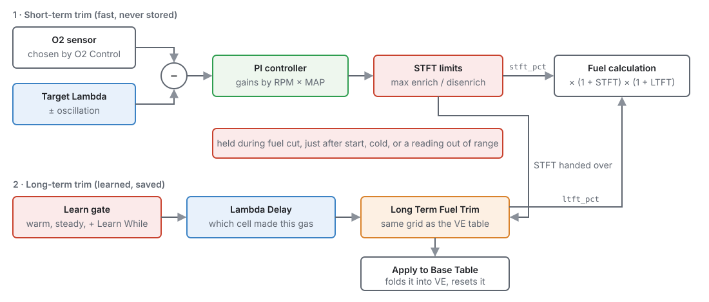
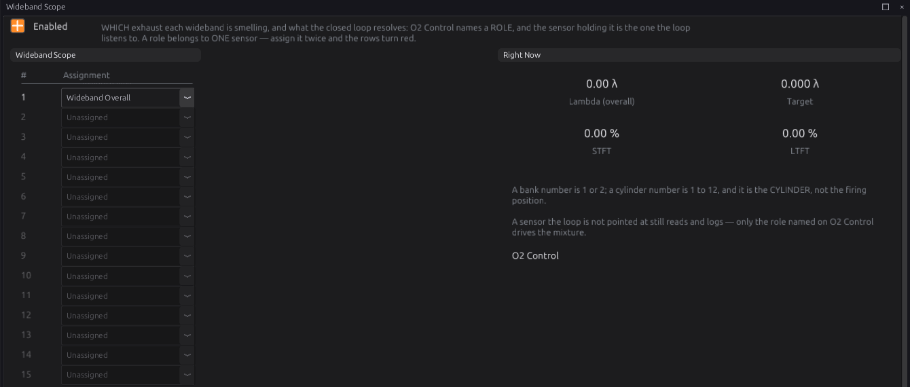
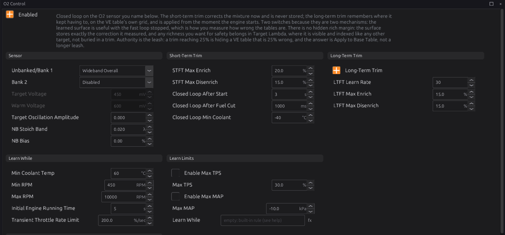
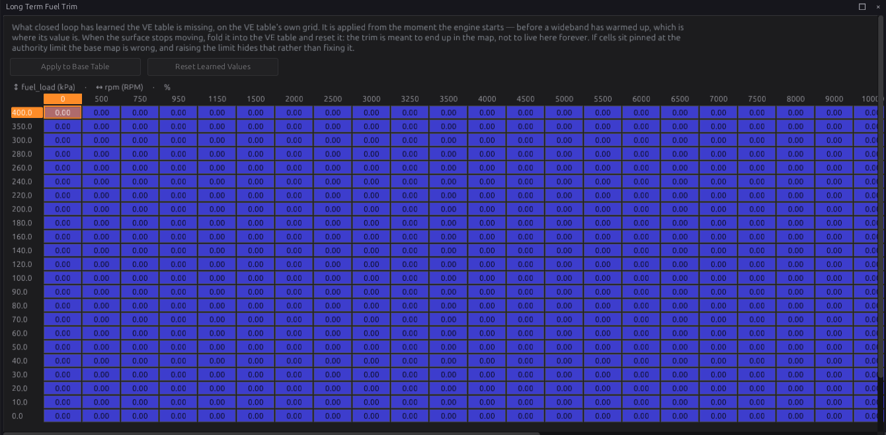
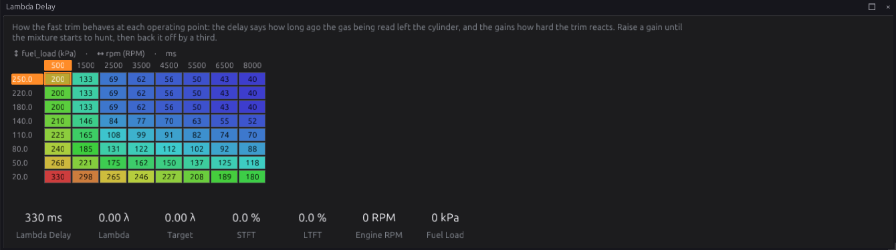
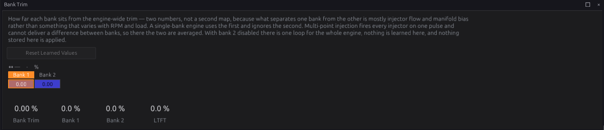

# Closed-loop lambda

:material-circle:{ .level-intermediate } Intermediate → :material-circle:{ .level-advanced } Advanced

> **In one sentence:** closed loop reads the oxygen sensor and adjusts the fuel until the mixture
> matches **Target Lambda** — a fast trim that corrects right now, and a learned trim that remembers
> the correction, cell by cell, on the VE table's own grid.

## What it does

:material-circle:{ .level-basic } Basic

The fuel calculation (chapter 19) works out how much fuel the engine *should* need. If the VE table
is a little wrong, or the fuel is different, or the engine has changed, the mixture ends up off
target. An oxygen sensor in the exhaust measures what actually happened.

The **O2 Control** module (`lambda`) uses that measurement two ways:

1. **Short-term fuel trim (STFT)** — a fast correction, updated about 30 times a second, that moves
   the mixture towards the target now. It is never saved: it starts from zero every time the engine
   starts.
2. **Long-term fuel trim (LTFT)** — a learned table with exactly the same cells as the VE table. When
   the short-term trim keeps having to make the same correction in a cell, that correction moves into
   the long-term table. The long-term trim is applied from the moment the engine starts, before the
   sensor has even warmed up.
   <!-- src: firmware/Engine/Modules/Lambda.h -->

Each has its own switch. Both off is open loop: the fuel is exactly what the tables say.

Both trims multiply the fuel: 5 % STFT and 3 % LTFT give 1.05 × 1.03 of the calculated fuel.

!!! tip "The trims are a message about the VE table"
    A long-term trim of +8 % in a cell means the VE table is 8 % short there. The trims are there to
    correct small, changing errors — fuel, weather, wear — not to hold up a wrong map. When the
    long-term table has settled, press **Apply to Base Table** to move it into the VE table (see
    [Step 5](#step-5-apply-to-base-table)).

## How it works

:material-circle:{ .level-intermediate } Intermediate

### 1 · Which sensor

**O2 Control** listens to **one** sensor per bank, chosen with **Unbanked/Bank 1**:

| Choice | Means |
|---|---|
| **Disabled** | No sensor: no closed loop |
| **Narrowband 1** / **Narrowband 2** | A narrowband (switching) sensor, set up in chapter 17 |
| **Wideband Overall** | Whichever enabled wideband has the job *Wideband Overall* on the **Wideband Scope** page |
| **Wideband Bank 1** | Whichever enabled wideband has the job *Wideband Bank 1* |
| **Wideband 1** … **Wideband 15** | That wideband directly, whatever its job |

The **Wideband Scope** page gives each wideband a job: *Unassigned*, *Wideband Overall*, *Wideband
Bank 1*, *Wideband Bank 2*, or *Cylinder 1–12*. Choosing by job means that if you move a sensor to
another input, you change one line on Wideband Scope and the loop follows it. Each job can belong to
only **one** sensor; give it to two and the rows turn red and **P1754** is set.
<!-- src: firmware/Engine/Modules/Lambda.cpp; definition/ecu.schema.yaml (lambda.o2_src_1, wb[].assign) -->

A sensor with a *Cylinder* job, or *Unassigned*, is still read and logged — useful for a reference
probe or for tuning individual cylinder trims (chapter 19) — but the closed loop does not use it.
There is no automatic per-cylinder trim.

### 2 · The short-term trim

About 30 times a second:

1. **The error.** For a wideband, the error is how far the reading is from Target Lambda, as a
   fraction: reading 1.05 with target 1.00 is 5 % lean, and fuel is added. A reading outside the
   sensor's valid range is ignored.
2. **The controller.** A proportional-integral (PI) controller turns the error into a correction. Its
   two gains, **Proportional Gain** and **Integral Gain**, are tables by engine speed and manifold
   pressure, because the exhaust takes much longer to reach the sensor at idle than at full load.
3. **The limits.** The correction is kept within **STFT Max Enrich** (default 20 %) and **STFT Max
   Disenrich** (default 15 %). Removing fuel is limited more tightly, because a sensor that wrongly
   reads rich would lean the engine out.
   <!-- src: firmware/Engine/Modules/Lambda.cpp; definition/ecu.schema.yaml (stft_max_*) -->

The trim is **held** — kept at its value, not driven and not reset — while:

- fuel is cut (overrun, a limiter, protection), and for **Closed Loop After Fuel Cut** (default
  1000 ms) afterwards, while the exhaust refills;
- the engine has been running less than **Closed Loop After Start** (default 3 s);
- the coolant is below **Closed Loop Min Coolant** (default −40 °C, meaning never);
- the wideband reads outside its valid range.

If the sensor stops reading altogether, or you switch closed loop off, the trim goes back to zero.
<!-- src: firmware/Engine/Modules/Lambda.cpp -->

### 3 · The long-term trim

The long-term trim is a table with the same axes as the VE table, so each of its cells matches a VE
cell. While the engine is running in a cell, that cell's value is applied (the nearest cell, not an
interpolation).

**Learning.** Each time the short-term trim updates, a part of it — set by **LTFT Learn Rate**
(default 30) — moves into the long-term cell, and the short-term trim drops by the same amount. The
total correction does not change; it just moves from the fast trim into the stored table. Over a few
seconds of steady running, the short-term trim settles near zero and the long-term cell holds the
correction. The long-term trim is kept within **LTFT Max Enrich** and **LTFT Max Disenrich** (default
15 % each).
<!-- src: firmware/Engine/Modules/Lambda.cpp -->

**Which cell.** The gas the sensor reads now left the cylinder a moment ago, when the engine may have
been in a different cell. The **Lambda Delay** table (by engine speed and fuel load) says how long
ago. The ECU remembers where the engine has been and credits each reading to the cell that made it.
This lets it learn during a hard acceleration, not only at steady speeds.
<!-- src: firmware/Engine/Modules/Lambda.cpp; firmware/Engine/Modules/Lambda.h -->

**When it learns.** Only when all of these are true:

- closed loop is running (not held);
- not in a fuel cut, and post-start enrichment has finished;
- coolant at least **Min Coolant Temp** (default 60 °C);
- engine speed between **Min RPM** (450) and **Max RPM** (10000);
- the engine has been running at least **Initial Engine Running Time** (5 s);
- the throttle moving slower than **Transient Throttle Rate Limit** (200 %/s);
- throttle below **Max TPS** and manifold pressure below **Max MAP** (default 100 kPa absolute, about
  atmospheric), if you enable those limits;
- and the **Learn While** expression is true, if you write one.

**Learn While** adds a condition of your own, for example `rpm > 1200` to keep learning out of idle.
It can only narrow learning, never widen it. It is written in the expression language (chapter 34).
<!-- src: firmware/Engine/Modules/Lambda.cpp -->

**Saving.** The long-term table lives in the ECU's memory and is saved to the SD card every 30 seconds
if it has changed, and again when the engine stops. Without an SD card it is learned afresh at every
power-up.
<!-- src: firmware/main.cpp -->

### 4 · Two banks

On a V engine with a sensor in each bank, set **Bank 2** to the second bank's sensor. Each bank then
runs its own short-term trim. The two are split into a common part, applied to the whole engine, and
each bank's difference from it, applied to that bank's injectors. The long-term table learns the
common part; the difference is learned as two single numbers on the **Bank Trim** page, because the
difference between banks is mostly injector flow and manifold shape, which is much the same
everywhere.
<!-- src: firmware/Engine/Modules/Lambda.cpp; firmware/Engine/Modules/FuelCalculator.cpp -->

Both bank sensors must be the same kind (both widebands or both narrowbands) and different sensors;
otherwise **P1754** is set and closed loop stays off. With **Multi-Point** injection every injector
fires together, so the two bank corrections are averaged.

### 5 · Narrowband sensors

A narrowband (standard zirconia) sensor only says **rich** or **lean** of stoichiometric (lambda 1.00);
its voltage jumps between about 0.1 V (lean) and 0.9 V (rich). With a narrowband:

- The loop drives the voltage towards **Target Voltage** (default 450 mV). It naturally cycles
  either side of it.
- The sensor is trusted only after it has once reached **Warm Voltage** (default 600 mV) — a cold
  sensor cannot produce that much.
- Closed loop runs only while Target Lambda is within **NB Stoich Band** (default ±0.02) of 1.00. A
  richer target (under boost, for example) is open loop: a narrowband cannot measure it.
- **NB Bias** shifts the correction richer (positive) or leaner. It is the only mixture adjustment a
  narrowband allows.
  <!-- src: firmware/Engine/Modules/Lambda.cpp -->

### 6 · Target oscillation

**Target Oscillation Amplitude** makes the target swing either side of Target Lambda on purpose. A
three-way catalytic converter works best with the mixture cycling a little rich and lean. On a
wideband it is in lambda: 0.02 cycles the mixture between about 0.98 and 1.02, the target stepping
to the other side each time the reading reaches it. On a narrowband it is in volts. Zero (the
default) holds the target still.
<!-- src: firmware/Engine/Modules/Lambda.cpp -->

## Before you start

:material-circle:{ .level-basic } Basic

- A **wideband** sensor and controller, wired to an analog input or connected over CAN, and set up
  as a sensor in chapter 17 (or chapter 13 for CAN). Check it reads correctly: about 1.00 at idle on
  a warm engine with a stoichiometric target, and it responds when you blip the throttle. Or a
  **narrowband** sensor, set up the same way.
- A **Target Lambda** table (chapter 19).
- A **VE table** that is roughly right. Closed loop corrects small errors; it cannot rescue a VE table
  that is 30 % out. Get close first — chapter 38, or the auto tuner in chapter 40.
- The sensor in the right place: in the exhaust before any catalyst, far enough from the engine to
  avoid excess heat, and with no air leaks upstream (a leak reads lean).

## Setting it up

:material-circle:{ .level-intermediate } Intermediate

### Step 1 — Give the wideband its job

Open **Configuration ▸ Fuel Tuning ▸ O2 Control ▸ Wideband Scope**. For your sensor's row, choose
**Wideband Overall** (one sensor for the engine) or **Wideband Bank 1** and **Wideband Bank 2** (one
per bank). Leave the others **Unassigned**. The row number is the wideband's number (Wideband O2 1 is
row 1).

### Step 2 — O2 Control

Open **Configuration ▸ Fuel Tuning ▸ O2 Control**.

1. Set **Unbanked/Bank 1** to **Wideband Overall** (or **Wideband Bank 1**, or the narrowband).
2. Leave **Bank 2** **Disabled** unless you have a sensor for each bank; then set it to **Wideband
   Bank 2**.
3. Tick **Enabled** (at the top) to turn on the short-term trim.
4. Leave **Long-Term Trim** off for now.

Start the engine and let it warm up. Watch **STFT** (`stft_pct`): once the engine has been running a
few seconds, it should move and then settle. **Closed-Loop State** (`lambda_cl_state`) shows 1
(wideband closed loop) or 2 (narrowband closed loop); 3 means enabled but open loop right now (held,
or a narrowband outside its band).

### Step 3 — Check the gains

At a steady idle and a steady cruise, watch lambda against the target:

- If lambda slowly creeps to the target, raise **Integral Gain** in that area.
- If lambda swings back and forth about the target, the gains are too high for the delay there;
  lower **Proportional Gain** first, then Integral Gain.

The defaults (Proportional 50 %, Integral 80 %) suit most engines.

### Step 4 — Long-term trim

Tick **Long-Term Trim**. Drive normally, at a range of speeds and loads, with the engine warm. Open
**Configuration ▸ Fuel Tuning ▸ Long Term Fuel Trim** to watch the table fill in.

Check the **Lambda Delay** table suits your exhaust. The defaults are typical for a sensor in the
downpipe; a sensor much further from the engine needs longer delays, and one right at the turbo
outlet shorter ones.

### Step 5 — Apply to Base Table

When the long-term table has stopped changing, press **Apply to Base Table** on the Long Term Fuel
Trim page. Every cell that has learned something is multiplied into the matching VE cell, and the
learned cell goes back to zero, in one step (one Undo). Then **Burn**.
<!-- src: apps/studio-jf/src/model/LearnedOps.cpp (applyToBase) -->

**Reset Learned Values** throws the learned table away without changing the VE table. The studio
tells you how many cells it would lose and the largest of them first.

## Worked examples

:material-circle:{ .level-intermediate } Intermediate

!!! example "Example 1 — one wideband"
    A four-cylinder with one wideband on analog input, sensor **Wideband O2 1**.

    - Wideband Scope: row 1 **Wideband Overall**.
    - O2 Control: **Unbanked/Bank 1** = Wideband Overall, Bank 2 Disabled, Enabled, Long-Term Trim on.
    - Everything else at the defaults.

!!! example "Example 2 — a V8 with a wideband per bank"
    - Wideband Scope: row 1 **Wideband Bank 1**, row 2 **Wideband Bank 2**.
    - O2 Control: **Unbanked/Bank 1** = Wideband Bank 1, **Bank 2** = Wideband Bank 2.
    - Sequential or semi-sequential injection, so each bank's injectors can be trimmed separately.
    - Watch **STFT Bank 1** and **STFT Bank 2** (each bank's difference from the common trim) and the
      **Bank Trim** page.

    

!!! example "Example 3 — the original narrowband"
    A road car keeping its standard narrowband sensor for emissions, with a stoichiometric target at
    cruise.

    - **Unbanked/Bank 1** = Narrowband 1. Target Voltage 450 mV, Warm Voltage 600 mV.
    - Target Lambda 1.00 wherever you want closed loop. Richer cells (full load) are open loop
      automatically.
    - **Target Oscillation Amplitude** 0.100 (100 mV) if the catalyst needs a firmer swing.

!!! example "Example 4 — learning only at cruise"
    A turbo engine where you want the learned trim to cover part throttle only: tick **Enable Max MAP**
    and set **Max MAP** to 100 kPa (about atmospheric — MAP is absolute pressure), or write **Learn
    While** as `map < 100 and rpm > 1500`.
    The short-term trim still corrects everywhere the target is measurable.

## Tuning it

:material-circle:{ .level-advanced } Advanced

- **Authority.** If the short-term trim often sits at its limit, the VE table is wrong there — fix
  the table rather than widening the limit. The same goes for long-term cells pinned at 15 %.
- **Transport delay.** The loop cannot react faster than the exhaust reaches the sensor. If lambda
  hunts at idle but not at load, lower the gains in the low-RPM, low-MAP corner of both gain tables.
- **Learn rate.** A higher **LTFT Learn Rate** fills the table faster but lets one noisy cell swing
  more. 30 is a good compromise; lower it if the table looks patchy.
- **Keep learning out of transients.** If cells after gear changes or tip-ins learn nonsense, lower
  **Transient Throttle Rate Limit**, or check the Lambda Delay is long enough.

Channels to log: `lambda_1` (or the sensor used), `lambda_target`, `stft_pct`, `ltft_pct`,
`lambda_cl_state`, `rpm`, `fuel_load`, and for two banks `stft_bank_1_pct`, `stft_bank_2_pct`,
`ltft_bank_1_pct`, `ltft_bank_2_pct`.

## Diagnostics

:material-circle:{ .level-intermediate } Intermediate

| Code | Meaning | What sets it | What to check |
|---|---|---|---|
| **P1753** | Closed loop enabled but no O2 sensor is reading | The chosen sensor is not giving a valid reading (normal for a few seconds while a sensor warms up) | The sensor is enabled and wired; the wideband controller; a narrowband has reached Warm Voltage |
| **P1754** | O2 source configuration invalid | The chosen source names no enabled sensor; two widebands share a job; the two banks use different kinds of sensor or the same sensor | Wideband Scope jobs; Unbanked/Bank 1 and Bank 2 |

Both are severity 1 (a warning). With P1754 the closed loop stays off.
<!-- src: firmware/Engine/Modules/Lambda.cpp; generated/module_dtc.h -->

**Closed-Loop State** `lambda_cl_state`: 0 off, 1 wideband closed loop, 2 narrowband closed loop,
3 enabled but open loop now. **O2 Source Invalid** `o2_src_fault` and `o2_assign_fault` say which
kind of P1754 it is.

Lean protection (cutting power when the mixture goes dangerously lean under load) is a separate
module, **Lambda Protection**, in chapter 29.

## Troubleshooting

:material-circle:{ .level-basic } Basic → :material-circle:{ .level-advanced } Advanced

| Symptom | Likely causes | Check |
|---|---|---|
| STFT stays at 0 | Closed loop off; no source chosen; engine not warm or just started; P1754 | Enabled; Unbanked/Bank 1; `lambda_cl_state` |
| State stays 3 on a narrowband | Target Lambda not near 1.00; sensor never reached Warm Voltage | NB Stoich Band; the sensor heater |
| STFT pinned at +20 % | VE table far too lean; an exhaust leak before the sensor; low fuel pressure | The VE table; the exhaust; fuel pressure |
| STFT pinned at −15 % | VE table far too rich; the sensor reading wrongly rich | The VE table; the sensor's calibration |
| Lambda hunts about the target | Gains too high for the transport delay | Lower Proportional Gain, then Integral Gain, in that area |
| LTFT never changes | Long-Term Trim off; a learn condition never met (coolant, run time, Max MAP) | The Learn While and Learn Limits settings on O2 Control |
| LTFT learns in the wrong cells | Lambda Delay too short or too long | The Lambda Delay table |
| Bank trims fight each other | Bank sensors swapped | Wideband Scope jobs match the banks |
| LTFT lost after a restart | No SD card | Fit an SD card (chapter 48) |

## Settings reference

--8<-- "reference/settings/_lambda.table.md"

## Related

- [Chapter 13 — CAN bus](../part2/13-can-bus.md) (CAN widebands)
- [Chapter 17 — Sensors](17-sensors.md) (wideband and narrowband sensors)
- [Chapter 19 — Fuel](19-fuel.md) (Target Lambda, the VE table, cylinder trims)
- [Chapter 29 — Engine protection](29-protection.md) (Lambda Protection)
- [Chapter 34 — Generic tables and expressions](34-tables-expressions.md) (Learn While)
- [Chapter 38 — Tuning fuel](../part4/38-tuning-fuel.md)
- [Chapter 40 — Auto tune](../part4/40-auto-tune.md)
