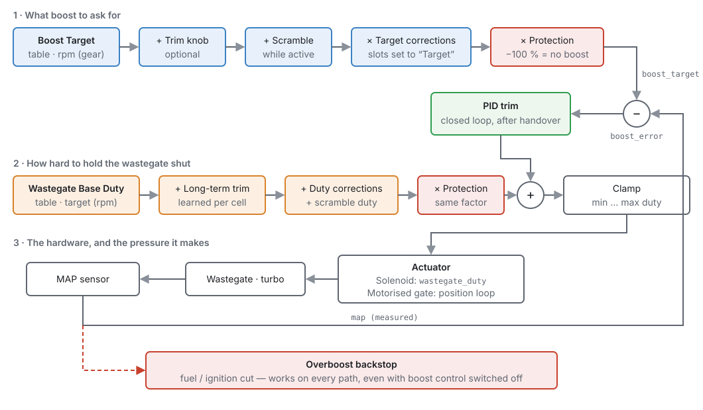
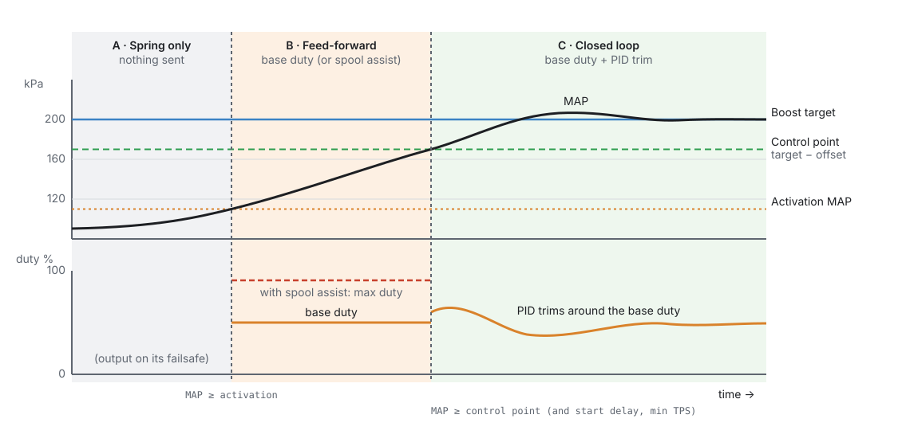
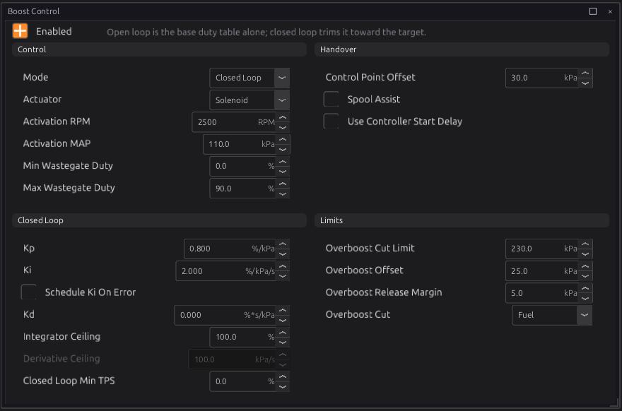
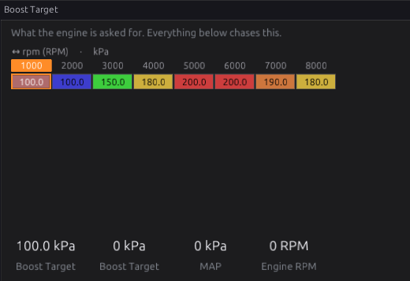
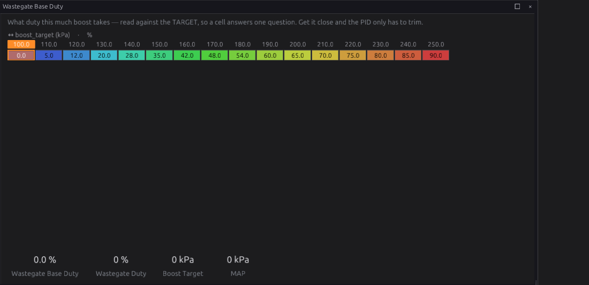
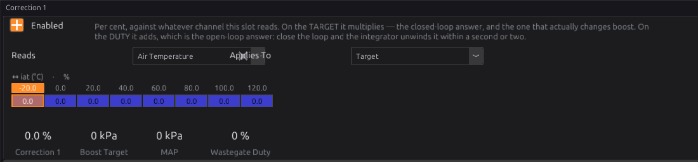
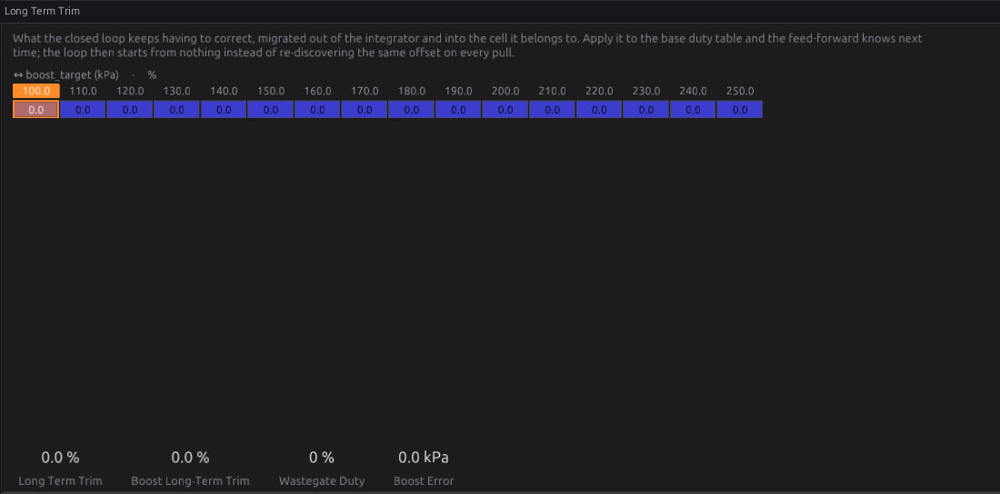

# Boost

:material-circle:{ .level-basic } Basic → :material-circle:{ .level-advanced } Advanced

> **In one sentence:** the Boost module decides how much boost to ask for, drives the wastegate to
> get it, and cuts the engine if manifold pressure ever goes where it must not.

## What it does

:material-circle:{ .level-basic } Basic

A turbocharger makes boost until its **wastegate** opens and lets exhaust bypass the turbine. On its
own, the wastegate opens at its **spring pressure**, so an engine with no boost control runs "spring
boost" everywhere. Boost control holds the wastegate shut harder, so boost can rise above spring
pressure, and it can ask for different boost at different engine speeds, in different gears, or when
the driver presses a button.

The module does four jobs:

1. **Chooses a target:** how much manifold pressure to ask for right now, from the **Boost Target**
   table and any adjustments (a trim knob, a scramble button, correction curves, engine protection).
2. **Drives the wastegate:** either a **solenoid**, given a duty cycle, or a **motorised
   (electronic) wastegate**, given a position.
3. **Closes the loop** (optional): measures manifold pressure and trims the wastegate until boost
   matches the target, whatever the weather.
4. **Guards against overboost:** cuts fuel, ignition or both if manifold pressure passes a hard limit
   or runs too far over target. This guard works even when boost control is switched off.
   <!-- src: firmware/Engine/Modules/Boost.cpp -->

You need this module if your engine has a turbocharger (or supercharger with a bypass valve) and you
want more than spring pressure, or different boost in different conditions. On a naturally aspirated
engine, leave it off.

!!! danger "Boost is the fastest way to break an engine"
    Every setting in this chapter can raise cylinder pressure. Before you raise the target, make sure
    the fuel system can keep up (chapter 19), timing is safe for the boost you are asking for
    (chapter 39), and the overboost cut (below) is set. Raise boost in small steps and log every pull.

## How it works

:material-circle:{ .level-intermediate } Intermediate

<figure markdown>
  
  <figcaption>Figure 24.1 — Everything the module does on every engine cycle. Blue boxes decide the
  target, orange boxes decide the duty, green is the closed loop, red is safety.</figcaption>
</figure>

### 1 · The target

The target starts in the **Boost Target** table, read against engine speed (and, if you switch the
second axis on, gear). Then, in this order:

- **Trim knob** (if assigned): adds up to **Trim Authority** kPa at full knob travel. The default
  authority is **−100 kPa**, so the knob can only ever *take boost away*.
- **Scramble** (if assigned): adds **Scramble Boost Bump** kPa while scramble is active.
- **Target corrections**: any of the four correction slots set to *Target* scale the boost part of
  the target by their summed per cent.
- **Engine protection**: when the protection system asks for less boost, the target is scaled down
  the same way. At −100 % the target becomes atmospheric pressure: no boost at all.
  <!-- src: firmware/Engine/Modules/Boost.cpp -->

!!! info "Advanced — per cent of *boost*, not of pressure"
    Corrections and protection scale only the part of the target **above barometric pressure**. A
    −10 % correction on a 200 kPa target at sea level (about 100 kPa of boost) removes 10 kPa, not
    20 kPa, and a −50 % correction leaves half the boost, not none.
    <!-- src: firmware/Engine/Modules/Boost.cpp -->

The final target is published as the output channel **Boost Target** `boost_target`, and the
difference between it and measured manifold pressure as **Boost Error** `boost_error`. Both are
published whenever the module is enabled and armed, even before boost control becomes active, so you
can always log them.

### 2 · Activation: when the module acts at all

The module only drives the wastegate when **both** of these are true:

- engine speed is at or above **Activation RPM**, and
- manifold pressure is at or above **Activation MAP**.

Below that, nothing is sent to the wastegate output, so it falls back to its failsafe: the wastegate
on its spring. The closed-loop state is reset each time the engine drops out of activation.
<!-- src: firmware/Engine/Modules/Boost.cpp -->

### 3 · The feed-forward duty

Once active, the module works out a **base duty** from the **Wastegate Base Duty** table. This
table is read against the **boost target**, not against engine speed: each cell answers the question
"what duty does this much boost take?". An optional RPM axis covers the part the target cannot
explain: the same boost can take more duty where there is less exhaust energy.

To the base duty it adds the learned **long-term trim** for the current cell, any correction slots set
to *Duty*, and the **Scramble Duty Bump** while scramble is active. The whole sum is then scaled by
the same protection factor as the target, so a protection pull-back also reduces duty in open loop.
<!-- src: firmware/Engine/Modules/Boost.cpp -->

In **Open Loop** mode that is the whole answer, clamped between **Min Wastegate Duty** and
**Max Wastegate Duty**.

### 4 · Closed loop, and the handover

In **Closed Loop** mode a PID controller trims the base duty to remove the boost error. It does not
start the moment the module activates. During the spool the error is large, and a loop that
integrated it would still be winding up when boost arrived. So the loop takes over only when **all**
of these pass:

1. manifold pressure has reached the **control point**: the target minus **Control Point Offset**;
2. throttle is at or above **Closed Loop Min TPS** (if that is not 0);
3. the **Controller Start Delay** has elapsed since activation (if **Use Controller Start Delay** is
   on). The delay is a curve against RPM.
   <!-- src: firmware/Engine/Modules/Boost.cpp -->

<figure markdown>
  
  <figcaption>Figure 24.2 — A spool from low boost to target. The loop takes over at the control
  point (green dashed line), not at activation, so it arrives fresh instead of wound up.</figcaption>
</figure>

Before the handover, the output rests on the base duty, or on **Max Wastegate Duty** if **Spool
Assist** is on. Spool assist holds the gate fully shut for the fastest possible spool, and then
depends entirely on the control point being far enough below target for the loop to catch it.
<!-- src: firmware/Engine/Modules/Boost.cpp -->

While the loop is held off, its integrator is **frozen, not reset**. Boost falling back under the
control point (a gear change on boost, say) keeps what the loop had learned, and nothing accumulates
during the spool. Dropping out of activation altogether (below Activation RPM or MAP, as a real lift
usually does) **resets** it, so each spool from off-boost starts fresh.
<!-- src: firmware/Engine/Modules/Boost.cpp (reset below activation) (frozen before handover) -->

After the handover:

- **Kp** adds duty in proportion to the boost error, straight away.
- **Ki** accumulates the error over time to remove a steady offset. With **Schedule Ki On Error**
  on, Ki comes from the **Integral Gain vs Error** curve instead: gentle near target, firmer far
  from it.
- **Kd** reacts to how fast the error is changing, which damps overshoot. The rate it reacts to is
  limited by **Derivative Ceiling**, so one noisy MAP sample cannot spike the duty.
- The integrator is limited twice. It can never ask for more than the output can deliver
  (anti-windup to the min/max duty), and **Integrator Ceiling** can limit it further.
  <!-- src: firmware/Engine/Modules/Boost.cpp -->

### 5 · Long-term trim

With **Long-Term Trim Enabled**, the module learns what the loop keeps having to correct. While the
loop is in control and the engine sits in one base-duty cell for **Learn Dwell**, it moves **Learn
Rate** per cent of the integrator into that cell's trim, and takes the same amount back out of the
integrator. The total duty does not change at that moment; next time, the feed-forward already knows.
<!-- src: firmware/Engine/Modules/Boost.cpp -->

Learning only happens inside the gates you set: RPM between **Learn Above RPM** and **Learn Below
RPM**, throttle at or above **Learn Above TPS**, and gear at or above **Learn Above Gear**. The gear
test passes when the gear cannot be read, so a car without gear detection still learns. No cell may
hold more than **Trim Authority** per cent either way. The trim is stored in the ECU's learned memory,
not in the tune, so it survives reflashing the tune.
<!-- src: firmware/Engine/Modules/Boost.h, Boost.cpp -->

### 6 · The actuator

- **Solenoid:** the final duty goes out as **Wastegate Duty** `wastegate_duty`, and an output
  assigned to that channel drives the solenoid (chapter 18).
- **Motorised Gate:** the duty is read as "per cent held shut", so the position asked for is
  100 % minus the duty. It is clamped to **Gate Minimum/Maximum Position**, limited to **Gate Slew
  Limit** per second, and an inner PID (**Gate Position Kp/Ki/Kd**) drives an H-bridge until the
  position sensor agrees. This needs **Gate Position Signal** set. With no position signal the
  module falls back to sending solenoid duty on `wastegate_duty`, and the motor is not driven. The position asked for is published as `wastegate_pos_target` and the motor drive
  as `wastegate_pos_duty`.
  <!-- src: firmware/Engine/Modules/Boost.cpp -->

!!! danger "A motorised gate must be spring-open"
    When the module is off, unarmed or below activation, it stops driving the gate. A gate whose
    spring holds it **open** then gives spring boost. A gate that stays wherever it was, or is held
    shut, gives uncontrolled boost. That is the one failure the pressure loop cannot see coming.

### 7 · The overboost backstop

Two independent limits, checked on every engine cycle, **even with boost control off or unarmed**:

- **Overboost Cut Limit:** an absolute manifold pressure the engine must never see. It does not move
  with the target.
- **Overboost Offset:** how far over the *current target* manifold pressure may go. This one follows
  the target down, so it still protects in low gears or under a protection pull-back, where the
  absolute limit is far away. It only applies while the target is at or above Activation MAP.

When either trips, the module asks for a fuel cut, an ignition cut or both (**Overboost Cut**). The
cut holds until pressure falls **Overboost Release Margin** below the limit that tripped it, so it
does not chatter. Either limit set to 0 is off.
<!-- src: firmware/Engine/Modules/Boost.cpp -->

This backstop is separate from the engine-protection overboost fault (P0234, chapter 29). Set both.

## Before you start

:material-circle:{ .level-basic } Basic

You need:

- **A MAP sensor that reads above atmospheric pressure**, configured and calibrated (chapter 17). The
  module cannot run without manifold pressure. If it goes missing while boost control is enabled, it
  raises **P1710 Boost: MAP signal missing**.
- **A boost control actuator**, wired and assigned to an output (chapters 12 and 18):
    - a wastegate **solenoid** on an output assigned to **Wastegate Duty**, or
    - a **motorised wastegate** on an H-bridge output, plus a position sensor configured as a sensor.
- **Safe fuel and timing at the boost you intend to run.** Configure the fuel and ignition chapters
  first.
- Optional inputs, each configured as a signal before you can select it: an **arm switch**, a
  **trim knob** (an analog input read 0–100 %) and a **scramble button**.

## Setting it up

:material-circle:{ .level-basic } Basic → :material-circle:{ .level-intermediate } Intermediate

The Boost pages are under **Configuration ▸ Engine Functions ▸ Boost Control**. Some pages only appear
in the navigation tree when their feature is switched on. For example, **Trim Learning** appears once
long-term trim is enabled, and **Correction 1** once that slot is enabled.

<figure markdown>
  
  <figcaption>Figure 24.3 — The Boost Control page, set up as in Example 1 below. Control, Handover,
  Closed Loop and Limits are grouped as they are explained here.</figcaption>
</figure>

1. **Set the overboost limits first**, before anything can make boost. In **Limits**, set **Overboost
   Cut Limit** a safe margin above the most boost you will ever ask for. Set **Overboost Offset** to
   the overshoot you will tolerate over target (Example 1 uses 25 kPa). Choose **Overboost Cut**.
   *Fuel* is the default; *Ignition* is gentler on a lean-sensitive engine; *Both* is the hardest cut.
2. **Tick Enabled.**
3. **Choose the actuator** in **Actuator**: *Solenoid* or *Motorised Gate*.
4. **Set activation.** **Activation RPM** (default 2000) and **Activation MAP** (default 110 kPa)
   define "on boost". Below both, the wastegate is left on its spring.
5. **Start in Open Loop.** Leave **Mode** on *Open Loop* until the base duty table is roughly right
   (see *Tuning it*).
6. **Fill in the Boost Target table** (Figure 24.4). The default is a single row against RPM. To make
   it different in each gear, switch its gear axis on.
7. **Fill in the Wastegate Base Duty table** (Figure 24.5). Leave it at its defaults until you tune
   it.
8. **Set Min Wastegate Duty and Max Wastegate Duty.** Leave Min at 0 unless your valve does nothing
   below some duty. Max (default 90 %) is the most any combination of table and trim can command.
9. **When the base table is close, switch Mode to Closed Loop** and set the **Handover** and
   **Closed Loop** groups as described in *Tuning it*.

<figure markdown>
  
  <figcaption>Figure 24.4 — Boost Target, as shipped: a curve against engine speed in kPa absolute
  (100 kPa is atmospheric).</figcaption>
</figure>

<figure markdown>
  
  <figcaption>Figure 24.5 — Wastegate Base Duty, read against the boost target: each cell is "the duty
  this much boost takes".</figcaption>
</figure>

!!! tip "kPa is absolute"
    All pressures here are **absolute**: atmospheric is about 100 kPa at sea level, so 200 kPa is
    about 1 bar (14.5 psi) of boost. Subtract barometric pressure to get gauge boost.

### Optional driver controls

- **Arm Switch Signal:** while this signal is not asserted, boost control does nothing and the turbo
  runs on spring pressure. The tune behind it is unchanged. The overboost backstop still works.
- **Boost Trim Signal** and **Trim Authority:** a dash knob that moves the target. The default
  authority of −100 kPa means the knob can only reduce boost, so a knob left turned up, or an input
  that fails high, cannot ask for more than the map allows.
- **Scramble Input Signal:** a button that adds **Scramble Boost Bump** kPa (and optionally
  **Scramble Duty Bump**). A tap runs for at least **Scramble Hold Time**. Holding the button cannot
  keep it on longer than **Scramble Maximum Time**, after which it is locked out for **Scramble Rest
  Time**. The rest only follows a run that hit the maximum, so normal taps re-arm straight away.
  <!-- src: firmware/Engine/Modules/Boost.cpp -->

### Corrections

Four correction slots each read a channel through a curve (for example intake air temperature) and
apply the result either to the **Target** (per cent of boost) or to the **Duty** (points of duty). Set
**Correction N Applies To** accordingly. A slot that is not enabled is not evaluated at all.
<!-- src: firmware/Engine/Modules/Boost.cpp -->

<figure markdown>
  
  <figcaption>Figure 24.6 — Correction 1: pick the channel it reads, what it applies to, and fill in
  the curve.</figcaption>
</figure>

## Worked examples

:material-circle:{ .level-intermediate } Intermediate

These are **starting points**, not finished tunes. Every engine and turbo is different. Log, check
and adjust.

!!! example "Example 1 — single turbo, internal wastegate, 3-port solenoid, closed loop"
    A street engine with about 70 kPa (10 psi) of spring pressure, aiming for about 100 kPa
    (15 psi) of boost.

    | Setting | Value | Why |
    |---|---|---|
    | Actuator | Solenoid | a 3-port wastegate solenoid on a low-side output |
    | Mode | Closed Loop | once the base table is close |
    | Activation RPM / MAP | 2500 / 110 kPa | ignore light-load driving |
    | Control Point Offset | 30 kPa | the loop takes over 30 kPa below target |
    | Kp / Ki / Kd | 0.8 %/kPa / 2.0 %/kPa/s / 0 | gentle; the base table does the heavy work |
    | Max Wastegate Duty | 90 % | the default ceiling |
    | Overboost Cut Limit | 230 kPa | well above the 200 kPa target |
    | Overboost Offset | 25 kPa | catches a stuck gate or split hose at any target |
    | Overboost Cut | Fuel | |

    Boost Target: 200 kPa from 3500 rpm up, tapering in below that. This is the example shown in
    Figure 24.3.

!!! example "Example 2 — motorised (electronic) wastegate"
    A spring-open electronic wastegate on an H-bridge, with its position sensor configured as a
    0–100 % signal.

    | Setting | Value | Why |
    |---|---|---|
    | Actuator | Motorised Gate | position control instead of duty |
    | Gate Position Signal | the valve position sensor | without it the motor is not driven at all |
    | Gate Minimum / Maximum Position | 0 / 100 % | full travel; narrow it if the valve binds at an end |
    | Gate Slew Limit | 200 %/s | the valve ramps rather than slams |
    | Gate Position Kp / Ki / Kd | start low and tune on the bench | step the target and watch the position trace |

    Tune the inner position loop first, with the engine off: the gate should follow a stepped target
    quickly without overshoot. Then tune the boost loop exactly as for a solenoid.

!!! example "Example 3 — track car with arm switch and scramble"
    - **Arm Switch Signal**: a dash switch, so boost control is only active on the track.
    - **Scramble Input Signal**: a steering-wheel button; **Scramble Boost Bump** 20 kPa, **Hold** 5 s,
      **Maximum** 10 s, **Rest** 30 s: a short overtake boost that cannot be left on.
    - **Correction 1** on intake air temperature, applying to *Target*: −5 % at 50 °C, −15 % at 70 °C,
      to protect a hot charge.

## Tuning it

:material-circle:{ .level-intermediate } Intermediate → :material-circle:{ .level-advanced } Advanced

**Log these channels** for every pull: `map`, `boost_target`, `boost_error`, `wastegate_duty`, `rpm`,
`tps`, and when used, `boost_ltt_pct` or `wastegate_pos_target`/`wastegate_pos_duty` (chapter 42).

### Step 1 — Base duty in open loop

1. Set **Mode** to *Open Loop*, the Boost Target to your first goal, and the whole base duty table to
   0 %. You now have spring boost everywhere.
2. Do a full-throttle pull in a middle gear. Note the spring boost.
3. For the target cell you are working on, raise the base duty a few per cent at a time until boost
   on a pull settles at the target. Work up the table, one target cell at a time.
4. If boost at the same target differs between low and high RPM, switch the base table's RPM axis on
   and tune each row.

A good base table is the most important part of boost tuning. With it, the closed loop only corrects
for the day's weather and can run gentle gains.

### Step 2 — Close the loop

1. Switch **Mode** to *Closed Loop* with **Ki** at 0 and **Kd** at 0.
2. Set **Control Point Offset** to where you want the loop to take over. Start around 20–40 kPa.
   Too large and the loop fights the end of the spool; too small (especially with Spool Assist) and
   boost overshoots before the loop can catch it.
3. Raise **Kp** until boost holds close to target, then back it off if it starts to oscillate.
4. Add **Ki** slowly to remove the remaining steady error. If boost hunts around the target, lower Ki,
   or turn on **Schedule Ki On Error** and use a smaller Ki near zero error.
5. Add **Kd** only if boost overshoots on a fast spool.

!!! warning "If the loop is doing all the work, the base table is wrong"
    A large, steady `boost_error` that the integrator keeps correcting means the base duty table needs
    more work. **Integrator Ceiling** can force the issue by limiting how much the integrator alone may
    add.

### Step 3 — Let it learn (optional)

Once the loop is stable, enable **Long-Term Trim** to migrate the loop's standing corrections into the
base table cell by cell. Keep **Trim Authority** small (default 15 %). A cell that hits the limit is
telling you to fix the base table by hand.

<figure markdown>
  
  <figcaption>Figure 24.7 — Long Term Trim: one learned value per base-duty cell. Zero everywhere means
  nothing has been learned yet.</figcaption>
</figure>

## Diagnostics

:material-circle:{ .level-intermediate } Intermediate

| Code | Meaning | What sets it | What to check |
|---|---|---|---|
| **P1710** | Boost: MAP signal missing | Boost control is enabled and armed but manifold pressure is not valid | MAP sensor wiring and configuration (chapter 17); the module cannot run without it. It clears when MAP returns, or when boost control is switched off. |
| **P0234** | Protection: overboost | Raised by engine protection, not by this module | Chapter 29. The Boost backstop cut is separate and does not set a code of its own. |

<!-- src: firmware/Engine/Modules/Boost.cpp; definition/ecu.schema.yaml module_dtc BOOST_MAP = P1710 -->

**Output channels** worth watching: **Boost Target** `boost_target`, **Boost Error** `boost_error`,
**Wastegate Duty** `wastegate_duty`, **Boost Long-Term Trim** `boost_ltt_pct`, **Wastegate Position
Target** `wastegate_pos_target`, **Wastegate Motor Duty** `wastegate_pos_duty`, and **Protection
Boost Corr** `prot_boost_corr` (what engine protection is asking for).

## Troubleshooting

:material-circle:{ .level-basic } Basic → :material-circle:{ .level-advanced } Advanced

| Symptom | Likely causes | Check |
|---|---|---|
| Only spring boost, `wastegate_duty` stays at 0 | Module off; not armed; below activation; output not assigned | **Enabled**; the arm switch signal; `rpm` and `map` against Activation RPM/MAP; the output assigned to Wastegate Duty (chapter 18) |
| `wastegate_duty` moves but boost does not change | Solenoid plumbed wrongly or not powered; wrong solenoid type | Solenoid wiring and power; hose routing for your solenoid (chapter 12); listen for it clicking |
| Boost overshoots on every spool | Spool Assist on with the control point too close; base duty too high; Ki too high | Turn Spool Assist off; raise Control Point Offset; lower base duty for that target |
| Boost oscillates around target | Kp or Ki too high | Lower Kp first, then Ki; consider Schedule Ki On Error |
| Boost sits below target in closed loop | Max Wastegate Duty reached; Integrator Ceiling too low; turbo out of breath | `wastegate_duty` against Max Wastegate Duty; the ceiling; whether the turbo can make the target at that RPM |
| Engine cuts on a good pull | Overboost Offset too tight for normal overshoot | Log `map` against `boost_target`; allow more offset or reduce overshoot |
| Boost drops for no reason | Engine protection pulling the target | `prot_boost_corr` and the active protection conditions (chapter 29) |
| P1710 | MAP signal missing | MAP sensor (chapter 17) |
| Motorised gate does not move | No position sensor selected; H-bridge output not assigned; gate PID too weak | **Gate Position Signal** must be set, or the module sends solenoid duty instead; the H-bridge output; Gate Position Kp |

## Settings reference

Every Boost setting, generated from the definition the studio loads:

--8<-- "reference/settings/_boost.table.md"

## Related

- Chapter 17 — Sensors and calibration (the MAP sensor)
- Chapter 18 — Outputs and the pin system (assigning the wastegate output)
- Chapter 12 — Wiring outputs (solenoids and H-bridges)
- Chapter 29 — Engine protection (P0234 and the boost pull-back)
- Chapter 39 — Tuning ignition (timing under boost)
- Chapter 42 — Datalogging and analysis
