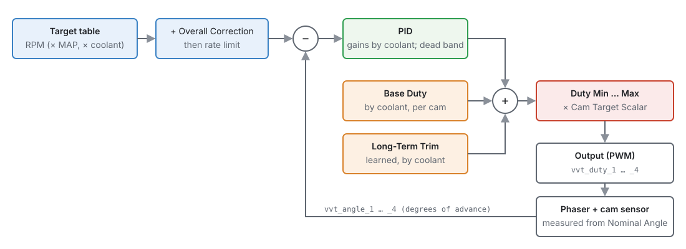
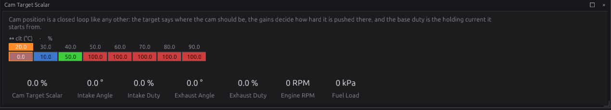
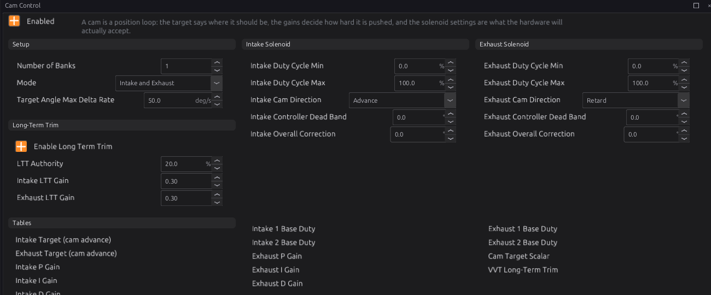
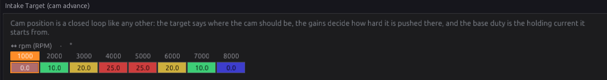
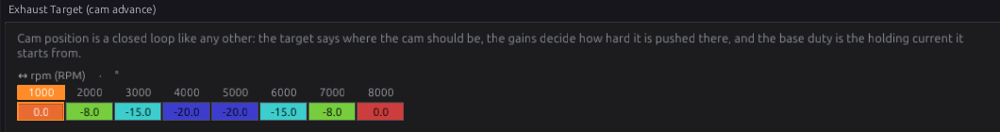
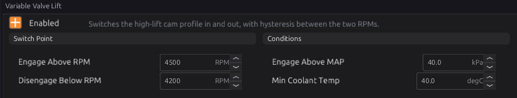

# Cam and valve control

:material-circle:{ .level-intermediate } Intermediate → :material-circle:{ .level-advanced } Advanced

> **In one sentence:** cam control moves each camshaft on its phaser to the angle a table asks for,
> measuring where it really is from the cam sensor, and valve-lift control switches a two-stage cam
> (VTEC-style) to its high-lift profile at high engine speed.

## What it does

:material-circle:{ .level-basic } Basic

Two modules:

1. **Cam Control** (`vvt_control`) — variable cam timing. A **phaser** on the end of a camshaft,
   worked by engine oil through a solenoid valve, turns the cam relative to its sprocket. Cam Control
   runs a position loop for each phased cam: up to four (intake and exhaust, on one or two banks). It
   publishes a PWM duty for each solenoid, `vvt_duty_1` … `vvt_duty_4`.
2. **Variable Valve Lift** (`vvl`) — a solenoid that switches the engine to a second, high-lift cam
   profile above an engine speed. It publishes **VVL Active** `vvl_active`.

Neither drives a pin itself. You give an output the duty or the flag (chapter 18).

| Loop | Cam | Measured angle | Duty |
|---|---|---|---|
| 1 | Intake, bank 1 | `vvt_angle_1` | `vvt_duty_1` |
| 2 | Exhaust, bank 1 | `vvt_angle_2` | `vvt_duty_2` |
| 3 | Intake, bank 2 | `vvt_angle_3` | `vvt_duty_3` |
| 4 | Exhaust, bank 2 | `vvt_angle_4` | `vvt_duty_4` |

<!-- src: firmware/Engine/Modules/VvtControl.cpp; firmware/Engine/EngineTask.cpp -->

## How it works

:material-circle:{ .level-intermediate } Intermediate

### 1 · Measuring the cam

Each phased cam has its own trigger stream (chapter 16: **Cam Intake B1**, **Cam Exhaust B1**,
**Cam Intake B2**, **Cam Exhaust B2**). Each time the cam's reference edge arrives, the ECU compares
where the crank is with where that edge sits when the phaser is parked — the stream's **Nominal
Angle**. The difference is the cam angle, in crank **degrees of advance**:

- **0** — the cam is where it parks.
- **Positive** — the cam is advanced (its events happen earlier).
- **Negative** — the cam is retarded.

A typical **intake** phaser parks fully retarded and moves to positive angles. A typical **exhaust**
phaser parks fully advanced and moves to **negative** angles.

The angle is only valid while that cam's stream is locked to the crank. Before the engine syncs, or
if the cam signal is lost, it is not valid, and the loop does not use it (section 4).
<!-- src: firmware/Scheduler/EnginePositionHal.cpp; firmware/Scheduler/GenericTrigger.h -->

### 2 · The target

For each cam type:

1. **Intake Target** or **Exhaust Target**: degrees of advance by engine speed. The table can also
   have a manifold pressure axis and a coolant axis; switch them on from the table's **Axis Setup**.
   The exhaust target is signed: −20 means 20° retarded from home.
2. Plus **Overall Correction** — a fixed number of degrees added everywhere.
3. The result moves no faster than **Target Angle Max Delta Rate** (default 50 °/s), so a step in
   the table becomes a ramp. 0 means no limit.
   <!-- src: firmware/Engine/Modules/VvtControl.cpp -->

### 3 · The duty

The solenoid duty is the sum of three parts:

1. **Base Duty** — roughly the duty that holds the cam still, by coolant temperature (and optionally
   engine speed). There is one table per cam: Intake 1, Intake 2, Exhaust 1, Exhaust 2 (1 and 2 are
   the banks).
2. **Long-Term Trim** — a learned correction to the base duty (section 5).
3. **PID** — a correction from the error between the target and the measured angle. Its three gains
   are tables by coolant temperature, because cold, thick oil moves the phaser much more slowly.
   Inside **Controller Dead Band** the error counts as zero, to stop the loop hunting.

The sum is kept between **Duty Cycle Min** and **Duty Cycle Max**. **Cam Direction** says which way
more duty moves the cam: **Advance** for most intake phasers, **Retard** for most exhaust phasers
(the default for exhaust).
<!-- src: firmware/Engine/Modules/VvtControl.cpp -->

Finally, the duty is multiplied by the **Cam Target Scalar**, a curve by coolant temperature. By
default it gives no duty below 20 °C and full duty from 50 °C, so the phaser is left parked while the
oil is cold. While the scalar is below 100 %, the PID's integral part is held, so it does not wind up
and then overshoot when the engine warms.

### 4 · Safety

- **No cam angle, no closed loop.** Without a valid measured angle, the cam gets its base duty (plus
  long-term trim) and nothing else. The PID is held.
- **Engine stopped.** The loop resets. The output templates also switch the solenoid off below
  **Stop Below RPM**, so it is not held powered with the key on.
- **Module off.** All four duties are 0.
  <!-- src: firmware/Engine/Modules/VvtControl.cpp; firmware/Engine/Modules/VvtControl.h -->

### 5 · Long-term trim

With **Enable Long Term Trim** on, each cam learns the duty it needs to hold its target, per coolant
temperature. When the cam is within 3° of its target and the loop is running at full authority, a
little of the PID's integral part moves into the learned table each second (**Intake LTT Gain** and
**Exhaust LTT Gain**, default 0.30). Each learned cell is limited to ± **LTT Authority** (default
20 %). The learned values are saved to the SD card with the fuel trims (chapter 23), so a warm engine
starts from what it learned last time. The table is on the **VVT Long-Term Trim** page.
<!-- src: firmware/Engine/Modules/VvtControl.cpp; firmware/main.cpp -->

### 6 · Variable valve lift

**Variable Valve Lift** turns **VVL Active** on when all of these are true:

- engine speed at least **Engage Above RPM** (default 4500);
- manifold pressure at least **Engage Above MAP** (default 40 kPa, absolute);
- coolant at least **Min Coolant Temp** (default 40 °C).

It turns off again when the speed falls below **Disengage Below RPM** (default 4200), the load
falls below Engage Above MAP, or the coolant falls below Min Coolant Temp. The gap between the two
speeds stops the solenoid switching back and forth at the changeover point.
<!-- src: firmware/Engine/Modules/Vvl.cpp -->

## Before you start

:material-circle:{ .level-basic } Basic

- **The cam sensors** set up and working (chapter 16), each phased cam on its own stream, with
  **Cam Is Phased** ticked and **Phaser Authority** set to the phaser's real travel.
- **Nominal Angle** measured with the phaser parked: with the engine idling cold (so the phaser stays
  home), read where the cam edge falls and enter it. Check that the cam's **VVT Cam Advance** reads
  close to 0 there.
- The **solenoids** wired to low-side outputs with PWM (chapter 12). Oil-control solenoids are
  inductive; see chapter 12 for how the low-side outputs deal with that.
- The maker's figure for the solenoid's PWM frequency, if you have it.

## Setting it up

:material-circle:{ .level-intermediate } Intermediate

### Step 1 — The outputs

For each phased cam, pick a free low-side output (chapter 18), press **Set up this output…**, and choose the
matching template: **VVT Solenoid (Intake Bank 1)**, **(Exhaust Bank 1)**, **(Intake Bank 2)** or
**(Exhaust Bank 2)**. Each sets the output to PWM at 250 Hz, fed by that cam's `vvt_duty_N`, and on
only while the engine runs. 250 Hz is a starting point; set the frequency on the output's
**Frequency** page to what the solenoid's maker gives.
<!-- src: definition/ecu.schema.yaml (output_templates: vvt_intake_bank_1 … vvt_exhaust_bank_2) -->

### Step 2 — Cam Control

Open **Configuration ▸ Engine Functions ▸ Cam Control** and tick **Enabled**.

1. **Number of Banks**: 1, or 2 for a V engine with phasers on both banks.
2. **Mode**: **Intake**, **Exhaust**, or **Intake and Exhaust** — only the cams that have phasers.
3. **Cam Direction** for each: move the cam with a small base duty on the bench or at idle and watch
   the angle. If more duty makes the angle go up, choose **Advance**; if down, **Retard**.
4. Leave the duty limits at 0–100 % unless the solenoid maker says otherwise.

### Step 3 — Base duty

With the targets still at their parked value (0), find the duty that holds each cam still at operating
temperature: raise **Base Duty** until the cam just starts to move off its stop, and use a little
less. This is the most important number on the page: a good base duty means the PID only trims.

### Step 4 — Targets

Fill in **Intake Target** and **Exhaust Target**. Start with small values and check the cam follows:
**VVT Cam Advance** should reach the target and hold it. Watch `vvt_angle_N` against the target and
`vvt_duty_N` in a log.

### Step 5 — Gains and learning

Adjust the P, I and D gain tables at the temperatures you run (section *Tuning it*). When the cams
hold their targets well, tick **Enable Long Term Trim**.

## Worked examples

:material-circle:{ .level-intermediate } Intermediate

!!! example "Example 1 — intake-only VVT, four cylinders"
    - Trigger: crank wheel on Crank Primary, intake cam on **Cam Intake B1** with Cam Is Phased and
      Phaser Authority 50°.
    - Output: **VVT Solenoid (Intake Bank 1)** on a free low-side pin.
    - Cam Control: Enabled, 1 bank, Mode **Intake**, Direction **Advance**.
    - Intake Target: 0° at idle, rising to 25° in the mid-range and back to 0° at high RPM.

!!! example "Example 2 — dual VVT, V8"
    - Four cam streams, all phased. Four outputs from the four VVT templates.
    - Cam Control: 2 banks, Mode **Intake and Exhaust**; Intake Direction **Advance**, Exhaust
      Direction **Retard**.
    - Both banks share the target and gain tables; each has its own base duty (Intake 1 / Intake 2,
      Exhaust 1 / Exhaust 2), because each phaser sees its own oil supply.

!!! example "Example 3 — VTEC-style lift change"
    - Variable Valve Lift: Enabled, Engage Above 5000 RPM, Disengage Below 4700 RPM, Engage Above MAP
      60 kPa, Min Coolant Temp 60 °C.
    - An output (chapter 18): **Generic**, Digital, **Turn On When** `vvl_active > 0`.

    

## Tuning it

:material-circle:{ .level-advanced } Advanced

- **Base duty first.** If the cam drifts off target as soon as the PID is set to zero, the base duty is
  wrong. Long-term trim will find it in time, but a good starting value makes the loop settle faster.
- **P** makes the cam move towards the target. Raise it until the cam overshoots slightly, then back
  off.
- **I** removes the last steady error. Too much, and the cam slowly swings about the target.
- **D** damps the approach. A little helps a phaser that overshoots; too much makes the duty noisy.
- **Rate limit.** Lower **Target Angle Max Delta Rate** if the cam overshoots on big target steps.
- **Hunting at target**: set a small **Controller Dead Band** (0.5–1°).

Channels to log: `vvt_angle_1` … `_4`, `vvt_duty_1` … `_4`, `vvt_ltt_1` … `_4`, `rpm`, `map`, `clt`,
and for VVL `vvl_active`.

## Diagnostics

:material-circle:{ .level-intermediate } Intermediate

Cam Control and Variable Valve Lift set no codes of their own. A cam that is not where the crank
expects — outside its **Phaser Authority** — sets **P0341** (trigger phase lost), described in
chapter 16. A cam signal that stops sets the trigger codes in chapter 16 too, and the cam angle stops
being valid.

## Troubleshooting

:material-circle:{ .level-basic } Basic → :material-circle:{ .level-advanced } Advanced

| Symptom | Likely causes | Check |
|---|---|---|
| Duty stays 0 | Cam Control off; that cam not in **Mode** or bank count; coolant below the scalar's range | Enabled, Mode, Number of Banks; Cam Target Scalar |
| Duty moves but the cam does not | Output not set up; solenoid not wired; oil pressure too low | The output (chapter 18); the solenoid; oil |
| Cam runs to one end and stays there | **Cam Direction** wrong | Swap Advance/Retard |
| Cam angle reads far from 0 when parked | Nominal Angle wrong | Re-measure Nominal Angle with the phaser parked |
| Angle not valid | Cam stream not locked; engine not synced | Chapter 16: the cam stream and sync |
| Cam hunts around target | P or I too high; no dead band | Lower the gains; a small dead band |
| Slow to reach target when cold | Cold oil; scalar holding it back | Cam Target Scalar, the cold gain cells |
| P0341 at full phaser travel | Phaser Authority smaller than the real travel | Phaser Authority (chapter 16) |
| VVL never engages | Load or coolant below its condition; RPM never reaches Engage Above | `map`, `clt`; Engage Above MAP is absolute pressure |
| VVL flickers at the changeover | Too little gap between the two RPMs | Widen Engage/Disengage |

## Settings reference

Cam Control:

--8<-- "reference/settings/_vvt_control.table.md"

Variable Valve Lift:

--8<-- "reference/settings/_vvl.table.md"

## Related

- [Chapter 12 — Wiring outputs](../part2/12-wiring-outputs.md) (solenoid outputs)
- [Chapter 16 — Trigger setup](16-trigger.md) (cam streams, Nominal Angle, Phaser Authority)
- [Chapter 18 — Outputs and the pin system](18-outputs.md) (templates, PWM frequency)
- [Chapter 23 — Closed-loop lambda](23-lambda.md) (learned trims and the SD card)
