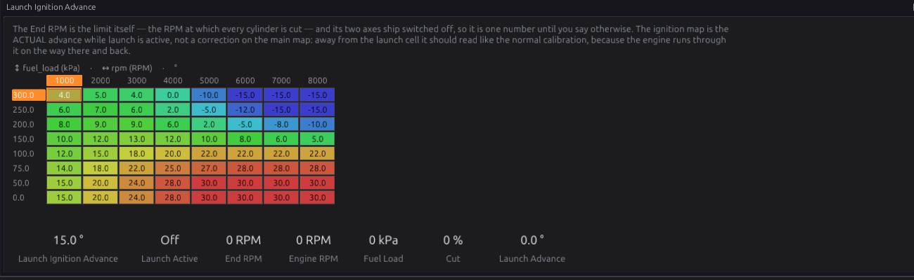
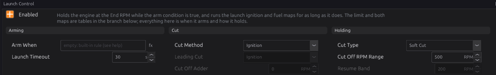
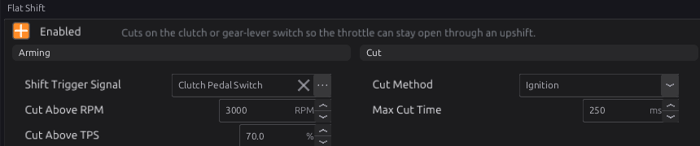
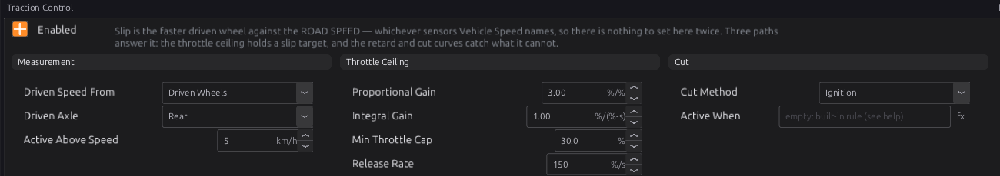
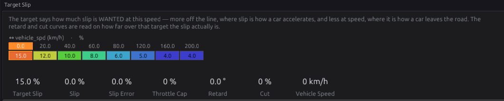

# Launch, shift and traction

:material-circle:{ .level-intermediate } Intermediate → :material-circle:{ .level-advanced } Advanced

> **In one sentence:** launch control holds the engine at a set speed on the line with its own
> timing and fuel maps, flat shift cuts the engine for a moment so you can change up without lifting,
> and traction control pulls power when the driven wheels spin faster than the car is moving.

## What it does

:material-circle:{ .level-basic } Basic

Three modules under **Configuration ▸ Vehicle Functions**:

1. **Launch Control** (`launch`) — a second rev limiter for the start line. While it is armed it
   holds the engine at the **End RPM** by cutting ignition or fuel, and the engine runs on the
   **launch ignition and fuel maps** instead of the normal ones. On a turbo engine, retarded timing at
   the line builds boost before the clutch is let out.
2. **Flat Shift** (`flat_shift`) — while the clutch (or a shift button) is pressed at high RPM and
   throttle, it cuts ignition or fuel for a fraction of a second so the gearbox unloads and the next
   gear goes in with the throttle still open.
3. **Traction Control** (`traction_control`) — measures **slip**, how much faster the driven wheels
   turn than the car is moving, and when it is above a target: lowers the throttle ceiling (on
   drive-by-wire), retards the timing, and cuts.

None of them replaces the main rev limiter (chapter 27), which still protects the engine the whole
time.

## How it works

:material-circle:{ .level-intermediate } Intermediate

### 1 · Launch: when it arms

Launch is **armed** while its **Arm When** condition is true. Left empty, the built-in rule is:

- the car is **standing still** (road speed below 5 km/h), **and**
- the **throttle is open** — above 20 %. On drive-by-wire this is the driver's pedal request; with a
  cable throttle it is the throttle position.

With no road speed or no throttle reading, launch does not arm. So idling at the lights runs the
normal maps, and flooring the throttle on the line arms the launch.
<!-- src: firmware/Engine/Modules/Launch.cpp -->

**Arm When** is an expression (chapter 34) for any other rule, for example:

| Arm When | Means |
|---|---|
| `launch_sw` | a dedicated launch button |
| `clutch_sw and vehicle_spd < 5` | clutch pressed, car stationary |
| `launch_sw and clt > 60 and pedal_demand > 50` | button, warm engine, pedal past half |
| `trans_brake_sw` | a trans-brake switch |

An expression that cannot be worked out arms nothing and sets **P1740**.

**Launch Timeout** (default 30 s) ends a launch that has been held that long. Launch then stays off
until the arm condition goes false and true again — so a stuck switch cannot hold the cut for ever.
0 means no timeout.

### 2 · Launch: while it holds

While launch is armed:

- **Timing.** The **Launch Ignition Advance** table (by engine speed and load) is the actual spark
  advance — it replaces the main advance map, not adds to it. The normal advance trims (coolant,
  air temperature, idle, transients, overall trim) are left out, except that coolant and air
  temperature *retard* still applies. Knock, protection, traction, nitrous and anti-lag retards all
  still subtract.
- **Fuel.** The **Launch Fuel Correction** table adds or removes fuel as a percentage (default 0).
- **The limit.** **Launch End RPM** is the speed at which the cut is total. It is one number by
  default (5000 RPM). Switch on its load axis to hold a lower RPM until boost builds, or its road-speed
  axis to let the limit rise as the car rolls — but note the built-in arm rule disarms at 5 km/h, so a
  rising limit needs an Arm When that stays true while moving (a button, for example).
  <!-- src: firmware/Engine/Modules/Ignition.cpp; firmware/Engine/Modules/Launch.cpp -->

**How it cuts:**

- **Cut Method**: **Ignition** (default; keeps the turbo lit — the classic two-step), **Fuel**
  (kinder to the turbine), or **Both**.
- **Cut Type**: **Soft Cut** (default) ramps the cut in across **Cut Off RPM Range** (500 RPM) below
  the End RPM — 50 % cut halfway up the range, all cylinders at the End RPM — so the engine leans on
  the limit instead of bouncing off it. **Hard Cut** cuts everything at the End RPM and releases
  **Resume Band** (200 RPM) below it.
- With **Both**, **Cut Off Adder** puts the second cut that many RPM above the first, and **Leading
  Cut** says which one goes first.

When launch disarms, the cut, maps and limit all go back to normal at once.

### 3 · Flat shift

Flat shift cuts while **all** of these are true:

- the **Shift Trigger Signal** is on (default the **Clutch Pedal Switch**);
- engine speed above **Cut Above RPM** (default 3000);
- throttle above **Cut Above TPS** (default 70 %);
- and the cut has lasted less than **Max Cut Time** (default 250 ms) this shift.

Releasing the trigger re-arms it for the next shift. **Cut Method** is Ignition by default.
<!-- src: firmware/Engine/Modules/FlatShift.cpp -->

### 4 · Traction control: measuring slip

**Slip** = (driven speed − road speed) ÷ road speed, in percent.

- **Driven speed** — with **Driven Speed From** = **Driven Wheels**, the **faster** wheel of the
  driven axle (**Driven Axle**, default Rear). The faster one, because an open differential lets one
  wheel spin while the other grips. With **Drive Train**, the gearbox or driveshaft pickup.
- **Road speed** — the ECU's **Vehicle Speed** `vehicle_spd` (chapter 32). This must come from wheels
  that are **not** driven (or GPS). If Vehicle Speed's **Main Source** is the drive train or the
  driven wheels, slip always reads zero and traction control never acts.
  <!-- src: firmware/Engine/Modules/TractionControl.cpp; definition/ecu.schema.yaml (VehicleSpeed.main_source) -->

Below **Active Above Speed** (default 5 km/h) it does nothing: a percentage of a tiny speed is noise.
**Active When** (an expression; empty = always) can switch it with a dash switch or a CAN flag.

### 5 · Traction control: the three responses

The slip is compared with **Target Slip**, a curve by road speed (default 15 % at a standstill,
falling to 4 % above 160 km/h). The difference is the **slip error**.

1. **Throttle ceiling** `traction_cap` — a PI controller (**Proportional Gain** 3.00, **Integral
   Gain** 1.00) lowers the ceiling while the error is positive, never below **Min Throttle Cap**
   (30 %). When the slip is back under target it rises again at **Release Rate** (150 %/s). The
   ceiling only does anything with an electronic throttle, which reads it as its **Traction Cap
   Signal** (chapter 22).
2. **Timing retard** — the **Timing Retard** curve, by slip error (default 2° at 2 % over target, up
   to 20° at 50 %). This is the fast response: it acts on the very next spark.
3. **Cut** — the **Cut Percentage** curve, by slip error (default none until 20 % over target, 40 %
   at 50 %, 70 % at 100 %), cutting by **Cut Method** (Ignition by default).
   <!-- src: firmware/Engine/Modules/TractionControl.cpp; firmware/Engine/Modules/Ignition.cpp -->

**Axle check.** When the car cruises above 30 km/h with no traction response, the slip should be
near zero. If it stays more than 2 % off for 10 seconds, **P17B2** is set: the pulses-per-km of the
two axles disagree (a wrong tyre size or tooth count).

## Before you start

:material-circle:{ .level-basic } Basic

- **Launch:** a road speed signal (chapter 32) for the built-in rule, and a working throttle sensor or
  drive-by-wire pedal. Anything else you arm on — a button, the clutch switch — set up as a sensor
  (chapter 17).
- **Flat shift:** a clutch switch (or shift button) as a sensor.
- **Traction:** wheel speed sensors on the driven wheels (or a driveshaft pickup), and a road speed
  from the undriven wheels or GPS, all calibrated in km/h (chapter 32).

## Setting it up

:material-circle:{ .level-intermediate } Intermediate

### Step 1 — Launch control

Open **Configuration ▸ Vehicle Functions ▸ Launch Control** and tick **Enabled**.

1. Leave **Arm When** empty for the built-in rule, or write your own.
2. Set **Launch End RPM** (the table under Launch Control) to where you want to hold the engine.
3. Keep **Cut Method** Ignition and **Cut Type** Soft Cut to start.
4. Test standing still: floor it, and the engine should hold near the End RPM. **Launch Active**
   `launch_active` and **Launch Cut** `launch_cut_pct` show what it is doing.
5. Then shape the **Launch Ignition Advance** map at the launch point, a few degrees at a time,
   watching exhaust temperature and boost.

### Step 2 — Flat shift

Open **Flat Shift**, tick **Enabled**, and check **Shift Trigger Signal** names your clutch switch.
Start with **Max Cut Time** at the default 250 ms; shorten it if the engine flares after the gear goes
in, lengthen it if the gear baulks.

### Step 3 — Traction control

1. On **Vehicle Speed**, set **Main Source** to the **undriven** axle (or GPS). Drive at a steady
   speed and check that **Slip** `traction_slip` reads close to 0.
2. Open **Traction Control**, tick **Enabled**, and set **Driven Axle**.
3. Keep the default curves at first. Watch `traction_slip`, `traction_slip_err`, `traction_retard`
   and `traction_cut_pct` in a log on a low-grip surface.

## Worked examples

:material-circle:{ .level-intermediate } Intermediate

!!! example "Example 1 — turbo car, two-step on a button"
    - Arm When: `launch_sw and clt > 60`.
    - Launch End RPM 4500; Cut Method Ignition; Soft Cut, range 300 RPM.
    - Launch Ignition Advance: about 0° to −10° around 4500 RPM at 150–250 kPa; the normal timing
      elsewhere.
    - Launch Fuel Correction: +5 % at the launch point.

!!! example "Example 2 — flat shift on a sequential box with a lever switch"
    - A lever switch wired as a digital sensor; **Shift Trigger Signal** = that sensor.
    - Cut Above RPM 4000, Cut Above TPS 80 %, Max Cut Time 80 ms, Cut Method Ignition.

!!! example "Example 3 — rear-wheel drive with ABS wheel sensors"
    - Four wheel speed sensors (chapter 32). Vehicle Speed Main Source = **Front Axle**.
    - Traction Control: Driven Speed From **Driven Wheels**, Driven Axle **Rear**.
    - Electronic throttle fitted, so the throttle ceiling does most of the work and the retard catches
      the first moment of wheelspin.

## Tuning it

:material-circle:{ .level-advanced } Advanced

- **Launch RPM:** too low and the car bogs off the line; too high and it spins the tyres or overheats
  the clutch. The load axis on End RPM lets you hold lower until boost arrives, then allow more.
- **Launch timing:** each degree of retard adds exhaust heat and boost. Watch exhaust temperature;
  hold launches short.
- **Traction target:** raise **Target Slip** at low speed for a better launch on sticky tyres; lower it
  on a slippery surface.
- **Traction gains:** if the car bogs and surges, lower **Proportional Gain**; if wheelspin lingers,
  raise **Integral Gain** or the retard curve.

## Diagnostics

:material-circle:{ .level-intermediate } Intermediate

| Code | Meaning | What sets it | What to check |
|---|---|---|---|
| **P1740** | Launch: Arm When condition invalid | The expression does not compile against this firmware | Rewrite Arm When |
| **P17B3** | Traction: Active When condition invalid | The expression does not compile | Rewrite Active When |
| **P17B0** | Traction: no reference speed | Vehicle Speed not being published | Vehicle Speed enabled; its sensors |
| **P17B1** | Traction: driven-wheel speed missing | The driven wheels (or drive train) not reading | Driven Axle; the wheel sensors |
| **P17B2** | Traction: axles disagree | Steady slip more than 2 % at cruise for 10 s | Pulses per km, tyre sizes (chapter 32) |

All are severity 1 (warnings). While P1740 is set launch control is off, and while P17B0, P17B1 or
P17B3 is set traction control is off; P17B2 is only a warning.
<!-- src: generated/module_dtc.h -->

## Troubleshooting

:material-circle:{ .level-basic } Basic → :material-circle:{ .level-advanced } Advanced

| Symptom | Likely causes | Check |
|---|---|---|
| Launch never arms | No road speed; throttle not above 20 %; Arm When false; timed out earlier | `vehicle_spd`, throttle or `pedal_demand`; Arm When; release and re-arm |
| Launch arms but the engine goes past End RPM | Soft cut range too wide; End RPM table has an axis switched on | Cut Type, Cut Off RPM Range; the table |
| Launch ends after a while on the line | Launch Timeout | Timeout; release and re-arm |
| Flat shift never cuts | RPM or throttle below its threshold; wrong trigger signal | Cut Above RPM / TPS; Shift Trigger Signal |
| Engine cuts on a slow clutch dip | Cut Above RPM too low | Raise it |
| Traction never acts | Vehicle Speed from the driven axle; Driven Axle wrong; below Active Above Speed | Main Source; Driven Axle; `traction_slip` |
| Traction bogs the car | Gains too high; target too low | Proportional Gain; Target Slip |
| P17B2 | Wheel pulses-per-km wrong on one axle | Chapter 32 |

## Settings reference

Launch Control:

--8<-- "reference/settings/_launch.table.md"

Flat Shift:

--8<-- "reference/settings/_flat_shift.table.md"

Traction Control:

--8<-- "reference/settings/_traction_control.table.md"

## Related

- [Chapter 20 — Ignition](20-ignition.md) (how retards combine)
- [Chapter 22 — Electronic throttle](22-electronic-throttle.md) (the traction throttle ceiling)
- [Chapter 27 — Speed limiting](27-speed-limiting.md) (the main rev limiter)
- [Chapter 32 — Vehicle functions](32-vehicle-functions.md) (vehicle speed and wheel sensors)
- [Chapter 34 — Generic tables and expressions](34-tables-expressions.md) (Arm When, Active When)
