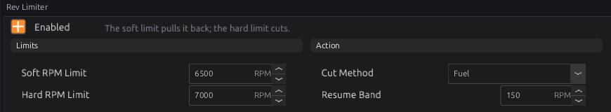
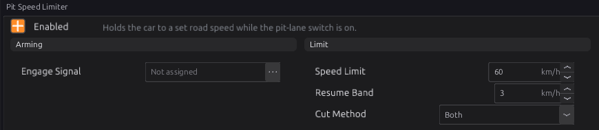
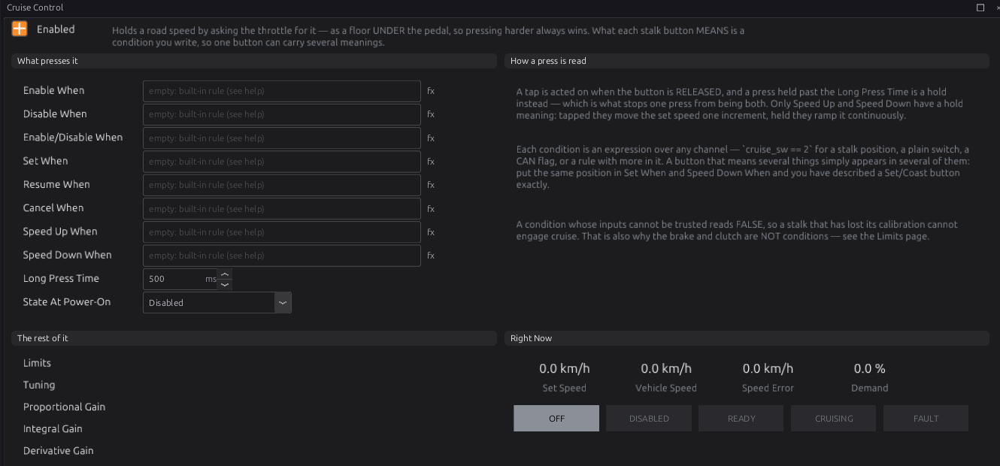
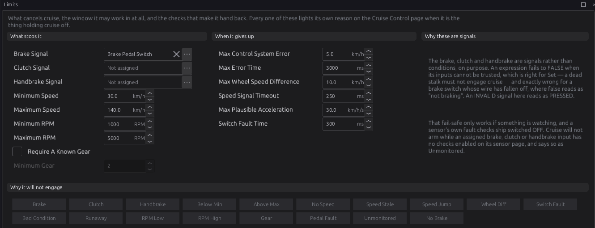

# Speed limiting

:material-circle:{ .level-basic } Basic → :material-circle:{ .level-advanced } Advanced

> **In one sentence:** the rev limiter keeps engine speed under a ceiling, the pit limiter keeps road
> speed under a ceiling, and cruise control holds a road speed by opening an electronic throttle.

## What it does

:material-circle:{ .level-basic } Basic

| Module | Where | Limits | By |
|---|---|---|---|
| **Rev Limiter** (`rev_limiter`) | Protection | engine speed | cutting fuel and/or ignition |
| **Pit Speed Limiter** (`pit_limiter`) | Vehicle Functions | road speed | cutting fuel and/or ignition |
| **Cruise Control** (`cruise_control`) | Vehicle Functions | holds a road speed | asking the electronic throttle for more |

The rev limiter is **on** by default (6500 / 7000 RPM). Check its numbers suit your engine before
the first start.

## How it works

:material-circle:{ .level-intermediate } Intermediate

### 1 · Rev limiter

Two limits:

- **Soft RPM Limit** (default 6500) — from here a progressive cut starts. Between the soft and hard
  limits the cut ramps from nothing to everything: halfway between them, half the firing events are
  cut, spread evenly. The engine meets a growing wall rather than hitting one.
- **Hard RPM Limit** (default 7000) — everything is cut, and stays cut until the speed falls
  **Resume Band** (default 150 RPM) below it.

**Cut Method** (default **Fuel**) chooses fuel, ignition or both. Set the soft limit equal to the hard
one to have no soft stage.
<!-- src: firmware/Engine/Modules/RevLimiter.cpp -->

Two more things act near the limit:

- The **Rev Limiter** ignition correction (chapter 20) can pull timing as the engine approaches the
  hard limit, so it arrives gently.
- A **protection level** (chapter 29) can impose a lower limit when a fault is active. That limit is
  enforced even with Rev Limiter switched off: a limp-home limit cannot be defeated by a tuning switch.
  <!-- src: firmware/Engine/Modules/RevLimiter.cpp -->

### 2 · Pit speed limiter

While **Engage Signal** is on (not assigned = always, while enabled), the limiter cuts when road speed
goes above **Speed Limit** (default 60 km/h) and stops cutting when it falls **Resume Band** (default
3 km/h) below. **Cut Method** defaults to **Both**. It uses the road speed, so it works in any gear.
<!-- src: firmware/Engine/Modules/PitLimiter.cpp -->

### 3 · Cruise control: what it drives

Cruise publishes **Cruise Demand** `cruise_demand`, a throttle percentage. The electronic throttle
(chapter 22) uses it as a **floor under the pedal**: the plate opens to whichever is higher, so the
driver can always go faster by pressing the pedal. Without an electronic throttle, cruise control has
nothing to move.
<!-- src: firmware/Engine/Modules/ElectronicThrottle.cpp; firmware/Engine/Modules/CruiseControl.h -->

### 4 · Cruise control: the states

| State | Means |
|---|---|
| **Off** | switched off in the tune |
| **Disabled** | the driver's main switch is off |
| **Ready** | armed; waiting for Set or Resume |
| **Cruising** | holding the set speed |
| **Fault** | something cannot be trusted; engagement is blocked |

**State At Power-On** is Disabled by default (for a stalk with a main on/off). Choose **Ready** for
controls that only have Set and Resume.

### 5 · Cruise control: the buttons

Each action is a **condition** (an expression, chapter 34), so any switch, stalk position or CAN flag
can drive it:

| Condition | Does |
|---|---|
| **Enable When** / **Disable When** | Disabled → Ready / → Disabled (forgets the set speed) |
| **Enable/Disable When** | toggles between them (one main button) |
| **Set When** | from Ready: cruise at the current speed. While cruising: re-set to the current speed |
| **Resume When** | from Ready: go back to the speed Cancel kept |
| **Cancel When** | stop cruising, keep the set speed |
| **Speed Up When** / **Speed Down When** | tap: ± **Speed +/- Increment** (1.0 km/h). Hold longer than **Long Press Time** (500 ms): ramp at **Accelerate Rate** / **Coast Rate** (2.0 km/h/s) |

A tap acts when the button is **released**, so one press is never both a tap and a hold. The same
condition can appear in two actions — for example the same stalk position in **Set When** and
**Speed Down When** makes a Set/Coast button. For a multi-position cruise stalk on one analog input,
set up the **Cruise Control Switch** sensor (chapter 17) and write conditions such as
`cruise_sw == 2`.
<!-- src: firmware/Engine/Modules/CruiseControl.cpp -->

### 6 · Cruise control: what stops it

**Cancel** (the set speed is kept, so Resume works) happens when:

- the **Brake Signal**, **Clutch Signal** or **Handbrake Signal** reads pressed — or reads **invalid**,
  because a switch that has stopped reporting must not look like "not pressed". These drop the
  throttle floor on the same frame.
- the speed leaves **Minimum Speed** … **Maximum Speed** (30–140 km/h), the engine speed leaves
  **Minimum RPM** … **Maximum RPM** (1000–5000), or, with **Require A Known Gear**, the gear is below
  **Minimum Gear**. A button cancel or a window exit bleeds the floor away over **Cancel Decay Time**
  (0.5 s).

**Fault** (the set speed is forgotten, and cruise stays out until every cause has cleared and a button
is pressed again) happens when:

| Reason | Check |
|---|---|
| No road speed, or it stopped updating for longer than **Speed Signal Timeout** (250 ms) | P17A0 |
| The road speed changes faster than **Max Plausible Acceleration** (30 km/h/s) | P17A1 |
| The cruise stalk sensor is enabled but reads in no band for **Switch Fault Time** (300 ms) | P17A2 |
| The speed stays more than **Max Control System Error** (5 km/h) from target for **Max Error Time** (3 s) | P17A4 |
| The four wheel speeds differ by more than **Max Wheel Speed Difference** (10 km/h) | P17A5 |
| The accelerator pedal has faulted (chapter 22) | P17A6 |
| A button condition does not compile | P17A7 |
| An assigned brake, clutch or handbrake sensor has no fault checks enabled | P17A8 |
| No **Brake Signal** assigned at all | P17A9 |

<!-- src: firmware/Engine/Modules/CruiseControl.cpp; generated/module_dtc.h -->

**Why it will not engage** on the **Limits** page lights the reason for each block.

### 7 · Cruise control: the loop

While cruising, a PID controller (**Cruise Proportional**, **Integral** and **Derivative Gain**,
curves by speed error) sets the demand, up to **Maximum Throttle Demand** (60 %), changing no faster
than **Max Throttle Ramp Rate** (20 %/s). On engagement the demand starts where the pedal already is,
so the car does not surge or dip. While the driver presses the pedal past the cruise demand, the
integral part is frozen, so lifting off does not cause a dip.

## Before you start

:material-circle:{ .level-basic } Basic

- **Rev limiter:** know your engine's safe maximum speed.
- **Pit limiter and cruise:** a road speed (chapter 32).
- **Cruise:** an electronic throttle (chapter 22); a brake pedal switch set up as a sensor with its
  fault checks enabled (chapter 17); your buttons or stalk set up as sensors.

## Setting it up

:material-circle:{ .level-intermediate } Intermediate

### Step 1 — Rev limiter

Open **Configuration ▸ Protection ▸ Rev Limiter**. Set the **Hard RPM Limit** below the engine's
mechanical limit with real margin, and the **Soft RPM Limit** 300–500 RPM under it. Keep **Cut
Method** Fuel for a road car; Ignition recovers faster but puts unburnt fuel into the exhaust.

### Step 2 — Pit limiter

Open **Pit Speed Limiter**, tick **Enabled**, assign **Engage Signal** to your pit-lane button, and set
**Speed Limit**.

### Step 3 — Cruise control

Open **Configuration ▸ Vehicle Functions ▸ Cruise Control** and tick **Enabled**.

1. Write the button conditions for your controls (see the examples).
2. On **Limits**, check **Brake Signal** is your brake switch, and assign the clutch on a manual.
   On each of those sensors' pages, enable their fault checks.
3. Drive on a quiet road above 30 km/h: enable, set, and watch **Set Speed**, **Vehicle Speed**,
   **Speed Error** and **Demand**. Press the brake: cruise must cancel at once.

## Worked examples

:material-circle:{ .level-intermediate } Intermediate

!!! example "Example 1 — a four-position stalk on one analog input"
    Cruise Control Switch sensor calibrated so position 1 = main, 2 = set/coast, 3 = resume/accel,
    4 = cancel.

    | Condition | Expression |
    |---|---|
    | Enable/Disable When | `cruise_sw == 1` |
    | Set When | `cruise_sw == 2` |
    | Speed Down When | `cruise_sw == 2` |
    | Resume When | `cruise_sw == 3` |
    | Speed Up When | `cruise_sw == 3` |
    | Cancel When | `cruise_sw == 4` |

!!! example "Example 2 — two steering-wheel buttons over CAN"
    State At Power-On **Ready**; Set When and Resume When name your two CAN button channels (chapter
    33 shows how to receive them), for example `can_btn_set` and `can_btn_res`; Speed Up and Speed
    Down on the same two buttons held. No stalk sensor: the switch fault check does not apply.

!!! example "Example 3 — pit limiter on a button"
    Engage Signal = the pit button sensor; Speed Limit 60 km/h; Resume Band 3 km/h; Cut Method Both.

## Tuning it

:material-circle:{ .level-advanced } Advanced

- **Rev limiter:** if the engine bounces off the limit, widen the gap between soft and hard; if it
  overshoots the hard limit on a fast gear, lower the soft limit.
- **Cruise:** if the speed wanders slowly, raise the integral gain; if it surges up and down, lower
  the proportional gain. Uphill, if it runs out of throttle, raise **Maximum Throttle Demand**.

## Diagnostics

:material-circle:{ .level-intermediate } Intermediate

The cruise codes **P17A0**–**P17A9** are listed in section 6; all are severity 1 (warnings) and hold
cruise off. The rev and pit limiters set no codes.

Live channels: `soft_cut_pct`, `rpm_to_limit`, `pit_limit_active`, `cruise_state`, `cruise_active`,
`cruise_target`, `cruise_demand`, `cruise_error_kph`, `cruise_inhibit`.

## Troubleshooting

:material-circle:{ .level-basic } Basic → :material-circle:{ .level-advanced } Advanced

| Symptom | Likely causes | Check |
|---|---|---|
| Engine stops revving well below the limit | A protection level's limit is active | Chapter 29; the active codes |
| Pit limiter never cuts | Engage Signal off; no road speed | `pit_limit_active`, `vehicle_spd` |
| Cruise sets but nothing happens | No electronic throttle; Maximum Throttle Demand too low | Chapter 22 |
| Cruise will not leave Disabled | No Enable condition and power-on state Disabled | State At Power-On Ready, or an Enable When |
| Cruise shows Fault at once | No brake assigned; brake sensor fault checks off; a condition does not compile | The Limits page's reason lamps |
| Cruise cancels on its own | Speed or RPM outside the window; runaway error on a hill | Minimum/Maximum Speed and RPM; Max Control System Error |

## Settings reference

Rev Limiter:

--8<-- "reference/settings/_rev_limiter.table.md"

Pit Speed Limiter:

--8<-- "reference/settings/_pit_limiter.table.md"

Cruise Control:

--8<-- "reference/settings/_cruise_control.table.md"

## Related

- [Chapter 17 — Sensors](17-sensors.md) (brake, clutch and cruise switches)
- [Chapter 20 — Ignition](20-ignition.md) (the rev-limit timing correction)
- [Chapter 22 — Electronic throttle](22-electronic-throttle.md) (what cruise drives)
- [Chapter 29 — Engine protection](29-protection.md) (protection rev limits)
- [Chapter 32 — Vehicle functions](32-vehicle-functions.md) (road speed)
- [Chapter 34 — Generic tables and expressions](34-tables-expressions.md) (the button conditions)
