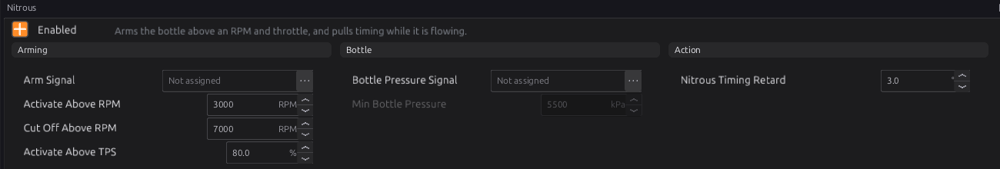
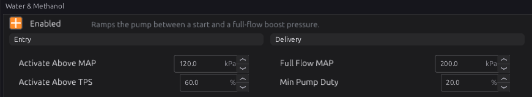
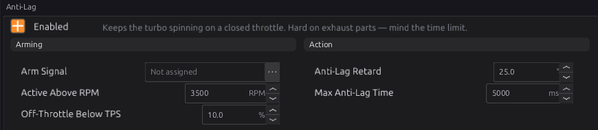

# Power adders

:material-circle:{ .level-intermediate } Intermediate → :material-circle:{ .level-advanced } Advanced

> **In one sentence:** nitrous and water-methanol injection are switched on inside a safe window of
> engine speed, throttle and boost, and anti-lag retards the timing hard on a closed throttle to keep
> a turbo spinning — each one only publishes a signal that you give to an output.

## What it does

:material-circle:{ .level-basic } Basic

| Module | Publishes | You wire it to |
|---|---|---|
| **Nitrous** (`nitrous`) | **Nitrous Active** `nitrous_active`, and a timing retard | the nitrous solenoid(s), through a digital output |
| **Water & Methanol** (`wmi`) | **WMI Active** `wmi_active`, **WMI Duty** `wmi_duty` | the pump or valve, through a PWM output |
| **Anti-Lag** (`anti_lag`) | **Anti-Lag Active** `antilag_active`, and a timing retard | (nothing — the retard is applied by the ignition) |

None of these drives a pin by itself: set up an output for it in chapter 18.

!!! danger "These can destroy an engine"
    Nitrous adds cylinder pressure faster than anything else, and anti-lag sends burning mixture into
    the turbine. Set every limit on these pages before enabling them, and watch exhaust temperature
    and knock.

## How it works

:material-circle:{ .level-intermediate } Intermediate

### 1 · Nitrous

Nitrous is **active** only while **all** of these are true:

- **Arm Signal** is on (not assigned = always, while enabled);
- engine speed between **Activate Above RPM** (3000) and **Cut Off Above RPM** (7000);
- throttle above **Activate Above TPS** (80 %);
- and, if **Bottle Pressure Signal** is assigned, bottle pressure at least **Min Bottle Pressure**
  (5500 kPa, about 800 psi). A pressure sensor that is not reading counts as too low.
  <!-- src: firmware/Engine/Modules/Nitrous.cpp -->

While it is active, **Nitrous Timing Retard** (default 3°) is taken off the spark advance, and it is
published from the same condition as the solenoid, so the solenoid can never open without it.

**Fuel.** The module adds **no fuel**. With a *wet* kit (the kit's own fuel solenoid) that is right.
With a *dry* kit, the extra fuel has to come from the ECU: point one of the four **Generic
Correction** fuel tables at `nitrous_active` (chapter 19), or use a Lua script (chapter 35).

**Bottle pressure sensors** (**Nitrous Pressure 1–3**, and **CO2 Bottle Pressure** in chapter 24)
are the **High Pressure** sensor type: whole kPa, calibrated up to 32767 kPa (about 4750 psi). The
default calibration suits the common 0.5–4.5 V, 0–1500 psi transducer (0–10342 kPa); check it
against yours in chapter 17.
<!-- src: definition/ecu.schema.yaml (sensor_types: high_pressure; sensors nitrous_pressure_1..3, co2_bottle_pressure) -->

### 2 · Water-methanol injection

WMI is active when manifold pressure is at least **Activate Above MAP** (120 kPa absolute — about
20 kPa of boost at sea level) **and** the throttle is above **Activate Above TPS** (60 %). While
active, the duty ramps in a straight line from **Min Pump Duty** (20 %) at Activate Above MAP to
100 % at **Full Flow MAP** (200 kPa absolute).
<!-- src: firmware/Engine/Modules/Wmi.cpp -->

MAP here is absolute pressure: 100 kPa is atmospheric, so boost is MAP minus about 100.

### 3 · Anti-lag

Anti-lag holds **Anti-Lag Retard** (default 25°) while:

- **Arm Signal** is on (not assigned = always, while enabled);
- the throttle is below **Off-Throttle Below TPS** (10 %);
- engine speed above **Active Above RPM** (3500).

It stops after **Max Anti-Lag Time** (5 s) of continuous use, and re-arms only when one of the
conditions has gone false (the throttle opens, for example).
<!-- src: firmware/Engine/Modules/AntiLag.cpp -->

This anti-lag is **timing only**: it retards the spark so the mixture is still burning when the
exhaust valve opens. It does not open the throttle or an air bypass valve by itself; on a closed
throttle the engine has only the air that leaks past the plate and through the idle valve.

### 4 · How the retards combine

The nitrous and anti-lag retards are added to knock, protection and traction-control retard and taken
off the advance together (chapter 20).

## Before you start

:material-circle:{ .level-basic } Basic

- **Nitrous:** a solenoid on a digital output that can carry its current (use a relay for large
  solenoids — chapter 12); an arm switch as a sensor; a bottle pressure sensor if you want the
  pressure check.
- **WMI:** a pump or valve on a PWM output; a MAP sensor.
- **Anti-lag:** an arm switch; exhaust temperature sensors are strongly recommended (chapter 29,
  EGT protection).

## Setting it up

:material-circle:{ .level-intermediate } Intermediate

1. **Nitrous:** tick **Enabled**; assign **Arm Signal** to your arm switch; set the RPM and throttle
   window and the retard; assign **Bottle Pressure Signal** if fitted. Give an output (Generic,
   Digital) the condition **Turn On When** `nitrous_active > 0`.
2. **WMI:** tick **Enabled**; set **Activate Above MAP** a little above where boost builds and **Full
   Flow MAP** at your peak boost. Give a PWM output the candidate `wmi_duty`.
3. **Anti-lag:** tick **Enabled**; assign **Arm Signal** (treat it as required); set the RPM,
   throttle and time limits.

## Worked examples

:material-circle:{ .level-intermediate } Intermediate

!!! example "Example 1 — a 75 hp wet nitrous kit"
    Arm Signal = dash arm switch; Activate Above RPM 3500; Cut Off Above RPM 6800; Activate Above TPS
    90 %; Nitrous Timing Retard 3°; Bottle Pressure Signal = Nitrous Pressure 1, Min 5500 kPa. An
    output drives the nitrous and fuel solenoids together from `nitrous_active`.

!!! example "Example 2 — water-methanol on a turbo engine"
    Activate Above MAP 150 kPa, Full Flow MAP 230 kPa, Activate Above TPS 50 %, Min Pump Duty 30 %.

!!! example "Example 3 — anti-lag on a switch for rally stages"
    Arm Signal = the ALS switch; Active Above RPM 4000; Off-Throttle Below TPS 5 %; Anti-Lag Retard
    20°; Max Anti-Lag Time 3000 ms.

## Tuning it

:material-circle:{ .level-advanced } Advanced

- **Nitrous retard:** a common starting point is about 2° for every 50 hp of nitrous; check for knock.
- **WMI:** adjust Min Pump Duty so the spray starts gently; log `wmi_duty` against boost.
- **Anti-lag:** start with less retard and a short time limit; watch exhaust temperature closely.

## Diagnostics

:material-circle:{ .level-intermediate } Intermediate

These modules set no codes of their own. The bottle pressure sensors have their own sensor codes
(chapter 17). Live channels: `nitrous_active`, `nitrous_retard`, `wmi_active`, `wmi_duty`,
`antilag_active`, `antilag_retard`.

## Troubleshooting

:material-circle:{ .level-basic } Basic → :material-circle:{ .level-advanced } Advanced

| Symptom | Likely causes | Check |
|---|---|---|
| Nitrous never activates | Arm switch off; RPM or throttle outside the window; bottle pressure low or sensor not reading | `nitrous_active`; the window; the pressure sensor |
| Bottle pressure reads far too low | Sensor calibration; the sensor not set to High Pressure | Chapter 17 |
| WMI pump runs at part throttle | Activate Above TPS too low | Raise it |
| WMI never runs | MAP never reaches Activate Above MAP (absolute) | `map`; 100 kPa is atmospheric |
| Anti-lag stops after a few seconds | Max Anti-Lag Time | Intended; raise with care |

## Settings reference

Nitrous:

--8<-- "reference/settings/_nitrous.table.md"

Water & Methanol:

--8<-- "reference/settings/_wmi.table.md"

Anti-Lag:

--8<-- "reference/settings/_anti_lag.table.md"

## Related

- [Chapter 12 — Wiring outputs](../part2/12-wiring-outputs.md)
- [Chapter 17 — Sensors](17-sensors.md) (bottle pressure sensors)
- [Chapter 18 — Outputs and the pin system](18-outputs.md)
- [Chapter 20 — Ignition](20-ignition.md) (how retards combine)
- [Chapter 29 — Engine protection](29-protection.md) (EGT protection)
