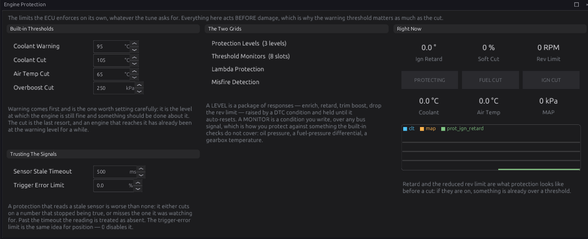
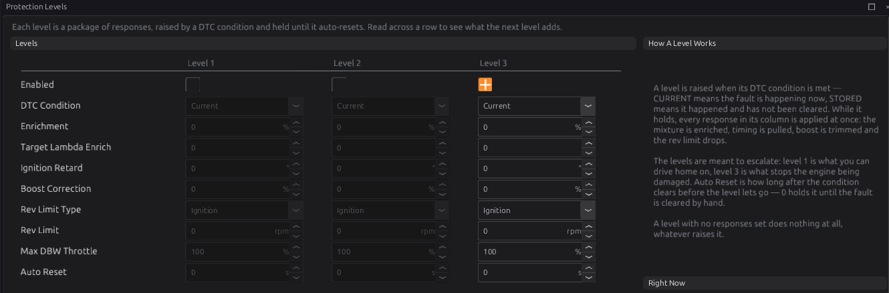
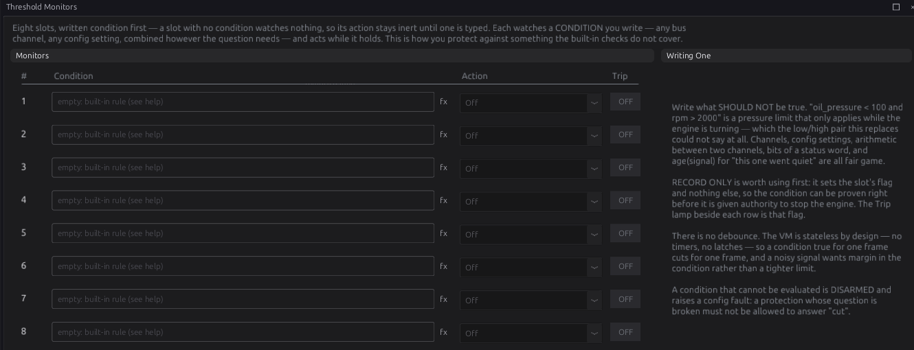
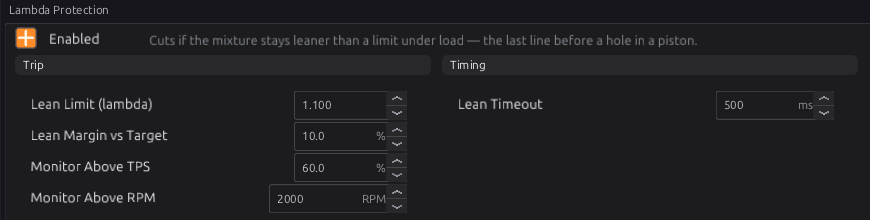
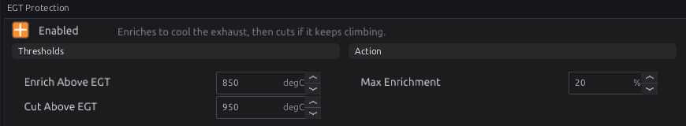
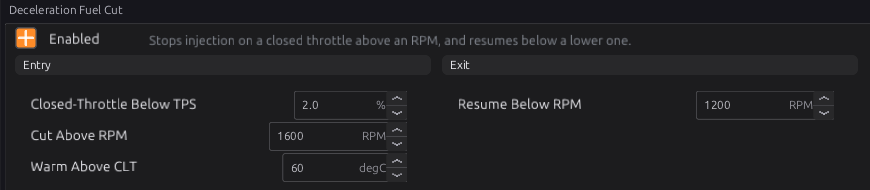

# Engine protection

:material-circle:{ .level-intermediate } Intermediate → :material-circle:{ .level-advanced } Advanced

> **In one sentence:** the ECU watches for faults — sensors that have died, an engine running too
> hot, too much boost, a lean mixture, a hot exhaust — records each as a trouble code, and reacts by
> the severity of the worst one: enriching, retarding, trimming boost, lowering the rev limit, or
> cutting.

## What it does

:material-circle:{ .level-basic } Basic

Protection is built from a few parts:

1. **Trouble codes (DTCs).** Every fault the ECU detects — in a sensor, a module, the trigger, or the
   checks below — is recorded as a code with a **severity**: 1 (warning), 2 or 3 (most serious).
2. **Protection levels.** Three packages of reactions, one per severity. The **worst** active code
   picks which level acts. **All three are off by default**: until you enable them, a fault is
   recorded but the engine is not protected by them.
3. **Built-in checks** in Engine Protection: dead sensors, coolant and intake overheat, overboost.
4. **Threshold monitors.** Eight conditions you write yourself, each able to cut fuel or ignition.
5. **Lambda Protection**, **EGT Protection** and **Deceleration Fuel Cut** — separate modules that
   act directly.

!!! warning "Enable the protection levels"
    A new tune records faults but does not react to them (apart from the trigger sync-loss cut and
    the modules that cut on their own). Set up at least **Level 3** before driving hard.

## How it works

:material-circle:{ .level-intermediate } Intermediate

### 1 · The built-in checks

| Check | Code | Severity | Default |
|---|---|---|---|
| Coolant sensor not updating | P0117 | 2 | older than **Sensor Stale Timeout** (500 ms) |
| MAP sensor not updating | P0107 | 2 | 〃 |
| Throttle sensor not updating | P0122 | 2 | 〃 |
| Lambda sensor not updating | P0131 | 1 | 〃 |
| Battery voltage not updating | P0560 | 1 | 〃 |
| Coolant warning | P1217 | 1 | **CLT Warning Threshold** 95 °C |
| Coolant over-temperature | P0217 | 3 | **CLT Cut Threshold** 105 °C |
| Intake air over-temperature | P1098 | 3 | **IAT Cut Threshold** 65 °C |
| Overboost | P0234 | 3 | **Overboost Cut** 250 kPa (absolute) |

A sensor that is not enabled cannot time out. A value check only runs while that sensor is up to date.
The trigger checks (P0335–P0339, P0341) are in chapter 16; a loss of sync **while running** always
cuts fuel and spark, whatever the levels say. Sensors also raise their own codes (chapter 17), and
modules theirs; all of them feed the same levels.
<!-- src: firmware/Engine/Modules/EngineProtection.cpp -->

### 2 · Protection levels

Each level has these reactions, applied together while it is in charge:

| Setting | Does |
|---|---|
| **Enable** | the level acts at all |
| **DTC Condition** | **Current**: faults happening now; **Stored**: also faults that happened and have not been cleared |
| **Enrichment** | adds this percentage of fuel |
| **Ignition Retard** | takes this many degrees of timing |
| **Boost Correction** | takes this share of the boost away (−50 % halves it) |
| **Rev Limit** / **Rev Limit Type** | a lower rev limit, cutting ignition or fuel. It applies even with the Rev Limiter switched off (chapter 27) |
| **Auto Reset** | seconds after the fault clears before the level lets go. **0** = it holds until the key is turned off or the codes are cleared |

Only the **worst** level in charge acts, not a sum of them. Plan them to escalate: level 1 you can
drive home on, level 3 stops damage.
<!-- src: firmware/Engine/Modules/EngineProtection.cpp -->

### 3 · Threshold monitors

Eight slots, each a **Condition** (an expression, chapter 34) and an **Action**: Off, **Record Only**
(sets its flag in `monitor_flags` only), **Cut Fuel**, **Cut Ignition** or **Cut Both**. The action
lasts exactly as long as the condition is true — there is no delay — so leave margin for a noisy
signal. A channel that is not reading counts as false, so a dead sensor cannot trip a cut.

A condition that does not compile against this firmware is **disarmed** and sets **P17C0**. Monitors
are checked again whenever the tune changes, so a condition you type while the engine runs is checked
before it is used.
<!-- src: firmware/Engine/Modules/EngineProtection.cpp -->

Examples: `oil_pressure < 100 and rpm > 2000` (oil pressure while running), `fuel_pressure < 250`,
`age(oil_pressure) > 1000` (the oil pressure sensor has gone quiet).

### 4 · Lambda protection

Cuts fuel when the mixture is **lean under load**:

- Watched only while throttle is above **Monitor Above TPS** (60 %) and speed above **Monitor Above
  RPM** (2000).
- Lean means leaner than **Lean Limit** (λ 1.100) **or** more than **Lean Margin vs Target** (10 %)
  leaner than Target Lambda. It reads the widebands with the jobs Overall, Bank 1 and Bank 2
  (chapter 23), and takes the leanest.
- Lean for **Lean Timeout** (500 ms) → fuel cut, held until you lift (throttle or speed drops out of
  the window).
  <!-- src: firmware/Engine/Modules/LambdaProtect.cpp -->

### 5 · EGT protection

Watches the **hottest** exhaust temperature probe:

- Above **Enrich Above EGT** (850 °C) it adds fuel, rising in a straight line to **Max Enrichment**
  (20 %) at **Cut Above EGT** (950 °C).
- At Cut Above EGT it cuts fuel and sets the code for that probe (**P1770** for probe 1 … **P177B**
  for probe 12, severity 3). The cut ends when the hottest probe falls back below Enrich Above EGT.
  <!-- src: firmware/Engine/Modules/EgtProtect.cpp -->

### 6 · Deceleration fuel cut

Stops fuel on a closed-throttle overrun, which saves fuel and stops the exhaust popping:

- Cuts when the throttle is below **Closed-Throttle Below TPS** (2 %), the coolant is above **Warm
  Above CLT** (60 °C), and engine speed rises above **Cut Above RPM** (1600).
- Fuel returns below **Resume Below RPM** (1200), or as soon as the throttle opens.

`dfco_active` tells other modules the engine is not making power (the knock noise learner pauses on
it, chapter 30), and closed-loop lambda holds its trim during any fuel cut (chapter 23).
<!-- src: firmware/Engine/Modules/Dfco.cpp -->

## Before you start

:material-circle:{ .level-basic } Basic

- Your sensors set up and reading correctly (chapter 17). A protection that reads a wrong sensor is
  worse than none.
- A wideband for lambda protection (chapter 23); EGT probes for EGT protection (chapter 17).

## Setting it up

:material-circle:{ .level-intermediate } Intermediate

1. **Built-in thresholds:** on **Engine Protection**, set the coolant warning and cut, intake cut and
   overboost for your engine.
2. **Levels:** on **Protection Levels**, enable **Level 3** first: for example Rev Limit 3000 RPM
   (fuel), Boost Correction −100 %, Ignition Retard 5°. Then Level 2 (a milder limp) and Level 1 (a
   warning, or a small retard).
3. **Monitors:** add conditions for what the built-in checks do not cover (oil pressure, fuel
   pressure). Start each as **Record Only**, drive, and check the flag behaves before giving it a cut.
4. **Lambda and EGT protection:** enable, and set limits a little beyond your normal worst case.
5. **DFCO:** enable for a road car; check the engine does not stall when you lift at low speed (raise
   Resume Below RPM if it does).

## Worked examples

:material-circle:{ .level-intermediate } Intermediate

!!! example "Example 1 — a street turbo car"
    - Level 3: Enable, Current, Rev Limit 3500 fuel, Boost Correction −100 %, Retard 5°, Auto Reset 0.
    - Level 2: Enable, Current, Boost Correction −50 %, Retard 3°, Auto Reset 10 s.
    - Level 1: Enable, Current, nothing else set (a record only).
    - Monitor 1: `oil_pressure < 150 and rpm > 2500`, Cut Fuel.
    - Lambda Protection on: λ 1.05 limit, 8 % margin, 400 ms.

!!! example "Example 2 — a track car with EGT probes"
    EGT Protection on with Enrich Above 880 °C, Cut Above 960 °C, Max Enrichment 15 %; a probe per
    cylinder, so the code names the hot cylinder.

## Tuning it

:material-circle:{ .level-advanced } Advanced

- Test every reaction on purpose: unplug a sensor (level 2), lower a threshold to trip it at idle
  (level 3), and watch **Protection Status** `prot_status`, `prot_ign_retard` and the dash.
- Keep monitors free of noise: add margin rather than tightening a limit.
- Use **Stored** on level 3 if an overheat should keep the engine in limp until someone has looked at
  it.

## Diagnostics

:material-circle:{ .level-intermediate } Intermediate

The codes are in section 1 (built-in checks), section 5 (P1770–P177B) and section 3 (P17C0). Live
channels: `prot_status` (bit 0 cutting, bit 1 a level ≥1 active, bit 2 level 3 active),
`prot_ign_retard`, `fuel_corr_protection`, `monitor_flags`, `lambda_protect_active`,
`egt_protect_active`, `fuel_corr_egt`, `dfco_active`. The trouble codes themselves, and how to read
and clear them, are in chapter 44.

## Troubleshooting

:material-circle:{ .level-basic } Basic → :material-circle:{ .level-advanced } Advanced

| Symptom | Likely causes | Check |
|---|---|---|
| A code is set but nothing happens | Its level is not enabled, or has no reactions set | Protection Levels |
| Limp mode never lets go | Auto Reset 0, or DTC Condition Stored | Clear the codes; set Auto Reset |
| Engine cuts under load for no clear reason | Lambda protection on a lean spike; a monitor too tight | `lambda_protect_active`; `monitor_flags` |
| P0117 / P0107 / P0122 with the sensor reading fine | Sensor Stale Timeout shorter than the sensor's update | Raise the timeout |
| P17C0 | A monitor condition does not compile | Rewrite it on Threshold Monitors |
| Stalls on lift-off at low speed | DFCO resume too low | Raise Resume Below RPM |

## Settings reference

Engine Protection:

--8<-- "reference/settings/_engine_protection.table.md"

Lambda Protection:

--8<-- "reference/settings/_lambda_protect.table.md"

EGT Protection:

--8<-- "reference/settings/_egt_protect.table.md"

Deceleration Fuel Cut:

--8<-- "reference/settings/_dfco.table.md"

## Related

- [Chapter 16 — Trigger](16-trigger.md) (trigger codes)
- [Chapter 17 — Sensors](17-sensors.md) (sensor codes)
- [Chapter 23 — Closed-loop lambda](23-lambda.md)
- [Chapter 27 — Speed limiting](27-speed-limiting.md) (the rev limiter)
- [Chapter 34 — Generic tables and expressions](34-tables-expressions.md) (monitor conditions)
- [Chapter 44 — Diagnostics and trouble codes](../part5/44-diagnostics.md)
