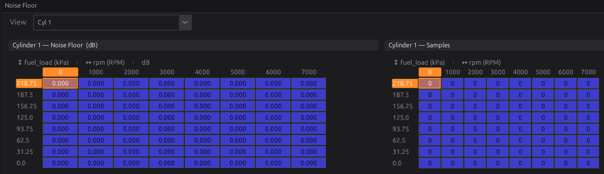
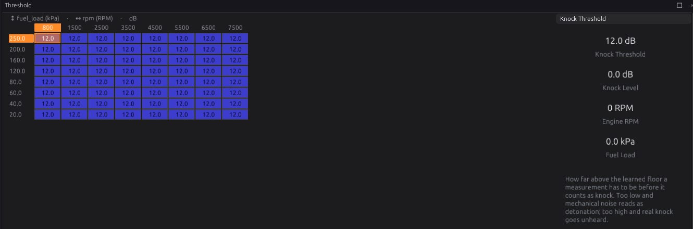
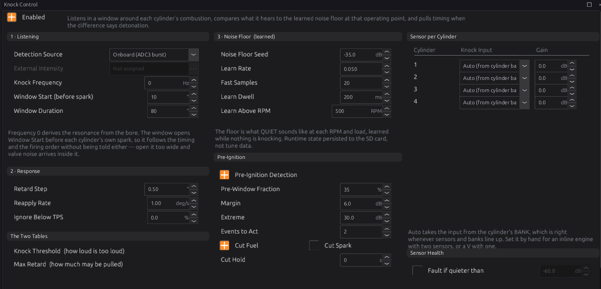

# Knock

:material-circle:{ .level-intermediate } Intermediate → :material-circle:{ .level-advanced } Advanced

> **In one sentence:** after each cylinder fires, the ECU listens to the knock sensor in a short
> window, compares what it hears with what that cylinder normally sounds like at that speed and load,
> and pulls timing from a cylinder that is knocking — and it can spot pre-ignition and cut that
> cylinder's fuel.

This chapter sets knock control up. Tuning the thresholds on a running engine is chapter 41.

## What it does

:material-circle:{ .level-basic } Basic

**Knock** (detonation) is part of the mixture exploding after the spark instead of burning smoothly.
It rings the engine block at a frequency set mainly by the bore, and a knock sensor bolted to the block
hears it. A little is harmless; sustained knock breaks pistons.

The **Knock Control** module (`knock`):

1. **Listens** to the knock sensor in a crank-angle window after each cylinder's top dead centre.
2. **Filters** the signal to the knock frequency and measures its level in dB.
3. **Compares** it with a **learned noise floor**: what that cylinder normally sounds like at that
   engine speed and load. How far above the floor it is — the **intensity** — is what counts.
4. **Retards** the timing of a cylinder whose intensity goes over the **Knock Threshold**, a step at a
   time up to **Max Retard**, and gives the timing back slowly once it is quiet.
5. Optionally **detects pre-ignition** (the mixture lighting before the spark) and cuts that
   cylinder's fuel.
   <!-- src: firmware/Engine/Modules/Knock.h; firmware/Engine/Modules/Knock.cpp -->

## How it works

:material-circle:{ .level-intermediate } Intermediate

### 1 · Listening

- **Detection Source**: **Onboard** samples KNOCK1 and KNOCK2 (CN4-23, CN4-22) directly.
  **External** reads a knock intensity in dB from another device over the bus (**External
  Intensity**); it has no per-cylinder detail, so it retards all cylinders together.
- **Window Start (before spark)** (default **10°**) and **Window Duration** (80°) set when to listen.
  The window opens that many degrees before **each cylinder's own spark**, so it follows the timing and
  the firing order: a 20° spark opens it at 30° BTDC, and it listens for 80° from there, to 50° after
  TDC. It opens before the spark so it can hear pre-ignition (below), and runs well past TDC because
  knock rings through the expansion stroke. It never opens earlier than 85° BTDC.
  <!-- src: definition/ecu.schema.yaml (knock.window_before_spark_deg); firmware/Scheduler/EnginePositionHal.cpp (knock_open_btdc); firmware/main.cpp (knock_task) -->
- **Knock Frequency**: the centre of the filter. **0** (the default) works it out from the engine's
  **Bore** (chapter 15): 900 ÷ (π × bore/2) kHz — about 7.2 kHz for an 80 mm bore — or 7 kHz if no bore
  is set.
- **Per-Cylinder Knock Input**: which sensor hears each cylinder. **Auto** takes it from the
  cylinder's bank (bank 1 → Knock 1, bank 2 → Knock 2). **Sensor Gain** trims one cylinder's level up
  or down, for a cylinder far from its sensor.
  <!-- src: definition/ecu.schema.yaml (Knock scalars); firmware/main.cpp -->

The onboard sampling borrows the processor's third ADC from the AV13–AV16 inputs for each window and
hands it back. Those four inputs keep reading, but update only between knock windows — at high engine
speed on many cylinders the gaps get short.

A window is sampled for at most 7.3 ms (2048 samples). At very low engine speed a long window is
therefore cut short: a 40° window is only complete above about 900 RPM.

### 2 · The learned noise floor

For each cylinder the ECU keeps an 8 × 8 map of its normal noise, by engine speed and load. It learns
only from **clean** cycles, and only when:

- engine speed is above **Noise Learn Min RPM** (500);
- the operating point has stayed in one cell for **Noise Learn Dwell** (200 ms);
- fuel and spark are not being cut.

A cell's first reading becomes its floor. Its next **Fast-Learn Cycles** (20) readings are averaged in
fully, after which it follows slowly at **Noise Learn Rate** (0.05 per cycle). A knocking cycle
never teaches the floor — otherwise the floor would chase the knock and the ECU would go deaf.

!!! warning "A new engine is deaf until it has learned"
    A cell that has never been learned **cannot report knock** — its first reading becomes the floor.
    After flashing, or on a new engine, drive gently through the speed and load range before loading
    the engine hard, so every cell you will use has a floor. **Noise Floor Seed** is only what the
    studio shows for an unlearned cell.

The learned floor is saved on the SD card with the other learned tables (chapter 23), so the engine is
not deaf after every start.
<!-- src: firmware/Engine/Modules/Knock.cpp -->

### 3 · Knock and retard

A measurement is **knock** when its intensity is above the **Knock Threshold** table (default 12 dB
over the floor, by RPM and load). Each knock event adds **Retard Step per Event** (0.50°) to that
cylinder's retard, up to the **Max Knock Retard** table (8°). The retard falls back at **Retard
Recovery Rate** (1.00 °/s) once it stops. Each cylinder has its own retard with the onboard source;
**Knock Retard** `knock_retard` shows the largest.

While fuel is cut (overrun, a limiter, a protection) nothing is judged, and the retard recovers at the
normal rate. **Knock Suppress Below TPS** (0 = off) adds a throttle gate if you need one.
<!-- src: firmware/Engine/Modules/Knock.cpp -->

### 4 · Pre-ignition

Pre-ignition lights the charge at or before the spark. The window always opens **Window Start**
before each spark, so the energy before the spark is always in it, at any timing. With
**Pre-Ignition Detection** on, a loud event is judged **pre-ignition** when either:

- at least **Pre-Spark Energy Fraction** (35 %) of its energy came before the spark and it is
  **Pre-Ignition Margin** (6 dB) louder than the knock threshold; or
- it is louder than **Pre-Ignition Extreme Level** (30 dB over the floor), whatever the timing.

After **Events Before Action** (2) such events on one cylinder, the code **P1790** + cylinder is set
(severity 3) and that cylinder is cut: **Cut Fuel on Pre-Ignition** (on), and optionally **Cut Spark**
(off by default — on wasted spark it also kills the partner cylinder). **Pre-Ignition Cut Hold** (0 =
until the engine stops) says how long the cut lasts. Pre-ignition is not answered with retard:
retarding does not stop it.
<!-- src: firmware/Engine/Modules/Knock.cpp -->

### 5 · Sensor health

A missing knock signal sets **P1750** (Knock 1) or **P1751** (Knock 2). A disconnected sensor still
gives a reading — the input hears its own noise — so to catch one, turn on **Detect a Quiet
(Disconnected) Sensor** and set **Quiet Level** from a log: the level at idle with the sensor plugged
in, and with it unplugged.

## Before you start

:material-circle:{ .level-basic } Basic

- Knock sensors wired to KNOCK1/KNOCK2 with shielded cable and torqued to the maker's figure
  (chapter 11). The **H1**/**H2** jumpers and the CN1 listening jack are in chapter 7.
- **Bore** set on the engine page (chapter 15), for the knock frequency.
- The cylinders' **banks** set (chapter 15), if you use Auto input selection on a V engine.
- The trigger and ignition working (chapters 16 and 20).

## Setting it up

:material-circle:{ .level-intermediate } Intermediate

Open **Configuration ▸ Ignition Tuning ▸ Knock Control** and tick **Enabled**.

1. **Listening:** Source Onboard; Knock Frequency 0 (from the bore); Window Start 10° before the spark,
   Duration 80°.
2. **Sensor per cylinder:** leave on Auto, or set each cylinder to the sensor nearest it.
3. **Response:** keep Retard Step 0.5° and Recovery 1 °/s.
4. **Learn the floor:** drive gently through the range with the engine warm. Watch the **Noise Floor**
   page fill in (the **Samples** grid shows how many clean cycles taught each cell).
5. **Thresholds:** tune them on a running engine — chapter 41.

## Worked examples

:material-circle:{ .level-intermediate } Intermediate

!!! example "Example 1 — inline four, one sensor"
    One sensor on Knock 1 between cylinders 2 and 3. Cylinders 1–4 on Knock 1 (Auto works if all four
    are bank 1). Sensor Gain +2 dB on cylinders 1 and 4, which are further from the sensor.

!!! example "Example 2 — V8, a sensor per bank"
    Banks set in chapter 15; Auto sends bank 1 to Knock 1 and bank 2 to Knock 2.

!!! example "Example 3 — watching for pre-ignition on a boosted engine"
    Window Start 10° before the spark, Duration 80°; Pre-Ignition Detection on, Events Before Action 2,
    Cut Fuel on, Cut Hold 0.

## Tuning it

:material-circle:{ .level-advanced } Advanced

Chapter 41 covers threshold tuning with the Knock Scope, which shows each measurement against its
cylinder's floor and threshold. In short: log `knock_level`, `knock_count` and `knock_retard`; raise
the threshold where clean running trips it, and lower it where real knock (heard through the CN1
jack) goes unnoticed.

## Diagnostics

:material-circle:{ .level-intermediate } Intermediate

| Code | Meaning | What sets it |
|---|---|---|
| **P1750** / **P1751** | Knock sensor 1 / 2 signal missing | The sensor not reading, or reading quieter than Quiet Level (if enabled) |
| **P1752** | Throttle signal missing | Knock Suppress Below TPS is set and there is no throttle reading: detection is suppressed |
| **P1790**–**P179B** | Pre-ignition on cylinder 1–12 | Events Before Action confirmed events (severity 3) |

Live channels: `knock_level` (the loudest recent measurement in dB, before the floor is taken off;
it falls back at 20 dB/s), `knock_count`, `knock_retard`, `knock_1`, `knock_2`.
<!-- src: firmware/Engine/Modules/Knock.cpp -->

## Troubleshooting

:material-circle:{ .level-basic } Basic → :material-circle:{ .level-advanced } Advanced

| Symptom | Likely causes | Check |
|---|---|---|
| Never detects knock | Cells not learned yet; threshold too high; wrong sensor per cylinder | The Samples grid; Threshold; Knock Input |
| Retard on a clean engine | Threshold too low at that point; valve or injector noise in the window | Threshold; a later or shorter window |
| Knock only ever on one cylinder | That cylinder's sensor gain; the cylinder is far from the sensor | Sensor Gain |
| AV13–AV16 readings lag | Onboard knock sampling shares their converter | Expected; use AV1–AV11 for fast signals |
| A pre-ignition cut on a healthy engine | Pre-ignition limits too low; the window opens too early | Margin, Extreme Level, Events Before Action |

## Settings reference

--8<-- "reference/settings/_knock.table.md"

## Related

- [Chapter 7 — The board](../part2/07-board.md) (knock inputs, H1/H2, CN1)
- [Chapter 11 — Wiring sensors](../part2/11-wiring-sensors.md) (knock sensors)
- [Chapter 15 — Engine and vehicle basics](15-engine-vehicle.md) (bore, banks)
- [Chapter 20 — Ignition](20-ignition.md) (how knock retard is applied)
- [Chapter 41 — Knock tuning](../part4/41-knock-tuning.md)
