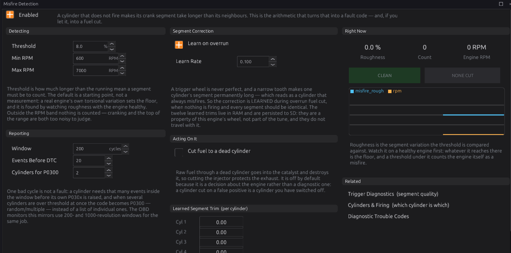

# Misfire detection

:material-circle:{ .level-intermediate } Intermediate → :material-circle:{ .level-advanced } Advanced

> **In one sentence:** a cylinder that fires speeds the crank up through its power stroke and one that
> does not, doesn't — so the ECU times each cylinder's stretch of crank rotation, and a stretch that is
> noticeably slower than its neighbours is counted as a misfire.

## What it does

:material-circle:{ .level-basic } Basic

The **Misfire Detection** module (`misfire`) measures, for every cylinder, how long the crank takes to
turn through that cylinder's power stroke (its **segment**), using the real trigger teeth. It compares
each segment with the average of the ones around it:

- The engine speeding up or slowing down shortens or lengthens every segment together, so it cancels
  out. Only a segment slow **compared with its neighbours** counts.
- A segment more than **Misfire Threshold** (default 8 %) longer than its neighbours is a misfire
  event for that cylinder.
- Enough events on one cylinder raise its code (**P0301** for cylinder 1 … **P030C** for 12); several
  cylinders at once raise **P0300** (random/multiple).
- Optionally, a cylinder with a misfire code has its **fuel cut**.
  <!-- src: firmware/Engine/Modules/Misfire.h; firmware/Engine/Modules/Misfire.cpp -->

## How it works

:material-circle:{ .level-intermediate } Intermediate

### 1 · When it can work

- It needs **full sync** (a cam, or distributor mode — chapter 16), so each segment belongs to a named
  cylinder.
- It needs at least **3 trigger teeth per cylinder segment**. A 36-1 wheel on a four-cylinder gives
  about 9; a 4-tooth wheel on a twelve gives less than one. Below that the module reports nothing at
  all, rather than guessing.
- It only judges between **Misfire Min RPM** (600) and **Misfire Max RPM** (7000).
  <!-- src: firmware/Scheduler/EnginePositionHal.cpp; firmware/Scheduler/SegmentTimer.h -->

### 2 · The learned correction

No trigger wheel is perfect: a slightly narrow tooth can make one cylinder's segment always read long,
which would look like a permanent misfire. So, with **Learn on overrun** on (the default), the module
learns each cylinder's error during **overrun fuel cut**, when nothing is firing and every segment
should be the same, at **Learn Rate** (0.10 per segment). The corrections are saved on the SD card with
the other learned values; they belong to this engine's wheel, not to the tune. This needs
**Deceleration Fuel Cut** (chapter 29) to be on.
<!-- src: firmware/Engine/Modules/Misfire.cpp -->

### 3 · Counting and codes

- A cylinder needs **Events Before DTC** (20) misfires before its P030x is raised.
- The tally is halved every **Window** (200) engine cycles, so old events fade.
- If **Cylinders for P0300** (2) or more cylinders are over the limit at once, the code is **P0300**
  instead of a list of cylinders.
- The misfire codes are severity 1 (warnings).

### 4 · Cutting fuel

With **Cut fuel to a dead cylinder** on, a cylinder with a P030x code has its injector cut until the
engine stops. It is off by default: a false alarm would switch off a working cylinder. It does not
act on a P0300 (several cylinders). On an engine where injectors are shared (multi-point or bank
injection, chapter 19), cutting one cylinder's injector cuts its whole group.
<!-- src: firmware/Engine/Modules/Misfire.cpp; firmware/Engine/EngineTask.cpp (misfire cut mask -> scheduler fuel cut); firmware/Scheduler/EventScheduler.h (set_cylinder_cuts) -->

## Before you start

:material-circle:{ .level-basic } Basic

- The trigger at full sync, with enough teeth (above).
- **Deceleration Fuel Cut** on, so the correction can learn.

## Setting it up

:material-circle:{ .level-intermediate } Intermediate

1. Open **Configuration ▸ Protection ▸ Misfire Detection** and tick **Enabled**. Leave **Learn on
   overrun** on.
2. Drive normally with several overruns (lifting off from speed) so the correction learns. The
   **Learned Segment Trim** values change from 0.00 (not learned) to about 1.00.
3. Watch **Roughness** on a healthy, warm engine across the range. The highest value it reaches is
   your engine's own noise; set **Threshold** comfortably above it.
4. Test: pull one coil or injector plug at idle. That cylinder's code should appear.

## Worked examples

:material-circle:{ .level-intermediate } Intermediate

!!! example "Example 1 — a four-cylinder with a 36-1 wheel and a cam"
    Defaults work: about 9 teeth per segment, full sync from the cam. Threshold raised to 10 % after
    seeing roughness reach 6 % on a rough idle.

!!! example "Example 2 — protecting a catalyst"
    **Cut fuel to a dead cylinder** on, with sequential injection so the cut really is one cylinder.

## Tuning it

:material-circle:{ .level-advanced } Advanced

- **Rough idles** (big cams) need a higher threshold, or a higher Min RPM.
- **High RPM** is noisy: lower Misfire Max RPM if false events appear near the limiter.
- A single cylinder that always reads a little long after learning points at the wheel or a sensor
  gap; give it more overruns to learn.

## Diagnostics

:material-circle:{ .level-intermediate } Intermediate

| Code | Meaning |
|---|---|
| **P0300** | Random / multiple cylinder misfire |
| **P0301**–**P030C** | Misfire on cylinder 1–12 |

Live channels: `misfire_rough` (the worst cylinder's roughness, %), `misfire_count` (total events),
`misfire_cut_mask`.

## Troubleshooting

:material-circle:{ .level-basic } Basic → :material-circle:{ .level-advanced } Advanced

| Symptom | Likely causes | Check |
|---|---|---|
| Nothing ever counted | Not at full sync; too few teeth per segment; outside the RPM band | Chapter 16; the wheel |
| One cylinder always misfiring on a good engine | Correction not learned (no overruns) | Enable DFCO; drive with overruns |
| Misfire codes at idle on a healthy engine | Threshold below the engine's own roughness | Raise Threshold, or Min RPM |
| Codes after a fuel cut test | Expected: a cut cylinder does not fire | Clear the codes |

## Settings reference

--8<-- "reference/settings/_misfire.table.md"

## Related

- [Chapter 16 — Trigger](16-trigger.md) (full sync, wheels)
- [Chapter 19 — Fuel](19-fuel.md) (injection modes)
- [Chapter 29 — Engine protection](29-protection.md) (DFCO, protection levels)
- [Chapter 44 — Diagnostics and trouble codes](../part5/44-diagnostics.md)
