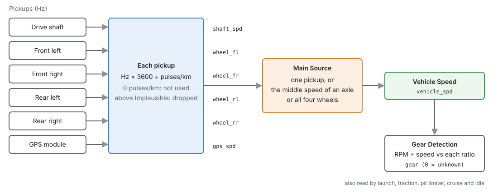
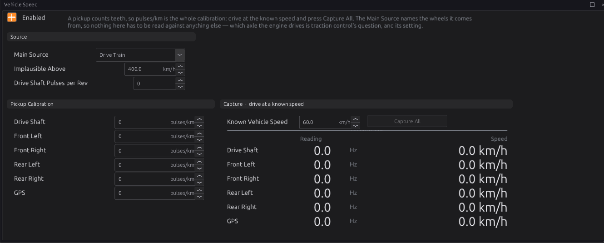
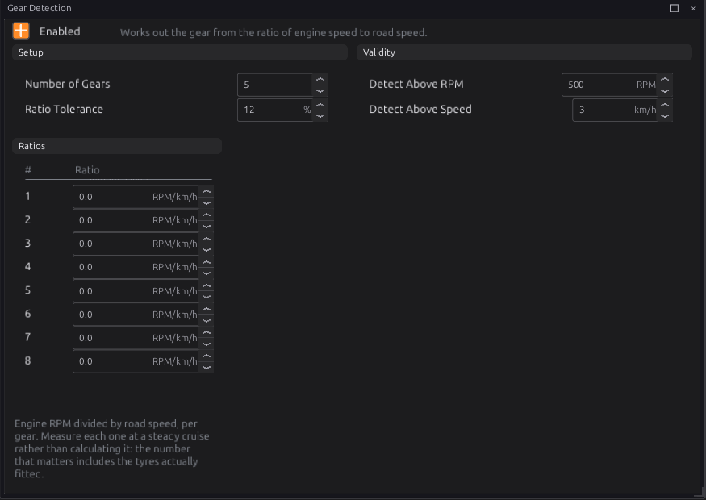
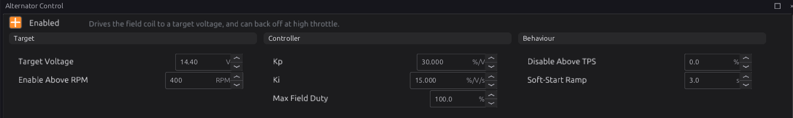
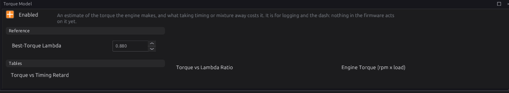
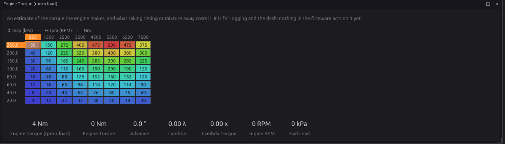

# Vehicle functions

:material-circle:{ .level-basic } Basic → :material-circle:{ .level-intermediate } Intermediate

> **In one sentence:** the ECU turns speed-sensor pulses into a road speed, works out the gear from
> engine speed and road speed, can regulate the alternator's charge voltage, and can estimate the
> torque the engine is making.

## What it does

:material-circle:{ .level-basic } Basic

| Module | Page | Publishes |
|---|---|---|
| **Vehicle Speed** (`vehicle_speed`) | Configuration ▸ Vehicle Functions ▸ Vehicle Speed | **Vehicle Speed** `vehicle_spd`, and a speed for every pickup |
| **Gear Detection** (`gear_detect`) | Configuration ▸ Vehicle Functions ▸ Gear Detection | **Gear** `gear` (0 = unknown) |
| **Alternator Control** (`alternator`) | Configuration ▸ Electrical ▸ Alternator Control | **Alternator Field Duty** `alternator_duty` |
| **Torque Model** (`torque_model`) | Configuration ▸ Engine Functions ▸ Torque Model | **Engine Torque** `engine_torque_nm`, **Engine Power** `engine_power_kw` |

Road speed is used by launch and traction control (chapter 26), the pit limiter and cruise control
(chapter 27) and idle (chapter 21). Gear is a table axis for fuel, ignition, boost and launch, and
is used by boost and cruise.

All four are off by default. Vehicle Speed and Gear Detection publish **nothing** while they are off,
so a speed or gear that comes from CAN (chapter 33) or a Lua script (chapter 35) is left alone.

<figure markdown>
  
  <figcaption>Figure 32.1 — From pickup pulses to road speed and gear.</figcaption>
</figure>

## How it works

:material-circle:{ .level-intermediate } Intermediate

### 1 · Road speed

A speed sensor counts teeth, so what it gives the ECU is a frequency. There are six pickups, each a
sensor you set up in chapter 17: **Wheel Speed Front Left**, **Front Right**, **Rear Left**, **Rear
Right**, **Drive Shaft Speed** and **GPS Speed** (a GPS speedometer module with a pulse output).

- Each pickup has one calibration number, **pulses per kilometre**. Its speed is
  Hz × 3600 ÷ pulses/km.
- A pickup with **0** pulses/km, or with no reading, has no speed. It is left out; it is not
  counted as 0 km/h.
- A reading above **Implausible Above** (400 km/h) is dropped. A floating frequency input can read
  enormous numbers.
- Every calibrated pickup publishes its own speed: `wheel_fl`, `wheel_fr`, `wheel_rl`, `wheel_rr`,
  `shaft_spd`, `gps_spd`.
  <!-- src: firmware/Engine/Modules/VehicleSpeed.cpp -->

**Main Source** chooses which of them is the road speed `vehicle_spd`:

| Main Source | Road speed is |
|---|---|
| **Drive Train**, **Front Left** … **Rear Right**, **GPS** | that one pickup |
| **Front Axle**, **Rear Axle** | the average of that axle's two wheels (one wheel, if only one reads) |
| **All Wheels** | the average of the middle two of the four wheels — the fastest and slowest are ignored |

Taking the middle values ignores a wheel spinning under power and a wheel locking under braking at the
same time. A drive shaft pickup reads the average of the driven wheels, so it includes their
wheelspin. For traction control, the road speed has to come from wheels the engine does not drive
(chapter 26).
<!-- src: firmware/Engine/Modules/VehicleSpeed.cpp -->

**Drive Shaft Pulses per Rev** is only for the **Drive Shaft RPM** channel `driveshaft_rpm`; road speed
does not use it. 0 leaves that channel unpublished.

### 2 · Gear

Gear Detection divides engine RPM by road speed and compares it with each gear's **Ratio** (RPM per
km/h). The closest ratio within **Ratio Tolerance** (12 %) wins. Nothing within tolerance gives 0.

- Below **Detect Above RPM** (500) or **Detect Above Speed** (3 km/h) the gear is 0 (unknown).
- With the clutch in or in neutral, the ratio usually matches no gear and the gear is 0.
- Only the first **Number of Gears** (5) ratios are tried. A ratio of 0 is an unused gear.
- The ratios are all 0 by default, so the gear is always 0 until you fill them in.
  <!-- src: firmware/Engine/Modules/GearDetect.cpp -->

### 3 · Alternator

For an alternator whose field you can drive yourself (no internal regulator, or one bypassed), the
ECU regulates the charge voltage:

- A PI loop compares the battery voltage with **Target Voltage** (14.40 V) and sets the field duty
  `alternator_duty`, up to **Max Field Duty** (100 %).
- It only runs while the engine is **running** (not cranking) and above **Enable Above RPM** (400).
- When it starts, the duty ceiling ramps up from 0 over **Soft-Start Ramp** (3 s), so the load comes
  on gently.
- Above **Disable Above TPS** it stops charging, freeing a little power (0, the default = never).
- More than 1.5 V above target, the field is switched off at once.
- With no battery reading, the field is released.

While it is not charging it publishes nothing, so the output falls back to its **Failsafe** value
(chapter 18). The module drives no pin by itself: give a PWM output the **Value From** candidate
`alternator_duty`.
<!-- src: firmware/Engine/Modules/Alternator.cpp -->

### 4 · Torque model

An **estimate**: nothing is measured, and nothing in the firmware acts on it yet. It is for logging
and the dash.

- **Engine Torque (rpm x load)** gives the torque at best timing and best-torque mixture, by RPM and
  manifold pressure.
- **Torque vs Timing Retard** takes some away when the timing is below the main advance map
  (knock, protection or idle retard).
- **Torque vs Lambda Ratio** takes some away when the mixture is away from **Best-Torque Lambda**
  (λ 0.880). Its axis is the ratio of the actual lambda to best-torque lambda.
- Power is torque × engine speed: `engine_power_kw`.
  <!-- src: firmware/Engine/Modules/TorqueModel.cpp -->

The default torque map is a placeholder (a typical 2-litre engine, scaled with manifold pressure).
Replace it with your engine's dyno figures.

## Before you start

:material-circle:{ .level-basic } Basic

- **Speed sensors** wired to DIG inputs, or VR inputs (chapter 11), and set up as the pickup sensors
  above (chapter 17). Or a road speed arriving over CAN (chapter 33).
- **Alternator:** an alternator with an externally driven field, and a PWM output that can carry the
  field current (chapter 12).
- **Torque model:** your engine's torque curve.

## Setting it up

:material-circle:{ .level-intermediate } Intermediate

### Road speed

1. On **Vehicle Speed**, tick **Enabled** and pick the **Main Source**.
2. Calibrate each pickup, one of two ways:
    - **Drive:** hold a steady speed, read from a GPS (not the car's speedometer), type it into **Known
      Vehicle Speed** and press **Capture All**. Every pickup's pulses/km is set from its reading.
    - **Work it out:** pulses/km = teeth per wheel turn × 1000 ÷ tyre circumference in metres. For a
      drive shaft pickup, multiply by the final drive ratio as well.
3. Check each pickup's **Speed** column against the GPS at a few speeds.

Capture All sets every pickup at once. A pickup that reads nothing at the time gets 0 (not used).

### Gear

1. On **Gear Detection**, tick **Enabled** and set **Number of Gears**.
2. For each gear, drive at a steady speed in that gear and divide engine RPM by road speed (both on the
   dash). Type it as that gear's **Ratio**.
3. Watch `gear` while driving through the gears.

You can also work a ratio out: RPM per km/h = gear ratio × final drive × 1000 ÷ (60 × tyre
circumference in metres). Measuring is better: it includes the tyres actually fitted.

### Alternator

1. Give a PWM output the **Value From** candidate `alternator_duty`, with a **Failsafe** suited to
   your alternator (chapter 18).
2. On **Alternator Control**, tick **Enabled** and set **Target Voltage**.
3. Start the engine and watch `battery` and `alternator_duty` while switching loads on and off
   (headlights, fan).

### Torque model

1. On **Torque Model**, tick **Enabled** and set **Best-Torque Lambda**.
2. Enter your engine's torque in **Engine Torque (rpm x load)**: the dyno curve at full load, and less
   at lower manifold pressures.

## Worked examples

:material-circle:{ .level-intermediate } Intermediate

!!! example "Example 1 — a rear-drive car with a gearbox speed sensor"
    Main Source **Drive Train**. Captured at 60 km/h by GPS: the sensor read 139 Hz, so pulses/km =
    139 × 3600 ÷ 60 = 8340.

!!! example "Example 2 — front-wheel drive with four ABS sensors"
    Main Source **Rear Axle** (the undriven wheels), so wheelspin does not show in the road speed.
    48-tooth rings and 1.94 m tyres: 48 × 1000 ÷ 1.94 = 24742 pulses/km for each wheel.

!!! example "Example 3 — gear ratios for a five-speed"
    In 1st at a steady 30 km/h the engine turns 3450 RPM: 3450 ÷ 30 = 115.0. The others, measured the
    same way: 2nd 63.5, 3rd 45.8, 4th 34.2, 5th 27.9.

## Tuning it

:material-circle:{ .level-intermediate } Intermediate

- **Wrong gear shown:** a ratio typed wrongly, or measured with the clutch slipping. Measure it again
  at a steady speed. When a reading is within tolerance of two gears, the closer one wins.
- **Gear drops to 0 while driving:** tolerance too tight for tyre wear or torque-converter slip. Raise
  it a little.
- **Alternator voltage rings:** lower **Kp**. **Settles below target:** raise **Ki**.

## Diagnostics

:material-circle:{ .level-intermediate } Intermediate

These modules set no trouble codes. The speed sensors have their own sensor codes (chapter 17).

Live channels: `vehicle_spd`, `wheel_fl`, `wheel_fr`, `wheel_rl`, `wheel_rr`, `shaft_spd`, `gps_spd`,
`driveshaft_rpm`, the raw frequencies `wheel_hz_fl` … `gps_hz`, `gear`, `alternator_duty`,
`engine_torque_nm`, `engine_power_kw`, `lambda_torque_ratio`.

## Troubleshooting

:material-circle:{ .level-basic } Basic → :material-circle:{ .level-intermediate } Intermediate

| Symptom | Likely causes | Check |
|---|---|---|
| No road speed | Module off; pickup not calibrated (0 pulses/km); sensor not set up or not reading | Enabled; the pulses/km; the pickup's Hz on the page |
| Road speed wrong by a fixed factor | Calibration wrong | Capture again against a GPS |
| Road speed jumps to nothing at high speed | Above Implausible Above | Raise it, or look for a noisy input |
| Road speed rises with wheelspin | Main Source is a driven wheel or the drive shaft | Use the undriven axle |
| Gear always 0 | Ratios not set; below Detect Above RPM or Speed; no road speed | The Ratios; `vehicle_spd` |
| Alternator never charges | Engine not reported running; below Enable Above RPM; no output with `alternator_duty` | `engine_state`; the output |
| Torque reads 0 | Module off | Enabled |

## Settings reference

Vehicle Speed:

--8<-- "reference/settings/_vehicle_speed.table.md"

Gear Detection:

--8<-- "reference/settings/_gear_detect.table.md"

Alternator Control:

--8<-- "reference/settings/_alternator.table.md"

Torque Model:

--8<-- "reference/settings/_torque_model.table.md"

## Related

- [Chapter 11 — Wiring sensors](../part2/11-wiring-sensors.md) (speed sensors)
- [Chapter 17 — Sensors and calibration](17-sensors.md) (the pickup sensors)
- [Chapter 18 — Outputs and the pin system](18-outputs.md) (the alternator output)
- [Chapter 26 — Launch, shift and traction](26-launch-shift-traction.md)
- [Chapter 27 — Speed limiting](27-speed-limiting.md)
