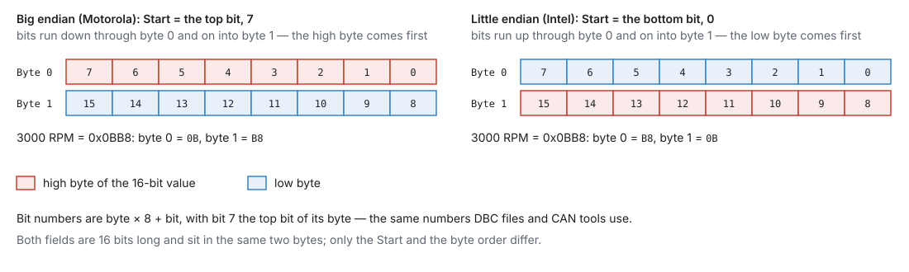
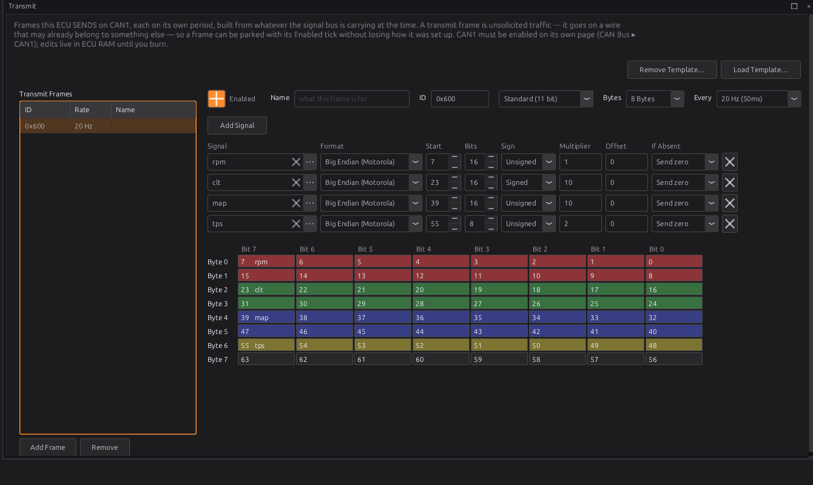
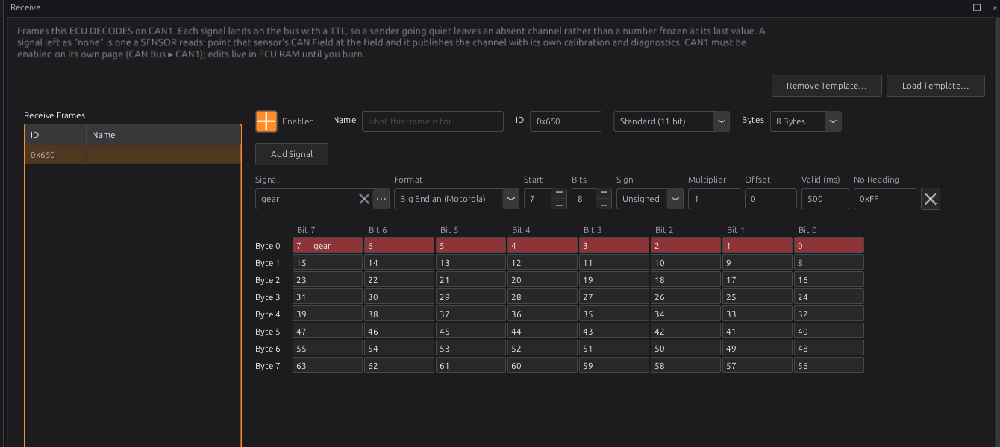

# CAN configuration

:material-circle:{ .level-intermediate } Intermediate → :material-circle:{ .level-advanced } Advanced

> **In one sentence:** you describe each CAN frame the ECU sends or reads — its id, its length, and
> which bits carry which channel with what scaling — and the ECU turns channels into frames and frames
> into channels.

Chapter 13 covers wiring a bus, switching it on and loading a device template. Chapter 14 covers the
OBD-II port. This chapter is the frame editor: building a frame yourself, or checking and changing one
a template made.

## What it does

:material-circle:{ .level-basic } Basic

Each bus has two pages under **Configuration ▸ CAN Bus ▸ CAN1** (and **CAN2**):

- **Transmit**: frames the ECU **sends**, each on its own period, built from live channels. A dash or
  logger reads them.
- **Receive**: frames the ECU **reads**. Each field becomes a channel, like a sensor reading, or is
  picked up by a CAN sensor (chapter 17).

The frames are part of the tune, not the firmware. A frame that turns out to be wrong is a tune edit.
The tune holds up to **96 frames** and **512 fields**, shared by both buses.
<!-- src: firmware/Can/GenericCan.h; definition/ecu.schema.yaml (Can: gc_frame count 96, gc_field count 512) -->

## How it works

:material-circle:{ .level-intermediate } Intermediate

### 1 · Frames

| Setting | Meaning |
|---|---|
| **Enabled** | Off parks the frame: kept in the tune, not sent or read |
| **Name** | your own note; the ECU does not use it |
| **ID** and **Standard (11 bit)** / **Extended (29 bit)** | the identifier. 0x100 standard and 0x100 extended are different frames |
| **Bytes** | the payload length, 0–8 |
| **Every** (transmit only) | how often it is sent: 20 Hz is every 50 ms |

A frame only runs while its bus is enabled (**Bus Enabled** on the bus's own page). A transmit frame
on a **Listen Only** bus can never go out: the ECU sets **P1655**.

Frames that share a rate are spread across their period, so the bus sees a steady trickle rather than
a burst. A frame that falls behind skips to the current values rather than sending a backlog of old
ones.
<!-- src: firmware/Can/GenericCan.cpp -->

### 2 · Fields: where the bits are

<figure markdown>
  
  <figcaption>Figure 33.1 — The same 16-bit value in the two byte orders.</figcaption>
</figure>

- **Bit numbers** are byte × 8 + bit, with bit 7 the top bit of its byte: byte 0 runs 7 … 0, byte 1
  runs 15 … 8, byte 7 runs 63 … 56. This is the numbering DBC files and CAN tools use, and the grid
  under the table shows it.
- **Format**:
    - **Big Endian (Motorola)**: **Start** is the field's **top** bit. It runs down through the byte
      and carries on at the top of the next byte, so a 16-bit value at Start 7 has its high byte in
      byte 0.
    - **Little Endian (Intel)**: **Start** is the field's **bottom** bit, and the numbers count up, so a
      16-bit value at Start 0 has its low byte in byte 0.
- **Bits**: 1 to 32. Odd widths are fine: a 1-bit flag, a 4-bit gear, a 12-bit reading.
- **Sign**: **Signed** for a two's-complement field that can be negative.

Changing the Format moves Start so the field stays on the same bits. The grid colours each field's
bits and warns when two fields share a bit.
<!-- src: firmware/Can/CanMessageTypes.h; apps/studio-jf/src/ui/GenericCanPanel.h (fmt change keeps the bits) -->

### 3 · Fields: the value

The field sends or reads a **channel**, in the channel's own units (kPa, °C, %, RPM — the studio's
display units make no difference on CAN). The conversion is written once, in the sending direction:

**raw = value × Multiplier + Offset**

and a received field is decoded the other way, value = (raw − Offset) ÷ Multiplier. A document that
gives the decode, such as "kPa = raw ÷ 10 − 101.3", is entered as its inverse: Multiplier 10, Offset
1013.

A value too big for the field is sent as the field's largest value, not wrapped round to a small one.
<!-- src: firmware/Can/CanMessageTypes.h -->

### 4 · Transmit: If Absent

A frame is a fixed set of bytes, so a field whose channel has no value (the sensor is not fitted, or
has failed) still needs something in its bits. **If Absent** decides what:

| If Absent | Sends |
|---|---|
| **Send zero** (default) | raw 0. Through an offset that is usually an obviously wrong reading, which is the point |
| **Hold last** | the last value sent |
| **Skip frame** | nothing: the **whole frame** is not sent this time |

Use **Skip frame** for a value whose zero looks real (a trim, an acceleration) and a receiver that
would act on it.
<!-- src: firmware/Can/CanMessageTypes.h; firmware/Can/GenericCan.cpp -->

### 5 · Receive: Valid For, No Reading and sensors

- **Valid (ms)**: how long a decoded value stays valid. If the frame stops arriving, the channel goes
  missing after this time instead of freezing at its last value. Set it to a few times the sender's
  period (default 500 ms). 0 means it never goes missing, which is almost never what you want.
- **No Reading**: the raw code a sender uses to mean "nothing to report" (a wideband in free air, a
  gearbox between gears). A frame carrying it is ignored for that field, so the value goes missing
  after Valid (ms) rather than reading as a number. Leave it empty if the sender has no such code.
- A field only decodes if the frame that arrived is long enough to hold it.
- Two receive frames may share an id and read different fields of it.
  <!-- src: firmware/Can/GenericCan.cpp -->

**Channel or sensor.** A receive field with a **Signal** writes that channel directly. A field with
no Signal (the ✕) is one a **sensor** reads: set that sensor's **Interface** to **CAN Bus** and pick
the field in its **CAN Field** (chapter 13, step 4). The sensor then adds its own diagnostics and trouble
codes. Only sensors that list **CAN Bus** among their interfaces can do this. Device templates for sensors leave their fields empty on purpose.

**One producer per channel.** A receive field that writes a channel an enabled sensor also produces,
or two receive fields that write the same channel, set **P1656**. The CAN value wins over the sensor
(it is written at a higher **priority**, 10 against the sensors' 0), but fix the clash: switch the
sensor off, or read the field through the sensor instead.
<!-- src: firmware/Can/GenericCan.cpp; definition/ecu.schema.yaml (gc_field.priority default 10) -->

## Before you start

:material-circle:{ .level-basic } Basic

- The bus wired, terminated and switched on at the right bit rate (chapter 13).
- The other device's frame layout: ids, byte order, which bytes carry what, and the scaling. Its
  documentation or a DBC file has these. The studio does not import DBC files: you type the values
  in, either into the editor or into a template file of your own (below).

## Setting it up

:material-circle:{ .level-intermediate } Intermediate

### Sending a frame

Open **Configuration ▸ CAN Bus ▸ CAN1 ▸ Transmit**.

1. **Add Frame**. Set the **ID**, **Bytes** and **Every**.
2. **Add Signal** for each value. Pick the channel with **⋯**, then set **Format**, **Start**, **Bits**,
   **Sign**, **Multiplier** and **Offset**. Each new signal starts at the byte after the last one.
3. Check the grid: every field in the right bits, and no clash warning.
4. Watch the receiving device, then burn.



### Reading a frame

Open **Configuration ▸ CAN Bus ▸ CAN1 ▸ Receive**.

1. **Add Frame** and set the **ID** and **Bytes** to match the sender.
2. **Add Signal** for each value: channel (or none, for a sensor to read), bits and scaling as the
   sender documents them. Set **Valid (ms)** from the sender's rate, and **No Reading** if it has one.
3. Check the channel on a gauge or in the log with the sender running, then unplug the sender: the
   channel should go missing after Valid (ms).



**Remove** takes out every selected frame (shift or ctrl to select several). **Remove Template…**
takes out the frames a template added, as a set.

### A value with no channel of its own

A field always carries a channel the ECU already has. You cannot make a new channel. For a value the
ECU has no name for, such as a button on a keypad or a pressure from a module you built, use one of
the spare channels:

| Spare channels | For |
|---|---|
| **Auxiliary Input 1–6** (`aux_1` … `aux_6`) | a number |
| **Generic Switch 1–4** (`switch_1` … `switch_4`) | on or off |

There are two ways to fill one:

- **Directly**: pick it as the field's **Signal**. Keep the matching sensor switched off, or the ECU
  sets **P1656**.
- **Through the sensor**: leave the Signal empty, switch the sensor on, and set its **Interface** to
  **CAN Bus** with its **CAN Field** on this field. The sensor adds its own checks and trouble codes,
  and an Auxiliary Input also lets you choose its **Sensor Type** (chapter 17).

The channel then works like any other. You can show it on a gauge, log it, use it in a generic
output's conditions (chapter 18) or read it in a script with `signalRead("aux_1")` (chapter 35).
<!-- src: definition/ecu.schema.yaml (sensor catalog: aux_1 … aux_6 and switch_1 … switch_4 with interface can_device; gc_field.sig options_from signals); firmware/Can/GenericCan.cpp (P1656) -->

### Your own templates

If you set up the same device on more than one car, save its frames as a template. A template is a
JSON file. Put your own in the `can_templates` folder of the studio's data folder (chapter 3), then
restart the studio: it reads the templates once, when it starts. It lists yours in **Load Template…**
beside the ones it ships with. A file with the same name as a shipped template replaces it.

This file sets up the dash frame from Example 1 below:

```json
{
  "id": "my_dash",
  "name": "My dash (0x600)",
  "direction": "transmit",
  "bitrate": 500000,
  "note": "RPM, coolant, MAP and throttle for the dash, 20 Hz.",
  "frames": [
    {
      "id": 1536, "ext": false, "dlc": 8, "period_ms": 50, "name": "Dash gauges",
      "fields": [
        { "sig": "rpm", "bit_off": 7,  "width": 16, "flags": 0, "scale": 1,  "offset": 0 },
        { "sig": "clt", "bit_off": 23, "width": 16, "flags": 1, "scale": 10, "offset": 0 },
        { "sig": "map", "bit_off": 39, "width": 16, "flags": 0, "scale": 10, "offset": 0 },
        { "sig": "tps", "bit_off": 55, "width": 8,  "flags": 0, "scale": 2,  "offset": 0 }
      ]
    }
  ]
}
```

The template:

| Key | Meaning |
|---|---|
| `id` | a short name for the file. If it is left out, the file name is used |
| `name` | what **Load Template…** shows |
| `direction` | `"receive"` for receive frames. Anything else makes transmit frames |
| `bitrate` | the bus rate the device needs: 125000, 250000, 500000 or 1000000. 0 or left out means any rate |
| `note` | the text **Load Template…** shows under the list |
| `frames` | the frames, below |

Each frame:

| Key | Meaning |
|---|---|
| `id` | the CAN id, **in decimal**: JSON has no hex, so 0x600 is written 1536 |
| `ext` | `true` for a 29-bit id |
| `dlc` | the payload length, 0–8. **Always give it**: a frame without it has no bytes |
| `period_ms` | transmit period in ms. Left out, 50 (20 Hz) |
| `name` | the frame's **Name** |
| `fields` | the fields, below |

Each field:

| Key | Meaning |
|---|---|
| `sig` | the channel's name, such as `"rpm"`. `null` leaves it empty, for a sensor to read |
| `bit_off`, `width` | **Start** and **Bits**, numbered as in the grid (big endian: Start is the top bit) |
| `flags` | add together: 1 signed, 2 little endian, 4 the No Reading code is in use |
| `scale`, `offset` | **Multiplier** and **Offset**. Left out, 1 and 0 |
| `policy` | transmit **If Absent**: 0 send zero, 1 hold last, 2 skip frame |
| `ttl_ms` | receive **Valid (ms)**. Left out, 500 |
| `sentinel` | receive **No Reading** code (with flag 4) |

The rate works as it does for a shipped template. A template that names a rate can go on an empty bus,
and sets the bus to that rate. Once frames are on the bus, only templates at the bus's rate can be
added.

!!! warning "The studio does not check your file"
    A channel name the studio does not know loads as an empty field (the ✕), and a mistake in a
    number loads as it is. After loading a template of your own, check every frame in the grid and
    every field's Signal before you burn. A file that is not valid JSON, or has no frames, is left
    out of the list.

**Remove Template…** finds a template's frames by their ids. It takes your template's frames off the
bus as a set, the same as it does for a shipped one.
<!-- src: apps/studio-jf/src/ui/CanTemplates.h (load: the keys read and their defaults; dir and shippedDir; loaded once); apps/studio-jf/src/ui/GenericCanPanel.h (loadTemplate, _sigIdFor, dropTemplate); apps/studio-jf/main.cpp (onLoadTemplate: bit rate rules) -->

The templates shipped with the studio are in `definition/can_templates/` in the source. The build
checks each one against the ECU's channels and frame sizes. It stops if a template names a channel the
ECU does not have, or has a field that runs past the end of its frame. Those files may also give a
field's place as `"bits"` in the form a data sheet prints it (`"0-1"` for bytes 0 and 1, `"2:5"` for
byte 2 bit 5), which the build turns into `bit_off` and `width`. A file in the data folder must use
`bit_off` and `width`.
<!-- src: codegen/codegen.py (install_can_templates, _parse_can_bits) -->

### When a frame needs logic: a script

The frame editor sends fixed fields on a fixed period, and reads fixed fields. Some devices want more:

- a **rolling counter**, a number that goes up by one in every frame
- a **checksum** worked out from the other bytes
- a frame sent **once**, when something happens
- one value spread over **several frames**, or a frame whose layout depends on a byte in it

A Lua script (chapter 35) does these. `canSend` sends a frame you build byte by byte. `canSubscribe`
and `onCanRx` hand the script the frames it asks for. Example 4 below sends a frame with a counter and
a checksum.
<!-- src: firmware/Scripting/ScriptEngine.cpp (l_canSend, canSubscribe, onCanRx) -->

## Worked examples

:material-circle:{ .level-intermediate } Intermediate

!!! example "Example 1 — four gauges for a dash (Figure above)"
    Frame 0x600, 8 bytes, 20 Hz, big endian:

    | Signal | Start | Bits | Sign | Multiplier | The dash reads |
    |---|---|---|---|---|---|
    | `rpm` | 7 | 16 | Unsigned | 1 | RPM |
    | `clt` | 23 | 16 | Signed | 10 | raw ÷ 10 = °C |
    | `map` | 39 | 16 | Unsigned | 10 | raw ÷ 10 = kPa |
    | `tps` | 55 | 8 | Unsigned | 2 | raw ÷ 2 = % |

    At 3000 RPM bytes 0–1 are 0B B8. At 92.5 °C, bytes 2–3 are 925 = 03 9D.

!!! example "Example 2 — a gear from a sequential gearbox controller"
    Frame 0x650 sent at 20 Hz; byte 0 is the gear, 0xFF between gears. Receive frame 0x650, `gear`
    at Start 7, 8 bits, Valid 500 ms, No Reading 0xFF. Gear Detection (chapter 32) is off, so nothing
    else writes `gear`.

!!! example "Example 3 — a little-endian sender"
    A device documents "oil pressure: bytes 2–3, little endian, 0.1 kPa per bit". Start is the lowest
    bit, byte 2 bit 0 = **16**; Bits 16; Format Little Endian; Multiplier 10; Signal `oil_pressure`.
    The **Oil Pressure** sensor stays switched off, so only the CAN field writes that channel.

!!! example "Example 4 — a counter and a checksum, from a script"
    A device wants frame 0x5F0 at 50 Hz: RPM in bytes 0–1, a counter 0–15 in byte 6, and in byte 7
    the sum of bytes 0–6 (the low 8 bits). The frame editor cannot count or add up, so a script sends
    it (chapter 35):
    ```lua
    setTickRate(50)
    local count = 0
    function onTick()
      local r = math.floor(rpm())
      local b = { r // 256, r % 256, 0, 0, 0, 0, count, 0 }
      local sum = 0
      for i = 1, 7 do sum = sum + b[i] end
      b[8] = sum % 256
      canSend(0, 0x5F0, b)
      count = (count + 1) % 16
    end
    ```
    Bytes must be whole numbers, which is why `rpm()` goes through `math.floor`. If the script stops,
    the frame stops. A device that checks the counter will notice, which is what the counter is for.

## Tuning it

:material-circle:{ .level-advanced } Advanced

- **Bus load** (on the bus's own page): keep it under about 50 %. Lower the rate of frames that
  do not need it; a dash gauge is fine at 10–20 Hz.
- **Refused** climbing: the ECU is trying to send more than the bus takes. Lower rates, or check the
  bus is not in error.
- The ECU sends at most 8 frames per millisecond from this list, so the OBD-II replies that share the
  controller are never starved.
  <!-- src: firmware/Can/GenericCan.h -->

## Diagnostics

:material-circle:{ .level-intermediate } Intermediate

| Code | Meaning | What sets it |
|---|---|---|
| **P1655** | A CAN frame cannot run | A transmit frame on a Listen Only bus; frames or fields beyond the pool (severity 1) |
| **P1656** | Two producers for one channel | A receive field writes a channel an enabled sensor, or another receive field, also writes (severity 1) |

Live channels for each bus: `can1_load_pct`, `can1_tx_fps`, `can1_rx_fps`, `can1_state`,
`can1_tec`, `can1_rec`, `can1_bus_off`, `can1_tx_fail`, `can1_last_err` (and the same for `can2_`).

## Troubleshooting

:material-circle:{ .level-basic } Basic → :material-circle:{ .level-advanced } Advanced

| Symptom | Likely causes | Check |
|---|---|---|
| Dash shows nonsense | Wrong byte order; Start one byte off; wrong Multiplier | The grid against the dash's document; swap Format |
| Dash value is 0 or off-scale | The channel has no value (If Absent Send zero) | The channel on a gauge |
| Received value never appears | Wrong id or standard/extended; frame too short for the field; bus off or wrong rate | The sender's id; Bytes; chapter 13 |
| Received value flickers missing | Valid (ms) shorter than the sender's period | Raise Valid (ms) |
| Received value stays after the sender stops | Valid (ms) is 0 | Set it |
| P1656 | A sensor and a receive field both write one channel | Switch one off, or read the field through the sensor |
| P1655 | Transmit frame on a Listen Only bus | Turn Listen Only off, or park the frame |

## Settings reference

The frame and field settings above are edited on the Transmit and Receive pages. The bus and OBD-II
settings:

--8<-- "reference/settings/_can.table.md"

## Related

- [Chapter 13 — CAN bus](../part2/13-can-bus.md) (wiring, bit rates, templates)
- [Chapter 14 — Vehicle integration](../part2/14-vehicle-integration.md) (OBD-II)
- [Chapter 17 — Sensors and calibration](17-sensors.md) (CAN sensors)
- [Chapter 18 — Outputs and the pin system](18-outputs.md) (using a received value in a generic output)
- [Chapter 35 — Lua scripting](35-lua.md) (frames that need a counter, a checksum or logic)
- [Chapter 32 — Vehicle functions](32-vehicle-functions.md) (gear)
