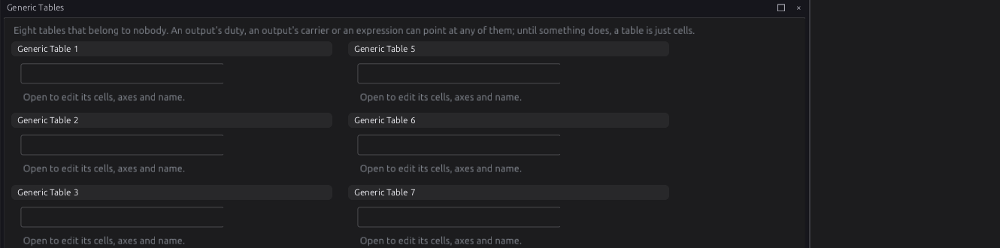
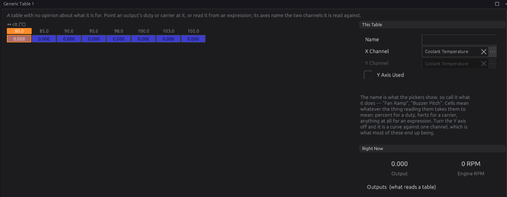
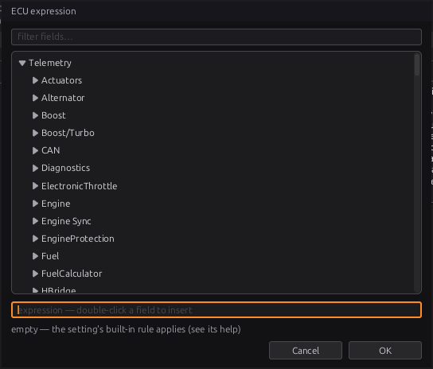

# Generic tables and expressions

:material-circle:{ .level-intermediate } Intermediate → :material-circle:{ .level-advanced } Advanced

> **In one sentence:** generic tables are eight spare maps you can point anything at, and expressions
> are short formulas — `clt > 95 and rpm > 800` — that many settings use to decide when something
> happens or how much.

## What it does

:material-circle:{ .level-basic } Basic

Most of this ECU's behaviour is fixed tables and settings. Two tools let you add your own:

- **Generic tables** (**Configuration ▸ Generic Tables**): eight tables that belong to nobody. An
  output's duty or frequency, or an expression, can read one. A fan duty against coolant, a buzzer
  pitch against engine speed, a bleed valve against boost.
- **Expressions**: a formula typed into a setting. They are used by:

| Where | Setting | Chapter |
|---|---|---|
| Outputs | **Turn On When**, **Turn Off When**, **Duty Expression**, **Frequency Expression** | 18 |
| Sensors | **Precondition** (when a sensor's checks run) | 17 |
| Closed-loop lambda | **Learn While** | 23 |
| Launch | **Arm When** | 26 |
| Traction control | **Active When** | 26 |
| Cruise control | **Enable When**, **Set When**, **Resume When**, **Cancel When** and the others | 27 |
| Engine protection | each threshold monitor's **Condition** | 29 |
| Onboard logging | **Log While**, **Stop When** | 42 |

<!-- src: definition/ecu.schema.yaml (every field of type: expression) -->

The studio compiles what you type into a small program and stores that in the tune; the ECU runs it.
The ECU never sees the text, only the program.
<!-- src: firmware/Signal/Expr.h -->

## How it works

:material-circle:{ .level-intermediate } Intermediate

### 1 · Generic tables

Each of the eight has:

- a **Name** — what the pickers show, so call it what it does ("Fan Ramp");
- an **X Channel** and a **Y Channel** — the two channels it is read against;
- **Y Axis Used** — off (the default), it is a curve against the X channel only;
- up to 16 breakpoints on each axis.

The cells have no units: they mean whatever the thing reading them takes them to mean — % for an
output's duty, Hz for its frequency, anything for an expression. The **Right Now** panel shows what
the table gives at this moment.
<!-- src: definition/ecu.schema.yaml (GenericTables); generated/modules/generic_tables_config.h (16 x 16 alloc) -->

An output reads a table when its **Value From** is **Table** and its **Duty Table** names it
(chapter 18). Any other table in the tune can be named there too; it is read at its own axes.

### 2 · What an expression can say

| You write | Means |
|---|---|
| `rpm`, `clt`, `map`, `vehicle_spd` … | a live channel, by its name |
| `launch.enabled`, `[#rev_limiter.hard_limit_rpm]` | a setting, by its path, in its own units (the ones the settings reference lists, whatever the studio displays) |
| `2500`, `0.5`, `95C`, `200F`, `1500ms`, `2s` | a number; a unit written flush against it is converted to the other side's unit |
| `+  -  *  /` | arithmetic |
| `>  >=  <  <=  ==  !=` | comparison: 1 for true, 0 for false |
| `and` / `&&`, `or` / `\|\|`, `not` / `!` | logic |
| `( )` | grouping |

Operators bind in the usual order: `not` and minus, then `* /`, then `+ -`, then comparisons, then
`==` / `!=`, then `and`, then `or`.

Functions:

| Function | Gives |
|---|---|
| `min(a, b)`, `max(a, b)` | the smaller / larger |
| `abs(a)` | the size, without the sign |
| `clamp(x, lo, hi)` | `x` held between `lo` and `hi` |
| `select(c, a, b)` | `a` if `c` is true, else `b` |
| `bit(word, n)` | bit `n` (0–31) of a status word |
| `age(channel)` | milliseconds since that channel was last updated |
| `table(name)` | a table, read at its own axes, as the ECU reads it |
| `interp(name, x)` | a table's curve, read at the `x` you give |

A table is named by its registry name, such as `generic_tables_table_1`. The Expression window lists
them.
<!-- src: apps/studio-jf/src/model/ExprAst.cpp; apps/studio-jf/src/model/ExprCompiler.cpp; apps/studio-jf/src/model/ExprUnits.h -->

Some things the studio accepts on a page are **not** available to the ECU: `^`, `floor`, `mod`,
`sin`, `cos`, `sqrt`, `lerp`, and page values written `[@…]` or `[%…]`. The Expression window says so
when you use one.

`==` treats two values within 0.005 of each other as equal, so `gear == 3` works on a gear that
arrives as 3.0.
<!-- src: firmware/Signal/ExprIsa.h -->

### 3 · When a channel has no value

A channel with no value — a sensor not fitted, failed, or gone quiet — cannot make a condition true.
The rules:

- A comparison involving it is **false**.
- `and` with it is false. `or` can still be true from its other side: with MAP dead,
  `map > 150 or tps > 80` is still true at full throttle.
- `not` of it is **still false**, not true. `not (oil_pressure < 100)` does not become true because
  the oil pressure sensor died.
- Arithmetic with it has no value either; so does division by zero.
- A number-giving expression (an output's duty or frequency) with no value gives no answer, and the
  output falls back to its Failsafe (chapter 18).
- `age(channel)` always works: it is how you ask "has this gone quiet?".
  <!-- src: firmware/Signal/Expr.h -->

An expression has no memory: it answers "what is true now". "For 5 seconds" belongs to the setting
that uses it (a delay, a timeout), not to the expression.

### 4 · Empty, and too long

- **Empty** means the setting's own built-in rule applies — each setting's help says what that is
  (Launch **Arm When** empty arms while standing still with the throttle open; an output with both
  conditions empty has no gate, chapter 18).
- Each setting has a fixed space for its program (48 or 64 bytes). The Expression window shows
  how much you have used, and refuses one that does not fit.
- An expression that does not compile is **not stored**: the setting keeps its last good program.
  The Expression window shows the error.
  <!-- src: apps/studio-jf/src/surface/widgets/ExpressionWidget.cpp; firmware/Signal/ExprIsa.h -->

## Before you start

:material-circle:{ .level-basic } Basic

- Know the channel names you want. The Expression window lists every one, with a filter box.

## Setting it up

:material-circle:{ .level-intermediate } Intermediate

### Writing an expression

Type straight into the setting's box, or press **fx** at its right-hand end to open the **ECU
expression** window:

1. Find a channel or setting in the tree (type in **filter fields…** to narrow it) and double-click it
   to insert it.
2. Type the rest. The line under the expression says whether it compiles and how much space it uses.
3. **OK** stores it. **OK** will not store one the ECU would reject.

The ✕ in a setting's box clears it back to empty (the built-in rule).

### Using a generic table

1. Open **Configuration ▸ Generic Tables ▸ Generic Table 1**. Give it a **Name**.
2. Pick the **X Channel** (and the Y, with **Y Axis Used**, if you need a second).
3. Set the axis breakpoints and fill the cells.
4. Point something at it: an output's **Duty Table**, or `table(generic_tables_table_1)` in an
   expression.

## Worked examples

:material-circle:{ .level-intermediate } Intermediate

!!! example "Example 1 — a threshold monitor for oil pressure"
    `oil_pressure < 100 and rpm > 2000` — true when oil pressure is low while running. If the oil
    pressure sensor fails, the comparison is false and the monitor does not cut (chapter 29).

!!! example "Example 2 — has the sensor gone quiet?"
    `age(oil_pressure) > 1s` — true when the oil pressure channel has not been updated for a second.

!!! example "Example 3 — a fan on a curve"
    Generic Table 1 named "Fan Ramp", X Channel coolant, breakpoints 80 … 105 °C, cells 0 → 100 %.
    A PWM output with Value From **Table**, Duty Table "Fan Ramp", and **Turn On When** `clt > 85C`.

!!! example "Example 4 — launch on the clutch"
    Launch **Arm When**: `clutch_sw and vehicle_spd < 5`. Launch holds only while the clutch is
    pressed and the car is (nearly) still.

!!! example "Example 5 — a duty that follows battery voltage"
    **Duty Expression** `clamp(60 * 13.5 / battery, 0, 100)` — 60 % at 13.5 V, more as the voltage
    falls. With no battery reading there is no answer, and the output uses its Failsafe.

## Tuning it

:material-circle:{ .level-advanced } Advanced

- Leave margin on a noisy channel: `clt > 95` on a channel that wanders by half a degree switches on
  and off. Give the setting a separate **Turn Off When** (`clt < 92`) where it has one.
- Use `or` for "either of these", knowing a dead channel on one side cannot trigger it on its own.
- Keep expressions short. A long one is hard to check and may not fit.

## Diagnostics

:material-circle:{ .level-intermediate } Intermediate

- A threshold monitor whose condition does not compile against this firmware sets **P17C0** and is
  disarmed (chapter 29).
- The ECU checks every stored program when the tune loads and refuses one that is damaged.

## Troubleshooting

:material-circle:{ .level-basic } Basic → :material-circle:{ .level-advanced } Advanced

| Symptom | Likely causes | Check |
|---|---|---|
| The box keeps the old expression | The new one does not compile | Open the fx window: the error is shown |
| "has no ECU instruction" | `^`, `floor`, `mod`, `sin`, `cos`, `sqrt` or `lerp` used in an ECU setting | Rewrite without it |
| "unknown channel" | A typo, or a channel this firmware does not have | Pick it from the tree |
| Condition never true | A channel in it has no value | The channel on a gauge; `age()` |
| Output ignores its table | Value From not Table, or the Duty Table not set | The output page |
| Table always gives the first cell | The X channel is below the first breakpoint, or has no value | The channel; the breakpoints |

## Settings reference

--8<-- "reference/settings/_generic_tables.table.md"

## Related

- [Chapter 17 — Sensors and calibration](17-sensors.md) (preconditions)
- [Chapter 18 — Outputs and the pin system](18-outputs.md) (conditions, Value From)
- [Chapter 26 — Launch, shift and traction](26-launch-shift-traction.md)
- [Chapter 29 — Engine protection](29-protection.md) (threshold monitors)
- [Chapter 35 — Lua scripting](35-lua.md) (for logic an expression cannot hold)
