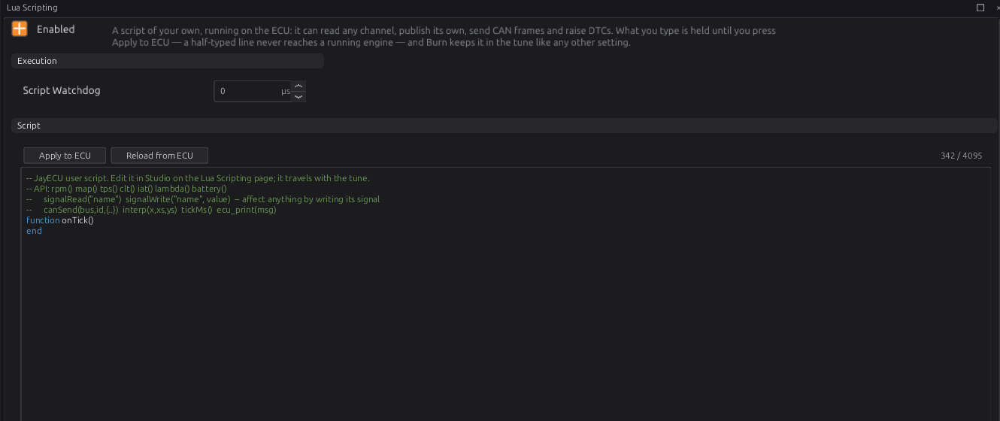

# Lua scripting

:material-circle:{ .level-advanced } Advanced

> **In one sentence:** a Lua script of your own runs on the ECU, reads any channel, writes channels
> of its own or over the ECU's, and can send and receive CAN frames and raise trouble codes.

Use a script for logic the settings and expressions (chapter 34) cannot hold: something with memory
(a latch, a counter, a timer), a CAN device with its own protocol, or a value worked out in several
steps.

## What it does

:material-circle:{ .level-basic } Basic

- The script lives in the tune (up to 4095 characters), so it travels with it and is burned like any
  other setting.
- It runs on its own, lowest-priority task. A slow or broken script can only hold itself up, never
  the engine.
- It affects the ECU **only by writing channels**. There is no "add fuel" function: to change what
  the ECU does, a script writes the channel the ECU reads (chapter 18 outputs, a correction's input,
  one of the eight `lua_gauge_` channels an output or table can use).
  <!-- src: firmware/Scripting/ScriptEngine.h; definition/ecu.schema.yaml (Lua) -->

## How it works

:material-circle:{ .level-intermediate } Intermediate

### 1 · The script's shape

```lua
setTickRate(20)          -- top level: runs once, when the script loads

function onTick()        -- runs over and over, here 20 times a second
end

function onCanRx(bus, id, data)   -- optional: a CAN frame you subscribed to arrived
end
```

- The top level runs once when the script loads. Put setup there: `setTickRate`, `setWatchDog`,
  `canSubscribe`, and your own variables.
- `onTick()` runs every cycle (about 1000 times a second) unless `setTickRate(hz)` slows it.
- `onCanRx` runs for each subscribed CAN frame, before `onTick`.
- Variables at the top level keep their values between ticks. They start over when the script is
  reloaded (below).
  <!-- src: firmware/Scripting/ScriptEngine.cpp -->

The standard Lua `math`, `string` and `table` libraries are there. File access and `require` are
not.

### 2 · The functions

**Reading**

| Function | Gives |
|---|---|
| `signalRead("name")` | a channel's value, or `nil` when it has none |
| `rpm()`, `map()`, `tps()` | engine speed, MAP, throttle — **0** when there is no reading |
| `clt()`, `iat()` | coolant, intake air — **20** when there is no reading |
| `lambda()`, `battery()` | lambda — **1.0**, battery — **12** when there is no reading |
| `getCalibration("name")` | a tune setting's value, or `nil`. The name is the setting's path with `_` for `.`: `"rev_limiter_hard_limit_rpm"` |
| `evalTable("name")`, `evalCurve("name")` | a table or curve read at its own axes, or `nil`: `"generic_tables_table_1"` |
| `interp(x, xs, ys)` | a straight-line lookup in your own lists (up to 32 points) |
| `tickMs()` | milliseconds since the ECU started |

!!! warning "The short readers never say a sensor is missing"
    `clt()` gives 20 with no coolant sensor. For anything that matters, use `signalRead("clt")` and
    check for `nil`.

**Writing**

| Function | Does |
|---|---|
| `signalWrite("name", value)` | sets a channel, **overriding** the ECU's own value, until something replaces it |
| `signalWrite("name", value, ms)` | the same, but it lapses after `ms` milliseconds unless written again |

A script's write outranks everything else that writes the channel — sensors, modules and CAN — for as
long as it lasts. **Always give a time** (a few times your tick period) unless you really mean the
value to stay: then, if the script stops, errors or is switched off, the ECU's own value comes back.
A write with no time stays until the script writes it again, is switched off or is reloaded.
Writing a name the ECU does not have does nothing and prints a message in the ECU console once.
<!-- src: firmware/Scripting/ScriptEngine.cpp; firmware/Signal/SignalBus.h (PRIO_LUA, release_prio) -->

**CAN**

| Function | Does |
|---|---|
| `canSend(bus, id, {b0, b1, …})` | sends one frame now: bus 0 = CAN1, 1 = CAN2; up to 8 bytes. An id above 0x7FF is sent as a 29-bit id |
| `canSubscribe(id [, mask [, bus]])` | top level: deliver matching frames to `onCanRx(bus, id, data)`. `data[1]` is the first byte |

Up to 15 received frames wait between ticks; more than that are dropped.

**Trouble codes**

| Function | Does |
|---|---|
| `setDtc(code [, severity])` | raises a code, written as a number: `0x1F01` is P1F01. It stays until `clearDtc` |
| `clearDtc(code)` | clears it |
| `dtcActive(code)`, `dtcCount()`, `dtcList()` | ask about the codes that are active now |

Codes from a script feed the protection levels like any other (chapter 29). P1Fxx is not used by the
ECU itself, so it is a safe block for your own.

**Other**

| Function | Does |
|---|---|
| `setTickRate(hz)` | how often `onTick` runs |
| `setWatchDog(us)` | this script's time limit per call (overrides **Script Watchdog**); 0 = none |
| `ecu_print("text")` | a line in the ECU console (studio: bottom panel, **ECU Console**) |
  <!-- src: firmware/Scripting/ScriptEngine.cpp -->

### 3 · When it reloads

The script is reloaded — every variable starting over — when you **Apply to ECU** a change, or
change **Script Enabled** or **Script Watchdog**, and each time the ECU starts. Editing any other setting does not reload
it. On a reload, or when the script is switched off, everything it wrote is withdrawn and the ECU's
own values come back.
<!-- src: firmware/Scripting/ScriptEngine.cpp -->

### 4 · Errors and the watchdog

- A **syntax error** stops the script from loading at all. **Lua Script State** `lua_state` is 2 and
  the editor colours the failing line.
- A **runtime error** (for example arithmetic on `nil`) ends that call. The script keeps running on
  the next tick; `lua_state` is 3 and `lua_error_count` counts them.
- **Script Watchdog** (0 = off, the default) stops any single call that runs longer than that many
  microseconds of real time, and reports it as a runtime error. The script shares the processor with
  the engine, so allow for being interrupted: several times the work you expect.
- **Lua Exec Time** `lua_exec_us` shows how long the last `onTick` took.
  <!-- src: firmware/Scripting/ScriptEngine.cpp -->

## Before you start

:material-circle:{ .level-basic } Basic

- Some Lua: variables, `if`, functions, tables. The official "Programming in Lua" is a good start.
- The channel names you need: the Expression window (chapter 34) and the data logger list them.

## Setting it up

:material-circle:{ .level-intermediate } Intermediate

Open **Configuration ▸ Lua Scripting**.



1. Type the script. Typing changes nothing on the ECU yet; the counter at the top right shows how
   much of the 4095 characters you have used.
2. **Apply to ECU** sends it; the ECU loads it at once. **Reload from ECU** throws your edits away
   and shows what the ECU has.
3. Watch `lua_state` (0 is running) and the **ECU Console** for your `ecu_print` lines and errors.
4. **Burn** to keep it.

## Worked examples

:material-circle:{ .level-intermediate } Intermediate

!!! example "Example 1 — boost in psi on a gauge"
    ```lua
    setTickRate(20)
    function onTick()
      local kpa = signalRead("map")
      if kpa then signalWrite("lua_gauge_1", (kpa - 101.3) * 0.145, 200) end
    end
    ```
    With no MAP reading nothing is written, so `lua_gauge_1` lapses after 200 ms rather than showing
    a wrong number.

!!! example "Example 2 — a fan with memory"
    ```lua
    setTickRate(10)
    local fanOn = false
    function onTick()
      local t = signalRead("clt")
      if t == nil then fanOn = true        -- no coolant reading: run the fan
      elseif t > 95 then fanOn = true
      elseif t < 90 then fanOn = false end
      signalWrite("lua_gauge_2", fanOn and 1 or 0, 500)
    end
    ```
    A Generic output with **Turn On When** `lua_gauge_2 > 0` drives the fan relay (chapter 18).

!!! example "Example 3 — reading a CAN device"
    A device sends frame 0x640 with a pressure in bytes 0–1, big endian, in 0.1 kPa:
    ```lua
    canSubscribe(0x640)
    function onCanRx(bus, id, data)
      if #data >= 2 then
        signalWrite("lua_gauge_3", (data[1] * 256 + data[2]) / 10, 500)
      end
    end
    ```
    A frame like this is simpler as a Receive frame (chapter 33). Use a script when the device needs
    logic: a checksum, a counter, or a value spread over several frames.

!!! example "Example 4 — sending engine speed"
    ```lua
    setTickRate(10)
    function onTick()
      local r = math.floor(rpm())
      canSend(0, 0x700, { r // 256, r % 256 })
    end
    ```

!!! example "Example 5 — your own warning"
    ```lua
    setTickRate(5)
    local low = false
    function onTick()
      local p = signalRead("oil_pressure")
      local now = p ~= nil and p < 100 and rpm() > 2000
      if now and not low then setDtc(0x1F01, 2) end
      if low and not now then clearDtc(0x1F01) end
      low = now
    end
    ```
    Raises P1F01 at severity 2 (protection level 2, chapter 29) while oil pressure is low under
    load.

## Tuning it

:material-circle:{ .level-advanced } Advanced

- Run `onTick` only as often as the job needs: 10–20 Hz for gauges and switches.
- Check `lua_exec_us`. If you set a watchdog, set it at several times the highest you see.
- Keep state in top-level `local` variables; build large tables once, at the top level, not every
  tick.

## Diagnostics

:material-circle:{ .level-intermediate } Intermediate

Live channels: `lua_state` (0 running, 1 off, 2 did not load, 3 runtime error), `lua_error_count`,
`lua_error_line`, `lua_exec_us`, `lua_gauge_1` … `lua_gauge_8`. Errors and `ecu_print` lines appear in
the **ECU Console**.

## Troubleshooting

:material-circle:{ .level-basic } Basic → :material-circle:{ .level-advanced } Advanced

| Symptom | Likely causes | Check |
|---|---|---|
| Nothing happens | Not applied or not burned; Script Enabled off; no `onTick` | `lua_state`; Apply to ECU |
| `lua_state` 2 | Syntax error | The coloured line; the ECU Console |
| `lua_state` 3, count climbing | A runtime error every tick — often arithmetic on a `nil` read | The ECU Console; check `signalRead` for `nil` |
| "exceeded its exec budget" | Watchdog shorter than the script needs | `lua_exec_us`; raise it or set 0 |
| A written channel does not change | Name misspelt (the console says so once) | The channel name |
| An override will not go away | Written with no time | Give `signalWrite` a time, or switch the script off |
| Variables start over | The script was reloaded | Section 3 |

## Settings reference

--8<-- "reference/settings/_lua.table.md"

## Related

- [Chapter 18 — Outputs and the pin system](18-outputs.md)
- [Chapter 29 — Engine protection](29-protection.md) (protection levels and codes)
- [Chapter 33 — CAN configuration](33-can-config.md)
- [Chapter 34 — Generic tables and expressions](34-tables-expressions.md)
