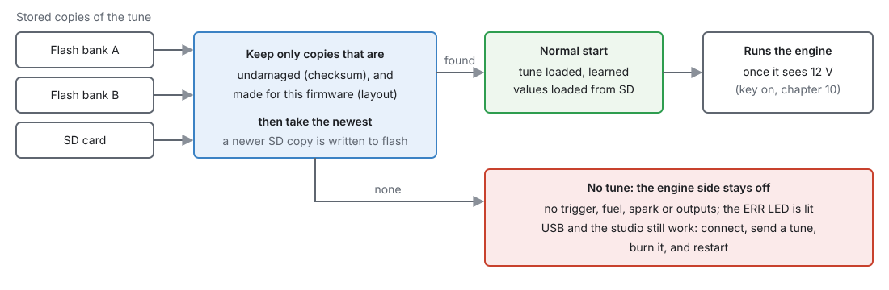

# System settings

:material-circle:{ .level-basic } Basic → :material-circle:{ .level-intermediate } Intermediate

> **In one sentence:** this chapter is about the ECU as a whole — what it does when it powers up, how
> a tune is kept, what burning does to a running engine, and what the SD card is for.

There is no single "System" page: the few settings that apply to the whole ECU live where they are
used, and this chapter points to them.

## What it does

:material-circle:{ .level-basic } Basic

| Topic | Where it is set | Chapter |
|---|---|---|
| Key on and off (from battery voltage) | nothing to set: on above 8 V, off below 7 V | 10 |
| What the car and engine are | **Engine Configuration ▸ Vehicle Identity** (notes only) | 15 |
| The status LEDs | nothing to set | 7 |
| Units (°C or °F, kPa or psi …) | studio **Preferences** — the ECU always works in metric | 4, 49 |
| Logging to the SD card | **Configuration ▸ Datalogging** | 42 |
| Updating firmware | studio | 46 |

## How it works

:material-circle:{ .level-intermediate } Intermediate

### 1 · Start-up and the stored tune

The tune is kept in three places: two banks of the processor's own flash memory, and the SD card.
At power-up the ECU:

1. Throws away any copy that is damaged, or that was made for a different firmware layout.
2. Takes the **newest** of the rest. A newer copy on the SD card is written into flash first.
3. Loads its learned values (fuel trims, idle, knock floor, misfire corrections) from the SD card.
4. Runs the engine once it sees 12 V.

<figure markdown>
  
  <figcaption>Figure 36.1 — What the ECU does with its stored tunes at power-up.</figcaption>
</figure>

**No usable tune** — a new board, or new firmware whose layout differs from the stored tune — and the
ECU starts with its **engine side off**: no trigger, no fuel or spark, no outputs, and the red **ERR**
LED lit. USB and the studio still work, so you can connect, send a tune, burn it and restart. It does
not guess at a tune: an old tune read into a new layout would put values in the wrong places.
<!-- src: firmware/main.cpp; firmware/Storage/StorageManager.h -->

The studio handles a firmware update's layout change for you by converting the tune (chapter 46).

### 2 · Changes, and burning

- A change in the studio goes to the ECU's working memory at once and takes effect straight away.
  It is **not kept** through a power cut until you **Burn**.
- **Burn** stores it. Where it goes depends on the engine:

| Engine | Burn writes | Effect on the engine |
|---|---|---|
| Stopped | the flash | none |
| Running, SD card fitted | the SD card only; flash catches up at the next start | none |
| Running, no SD card | the flash, at once | **the engine stops firing for 1–2 seconds** |

Writing the processor's flash stops it for 1–2 seconds, so the ECU first switches every coil and
injector off safely and drops sync. At idle the engine will probably stall. Burn with the engine
stopped, or fit an SD card.
<!-- src: firmware/Storage/StorageManager.h; firmware/main.cpp -->

Some settings, mainly the trigger's, only take effect with the engine stopped (chapter 16).

### 3 · The SD card

The microSD card is optional, but several things need it:

| On the card | Why |
|---|---|
| `ecucfg.bin` | a copy of the tune; lets a burn while running avoid stopping the engine |
| `learn0.jlt` … `learn2.jlt` | learned values, so they survive a restart (chapter 23) |
| `dtc.bin` | stored trouble codes, so they survive a restart (chapter 44) |
| `LOG0001.MLG` … | on-board logs (chapter 42) |
| the studio's descriptor and layout | so a studio that has never seen this ECU can show its pages (chapter 48) |

<!-- src: firmware (0:/ecucfg.bin, 0:/learn0..2.jlt, 0:/dtc.bin, 0:/LOG%04d.MLG); firmware/Comms/SdProtocol.cpp -->

**Who has the card.** Only one side may use the card at a time:

- **Key on**: the ECU has it.
- **Key off** (USB power only, or battery below 7 V): the ECU finishes and closes every file, then
  hands the card to the computer, where it appears as a USB drive.
- Turning the key on takes it back once the computer has stopped writing to it.

The studio asks for the card when it needs a file (a log, the dashboard) and gives it back after.
<!-- src: firmware/Storage/SdArbitrator.h -->

Without a card the ECU still runs, but learned values and stored codes start afresh at every power-up,
there are no on-board logs, and a burn while running stops the engine.

## Before you start

:material-circle:{ .level-basic } Basic

- A **microSD card** in the board's slot (chapter 7), formatted **FAT32**. The ECU cannot read
  exFAT, which is how cards larger than 32 GB usually arrive: reformat those as FAT32, or use a card of
  32 GB or less.
  <!-- src: firmware/Platform/stm32f7xx/ffconf.h (FF_FS_EXFAT 0) -->

## Setting it up

:material-circle:{ .level-basic } Basic

1. Fit a microSD card.
2. Fill in **Engine Configuration ▸ Vehicle Identity**, so a saved tune says which car it is for.
3. Make changes, then **Burn** with the engine stopped.

## Worked examples

:material-circle:{ .level-intermediate } Intermediate

!!! example "Example 1 — tuning on the road"
    With an SD card, burning while driving is safe: the tune goes to the card at once and into flash
    at the next start.

!!! example "Example 2 — after a firmware update"
    The studio converts the tune to the new layout and sends it (chapter 46). If the ECU starts with
    the red ERR LED lit and no engine functions, it has no tune for this firmware: the studio shows
    **NO TUNE ON THE ECU** and asks what to put on it (chapter 47, section 2). Put a tune on, burn it,
    and press **Reset ECU**.

## Diagnostics

:material-circle:{ .level-intermediate } Intermediate

- **ERR LED lit from power-up, nothing on the engine side:** no usable tune (section 1). The studio
  says so in a red **NO TUNE ON THE ECU** strip above the toolbar, and the `no_tune` channel reads 1.
- `key_on` shows whether the ECU sees 12 V. It works with no tune too: the battery is then read with
  the board's own divider.
  <!-- src: firmware/main.cpp (no_tune_battery_tick); firmware/Comms/CommsManager.cpp (no_tune); apps/studio-jf/main.cpp (NO TUNE strip) -->
- The trouble codes and how to read them are in chapter 44.

## Troubleshooting

:material-circle:{ .level-basic } Basic → :material-circle:{ .level-intermediate } Intermediate

| Symptom | Likely causes | Check |
|---|---|---|
| Changes lost after power-off | Not burned | Burn after changes |
| Engine stumbles or stalls on Burn | Burned while running with no SD card | Fit a card, or burn with the engine stopped |
| Engine side dead, ERR LED on from power-up | No usable tune | Send a tune, burn, restart |
| Learned trims start over every day | No SD card | Fit one |
| Card not seen on the computer | Key on: the ECU has it | Turn the key off |

## Related

- [Chapter 7 — The board](../part2/07-board.md) (LEDs, the SD slot)
- [Chapter 10 — Power and grounds](../part2/10-power-grounds.md) (key states)
- [Chapter 15 — Engine and vehicle basics](15-engine-vehicle.md) (Vehicle Identity)
- [Chapter 46 — Updating firmware](../part6/46-updating-firmware.md)
- [Chapter 48 — Tunes, layouts and backups](../part6/48-files-backups.md)
