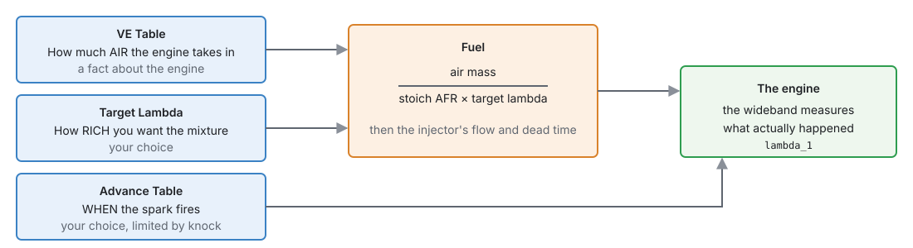
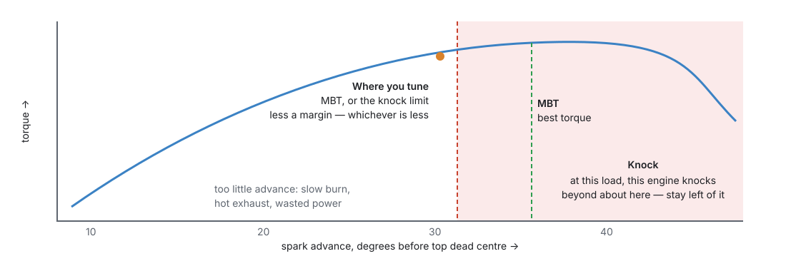
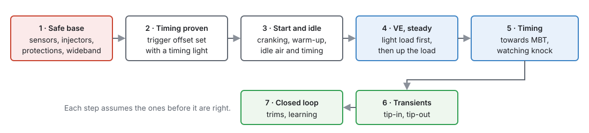

# Tuning principles

:material-circle:{ .level-basic } Basic → :material-circle:{ .level-intermediate } Intermediate

> **In one sentence:** tuning is describing the engine's breathing truthfully (VE), choosing the
> mixture you want (Target Lambda), and firing the spark as early as the engine can use without
> knocking — in that order, one change at a time, with a wideband and a log to tell you the truth.

## Overview

:material-circle:{ .level-basic } Basic

Part III set every module up. This part is about the numbers: how to find the right ones on a real
engine. This chapter is the thinking behind chapters 38 to 42; read it before you start.

!!! danger "An engine can be destroyed in seconds"
    A lean mixture or too much advance under load melts pistons and breaks ring lands before you hear
    anything. Do not load an engine until the safety steps in this chapter are done, and never tune
    alone on a public road.

## Concepts

:material-circle:{ .level-intermediate } Intermediate

### 1 · Three tables, three separate questions

<figure markdown>
  
  <figcaption>Figure 37.1 — Each table answers one question. Keep them separate and each can be tuned
  on its own.</figcaption>
</figure>

This ECU works out fuel from the air, not from a table of injector times (chapter 19):

**fuel = air mass ÷ (stoich AFR × target lambda)**, where air mass comes from the VE Table.
<!-- src: firmware/Engine/Modules/FuelCalculator.cpp -->

That separation is the most useful thing to understand about tuning this ECU:

- The **VE Table** describes a **fact about the engine**: how well it fills its cylinders at each
  speed and load. It is right when the ECU's idea of the air matches the real air. You do not make an
  engine richer by raising VE; you make the VE wrong.
- **Target Lambda** is your **choice** of mixture. Change it and the fuel follows, with the VE Table
  untouched.
- So, when the measured lambda does not match the target, the **VE** is wrong at that point (assuming
  the injector data and sensors are right). Correct the VE, never the target.

The same holds for the injectors: their flow and dead time (chapter 19) must be right first, or every
VE number compensates for injector error and goes wrong again when anything changes.

### 2 · Lambda

**Lambda** is the actual air–fuel ratio divided by the stoichiometric ratio: 1.00 is exactly enough
air to burn all the fuel, below 1 is rich, above 1 is lean. The ECU works in lambda, so the same
numbers serve petrol and ethanol.

Common starting points (check what your engine's builder recommends):

| Condition | Target lambda |
|---|---|
| Idle and light cruise | 1.00 (needed for a catalyst and closed loop) |
| Part load, moderate | 0.95–1.00 |
| Full load, not boosted | 0.86–0.90 |
| Boost | 0.75–0.82, richer with more boost |
| Cold start and warm-up | richer: the warm-up corrections handle it (chapter 19) |

Richer than best power cools the combustion and gives knock margin, which is why boosted engines run
rich. Leaner than 1.00 under load is how engines melt. The ECU keeps targets between 0.5 and 1.5.
<!-- src: firmware/Engine/Modules/FuelCalculator.cpp -->

The measured value is only as good as the wideband: it must be warmed up, reading correctly, and in
the exhaust before any leak (chapter 11).

### 3 · Spark timing

<figure markdown>
  
  <figcaption>Figure 37.2 — More advance gives more torque, up to MBT. At high load the engine often
  knocks before it gets there, and then the knock limit is what you tune to.</figcaption>
</figure>

- Burning takes time, so the spark fires **before** top dead centre to have peak pressure just after
  it. The best point, **MBT** (minimum advance for best torque), moves with speed, load, mixture and
  temperature.
- Past MBT there is no gain, only more cylinder pressure and heat.
- At high load many engines **knock** before they reach MBT. Then the right advance is the knock
  limit less a margin.
- Too little advance is safe for the pistons but not free: the burn is still going when the exhaust
  valve opens, so the exhaust and the turbo run hot.

**Knock control (chapter 30) is a safety net, not a tuning tool.** A tune that relies on knock retard
to be safe is too advanced.

The ECU adds corrections to the Advance Table and takes retards off (chapter 20). The **Timing
Breakdown** page shows each part live, so you can see which one you are looking at.

<figure markdown>
  
  <figcaption>Figure 37.3 — Timing Breakdown. Every part of the advance, live.</figcaption>
</figure>

### 4 · One change at a time, and log it

- Change **one** thing, then measure. Two changes at once cannot be told apart.
- **Steady state before transients.** Tune a cell while the engine sits in it; tip-in and tip-out fuel
  (chapter 19) come after, because they are measured against a correct steady-state base.
- **Log everything** (chapter 42) and read the log, not the gauge. A reading is only good once the
  engine has settled in the cell and the wideband has caught up with it.
- The **Fuel Breakdown** page shows every part of the fuel calculation for the current moment: use
  it to see what the ECU believes before blaming the table.

<figure markdown>
  { width="870" }
  <figcaption>Figure 37.4 — Fuel Breakdown. What the ECU believes, before you blame a table.</figcaption>
</figure>

### 5 · Closed loop hides errors

Closed-loop lambda (chapter 23) moves the fuel until the wideband reads the target, which is what you
want on the road and exactly what you do not want while tuning VE: the error you are looking for has
already been corrected. Tune VE with closed loop off, or read the trims as the VE error — which is
what the Auto Tune does (chapter 40).

## Procedure

:material-circle:{ .level-basic } Basic

<figure markdown>
  
  <figcaption>Figure 37.5 — The order to tune in. Each step assumes the ones before it are right.</figcaption>
</figure>

1. **Safe base.** Sensors calibrated and reading (chapter 17), injector data entered (chapter 19),
   a wideband working, and the protections switched on (chapter 29) — the protection levels are off
   in a new tune. Set a low rev limit (chapter 27) and, on a turbo engine, a low boost target
   (chapter 24).
2. **Timing proven.** Set the trigger offset with a timing light, and check the timing does not move
   with engine speed (chapter 16).
3. **Start and idle.** Cranking fuel and advance, warm-up, and idle (chapters 19, 20 and 21).
4. **VE at steady state.** Light load first, then build up the load (chapter 38), with closed loop
   off.
5. **Timing.** Towards MBT, or the knock limit less a margin (chapter 39), with knock monitoring
   (chapters 30 and 41).
6. **Transients.** Tip-in and tip-out fuel (chapter 38).
7. **Closed loop.** Switch closed loop on and let it learn (chapters 23 and 40).

## Examples

:material-circle:{ .level-intermediate } Intermediate

!!! example "Example 1 — lean at 4000 RPM, 80 kPa"
    Target 0.95, measured 1.02. The mixture has 7 % too little fuel, so the ECU thinks there is 7 %
    less air than there really is: raise that VE cell by about 7 % (1.02 ÷ 0.95 = 1.074). The target
    stays 0.95.

!!! example "Example 2 — richer at full load"
    The engine runs well at 0.88 but you want margin on a hot day. Change Target Lambda to 0.85 in the
    full-load cells. The VE Table is not touched: the ECU adds the fuel itself.

!!! example "Example 3 — adding advance"
    At 3000 RPM and 100 kPa the cell has 24°. Two degrees more gives more torque on the dyno; two more
    gives no more torque. Stay at 26° (MBT), even though the engine did not knock at 28°.

## Pitfalls and troubleshooting

:material-circle:{ .level-basic } Basic → :material-circle:{ .level-advanced } Advanced

| Pitfall | Why it hurts | Instead |
|---|---|---|
| Richening by raising VE | The VE is now wrong; every other table built on it is too | Change Target Lambda |
| Tuning VE with closed loop on | The trim hides the error | Closed loop off, or read the trims (chapter 40) |
| Tuning before injector data is right | VE absorbs injector error and is wrong at every other voltage and pressure | Injector flow and dead time first |
| Tuning on a cold engine | Warm-up corrections are adding fuel | Tune VE warm; tune warm-up separately |
| Trusting the gauge during a change | The wideband lags and the engine has not settled | Wait, then read the log |
| Relying on knock retard | A knock event has already happened | Tune to the knock limit less a margin |
| Loading the engine with protections off | Nothing reacts to a fault | Enable them first (chapter 29) |

## Related

- [Chapter 19 — Fuel](../part3/19-fuel.md)
- [Chapter 20 — Ignition](../part3/20-ignition.md)
- [Chapter 23 — Closed-loop lambda](../part3/23-lambda.md)
- [Chapter 29 — Engine protection](../part3/29-protection.md)
- [Chapter 38 — Tuning fuel](38-tuning-fuel.md)
- [Chapter 39 — Tuning ignition](39-tuning-ignition.md)
