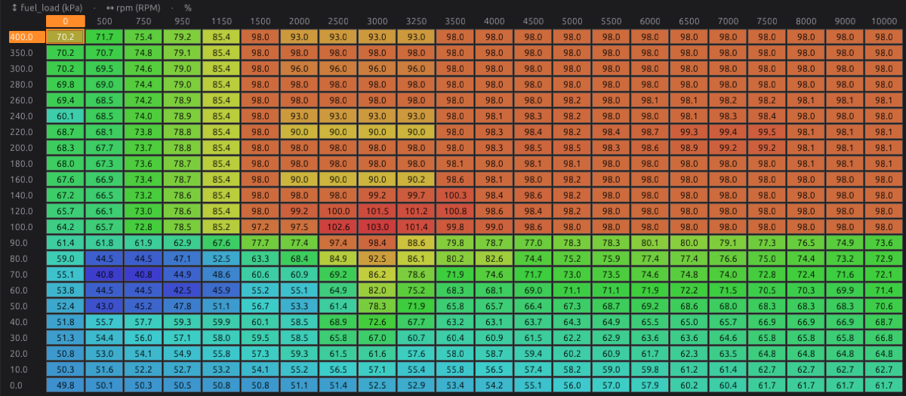
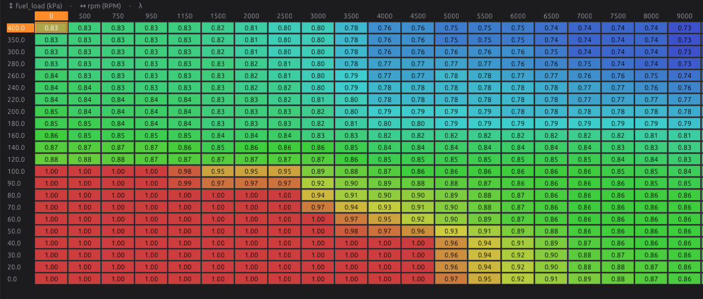
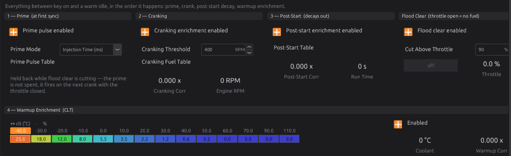
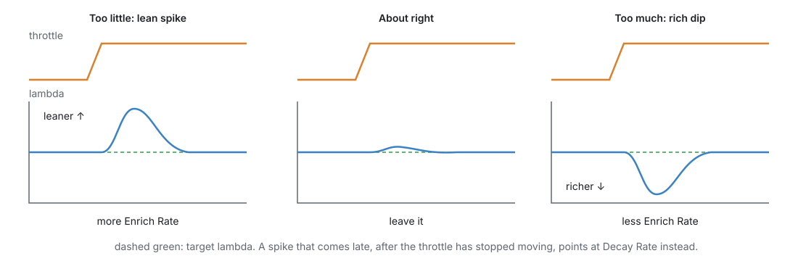
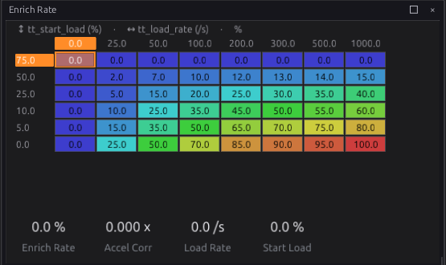

# Tuning fuel

:material-circle:{ .level-intermediate } Intermediate → :material-circle:{ .level-advanced } Advanced

> **In one sentence:** with the engine warm and closed loop off, hold it in each part of the VE Table,
> compare the wideband with the target, and correct the VE by the ratio between them — then tune
> starting, warm-up and throttle movement against that correct base.

Read chapter 37 first. Chapter 19 sets the fuel system up; this chapter finds the numbers. Chapter
40 does the VE part automatically once you trust the basics.

## Overview

:material-circle:{ .level-basic } Basic

Fuel is tuned in this order:

1. **Injector data** — flow and dead time. Everything else rests on it.
2. **VE**, at steady state, light load first.
3. **Target Lambda**, if the defaults do not suit the engine.
4. **Starting and warm-up.**
5. **Transients** — throttle opening and closing.

## Concepts

:material-circle:{ .level-intermediate } Intermediate

### 1 · The correction is a ratio

With the injector data right, a difference between measured and target lambda is a VE error, and the
size of the error is the ratio between them:

**new VE = old VE × measured lambda ÷ target lambda**

Measured 1.02 against a target of 0.95 is 1.02 ÷ 0.95 = 1.074: the cell needs 7.4 % more. Measured
0.90 against 0.95 is 0.947: 5.3 % less. The ratio holds at every load, which is why the VE Table can
be tuned one area at a time.
<!-- src: firmware/Engine/Modules/FuelCalculator.cpp (fuel mass = air mass / (stoich x lambda target)) -->

### 2 · The table editor

<figure markdown>
  
  <figcaption>Figure 38.1 — The VE Table. The live cursor shows the cell in use.</figcaption>
</figure>

In the studio, on any table:

| To | Do |
|---|---|
| Select a cell | click it |
| Select a block | drag, or Shift+arrow keys to grow it, Ctrl+arrow keys to shrink it |
| Set every selected cell | type a number and press Enter |
| Step the selection up or down | `.` and `,` (one step); Shift+`.` and Shift+`,` (ten steps) |
| Scale by a percentage | right-click ▸ **Edit Values** ▸ **Percentage change…**, type it, Enter — `7.4` adds 7.4 %, `-5.3` takes 5.3 % off |
| Add or take away an amount | **Edit Values** ▸ **Increase by…** / **Decrease by…** |
| Straighten a row, column or block | **Edit Values** ▸ **Linearise** |
| Soften bumps | **Edit Values** ▸ **Smooth** |
| Undo | Edit ▸ Undo (each operation is one step) |

The keys can be changed from the table's right-click menu (**Key Bindings…**). Changes go to the ECU
at once; burn to keep them (chapter 36).
<!-- src: apps/studio-jf/src/surface/Surface.cpp; apps/studio-jf/src/surface/widgets/TableWidget.cpp; apps/studio-jf/src/model/Keymap.h -->

### 3 · Steady state

A reading means something only when the engine has sat in one cell long enough for the fuel film,
the manifold and the wideband to settle: a second or two at least, more at low speed. Readings taken
while the throttle moves belong to the transient corrections, not the VE.

On a dyno, hold each speed and load. On the road, a steady cruise, a steady climb, or a slow roll-on
in a high gear gives usable steady readings; watch the live cursor and read the log afterwards.

## Procedure

:material-circle:{ .level-intermediate } Intermediate

### Step 1 — Before you start

1. Everything in chapter 37's safe base: sensors, injector data, wideband, protections, a low rev
   limit.
2. **Closed loop off**: **Fuel Tuning ▸ O2 Control**, untick **Enabled** at the top (chapter 23).
3. Engine at full temperature, so the warm-up correction is 1.000 (check on **Fuel Breakdown**).
4. Start a log (chapter 42) with at least `rpm`, `fuel_load`, `lambda_1`, `lambda_target`, `ve`,
   `clt` and `tps`.

### Step 2 — Check the injector dead time

At a warm idle, note the lambda. Then switch on a heavy electrical load (headlights, fan, rear
screen) so the battery voltage drops by half a volt or more, or off again so it rises.

- **Lambda does not move**: the dead time is right.
- **Leaner at lower voltage**: the ECU underestimates the dead time at low voltage — raise the
  **Dead Time** cells at that voltage (chapter 19).
- **Richer at lower voltage**: lower them.

Get this right before touching VE: a dead-time error looks like a VE error that changes with voltage
and pulse length, and no VE Table can correct it.

### Step 3 — Idle and light load

1. Let the engine idle warm. Read measured and target lambda for the cells the cursor sits in.
2. Select those cells, **Percentage change…**, and enter the correction:
   (measured ÷ target − 1) × 100.
3. Repeat on light cruise cells: 1500–3000 RPM, 30–60 kPa.
4. Blend the cells you have not visited towards the ones you have: select a row or column and
   **Linearise**.

### Step 4 — Build up the load

1. Work up in load a band at a time: part throttle, then more, then full load in short pulls.
2. Correct each cell you hold, as in Step 3.
3. **Full-load pulls** are not steady state, but the mixture should still sit at the target through
   the pull. A cell that reads lean gets fuel **before** the next pull.
4. On a turbo engine, raise the boost target a step at a time (chapter 24), tuning each step before
   the next.

!!! danger "Lean under load"
    Stop the pull the moment lambda goes leaner than the target by more than a few percent. Add fuel
    to those cells before trying again. Keep **Lambda Protection** switched on (chapter 29).

### Step 5 — Target Lambda

The default **Target Lambda** table is 1.00 at light load and richer at full load and in boost
(chapter 19). Change it where your engine wants something else — the VE Table stays as it is (chapter
37).

<figure markdown>
  
  <figcaption>Figure 38.2 — Target Lambda.</figcaption>
</figure>

### Step 6 — Starting and warm-up

Tune these from cold starts on different days: a cold engine only happens once a day.

1. **Cranking**: **Fuel Tuning ▸ Cranking** — the enrichment against coolant temperature. Floods,
   or starts only with the throttle opened: less. Cranks a long time before catching, or catches and
   dies: more.
2. **Post-start**: on **Start & Warmup** — the extra fuel for the first seconds after starting. A
   stumble just after catching usually wants more.
3. **Warm-up**: the **Warmup Enrichment** table against coolant. Drive while warming up and watch
   lambda against the target: lean at a temperature wants more enrichment there, rich wants less.

<figure markdown>
  
  <figcaption>Figure 38.3 — Start & Warmup.</figcaption>
</figure>

Keep closed loop off while tuning warm-up, or it corrects the error you are trying to see.

### Step 7 — Throttle movement

<figure markdown>
  
  <figcaption>Figure 38.4 — Reading a tip-in on a log.</figcaption>
</figure>

With Transient Throttle (chapter 19):

1. Log at a high rate (chapter 42) and make sharp throttle openings from steady light load.
2. **Lean spike** just after the throttle opens: raise **Enrich Rate** at that start load and load
   rate. **Rich dip**: lower it.
3. Lean **late**, after the throttle has stopped: the enrichment dies away too soon — slow the
   **Transient Enrich Decay Rate**.
4. Close the throttle sharply: a **rich** spike on tip-out wants more disenrichment (**Enable
   Disenrich**, **Transient Disenrich Rate** and **Transient Disenrich Amount**).
5. Repeat when cold: **Transient CLT Correction** scales the whole thing by coolant temperature.

<figure markdown>
  { width="555" }
  <figcaption>Figure 38.5 — Enrich Rate.</figcaption>
</figure>

### Step 8 — Hand over to closed loop

Tick **Enabled** on **O2 Control** again and, if you use it, **Long-Term Trim** (chapter 23). Small
trims (a few percent) are normal; large or one-sided trims in an area mean the VE is still wrong
there. Chapter 40 turns trims into VE corrections.

## Examples

:material-circle:{ .level-intermediate } Intermediate

!!! example "Example 1 — a row of light-load cells"
    At 2000–3000 RPM and 40 kPa, target 1.00, the log shows 1.06, 1.05 and 1.04. Correct each:
    +6 %, +5 %, +4 %. Then Linearise the row between the corrected cells and the idle cells.

!!! example "Example 2 — rich everywhere by the same amount"
    Every warm cell reads about 0.93 against 1.00. That is not the VE, it is something global: check
    injector flow rate, fuel pressure, **Fuel Specific Gravity**, and displacement before scaling the
    whole VE Table.

!!! example "Example 3 — lean only on hot days"
    The mixture is right in the morning and lean in the afternoon, with intake air 20 °C hotter. The
    VE is not temperature-dependent; the air density calculation is. Check the intake air sensor is
    reading the charge, not the engine bay, and look at **Charge Temp IAT Weight** (chapter 19).

## Pitfalls and troubleshooting

:material-circle:{ .level-basic } Basic → :material-circle:{ .level-advanced } Advanced

| Symptom | Likely causes | Check |
|---|---|---|
| Corrections never settle | Closed loop still on; readings taken while moving | O2 Control Enabled; steady state |
| A cell is right one day, wrong the next | Warm-up still active; a different fuel; a sensor drifting | `clt`; Fuel Breakdown |
| Error changes with battery voltage | Dead time | Step 2 |
| Error only at small pulses (idle, overrun) | Dead time or the short-pulse adder | Chapter 19 |
| Same error everywhere | Injector flow, fuel pressure, density or displacement | Example 2 |
| Lean spike on every tip-in | Enrich Rate too low | Step 7 |
| Rough table with steps | Cells tuned alone | Linearise, Smooth |

## Related

- [Chapter 19 — Fuel](../part3/19-fuel.md)
- [Chapter 23 — Closed-loop lambda](../part3/23-lambda.md)
- [Chapter 37 — Tuning principles](37-principles.md)
- [Chapter 40 — Auto tune](40-auto-tune.md)
- [Chapter 42 — Datalogging and analysis](42-datalogging.md)
