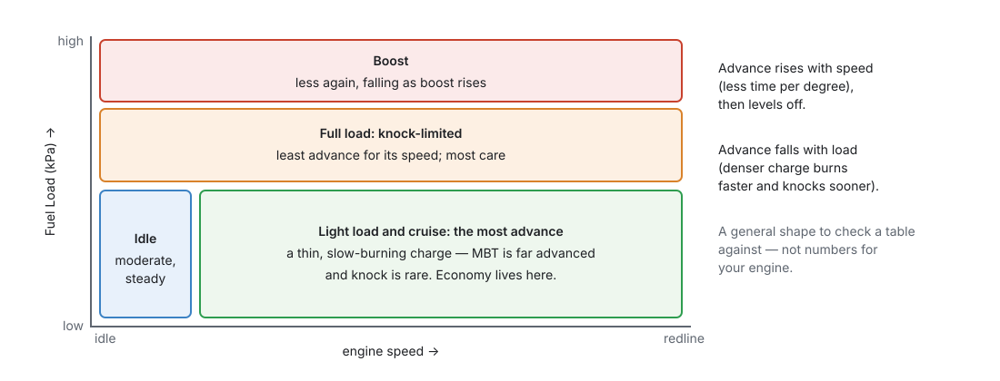

# Tuning ignition

:material-circle:{ .level-intermediate } Intermediate → :material-circle:{ .level-advanced } Advanced

> **In one sentence:** with the fuel right and knock detection working, bring each area of the Advance
> Table up towards the point where more advance stops adding torque — or, where the engine knocks
> first, to just short of the knock — and let the corrections handle heat and cold.

Read chapter 37 first. Chapter 20 sets ignition up; chapter 30 sets knock detection up and chapter 41
tunes it. This chapter finds the numbers in the Advance Table.

## Overview

:material-circle:{ .level-basic } Basic

!!! danger "Too much advance breaks engines"
    Knock at high load cracks pistons and ring lands, sometimes within seconds, often without a sound
    you can hear over the engine. Add advance in small steps, one area at a time, listening and
    logging.

1. **Base timing proven** with a timing light (chapter 16).
2. **Fuel right** (chapter 38): a lean cell knocks sooner and hides the real limit.
3. **Knock detection working** and its noise floor learned (chapter 30).
4. Then the **Advance Table**, light load first.
5. Then the **corrections**: coolant and intake air temperature.

## Concepts

:material-circle:{ .level-intermediate } Intermediate

### 1 · The shape of a timing map

<figure markdown>
  
  <figcaption>Figure 39.1 — The general shape. Use it to spot a cell that is out of place, not as
  numbers for your engine.</figcaption>
</figure>

- **More speed, more advance**: the burn takes about the same time, so at higher speed it needs to
  start earlier in degrees. It levels off once turbulence speeds the burn up.
- **More load, less advance**: a denser charge burns faster and knocks sooner.
- The Advance Table is read against engine speed and **Fuel Load** — manifold pressure on a
  speed-density engine (chapter 20).
  <!-- src: definition/ecu.schema.yaml (ignition.ign_table x_channel rpm, y_channel fuel_load) -->

### 2 · MBT or the knock limit

From chapter 37: the right advance is **MBT** (more gives no more torque) or, where the engine knocks
first, the **knock limit less a margin** — whichever is lower. Light load is almost always MBT; full
load on pump fuel is usually knock-limited.

Finding MBT needs a torque measurement:

- **Dyno**: hold the speed and load, add a degree at a time; when torque stops rising, you are at MBT.
- **Road**: the same pull in the same gear from the same speed. Log `rpm` and compare how quickly it
  rises between two speeds with each change. Less exact, and the road, the wind and the temperature
  must be the same each time.

Finding the knock limit needs knock detection (chapter 30) and, ideally, ears: the knock audio jack
**CN1** lets you listen to the sensor with headphones (chapter 7).

### 3 · What the ECU adds and takes away

The Advance Table is the base; corrections are added and retards subtracted (chapter 20). While
tuning the base:

- The engine must be **warm** and the intake air normal, so the coolant and air temperature
  corrections are near zero.
- **Knock retard** (`knock_retard`) must be **zero** in the cells you are judging. A cell that only
  runs because knock control is pulling timing out is too advanced.
- **Timing Breakdown** shows every part live.

<figure markdown>
  
  <figcaption>Figure 39.2 — Timing Breakdown. Check the corrections and retards are where you think
  before judging a cell.</figcaption>
</figure>

## Procedure

:material-circle:{ .level-intermediate } Intermediate

### Step 1 — Before you start

1. Chapter 37's safe base, and fuel tuned (chapter 38).
2. **Knock Control** on, with the noise floor learned in the area you will tune (chapter 30).
3. Good fuel, of the grade the engine will always run on.
4. A log (chapter 42) with `rpm`, `fuel_load`, `advance`, `ign_base_adv`, `knock_retard`,
   `knock_level`, `lambda_1` and `clt`.
5. **Max Advance** (chapter 20) set just above the most advance you intend to use anywhere.

### Step 2 — Check the table before loading the engine

Go through every cell you can reach. None should be more advanced than you are sure is safe for this
engine at that load. Where in doubt, take it out: the shipped table is a generic shape (chapter 20).

<figure markdown>
  
  <figcaption>Figure 39.3 — The Advance Table.</figcaption>
</figure>

### Step 3 — Idle

Set idle timing for a steady idle, not for the most advance. Idle speed control can move the timing
around it to hold the speed (chapter 21), so leave it room both ways. A few degrees each side of the
idle cells should be similar, so the engine does not jump when it moves between them.

### Step 4 — Light load and cruise

1. Hold a cell (steady speed, steady load).
2. Add 1–2°. Watch torque (dyno) or pull-time (road), and `knock_retard`.
3. Keep going while torque rises; stop when it does not. Take off 1°.
4. Blend neighbouring cells: **Edit Values ▸ Linearise** and **Smooth** (chapter 38).

### Step 5 — Full load and boost

1. Start from a safe, retarded number.
2. Add 1° at a time, one pull per change, reading the log after each pull.
3. The first sign of knock (a `knock_level` rise, a knock event, or a sound in the headphones) is the
   limit. Take off 2–3° as a margin, more on a boosted engine.
4. If torque stops rising before any knock, that is MBT: stop there.
5. On a turbo engine, tune each boost step before raising the boost (chapter 24).

### Step 6 — Corrections

- **Air Temp** (Corrections ▸ Air Temp): pull timing as the intake heats — hot air knocks sooner.
  Tune it on a hot day, or after heat-soak, by finding the knock limit again at high intake
  temperature.
- **Coolant**: the shipped table retards a little when cold. Add retard at the hot end if the engine
  knocks when it runs hot.
- **Transient**: Transient Throttle can pull timing briefly on a sharp tip-in (chapter 19) if the
  engine knocks only then.

### Step 7 — Check and keep watching

Drive normally and log. `knock_retard` should stay at or near zero. Repeated retard in one area means
that area is too advanced, or the knock threshold there too low (chapter 41).

## Examples

:material-circle:{ .level-intermediate } Intermediate

!!! example "Example 1 — a cruise cell on the dyno"
    3000 RPM, 50 kPa, 32° in the cell. 34° gives 2 % more torque, 36° gives 0.5 % more, 38° gives
    nothing. MBT is about 36–37°: set 36°, with no knock anywhere near.

!!! example "Example 2 — knock-limited at full load"
    4500 RPM, 100 kPa. Torque still rises at 26°, but `knock_level` jumps and knock is heard at 27°.
    Set 24° (the limit less 3°). Log the next pulls: `knock_retard` stays at 0.

!!! example "Example 3 — knock on hot days only"
    The same pull knocks at 50 °C intake but not at 25 °C. The Advance Table is right; the **Air Temp**
    correction needs more retard above 40 °C.

## Pitfalls and troubleshooting

:material-circle:{ .level-basic } Basic → :material-circle:{ .level-advanced } Advanced

| Symptom | Likely causes | Check |
|---|---|---|
| Timing light disagrees with `advance` | Trigger offset wrong, or the light reads wasted spark | Chapter 16 |
| Knock retard in one area | Too much advance there; mixture lean there | `lambda_1`; take timing out |
| Knock retard everywhere at once | Threshold too low, or a noisy sensor | Chapter 41 |
| No gain from any advance | Already at MBT | Stop adding |
| Engine surges at cruise | Neighbouring cells very different | Smooth the table |
| Idle hunts | Idle cells too different from their neighbours | Step 3 |
| Timing not what the table says | A correction or retard is active | Timing Breakdown |

## Related

- [Chapter 16 — The trigger system](../part3/16-trigger.md) (base timing)
- [Chapter 20 — Ignition](../part3/20-ignition.md)
- [Chapter 30 — Knock](../part3/30-knock.md)
- [Chapter 37 — Tuning principles](37-principles.md)
- [Chapter 41 — Knock tuning](41-knock-tuning.md)
