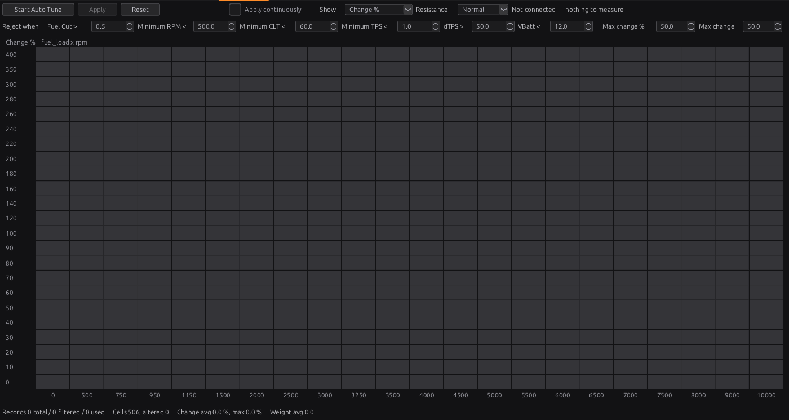

# Auto tune

:material-circle:{ .level-intermediate } Intermediate

> **In one sentence:** Auto Tune watches the wideband while you drive, works out how wrong each VE
> cell is, and proposes a corrected VE table that you choose to apply — the same correction chapter 38
> does by hand, done over thousands of readings.

## Overview

:material-circle:{ .level-basic } Basic

There are two ways to let the wideband tune the VE Table:

| | **Auto Tune** (studio) | **Long-term trim** (ECU) |
|---|---|---|
| Where it runs | the studio, while connected | the ECU, all the time |
| What it makes | a proposal you look at and apply | a learned table the ECU uses at once |
| Into the VE Table by | **Apply** | **Apply to Base Table** |
| Best for | tuning sessions: a big, fast correction you check first | keeping a finished tune right: small drift, fuel changes |
| Chapter | this one | 23 |

Both work on the VE Table's own cells, and both come to the same answer: the ratio between measured and
target lambda (chapter 38). Use Auto Tune while tuning, then long-term trim to keep it there.

Auto Tune needs a live connection: it reads the ECU's channels as they arrive, not a recorded log.
<!-- src: docs/fuel-autotune-design.md ("Not built: offline log replay"); apps/studio-jf/src/model/Autotune.h -->

!!! warning "It trusts the wideband and the injector data"
    Auto Tune can only be as right as its inputs. A wideband that reads wrong, an exhaust leak, or wrong
    injector dead time are copied faithfully into the VE Table. Check chapter 38's Step 2 (dead time)
    first.

## Concepts

:material-circle:{ .level-intermediate } Intermediate

<figure markdown>
  
  <figcaption>Figure 40.1 — From a wideband reading to a proposed change.</figcaption>
</figure>

### 1 · What it measures

For every reading the error of the table is **measured lambda ÷ target lambda**, multiplied by the
fuel trims the ECU was applying at that moment (`fuel_corr_stft`, `fuel_corr_ltft`). So the answer is
the VE Table's own error **whether closed loop is on or not**: a loop adding 5 % to hit the target
still means the table is 5 % short.
<!-- src: apps/studio-jf/src/model/Autotune.h; definition/ecu.schema.yaml (autotune: ego_channels) -->

### 2 · The delay

The wideband reads gas that left the cylinder some tens to hundreds of milliseconds earlier — longer
at idle, shorter at high speed and load. Auto Tune remembers where the engine has been and credits
each reading to where the gas was **made**, using the ECU's own **LTFT delay table** (the same one the
long-term trim uses, chapter 23). Without this, every correction during a pull would land in the cell
after the one that earned it.
<!-- src: apps/studio-jf/src/model/Autotune.h; definition/ecu.schema.yaml (autotune: delay lambda.ltft_delay_table) -->

### 3 · Filters

A reading is **rejected** when, at the moment its gas was made:

| Filter | Default | Why |
|---|---|---|
| **Fuel Cut >** | 0.5 | no fuel was being delivered |
| **Minimum RPM <** | 500 | cranking |
| **Minimum CLT <** | 60 °C | warm-up enrichment is adding fuel |
| **Minimum TPS <** | 1 % | closed throttle — overrun, **and idle** |
| **dTPS >** | 50 %/s | a tip-in, which belongs to transient fuel |
| **VBatt <** | 12 V | injector dead time is off at low voltage |

Every value can be changed on the panel and is remembered. The comparison is shown beside each box.
With the defaults, **idle is not tuned**: the throttle is closed. Tune idle by hand (chapter 38), or
lower **Minimum TPS** below your idle throttle reading if the idle is steady and fuel cut is off.
<!-- src: definition/ecu.schema.yaml; apps/studio-jf/src/ui/AutotunePanel.cpp -->

### 4 · Weight, resistance and limits

- A reading between cells is **shared** over the four cells around it, in the proportions the table
  itself interpolates — each reading is worth a total weight of 1.
- A cell only moves the **whole** way once it has enough weight: **Resistance** sets how much —
  **Easy** 1, **Normal** 4, **Hard** 12. Below that its change is scaled down, so one stray reading
  nudges rather than rewrites.
- **Max change %** (default 50 % of the cell) and **Max change** (default 50 VE points) limit any one
  cell. Whichever is smaller wins.
- Changing a filter or limit mid-run re-works the whole proposal from the readings already collected.
  <!-- src: apps/studio-jf/src/model/Autotune.h; apps/studio-jf/src/model/Autotune.cpp; apps/studio-jf/src/ui/AutotunePanel.cpp -->

## Procedure

:material-circle:{ .level-intermediate } Intermediate

Open **Tools ▸ Auto Tune** with the ECU connected.

<figure markdown>
  
  <figcaption>Figure 40.2 — Auto Tune, before a run. The grid uses the VE Table's own axes.</figcaption>
</figure>

1. **Warm the engine** and check the injector dead time (chapter 38, Step 2).
2. Set the filters for your engine (section 3) and choose a **Resistance** — Normal to start.
3. Optionally press **Open Loop** to switch the ECU's trims off while you tune; it becomes
   **Restore Trims** to put them back. Not required (section 1), but it keeps the engine's behaviour
   the same as what you are measuring.
4. Press **Start Auto Tune** and drive, spending time in the areas you want tuned. Steady driving
   gives better readings than constant throttle changes.
5. Watch the grid. **Show** switches it between **Change %** (the proposal), **Proposed VE**,
   **Base VE** and **Records** (how much evidence each cell has). The line underneath counts the
   readings (total / filtered / used), the cells altered, and the average and largest change.
6. Press **Stop**, look over the proposal, and press **Apply**. The VE Table is changed in one step
   (Edit ▸ Undo takes it back) and the collected readings are cleared: they were measured against the
   old table.
7. Drive again to check, repeat, then **Burn**.

**Apply continuously** applies the proposal every 2 seconds while recording, so the table converges
as you drive. It changes the tune as you go: use it only once you trust the setup. **Reset** throws
the readings away without changing anything.
<!-- src: apps/studio-jf/src/ui/AutotunePanel.cpp -->

If the VE Table's axes are changed, or a flex-fuel engine moves to another ethanol plane, while a
proposal exists, the proposal is thrown away rather than written to the wrong cells.

## Examples

:material-circle:{ .level-intermediate } Intermediate

!!! example "Example 1 — a first road session"
    Resistance Normal, filters default. Twenty minutes of mixed driving. The Records view shows the
    cruise area well filled and full load thin. Apply, drive the same route again: the second pass
    changes most cells by less than 2 %. Tune full load in short pulls, by hand or with Auto Tune
    running, before trusting that area.

!!! example "Example 2 — a dyno with no coolant sensor fitted"
    Nothing is recorded: every reading fails **Minimum CLT**. Lower it for the session (the change is
    remembered, so set it back afterwards).

!!! example "Example 3 — nothing changes at idle"
    Expected with the defaults: **Minimum TPS** rejects a closed throttle. Tune idle by hand.

## Pitfalls and troubleshooting

:material-circle:{ .level-basic } Basic → :material-circle:{ .level-advanced } Advanced

| Symptom | Likely causes | Check |
|---|---|---|
| "Not connected — nothing to measure" | No live ECU | Connect |
| Records counted but none used | A filter rejects everything | The filters; the channels they read (`clt`, `battery`) |
| Proposal changes every cell the same way | Something global is wrong: injector flow, fuel pressure, the wideband | Chapter 38, Example 2 |
| Big changes that disappear on the next pass | Too little evidence; Resistance Easy | Normal or Hard; more driving |
| Idle never tuned | Minimum TPS | Section 3 |
| Proposal discarded | VE axes changed, or the ethanol plane changed | Start again |
| Mixture right but trims large | Trims still learning or the table changed since | Run Auto Tune, or Apply to Base Table (chapter 23) |

## Related

- [Chapter 23 — Closed-loop lambda](../part3/23-lambda.md) (long-term trim, Apply to Base Table)
- [Chapter 37 — Tuning principles](37-principles.md)
- [Chapter 38 — Tuning fuel](38-tuning-fuel.md)
- [Chapter 42 — Datalogging and analysis](42-datalogging.md)
