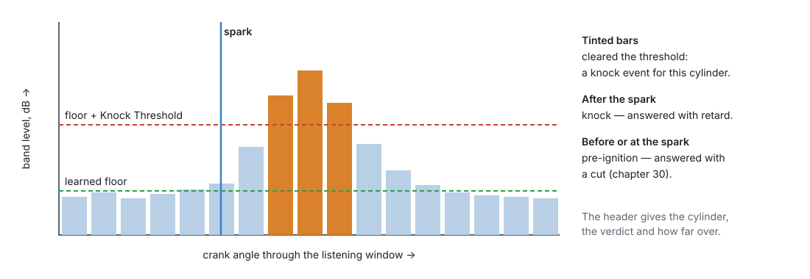

# Knock tuning

:material-circle:{ .level-advanced } Advanced

> **In one sentence:** let each cylinder learn what it sounds like when clean, then set the Knock
> Threshold just above the loudest clean running and below real knock — checking both with the Knock
> Scope and your ears.

Chapter 30 sets knock control up. This chapter makes it trustworthy: an engine that retards for
nothing loses power; one that does not hear real knock is not protected.

## Overview

:material-circle:{ .level-basic } Basic

1. **Listen in the right place:** window and frequency (chapter 30).
2. **Learn the floor:** drive clean through the range.
3. **Set the threshold:** above clean noise, below knock.
4. **Check the response:** retard step, recovery, maximum.
5. **Keep watching** `knock_retard` in normal driving.

## Concepts

:material-circle:{ .level-intermediate } Intermediate

### 1 · What is judged

For each firing, the ECU measures the sensor's level in the knock band, in dB, and subtracts what
**that cylinder normally sounds like** at that speed and load (its learned noise floor). What is
left is the **intensity**. Above the **Knock Threshold** (default 12 dB) it is a knock event
(chapter 30).
<!-- src: firmware/Engine/Modules/Knock.cpp -->

So the threshold is not a loudness. It is "this much louder than normal for here". A good floor makes
one threshold work across most of the map; the table lets you raise it where the engine is naturally
noisy.

### 2 · The Knock Scope

**Tools ▸ Knock Scope** (with a jayecu ECU connected) draws one measurement with its evidence:

<figure markdown>
  
  <figcaption>Figure 41.1 — What the Knock Scope shows. Energy after the spark is knock; energy at or
  before it is pre-ignition.</figcaption>
</figure>

- The bars are the band level through the listening window, in crank degrees before TDC (+ before,
  − after, like spark advance).
- The green line is this cylinder's learned floor here; the red line is the floor plus the threshold.
- The blue line is the spark. The same bars are knock after it and pre-ignition before it.
- The scope alternates between the **latest** measurement (so you can see it is live) and the **last
  event** that was judged knock or pre-ignition (so a rare event stays on screen to be read). The
  header gives the cylinder, the verdict and how far over the threshold it was.
  <!-- src: apps/studio-jf/src/ui/KnockScopeView.h; apps/studio-jf/main.cpp -->

It updates ten times a second: fast enough to watch, not every firing. For the whole picture, log.

### 3 · What to log

| Channel | Is |
|---|---|
| `knock_level` | the loudest recent measurement, dB, before the floor is taken off; falls back at 20 dB/s |
| `knock_1`, `knock_2` | each sensor's level |
| `knock_count` | knock events so far |
| `knock_retard` | the largest cylinder retard now |
| `rpm`, `fuel_load`, `advance` | where the engine was |

<!-- src: firmware/Engine/Modules/Knock.cpp; firmware/Engine/Modules/KnockDetector.cpp -->

A `knock_count` that climbs, or any `knock_retard`, is the thing to look for; `knock_level` rising
with RPM is normal — the floor rises with it.

## Procedure

:material-circle:{ .level-advanced } Advanced

### Step 1 — Listen in the right place

Chapter 30: **Knock Frequency** 0 (worked out from the bore), **Window Start** 10° before the spark
and **Window Duration** 80° to begin with. Check on the Knock Scope with the engine warm and clean:

- The bars should be low and fairly flat through the window.
- A tall bar at the **same crank angle** every time, on a clean engine, is mechanical noise — a valve
  closing, an injector, the fuel pump. Move or shorten the window to leave it out.

<figure markdown>
  
  <figcaption>Figure 41.2 — Knock Control.</figcaption>
</figure>

### Step 2 — Learn the noise floor

Drive gently through the speed and load range with the engine warm and the timing well away from
knock (retard it a few degrees if unsure). The **Noise Floor** page fills in; its **Samples** grid
shows how many clean readings taught each cell. Until a cell has learned, it cannot report knock
(chapter 30).

<figure markdown>
  
  <figcaption>Figure 41.3 — The learned noise floor. Cells that have not learned cannot report knock.</figcaption>
</figure>

### Step 3 — The threshold, from clean running

1. With the floor learned, drive the whole range cleanly and watch the Knock Scope. Note how close
   the loudest clean measurements come to the red line, and where.
2. Anywhere clean running crosses it — or comes within a couple of dB — raise the **Knock Threshold**
   cells there.
3. Anywhere clean running stays far below, the threshold can come down a little, making detection
   more sensitive.

<figure markdown>
  
  <figcaption>Figure 41.4 — Knock Threshold.</figcaption>
</figure>

### Step 4 — The threshold, against real knock

The honest check is real knock, heard and seen together. With headphones on the **CN1** jack
(chapter 7), light knock is a sharp metallic tick over the engine noise.

!!! danger "Only light knock, briefly, at moderate load"
    Never provoke knock at full load or in boost. At a moderate load on a dyno, add a degree or two of
    advance until you just hear a tick, confirm it on the scope, and take the advance straight back
    out.

- Heard, and the scope shows it well over the red line: the threshold is sensitive enough there.
- Heard, but the scope stays under the line: lower the threshold there, or check the sensor, its
  torque and the window.

### Step 5 — The response

- **Retard Step per Event** (0.5°) and **Retard Recovery Rate** (1 °/s): a light, occasional knock
  should settle with a degree or two of retard. If `knock_retard` keeps climbing, the step is too
  small or — more likely — the base timing there is too advanced (chapter 39).
- **Max Knock Retard** (8°): the most that will be taken. Where the engine reaches it, the timing
  map is wrong there; fix the map rather than raising the maximum.

### Step 6 — Pre-ignition (boosted engines)

With **Pre-Ignition Detection** on, nothing about the window needs moving: it already opens Window
Start before every spark (chapter 30). On the scope, pre-ignition is energy at or before the spark
line. Raise **Pre-Ignition
Margin** or **Events Before Action** if the cut trips on a healthy engine; never switch it off to
cure a real one.

### Step 7 — Keep watching

In normal driving `knock_retard` should sit at or near 0. Retard that appears in one area is that
area's timing, or its threshold; retard everywhere at once is usually noise or a sensor.

## Examples

:material-circle:{ .level-intermediate } Intermediate

!!! example "Example 1 — retard above 5500 RPM on a clean engine"
    The scope shows clean measurements reaching the red line above 5500 RPM. Nothing is heard in the
    headphones. Raise the threshold from 12 to 15 dB in those columns; the false retard stops.

!!! example "Example 2 — a tall bar at 30° every firing"
    On a clean engine one bucket at about 30° after TDC is always high: the exhaust valve seating on
    this engine. Shorten **Window Duration** so the window closes before it.

!!! example "Example 3 — one cylinder far from the sensor"
    Cylinder 4 never reports knock, though you can hear it. Its level is lower than the others' at the
    sensor: add **Sensor Gain** for that cylinder (chapter 30), or lower its threshold.

## Pitfalls and troubleshooting

:material-circle:{ .level-basic } Basic → :material-circle:{ .level-advanced } Advanced

| Symptom | Likely causes | Check |
|---|---|---|
| Scope says "needs a jayecu ECU — not connected" | Not connected | Connect |
| Never any knock, even when heard | Floor not learned there; threshold too high; wrong sensor per cylinder | Samples grid; threshold; Knock Input |
| Retard on a clean engine | Threshold too low there; mechanical noise in the window | Scope; window |
| Retard everywhere at once | Sensor loose or noisy; floor learned while knocking | Sensor torque; re-learn the floor |
| Retard keeps climbing | Base timing too advanced | Chapter 39 |
| Pre-ignition cut on a healthy engine | Margins too low; window opens too early | Chapter 30 |

## Related

- [Chapter 7 — The board](../part2/07-board.md) (CN1 jack)
- [Chapter 30 — Knock](../part3/30-knock.md)
- [Chapter 39 — Tuning ignition](39-tuning-ignition.md)
- [Chapter 42 — Datalogging and analysis](42-datalogging.md)
