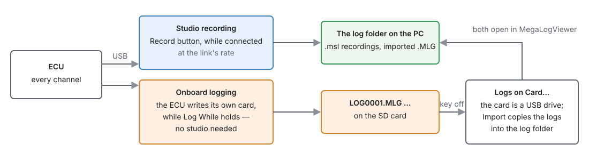
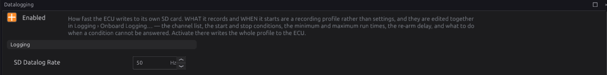

# Datalogging and analysis

:material-circle:{ .level-basic } Basic → :material-circle:{ .level-intermediate } Intermediate

> **In one sentence:** record what the engine did — from the studio while connected, or on the ECU's
> own SD card without a laptop — and read the log afterwards, because a log shows what a gauge
> glimpsed.

## Overview

:material-circle:{ .level-basic } Basic

<figure markdown>
  
  <figcaption>Figure 42.1 — The two ways to log, and where the files end up.</figcaption>
</figure>

| | **Studio recording** | **Onboard logging** |
|---|---|---|
| Needs | the studio connected | an SD card in the ECU |
| Start | **Record** (toolbar) or **Logging ▸ Start Recording**, or every session automatically | the **Log While** condition |
| Rate | whatever the USB link delivers | **SD Datalog Rate** (default 10 Hz, up to 1000 Hz) |
| File | `.msl` text, on the PC | `LOG0001.MLG` … binary, on the card |
| Best for | tuning sessions | driving without a laptop; catching a rare fault |

Both formats open in **MegaLogViewer**, the usual tool for reading engine logs. The studio has no log
viewer of its own.
<!-- src: apps/studio-jf/src/model/DatalogRecorder.h; firmware/Comms/SdProtocol.cpp; definition/ecu.schema.yaml (Datalog) -->

## Concepts

:material-circle:{ .level-intermediate } Intermediate

### 1 · Studio recording

- **A log is one start to one stop.** Nothing rolls over or splits: each Start…Stop is one file,
  named with the date and time.
- With **Record every session** on (**Preferences ▸ Datalog**), a recording starts when the ECU
  connects and stops when it disconnects. The Record button still stops or starts one at any time.
- **Logging ▸ Recording Channels…** chooses the columns; leave it empty to record every channel. A
  recording already running keeps the columns it started with.
- Files are tab-separated text (`.msl`), which MegaLogViewer reads directly and any text editor can
  open. A session cut off mid-write is still a readable file.
- **Preferences ▸ Datalog** also sets the folder and **Keep recent logs** (0, the default, keeps
  everything). It shows roughly how much disk an hour takes.
- **Logging ▸ Open Logs Folder** opens the folder.
  <!-- src: apps/studio-jf/src/model/DatalogRecorder.h; apps/studio-jf/src/ui/PreferencesDialog.h; apps/studio-jf/main.cpp -->

### 2 · Onboard logging

The ECU logs to its own card while the key is on (chapter 36), whether a laptop is there or not:

- **Configuration ▸ Datalogging**: **Enabled** and **SD Datalog Rate**.
- **Logging ▸ Onboard Logging…**: **what** it records and **when** — edited together as a
  **profile**.

<figure markdown>
  
  <figcaption>Figure 42.2 — Configuration ▸ Datalogging. What and when are set in Logging ▸ Onboard Logging….</figcaption>
</figure>

**When it logs:**

| Setting | Does |
|---|---|
| **Log While** | starts, and keeps, logging while this is true (an expression, chapter 34) |
| **Stop When** | stops it; empty means "when Log While stops being true". A separate stop condition gives hysteresis: start above 4000 RPM, stop below 3000 |
| **Min log (ms)** | once started, log at least this long |
| **Min gap (ms)** | once stopped, wait this long before a new file |
| **Max log (ms)** | the longest one file runs (0 = no limit) |
| **Re-arm (ms)** | after Max log ends a file, wait this long before another; 0 starts the next file straight away |
| **If unanswerable** | when the condition cannot be worked out (a channel it reads has no value): **On** (the default — a channel going quiet is when a log is most wanted), **Off** or **Hold** |

**Both conditions empty** is the built-in rule: log whenever the engine turns (above 100 RPM).
<!-- src: firmware/Comms/CommsManager.cpp; definition/ecu.schema.yaml (datalog: log_when, log_until, min_on_ms, min_off_ms, max_on_ms, rearm_ms, on_invalid) -->

**What it logs:** **Choose Channels** in the dialog. With no channels chosen the ECU logs the
definition's own default set. Fewer channels let a higher rate fit.

### 3 · Profiles

The **Onboard Logging** dialog is an editor over a list of setups:

- **Current (on the ECU)** — what the ECU is set to now.
- **Templates** that come with the firmware — read-only; **Duplicate…** one to edit it.
- **Your profiles** — saved on the PC, editable without an ECU.

Choosing one only shows it. **Activate** writes the one on screen to the ECU (into its working memory,
like any change — burn to keep it). **Save**, **Duplicate…** and **Delete** manage your profiles.
<!-- src: apps/studio-jf/src/ui/OnboardLoggingDialog.h -->

### 4 · Getting logs off the card

At key-off the ECU hands the card to USB and it appears as a drive (chapter 36). **Logging ▸ Logs on
Card…** lists the `.MLG` files and marks the ones already in the studio's log folder. **Import all
new** or **Import ticked** copies them across; **Delete ticked** removes them from the card, and asks
first if a log has not been imported (the card is then its only copy). **Find card…** points it at the
card if the computer did not mount it where the studio expected.
<!-- src: apps/studio-jf/src/ui/CardLogsDialog.h -->

### 5 · Reading a log

- Look at the **channels together**: a lean spike means nothing without the throttle, RPM and load
  beside it.
- Allow for **delay**: a wideband reads gas made tens to hundreds of milliseconds earlier (chapter 40).
- Log **fast enough** for the question: 10 Hz shows a cruise, not a tip-in. For transients and knock,
  50–100 Hz.
- Useful sets:

| Question | Channels |
|---|---|
| Fuel | `rpm`, `fuel_load`, `tps`, `lambda_1`, `lambda_target`, `ve`, `fuel_corr_stft`, `fuel_corr_ltft`, `clt`, `iat` |
| Ignition and knock | `rpm`, `fuel_load`, `advance`, `knock_retard`, `knock_level`, `knock_count` |
| Boost | `rpm`, `map`, `boost_target`, `wastegate_duty`, `tps` |
| Faults | `dtc_active`, `dtc_worst_code`, `battery`, `key_on`, and the channels of the suspect system |

## Procedure

:material-circle:{ .level-basic } Basic

**A tuning session:**

1. Connect, and press **Record** (or set **Record every session**).
2. Do the runs. Press **Record** again to close the file at a natural break.
3. **Logging ▸ Open Logs Folder** and open the file in MegaLogViewer.

**Logging without a laptop:**

1. Fit an SD card (chapter 36).
2. **Configuration ▸ Datalogging**: tick **Enabled**, set **SD Datalog Rate**.
3. **Logging ▸ Onboard Logging…**: pick or build a profile — channels, Log While, timings — and press
   **Activate**. Burn.
4. Drive. Then, key off, connect USB: **Logging ▸ Logs on Card…**, **Import all new**.

## Examples

:material-circle:{ .level-intermediate } Intermediate

!!! example "Example 1 — only the pulls"
    Log While `tps > 90 and rpm > 2500`, Stop When `tps < 50`, Min log 2000 ms, rate 100 Hz, with the
    fuel and knock channels. Each pull becomes one short file.

!!! example "Example 2 — catch an intermittent stall"
    Log While `rpm > 0`, Max log 600000 ms (10 minutes), Re-arm 0: files roll every ten minutes, so the
    one with the stall is short enough to find in.

!!! example "Example 3 — log when something goes wrong"
    Log While `dtc_active > 0`, Min log 30000 ms. The card only fills when there is a fault to look at.

## Pitfalls and troubleshooting

:material-circle:{ .level-basic } Basic → :material-circle:{ .level-advanced } Advanced

| Symptom | Likely causes | Check |
|---|---|---|
| "Cannot record" | The log folder cannot be written | Preferences ▸ Datalog ▸ Folder |
| No files on the card | Datalogging not enabled; no card; Log While never true; key never on | The Datalogging page; chapter 36 |
| Hundreds of tiny files | The condition flickers | A Stop When with hysteresis; Min log; Min gap |
| Card not listed on the PC | Key on: the ECU has it | Key off; **Find card…** |
| Log too coarse to see a tip-in | Rate too low | 50–100 Hz, fewer channels |
| Onboard changes lost after power-off | Not burned after Activate | Burn |

## Settings reference

--8<-- "reference/settings/_datalog.table.md"

## Related

- [Chapter 34 — Generic tables and expressions](../part3/34-tables-expressions.md) (Log While)
- [Chapter 36 — System settings](../part3/36-system.md) (the SD card)
- [Chapter 40 — Auto tune](40-auto-tune.md)
- [Chapter 44 — Diagnostics and trouble codes](../part5/44-diagnostics.md)
