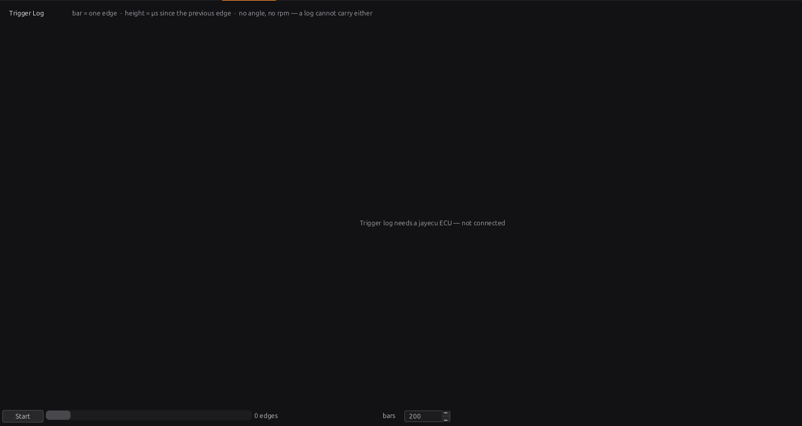
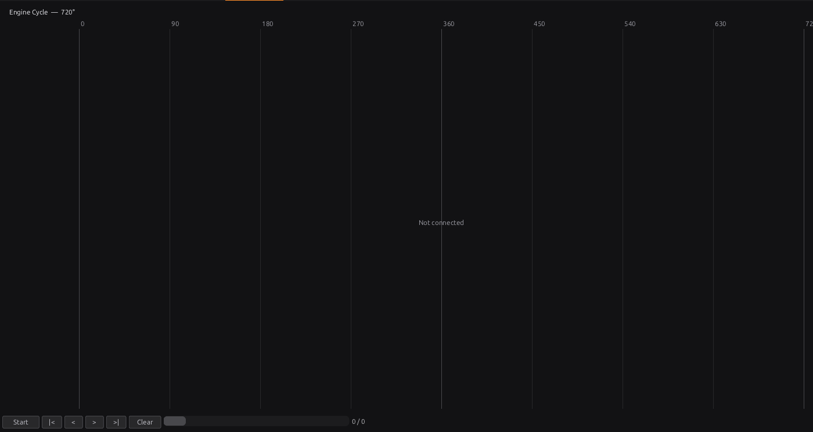

# Bench testing

:material-circle:{ .level-basic } Basic → :material-circle:{ .level-advanced } Advanced

> **In one sentence:** before the ECU meets an engine, power it on the bench, feed it a pretend
> engine from a stimulator, and prove that it syncs, reads its sensors and fires every output in the
> right place — mistakes found on the bench cost nothing.

## Overview

:material-circle:{ .level-basic } Basic

A bench test checks, in order:

1. **Power and link** — the ECU starts, the studio connects.
2. **Sensors** — each one reads something sensible.
3. **Outputs** — each one switches the thing it should, one at a time.
4. **Trigger** — the ECU syncs to your wheel pattern and shows a steady speed.
5. **Firing** — coils and injectors fire at the right angles for your firing order.
6. **Extras** — CAN, knock, as fitted.

The kit — bench supply, stimulator, scope — is in chapter 8, Figure 8.1.

## Concepts

:material-circle:{ .level-intermediate } Intermediate

### 1 · The bench needs 12 V, not just USB

On USB power alone the ECU is **key off**: it will not decode the trigger, fire anything or drive its
Generic outputs, and its SD card goes to the computer. Everything below needs the bench supply on
**CN4-9** (and the main-relay feed on **CN4-13** for the high-side outputs), above 8 V (chapter 10).
<!-- src: firmware/Scheduler/EnginePositionHal.cpp; firmware/Sensors/Sensors.cpp -->

### 2 · The stimulator

A stimulator plays a wheel pattern into the trigger inputs, so the ECU behaves as if the engine were
turning (chapter 8). It must be set to the **same pattern** as your trigger setup (chapter 16), or the
ECU will not sync — which is a useful test in itself. A stimulator agrees with any trigger offset, so
it cannot check the offset: only a timing light on the running engine can (chapter 20).

### 3 · Fuel and spark stay off unless you want them

With the stimulator running and the trigger synced, the ECU fires coils and injectors exactly as on
an engine. On the bench that is what you want to see — on a scope, or with test lights. With real
coils or injectors connected, keep dwell short and never leave injectors firing into a manifold. To
sync without firing, switch **Ignition Outputs** and **Injector Outputs** off (**Engine
Configuration ▸ Ignition System** and **Fuel System**) and back on afterwards; both survive a reset.
<!-- src: definition/ecu.schema.yaml (ign_enable, inj_enable) -->

## Procedure

:material-circle:{ .level-basic } Basic

### Step 1 — Power and link

1. Set the bench supply to 12–14 V with a low current limit. Connect **CN4-9** and **CN4-13** to +,
   **CN4-11/12** to − (chapter 8).
2. Switch on: the **PWR** LED lights. Connect USB and the studio (chapter 5).
3. **ERR** lit from power-up with nothing on the engine side means no usable tune: send one and burn
   it (chapter 36).

### Step 2 — Sensors

Open **Configuration ▸ Sensors** and each sensor you use:

- With the sensor connected, the reading should be sensible (room temperature, atmospheric pressure,
  throttle at rest).
- Unplugged sensors raise their trouble codes: expected on a bench, and a quick check that each
  code points at the right sensor (chapter 44).
- Move each sensor you can — throttle, pedal — and watch the reading follow.

Chapter 17 covers each sensor's checks.

### Step 3 — Outputs

With the engine stopped, the **Bench Test** panel on each output's pin page fires it — a set number
of times, for a set on and off time — so you can check each load and its wiring, one at a time
(chapter 18, Step 10). Use test lights or the real load; watch the
current on the bench supply.

### Step 4 — Trigger

1. Set the stimulator to your wheel pattern and a steady speed (1000 RPM is easy to read).
2. The **Status Lamps** show sync, and `rpm` the speed. **RUN** on the board goes solid at full sync
   (chapter 7).
3. No sync? Open **Tools ▸ Trigger Log** (section below) and compare what arrives with your wheel.

### Step 5 — Firing, with the Engine Cycle view

Open **Tools ▸ Engine Cycle** (section below) and press **Start**. Check:

- each coil and injector lane fires once per cycle (or twice, on wasted spark and paired injection);
- the order along the cycle is your firing order;
- the coil lanes sit the right number of degrees before each cylinder's TDC — the advance you
  commanded.

Then check the same outputs on a scope (chapter 8): IGN pins are high while the coil charges.

### Step 6 — Extras

- **CAN**: a USB–CAN adapter shows what the ECU sends (chapter 13).
- **Knock**: a signal generator through an attenuator into KNOCK1 checks detection end to end
  (chapter 8, chapter 41).

## The Trigger Log

:material-circle:{ .level-intermediate } Intermediate

**Tools ▸ Trigger Log** records the raw edges on every trigger input — before any decoding — as bars:
one bar per edge, its height the time since the previous edge. It needs no sync, so it works on a
wheel the ECU cannot yet decode. Chapter 16 (Step 8, Figure 16.17) explains how to read it.
<!-- src: firmware/Scheduler/EnginePositionHal.cpp; firmware/Scheduler/TriggerLogger.h -->

<figure markdown>
  
  <figcaption>Figure 43.1 — Tools ▸ Trigger Log, before a capture (offline). Press Start and crank,
  or run the stimulator.</figcaption>
</figure>

- **Start** records up to 4096 edges, then stops by itself; the button turns into **Stop** to end it
  sooner.
- **bars** sets how many bars are on screen at once: a cranking session is thousands of edges.
- The log does not stop the engine starting: with the trigger set up correctly an engine starts and
  runs as normal while it records (chapter 16).

## The Engine Cycle view

:material-circle:{ .level-intermediate } Intermediate → :material-circle:{ .level-advanced } Advanced

**Tools ▸ Engine Cycle** draws whole engine cycles **in crank degrees** (0–720°, or 1080° on a
rotary), with a lane for each trigger input, coil and injector. It needs sync, because the angles
come from the decoder.
<!-- src: apps/studio-jf/src/ui/EngineCyclePanel.h; apps/studio-jf/main.cpp -->

<figure markdown>
  
  <figcaption>Figure 43.2 — Tools ▸ Engine Cycle, before a capture (offline). Each captured cycle
  fills the lanes; the controls step through the ones kept.</figcaption>
</figure>

- **Start** records: each captured cycle is added and the view follows the newest. The button turns
  into **Stop**, which pauses.
- **|<  <  >  >|** step to the first, previous, next and newest cycle; stepping pauses the recording,
  so the view holds still while you read it. **Clear** empties the history.
- The counter shows which cycle you are on, of how many kept. How many are kept (20, 60, 120 or 300;
  60 by default) is **Preferences ▸ Engine cycle frames to keep**.
- **Changed lanes are flagged.** An engine turning steadily produces the same number of edges in
  every lane, every cycle. When a lane's count differs from the previous cycle — a dropped tooth, a
  missing injector pulse, a lane that vanished — the view says so, with both numbers. It is an
  observation, not a verdict: the engine may really have done something different.
  <!-- src: apps/studio-jf/src/model/CycleDiagnostics.h; apps/studio-jf/src/ui/PreferencesDialog.h -->

Use it to see where a cam pulse falls against the crank teeth, a spark that wanders from cycle to
cycle, or a tooth that arrives late once in a while.

## Examples

:material-circle:{ .level-intermediate } Intermediate

!!! example "Example 1 — the stimulator runs but no sync"
    The Trigger Log shows 35 short bars and one long one per revolution: a 36-1 wheel. The trigger was
    set up for 60-2. Correct the wheel (chapter 16); sync comes at once.

!!! example "Example 2 — two coils swapped"
    Engine Cycle shows coil lanes in the order 1-2-4-3 for a 1-3-4-2 engine. The coil outputs are
    assigned to the wrong cylinders: fix the pin assignment (chapter 18) before the engine sees it.

!!! example "Example 3 — an injector lane flagged every few cycles"
    One injector lane shows 1 pulse most cycles and 0 now and then. On the bench this was a pulse too
    short to schedule at a very small commanded fuel; with a real fuel load the lane is steady.

## Pitfalls and troubleshooting

:material-circle:{ .level-basic } Basic → :material-circle:{ .level-advanced } Advanced

| Symptom | Likely causes | Check |
|---|---|---|
| No sync, stimulator running | ECU on USB only; wrong wheel; wrong input or edge | 12 V on CN4-9; Trigger Log; chapter 16 |
| "Trigger log needs a jayecu ECU — not connected" | Studio not connected | Connect |
| Engine Cycle says "Not connected" or stays empty | Not connected; no sync | Connect; Step 4 |
| Generic outputs do nothing | Key off (USB power only) | 12 V |
| A sensor code on the bench | That sensor unplugged | Expected; plug it in to clear |
| Supply current limit trips on an output test | A short, or a load too big for the output | Chapter 12 |

## Related

- [Chapter 8 — Tools and materials](../part2/08-tools.md) (the bench kit)
- [Chapter 16 — The trigger system](../part3/16-trigger.md)
- [Chapter 18 — Outputs and the pin system](../part3/18-outputs.md) (output test)
- [Chapter 36 — System settings](../part3/36-system.md) (key states, no tune)
- [Chapter 44 — Diagnostics and trouble codes](44-diagnostics.md)
