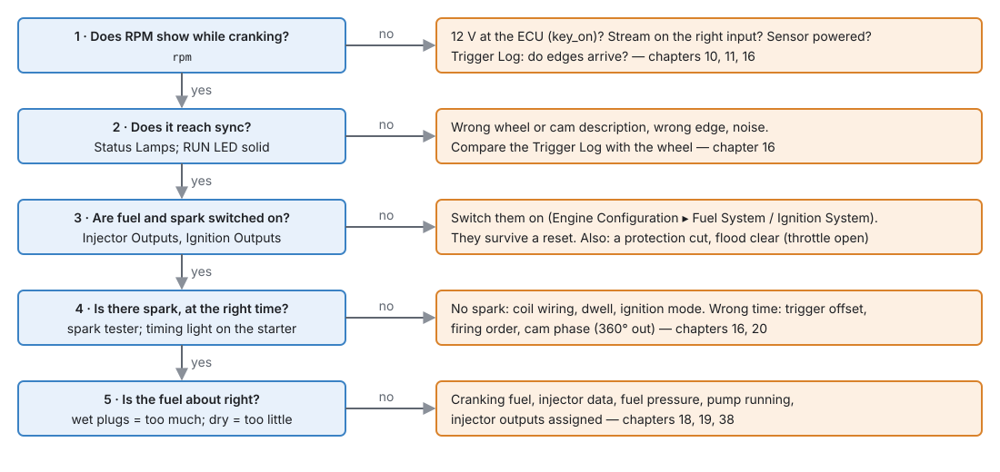

# Troubleshooting guide

:material-circle:{ .level-basic } Basic → :material-circle:{ .level-advanced } Advanced

> **In one sentence:** start from what the engine or the studio is doing wrong, check the likely
> causes in order, and follow the pointer to the chapter that fixes it.

## Overview

:material-circle:{ .level-basic } Basic

Every chapter in Part III ends with a troubleshooting table for its own system. This chapter is the
way in when you do not yet know which system is at fault. Before anything else:

1. **Read the trouble codes** (chapter 44). A code usually names the system.
2. **Log it** (chapter 42). A log shows what happened; memory does not.
3. **Check what the ECU believes** on **Fuel Breakdown** and **Timing Breakdown** (chapter 37).
4. **Change one thing at a time.**

## Concepts

:material-circle:{ .level-intermediate } Intermediate

**Work from the ground up.** Power and grounds (chapter 10) come before sensors, sensors before the
trigger, the trigger before fuel and spark. A problem low down causes symptoms everywhere above it: a
bad ground makes sensors read wrong, which makes the fuelling look wrong.

**Two switches that survive a reset.** **Ignition Outputs** and **Injector Outputs** (Engine
Configuration ▸ Ignition System and Fuel System) turn every coil or every injector off, and stay off
through a power-down. An engine that cranks and will not start is worth checking there first.
<!-- src: definition/ecu.schema.yaml (ign_enable, inj_enable help) -->

## Procedure

:material-circle:{ .level-basic } Basic

### Cranks but will not start

<figure markdown>
  
  <figcaption>Figure 45.1 — Cranks but will not start: ask in this order.</figcaption>
</figure>

### Starting and idle

| Symptom | Likely causes | Chapter |
|---|---|---|
| Starts then dies | Post-start fuel; idle air too low; a protection cut; the fuel pump not kept running | 19, 21, 29, 14 |
| Starts only with the throttle open | Too little idle air or cranking fuel. (Past **Cut Above Throttle**, flood clear cuts fuel.) | 21, 19 |
| Hard hot start | Too much cranking fuel when hot; heat-soaked intake air | 19 |
| Idle hunts | Idle control gains; idle timing cells uneven; a vacuum leak | 21, 39 |
| Idle too high | Idle target; throttle not fully closing; an air leak | 21, 22 |
| Stalls when lifting off at low speed | DFCO resumes too low; idle not catching the drop | 29, 21 |

### Driving

| Symptom | Likely causes | Chapter |
|---|---|---|
| Stumble on tip-in | Too little transient fuel | 38 |
| Rich puff on tip-out | Too little disenrichment | 38 |
| Surges at steady cruise | Uneven VE or timing cells; closed-loop gains too high | 38, 39, 23 |
| Hits a limit early | Rev limiter or a protection level's lower rev limit; launch or pit limiter still active | 27, 29, 26 |
| Cuts out under load | Lambda protection on a lean spike; a threshold monitor; overboost | 29 |
| Power down, timing low | Knock retard; protection retard; hot intake air | 30, 29, 39 |

### Mixture

| Symptom | Likely causes | Chapter |
|---|---|---|
| Lean or rich everywhere by the same amount | Injector flow, fuel pressure, specific gravity, displacement | 19, 38 |
| Error changes with battery voltage | Injector dead time | 38 |
| Closed loop never engages | Wideband not ready; engine not warm; a learn or enable condition | 23 |
| Large trims in one area | VE wrong there | 38, 40 |
| Wideband reads lean at idle only | Exhaust leak before the sensor | 11 |

### Ignition and knock

| Symptom | Likely causes | Chapter |
|---|---|---|
| Timing light disagrees with `advance` | Trigger offset; the light reads wasted spark | 16, 20 |
| Timing drifts with RPM | Trigger noise or missed teeth; dwell too long for the coil | 16, 20 |
| Knock retard on a clean engine | Threshold too low; noise in the window | 41 |
| Never reports knock | Floor not learned; threshold too high | 41 |
| Misfire codes on a healthy engine | Threshold below the engine's roughness | 31 |

### Boost, throttle and cams

| Symptom | Likely causes | Chapter |
|---|---|---|
| Boost overshoots | Feed-forward too high; gains too high | 24 |
| Never reaches target | Wastegate spring; duty ceiling; a leak | 24 |
| Throttle fault lamp at key-on | Key-on check failed; stops changed | 22 |
| Cam not following target | Cam not locked; direction or sign wrong | 25 |

### Sensors and outputs

| Symptom | Likely causes | Chapter |
|---|---|---|
| A sensor reads a fixed or silly value | Wrong input or interface; calibration; wiring; its 5 V supply | 17, 11 |
| Sensor codes everywhere at once | A 5 V reference or a ground | 10, 17 |
| An output does nothing | Function not set; its conditions false; key off; pin taken by something else | 18 |
| "Pin / Output Conflict" lamp | Two functions want one pin | 18 |
| A fuse or the supply limit trips when an output switches | Load too big for the output; a short | 12 |

### Studio, link and card

| Symptom | Likely causes | Chapter |
|---|---|---|
| Studio will not connect | USB cable; permissions on Linux; another program has the port | 3, 5 |
| "Not connected" in the tools | The link | 5 |
| Red **NO TUNE ON THE ECU** strip; every reading 0 but the battery | The ECU has no usable tune (a new board, or a firmware update that did not put the tune back) | 47 |
| Changes lost after power-off | Not burned | 36 |
| Engine stops briefly on Burn | Burned while running with no SD card | 36 |
| ERR LED on from power-up, engine side dead | No usable tune | 36, 47 |
| Card not seen by the computer | Key on: the ECU has it | 36 |
| CAN device not heard | Bit rate; termination; wiring; frame id | 13, 33 |
| Lua script does nothing | Not applied or burned; `lua_state` not 0 | 35 |

## Examples

:material-circle:{ .level-intermediate } Intermediate

!!! example "Example 1 — cranks, no start, the day after a compression test"
    RPM shows, sync comes, no spark and no injector pulses. **Ignition Outputs** and **Injector
    Outputs** had been switched off for the compression test, and they survive a power-down. Switched
    on: starts.

!!! example "Example 2 — every sensor slightly wrong"
    Coolant, air temperature and throttle all read a little high, with the engine running only. A shared
    ground was on the engine block, not the ECU's ground point. Moved (chapter 10): all correct.

!!! example "Example 3 — lean only at high RPM"
    Correct everywhere else, 8 % lean above 6000 RPM. Fuel pressure fell at high flow: a weak pump,
    not the VE Table. Fixed at the pump, not in the map.

## Pitfalls and troubleshooting

:material-circle:{ .level-basic } Basic → :material-circle:{ .level-advanced } Advanced

- **Fixing the symptom in the map.** A table can hide a mechanical or wiring fault until it gets
  worse. Find the cause first.
- **Changing several things at once.** You will not know which one helped.
- **Clearing codes before reading them.** The stored codes and their freeze frames are the evidence.

## Related

- [Chapter 10 — Power and grounds](../part2/10-power-grounds.md)
- [Chapter 16 — The trigger system](../part3/16-trigger.md)
- [Chapter 42 — Datalogging and analysis](../part4/42-datalogging.md)
- [Chapter 43 — Bench testing](43-bench-testing.md)
- [Chapter 44 — Diagnostics and trouble codes](44-diagnostics.md)
