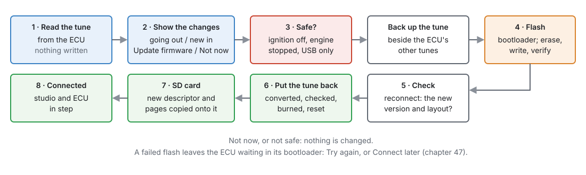

# Updating firmware

:material-circle:{ .level-basic } Basic → :material-circle:{ .level-intermediate } Intermediate

> **In one sentence:** when the studio has newer firmware for your ECU, it offers it as you connect —
> showing what the update changes in your tune — and then flashes it over USB and puts your tune back,
> converted, without any other tool.

## Overview

:material-circle:{ .level-basic } Basic

- The studio and the ECU firmware are updated **separately** (chapter 3 covers the studio).
- Firmware comes as a **kit** for one board: the firmware image, its meta and its pages. Kits
  ship with the studio, and the studio can download newer ones.
- The update runs over the ordinary **USB cable**. No programmer, no other program.
- Your tune is **read, backed up, converted and put back** as part of the update.
  <!-- src: apps/studio-jf/src/app/FirmwareUpgrade.h; apps/studio-jf/src/app/FirmwareFetch.h -->

## Concepts

:material-circle:{ .level-intermediate } Intermediate

### 1 · Where kits come from

- **Shipped**: each studio release carries a kit for every board it supports.
- **Downloaded**: with **Check for firmware updates at startup** on (Edit ▸ Preferences ▸ Updates), or
  when you press **Check now**, the studio looks for newer firmware for every board it has met or has
  a kit for, and downloads it. Every file is checked against the release's published checksums before it is kept.
  Nothing is put on an ECU by this: it only makes the kit available.
- **Beta**: with **Include beta firmware** on (Preferences ▸ Updates), the check also looks at beta
  releases published between full ones, and downloads whichever is newest. A beta's version reads
  like `0.5.0-beta.1`, and it counts as older than the `0.5.0` it leads to, so the full release
  replaces it when it comes.
- **By hand**: **Tools ▸ Install Firmware Kit…** takes a kit someone has sent you (choose the
  `kit.json` inside the kit's folder). It is checked, copied in beside the downloaded kits, and
  offered like any other.
- A kit that needs a newer studio than yours is not offered: update the studio first.
  <!-- src: apps/studio-jf/main.cpp (firmware check), Tools menu (Install Firmware Kit…); apps/studio-jf/src/app/FirmwareFetch.h, fetchLatest includeBeta; JFramework include/j/update/JVersion.h (pre-release order) -->

### 2 · When it is offered

As you connect, once the ECU has said which board and firmware it runs: if the studio has a **newer**
kit for that board, it offers it. **Tell me when a connected ECU has older firmware** (Preferences ▸
Updates) turns the offer off. Older firmware is never offered.
<!-- src: apps/studio-jf/main.cpp -->

### 3 · What changes in your tune

A new firmware may drop settings, add new ones, or move them. Before asking, the studio converts your
tune into the new layout as a trial and shows the result in two halves:

- **Going out** — what your tune has set that the new firmware no longer has, with your values.
- **New in firmware …** — settings to configure, on the pages where they live.

Under them, **What else changed** says in words what each newer version changes — how something
behaves, a fix, a page that reads better — which the two halves cannot show because no setting moved.
If your ECU is several versions behind, every one of them is listed, newest first. When no setting
changes at all, this is most of the report, headed **What changed**.

That report is the question: **Update firmware** or **Not now**. Not now changes nothing; the next
connect asks again.
<!-- src: apps/studio-jf/main.cpp; apps/studio-jf/src/app/FirmwareUpgrade.h; apps/studio-jf/src/ui/FirmwareChangesDialog.h; firmware/CHANGES.md -->

### 4 · The steps

<figure markdown>
  
  <figcaption>Figure 46.1 — What happens after Update firmware.</figcaption>
</figure>

1. **Read** the tune off the ECU.
2. **Show** the changes (section 3).
3. **Safe?** The ignition must be **off**, the engine stopped and the ECU on **USB power only**,
   judged from live data after you answer. If not, it stops with nothing changed: turn the ignition off
   and connect again.
4. **USB access**, if it is missing: on Linux the USB permission rule, through the system password
   prompt; on Windows the USB driver for the bootloader (WinUSB), through the administrator prompt
   (chapter 3). Asked once, and before the ECU is put into its bootloader.
5. **Back up** the tune beside the ECU's other tunes (chapter 48).
6. **Flash**: the ECU restarts into its USB bootloader, and the studio erases, writes and verifies.
7. **Check**: reconnect; the ECU must report the new version and layout.
8. **Put the tune back**: write the converted tune, read it back and compare, burn, restart. If the
   ECU had **no tune** before the update (a new board, or a tune it had refused), there is nothing to
   convert or back up: the new firmware's default tune goes on instead, and the studio says so when it
   finishes.
   <!-- src: apps/studio-jf/src/app/FirmwareUpgrade.cpp (noTune_: defaults, no backup); FirmwareUpgrade.cpp (the finishing message) -->
9. **SD card**: the studio asks whether to copy the new meta and pages onto the ECU's card, so
   another studio that has never seen this firmware can fetch them from the ECU (chapter 48). It
   takes about a minute. Tick **Remember my choice** and it stops asking; **Copy the meta and
   dashboard to the ECU's SD card** (Preferences ▸ Updates) shows and
   changes the answer. No card: skipped, and said so.
10. The normal connect runs, with the studio and the ECU in step.
    <!-- src: apps/studio-jf/src/app/FirmwareUpgrade.h; apps/studio-jf/src/app/FirmwareUpgrade.cpp -->

## Procedure

:material-circle:{ .level-basic } Basic

1. Park, **ignition off**. Connect the ECU to the laptop by USB (it runs from USB power).
2. Connect in the studio. If newer firmware exists, the changes report opens.
3. Read it. Note anything in **Going out** you rely on, look at **New in** for settings to set, and
   read **What else changed**.
4. **Update firmware**. Do not unplug USB until it says it has finished.
5. Check the new settings the report listed, and the engine, before driving.

## Examples

:material-circle:{ .level-intermediate } Intermediate

!!! example "Example 1 — an update that adds a feature"
    The report's **New in** lists a new correction table, off by default. Going out is empty. Update;
    the tune comes back exactly as it was, and the new table waits to be switched on.

!!! example "Example 2 — asked with the ignition on"
    Update firmware → "Firmware is only updated with the ignition OFF and the engine stopped, the ECU
    powered from USB alone." Nothing was changed. Ignition off, connect again, update.

## Pitfalls and troubleshooting

:material-circle:{ .level-basic } Basic → :material-circle:{ .level-advanced } Advanced

| Symptom | Likely causes | Check |
|---|---|---|
| No update offered | No newer kit; the offer is switched off; the kit needs a newer studio | Preferences ▸ Updates; update the studio |
| Stops at the safety check | Ignition on; engine turning | Ignition off, USB only |
| Linux: cannot open the bootloader | The USB permission rule | Chapter 3 |
| Windows: "the USB driver … is not installed" or "has another driver" | The administrator prompt was declined; another program's driver (for example ST's) is bound to the bootloader | Run **Install the jayecu USB driver** from the Start menu, then connect again |
| Flash failed part-way | USB unplugged or disturbed | The ECU waits in its bootloader: answer **Try again**, or press Connect later (chapter 47) |
| Tune values missing after the update | They were in **Going out** | The backup: **File ▸ Open Tune…**, marked *(firmware backup)* (chapter 48) |
| "It had no tune, so it now has the firmware's default tune" | The ECU had no usable tune before the update | Set the tune up, or open a saved one with **File ▸ Open Tune…** (chapter 47, section 2) |
| Another studio shows no pages for this ECU | It has no copy of the new meta | It fetches it from the ECU's SD card (chapter 48) |

## Related

- [Chapter 3 — Installing the studio](../part1/03-installing-studio.md) (studio updates, the Linux USB rule)
- [Chapter 36 — System settings](../part3/36-system.md) (start-up and the stored tune)
- [Chapter 47 — Recovering an ECU](47-recovery.md)
- [Chapter 48 — Tunes, layouts and backups](48-files-backups.md)
