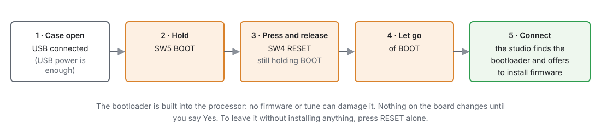

# Recovering an ECU

:material-circle:{ .level-intermediate } Intermediate

> **In one sentence:** the processor has a USB bootloader built into it that no firmware or tune can
> damage, so an ECU that will not start can always be given firmware again over the USB cable — and a
> bad tune is put right by sending a good one.

## Overview

:material-circle:{ .level-basic } Basic

| What you see | What it is | Section |
|---|---|---|
| ECU does nothing on USB; no PWR-to-RUN life; an update stopped half-way | No working firmware | 1 |
| **ERR** LED lit from power-up; the studio connects; engine side dead | Firmware fine, no usable tune | 2 |
| Engine runs badly after a change | A tune problem | 3 |
| The studio will not connect, the ECU seems fine | The link or the computer | 4 |

You do not need a programmer, a debugger or any other program for any of these. An ST-LINK on the
board's **H3** header is a developer's tool (chapter 8), not a recovery requirement.

## Concepts

:material-circle:{ .level-intermediate } Intermediate

### 1 · The bootloader

The STM32 processor carries its own USB bootloader in read-only memory. It starts when the
**SW5 BOOT** button is held as the processor resets, and it lets the studio write new firmware over
USB. Because it is part of the chip, nothing written to the ECU can break it.

Writing firmware erases only the part of the flash the firmware occupies: the stored tunes are kept.
<!-- src: apps/studio-jf/src/comms/Dfu.h; hardware/jaytek_v1_hardware.md -->

The ECU also ends up waiting in its bootloader on its own if a firmware update is interrupted
(chapter 46).

## Procedure

:material-circle:{ .level-basic } Basic

### 1 · No working firmware

<figure markdown>
  
  <figcaption>Figure 47.1 — Starting the bootloader by hand. After an interrupted update the ECU is
  already there: skip to step 5.</figcaption>
</figure>

1. Open the case and connect USB. USB power is enough; the ignition can be off.
2. Hold **SW5 BOOT**, press and release **SW4 RESET**, then let go of **BOOT** (chapter 7 shows where
   they are).
3. In the studio press **Connect**. It finds an ECU waiting in its bootloader and offers to install
   firmware:
    - If it has met one board type, it names it: *"Install firmware … for jaytek_v1 now? Only say Yes
      if this ECU is a jaytek_v1."*
    - If it knows several, or has never connected to an ECU, it asks which board it is. Choose
      carefully: firmware for another board drives the wrong pins.
4. **Yes**. If the studio does not yet have USB access to the bootloader — the permission rule on
   Linux, the USB driver on Windows — it asks for it first (chapter 3). Then the firmware is written
   and checked, and the ECU restarts.
5. It connects as normal. If the stored tune does not suit this firmware, the ECU starts with its
   engine side off (section 2).
   <!-- src: apps/studio-jf/main.cpp (s_offerRecovery) (Connect finds the bootloader); apps/studio-jf/src/app/FirmwareUpgrade.cpp -->

To leave the bootloader without installing anything, press **RESET** alone.

!!! warning "The studio needs firmware for your board"
    It installs from the kits it has (chapter 46). If it has none for your board it says so: check for
    updates (Edit ▸ Preferences ▸ Updates ▸ **Check now**) on a computer with internet, then connect
    again.

### 2 · No usable tune

The firmware runs but found no stored tune made for it: the **ERR** LED is lit, and the trigger,
fuel, spark and outputs are off. USB and the studio work (chapter 36).

The studio shows a red **NO TUNE ON THE ECU** strip above the toolbar. Every reading is 0 except the
battery, which the ECU still reads so you can see the supply.

1. Connect. The studio asks *"This ECU has no tune"* and offers:
   - **Put "<your tune>" on the ECU**: the tune the studio keeps for this ECU (chapter 48). Offered
     only if it has a real one.
   - **Put the default tune on the ECU**: the firmware's own starting tune. A new board has nothing
     else; set it up for your engine before starting it.
   - **Cancel**: nothing is written and the link closes.
2. **Burn**, then **Reset ECU** on the toolbar (or power off and on). The strip clears once the ECU has
   started on the burned tune.
3. To put back a different tune, such as the one saved before a firmware update, use **File ▸ Open
   Tune…**: the tunes saved before a firmware update are in the list, marked *(firmware backup)*.
   Write it to the ECU, then Burn and Reset ECU.
   <!-- src: apps/studio-jf/main.cpp (no-tune question); apps/studio-jf/main.cpp (NO TUNE strip); apps/studio-jf/main.cpp (firmware backups in Open Tune) -->

### 3 · A tune problem

The engine ran before a change and not after:

1. **Undo** (Edit ▸ Undo) takes back studio edits one step at a time — each table operation is one
   step.
2. **Restore points**: the studio saves the ECU's tune every time it connects; **File ▸ Open Tune…**
   lists them, newest first (chapter 48).
3. **Edit ▸ Restore Tune to Connect Point** puts back the whole tune as it was when you connected.
4. Burn the good version.

### 4 · The studio will not connect

| Check | Why |
|---|---|
| Another USB cable, another port | Charge-only cables carry no data |
| Linux: the USB permission rule is installed (chapter 3) | Without it the port cannot be opened |
| No other program has the port open | Only one program can use it |
| The **PWR** LED is lit | The ECU has power |
| The status line says what the studio found | It names an ECU it does not recognise, or a bootloader |

An ECU running firmware this studio has never seen still connects if its SD card holds the
descriptor: the studio fetches it from the card (chapter 48).

## Examples

:material-circle:{ .level-intermediate } Intermediate

!!! example "Example 1 — a laptop that went to sleep mid-update"
    The ECU is left waiting in its bootloader. On waking, the studio shows "Firmware update failed …
    Try again?" — Yes, and the update finishes. Had the studio been closed, pressing **Connect** later
    offers the same.

!!! example "Example 2 — a new board, a new studio"
    A spare board arrives without firmware. The studio has never connected to an ECU. BOOT + RESET,
    Connect: it lists the boards it has kits for; choose jaytek_v1. Then send your tune.

## Pitfalls and troubleshooting

:material-circle:{ .level-basic } Basic → :material-circle:{ .level-advanced } Advanced

| Symptom | Likely causes | Check |
|---|---|---|
| Connect does not find the bootloader | BOOT released too early; charge-only cable; Linux USB rule | Repeat the button sequence; cable; chapter 3 |
| "The studio has no firmware for …" | No kit for that board | Check now for updates |
| Firmware installed, engine side still off, **NO TUNE ON THE ECU** | No tune for this firmware | Section 2 |
| The wrong board was chosen | Firmware for another board | Recover again, choosing the right one |

## Related

- [Chapter 7 — The board](../part2/07-board.md) (SW4, SW5, LEDs)
- [Chapter 36 — System settings](../part3/36-system.md) (no usable tune)
- [Chapter 46 — Updating firmware](46-updating-firmware.md)
- [Chapter 48 — Tunes, layouts and backups](48-files-backups.md)
