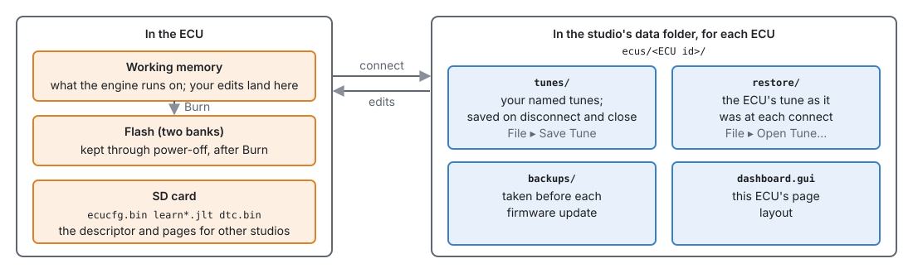

# Tunes, layouts and backups

:material-circle:{ .level-basic } Basic → :material-circle:{ .level-intermediate } Intermediate

> **In one sentence:** the ECU keeps the tune it runs, the studio keeps named copies of it per ECU plus
> a snapshot at every connect, and a copy of the studio's data folder is a complete backup.

## Overview

:material-circle:{ .level-basic } Basic

<figure markdown>
  
  <figcaption>Figure 48.1 — Where copies of a tune live.</figcaption>
</figure>

| Thing | Where | Kept by |
|---|---|---|
| The tune the engine runs | the ECU | **Burn** (chapter 36) |
| Your named tunes | `ecus/<ECU id>/tunes/` | the studio, on disconnect, close, and **File ▸ Save Tune** |
| Restore points | `ecus/<ECU id>/restore/` | the studio, at every connect |
| Backups before a firmware update | `ecus/<ECU id>/backups/` | the firmware update (chapter 46) |
| Page layout for this ECU | `ecus/<ECU id>/dashboard.gui` | **File ▸ Save Layout** (chapter 49) |
| Descriptors (what a firmware has) | `meta/` | the studio; also on the ECU's SD card |

The data folder's location on your system is in chapter 3.
<!-- src: apps/studio-jf/src/model/Ecu.h; manual/docs/part1/03-installing-studio.md (data folder table) -->

## Concepts

:material-circle:{ .level-intermediate } Intermediate

### 1 · ECUs and tunes

The studio knows each ECU by its unique ID, read from the chip. Everything for that ECU lives in its
own folder, so two cars never mix. One ECU can have several **named tunes** — a road tune and a track
tune — and one of them is the one open.

- **File ▸ Open ECU…** and **Recent ECUs**: the ECUs this studio has met, with or without one
  connected.
- **File ▸ Open Tune…**: the tunes of the open ECU, **its connect points** (restore points) and the
  tunes saved **before each firmware update**, newest first. A firmware backup is marked
  *(firmware backup)*; opening one copies it in as a named tune and converts it to the firmware the
  ECU runs now, and the backup itself is left as it was. When connected, it asks whether to send the
  chosen tune to the ECU.
  <!-- src: apps/studio-jf/main.cpp (backups listed; copied into tunes/ and opened) -->
- **File ▸ New Tune…**: a new tune from a firmware's defaults — give it a name and pick the firmware.
- **File ▸ Save Tune** (Ctrl+S): save the open tune now. It is also saved when you disconnect, switch
  ECU or tune, and close the studio.
- **File ▸ Save Tune As…**: save the open tune under a new name; the new one becomes the open tune.
  <!-- src: apps/studio-jf/main.cpp; apps/studio-jf/src/ui/NewTuneDialog.h -->

### 2 · Restore points

Every time the studio connects and reads the ECU's tune, it saves a copy in `restore/`, named after the
open tune and the date and time: `road 2026-09-26 14.05.tune`. These are the "tune from before" when
something goes wrong: open one with **File ▸ Open Tune…**, where they are marked *(connect point)*.

- **Edit ▸ Restore Tune to Connect Point** puts back, in one go, the whole tune as it was when you
  connected this time, and sends it to the ECU.
- A restore point is a raw image of that firmware's tune: it only opens on the same firmware layout.
  <!-- src: apps/studio-jf/main.cpp -->

### 3 · When the ECU and the studio disagree

On connect, the studio compares its saved tune with the ECU's. If they differ it asks which to keep —
**Keep the ECU's tune** (the saved tune is updated to match) or **Restore "…" to the ECU** (the saved
one is written back) — and can show the differences first. If the ECU is at its defaults (just
flashed or wiped), it says so.
<!-- src: apps/studio-jf/main.cpp (reconcileTune) -->

### 4 · The ECU's SD card

The card holds its own copy of the tune and the learned values (chapter 36), and also the
**descriptor** and **page layout** for the firmware it runs. A studio that has never seen that
firmware fetches them from the card when it connects, so it can show the ECU's pages without being
given any files. The firmware update puts them there (chapter 46).
<!-- src: apps/studio-jf/main.cpp (meta fetched from the ECU's SD) (dashboard fetched from the SD) -->

## Procedure

:material-circle:{ .level-basic } Basic

### Backing up

1. Close the studio.
2. Copy the whole **data folder** (chapter 3) somewhere safe — another disk, a USB stick, cloud storage.
   It holds every ECU's tunes, restore points, layouts and your calibrations.
3. For one car only, copy its `ecus/<ECU id>/` folder.

### Moving to a new computer

Install the studio, then copy the data folder to the same place on the new computer before starting
it. Everything is found by that one path.

### Going back to an earlier tune

1. **File ▸ Open Tune…** and choose a named tune, a connect point (marked *(connect point)*) or a
   firmware backup (marked *(firmware backup)*) from before the change.
2. Connected, it asks whether to send it to the ECU: yes. Not connected, the question comes at the
   next connect: choose **Restore "…" to the ECU**.
3. **Burn**.

## Examples

:material-circle:{ .level-intermediate } Intermediate

!!! example "Example 1 — a road tune and a track tune"
    With the road tune open, **File ▸ Save Tune As…** "track". Make the track changes. Switch between
    the two with **File ▸ Open Tune…**; on connect, restore the one you want to the ECU and burn.

!!! example "Example 2 — yesterday's tune"
    A change made this morning made the car worse. **File ▸ Open Tune…** shows restore points from
    each connect; yesterday's last one is the tune as it was driving home. Open it, Restore to the
    ECU, Burn.

## Pitfalls and troubleshooting

:material-circle:{ .level-basic } Basic → :material-circle:{ .level-advanced } Advanced

| Symptom | Likely causes | Check |
|---|---|---|
| A restore point will not open | It was made on a different firmware layout | Use a named tune; they convert |
| The ECU does not have my changes after power-off | Not burned | Burn |
| No ECU listed in Open ECU | This studio has never connected to it | Connect it once |
| An ECU with new firmware shows no pages | No descriptor in this studio and none on the card | Update the studio, or run the firmware update from a studio that has it |
| Tunes missing after reinstalling | The data folder was not copied | Restore it from the backup |

## Related

- [Chapter 3 — Installing the studio](../part1/03-installing-studio.md) (the data folder)
- [Chapter 36 — System settings](../part3/36-system.md) (burning, the SD card)
- [Chapter 46 — Updating firmware](46-updating-firmware.md)
- [Chapter 47 — Recovering an ECU](47-recovery.md)
- [Chapter 49 — Customising the studio](49-customising-studio.md)
