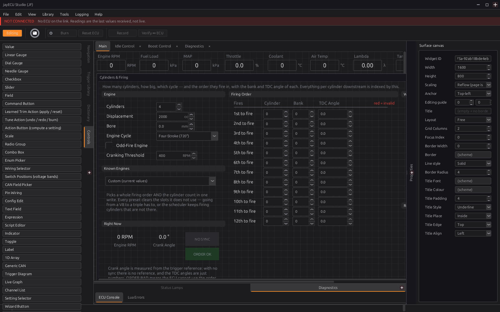

# Customising the studio

:material-circle:{ .level-intermediate } Intermediate → :material-circle:{ .level-advanced } Advanced

> **In one sentence:** every page, tab and instrument in the studio is a layout you can change —
> switch to **Editing**, drag settings and controls onto pages, arrange them, and save the layout for
> this ECU or to share.

Chapter 4 introduced pages, surfaces, docks and the Locked/Editing switch. This chapter is about
changing them.

## Overview

:material-circle:{ .level-basic } Basic

| You can | With |
|---|---|
| Add, move, resize and delete controls on any page | Editing mode, the Controls and Dictionary docks |
| Show or grey out a control depending on the tune or live values | **Visibility Condition** / **Enable Condition** |
| Add, rename, move and hide pages in the navigation tree | the tree's right-click menu, in Editing mode |
| Build your own tabs of instruments | **View ▸ New Surface Tab** |
| Keep the layout for this ECU, or share it | **File ▸ Save Layout**, **Save Layout As…**, **Open Layout…** |
| Pick up pages a new firmware added | **Tools ▸ Update Navigation from Definition…** |
| Change colours, fonts, snapping, keys | **Edit ▸ Preferences…** |

Changing the layout never changes the tune. In **Editing** mode the tune is read-only, so a misplaced
click cannot change a setting (chapter 4).

## Concepts

:material-circle:{ .level-intermediate } Intermediate

### 1 · Layouts

A **layout** is the navigation tree, every page and every surface tab. The studio keeps one per ECU
(`ecus/<ECU id>/dashboard.gui`, chapter 48). A new ECU starts from the layout shipped for its board, or
the one on its SD card (chapter 48).

- **File ▸ Save Layout** (Ctrl+Shift+S) keeps your changes for this ECU. Unsaved layout changes are
  what the studio asks about when you close it.
- **Save Layout As…** writes the layout to a file; **Open Layout…** replaces this ECU's layout with one
  from a file. That is how a layout moves to another ECU or another person.
  <!-- src: apps/studio-jf/main.cpp (layout items); manual/docs/part1/04-studio-tour.md (File table) -->

### 2 · Controls

<figure markdown>
  
  <figcaption>Figure 49.1 — Two ways to put a control on a page.</figcaption>
</figure>

- **From the Dictionary** (every setting and channel): drop one on an empty part of the page and the
  studio makes the right kind of control for it — a box for a number, a list for a choice, a table for
  a table — captioned with its name. Drop one on an existing control and that control now shows it.
- **From Controls** (every kind of control): gauges (dial, needle, linear), value readouts, graphs,
  tables and curves, boxes, toggles and checkboxes, lists, buttons, panels, labels and more. A new one
  is not connected: choose what it shows in **Properties**.
- **Properties** shows everything about the selected control: what it shows, size and position,
  colours, fonts, number format.
  <!-- src: apps/studio-jf/src/surface/Surface.cpp (Dictionary drop), widgets/*.h (paletteTitle) -->

### 3 · Conditions

Right-click a control ▸ **Edit**:

- **Visibility Condition…** — the control is **hidden** when this is false.
- **Enable Condition…** — the control is **greyed out** and cannot be used when this is false, but
  keeps its place, so the page does not move about.

They use the expression language (chapter 34) and can read settings (`[#…]`), live channels (`[$…]`)
and other controls on the page. The shipped pages use them to grey a module's settings while it is
switched off: `[#boost.enabled] == 1`. **View ▸ Show Hidden Widgets** draws hidden controls, outlined,
while Editing, so you can reach them.
<!-- src: apps/studio-jf/src/surface/Surface.cpp -->

The tree's right-click menu has **Visibility Condition…** too: the page disappears from the tree when
its condition is false — the way a correction's page only appears once it is switched on.

### 4 · The navigation tree

In Editing mode, right-click the tree: **Add Child**, **Add Sibling**, **Rename**, **Cut**, **Copy**,
**Paste**, **Visibility Condition…**. Drag a node to move it. Tree changes have their own undo (Edit ▸
Undo).
<!-- src: apps/studio-jf/main.cpp -->

### 5 · A new firmware's pages

After a firmware update adds features, **Tools ▸ Update Navigation from Definition…** shows, on the
left, everything the firmware's own tree has that yours does not, and on the right your tree as it is.
Select what you want and import it. It only ever **adds** — nothing you have is removed, renamed or
moved — and it is one undo step. A page you deleted on purpose simply shows up on the left each time:
leave it there.
<!-- src: apps/studio-jf/src/ui/ReseedDialog.h -->

## Procedure

:material-circle:{ .level-intermediate } Intermediate

<figure markdown>
  
  <figcaption>Figure 49.2 — Editing mode (chapter 4, Figure 4.4).</figcaption>
</figure>

### Adding a gauge to a tab

1. Click **Locked** so it reads **Editing**.
2. Open the tab you want (or **View ▸ New Surface Tab**).
3. From **Controls**, drag a **Dial Gauge** onto the tab. With it selected, set what it shows in
   **Properties** (for example `map`), and its range and colours.
4. Or from the **Dictionary**, drag the channel straight on: it arrives connected.
5. Arrange: drag to move, drag the corners to resize; right-click ▸ **Arrange** lines several up and
   makes them the same size.
6. Click **Editing** to return to **Locked**, then **File ▸ Save Layout**.

### Hiding settings you never use

1. Editing mode. Right-click the page's node in the tree ▸ **Visibility Condition…** and give it a
   condition, or right-click a control ▸ **Edit ▸ Visibility Condition…**.
2. Save the layout.

### Preferences

**Edit ▸ Preferences…** has pages for **Units** (the display units — metric or imperial per quantity,
chapter 1), **Appearance** (theme, colours, where the docks sit), **Connection**, **Editor** (the grid,
snapping, tables, and the defaults new controls get), **Datalog** (chapter 42), **Diagnostics** (the
studio's own log), **Keyboard** (key bindings, also reached from a table's right-click **Key
Bindings…**) and **Updates** (chapters 3 and 46).
<!-- src: apps/studio-jf/src/ui/PreferencesDialog.h -->

## Examples

:material-circle:{ .level-intermediate } Intermediate

!!! example "Example 1 — a track-day tab"
    New Surface Tab "Track". Drag on, from the Dictionary: `rpm`, `map`, `lambda_1`, `clt`, `oil_pressure`,
    `knock_retard`. Make RPM a large dial, the rest readouts. Save Layout.

!!! example "Example 2 — sharing a layout"
    Save Layout As… `my-layout.gui`, copy it to a friend; on their studio, with their ECU open, Open
    Layout… Their tune is untouched.

!!! example "Example 3 — after a firmware update adds cruise control"
    The tree has no Cruise Control page. Tools ▸ Update Navigation from Definition…: the left side shows
    Vehicle Functions ▸ Cruise Control. Import it; it lands in the same place as in the firmware's own
    tree.

## Pitfalls and troubleshooting

:material-circle:{ .level-basic } Basic → :material-circle:{ .level-advanced } Advanced

| Symptom | Likely causes | Check |
|---|---|---|
| Cannot type a value | Editing mode | Click **Editing** → **Locked** |
| The docks are not there | Locked mode | They appear in Editing mode |
| A control vanished | Its visibility condition is false | View ▸ Show Hidden Widgets |
| Changes gone after restart | Layout not saved | File ▸ Save Layout |
| A page is missing after an update | Your tree predates it | Tools ▸ Update Navigation from Definition… |
| Opened someone's layout and lost mine | Open Layout replaces the layout | Save Layout As first, to keep a copy |

## Related

- [Chapter 4 — A tour of the studio](../part1/04-studio-tour.md)
- [Chapter 34 — Generic tables and expressions](../part3/34-tables-expressions.md) (conditions)
- [Chapter 46 — Updating firmware](46-updating-firmware.md)
- [Chapter 48 — Tunes, layouts and backups](48-files-backups.md)
